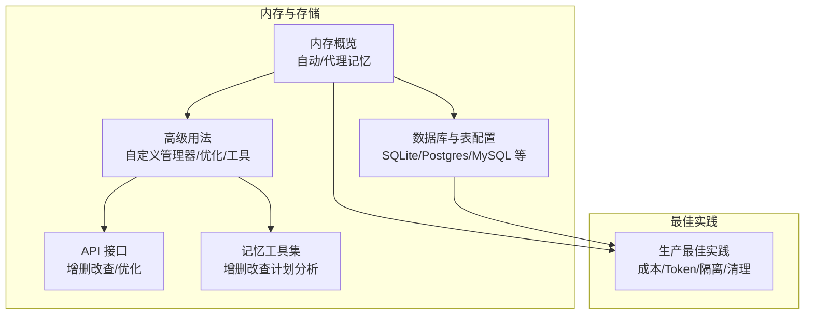
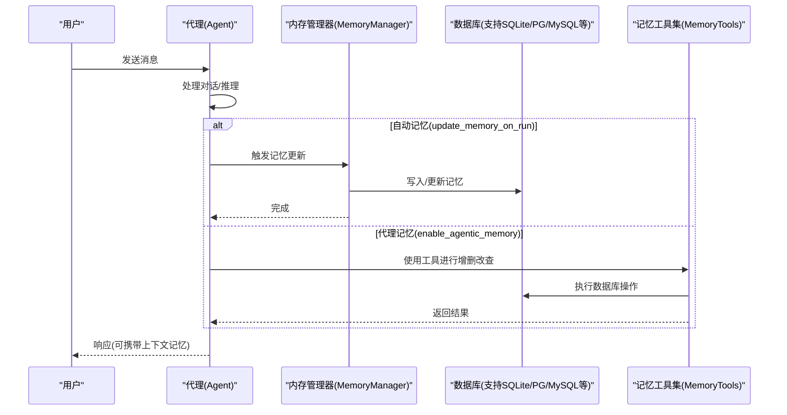
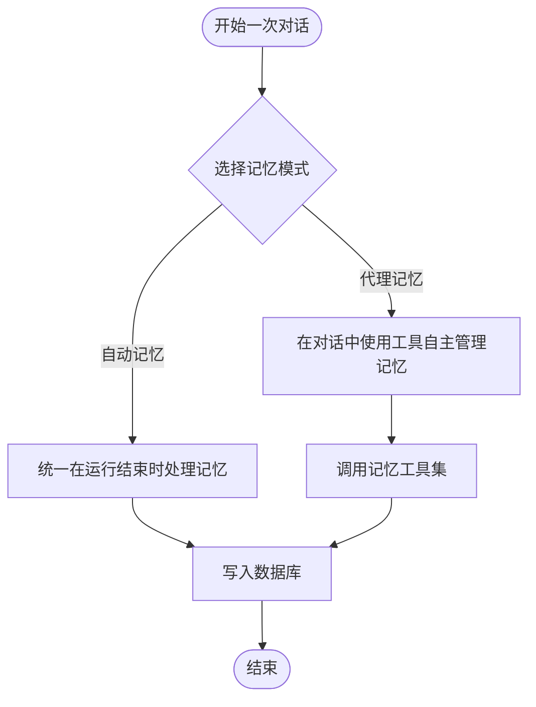
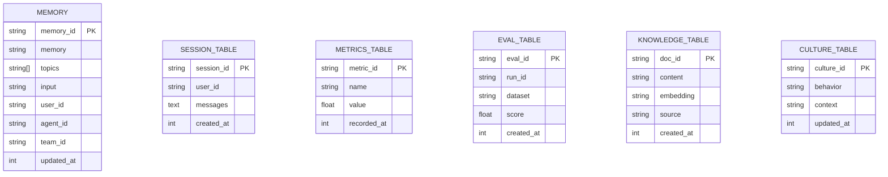
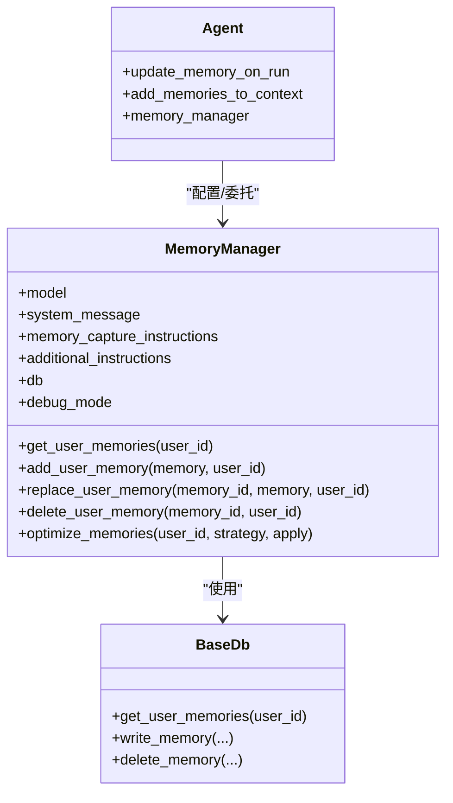
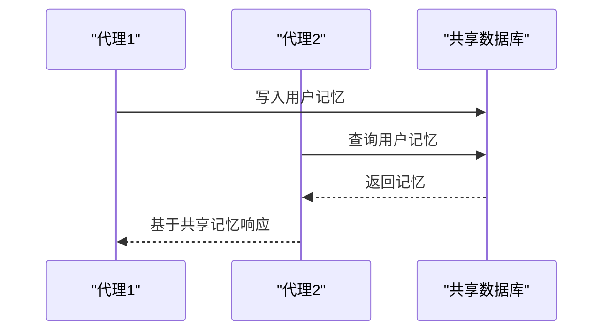
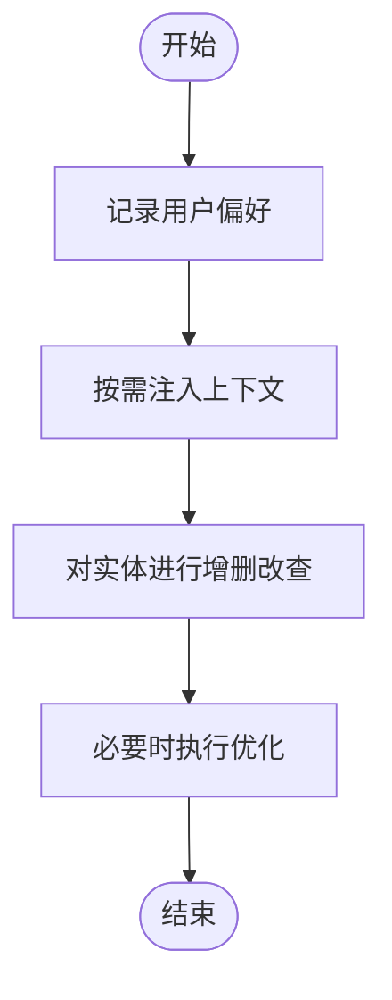
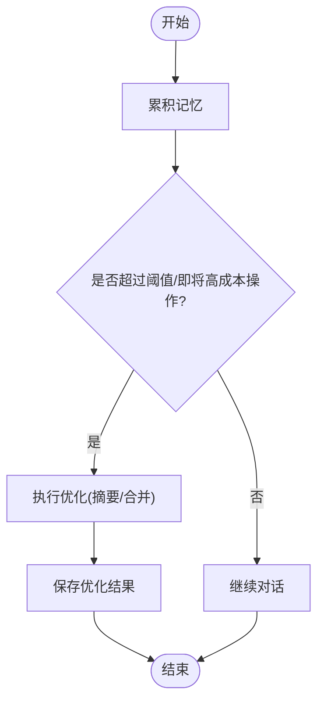
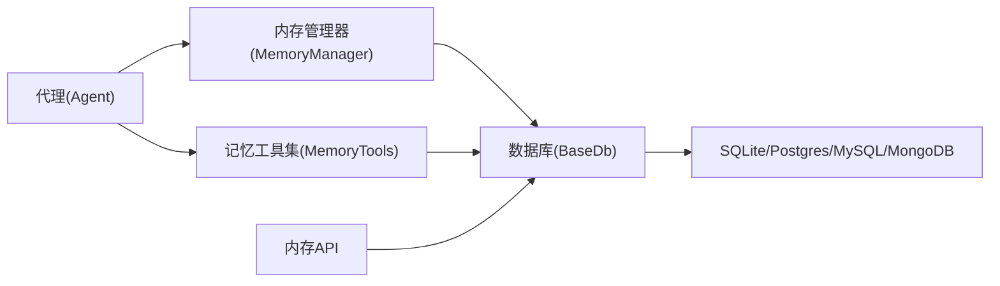

# 代理内存

<cite>
**本文引用的文件**
- [memory/overview.mdx](file://memory/overview.mdx)
- [memory/working-with-memories/overview.mdx](file://memory/working-with-memories/overview.mdx)
- [memory/working-with-memories/memory-optimization.mdx](file://memory/working-with-memories/memory-optimization.mdx)
- [memory/agent/agent-with-memory.mdx](file://memory/agent/agent-with-memory.mdx)
- [memory/agent/custom-memory-manager.mdx](file://memory/agent/custom-memory-manager.mdx)
- [memory/agent/share-memory-and-history-between-agents.mdx](file://memory/agent/share-memory-and-history-between-agents.mdx)
- [memory/best-practices.mdx](file://memory/best-practices.mdx)
- [database/overview.mdx](file://database/overview.mdx)
- [database/providers/selecting-tables.mdx](file://database/providers/selecting-tables.mdx)
- [_snippets/memory-manager-reference.mdx](file://_snippets/memory-manager-reference.mdx)
- [reference-api/schema/memory/get-memory-by-id.mdx](file://reference-api/schema/memory/get-memory-by-id.mdx)
- [reference-api/schema/memory/update-memory.mdx](file://reference-api/schema/memory/update-memory.mdx)
- [reference-api/schema/memory/delete-memory.mdx](file://reference-api/schema/memory/delete-memory.mdx)
- [reference-api/schema/memory/delete-multiple-memories.mdx](file://reference-api/schema/memory/delete-multiple-memories.mdx)
- [reference-api/schema/memory/optimize-user-memories.mdx](file://reference-api/schema/memory/optimize-user-memories.mdx)
- [tools/reasoning_tools/memory-tools.mdx](file://tools/reasoning_tools/memory-tools.mdx)
- [database/in-memory.mdx](file://database/in-memory.mdx)
- [reference/storage/in_memory.mdx](file://reference/storage/in_memory.mdx)
- [TBD/snippets/memory-sqlite-reference.mdx](file://TBD/snippets/memory-sqlite-reference.mdx)
- [reference/storage/migrations.mdx](file://reference/storage/migrations.mdx)
</cite>

## 目录
1. [简介](#简介)
2. [项目结构](#项目结构)
3. [核心组件](#核心组件)
4. [架构总览](#架构总览)
5. [详细组件分析](#详细组件分析)
6. [依赖关系分析](#依赖关系分析)
7. [性能考量](#性能考量)
8. [故障排查指南](#故障排查指南)
9. [结论](#结论)
10. [附录](#附录)

## 简介
本技术文档围绕“代理内存”主题，系统阐述单个代理的内存管理机制（自动记忆与代理记忆）、数据库与内存表配置、使用模式（用户偏好记忆、上下文记忆、实体记忆）、自定义内存管理器实现（内存指令定制与存储控制）、以及代理间内存共享（历史共享与状态同步）。文档同时提供多类代理的内存配置与使用场景示例路径，并以可视化图示帮助理解数据流与控制流。

## 项目结构
与代理内存相关的内容主要分布在以下模块：
- 内存概览与两种记忆模式：自动记忆与代理记忆
- 高级用法：自定义内存管理器、手动检索、优化策略
- 数据库与存储：支持多种数据库、自定义表名、迁移
- API 与工具：内存增删改查、优化接口、记忆工具集
- 最佳实践：成本控制、Token 消耗陷阱、用户隔离等

**章节来源**
- [memory/overview.mdx:18-92](file://memory/overview.mdx#L18-L92)
- [database/overview.mdx:105-130](file://database/overview.mdx#L105-L130)

## 核心组件
- 内存管理器（MemoryManager）
  - 负责用户记忆的创建、检索、更新、删除与优化
  - 支持自定义模型、系统提示、附加指令、过滤规则
- 代理（Agent）与记忆开关
  - 自动记忆：update_memory_on_run=True，在每次运行后统一处理
  - 代理记忆：enable_agentic_memory=True，由代理在对话中自主决策
- 数据库适配层
  - 支持 SQLite、Postgres、MySQL、MongoDB 等
  - 可自定义表名（会话、记忆、指标、评估、知识、文化）
- 记忆工具集（MemoryTools）
  - 提供 think、get_memories、add_memory、update_memory、delete_memory、analyze 等工具
- API 接口
  - 获取/更新/删除单条或多条记忆；优化用户记忆

**章节来源**
- [_snippets/memory-manager-reference.mdx:1-29](file://_snippets/memory-manager-reference.mdx#L1-L29)
- [memory/overview.mdx:38-92](file://memory/overview.mdx#L38-L92)
- [database/providers/selecting-tables.mdx:10-37](file://database/providers/selecting-tables.mdx#L10-L37)
- [tools/reasoning_tools/memory-tools.mdx:1-26](file://tools/reasoning_tools/memory-tools.mdx#L1-L26)
- [reference-api/schema/memory/get-memory-by-id.mdx:1-3](file://reference-api/schema/memory/get-memory-by-id.mdx#L1-L3)
- [reference-api/schema/memory/update-memory.mdx:1-3](file://reference-api/schema/memory/update-memory.mdx#L1-L3)
- [reference-api/schema/memory/delete-memory.mdx:1-3](file://reference-api/schema/memory/delete-memory.mdx#L1-L3)
- [reference-api/schema/memory/delete-multiple-memories.mdx:1-3](file://reference-api/schema/memory/delete-multiple-memories.mdx#L1-L3)
- [reference-api/schema/memory/optimize-user-memories.mdx:1-3](file://reference-api/schema/memory/optimize-user-memories.mdx#L1-L3)

## 架构总览
下图展示了从代理到数据库的内存管理流程，涵盖自动记忆与代理记忆两种路径，以及优化与工具调用的扩展点。

**图表来源**
- [memory/overview.mdx:38-92](file://memory/overview.mdx#L38-L92)
- [memory/working-with-memories/overview.mdx:14-42](file://memory/working-with-memories/overview.mdx#L14-L42)
- [tools/reasoning_tools/memory-tools.mdx:15-23](file://tools/reasoning_tools/memory-tools.mdx#L15-L23)

**章节来源**
- [memory/overview.mdx:38-92](file://memory/overview.mdx#L38-L92)
- [memory/working-with-memories/overview.mdx:14-42](file://memory/working-with-memories/overview.mdx#L14-L42)
- [tools/reasoning_tools/memory-tools.mdx:15-23](file://tools/reasoning_tools/memory-tools.mdx#L15-L23)

## 详细组件分析

### 组件一：自动记忆与代理记忆
- 自动记忆（update_memory_on_run=True）
  - 在每次运行结束后统一提取并写入记忆，无需人工干预
  - 适合大多数对话型应用，稳定且可预测
- 代理记忆（enable_agentic_memory=True）
  - 代理通过内置工具在对话中自主决定何时创建/更新/删除记忆
  - 更灵活但需要代理具备良好的记忆决策能力
- 互斥性
  - 同时启用两者时，代理记忆优先，自动记忆会被忽略

**图表来源**
- [memory/overview.mdx:42-92](file://memory/overview.mdx#L42-L92)

**章节来源**
- [memory/overview.mdx:42-92](file://memory/overview.mdx#L42-L92)

### 组件二：数据库与内存表配置
- 支持数据库
  - SQLite、Postgres、MySQL、MongoDB 等主流数据库
- 自定义表名
  - 可指定会话表、记忆表、指标表、评估表、知识表、文化表
- 迁移与版本
  - 提供迁移管理器，支持多表类型迁移

**图表来源**
- [memory/overview.mdx:148-165](file://memory/overview.mdx#L148-L165)
- [database/providers/selecting-tables.mdx:10-37](file://database/providers/selecting-tables.mdx#L10-L37)
- [reference/storage/migrations.mdx:145-170](file://reference/storage/migrations.mdx#L145-L170)

**章节来源**
- [database/overview.mdx:105-130](file://database/overview.mdx#L105-L130)
- [database/providers/selecting-tables.mdx:10-37](file://database/providers/selecting-tables.mdx#L10-L37)
- [reference/storage/migrations.mdx:145-170](file://reference/storage/migrations.mdx#L145-L170)

### 组件三：自定义内存管理器与存储控制
- 自定义内存管理器（MemoryManager）
  - 可指定模型、系统提示、附加指令、记忆捕获指令
  - 控制记忆生成与过滤逻辑，适用于隐私敏感场景
- 存储控制
  - 可关闭自动加入上下文（add_memories_to_context=False），仅收集不自动注入
  - 可指定自定义记忆表名

**图表来源**
- [_snippets/memory-manager-reference.mdx:1-29](file://_snippets/memory-manager-reference.mdx#L1-L29)
- [memory/working-with-memories/overview.mdx:14-42](file://memory/working-with-memories/overview.mdx#L14-L42)

**章节来源**
- [memory/working-with-memories/overview.mdx:14-42](file://memory/working-with-memories/overview.mdx#L14-L42)
- [_snippets/memory-manager-reference.mdx:1-29](file://_snippets/memory-manager-reference.mdx#L1-L29)

### 组件四：代理间内存共享与历史同步
- 共享机制
  - 多个代理连接同一数据库即可共享用户记忆
  - 通过相同 user_id 实现跨代理、团队、工作流的记忆一致性
- 历史同步
  - 可开启 add_history_to_context 将历史加入上下文
  - 适用于需要上下文连续性的多轮对话或协作场景

**图表来源**
- [memory/agent/share-memory-and-history-between-agents.mdx:13-60](file://memory/agent/share-memory-and-history-between-agents.mdx#L13-L60)

**章节来源**
- [memory/agent/share-memory-and-history-between-agents.mdx:13-60](file://memory/agent/share-memory-and-history-between-agents.mdx#L13-L60)

### 组件五：使用模式与场景
- 用户偏好记忆
  - 示例：记录用户偏好并用于后续对话优化
- 上下文记忆
  - 示例：关闭自动注入上下文，仅后台收集，避免 Token 增长
- 实体记忆
  - 示例：通过记忆工具集对特定实体进行增删改查

**图表来源**
- [memory/agent/agent-with-memory.mdx:15-65](file://memory/agent/agent-with-memory.mdx#L15-L65)
- [memory/working-with-memories/overview.mdx:52-65](file://memory/working-with-memories/overview.mdx#L52-L65)
- [tools/reasoning_tools/memory-tools.mdx:15-23](file://tools/reasoning_tools/memory-tools.mdx#L15-L23)

**章节来源**
- [memory/agent/agent-with-memory.mdx:15-65](file://memory/agent/agent-with-memory.mdx#L15-L65)
- [memory/working-with-memories/overview.mdx:52-65](file://memory/working-with-memories/overview.mdx#L52-L65)
- [tools/reasoning_tools/memory-tools.mdx:15-23](file://tools/reasoning_tools/memory-tools.mdx#L15-L23)

### 组件六：内存优化与成本控制
- 优化策略
  - 摘要策略（SUMMARIZE）将多条记忆合并为一条，显著降低 Token 消耗
- 成本陷阱与缓解
  - 代理记忆可能触发嵌套 LLM 调用，导致 Token 濴增
  - 建议：默认使用自动记忆；必要时使用廉价模型处理记忆；定期修剪；限制工具调用次数
- 监控与告警
  - 定期检查用户记忆数量，超过阈值及时修剪

**图表来源**
- [memory/working-with-memories/memory-optimization.mdx:78-105](file://memory/working-with-memories/memory-optimization.mdx#L78-L105)
- [memory/best-practices.mdx:21-94](file://memory/best-practices.mdx#L21-L94)

**章节来源**
- [memory/working-with-memories/memory-optimization.mdx:78-105](file://memory/working-with-memories/memory-optimization.mdx#L78-L105)
- [memory/best-practices.mdx:21-94](file://memory/best-practices.mdx#L21-L94)

## 依赖关系分析
- 代理依赖内存管理器或记忆工具集
- 内存管理器依赖数据库适配层
- 数据库适配层支持多种后端（SQLite/Postgres/MySQL/MongoDB）
- API 层提供对记忆的增删改查与优化接口

**图表来源**
- [_snippets/memory-manager-reference.mdx:1-29](file://_snippets/memory-manager-reference.mdx#L1-L29)
- [tools/reasoning_tools/memory-tools.mdx:15-23](file://tools/reasoning_tools/memory-tools.mdx#L15-L23)
- [database/overview.mdx:105-130](file://database/overview.mdx#L105-L130)

**章节来源**
- [_snippets/memory-manager-reference.mdx:1-29](file://_snippets/memory-manager-reference.mdx#L1-L29)
- [tools/reasoning_tools/memory-tools.mdx:15-23](file://tools/reasoning_tools/memory-tools.mdx#L15-L23)
- [database/overview.mdx:105-130](file://database/overview.mdx#L105-L130)

## 性能考量
- Token 消耗控制
  - 自动记忆优于代理记忆（后者易引发嵌套调用）
  - 使用廉价模型处理记忆任务
- 记忆修剪与优化
  - 定期执行摘要策略合并记忆
  - 设置工具调用上限，防止滥用
- 用户隔离
  - 显式传入 user_id，避免不同用户记忆混杂
- 表结构与索引
  - 为 user_id、updated_at 等字段建立索引，提升查询效率

[本节为通用指导，无需列出具体文件来源]

## 故障排查指南
- 未设置 user_id 导致记忆错乱
  - 症状：所有用户的记忆混在一起
  - 解决：显式传入 user_id
- 同时启用自动与代理记忆
  - 症状：自动记忆被忽略
  - 解决：二选一，优先使用代理记忆
- 代理记忆 Token 激增
  - 症状：对话成本飙升
  - 解决：改为自动记忆；或使用廉价模型；限制工具调用次数
- 记忆增长过快
  - 症状：上下文膨胀
  - 解决：定期优化；设置修剪策略；监控记忆数量

**章节来源**
- [memory/best-practices.mdx:144-178](file://memory/best-practices.mdx#L144-L178)
- [memory/best-practices.mdx:180-196](file://memory/best-practices.mdx#L180-L196)

## 结论
代理内存通过自动记忆与代理记忆两种模式，结合数据库与工具集，实现了对用户偏好、上下文与实体的持久化管理。配合优化策略与最佳实践，可在保证个性化体验的同时有效控制成本与风险。跨代理共享机制进一步增强了多智能体系统的协同能力。

[本节为总结，无需列出具体文件来源]

## 附录

### A. 代码示例路径（不含代码内容）
- 单代理持久化记忆
  - [memory/agent/agent-with-memory.mdx:15-65](file://memory/agent/agent-with-memory.mdx#L15-L65)
- 自定义内存管理器
  - [memory/agent/custom-memory-manager.mdx:11-53](file://memory/agent/custom-memory-manager.mdx#L11-L53)
- 代理间共享记忆与历史
  - [memory/agent/share-memory-and-history-between-agents.mdx:13-60](file://memory/agent/share-memory-and-history-between-agents.mdx#L13-L60)
- 高级用法：自定义管理器、手动检索、优化策略
  - [memory/working-with-memories/overview.mdx:14-166](file://memory/working-with-memories/overview.mdx#L14-L166)
  - [memory/working-with-memories/memory-optimization.mdx:7-105](file://memory/working-with-memories/memory-optimization.mdx#L7-L105)
- 生产最佳实践
  - [memory/best-practices.mdx:10-202](file://memory/best-practices.mdx#L10-L202)

### B. 数据库与存储参考
- 数据库概览与异步支持
  - [database/overview.mdx:105-130](file://database/overview.mdx#L105-L130)
- 自定义表名
  - [database/providers/selecting-tables.mdx:10-37](file://database/providers/selecting-tables.mdx#L10-L37)
- 内存表字段模型
  - [memory/overview.mdx:148-165](file://memory/overview.mdx#L148-L165)
- 迁移与表类型
  - [reference/storage/migrations.mdx:145-170](file://reference/storage/migrations.mdx#L145-L170)
- 内存工具集
  - [tools/reasoning_tools/memory-tools.mdx:15-23](file://tools/reasoning_tools/memory-tools.mdx#L15-L23)
- 内存管理器参数与方法
  - [_snippets/memory-manager-reference.mdx:1-29](file://_snippets/memory-manager-reference.mdx#L1-L29)
- SQLite 内存表参数
  - [TBD/snippets/memory-sqlite-reference.mdx:1-8](file://TBD/snippets/memory-sqlite-reference.mdx#L1-L8)
- 内存 API（获取/更新/删除/批量删除/优化）
  - [reference-api/schema/memory/get-memory-by-id.mdx:1-3](file://reference-api/schema/memory/get-memory-by-id.mdx#L1-L3)
  - [reference-api/schema/memory/update-memory.mdx:1-3](file://reference-api/schema/memory/update-memory.mdx#L1-L3)
  - [reference-api/schema/memory/delete-memory.mdx:1-3](file://reference-api/schema/memory/delete-memory.mdx#L1-L3)
  - [reference-api/schema/memory/delete-multiple-memories.mdx:1-3](file://reference-api/schema/memory/delete-multiple-memories.mdx#L1-L3)
  - [reference-api/schema/memory/optimize-user-memories.mdx:1-3](file://reference-api/schema/memory/optimize-user-memories.mdx#L1-L3)
- 内存数据库（In-Memory）
  - [database/in-memory.mdx:16-25](file://database/in-memory.mdx#L16-L25)
  - [reference/storage/in_memory.mdx:5](file://reference/storage/in_memory.mdx#L5)