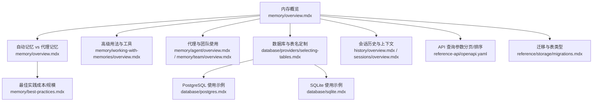
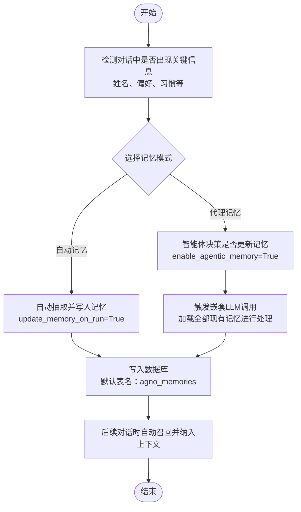
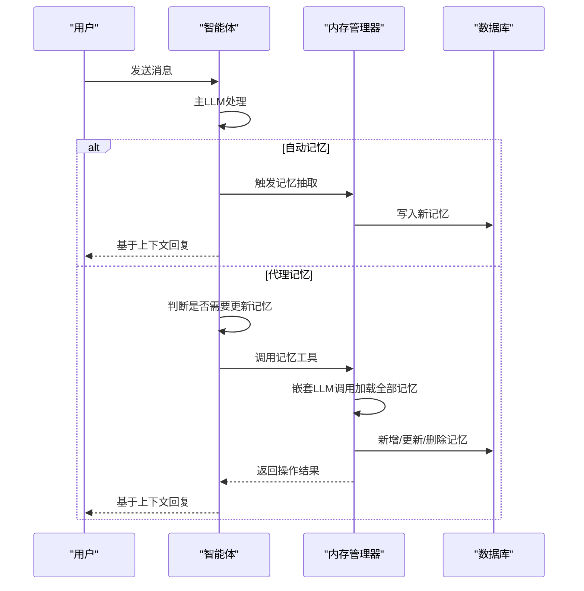
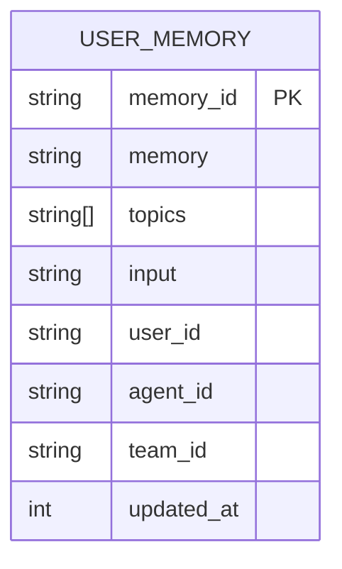
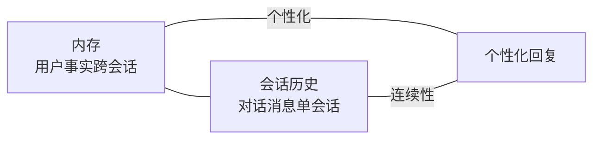
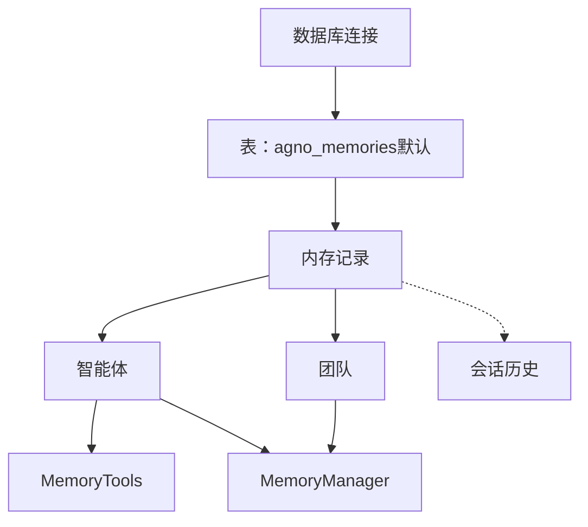

# 内存基础概念

<cite>
**本文引用的文件**
- [memory/overview.mdx](file://memory/overview.mdx)
- [memory/best-practices.mdx](file://memory/best-practices.mdx)
- [memory/agent/overview.mdx](file://memory/agent/overview.mdx)
- [memory/team/overview.mdx](file://memory/team/overview.mdx)
- [memory/working-with-memories/overview.mdx](file://memory/working-with-memories/overview.mdx)
- [_snippets/memory-manager-reference.mdx](file://_snippets/memory-manager-reference.mdx)
- [database/providers/selecting-tables.mdx](file://database/providers/selecting-tables.mdx)
- [database/postgres.mdx](file://database/postgres.mdx)
- [database/sqlite.mdx](file://database/sqlite.mdx)
- [history/overview.mdx](file://history/overview.mdx)
- [sessions/overview.mdx](file://sessions/overview.mdx)
- [reference-api/openapi.yaml](file://reference-api/openapi.yaml)
- [reference/storage/migrations.mdx](file://reference/storage/migrations.mdx)
</cite>

## 目录
1. [引言](#引言)
2. [项目结构](#项目结构)
3. [核心组件](#核心组件)
4. [架构总览](#架构总览)
5. [详细组件分析](#详细组件分析)
6. [依赖关系分析](#依赖关系分析)
7. [性能考量](#性能考量)
8. [故障排查指南](#故障排查指南)
9. [结论](#结论)
10. [附录](#附录)

## 引言
本文件系统性阐述“内存”在智能体中的基础概念与工作机制，重点区分“自动记忆”与“代理记忆”两种模式，并给出从信息提取、存储到检索的完整工作流程。同时，文档化内存的数据模型、与会话历史的区别、适用场景与最佳实践，并提供基本设置示例与自定义表名的配置方法。

## 项目结构
围绕“内存”的知识分布在以下模块：
- 概念与入门：memory/overview.mdx
- 最佳实践与成本控制：memory/best-practices.mdx
- 代理与团队使用：memory/agent/overview.mdx、memory/team/overview.mdx
- 高级用法与工具：memory/working-with-memories/overview.mdx
- 内存管理器参考：_snippets/memory-manager-reference.mdx
- 数据库与表名定制：database/providers/selecting-tables.mdx、database/postgres.mdx、database/sqlite.mdx
- 会话历史与上下文：history/overview.mdx、sessions/overview.mdx
- API 查询参数：reference-api/openapi.yaml
- 迁移与表类型：reference/storage/migrations.mdx

**图表来源**
- [memory/overview.mdx:1-202](file://memory/overview.mdx#L1-L202)
- [memory/best-practices.mdx:1-202](file://memory/best-practices.mdx#L1-L202)
- [memory/working-with-memories/overview.mdx:1-166](file://memory/working-with-memories/overview.mdx#L1-L166)
- [database/providers/selecting-tables.mdx:1-37](file://database/providers/selecting-tables.mdx#L1-L37)
- [database/postgres.mdx:1-47](file://database/postgres.mdx#L1-L47)
- [database/sqlite.mdx:1-29](file://database/sqlite.mdx#L1-L29)
- [history/overview.mdx:1-49](file://history/overview.mdx#L1-L49)
- [sessions/overview.mdx:47-86](file://sessions/overview.mdx#L47-L86)
- [reference-api/openapi.yaml:3492-3740](file://reference-api/openapi.yaml#L3492-L3740)
- [reference/storage/migrations.mdx:145-170](file://reference/storage/migrations.mdx#L145-L170)

**章节来源**
- [memory/overview.mdx:1-202](file://memory/overview.mdx#L1-L202)
- [memory/best-practices.mdx:1-202](file://memory/best-practices.mdx#L1-L202)
- [memory/working-with-memories/overview.mdx:1-166](file://memory/working-with-memories/overview.mdx#L1-L166)
- [database/providers/selecting-tables.mdx:1-37](file://database/providers/selecting-tables.mdx#L1-L37)
- [database/postgres.mdx:1-47](file://database/postgres.mdx#L1-L47)
- [database/sqlite.mdx:1-29](file://database/sqlite.mdx#L1-L29)
- [history/overview.mdx:1-49](file://history/overview.mdx#L1-L49)
- [sessions/overview.mdx:47-86](file://sessions/overview.mdx#L47-L86)
- [reference-api/openapi.yaml:3492-3740](file://reference-api/openapi.yaml#L3492-L3740)
- [reference/storage/migrations.mdx:145-170](file://reference/storage/migrations.mdx#L145-L170)

## 核心组件
- 内存管理器（MemoryManager）
  - 负责用户记忆的创建、检索、更新、删除与优化
  - 支持按任务描述更新记忆、异步操作、检索策略（最近N条、最早N条、语义相似）
- 自动记忆（update_memory_on_run=True）
  - 在每次对话运行结束后自动抽取并写入记忆，无需人工干预
- 代理记忆（enable_agentic_memory=True）
  - 由智能体在对话中自主决定何时新增、更新或删除记忆，具备更强灵活性但需注意成本与复杂度
- 数据存储与表名定制
  - 默认表名为“agno_memories”，可自定义为任意名称；支持多种数据库后端（PostgreSQL、SQLite等）

**章节来源**
- [_snippets/memory-manager-reference.mdx:1-58](file://_snippets/memory-manager-reference.mdx#L1-L58)
- [memory/overview.mdx:38-99](file://memory/overview.mdx#L38-L99)
- [memory/working-with-memories/overview.mdx:10-44](file://memory/working-with-memories/overview.mdx#L10-L44)

## 架构总览
下图展示了从消息输入到记忆生成、存储与检索的整体流程，以及两种记忆模式的差异：

**图表来源**
- [memory/overview.mdx:10-99](file://memory/overview.mdx#L10-L99)
- [memory/best-practices.mdx:25-52](file://memory/best-practices.mdx#L25-L52)

## 详细组件分析

### 组件一：自动记忆 vs 代理记忆
- 自动记忆
  - 特点：稳定、可预测、开销可控
  - 适用：客服、个人助理、需要一致记忆行为的对话应用
  - 启用方式：在智能体初始化时设置“在运行后更新记忆”
- 代理记忆
  - 特点：灵活、强推理能力，但成本高、易膨胀
  - 适用：复杂多轮交互、需要实时记忆决策的场景
  - 成本陷阱：每次记忆操作都会触发一次嵌套LLM调用，随着记忆数量增长，成本呈指数上升
  - 缓解策略：优先使用自动记忆；必要时采用廉价模型执行记忆任务；通过指令约束减少无效更新；定期修剪；限制工具调用次数

**图表来源**
- [memory/overview.mdx:38-92](file://memory/overview.mdx#L38-L92)
- [memory/best-practices.mdx:25-92](file://memory/best-practices.mdx#L25-L92)

**章节来源**
- [memory/overview.mdx:38-92](file://memory/overview.mdx#L38-L92)
- [memory/best-practices.mdx:21-92](file://memory/best-practices.mdx#L21-L92)

### 组件二：内存数据模型
内存记录包含以下字段：
- memory_id：记忆唯一标识
- memory：记忆内容（字符串）
- topics：主题列表
- input：生成该记忆的输入文本
- user_id：用户标识
- agent_id：所属智能体标识
- team_id：所属团队标识
- updated_at：最后更新时间戳

**图表来源**
- [memory/overview.mdx:148-165](file://memory/overview.mdx#L148-L165)

**章节来源**
- [memory/overview.mdx:148-165](file://memory/overview.mdx#L148-L165)

### 组件三：与会话历史的区别
- 内存（Memory）
  - 存储“用户事实”（如“Sarah 偏好邮件”），跨会话持久化
  - 用于个性化推荐、上下文记忆、建立关系
- 会话历史（Session History）
  - 存储“对话消息”，保证连续性（如“我们刚才讨论了什么？”）
  - 用于多轮对话的上下文延续

**图表来源**
- [memory/overview.mdx:14-16](file://memory/overview.mdx#L14-L16)
- [history/overview.mdx:10-19](file://history/overview.mdx#L10-L19)

**章节来源**
- [memory/overview.mdx:14-16](file://memory/overview.mdx#L14-L16)
- [history/overview.mdx:10-19](file://history/overview.mdx#L10-L19)

### 组件四：基本设置示例
- 自动记忆示例
  - 初始化数据库与智能体，开启“在运行后更新记忆”
  - 示例路径：[memory/overview.mdx:20-36](file://memory/overview.mdx#L20-L36)
- 代理记忆示例
  - 初始化数据库与智能体，开启“启用代理记忆”
  - 示例路径：[memory/overview.mdx:68-88](file://memory/overview.mdx#L68-L88)
- 手动检索记忆
  - 使用“获取用户记忆”方法进行调试或展示
  - 示例路径：[memory/overview.mdx:123-146](file://memory/overview.mdx#L123-L146)

**章节来源**
- [memory/overview.mdx:20-36](file://memory/overview.mdx#L20-L36)
- [memory/overview.mdx:68-88](file://memory/overview.mdx#L68-L88)
- [memory/overview.mdx:123-146](file://memory/overview.mdx#L123-L146)

### 组件五：自定义表名与数据库配置
- 默认表名
  - 默认存储表名为“agno_memories”，若不存在则首次写入时自动创建
- 自定义表名
  - 可通过数据库连接参数指定“memory_table”来自定义表名
  - 示例路径：[memory/overview.mdx:100-121](file://memory/overview.mdx#L100-L121)
  - 示例路径：[database/providers/selecting-tables.mdx:12-37](file://database/providers/selecting-tables.mdx#L12-L37)
- 数据库支持
  - PostgreSQL：示例与参数说明
    - 示例路径：[database/postgres.mdx:9-22](file://database/postgres.mdx#L9-L22)
    - 参数片段：[database/postgres.mdx:40-47](file://database/postgres.mdx#L40-L47)
  - SQLite：示例与参数说明
    - 示例路径：[database/sqlite.mdx:9-20](file://database/sqlite.mdx#L9-L20)
    - 参数片段：[database/sqlite.mdx:22-29](file://database/sqlite.mdx#L22-L29)

**章节来源**
- [memory/overview.mdx:94-121](file://memory/overview.mdx#L94-L121)
- [database/providers/selecting-tables.mdx:12-37](file://database/providers/selecting-tables.mdx#L12-L37)
- [database/postgres.mdx:9-22](file://database/postgres.mdx#L9-L22)
- [database/sqlite.mdx:9-20](file://database/sqlite.mdx#L9-L20)

### 组件六：高级用法与工具
- 定制内存管理器
  - 选择模型、添加隐私指令、控制记忆提取规则
  - 示例路径：[memory/working-with-memories/overview.mdx:14-44](file://memory/working-with-memories/overview.mdx#L14-L44)
- 控制上下文注入
  - 禁用自动注入以降低上下文开销
  - 示例路径：[memory/working-with-memories/overview.mdx:52-65](file://memory/working-with-memories/overview.mdx#L52-L65)
- 记忆优化
  - 对大量记忆进行合并与摘要，减少上下文成本
  - 示例路径：[memory/working-with-memories/overview.mdx:77-88](file://memory/working-with-memories/overview.mdx#L77-L88)
- 使用记忆工具
  - 显式创建/检索/更新/删除记忆，适合需要精细控制的场景
  - 示例路径：[memory/working-with-memories/overview.mdx:100-134](file://memory/working-with-memories/overview.mdx#L100-L134)
- 多智能体共享记忆
  - 多个智能体连接同一数据库即可共享用户记忆
  - 示例路径：[memory/working-with-memories/overview.mdx:140-158](file://memory/working-with-memories/overview.mdx#L140-L158)

**章节来源**
- [memory/working-with-memories/overview.mdx:14-44](file://memory/working-with-memories/overview.mdx#L14-L44)
- [memory/working-with-memories/overview.mdx:52-65](file://memory/working-with-memories/overview.mdx#L52-L65)
- [memory/working-with-memories/overview.mdx:77-88](file://memory/working-with-memories/overview.mdx#L77-L88)
- [memory/working-with-memories/overview.mdx:100-134](file://memory/working-with-memories/overview.mdx#L100-L134)
- [memory/working-with-memories/overview.mdx:140-158](file://memory/working-with-memories/overview.mdx#L140-L158)

### 组件七：API 查询参数（分页/排序/过滤）
- 分页与排序
  - limit：每页返回的记忆数量，默认20
  - page：页码，默认1
  - sort_by：排序字段，默认updated_at
  - sort_order：排序顺序，默认desc
- 过滤
  - memory_id：按记忆ID查询
  - user_id：按用户ID查询
  - db_id：按数据库ID查询
  - table：按表名查询

**章节来源**
- [reference-api/openapi.yaml:3492-3740](file://reference-api/openapi.yaml#L3492-L3740)

### 组件八：迁移与表类型
- 支持的数据库类型
  - PostgreSQL、SQLite、MySQL、SingleStore
- 表类型
  - memory：智能体记忆存储
  - session：智能体会话数据
  - metrics：性能与使用指标
  - eval：评估结果
  - knowledge：知识库条目
  - culture：文化与行为数据

**章节来源**
- [reference/storage/migrations.mdx:145-170](file://reference/storage/migrations.mdx#L145-L170)

## 依赖关系分析
- 内存与数据库
  - 内存持久化依赖数据库连接；默认表名为“agno_memories”，可自定义
- 内存与会话历史
  - 内存关注“用户事实”，历史关注“对话消息”；二者互补
- 内存与智能体/团队
  - 智能体与团队均可启用自动/代理记忆；多智能体可通过同一数据库共享记忆
- 内存与工具
  - MemoryTools 提供显式记忆操作；MemoryManager 提供统一的记忆生命周期管理

**图表来源**
- [memory/overview.mdx:94-121](file://memory/overview.mdx#L94-L121)
- [memory/working-with-memories/overview.mdx:100-134](file://memory/working-with-memories/overview.mdx#L100-L134)
- [history/overview.mdx:10-19](file://history/overview.mdx#L10-L19)

**章节来源**
- [memory/overview.mdx:94-121](file://memory/overview.mdx#L94-L121)
- [memory/working-with-memories/overview.mdx:100-134](file://memory/working-with-memories/overview.mdx#L100-L134)
- [history/overview.mdx:10-19](file://history/overview.mdx#L10-L19)

## 性能考量
- 自动记忆更高效，适合大多数场景
- 代理记忆成本高，建议：
  - 使用廉价模型执行记忆任务
  - 通过指令约束减少无效更新
  - 定期修剪旧记忆
  - 限制工具调用次数
  - 在高成本操作前进行记忆优化
- 上下文注入控制
  - 关闭自动注入可降低上下文开销，配合工具检索使用

**章节来源**
- [memory/best-practices.mdx:54-92](file://memory/best-practices.mdx#L54-L92)
- [memory/working-with-memories/overview.mdx:67-88](file://memory/working-with-memories/overview.mdx#L67-L88)

## 故障排查指南
- 用户ID缺失导致记忆混用
  - 症状：不同用户的记忆被混合
  - 解决：始终显式传入 user_id
  - 参考：[memory/best-practices.mdx:146-160](file://memory/best-practices.mdx#L146-L160)
- 同时启用两种模式导致行为异常
  - 症状：同时设置“自动记忆”和“代理记忆”时，代理模式覆盖自动模式
  - 解决：二选一
  - 参考：[memory/overview.mdx:90-92](file://memory/overview.mdx#L90-L92)
- 记忆数量异常增长
  - 建议：监控记忆数量并定期修剪
  - 参考：[memory/best-practices.mdx:180-196](file://memory/best-practices.mdx#L180-L196)
- 数据库迁移问题
  - 症状：插入错误、列不匹配
  - 解决：运行迁移脚本并重启实例；必要时强制迁移
  - 参考：[other/database-migrations.mdx:125-146](file://other/database-migrations.mdx#L125-L146)

**章节来源**
- [memory/best-practices.mdx:146-196](file://memory/best-practices.mdx#L146-L196)
- [memory/overview.mdx:90-92](file://memory/overview.mdx#L90-L92)
- [other/database-migrations.mdx:125-146](file://other/database-migrations.mdx#L125-L146)

## 结论
- 默认优先使用自动记忆，确保稳定性与成本可控
- 仅在需要实时记忆决策或用户直接操控记忆时启用代理记忆
- 通过自定义表名、上下文控制、记忆优化与定期修剪，实现可扩展、可维护的记忆系统
- 将“内存”（用户事实）与“会话历史”（对话消息）清晰分离，分别满足个性化与连续性的需求

## 附录
- 代理与团队使用
  - 代理：[memory/agent/overview.mdx:13-72](file://memory/agent/overview.mdx#L13-L72)
  - 团队：[memory/team/overview.mdx:8-30](file://memory/team/overview.mdx#L8-L30)
- 会话与上下文
  - 会话概述：[sessions/overview.mdx:47-86](file://sessions/overview.mdx#L47-L86)
  - 历史概述：[history/overview.mdx:10-19](file://history/overview.mdx#L10-L19)