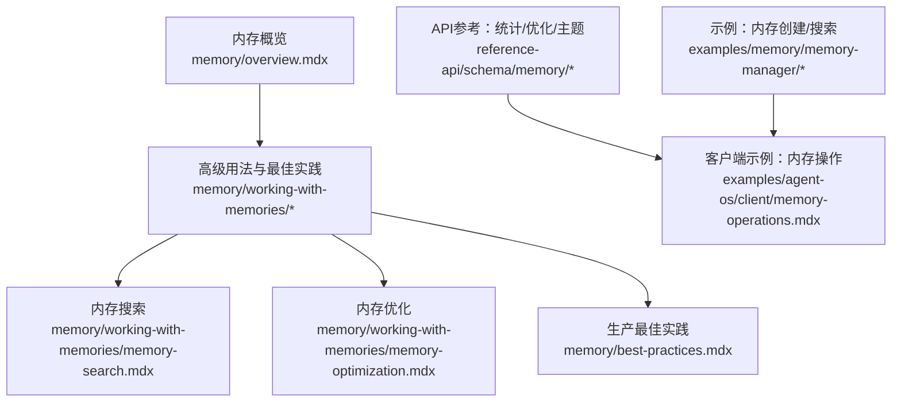
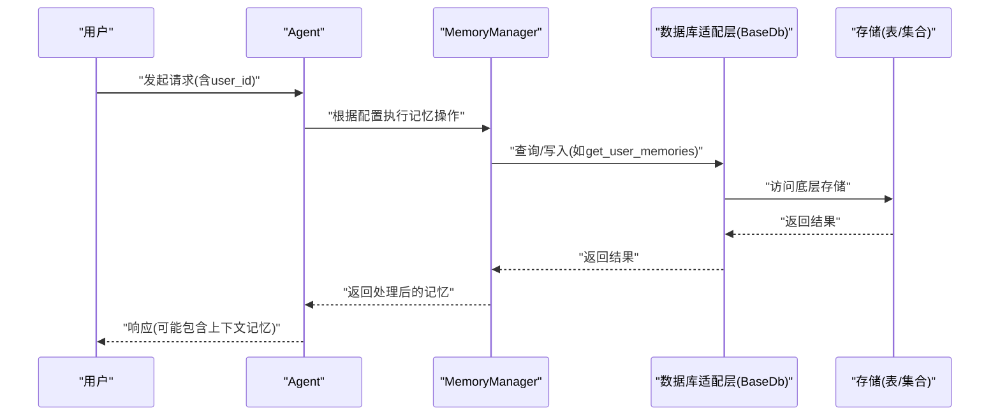
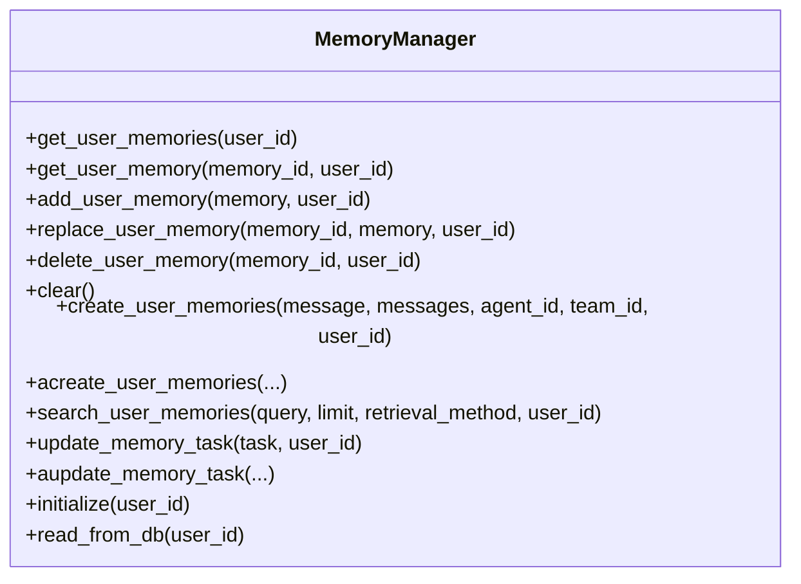
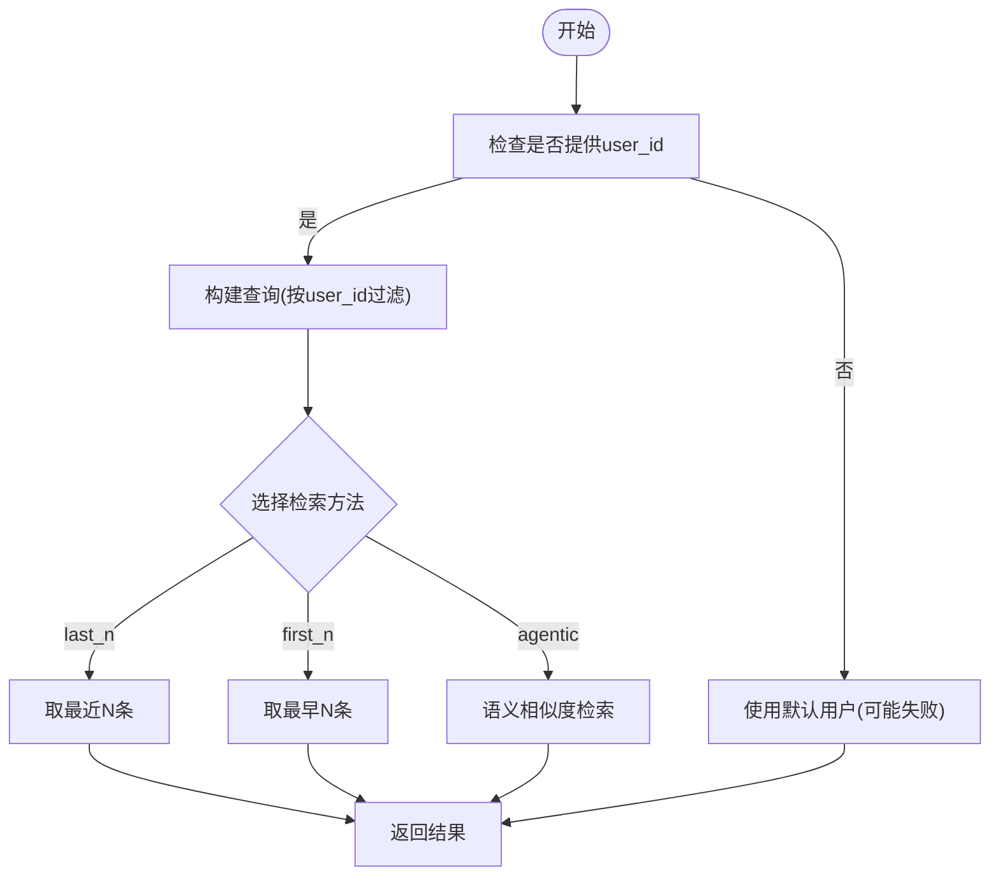
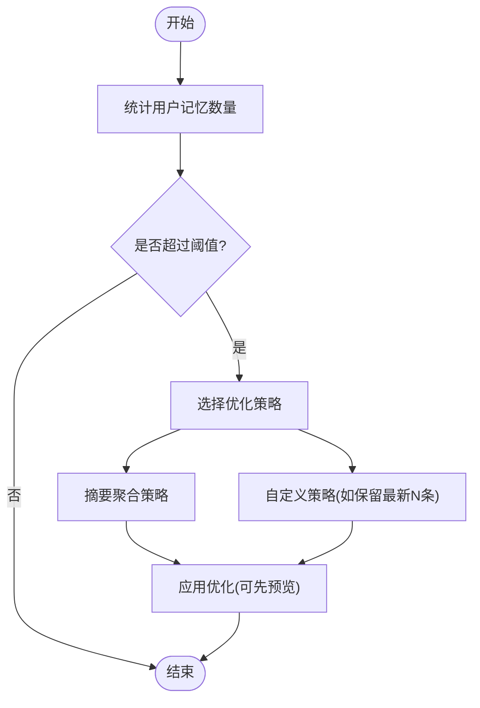
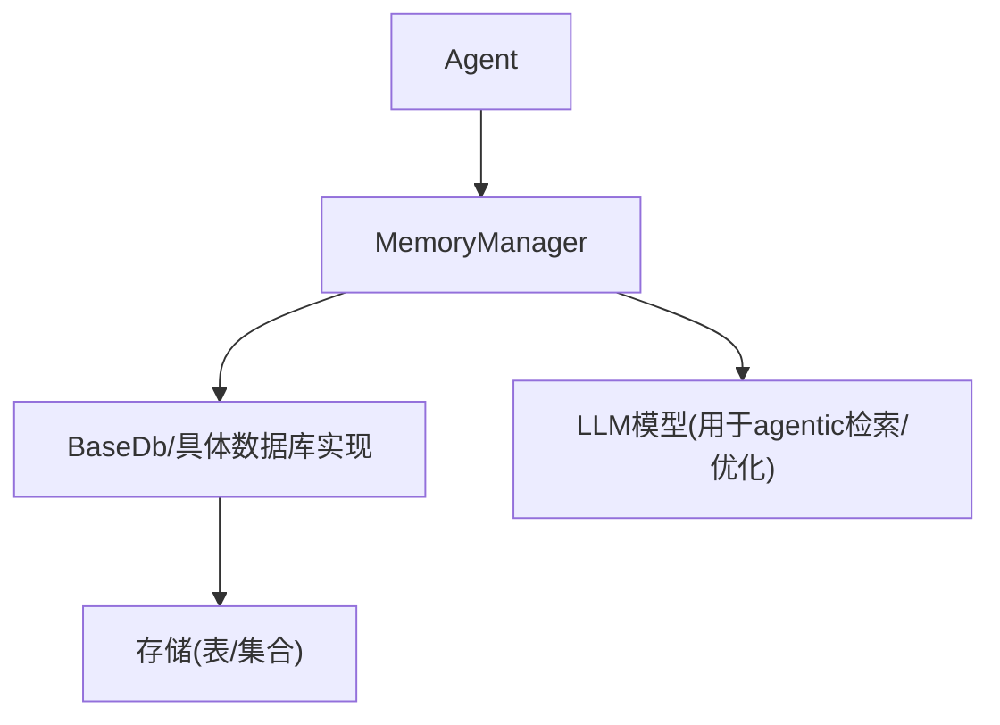

# 内存操作与管理

<cite>
**本文引用的文件**
- [memory-manager-reference.mdx](file://_snippets/memory-manager-reference.mdx)
- [memory-overview.mdx](file://memory/overview.mdx)
- [memory-best-practices.mdx](file://memory/best-practices.mdx)
- [memory-working-overview.mdx](file://memory/working-with-memories/overview.mdx)
- [memory-search.mdx](file://memory/working-with-memories/memory-search.mdx)
- [memory-optimization.mdx](file://memory/working-with-memories/memory-optimization.mdx)
- [memory-operations.mdx](file://examples/agent-os/client/memory-operations.mdx)
- [memory-creation.mdx](file://examples/memory/memory-manager/memory-creation.mdx)
- [memory-search-example.mdx](file://examples/memory/memory-manager/memory-search.mdx)
- [optimize-custom-strategy.mdx](file://examples/memory/optimize-memories/custom-memory-strategy.mdx)
- [get-user-memory-statistics.mdx](file://reference-api/schema/memory/get-user-memory-statistics.mdx)
- [optimize-user-memories.mdx](file://reference-api/schema/memory/optimize-user-memories.mdx)
- [get-memory-topics.mdx](file://reference-api/schema/memory/get-memory-topics.mdx)
</cite>

## 目录
1. [简介](#简介)
2. [项目结构](#项目结构)
3. [核心组件](#核心组件)
4. [架构总览](#架构总览)
5. [详细组件分析](#详细组件分析)
6. [依赖关系分析](#依赖关系分析)
7. [性能考量](#性能考量)
8. [故障排查指南](#故障排查指南)
9. [结论](#结论)
10. [附录](#附录)

## 简介
本技术文档围绕“内存操作与管理”展开，系统阐述如何在系统中手动创建、检索、更新与删除用户记忆（Memories），重点解析 get_user_memories 方法的参数与行为，并深入说明基于 MemoryManager 的内存搜索机制（按用户ID、主题、时间顺序与语义相似度等）。同时，文档覆盖内存优化策略（存储策略选择、索引优化、性能调优）、清理与维护最佳实践（定期清理过期记忆与批量删除策略），并提供可直接定位到仓库中的实际代码示例路径，帮助读者快速落地。

## 项目结构
与“内存操作与管理”直接相关的文档主要分布在以下位置：
- 概览与基础用法：memory/overview.mdx
- 高级用法与最佳实践：memory/working-with-memories/* 与 memory/best-practices.mdx
- API 参考（统计与优化接口）：reference-api/schema/memory/*
- 示例：examples/memory/* 与 examples/agent-os/client/memory-operations.mdx

图表来源
- [memory-overview.mdx](file://memory/overview.mdx)
- [memory-working-overview.mdx](file://memory/working-with-memories/overview.mdx)
- [memory-search.mdx](file://memory/working-with-memories/memory-search.mdx)
- [memory-optimization.mdx](file://memory/working-with-memories/memory-optimization.mdx)
- [memory-best-practices.mdx](file://memory/best-practices.mdx)
- [get-user-memory-statistics.mdx](file://reference-api/schema/memory/get-user-memory-statistics.mdx)
- [optimize-user-memories.mdx](file://reference-api/schema/memory/optimize-user-memories.mdx)
- [get-memory-topics.mdx](file://reference-api/schema/memory/get-memory-topics.mdx)
- [memory-operations.mdx](file://examples/agent-os/client/memory-operations.mdx)
- [memory-creation.mdx](file://examples/memory/memory-manager/memory-creation.mdx)
- [memory-search-example.mdx](file://examples/memory/memory-manager/memory-search.mdx)

章节来源
- [memory-overview.mdx](file://memory/overview.mdx)
- [memory-working-overview.mdx](file://memory/working-with-memories/overview.mdx)

## 核心组件
- MemoryManager：负责用户记忆的创建、检索、更新、删除与优化；支持多种检索方法（last_n、first_n、agentic）。
- Agent：通过配置启用自动或代理式记忆管理，并可调用 MemoryManager 执行具体操作。
- 数据库适配层：通过 BaseDb/具体数据库实现（如 SQLite、Postgres、MongoDB、Redis 等）持久化记忆。
- 记忆数据模型：包含 memory_id、memory、topics、input、user_id、agent_id、team_id、updated_at 等字段。

章节来源
- [_snippets/memory-manager-reference.mdx](file://_snippets/memory-manager-reference.mdx)
- [memory-overview.mdx](file://memory/overview.mdx)

## 架构总览
下图展示了从 Agent 到 MemoryManager，再到数据库的典型调用链路与职责分工：

图表来源
- [memory-overview.mdx](file://memory/overview.mdx)
- [memory-working-overview.mdx](file://memory/working-with-memories/overview.mdx)
- [memory-manager-reference.mdx](file://_snippets/memory-manager-reference.mdx)

## 详细组件分析

### MemoryManager 组件
- 职责：统一管理用户记忆的生命周期，包括创建、检索、更新、删除、清理与优化。
- 关键方法族：
  - 用户记忆管理：get_user_memories、get_user_memory、add_user_memory、replace_user_memory、delete_user_memory、clear
  - 记忆创建与搜索：create_user_memories/acreate_user_memories、search_user_memories
  - 记忆任务管理：update_memory_task/aupdate_memory_task
  - 工具方法：initialize、read_from_db
- 检索方法：
  - last_n：最近记忆
  - first_n：最早记忆
  - agentic：基于语义相似度的智能检索

图表来源
- [_snippets/memory-manager-reference.mdx](file://_snippets/memory-manager-reference.mdx)

章节来源
- [_snippets/memory-manager-reference.mdx](file://_snippets/memory-manager-reference.mdx)

### get_user_memories 参数与行为
- 典型签名：get_user_memories(user_id: Optional[str] = None)
- 行为说明：
  - 当传入 user_id 时，返回该用户的全部记忆列表
  - 当未传入 user_id 时，行为取决于具体实现，默认可能回退到默认用户或抛出异常
- 常见用途：调试、展示用户画像、构建自定义记忆界面

章节来源
- [_snippets/memory-manager-reference.mdx](file://_snippets/memory-manager-reference.mdx)
- [memory-overview.mdx](file://memory/overview.mdx)

### 内存搜索实现
- 支持三种检索模式：
  - last_n：按时间倒序取前 N 条
  - first_n：按时间正序取前 N 条
  - agentic：基于查询语义进行相似度检索
- 示例路径：
  - 使用 last_n/first_n/agentic 的完整示例：[memory-search.mdx](file://memory/working-with-memories/memory-search.mdx)
  - MemoryManager 搜索示例：[memory-search-example.mdx](file://examples/memory/memory-manager/memory-search.mdx)

图表来源
- [memory-search.mdx](file://memory/working-with-memories/memory-search.mdx)
- [memory-search-example.mdx](file://examples/memory/memory-manager/memory-search.mdx)

章节来源
- [memory-search.mdx](file://memory/working-with-memories/memory-search.mdx)
- [memory-search-example.mdx](file://examples/memory/memory-manager/memory-search.mdx)

### 内存优化策略
- 何时优化：
  - 用户记忆超过一定阈值（如 50+）
  - 在高成本操作前
  - 长期运行应用的周期性维护
- 优化方式：
  - 聚合策略：将多条记忆合并为一条摘要，降低上下文开销
  - 自定义策略：按时间排序保留最新若干条，或按其他规则裁剪
- 示例路径：
  - 使用聚合策略优化：[memory-optimization.mdx](file://memory/working-with-memories/memory-optimization.mdx)
  - 自定义优化策略示例：[optimize-custom-strategy.mdx](file://examples/memory/optimize-memories/custom-memory-strategy.mdx)

图表来源
- [memory-optimization.mdx](file://memory/working-with-memories/memory-optimization.mdx)
- [optimize-custom-strategy.mdx](file://examples/memory/optimize-memories/custom-memory-strategy.mdx)

章节来源
- [memory-optimization.mdx](file://memory/working-with-memories/memory-optimization.mdx)
- [optimize-custom-strategy.mdx](file://examples/memory/optimize-memories/custom-memory-strategy.mdx)

### 内存清理与维护最佳实践
- 定期清理过期记忆：设置时间阈值（如 90 天），删除过期记忆
- 批量删除策略：在维护窗口内批量扫描并删除
- 生产最佳实践要点：
  - 默认使用自动记忆（update_memory_on_run=True）
  - 明确提供 user_id，避免不同用户记忆混杂
  - 对于代理式记忆，使用低成本模型处理记忆操作
  - 限制工具调用次数，防止记忆操作风暴
  - 监控记忆数量，及时告警与修剪

章节来源
- [memory-best-practices.mdx](file://memory/best-practices.mdx)

### 实际代码示例路径
- 创建与删除记忆（客户端示例）：[memory-operations.mdx](file://examples/agent-os/client/memory-operations.mdx)
- MemoryManager 创建记忆示例：[memory-creation.mdx](file://examples/memory/memory-manager/memory-creation.mdx)
- MemoryManager 搜索示例：[memory-search-example.mdx](file://examples/memory/memory-manager/memory-search.mdx)
- 获取记忆统计与优化接口（API）：[get-user-memory-statistics.mdx](file://reference-api/schema/memory/get-user-memory-statistics.mdx)、[optimize-user-memories.mdx](file://reference-api/schema/memory/optimize-user-memories.mdx)、[get-memory-topics.mdx](file://reference-api/schema/memory/get-memory-topics.mdx)

章节来源
- [memory-operations.mdx](file://examples/agent-os/client/memory-operations.mdx)
- [memory-creation.mdx](file://examples/memory/memory-manager/memory-creation.mdx)
- [memory-search-example.mdx](file://examples/memory/memory-manager/memory-search.mdx)
- [get-user-memory-statistics.mdx](file://reference-api/schema/memory/get-user-memory-statistics.mdx)
- [optimize-user-memories.mdx](file://reference-api/schema/memory/optimize-user-memories.mdx)
- [get-memory-topics.mdx](file://reference-api/schema/memory/get-memory-topics.mdx)

## 依赖关系分析
- 组件耦合：
  - Agent 与 MemoryManager：通过配置启用自动或代理式记忆管理
  - MemoryManager 与数据库适配层：通过 BaseDb 抽象屏蔽存储差异
- 外部依赖：
  - LLM 模型用于 agentic 检索与记忆优化
  - 存储后端（SQLite、Postgres、MongoDB、Redis 等）

图表来源
- [memory-overview.mdx](file://memory/overview.mdx)
- [memory-manager-reference.mdx](file://_snippets/memory-manager-reference.mdx)

章节来源
- [memory-overview.mdx](file://memory/overview.mdx)
- [memory-manager-reference.mdx](file://_snippets/memory-manager-reference.mdx)

## 性能考量
- token 消耗控制：
  - 自动记忆模式通常更高效；代理式记忆每次操作都会触发嵌套 LLM 调用，需谨慎使用
  - 使用低成本模型处理记忆操作，主对话仍可用高性能模型
- 上下文膨胀：
  - 随着记忆增长，将其加入上下文会显著增加 token 成本
  - 采用优化策略（摘要聚合、自定义策略）降低上下文大小
- 查询效率：
  - 对于大规模记忆，优先使用 last_n/first_n 快速定位；仅在需要时使用 agentic 语义检索
- 存储与索引：
  - 为 user_id、updated_at 等常用过滤字段建立索引
  - 合理分表/分区，避免单表过大

## 故障排查指南
- user_id 缺失导致的记忆混杂：
  - 症状：不同用户共享相同记忆
  - 解决：确保每次调用都显式传入 user_id
- 双重启用冲突：
  - 症状：同时开启 update_memory_on_run 与 enable_agentic_memory，后者覆盖前者
  - 解决：二选一，推荐默认自动模式
- 记忆数量异常增长：
  - 症状：用户记忆数持续上升，上下文开销增大
  - 解决：实施定期修剪与优化策略，监控阈值并告警
- 代理式记忆成本过高：
  - 症状：token 使用激增
  - 解决：切换低成本模型处理记忆操作，限制工具调用次数

章节来源
- [memory-best-practices.mdx](file://memory/best-practices.mdx)

## 结论
通过 MemoryManager 提供的统一接口，系统实现了对用户记忆的全生命周期管理。结合自动与代理式两种模式、多样化的检索方法以及完善的优化与清理策略，可以在保证用户体验的同时有效控制成本与性能风险。建议在生产环境中默认采用自动记忆模式，配合定期优化与监控，确保系统的稳定与高效。

## 附录
- API 接口参考：
  - 获取用户记忆统计：[get-user-memory-statistics.mdx](file://reference-api/schema/memory/get-user-memory-statistics.mdx)
  - 优化用户记忆：[optimize-user-memories.mdx](file://reference-api/schema/memory/optimize-user-memories.mdx)
  - 获取记忆主题：[get-memory-topics.mdx](file://reference-api/schema/memory/get-memory-topics.mdx)
- 示例参考：
  - 客户端内存操作全流程：[memory-operations.mdx](file://examples/agent-os/client/memory-operations.mdx)
  - MemoryManager 创建与搜索：[memory-creation.mdx](file://examples/memory/memory-manager/memory-creation.mdx)、[memory-search-example.mdx](file://examples/memory/memory-manager/memory-search.mdx)
  - 内存优化与自定义策略：[memory-optimization.mdx](file://memory/working-with-memories/memory-optimization.mdx)、[optimize-custom-strategy.mdx](file://examples/memory/optimize-memories/custom-memory-strategy.mdx)