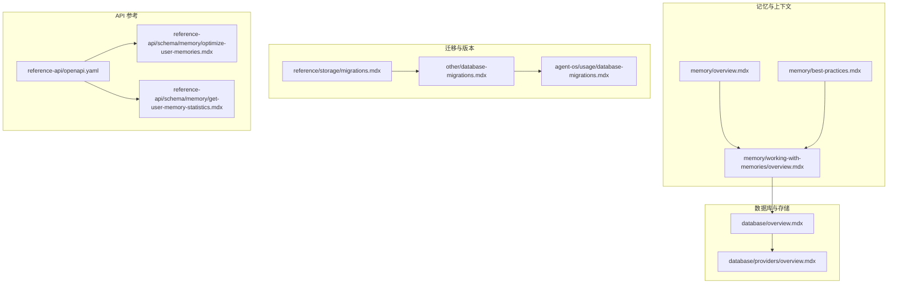
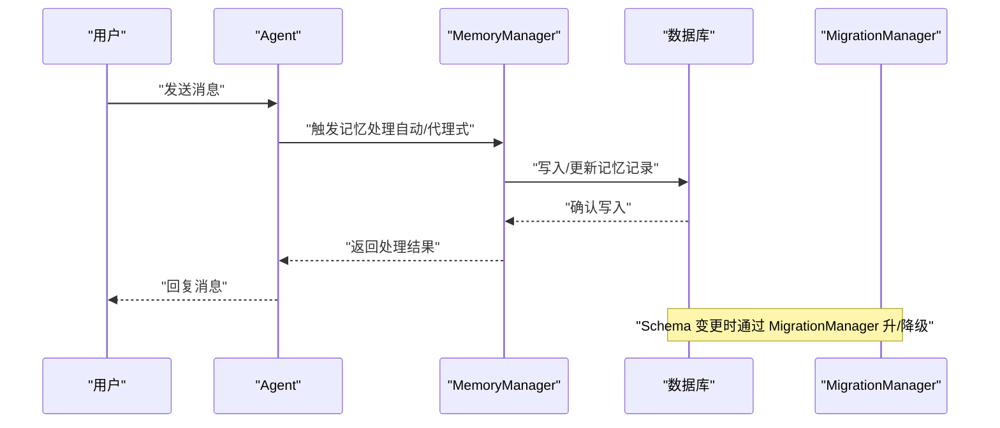
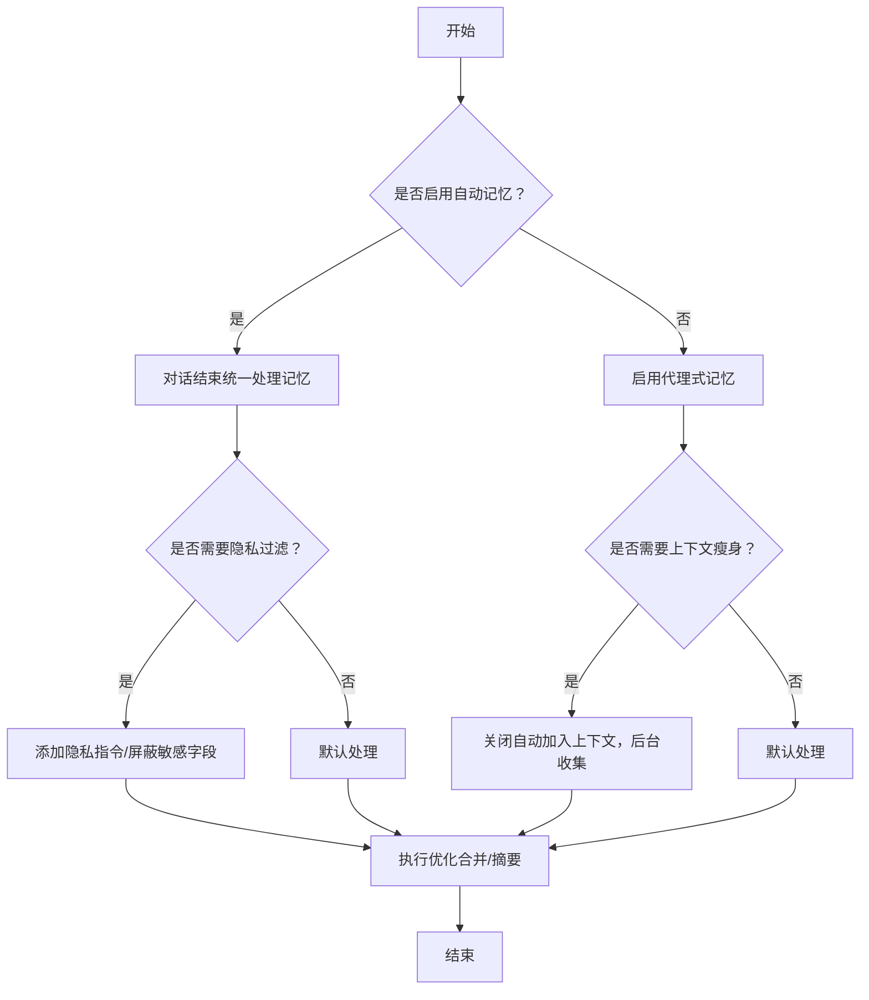
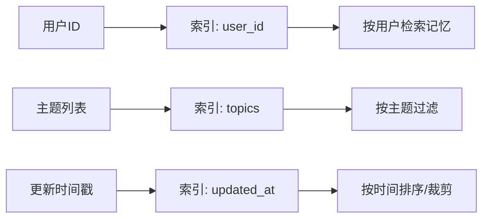
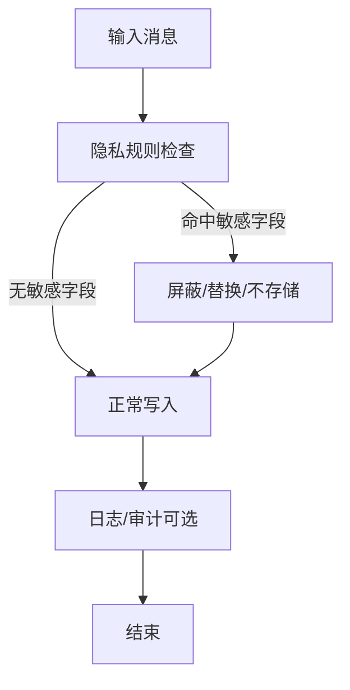
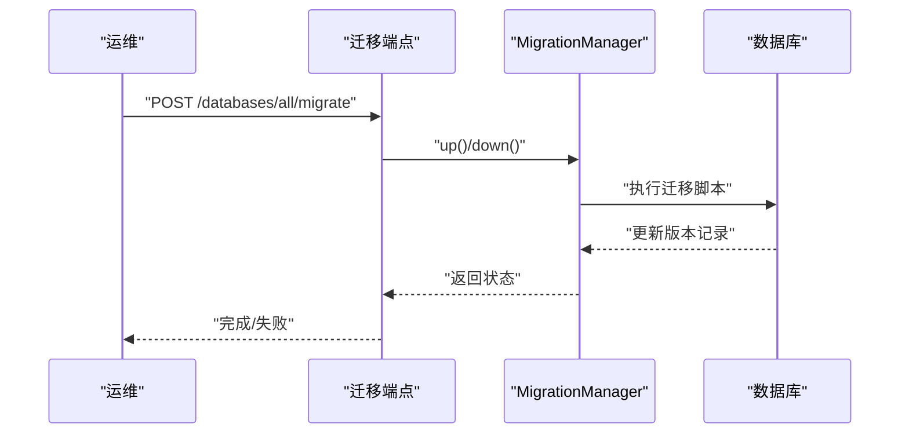
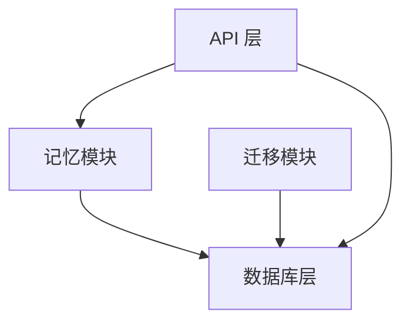

# 内存最佳实践

<cite>
**本文引用的文件**
- [memory/overview.mdx](file://memory/overview.mdx)
- [memory/best-practices.mdx](file://memory/best-practices.mdx)
- [memory/working-with-memories/overview.mdx](file://memory/working-with-memories/overview.mdx)
- [database/overview.mdx](file://database/overview.mdx)
- [database/providers/overview.mdx](file://database/providers/overview.mdx)
- [reference/storage/migrations.mdx](file://reference/storage/migrations.mdx)
- [other/database-migrations.mdx](file://other/database-migrations.mdx)
- [agent-os/usage/database-migrations.mdx](file://agent-os/usage/database-migrations.mdx)
- [reference-api/openapi.yaml](file://reference-api/openapi.yaml)
- [reference-api/schema/memory/optimize-user-memories.mdx](file://reference-api/schema/memory/optimize-user-memories.mdx)
- [reference-api/schema/memory/get-user-memory-statistics.mdx](file://reference-api/schema/memory/get-user-memory-statistics.mdx)
- [TBD/pages/agent-os/features/memories.mdx](file://TBD/pages/agent-os/features/memories.mdx)
</cite>

## 目录
1. [简介](#简介)
2. [项目结构](#项目结构)
3. [核心组件](#核心组件)
4. [架构总览](#架构总览)
5. [详细组件分析](#详细组件分析)
6. [依赖分析](#依赖分析)
7. [性能考虑](#性能考虑)
8. [故障排查指南](#故障排查指南)
9. [结论](#结论)
10. [附录](#附录)

## 简介
本指南聚焦于“内存”在系统中的最佳实践，涵盖数据库选型、索引与查询优化、内存安全与隐私保护、扩展性与可靠性、监控与调试、迁移与升级以及生产经验与常见问题。内容以仓库中关于“记忆（Memory）”“数据库（Database）”“迁移（Migrations）”等主题文档为基础，结合 API 参考与示例路径，帮助读者构建稳定、高效且可维护的内存系统。

## 项目结构
围绕“内存”的知识分布在以下几类文档中：
- 记忆与上下文：概念、自动/代理式记忆、优化与工具
- 数据库与存储：支持的数据库类型、异步能力、会话与历史
- 迁移与版本管理：Schema 版本跟踪、升级/降级流程
- API 参考：内存优化、统计等接口定义

图表来源
- [memory/overview.mdx:1-202](file://memory/overview.mdx#L1-L202)
- [memory/best-practices.mdx:1-202](file://memory/best-practices.mdx#L1-L202)
- [memory/working-with-memories/overview.mdx:1-166](file://memory/working-with-memories/overview.mdx#L1-L166)
- [database/overview.mdx:1-130](file://database/overview.mdx#L1-L130)
- [database/providers/overview.mdx:1-116](file://database/providers/overview.mdx#L1-L116)
- [reference/storage/migrations.mdx:1-170](file://reference/storage/migrations.mdx#L1-L170)
- [other/database-migrations.mdx:1-125](file://other/database-migrations.mdx#L1-L125)
- [agent-os/usage/database-migrations.mdx:1-39](file://agent-os/usage/database-migrations.mdx#L1-L39)
- [reference-api/openapi.yaml:4084-4118](file://reference-api/openapi.yaml#L4084-L4118)
- [reference-api/schema/memory/optimize-user-memories.mdx:1-3](file://reference-api/schema/memory/optimize-user-memories.mdx#L1-L3)
- [reference-api/schema/memory/get-user-memory-statistics.mdx:1-3](file://reference-api/schema/memory/get-user-memory-statistics.mdx#L1-L3)

章节来源
- [memory/overview.mdx:1-202](file://memory/overview.mdx#L1-L202)
- [database/overview.mdx:1-130](file://database/overview.mdx#L1-L130)
- [database/providers/overview.mdx:1-116](file://database/providers/overview.mdx#L1-L116)
- [reference/storage/migrations.mdx:1-170](file://reference/storage/migrations.mdx#L1-L170)
- [other/database-migrations.mdx:1-125](file://other/database-migrations.mdx#L1-L125)
- [agent-os/usage/database-migrations.mdx:1-39](file://agent-os/usage/database-migrations.mdx#L1-L39)
- [reference-api/openapi.yaml:4084-4118](file://reference-api/openapi.yaml#L4084-L4118)
- [reference-api/schema/memory/optimize-user-memories.mdx:1-3](file://reference-api/schema/memory/optimize-user-memories.mdx#L1-L3)
- [reference-api/schema/memory/get-user-memory-statistics.mdx:1-3](file://reference-api/schema/memory/get-user-memory-statistics.mdx#L1-L3)

## 核心组件
- 记忆管理器（MemoryManager）
  - 控制记忆提取、更新与优化；可指定模型、附加指令、隐私规则等
  - 支持将记忆加入上下文或仅后台收集
- 两种记忆模式
  - 自动记忆：每次对话结束后统一处理，适合大多数场景
  - 代理式记忆：由代理通过工具决定何时增删改查，灵活性高但成本更高
- 数据库层
  - 支持关系型（PostgreSQL/MySQL/SQLite/SingleStore）、NoSQL（MongoDB/Redis/DynamoDB/Firestore/SurrealDB）及服务端集成
  - 异步数据库适配，便于高并发与低延迟
- 迁移与版本
  - MigrationManager 负责 Schema 升降级、版本追踪与目标表迁移
  - 提供 API 端点与手动迁移两种方式

章节来源
- [memory/working-with-memories/overview.mdx:10-90](file://memory/working-with-memories/overview.mdx#L10-L90)
- [memory/overview.mdx:38-92](file://memory/overview.mdx#L38-L92)
- [database/overview.mdx:105-130](file://database/overview.mdx#L105-L130)
- [database/providers/overview.mdx:1-116](file://database/providers/overview.mdx#L1-L116)
- [reference/storage/migrations.mdx:35-143](file://reference/storage/migrations.mdx#L35-L143)

## 架构总览
下图展示从“用户消息”到“记忆持久化与检索”的关键流程，以及与数据库、迁移管理的关系。

图表来源
- [memory/overview.mdx:38-92](file://memory/overview.mdx#L38-L92)
- [memory/working-with-memories/overview.mdx:10-90](file://memory/working-with-memories/overview.mdx#L10-L90)
- [reference/storage/migrations.mdx:35-143](file://reference/storage/migrations.mdx#L35-L143)

## 详细组件分析

### 组件一：记忆管理与优化
- 自动记忆 vs 代理式记忆
  - 自动记忆：一次处理，成本可控，适合多数应用
  - 代理式记忆：按需决策，成本较高，适合复杂交互
- 隐私与上下文控制
  - 可通过 MemoryManager 指令避免存储敏感字段
  - 可关闭自动加入上下文，仅后台收集，降低 Token 使用
- 优化策略
  - 针对 50+ 记忆进行合并/摘要，减少上下文开销
  - 支持预览不落库，再决定是否应用

图表来源
- [memory/overview.mdx:38-92](file://memory/overview.mdx#L38-L92)
- [memory/working-with-memories/overview.mdx:10-90](file://memory/working-with-memories/overview.mdx#L10-L90)
- [memory/best-practices.mdx:54-142](file://memory/best-practices.mdx#L54-L142)

章节来源
- [memory/overview.mdx:38-92](file://memory/overview.mdx#L38-L92)
- [memory/working-with-memories/overview.mdx:10-90](file://memory/working-with-memories/overview.mdx#L10-L90)
- [memory/best-practices.mdx:54-142](file://memory/best-practices.mdx#L54-L142)

### 组件二：数据库选择与查询优化
- 数据库类型与适用场景
  - 开发：SQLite
  - 生产：PostgreSQL（首选），MySQL/SingleStore
  - 文档型/键值：MongoDB/Redis
  - 云原生：DynamoDB/Firestore/SurrealDB
- 异步数据库
  - 使用 AsyncPostgresDb/AsyncSqliteDb 等异步类，提升高并发下的吞吐与延迟表现
- 查询与索引建议
  - 记忆表常用字段：user_id、updated_at、agent_id、team_id、topics
  - 建议索引：user_id + updated_at（时间序列检索）、topics（主题过滤）
  - 查询优化：分页、投影只取必要字段、避免一次性加载全部记忆
- 会话与历史
  - 将会话历史与记忆分离存储，按需拼接上下文，降低单次请求上下文大小

图表来源
- [database/overview.mdx:105-130](file://database/overview.mdx#L105-L130)
- [database/providers/overview.mdx:1-116](file://database/providers/overview.mdx#L1-L116)
- [memory/overview.mdx:148-165](file://memory/overview.mdx#L148-L165)

章节来源
- [database/overview.mdx:105-130](file://database/overview.mdx#L105-L130)
- [database/providers/overview.mdx:1-116](file://database/providers/overview.mdx#L1-L116)
- [memory/overview.mdx:148-165](file://memory/overview.mdx#L148-L165)

### 组件三：安全与隐私保护
- 私有部署与数据主权
  - 所有记忆存储于本地 AgentOS 数据库，不外传
  - 记忆仅限当前 OS 实例内的代理访问
- 敏感信息过滤与脱敏
  - 在 MemoryManager 中添加隐私指令，避免存储真实姓名等敏感字段
  - 对检索结果进行二次脱敏处理
- 访问控制
  - 结合 RBAC 限制对记忆相关接口与数据的访问范围
- 外观页面提示
  - “私有设计”“数据治理”“访问控制”等特性说明

图表来源
- [TBD/pages/agent-os/features/memories.mdx:40-74](file://TBD/pages/agent-os/features/memories.mdx#L40-L74)
- [memory/working-with-memories/overview.mdx:10-44](file://memory/working-with-memories/overview.mdx#L10-L44)

章节来源
- [TBD/pages/agent-os/features/memories.mdx:40-74](file://TBD/pages/agent-os/features/memories.mdx#L40-L74)
- [memory/working-with-memories/overview.mdx:10-44](file://memory/working-with-memories/overview.mdx#L10-L44)

### 组件四：扩展性与可靠性保障
- 水平扩展
  - 使用分布式数据库（如 PostgreSQL 集群、Redis 集群）承载高并发
  - 通过异步数据库类提升 I/O 并发
- 故障恢复
  - 记忆与会话分离存储，优先保证会话可用
  - 使用 MigrationManager 稳定迁移 Schema，避免版本不一致导致的数据异常
- 备份策略
  - 定期导出记忆表（按 user_id 分桶）作为快照
  - 使用数据库自带备份工具（如 pg_dump、mysqldump、Redis RDB/AOF）

章节来源
- [database/overview.mdx:105-130](file://database/overview.mdx#L105-L130)
- [reference/storage/migrations.mdx:35-143](file://reference/storage/migrations.mdx#L35-L143)

### 组件五：监控与调试
- 性能指标
  - 记忆数量趋势、平均单次记忆 Token 消耗、优化前后对比
  - 上下文长度分布、查询耗时分布
- 接口与工具
  - 优化接口：POST /optimize-memories
  - 统计接口：GET /user_memory_stats
  - 可结合数据库 EXPLAIN 分析慢查询
- 调试建议
  - 开启细粒度日志（LLM 调用、数据库写入、优化过程）
  - 使用小样本数据验证优化策略效果

章节来源
- [reference-api/openapi.yaml:4084-4118](file://reference-api/openapi.yaml#L4084-L4118)
- [reference-api/schema/memory/optimize-user-memories.mdx:1-3](file://reference-api/schema/memory/optimize-user-memories.mdx#L1-L3)
- [reference-api/schema/memory/get-user-memory-statistics.mdx:1-3](file://reference-api/schema/memory/get-user-memory-statistics.mdx#L1-L3)

### 组件六：迁移与升级
- 版本管理
  - 使用 MigrationManager 跟踪 agno_schema_versions，按版本升/降级
  - 支持目标表迁移（memory/session/metrics/eval/knowledge/culture）
- 升级路径
  - 先在测试环境验证迁移脚本
  - 使用 API 端点或 MigrationManager 执行
- 回滚策略
  - 下游回退到上一个稳定版本，必要时使用 down(target_version=...)
- 注意事项
  - 避免手工修改列结构，以免破坏迁移一致性
  - 确保 agno_schema_versions 记录正确

图表来源
- [agent-os/usage/database-migrations.mdx:16-39](file://agent-os/usage/database-migrations.mdx#L16-L39)
- [other/database-migrations.mdx:35-125](file://other/database-migrations.mdx#L35-L125)
- [reference/storage/migrations.mdx:35-143](file://reference/storage/migrations.mdx#L35-L143)

章节来源
- [agent-os/usage/database-migrations.mdx:16-39](file://agent-os/usage/database-migrations.mdx#L16-L39)
- [other/database-migrations.mdx:35-125](file://other/database-migrations.mdx#L35-L125)
- [reference/storage/migrations.mdx:35-143](file://reference/storage/migrations.mdx#L35-L143)

## 依赖分析
- 记忆模块依赖数据库层提供持久化能力
- 迁移模块贯穿数据库层，确保 Schema 稳定演进
- API 层暴露优化与统计接口，驱动前端与监控系统

图表来源
- [memory/overview.mdx:94-121](file://memory/overview.mdx#L94-L121)
- [reference/storage/migrations.mdx:35-143](file://reference/storage/migrations.mdx#L35-L143)
- [reference-api/openapi.yaml:4084-4118](file://reference-api/openapi.yaml#L4084-L4118)

章节来源
- [memory/overview.mdx:94-121](file://memory/overview.mdx#L94-L121)
- [reference/storage/migrations.mdx:35-143](file://reference/storage/migrations.mdx#L35-L143)
- [reference-api/openapi.yaml:4084-4118](file://reference-api/openapi.yaml#L4084-L4118)

## 性能考虑
- Token 成本控制
  - 默认采用自动记忆，避免代理式记忆带来的嵌套 LLM 调用
  - 使用廉价模型执行记忆操作，主对话使用高性能模型
- 上下文压缩
  - 对 50+ 记忆执行优化（合并/摘要），减少上下文长度
  - 关闭自动加入上下文，仅在需要时显式检索
- 数据库 I/O
  - 为 user_id、updated_at、topics 建立索引
  - 分页查询、投影字段、避免全量扫描
- 异步与并发
  - 使用异步数据库类，提高并发写入与查询吞吐

章节来源
- [memory/best-practices.mdx:54-142](file://memory/best-practices.mdx#L54-L142)
- [memory/working-with-memories/overview.mdx:67-88](file://memory/working-with-memories/overview.mdx#L67-L88)
- [database/overview.mdx:109-130](file://database/overview.mdx#L109-L130)

## 故障排查指南
- 常见问题
  - 忘记设置 user_id 导致记忆串扰
  - 同时启用自动与代理式记忆导致行为不符合预期
  - 记忆数量异常增长未及时修剪
- 排查步骤
  - 检查记忆数量阈值与告警策略
  - 对高成本操作前先执行优化
  - 使用 GET /user_memory_stats 获取统计信息
  - 通过 EXPLAIN 分析慢查询，补充缺失索引
- 迁移相关
  - 如出现 Schema 不一致，使用 MigrationManager down 到上一个稳定版本
  - 确认 agno_schema_versions 是否正确

章节来源
- [memory/best-practices.mdx:144-196](file://memory/best-practices.mdx#L144-L196)
- [reference-api/schema/memory/get-user-memory-statistics.mdx:1-3](file://reference-api/schema/memory/get-user-memory-statistics.mdx#L1-L3)
- [reference/storage/migrations.mdx:94-143](file://reference/storage/migrations.mdx#L94-L143)

## 结论
通过合理选择数据库、优化索引与查询、严格的安全与隐私策略、完善的监控与迁移机制，以及在生产中遵循“自动记忆优先、成本可控、上下文瘦身”的原则，可以显著提升系统的稳定性、性能与可维护性。建议在上线前完成压测与演练，并建立标准化的迁移与回滚流程。

## 附录
- 快速参考清单
  - 默认使用自动记忆，除非确有代理式需求
  - 明确 user_id，避免跨用户记忆污染
  - 使用廉价模型处理记忆，主对话使用高性能模型
  - 定期修剪与优化记忆，控制上下文规模
  - 为高频查询字段建立索引，分页与投影
  - 使用异步数据库提升并发
  - 通过 API 获取统计，结合 EXPLAIN 优化慢查询
  - 使用 MigrationManager 管理 Schema 版本，避免手工改列