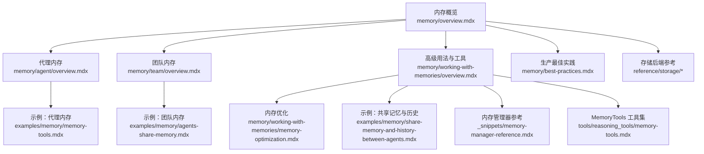
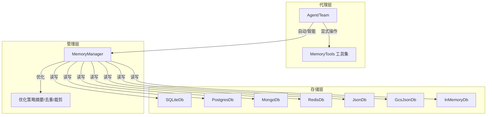
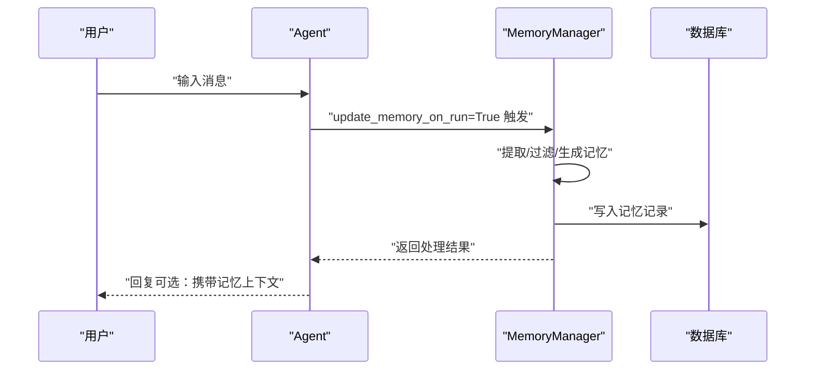
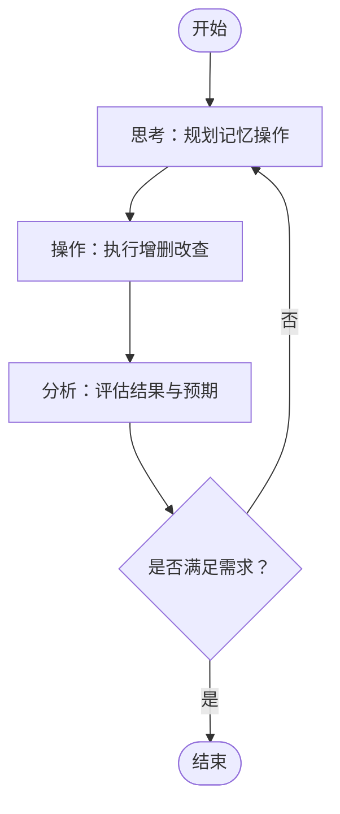
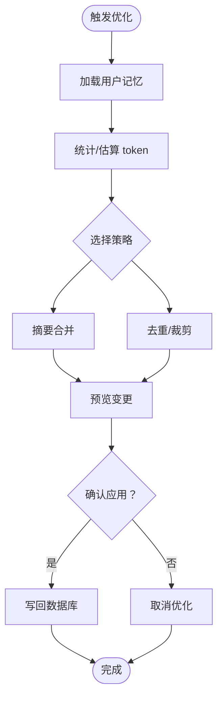
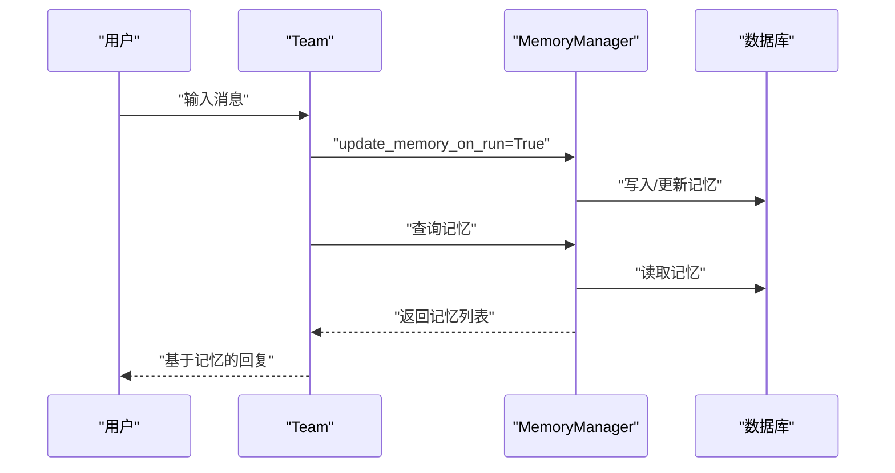
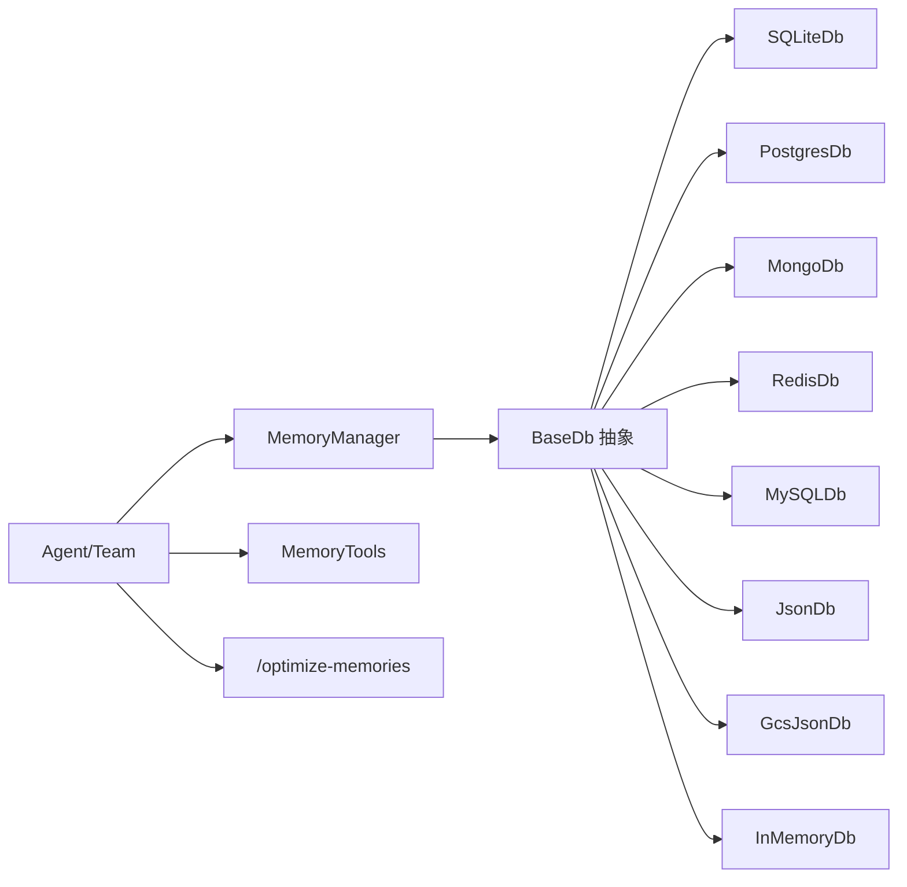

# 内存系统

<cite>
**本文引用的文件**
- [memory/overview.mdx](file://memory/overview.mdx)
- [memory/agent/overview.mdx](file://memory/agent/overview.mdx)
- [memory/team/overview.mdx](file://memory/team/overview.mdx)
- [memory/working-with-memories/overview.mdx](file://memory/working-with-memories/overview.mdx)
- [memory/working-with-memories/memory-optimization.mdx](file://memory/working-with-memories/memory-optimization.mdx)
- [memory/best-practices.mdx](file://memory/best-practices.mdx)
- [examples/memory/memory-tools.mdx](file://examples/memory/memory-tools.mdx)
- [examples/memory/agents-share-memory.mdx](file://examples/memory/agents-share-memory.mdx)
- [examples/memory/share-memory-and-history-between-agents.mdx](file://examples/memory/share-memory-and-history-between-agents.mdx)
- [examples/memory/memory-manager/overview.mdx](file://examples/memory/memory-manager/overview.mdx)
- [reference/memory/memory.mdx](file://reference/memory/memory.mdx)
- [_snippets/memory-manager-reference.mdx](file://_snippets/memory-manager-reference.mdx)
- [tools/reasoning_tools/memory-tools.mdx](file://tools/reasoning_tools/memory-tools.mdx)
- [reference-api/schema/memory/optimize-user-memories.mdx](file://reference-api/schema/memory/optimize-user-memories.mdx)
- [TBD/pages/reference-api/schema/memory/optimize-user-memories.mdx](file://TBD/pages/reference-api/schema/memory/optimize-user-memories.mdx)
- [reference/storage/sqlite.mdx](file://reference/storage/sqlite.mdx)
- [reference/storage/postgres.mdx](file://reference/storage/postgres.mdx)
- [reference/storage/mongodb.mdx](file://reference/storage/mongodb.mdx)
- [reference/storage/redis.mdx](file://reference/storage/redis.mdx)
- [reference/storage/mysql.mdx](file://reference/storage/mysql.mdx)
- [reference/storage/json.mdx](file://reference/storage/json.mdx)
- [reference/storage/gcs.mdx](file://reference/storage/gcs.mdx)
- [reference/storage/in_memory.mdx](file://reference/storage/in_memory.mdx)
</cite>

## 目录
1. [简介](#简介)
2. [项目结构](#项目结构)
3. [核心组件](#核心组件)
4. [架构总览](#架构总览)
5. [详细组件分析](#详细组件分析)
6. [依赖关系分析](#依赖关系分析)
7. [性能考量](#性能考量)
8. [故障排查指南](#故障排查指南)
9. [结论](#结论)
10. [附录](#附录)

## 简介
本文件系统性地阐述内存系统的核心概念与实现，覆盖记忆存储、上下文管理与长期记忆机制；详解内存使用模式（存储与内存管理器的使用方法与最佳实践）；文档化代理与团队的内存使用（记忆创建、搜索与优化）；说明共享记忆与独立记忆的区别；给出存储策略、检索算法与性能调优的优化建议；并结合仓库中的示例与参考文档，展示在不同代理类型中的应用效果，以及内存清理、备份与恢复等运维主题。

## 项目结构
围绕“内存”主题，知识库中存在多处文档与示例，主要分布在以下路径：
- 概览与基础用法：memory/overview.mdx
- 代理内存：memory/agent/overview.mdx
- 团队内存：memory/team/overview.mdx
- 高级用法与工具：memory/working-with-memories/overview.mdx、memory/working-with-memories/memory-optimization.mdx
- 生产最佳实践：memory/best-practices.mdx
- 示例：examples/memory 下多个示例
- 参考与参数：reference/memory、_snippets/memory-manager-reference.mdx、tools/reasoning_tools/memory-tools.mdx
- 存储后端：reference/storage/*（sqlite、postgres、mongodb、redis、mysql、json、gcs、in_memory）

图表来源
- [memory/overview.mdx:1-202](file://memory/overview.mdx#L1-L202)
- [memory/agent/overview.mdx:1-79](file://memory/agent/overview.mdx#L1-L79)
- [memory/team/overview.mdx:1-36](file://memory/team/overview.mdx#L1-L36)
- [memory/working-with-memories/overview.mdx:1-166](file://memory/working-with-memories/overview.mdx#L1-L166)
- [memory/working-with-memories/memory-optimization.mdx:58-98](file://memory/working-with-memories/memory-optimization.mdx#L58-L98)
- [memory/best-practices.mdx:1-202](file://memory/best-practices.mdx#L1-L202)
- [examples/memory/memory-tools.mdx:1-82](file://examples/memory/memory-tools.mdx#L1-L82)
- [examples/memory/agents-share-memory.mdx:1-80](file://examples/memory/agents-share-memory.mdx#L1-L80)
- [examples/memory/share-memory-and-history-between-agents.mdx:1-86](file://examples/memory/share-memory-and-history-between-agents.mdx#L1-L86)
- [_snippets/memory-manager-reference.mdx:1-29](file://_snippets/memory-manager-reference.mdx#L1-L29)
- [tools/reasoning_tools/memory-tools.mdx:1-26](file://tools/reasoning_tools/memory-tools.mdx#L1-L26)
- [reference/storage/sqlite.mdx:1-8](file://reference/storage/sqlite.mdx#L1-L8)
- [reference/storage/postgres.mdx:1-9](file://reference/storage/postgres.mdx#L1-L9)
- [reference/storage/mongodb.mdx:1-8](file://reference/storage/mongodb.mdx#L1-L8)
- [reference/storage/redis.mdx:1-8](file://reference/storage/redis.mdx#L1-L8)
- [reference/storage/mysql.mdx:1-9](file://reference/storage/mysql.mdx#L1-L9)
- [reference/storage/json.mdx:1-8](file://reference/storage/json.mdx#L1-L8)
- [reference/storage/gcs.mdx:1-8](file://reference/storage/gcs.mdx#L1-L8)
- [reference/storage/in_memory.mdx:1-8](file://reference/storage/in_memory.mdx#L1-L8)

章节来源
- [memory/overview.mdx:1-202](file://memory/overview.mdx#L1-L202)
- [memory/agent/overview.mdx:1-79](file://memory/agent/overview.mdx#L1-L79)
- [memory/team/overview.mdx:1-36](file://memory/team/overview.mdx#L1-L36)
- [memory/working-with-memories/overview.mdx:1-166](file://memory/working-with-memories/overview.mdx#L1-L166)
- [memory/working-with-memories/memory-optimization.mdx:58-98](file://memory/working-with-memories/memory-optimization.mdx#L58-L98)
- [memory/best-practices.mdx:1-202](file://memory/best-practices.mdx#L1-L202)
- [examples/memory/memory-tools.mdx:1-82](file://examples/memory/memory-tools.mdx#L1-L82)
- [examples/memory/agents-share-memory.mdx:1-80](file://examples/memory/agents-share-memory.mdx#L1-L80)
- [examples/memory/share-memory-and-history-between-agents.mdx:1-86](file://examples/memory/share-memory-and-history-between-agents.mdx#L1-L86)
- [_snippets/memory-manager-reference.mdx:1-29](file://_snippets/memory-manager-reference.mdx#L1-L29)
- [tools/reasoning_tools/memory-tools.mdx:1-26](file://tools/reasoning_tools/memory-tools.mdx#L1-L26)
- [reference/storage/sqlite.mdx:1-8](file://reference/storage/sqlite.mdx#L1-L8)
- [reference/storage/postgres.mdx:1-9](file://reference/storage/postgres.mdx#L1-L9)
- [reference/storage/mongodb.mdx:1-8](file://reference/storage/mongodb.mdx#L1-L8)
- [reference/storage/redis.mdx:1-8](file://reference/storage/redis.mdx#L1-L8)
- [reference/storage/mysql.mdx:1-9](file://reference/storage/mysql.mdx#L1-L9)
- [reference/storage/json.mdx:1-8](file://reference/storage/json.mdx#L1-L8)
- [reference/storage/gcs.mdx:1-8](file://reference/storage/gcs.mdx#L1-L8)
- [reference/storage/in_memory.mdx:1-8](file://reference/storage/in_memory.mdx#L1-L8)

## 核心组件
- 记忆管理器（MemoryManager）
  - 职责：统一负责用户记忆的创建、检索、更新与删除；可自定义模型、系统提示、记忆捕获指令与附加规则；支持优化策略与批量操作。
  - 关键能力：按用户维度读写记忆、控制是否将记忆加入上下文、执行优化策略（如摘要合并）、提供调试模式。
  - 参考：[MemoryManager 参数与方法:1-29](file://_snippets/memory-manager-reference.mdx#L1-L29)，[Memory 类概述:1-7](file://reference/memory/memory.mdx#L1-L7)

- 记忆数据模型
  - 字段：memory_id、memory、topics、input、user_id、agent_id、team_id、updated_at
  - 默认表名：agno_memories（或文档型数据库对应集合），可自定义表名
  - 参考：[记忆数据模型:148-165](file://memory/overview.mdx#L148-L165)

- 存储后端
  - 支持：SQLite、PostgreSQL、MongoDB、Redis、MySQL、JSON 文件、Google Cloud Storage、内存数据库
  - 参考：[SQLite:1-8](file://reference/storage/sqlite.mdx#L1-L8)、[Postgres:1-9](file://reference/storage/postgres.mdx#L1-L9)、[MongoDB:1-8](file://reference/storage/mongodb.mdx#L1-L8)、[Redis:1-8](file://reference/storage/redis.mdx#L1-L8)、[MySQL:1-9](file://reference/storage/mysql.mdx#L1-L9)、[JSON:1-8](file://reference/storage/json.mdx#L1-L8)、[GCS:1-8](file://reference/storage/gcs.mdx#L1-L8)、[InMemory:1-8](file://reference/storage/in_memory.mdx#L1-L8)

- 记忆工具集（MemoryTools）
  - 能力：思考（内部规划）、获取记忆、新增记忆、更新记忆、删除记忆、结果分析
  - 场景：需要显式控制记忆生命周期的复杂工作流
  - 参考：[MemoryTools 文档:1-26](file://tools/reasoning_tools/memory-tools.mdx#L1-L26)

章节来源
- [_snippets/memory-manager-reference.mdx:1-29](file://_snippets/memory-manager-reference.mdx#L1-L29)
- [reference/memory/memory.mdx:1-7](file://reference/memory/memory.mdx#L1-L7)
- [memory/overview.mdx:148-165](file://memory/overview.mdx#L148-L165)
- [reference/storage/sqlite.mdx:1-8](file://reference/storage/sqlite.mdx#L1-L8)
- [reference/storage/postgres.mdx:1-9](file://reference/storage/postgres.mdx#L1-L9)
- [reference/storage/mongodb.mdx:1-8](file://reference/storage/mongodb.mdx#L1-L8)
- [reference/storage/redis.mdx:1-8](file://reference/storage/redis.mdx#L1-L8)
- [reference/storage/mysql.mdx:1-9](file://reference/storage/mysql.mdx#L1-L9)
- [reference/storage/json.mdx:1-8](file://reference/storage/json.mdx#L1-L8)
- [reference/storage/gcs.mdx:1-8](file://reference/storage/gcs.mdx#L1-L8)
- [reference/storage/in_memory.mdx:1-8](file://reference/storage/in_memory.mdx#L1-L8)
- [tools/reasoning_tools/memory-tools.mdx:1-26](file://tools/reasoning_tools/memory-tools.mdx#L1-L26)

## 架构总览
内存系统以“代理/团队 + 数据库 + 记忆管理器”的分层架构运行。代理通过两种模式与记忆交互：
- 自动记忆（update_memory_on_run=True）：每次对话结束后自动触发记忆管理器进行提取、存储与检索
- 智能记忆（enable_agentic_memory=True）：由代理内置工具决定何时创建/更新/删除记忆，适合需要实时决策的场景

图表来源
- [memory/overview.mdx:38-92](file://memory/overview.mdx#L38-L92)
- [memory/working-with-memories/overview.mdx:90-134](file://memory/working-with-memories/overview.mdx#L90-L134)
- [tools/reasoning_tools/memory-tools.mdx:1-26](file://tools/reasoning_tools/memory-tools.mdx#L1-L26)
- [reference/storage/sqlite.mdx:1-8](file://reference/storage/sqlite.mdx#L1-L8)
- [reference/storage/postgres.mdx:1-9](file://reference/storage/postgres.mdx#L1-L9)
- [reference/storage/mongodb.mdx:1-8](file://reference/storage/mongodb.mdx#L1-L8)
- [reference/storage/redis.mdx:1-8](file://reference/storage/redis.mdx#L1-L8)
- [reference/storage/json.mdx:1-8](file://reference/storage/json.mdx#L1-L8)
- [reference/storage/gcs.mdx:1-8](file://reference/storage/gcs.mdx#L1-L8)
- [reference/storage/in_memory.mdx:1-8](file://reference/storage/in_memory.mdx#L1-L8)

## 详细组件分析

### 组件一：记忆管理器（MemoryManager）
- 设计要点
  - 统一入口：对外暴露 get/add/replace/delete/clear 等方法，屏蔽底层存储差异
  - 上下文控制：可选择是否将记忆注入到当前请求上下文中，避免无谓的上下文膨胀
  - 优化集成：提供优化接口，支持摘要策略等，降低 token 消耗
  - 模型与提示：可指定用于记忆处理的模型与系统提示，便于隐私与合规控制
- 典型流程（自动记忆）

图表来源
- [memory/overview.mdx:42-66](file://memory/overview.mdx#L42-L66)
- [memory/working-with-memories/overview.mdx:46-65](file://memory/working-with-memories/overview.mdx#L46-L65)
- [_snippets/memory-manager-reference.mdx:16-29](file://_snippets/memory-manager-reference.mdx#L16-L29)

章节来源
- [_snippets/memory-manager-reference.mdx:1-29](file://_snippets/memory-manager-reference.mdx#L1-L29)
- [memory/working-with-memories/overview.mdx:10-44](file://memory/working-with-memories/overview.mdx#L10-L44)
- [memory/overview.mdx:38-92](file://memory/overview.mdx#L38-L92)

### 组件二：记忆工具集（MemoryTools）
- 设计要点
  - 思考-操作-分析循环：先内部规划，再执行数据库操作，最后评估结果
  - 与外部工具协作：可与网络搜索等工具组合，形成“记忆 + 外部信息”的综合决策
- 使用场景
  - 需要显式控制记忆生命周期
  - 希望在对话中动态决定是否存储/更新/删除记忆
- 示例路径
  - [MemoryTools 示例:1-82](file://examples/memory/memory-tools.mdx#L1-L82)
  - [MemoryTools 文档:1-26](file://tools/reasoning_tools/memory-tools.mdx#L1-L26)

图表来源
- [tools/reasoning_tools/memory-tools.mdx:8-22](file://tools/reasoning_tools/memory-tools.mdx#L8-L22)
- [examples/memory/memory-tools.mdx:24-67](file://examples/memory/memory-tools.mdx#L24-L67)

章节来源
- [tools/reasoning_tools/memory-tools.mdx:1-26](file://tools/reasoning_tools/memory-tools.mdx#L1-L26)
- [examples/memory/memory-tools.mdx:1-82](file://examples/memory/memory-tools.mdx#L1-L82)

### 组件三：内存优化策略
- 目标：降低上下文 token 消耗，提升长期内存的可维护性
- 常见策略
  - 摘要合并：将多条记忆汇总为一条，保留关键信息
  - 去重与裁剪：定期清理过期或低价值记忆
- 实践步骤
  - 预览优化效果后再应用
  - 在高成本操作前执行优化
  - 结合 token 计数统计，量化收益
- 示例路径
  - [内存优化示例（摘要策略）:58-98](file://memory/working-with-memories/memory-optimization.mdx#L58-L98)
  - [优化 API 接口:1-3](file://reference-api/schema/memory/optimize-user-memories.mdx#L1-L3)
  - [优化 API 接口（页面占位）:1-3](file://TBD/pages/reference-api/schema/memory/optimize-user-memories.mdx#L1-L3)

图表来源
- [memory/working-with-memories/memory-optimization.mdx:58-98](file://memory/working-with-memories/memory-optimization.mdx#L58-L98)
- [reference-api/schema/memory/optimize-user-memories.mdx:1-3](file://reference-api/schema/memory/optimize-user-memories.mdx#L1-L3)

章节来源
- [memory/working-with-memories/memory-optimization.mdx:58-98](file://memory/working-with-memories/memory-optimization.mdx#L58-L98)
- [reference-api/schema/memory/optimize-user-memories.mdx:1-3](file://reference-api/schema/memory/optimize-user-memories.mdx#L1-L3)
- [TBD/pages/reference-api/schema/memory/optimize-user-memories.mdx:1-3](file://TBD/pages/reference-api/schema/memory/optimize-user-memories.mdx#L1-L3)

### 组件四：代理与团队的内存使用
- 代理内存
  - 支持自动/智能两种模式，自动模式更省 token，智能模式更灵活
  - 可通过 get_user_memories 手动检索记忆，便于调试与可视化
  - 示例路径：[代理内存示例:17-61](file://memory/agent/overview.mdx#L17-L61)
- 团队内存
  - 团队成员共享同一数据库时，天然共享用户记忆
  - 示例路径：[团队内存示例:10-25](file://memory/team/overview.mdx#L10-L25)

图表来源
- [memory/team/overview.mdx:10-25](file://memory/team/overview.mdx#L10-L25)
- [memory/overview.mdx:68-92](file://memory/overview.mdx#L68-L92)

章节来源
- [memory/agent/overview.mdx:13-79](file://memory/agent/overview.mdx#L13-L79)
- [memory/team/overview.mdx:1-36](file://memory/team/overview.mdx#L1-L36)
- [memory/overview.mdx:38-92](file://memory/overview.mdx#L38-L92)

### 组件五：共享记忆与独立记忆
- 共享记忆
  - 多个代理/团队连接同一数据库，并使用相同 user_id，即可共享记忆
  - 示例路径：[代理共享记忆:13-66](file://examples/memory/agents-share-memory.mdx#L13-L66)、[共享记忆与历史:14-72](file://examples/memory/share-memory-and-history-between-agents.mdx#L14-L72)
- 独立记忆
  - 不同 user_id 或不同数据库实例即为独立记忆空间
- 最佳实践
  - 明确 user_id 的作用域边界，避免跨用户污染
  - 在多租户或多用户场景中，确保 user_id 传递正确

章节来源
- [examples/memory/agents-share-memory.mdx:1-80](file://examples/memory/agents-share-memory.mdx#L1-L80)
- [examples/memory/share-memory-and-history-between-agents.mdx:1-86](file://examples/memory/share-memory-and-history-between-agents.mdx#L1-L86)
- [memory/best-practices.mdx:144-161](file://memory/best-practices.mdx#L144-L161)

## 依赖关系分析
- 组件耦合
  - Agent/Team 依赖 MemoryManager；MemoryManager 依赖数据库接口（抽象 BaseDb）
  - MemoryTools 作为工具集被 Agent/Team 直接使用，也可与外部工具（如网络搜索）组合
- 存储后端
  - 各数据库适配器（SQLite、Postgres、Mongo、Redis、MySQL、JSON、GCS、InMemory）均实现统一的数据库接口，便于替换与扩展
- 外部接口
  - 提供优化 API（/optimize-memories），便于在运行时触发优化

图表来源
- [memory/working-with-memories/overview.mdx:90-134](file://memory/working-with-memories/overview.mdx#L90-L134)
- [reference/storage/sqlite.mdx:1-8](file://reference/storage/sqlite.mdx#L1-L8)
- [reference/storage/postgres.mdx:1-9](file://reference/storage/postgres.mdx#L1-L9)
- [reference/storage/mongodb.mdx:1-8](file://reference/storage/mongodb.mdx#L1-L8)
- [reference/storage/redis.mdx:1-8](file://reference/storage/redis.mdx#L1-L8)
- [reference/storage/mysql.mdx:1-9](file://reference/storage/mysql.mdx#L1-L9)
- [reference/storage/json.mdx:1-8](file://reference/storage/json.mdx#L1-L8)
- [reference/storage/gcs.mdx:1-8](file://reference/storage/gcs.mdx#L1-L8)
- [reference/storage/in_memory.mdx:1-8](file://reference/storage/in_memory.mdx#L1-L8)
- [reference-api/schema/memory/optimize-user-memories.mdx:1-3](file://reference-api/schema/memory/optimize-user-memories.mdx#L1-L3)

章节来源
- [memory/working-with-memories/overview.mdx:90-134](file://memory/working-with-memories/overview.mdx#L90-L134)
- [reference/storage/sqlite.mdx:1-8](file://reference/storage/sqlite.mdx#L1-L8)
- [reference/storage/postgres.mdx:1-9](file://reference/storage/postgres.mdx#L1-L9)
- [reference/storage/mongodb.mdx:1-8](file://reference/storage/mongodb.mdx#L1-L8)
- [reference/storage/redis.mdx:1-8](file://reference/storage/redis.mdx#L1-L8)
- [reference/storage/mysql.mdx:1-9](file://reference/storage/mysql.mdx#L1-L9)
- [reference/storage/json.mdx:1-8](file://reference/storage/json.mdx#L1-L8)
- [reference/storage/gcs.mdx:1-8](file://reference/storage/gcs.mdx#L1-L8)
- [reference/storage/in_memory.mdx:1-8](file://reference/storage/in_memory.mdx#L1-L8)
- [reference-api/schema/memory/optimize-user-memories.mdx:1-3](file://reference-api/schema/memory/optimize-user-memories.mdx#L1-L3)

## 性能考量
- 自动 vs 智能模式的成本差异
  - 智能模式每次记忆操作都会触发一次额外的 LLM 调用，随着记忆数量增长，token 消耗呈指数上升
  - 建议优先使用自动模式，仅在确有需要时启用智能模式
- 降本策略
  - 使用廉价模型处理记忆任务，主对话仍用高性能模型
  - 限制工具调用次数，防止过度记忆操作
  - 定期修剪过期/低价值记忆
  - 在高成本操作前执行优化（摘要合并）
- 上下文控制
  - 对于后台收集但不立即参与推理的场景，关闭自动注入记忆上下文，减少 token 占用
- 监控与告警
  - 定期检查用户记忆数量，超过阈值时触发清理或优化

章节来源
- [memory/best-practices.mdx:21-70](file://memory/best-practices.mdx#L21-L70)
- [memory/best-practices.mdx:112-142](file://memory/best-practices.mdx#L112-L142)
- [memory/best-practices.mdx:180-196](file://memory/best-practices.mdx#L180-L196)
- [memory/working-with-memories/overview.mdx:46-65](file://memory/working-with-memories/overview.mdx#L46-L65)

## 故障排查指南
- 常见问题
  - 忘记设置 user_id：导致所有用户的记忆混在一起，应始终显式传入 user_id
  - 同时启用双模式：update_memory_on_run 与 enable_agentic_memory 同时开启时，智能模式会覆盖自动模式
  - 忽略上下文膨胀：大量记忆进入上下文会导致 token 激增，应启用优化或关闭自动注入
- 排查步骤
  - 检查 user_id 是否一致且正确
  - 查看记忆数量与 token 消耗趋势
  - 在高成本操作前执行优化
  - 使用调试模式（MemoryManager.debug_mode）定位异常
- 相关示例
  - [共享记忆与历史示例:47-71](file://examples/memory/share-memory-and-history-between-agents.mdx#L47-L71)
  - [生产最佳实践:144-178](file://memory/best-practices.mdx#L144-L178)

章节来源
- [memory/best-practices.mdx:144-178](file://memory/best-practices.mdx#L144-L178)
- [examples/memory/share-memory-and-history-between-agents.mdx:47-71](file://examples/memory/share-memory-and-history-between-agents.mdx#L47-L71)

## 结论
内存系统通过 MemoryManager 将记忆的创建、检索、更新与删除抽象化，并与多种存储后端解耦。在实际应用中，推荐优先采用自动记忆模式以降低成本与复杂度；在需要精细控制的场景下，再引入智能记忆与 MemoryTools 工具集。配合优化策略、上下文控制与定期清理，可在保证个性化体验的同时，显著降低 token 消耗与运维成本。

## 附录
- 快速上手
  - 自动记忆：启用 update_memory_on_run=True，无需手动干预
  - 智能记忆：启用 enable_agentic_memory=True，或直接使用 MemoryTools
  - 存储后端：根据部署环境选择 SQLite/Postgres/MongoDB/Redis 等
- 运维建议
  - 定期优化：在高成本操作前执行摘要合并
  - 清理策略：按时间或价值维度清理过期/低效记忆
  - 备份与恢复：利用数据库的备份能力保障数据安全（具体命令请参考各数据库官方文档）