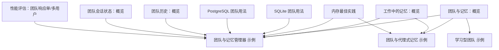
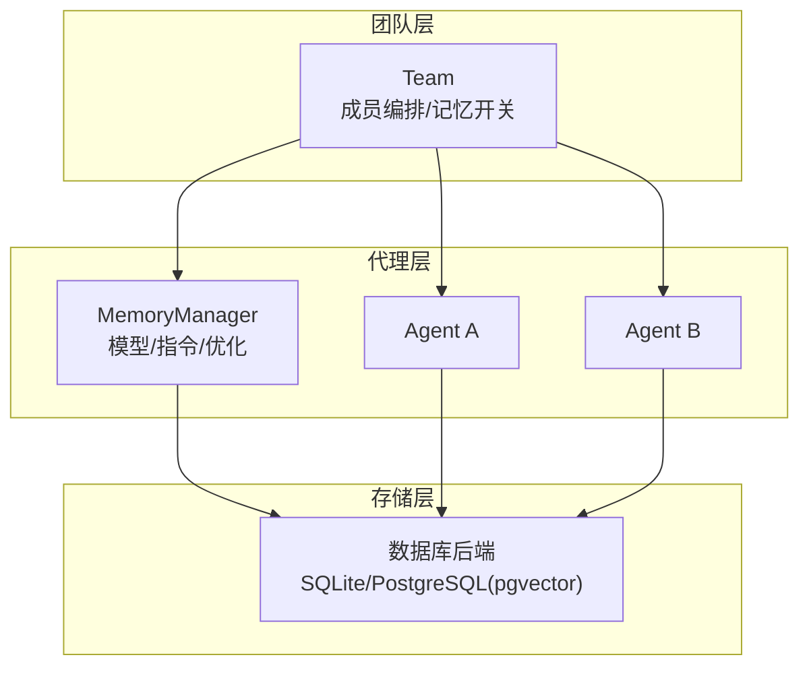
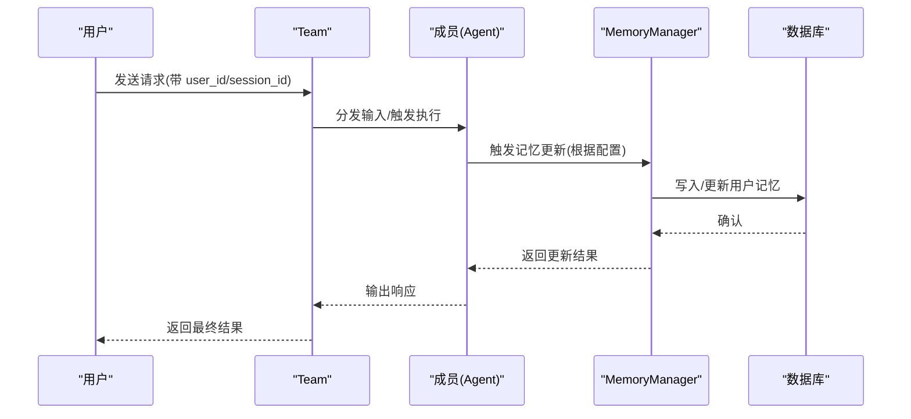
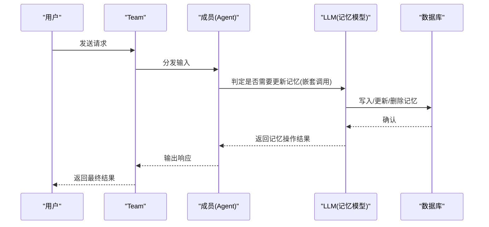
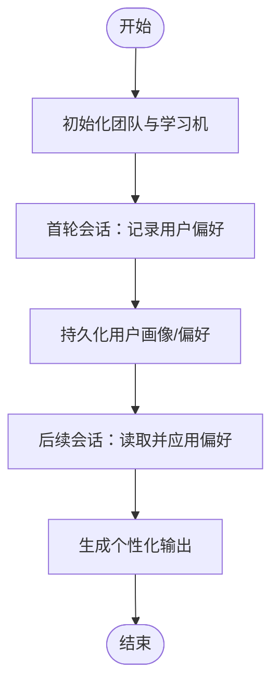
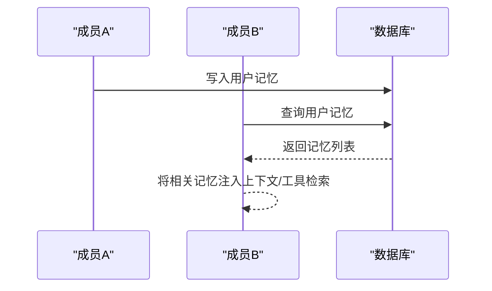
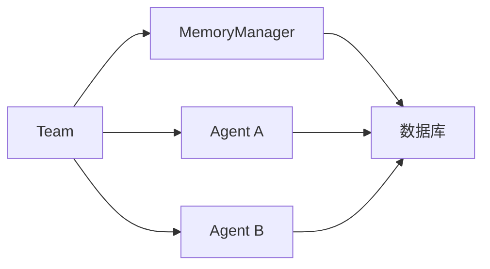

# 团队内存

<cite>
**本文引用的文件**
- [团队与记忆：概览](file://memory/team/overview.mdx)
- [团队与记忆管理器](file://examples/teams/memory/team-with-memory-manager.mdx)
- [团队与代理式记忆](file://examples/teams/memory/team-with-agentic-memory.mdx)
- [学习型团队（含代理式用户画像）](file://examples/teams/memory/learning-machine.mdx)
- [内存最佳实践](file://memory/best-practices.mdx)
- [工作中的记忆：概览](file://memory/working-with-memories/overview.mdx)
- [SQLite 团队用法](file://database/providers/sqlite/usage/sqlite-for-team.mdx)
- [PostgreSQL 团队用法](file://database/providers/postgres/usage/postgres-for-team.mdx)
- [团队历史：概览](file://history/team/overview.mdx)
- [团队会话状态：概览](file://state/team/overview.mdx)
- [性能评估：团队响应（单用户）](file://examples/evals/performance/team-response-with-memory-simple.mdx)
- [性能评估：团队响应（多用户）](file://examples/evals/performance/team-response-with-memory-multi-user.mdx)
</cite>

## 目录
1. [引言](#引言)
2. [项目结构](#项目结构)
3. [核心组件](#核心组件)
4. [架构总览](#架构总览)
5. [详细组件分析](#详细组件分析)
6. [依赖关系分析](#依赖关系分析)
7. [性能考量](#性能考量)
8. [故障排查指南](#故障排查指南)
9. [结论](#结论)
10. [附录](#附录)

## 引言
本文件系统性阐述团队模式下的内存管理机制，重点覆盖以下主题：
- 团队成员间的记忆共享与独立记忆的平衡策略
- 团队代理的内存配置，包括代理式记忆（agentic memory）的启用与管理
- 团队内存管理器的使用方法，涵盖团队级记忆策略与共享机制
- 成员间记忆访问与更新的协调方式，避免冲突与重复
- 最佳实践：记忆隔离、权限控制与性能优化
- 实际应用场景与配置示例，展示多代理协作中的记忆管理效果

## 项目结构
围绕“团队内存”的知识与示例主要分布在如下位置：
- 团队与记忆：概览与基础用法
- 示例：团队与记忆管理器、团队与代理式记忆、学习型团队
- 内存最佳实践与高级用法（记忆工具、优化、共享）
- 数据库后端（SQLite、PostgreSQL）在团队中的使用
- 历史与状态：团队历史与会话状态对记忆协同的影响
- 性能评估：单用户与多用户的团队记忆影响测试

**图表来源**
- [团队与记忆：概览:1-36](file://memory/team/overview.mdx#L1-L36)
- [团队与记忆管理器:1-112](file://examples/teams/memory/team-with-memory-manager.mdx#L1-L112)
- [团队与代理式记忆:1-68](file://examples/teams/memory/team-with-agentic-memory.mdx#L1-L68)
- [学习型团队:33-85](file://examples/teams/memory/learning-machine.mdx#L33-L85)
- [工作中的记忆：概览:1-166](file://memory/working-with-memories/overview.mdx#L1-L166)
- [内存最佳实践:1-202](file://memory/best-practices.mdx#L1-L202)
- [SQLite 团队用法:1-69](file://database/providers/sqlite/usage/sqlite-for-team.mdx#L1-L69)
- [PostgreSQL 团队用法:1-85](file://database/providers/postgres/usage/postgres-for-team.mdx#L1-L85)
- [团队历史：概览:20-54](file://history/team/overview.mdx#L20-L54)
- [团队会话状态：概览:1-38](file://state/team/overview.mdx#L1-L38)
- [性能评估：团队响应（单用户）:91-127](file://examples/evals/performance/team-response-with-memory-simple.mdx#L91-L127)
- [性能评估：团队响应（多用户）:135-172](file://examples/evals/performance/team-response-with-memory-multi-user.mdx#L135-L172)

**章节来源**
- [团队与记忆：概览:1-36](file://memory/team/overview.mdx#L1-L36)
- [SQLite 团队用法:1-69](file://database/providers/sqlite/usage/sqlite-for-team.mdx#L1-L69)
- [PostgreSQL 团队用法:1-85](file://database/providers/postgres/usage/postgres-for-team.mdx#L1-L85)

## 核心组件
- 团队（Team）：负责组织成员、协调执行、可选地启用记忆功能（自动或代理式），并可连接数据库后端持久化记忆。
- 记忆管理器（MemoryManager）：统一控制记忆的创建、更新、优化与检索，支持指定模型、隐私规则与上下文注入策略。
- 数据库后端（Db）：如 SQLite、PostgreSQL（pgvector 等扩展）等，作为记忆与会话数据的持久化存储。
- 代理式记忆（Agentic Memory）：允许在运行过程中由代理主动决策创建/更新/删除用户记忆，适合需要实时记忆推理的场景。
- 学习型团队（LearningMachine）：结合用户画像与记忆，实现跨会话的学习与个性化。

**章节来源**
- [团队与记忆：概览:8-25](file://memory/team/overview.mdx#L8-L25)
- [工作中的记忆：概览:10-44](file://memory/working-with-memories/overview.mdx#L10-L44)
- [内存最佳实践:54-94](file://memory/best-practices.mdx#L54-L94)

## 架构总览
下图展示了团队、成员、记忆管理器与数据库之间的交互关系，以及代理式记忆与自动记忆两种路径：

**图表来源**
- [团队与记忆：概览:16-21](file://memory/team/overview.mdx#L16-L21)
- [工作中的记忆：概览:24-37](file://memory/working-with-memories/overview.mdx#L24-L37)
- [SQLite 团队用法:26-61](file://database/providers/sqlite/usage/sqlite-for-team.mdx#L26-L61)
- [PostgreSQL 团队用法:41-79](file://database/providers/postgres/usage/postgres-for-team.mdx#L41-L79)

## 详细组件分析

### 组件一：团队与记忆管理器
- 目标：通过 Team 配置开启持久化记忆，并在每次运行后自动更新用户记忆。
- 关键点：
  - 使用数据库后端（如 PostgreSQL）持久化记忆
  - 在 Team 中设置“运行时更新记忆”标志，使记忆在对话结束后写入数据库
  - 可自定义 MemoryManager 指定模型、附加指令，控制记忆提取策略
- 典型流程：
  - 初始化数据库与 MemoryManager
  - 创建成员与团队，启用“运行时更新记忆”
  - 运行对话，系统自动写入/更新用户记忆
  - 查询用户记忆以验证结果

**图表来源**
- [团队与记忆管理器:32-52](file://examples/teams/memory/team-with-memory-manager.mdx#L32-L52)
- [工作中的记忆：概览:32-42](file://memory/working-with-memories/overview.mdx#L32-L42)

**章节来源**
- [团队与记忆管理器:1-112](file://examples/teams/memory/team-with-memory-manager.mdx#L1-L112)
- [工作中的记忆：概览:10-44](file://memory/working-with-memories/overview.mdx#L10-L44)

### 组件二：团队与代理式记忆
- 目标：在运行过程中由代理主动决策记忆的增删改，实现更智能的记忆管理。
- 关键点：
  - 启用代理式记忆开关
  - 每次记忆操作可能触发额外的 LLM 调用（嵌套调用）
  - 建议配合低成本模型用于记忆操作，主对话仍可用高性能模型
- 典型流程：
  - 初始化数据库与团队，启用代理式记忆
  - 成员在对话中根据上下文调用记忆工具或内部逻辑进行记忆更新
  - 记忆被持久化并在后续对话中参与上下文

**图表来源**
- [团队与代理式记忆:33-46](file://examples/teams/memory/team-with-agentic-memory.mdx#L33-L46)
- [内存最佳实践:21-52](file://memory/best-practices.mdx#L21-L52)

**章节来源**
- [团队与代理式记忆:1-68](file://examples/teams/memory/team-with-agentic-memory.mdx#L1-L68)
- [内存最佳实践:71-94](file://memory/best-practices.mdx#L71-L94)

### 组件三：学习型团队与用户画像
- 目标：通过 LearningMachine 结合记忆，实现跨会话的个性化与用户偏好学习。
- 关键点：
  - 使用用户画像配置（如代理式模式）
  - 团队成员在对话中逐步提取并沉淀用户偏好
  - 多轮会话后，团队能基于记忆提供更贴合用户偏好的输出
- 典型流程：
  - 初始化团队与 LearningMachine
  - 多轮对话中记录用户偏好
  - 后续会话中根据记忆调整输出风格与内容

**图表来源**
- [学习型团队:42-71](file://examples/teams/memory/learning-machine.mdx#L42-L71)

**章节来源**
- [学习型团队:33-85](file://examples/teams/memory/learning-machine.mdx#L33-L85)

### 组件四：记忆共享与上下文注入
- 目标：在多代理团队中实现用户记忆的共享与上下文注入，确保成员间协同一致。
- 关键点：
  - 多个代理连接同一数据库即可共享用户记忆
  - 可选择是否将记忆自动注入到上下文，或仅后台收集
  - 对于分析类任务，可关闭自动注入，改为显式工具检索
- 典型流程：
  - 成员A首次记录用户记忆
  - 成员B在后续请求中读取并利用该记忆
  - 可通过工具显式检索，避免上下文膨胀

**图表来源**
- [工作中的记忆：概览:136-158](file://memory/working-with-memories/overview.mdx#L136-L158)

**章节来源**
- [工作中的记忆：概览:136-158](file://memory/working-with-memories/overview.mdx#L136-L158)

### 组件五：团队历史与会话状态对记忆的影响
- 目标：理解团队历史与会话状态如何影响成员的记忆协同与一致性。
- 关键点：
  - 团队历史可作为上下文注入，或分发给成员
  - 会话状态可在成员间共享，辅助记忆的上下文一致性
- 典型流程：
  - 开启团队历史注入
  - 成员在各自上下文中获得团队历史
  - 记忆更新时参考历史，保持一致性

**章节来源**
- [团队历史：概览:20-54](file://history/team/overview.mdx#L20-L54)
- [团队会话状态：概览:14-31](file://state/team/overview.mdx#L14-L31)

## 依赖关系分析
- 团队依赖成员与记忆管理器；记忆管理器依赖数据库后端
- 代理式记忆会引入额外的 LLM 调用，需关注成本与性能
- 多代理共享同一数据库可实现记忆共享，但需注意 user_id 隔离与权限控制

**图表来源**
- [团队与记忆：概览:16-21](file://memory/team/overview.mdx#L16-L21)
- [工作中的记忆：概览:14-42](file://memory/working-with-memories/overview.mdx#L14-L42)

**章节来源**
- [团队与记忆：概览:8-25](file://memory/team/overview.mdx#L8-L25)
- [工作中的记忆：概览:10-44](file://memory/working-with-memories/overview.mdx#L10-L44)

## 性能考量
- 代理式记忆的成本陷阱：每次记忆操作可能触发嵌套 LLM 调用，随着记忆数量增长，成本与延迟显著上升
- 缓解策略：
  - 优先使用自动记忆（运行结束统一处理），必要时再考虑代理式
  - 为记忆操作使用低成本模型，主对话使用高性能模型
  - 通过指令约束减少不必要的记忆更新
  - 定期清理过期记忆，控制记忆规模
  - 设置工具调用上限，防止过度记忆操作
- 监控与测试：
  - 使用性能评估示例跟踪内存增长与成本变化
  - 单用户与多用户场景分别评估，识别异常峰值

**章节来源**
- [内存最佳实践:21-142](file://memory/best-practices.mdx#L21-L142)
- [性能评估：团队响应（单用户）:91-127](file://examples/evals/performance/team-response-with-memory-simple.mdx#L91-L127)
- [性能评估：团队响应（多用户）:135-172](file://examples/evals/performance/team-response-with-memory-multi-user.mdx#L135-L172)

## 故障排查指南
- 常见问题与对策：
  - 忘记传入 user_id：导致所有用户记忆混用，应始终显式传入 user_id
  - 同时启用自动与代理式记忆：代理式会覆盖自动行为，应二选一
  - 记忆增长过快：定期清理旧记忆，监控记忆数量阈值
  - 嵌套调用导致成本飙升：降低记忆模型成本或限制工具调用次数
- 排查步骤建议：
  - 明确 user_id 与 session_id 的作用域
  - 检查 MemoryManager 的模型与指令配置
  - 通过查询用户记忆确认是否正确写入与读取
  - 使用性能评估脚本定位异常增长点

**章节来源**
- [内存最佳实践:144-196](file://memory/best-practices.mdx#L144-L196)

## 结论
团队内存的核心在于“共享与隔离”的平衡：通过统一的数据库后端实现跨成员的记忆共享，同时借助 user_id、会话状态与上下文注入策略保障记忆的隔离与一致性。在配置上，优先采用自动记忆以降低成本与复杂度；在需要实时记忆推理时，谨慎启用代理式记忆并配合低成本模型与限流策略。通过定期清理、监控与测试，可有效提升团队协作中的记忆管理效率与稳定性。

## 附录
- 数据库后端选择：
  - SQLite：轻量、易部署，适合开发与小规模测试
  - PostgreSQL + pgvector：生产级向量检索与高并发，适合真实业务场景
- 示例参考：
  - 团队与记忆管理器：演示运行时更新记忆与查询
  - 团队与代理式记忆：演示运行中主动记忆管理
  - 学习型团队：演示跨会话学习与个性化输出
  - 性能评估：单/多用户场景下的内存增长与成本评估

**章节来源**
- [SQLite 团队用法:1-69](file://database/providers/sqlite/usage/sqlite-for-team.mdx#L1-L69)
- [PostgreSQL 团队用法:1-85](file://database/providers/postgres/usage/postgres-for-team.mdx#L1-L85)
- [团队与记忆管理器:1-112](file://examples/teams/memory/team-with-memory-manager.mdx#L1-L112)
- [团队与代理式记忆:1-68](file://examples/teams/memory/team-with-agentic-memory.mdx#L1-L68)
- [学习型团队:33-85](file://examples/teams/memory/learning-machine.mdx#L33-L85)
- [性能评估：团队响应（单用户）:91-127](file://examples/evals/performance/team-response-with-memory-simple.mdx#L91-L127)
- [性能评估：团队响应（多用户）:135-172](file://examples/evals/performance/team-response-with-memory-multi-user.mdx#L135-L172)