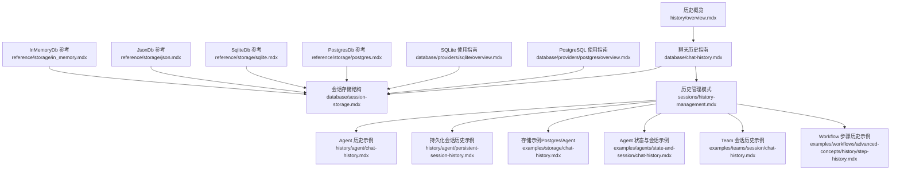
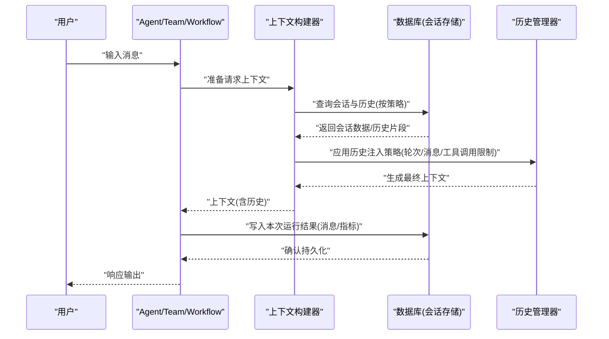
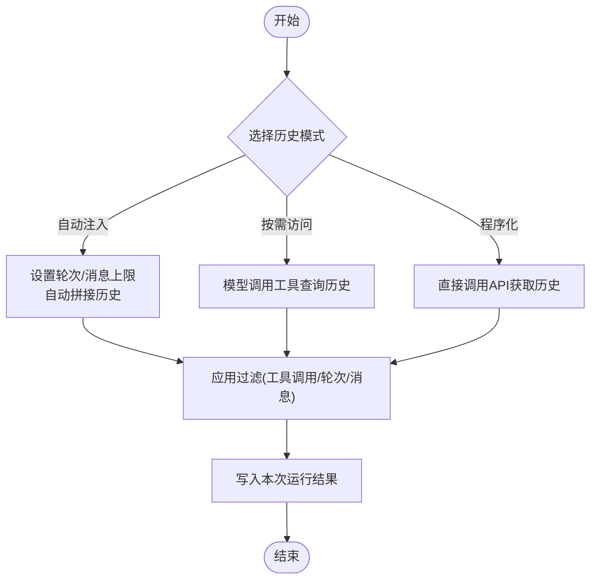
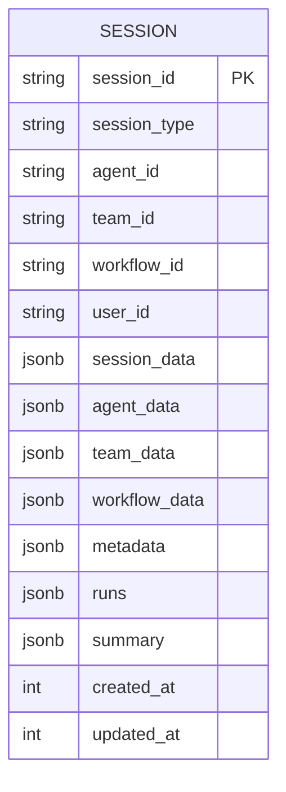
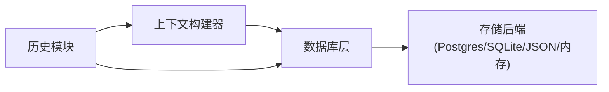

# 代理历史

<cite>
**本文引用的文件**
- [history/overview.mdx](file://history/overview.mdx)
- [database/chat-history.mdx](file://database/chat-history.mdx)
- [sessions/history-management.mdx](file://sessions/history-management.mdx)
- [database/session-storage.mdx](file://database/session-storage.mdx)
- [history/agent/chat-history.mdx](file://history/agent/chat-history.mdx)
- [history/agent/persistent-session-history.mdx](file://history/agent/persistent-session-history.mdx)
- [examples/storage/chat-history.mdx](file://examples/storage/chat-history.mdx)
- [examples/agents/state-and-session/chat-history.mdx](file://examples/agents/state-and-session/chat-history.mdx)
- [examples/teams/session/chat-history.mdx](file://examples/teams/session/chat-history.mdx)
- [examples/workflows/advanced-concepts/history/step-history.mdx](file://examples/workflows/advanced-concepts/history/step-history.mdx)
- [database/providers/postgres/overview.mdx](file://database/providers/postgres/overview.mdx)
- [database/providers/sqlite/overview.mdx](file://database/providers/sqlite/overview.mdx)
- [reference/storage/postgres.mdx](file://reference/storage/postgres.mdx)
- [reference/storage/sqlite.mdx](file://reference/storage/sqlite.mdx)
- [reference/storage/json.mdx](file://reference/storage/json.mdx)
- [reference/storage/in_memory.mdx](file://reference/storage/in_memory.mdx)
- [memory/agent/overview.mdx](file://memory/agent/overview.mdx)
</cite>

## 目录
1. [引言](#引言)
2. [项目结构](#项目结构)
3. [核心组件](#核心组件)
4. [架构总览](#架构总览)
5. [详细组件分析](#详细组件分析)
6. [依赖关系分析](#依赖关系分析)
7. [性能考量](#性能考量)
8. [故障排查指南](#故障排查指南)
9. [结论](#结论)
10. [附录](#附录)

## 引言
本技术文档聚焦于“代理历史”（Agent History）的实现与使用，系统阐述聊天历史的存储、检索与管理机制，覆盖持久化会话历史的配置与访问模式，以及代理历史的 API 接口与配置选项。文档还提供在代理中集成历史管理功能的具体示例路径，并讨论历史数据的隐私保护与合规性考虑，最后给出常见问题的解决方案与性能优化建议。

## 项目结构
围绕代理历史能力，仓库提供了从概览到具体实现的完整文档链路：
- 历史概览：介绍历史能力的总体目标与适用场景
- 数据库与会话存储：定义历史数据的持久化结构与检索方式
- 历史管理模式：自动注入、按需访问、程序化获取等策略
- 示例与用法：Agent/Team/Workflow 的历史启用与限制策略
- 存储后端：PostgreSQL、SQLite、JSON 文件、内存数据库等

图表来源
- [history/overview.mdx:1-49](file://history/overview.mdx#L1-L49)
- [database/chat-history.mdx:1-159](file://database/chat-history.mdx#L1-L159)
- [sessions/history-management.mdx:1-108](file://sessions/history-management.mdx#L1-L108)
- [database/session-storage.mdx:1-119](file://database/session-storage.mdx#L1-L119)
- [history/agent/chat-history.mdx:1-67](file://history/agent/chat-history.mdx#L1-L67)
- [history/agent/persistent-session-history.mdx:1-68](file://history/agent/persistent-session-history.mdx#L1-L68)
- [examples/storage/chat-history.mdx:1-57](file://examples/storage/chat-history.mdx#L1-L57)
- [examples/agents/state-and-session/chat-history.mdx:1-57](file://examples/agents/state-and-session/chat-history.mdx#L1-L57)
- [examples/teams/session/chat-history.mdx:1-74](file://examples/teams/session/chat-history.mdx#L1-L74)
- [examples/workflows/advanced-concepts/history/step-history.mdx:1-263](file://examples/workflows/advanced-concepts/history/step-history.mdx#L1-L263)
- [database/providers/postgres/overview.mdx:1-42](file://database/providers/postgres/overview.mdx#L1-L42)
- [database/providers/sqlite/overview.mdx:1-24](file://database/providers/sqlite/overview.mdx#L1-L24)
- [reference/storage/postgres.mdx:1-9](file://reference/storage/postgres.mdx#L1-L9)
- [reference/storage/sqlite.mdx:1-8](file://reference/storage/sqlite.mdx#L1-L8)
- [reference/storage/json.mdx:1-8](file://reference/storage/json.mdx#L1-L8)
- [reference/storage/in_memory.mdx:1-8](file://reference/storage/in_memory.mdx#L1-L8)

章节来源
- [history/overview.mdx:1-49](file://history/overview.mdx#L1-L49)
- [database/chat-history.mdx:1-159](file://database/chat-history.mdx#L1-L159)
- [sessions/history-management.mdx:1-108](file://sessions/history-management.mdx#L1-L108)
- [database/session-storage.mdx:1-119](file://database/session-storage.mdx#L1-L119)

## 核心组件
- 历史注入策略
  - 自动注入：通过配置开关将最近若干轮对话自动加入上下文
  - 按需访问：模型可调用工具主动查询历史
  - 程序化获取：直接在代码中调用 API 获取历史
- 历史规模控制
  - 轮次限制：限制最近 N 轮
  - 总消息上限：限制跨轮次的消息总数
  - 工具调用过滤：限制来自历史中的工具调用消息数量
- 会话与持久化
  - 会话标识：通过 session_id 维持连续对话
  - 存储表：支持自定义会话表名，便于隔离不同环境或实体
  - 多实体支持：Agent/Team/Workflow 均可启用历史

章节来源
- [database/chat-history.mdx:9-94](file://database/chat-history.mdx#L9-L94)
- [sessions/history-management.mdx:10-76](file://sessions/history-management.mdx#L10-L76)
- [database/session-storage.mdx:9-51](file://database/session-storage.mdx#L9-L51)

## 架构总览
下图展示了代理历史在运行时的关键交互：代理/团队/工作流在执行过程中，根据配置决定是否自动注入历史、是否允许按需查询，以及如何从数据库中读取/写入会话与历史数据。

图表来源
- [database/chat-history.mdx:9-94](file://database/chat-history.mdx#L9-L94)
- [sessions/history-management.mdx:10-76](file://sessions/history-management.mdx#L10-L76)
- [database/session-storage.mdx:30-70](file://database/session-storage.mdx#L30-L70)

## 详细组件分析

### 组件一：历史注入策略与参数
- 自动注入（最常用）
  - 配置项：开启注入、设置最近轮次数
  - 适用场景：聊天式产品、快速原型、需要前文上下文的交互
- 按需访问
  - 配置项：开启按需读取，模型获得查询历史的工具
  - 适用场景：审计、分析或大多数查询不需要历史的场景
- 程序化访问
  - API：获取聊天历史、会话消息、上次运行输出
  - 适用场景：自定义 UI、调试、导出对话记录

图表来源
- [sessions/history-management.mdx:10-76](file://sessions/history-management.mdx#L10-L76)
- [database/chat-history.mdx:47-110](file://database/chat-history.mdx#L47-L110)

章节来源
- [sessions/history-management.mdx:10-76](file://sessions/history-management.mdx#L10-L76)
- [database/chat-history.mdx:47-110](file://database/chat-history.mdx#L47-L110)

### 组件二：会话存储与检索
- 存储结构
  - 字段：会话标识、类型、关联实体标识、用户标识、会话数据、配置元数据、运行列表、摘要、时间戳等
  - 支持多实体：Agent/Team/Workflow
- 检索方式
  - 获取会话：按 session_id 获取完整会话
  - 获取消息：按轮次提取用户-助手配对消息
  - 获取上次运行：带指标与工具调用的运行输出

图表来源
- [database/session-storage.mdx:30-51](file://database/session-storage.mdx#L30-L51)

章节来源
- [database/session-storage.mdx:30-92](file://database/session-storage.mdx#L30-L92)

### 组件三：跨会话历史与团队共享
- 跨会话历史
  - 配置：开启跨会话搜索、限制最近会话数
  - 注意：会话数不宜过高，避免上下文窗口溢出
- 团队共享
  - 配置：成员间共享团队历史
  - 效果：成员可见完整团队对话，而非仅自身交互

章节来源
- [database/chat-history.mdx:81-124](file://database/chat-history.mdx#L81-L124)

### 组件四：工作流步骤历史
- 工作流级历史：将前序运行结果传递给后续步骤
- 步骤级历史：仅指定步骤可见历史，实现更细粒度的上下文控制
- 典型场景：内容创作流水线中，研究与创作阶段逐步累积上下文

章节来源
- [examples/workflows/advanced-concepts/history/step-history.mdx:126-192](file://examples/workflows/advanced-concepts/history/step-history.mdx#L126-L192)

### 组件五：存储后端与配置
- PostgreSQL
  - 用途：生产级关系型存储，支持 JSONB、高效查询
  - 参数：连接串、会话表名等
- SQLite
  - 用途：本地开发与测试，文件路径可替换
  - 参数：数据库文件路径等
- JSON/内存数据库
  - 用途：轻量、分布式或临时演示场景
  - 注意：内存数据库进程退出即丢失

章节来源
- [database/providers/postgres/overview.mdx:9-42](file://database/providers/postgres/overview.mdx#L9-L42)
- [database/providers/sqlite/overview.mdx:9-24](file://database/providers/sqlite/overview.mdx#L9-L24)
- [reference/storage/postgres.mdx:1-9](file://reference/storage/postgres.mdx#L1-L9)
- [reference/storage/sqlite.mdx:1-8](file://reference/storage/sqlite.mdx#L1-L8)
- [reference/storage/json.mdx:1-8](file://reference/storage/json.mdx#L1-L8)
- [reference/storage/in_memory.mdx:1-8](file://reference/storage/in_memory.mdx#L1-L8)

### 组件六：API 与配置选项清单
- 历史注入开关
  - 自动注入：add_history_to_context
  - 轮次限制：num_history_runs
  - 消息上限：num_history_messages
  - 工具调用限制：max_tool_calls_from_history
- 按需访问
  - read_chat_history：开启 get_chat_history() 工具
- 跨会话历史
  - search_session_history：跨会话搜索
  - num_history_sessions：最近会话数
- 团队共享
  - add_team_history_to_members：成员共享团队历史
- 工作流历史
  - add_workflow_history_to_steps：步骤接收工作流历史
  - add_workflow_history：步骤接收上一步内容
- 程序化接口
  - get_chat_history(session_id)
  - get_session_messages(session_id)
  - get_last_run_output()

章节来源
- [database/chat-history.mdx:47-159](file://database/chat-history.mdx#L47-L159)

## 依赖关系分析
- 组件耦合
  - 历史模块依赖数据库层以读写会话与运行数据
  - 上下文构建器依赖历史模块进行历史拼接与过滤
  - 运行时写入依赖数据库层完成持久化
- 外部依赖
  - PostgreSQL/SQLite/JSON/内存数据库作为存储后端
  - 模型服务用于实际推理与工具调用

图表来源
- [database/chat-history.mdx:9-94](file://database/chat-history.mdx#L9-L94)
- [sessions/history-management.mdx:10-76](file://sessions/history-management.mdx#L10-L76)
- [database/session-storage.mdx:30-70](file://database/session-storage.mdx#L30-L70)

## 性能考量
- 控制历史规模
  - 合理设置 num_history_runs 与 num_history_messages，避免上下文过长导致延迟与成本上升
  - 对工具调用噪声较多的场景，使用 max_tool_calls_from_history 降低历史中的工具调用消息
- 结合会话摘要
  - 对长时间对话，采用会话摘要压缩历史，减少 token 使用
- 缓存与连接池
  - 在高并发场景下，合理配置数据库连接池与索引，减少往返开销
- 存储选择
  - 生产优先 PostgreSQL；本地开发可用 SQLite；临时演示可用内存数据库

章节来源
- [database/chat-history.mdx:47-94](file://database/chat-history.mdx#L47-L94)
- [sessions/history-management.mdx:69-76](file://sessions/history-management.mdx#L69-L76)

## 故障排查指南
- 未配置数据库
  - 症状：历史无法加载或注入
  - 处理：确保 Agent/Team/Workflow 已配置数据库实例
- 历史过大导致上下文溢出
  - 症状：模型拒绝处理或响应质量下降
  - 处理：降低 num_history_runs 或开启会话摘要
- 会话未延续
  - 症状：每次运行都像新对话
  - 处理：确保使用相同的 session_id，并开启 add_history_to_context
- 跨会话历史过多
  - 症状：上下文窗口被大量历史填满
  - 处理：降低 num_history_sessions 至 2-3
- 程序化接口无数据
  - 症状：get_chat_history()/get_session_messages() 返回空
  - 处理：确认 session_id 正确且数据库已持久化该会话

章节来源
- [database/chat-history.mdx:43-94](file://database/chat-history.mdx#L43-L94)
- [sessions/history-management.mdx:12-76](file://sessions/history-management.mdx#L12-L76)
- [database/session-storage.mdx:52-70](file://database/session-storage.mdx#L52-L70)

## 结论
代理历史通过“自动注入、按需访问、程序化获取”的多种模式，结合轮次、消息与工具调用的多重限制，实现了在不同场景下的高效上下文管理。配合会话存储与多后端支持，开发者可以灵活地在生产与开发环境中部署并优化历史能力。建议在长对话场景中结合会话摘要，在工具密集场景中限制工具调用历史，以平衡效果与性能。

## 附录

### 示例与集成路径
- Agent 聊天历史示例
  - [history/agent/chat-history.mdx:1-67](file://history/agent/chat-history.mdx#L1-L67)
  - [examples/agents/state-and-session/chat-history.mdx:1-57](file://examples/agents/state-and-session/chat-history.mdx#L1-L57)
  - [examples/storage/chat-history.mdx:1-57](file://examples/storage/chat-history.mdx#L1-L57)
- 持久化会话与历史上下文
  - [history/agent/persistent-session-history.mdx:1-68](file://history/agent/persistent-session-history.mdx#L1-L68)
- Team 会话历史与限制
  - [examples/teams/session/chat-history.mdx:1-74](file://examples/teams/session/chat-history.mdx#L1-L74)
- Workflow 步骤历史
  - [examples/workflows/advanced-concepts/history/step-history.mdx:1-263](file://examples/workflows/advanced-concepts/history/step-history.mdx#L1-L263)

### 存储后端参考
- PostgreSQL
  - [database/providers/postgres/overview.mdx:1-42](file://database/providers/postgres/overview.mdx#L1-L42)
  - [reference/storage/postgres.mdx:1-9](file://reference/storage/postgres.mdx#L1-L9)
- SQLite
  - [database/providers/sqlite/overview.mdx:1-24](file://database/providers/sqlite/overview.mdx#L1-L24)
  - [reference/storage/sqlite.mdx:1-8](file://reference/storage/sqlite.mdx#L1-L8)
- JSON/内存数据库
  - [reference/storage/json.mdx:1-8](file://reference/storage/json.mdx#L1-L8)
  - [reference/storage/in_memory.mdx:1-8](file://reference/storage/in_memory.mdx#L1-L8)

### 隐私与合规建议
- 最小化原则：仅持久化必要的会话与历史数据
- 访问控制：限制对历史数据的访问权限，遵循 RBAC
- 数据保留：设定合理的保留周期与清理策略
- 审计日志：对历史查询与修改行为进行审计
- 用户权利：提供删除、导出或限制处理个人数据的权利入口

[本节为通用指导，不直接分析特定文件]