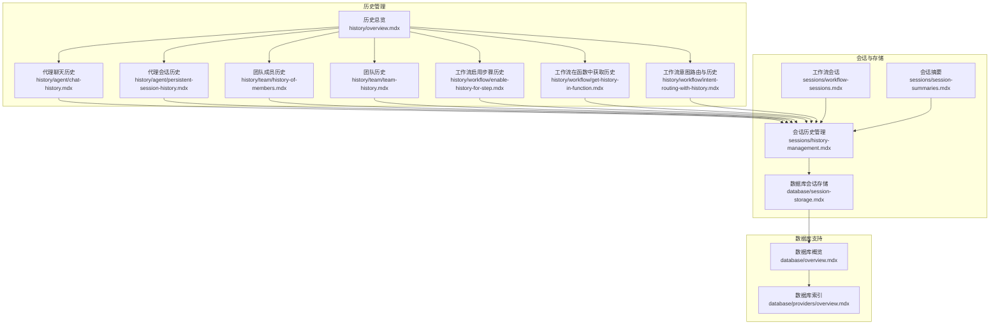
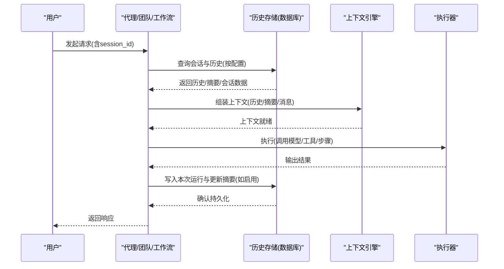
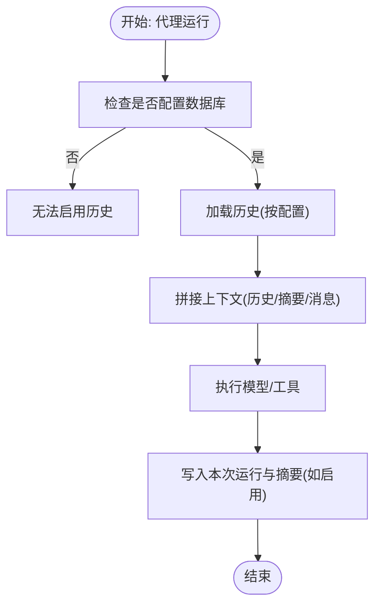
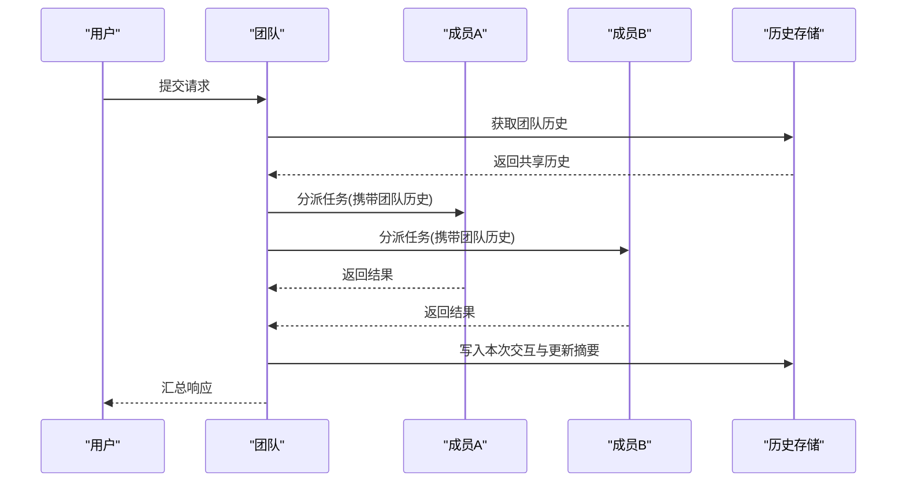
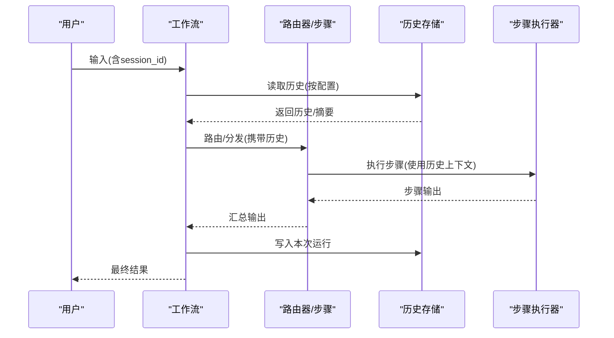
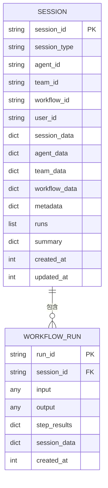
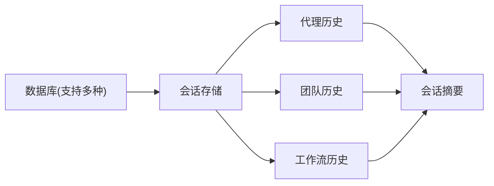

# 历史管理

<cite>
**本文引用的文件**
- [历史总览](file://history/overview.mdx)
- [代理会话历史](file://history/agent/persistent-session-history.mdx)
- [代理聊天历史](file://history/agent/chat-history.mdx)
- [团队成员历史](file://history/team/history-of-members.mdx)
- [团队历史](file://history/team/team-history.mdx)
- [工作流启用步骤历史](file://history/workflow/enable-history-for-step.mdx)
- [工作流在函数中获取历史](file://history/workflow/get-history-in-function.mdx)
- [工作流意图路由与历史](file://history/workflow/intent-routing-with-history.mdx)
- [会话历史管理](file://sessions/history-management.mdx)
- [数据库会话存储](file://database/session-storage.mdx)
- [会话摘要](file://sessions/session-summaries.mdx)
- [工作流会话](file://sessions/workflow-sessions.mdx)
- [数据库概览](file://database/overview.mdx)
- [数据库索引](file://database/providers/overview.mdx)
</cite>

## 目录
1. [简介](#简介)
2. [项目结构](#项目结构)
3. [核心组件](#核心组件)
4. [架构总览](#架构总览)
5. [详细组件分析](#详细组件分析)
6. [依赖关系分析](#依赖关系分析)
7. [性能考量](#性能考量)
8. [故障排查指南](#故障排查指南)
9. [结论](#结论)
10. [附录](#附录)

## 简介
本技术文档围绕历史管理系统展开，系统性阐述历史记录的定义、存储与检索机制，并覆盖以下主题：
- 代理历史：聊天历史、操作历史与执行历史的记录与查询
- 团队历史：成员交互历史、跨成员共享历史与决策历史
- 工作流历史：步骤执行历史、状态变更历史与性能指标
- 清理策略：自动清理、手动清理与保留策略
- 导出与分析：历史数据导出与分析，辅助系统监控与性能优化
- 隐私与合规：历史数据的隐私保护与合规要求

## 项目结构
历史管理能力贯穿代理（Agent）、团队（Team）与工作流（Workflow）三层，配合数据库持久化与会话管理实现历史的持续积累与高效利用。

**图表来源**
- [历史总览:1-49](file://history/overview.mdx#L1-L49)
- [代理聊天历史:1-67](file://history/agent/chat-history.mdx#L1-L67)
- [代理会话历史:1-68](file://history/agent/persistent-session-history.mdx#L1-L68)
- [团队成员历史:1-121](file://history/team/history-of-members.mdx#L1-L121)
- [团队历史:1-119](file://history/team/team-history.mdx#L1-L119)
- [工作流启用步骤历史:1-113](file://history/workflow/enable-history-for-step.mdx#L1-L113)
- [工作流在函数中获取历史:1-246](file://history/workflow/get-history-in-function.mdx#L1-L246)
- [工作流意图路由与历史:1-186](file://history/workflow/intent-routing-with-history.mdx#L1-L186)
- [会话历史管理:1-108](file://sessions/history-management.mdx#L1-L108)
- [数据库会话存储:1-119](file://database/session-storage.mdx#L1-L119)
- [会话摘要:1-184](file://sessions/session-summaries.mdx#L1-L184)
- [工作流会话:1-243](file://sessions/workflow-sessions.mdx#L1-L243)
- [数据库概览](file://database/overview.mdx)
- [数据库索引:1-175](file://database/providers/overview.mdx#L1-L175)

**章节来源**
- [历史总览:1-49](file://history/overview.mdx#L1-L49)
- [数据库索引:1-175](file://database/providers/overview.mdx#L1-L175)

## 核心组件
- 会话与历史存储
  - 会话存储：统一以 session_id 组织运行记录，支持按类型（代理/团队/工作流）归档
  - 历史控制：通过参数控制历史纳入上下文的数量、消息上限与工具调用噪声过滤
- 历史模式
  - 自动历史：每次运行自动附加最近历史
  - 按需访问：模型可选择性调用历史读取工具
  - 程序化访问：直接在代码中获取会话消息、最后运行输出等
- 会话摘要
  - 自动生成并更新摘要，降低长对话的上下文开销
  - 可混合近期消息与摘要，兼顾成本与细节
- 数据库支持
  - 支持多种数据库（关系型/NoSQL/云服务），满足不同规模与部署形态

**章节来源**
- [会话历史管理:1-108](file://sessions/history-management.mdx#L1-L108)
- [数据库会话存储:1-119](file://database/session-storage.mdx#L1-L119)
- [会话摘要:1-184](file://sessions/session-summaries.mdx#L1-L184)
- [数据库概览](file://database/overview.mdx)
- [数据库索引:1-175](file://database/providers/overview.mdx#L1-L175)

## 架构总览
历史管理的端到端流程包括：运行触发、历史检索、上下文组装、执行与结果写回、会话持久化与摘要维护。

**图表来源**
- [会话历史管理:1-108](file://sessions/history-management.mdx#L1-L108)
- [数据库会话存储:1-119](file://database/session-storage.mdx#L1-L119)
- [会话摘要:1-184](file://sessions/session-summaries.mdx#L1-L184)
- [工作流会话:1-243](file://sessions/workflow-sessions.mdx#L1-L243)

## 详细组件分析

### 代理历史
- 聊天历史
  - 通过配置自动将最近 N 轮消息加入上下文，或按需调用历史读取工具
  - 支持跨会话检索与程序化访问
- 会话历史
  - 结合团队场景，使用会话表与历史限制参数，控制上下文规模
- 典型用法
  - 在代理初始化时指定数据库与历史开关，结合会话 ID 实现多轮对话记忆

**图表来源**
- [代理聊天历史:1-67](file://history/agent/chat-history.mdx#L1-L67)
- [代理会话历史:1-68](file://history/agent/persistent-session-history.mdx#L1-L68)
- [会话历史管理:1-108](file://sessions/history-management.mdx#L1-L108)

**章节来源**
- [代理聊天历史:1-67](file://history/agent/chat-history.mdx#L1-L67)
- [代理会话历史:1-68](file://history/agent/persistent-session-history.mdx#L1-L68)
- [会话历史管理:1-108](file://sessions/history-management.mdx#L1-L108)

### 团队历史
- 成员级历史
  - 各成员仅可见自身历史，适合独立任务与隔离上下文
- 团队级历史
  - 通过共享团队历史，使成员能复用跨成员的先前交互信息
- 使用建议
  - 成员独立性强时选成员历史；需要跨成员协作时选团队历史

**图表来源**
- [团队成员历史:1-121](file://history/team/history-of-members.mdx#L1-L121)
- [团队历史:1-119](file://history/team/team-history.mdx#L1-L119)
- [会话历史管理:1-108](file://sessions/history-management.mdx#L1-L108)

**章节来源**
- [团队成员历史:1-121](file://history/team/history-of-members.mdx#L1-L121)
- [团队历史:1-119](file://history/team/team-history.mdx#L1-L119)
- [会话历史管理:1-108](file://sessions/history-management.mdx#L1-L108)

### 工作流历史
- 步骤级历史
  - 为特定步骤开启工作流历史，避免重复内容与提升一致性
- 函数内获取历史
  - 在自定义函数中读取历史列表或上下文字符串，进行策略分析与去重
- 意图路由与历史
  - 多专家路由共享同一历史，确保跨专家的一致性与连续性

**图表来源**
- [工作流启用步骤历史:1-113](file://history/workflow/enable-history-for-step.mdx#L1-L113)
- [工作流在函数中获取历史:1-246](file://history/workflow/get-history-in-function.mdx#L1-L246)
- [工作流意图路由与历史:1-186](file://history/workflow/intent-routing-with-history.mdx#L1-L186)
- [工作流会话:1-243](file://sessions/workflow-sessions.mdx#L1-L243)

**章节来源**
- [工作流启用步骤历史:1-113](file://history/workflow/enable-history-for-step.mdx#L1-L113)
- [工作流在函数中获取历史:1-246](file://history/workflow/get-history-in-function.mdx#L1-L246)
- [工作流意图路由与历史:1-186](file://history/workflow/intent-routing-with-history.mdx#L1-L186)
- [工作流会话:1-243](file://sessions/workflow-sessions.mdx#L1-L243)

### 会话与存储
- 会话存储
  - 以 session_id 为键，存储会话元数据、运行记录、摘要与时间戳
  - 支持自定义表名，便于环境隔离
- 会话摘要
  - 自动压缩长对话，显著降低 token 成本
  - 可与近期消息混合使用，平衡成本与细节
- 工作流会话
  - 存储完整运行记录（输入、输出、步骤结果、状态与指标）
  - 支持历史上下文注入步骤输入，形成“学习”与“复用”的闭环

**图表来源**
- [数据库会话存储:1-119](file://database/session-storage.mdx#L1-L119)
- [工作流会话:1-243](file://sessions/workflow-sessions.mdx#L1-L243)

**章节来源**
- [数据库会话存储:1-119](file://database/session-storage.mdx#L1-L119)
- [会话摘要:1-184](file://sessions/session-summaries.mdx#L1-L184)
- [工作流会话:1-243](file://sessions/workflow-sessions.mdx#L1-L243)

## 依赖关系分析
- 历史能力依赖数据库配置
  - 无数据库则无法检索/写入历史
  - 不同数据库提供不同的性能与扩展特性
- 历史与会话的关系
  - 代理/团队：消息级历史（对话）
  - 工作流：运行级历史（执行）
- 历史与摘要的协同
  - 摘要降低 token 开销，历史保证上下文连续性

**图表来源**
- [数据库索引:1-175](file://database/providers/overview.mdx#L1-L175)
- [数据库会话存储:1-119](file://database/session-storage.mdx#L1-L119)
- [会话摘要:1-184](file://sessions/session-summaries.mdx#L1-L184)

**章节来源**
- [数据库索引:1-175](file://database/providers/overview.mdx#L1-L175)
- [数据库会话存储:1-119](file://database/session-storage.mdx#L1-L119)
- [会话摘要:1-184](file://sessions/session-summaries.mdx#L1-L184)

## 性能考量
- 历史规模控制
  - 通过 num_history_runs、num_history_messages、max_tool_calls_from_history 控制上下文大小
- 会话摘要
  - 自动生成摘要，线性增长上下文，显著降低成本
- 混合策略
  - 摘要 + 近期消息，兼顾成本与细节
- 数据库选择
  - 根据吞吐与延迟需求选择合适数据库（关系型/云原生/内存）

[本节为通用指导，不直接分析具体文件]

## 故障排查指南
- 历史未生效
  - 确认已配置数据库且会话表存在
  - 检查 add_history_to_context/read_chat_history 等开关
- 上下文过长
  - 启用会话摘要或减少历史轮次
  - 使用 cross-session 历史时保持较低会话数量
- 工作流历史未注入
  - 确认 add_workflow_history_to_steps 已启用
  - 检查步骤是否正确读取历史上下文
- 数据库连接问题
  - 校验连接参数与权限
  - 使用官方数据库索引页面核对支持项

**章节来源**
- [会话历史管理:1-108](file://sessions/history-management.mdx#L1-L108)
- [工作流会话:1-243](file://sessions/workflow-sessions.mdx#L1-L243)
- [数据库会话存储:1-119](file://database/session-storage.mdx#L1-L119)
- [数据库索引:1-175](file://database/providers/overview.mdx#L1-L175)

## 结论
历史管理系统通过统一的会话存储与灵活的历史模式，在代理、团队与工作流层面实现了从“对话记忆”到“执行记忆”的全链路覆盖。结合会话摘要与多数据库支持，系统在成本、性能与可扩展性之间取得良好平衡。建议根据业务场景选择合适的模式与参数，并建立完善的清理与导出策略，以保障长期稳定运行与合规安全。

[本节为总结性内容，不直接分析具体文件]

## 附录

### 历史数据清理策略
- 自动清理
  - 基于会话年龄或运行次数的阈值清理
  - 会话摘要定期更新，避免冗余
- 手动清理
  - 按会话 ID 或用户维度删除历史
  - 导出后本地销毁敏感数据
- 保留策略
  - 按法规要求设定保留期限
  - 对高价值会话采用冷热分层存储

[本节为通用指导，不直接分析具体文件]

### 历史数据导出与分析
- 导出方式
  - 程序化访问：get_chat_history()/get_session_messages()/get_last_run_output()
  - 数据库直连：按表结构导出
- 分析用途
  - 用户行为画像、对话质量评估、成本与性能趋势
- 可视化建议
  - 会话摘要与历史折线图、工具调用热力图、错误率与响应时延

**章节来源**
- [会话历史管理:1-108](file://sessions/history-management.mdx#L1-L108)
- [数据库会话存储:1-119](file://database/session-storage.mdx#L1-L119)

### 隐私保护与合规
- 数据最小化
  - 仅存储必要字段，关闭不必要的历史开关
- 匿名化与去标识化
  - 对导出数据进行脱敏处理
- 访问控制
  - 严格限制数据库与文件系统访问权限
- 审计日志
  - 记录历史读取与修改操作，便于追溯

[本节为通用指导，不直接分析具体文件]