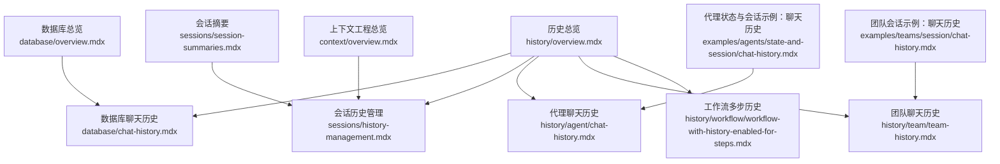
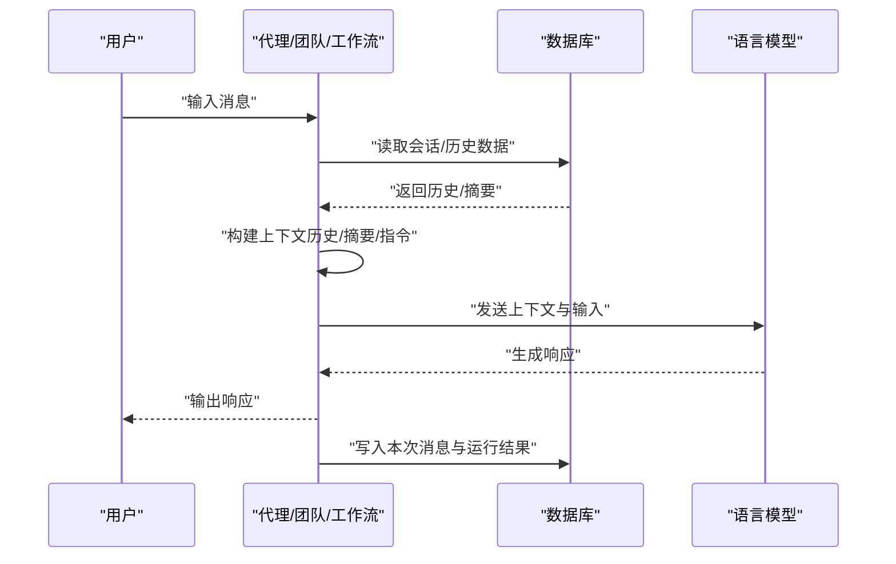
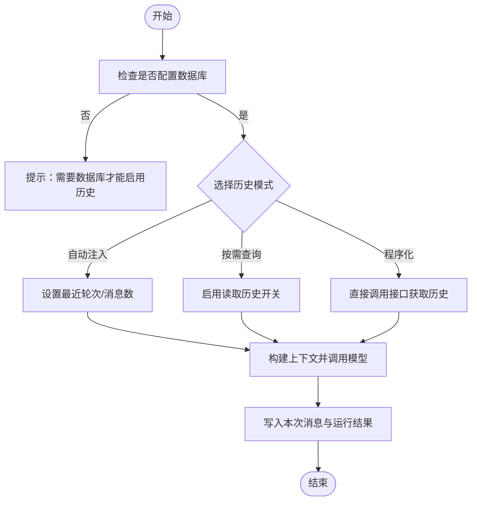
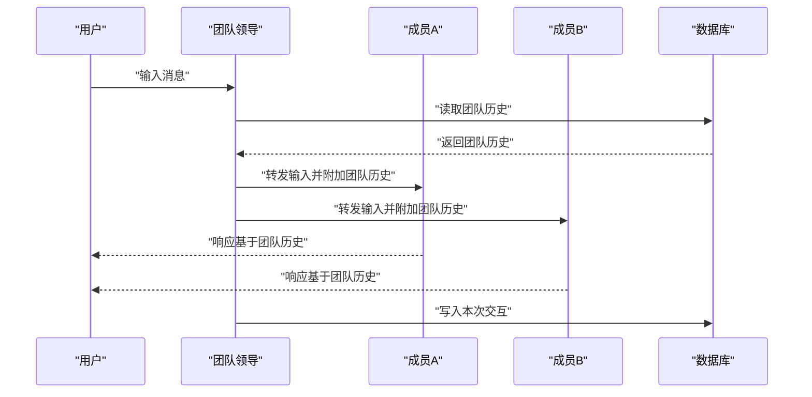
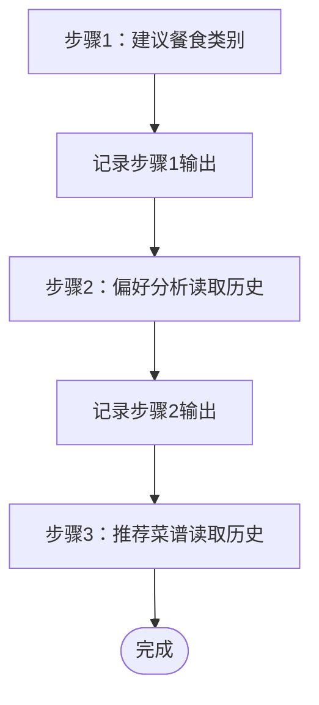
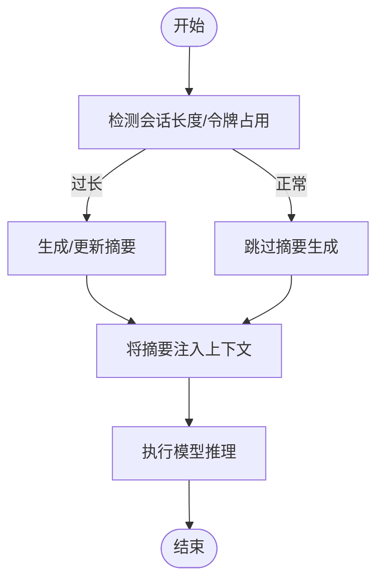
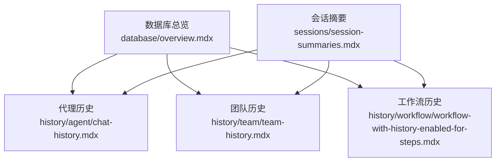

# 历史管理基础

<cite>
**本文引用的文件**
- [历史总览](file://history/overview.mdx)
- [会话历史管理](file://sessions/history-management.mdx)
- [数据库聊天历史](file://database/chat-history.mdx)
- [代理聊天历史](file://history/agent/chat-history.mdx)
- [团队聊天历史](file://history/team/team-history.mdx)
- [工作流多步历史](file://history/workflow/workflow-with-history-enabled-for-steps.mdx)
- [数据库总览](file://database/overview.mdx)
- [会话摘要](file://sessions/session-summaries.mdx)
- [上下文工程总览](file://context/overview.mdx)
- [代理状态与会话示例：聊天历史](file://examples/agents/state-and-session/chat-history.mdx)
- [团队会话示例：聊天历史](file://examples/teams/session/chat-history.mdx)
</cite>

## 目录
1. [引言](#引言)
2. [项目结构](#项目结构)
3. [核心组件](#核心组件)
4. [架构总览](#架构总览)
5. [详细组件分析](#详细组件分析)
6. [依赖分析](#依赖分析)
7. [性能考量](#性能考量)
8. [故障排查指南](#故障排查指南)
9. [结论](#结论)
10. [附录](#附录)

## 引言
本技术文档围绕“历史管理”的基础概念与实践展开，系统阐释对话历史的定义、作用与价值，并说明历史记录如何增强智能代理的交互能力：维护对话连续性、提供个性化响应、避免重复问题、启用长期对话。文档进一步覆盖历史管理在代理（Agent）、团队（Team）与工作流（Workflow）中的应用场景与优势；解释历史数据存储的基本要求与数据库配置的重要性；并总结最佳实践与设计原则，帮助开发者有效利用历史数据提升用户体验。

## 项目结构
该仓库以“知识库”形式组织内容，历史管理相关内容主要分布在以下路径：
- 历史总览与分层文档：history/*
- 会话与上下文：sessions/*、context/*
- 数据库与持久化：database/*
- 示例与用法：examples/*

下图给出与“历史管理”相关的主要文档与模块关系概览：

图表来源
- [历史总览:1-49](file://history/overview.mdx#L1-L49)
- [数据库聊天历史:1-159](file://database/chat-history.mdx#L1-L159)
- [会话历史管理:1-108](file://sessions/history-management.mdx#L1-L108)
- [代理聊天历史:1-67](file://history/agent/chat-history.mdx#L1-L67)
- [团队聊天历史:1-119](file://history/team/team-history.mdx#L1-L119)
- [工作流多步历史:1-190](file://history/workflow/workflow-with-history-enabled-for-steps.mdx#L1-L190)
- [数据库总览:1-130](file://database/overview.mdx#L1-L130)
- [会话摘要:1-184](file://sessions/session-summaries.mdx#L1-L184)
- [上下文工程总览:1-69](file://context/overview.mdx#L1-L69)
- [代理状态与会话示例：聊天历史:1-57](file://examples/agents/state-and-session/chat-history.mdx#L1-L57)
- [团队会话示例：聊天历史:1-74](file://examples/teams/session/chat-history.mdx#L1-L74)

章节来源
- [历史总览:1-49](file://history/overview.mdx#L1-L49)
- [数据库总览:1-130](file://database/overview.mdx#L1-L130)

## 核心组件
- 对话历史（Chat History）
  - 定义：在多轮对话中保存与引用先前消息的能力，使后续交互能基于历史上下文进行。
  - 价值：维持连续性、个性化响应、避免重复、支持长对话。
  - 要求：必须配置数据库，否则无法检索或持久化历史。
- 会话历史管理（Session History Management）
  - 自动模式：每次运行自动包含最近若干轮消息到上下文。
  - 按需访问：模型可选择调用工具查询历史。
  - 程序化访问：直接在代码中获取历史、消息对与上次运行输出。
- 会话摘要（Session Summaries）
  - 将长对话压缩为摘要，降低令牌成本并避免上下文窗口限制。
  - 自动生成与更新，可与近期历史混合使用。
- 上下文工程（Context Engineering）
  - 设计发送给语言模型的信息，明确哪些信息最有助于达成目标。
  - 历史是上下文的重要组成部分之一。

章节来源
- [历史总览:8-19](file://history/overview.mdx#L8-L19)
- [会话历史管理:10-76](file://sessions/history-management.mdx#L10-L76)
- [数据库聊天历史:7-159](file://database/chat-history.mdx#L7-L159)
- [会话摘要:7-58](file://sessions/session-summaries.mdx#L7-L58)
- [上下文工程总览:8-35](file://context/overview.mdx#L8-L35)

## 架构总览
下图展示从用户输入到模型响应的典型流程，以及历史管理在其中的位置与影响因素（自动注入、按需查询、程序化访问、摘要融合）：

图表来源
- [数据库聊天历史:7-45](file://database/chat-history.mdx#L7-L45)
- [会话历史管理:12-76](file://sessions/history-management.mdx#L12-L76)
- [会话摘要:44-58](file://sessions/session-summaries.mdx#L44-L58)

## 详细组件分析

### 组件A：代理中的聊天历史
- 功能要点
  - 通过配置数据库与开关参数实现自动历史注入与按需查询。
  - 支持限制纳入上下文的消息数量与轮次数，控制令牌开销。
  - 提供程序化接口用于 UI、审计与调试。
- 典型用法
  - 自动注入：开启开关并设置最近轮次数量。
  - 模型自决策：开启按需查询开关后，模型可调用工具检索历史。
  - 程序化访问：在代码中直接获取历史、消息对与上次运行输出。
- 示例参考
  - [代理聊天历史示例:9-29](file://history/agent/chat-history.mdx#L9-L29)
  - [代理状态与会话示例：聊天历史:15-43](file://examples/agents/state-and-session/chat-history.mdx#L15-L43)

图表来源
- [数据库聊天历史:7-45](file://database/chat-history.mdx#L7-L45)
- [会话历史管理:12-76](file://sessions/history-management.mdx#L12-L76)
- [代理聊天历史:9-29](file://history/agent/chat-history.mdx#L9-L29)

章节来源
- [代理聊天历史:1-67](file://history/agent/chat-history.mdx#L1-L67)
- [数据库聊天历史:7-159](file://database/chat-history.mdx#L7-L159)
- [会话历史管理:12-76](file://sessions/history-management.mdx#L12-L76)
- [代理状态与会话示例：聊天历史:1-57](file://examples/agents/state-and-session/chat-history.mdx#L1-L57)

### 组件B：团队中的聊天历史
- 功能要点
  - 支持在成员之间共享团队历史，使各成员都能看到此前与其他成员的交互。
  - 适用于跨成员协作、上下文同步与一致性响应。
- 关键参数
  - 在团队中启用成员共享历史的开关，确保成员任务包含完整团队上下文。
- 示例参考
  - [团队聊天历史示例:23-79](file://history/team/team-history.mdx#L23-L79)

图表来源
- [团队聊天历史:10-22](file://history/team/team-history.mdx#L10-L22)
- [团队聊天历史示例:23-79](file://history/team/team-history.mdx#L23-L79)

章节来源
- [团队聊天历史:1-119](file://history/team/team-history.mdx#L1-L119)

### 组件C：工作流中的多步历史
- 功能要点
  - 工作流步骤可通过开关将前一步的输出作为上下文传递给后续步骤。
  - 适合需要逐步推理、偏好分析与结果复用的多步任务。
- 关键参数
  - 启用工作流历史传递，并设置历史轮次上限以控制上下文规模。
- 示例参考
  - [工作流多步历史示例:13-147](file://history/workflow/workflow-with-history-enabled-for-steps.mdx#L13-L147)

图表来源
- [工作流多步历史:7-147](file://history/workflow/workflow-with-history-enabled-for-steps.mdx#L7-L147)

章节来源
- [工作流多步历史:1-190](file://history/workflow/workflow-with-history-enabled-for-steps.mdx#L1-L190)

### 组件D：会话摘要与令牌优化
- 功能要点
  - 长对话导致上下文膨胀，会显著增加令牌成本并触发上下文限制。
  - 通过自动生成摘要，将历史压缩为精炼要点，维持连续性的同时大幅降低令牌消耗。
- 使用建议
  - 开启摘要生成与上下文注入；必要时与近期历史混合使用。
  - 对于超长对话，优先采用摘要+少量近期轮次的组合策略。
- 参考
  - [会话摘要:7-58](file://sessions/session-summaries.mdx#L7-L58)

图表来源
- [会话摘要:25-58](file://sessions/session-summaries.mdx#L25-L58)

章节来源
- [会话摘要:1-184](file://sessions/session-summaries.mdx#L1-L184)

## 依赖分析
- 历史管理依赖数据库
  - 所有历史功能均需配置数据库；无数据库则无法检索或持久化历史。
- 统一存储与跨组件一致性
  - 代理、团队与工作流共享相同的数据库接口与存储结构，便于统一管理与扩展。
- 异步支持
  - 提供异步数据库类以适配高并发与低延迟场景。

图表来源
- [数据库总览:91-103](file://database/overview.mdx#L91-L103)
- [数据库聊天历史:7-45](file://database/chat-history.mdx#L7-L45)
- [会话摘要:44-58](file://sessions/session-summaries.mdx#L44-L58)

章节来源
- [数据库总览:1-130](file://database/overview.mdx#L1-L130)
- [数据库聊天历史:7-45](file://database/chat-history.mdx#L7-L45)
- [会话摘要:44-58](file://sessions/session-summaries.mdx#L44-L58)

## 性能考量
- 令牌成本控制
  - 长对话会指数级增长令牌占用；通过会话摘要将历史压缩为精炼要点，可显著降低成本。
- 历史规模与上下文窗口
  - 通过限制最近轮次与消息总数，避免超出上下文窗口。
- 模型选择与成本优化
  - 使用更便宜的模型生成摘要或处理记忆操作，主对话仍使用高性能模型。
- 异步数据库
  - 在高并发场景下使用异步数据库类，减少阻塞与等待时间。

章节来源
- [会话摘要:11-43](file://sessions/session-summaries.mdx#L11-L43)
- [会话历史管理:69-76](file://sessions/history-management.mdx#L69-L76)
- [数据库总览:109-120](file://database/overview.mdx#L109-L120)

## 故障排查指南
- 缺少数据库导致历史不可用
  - 症状：启用历史但未生效。
  - 处理：配置数据库并确保连接正确。
- 异步/同步引擎不匹配
  - 症状：出现异步或同步异常。
  - 处理：根据使用的数据库类选择对应的引擎创建方式。
- 历史过大导致上下文溢出
  - 症状：请求失败或响应质量下降。
  - 处理：启用会话摘要；调整最近轮次与消息上限；必要时清理旧历史。

章节来源
- [数据库聊天历史:43-45](file://database/chat-history.mdx#L43-L45)
- [数据库总览:122-130](file://database/overview.mdx#L122-L130)
- [会话摘要:11-23](file://sessions/session-summaries.mdx#L11-L23)

## 结论
历史管理是构建智能代理、团队与工作流的关键能力。它通过维护对话连续性、提供个性化响应、避免重复问题与支持长期对话，显著提升用户体验。结合数据库配置、会话摘要与上下文工程，开发者可以高效地控制令牌成本、优化性能并保持系统的可扩展性。建议在实际项目中遵循“摘要优先、限量注入、按需查询”的策略，并根据业务场景灵活选择自动/按需/程序化三种历史管理模式。

## 附录
- 快速参考
  - 自动注入：开启开关并设置最近轮次/消息上限。
  - 按需查询：启用读取历史开关，让模型自主决定何时检索。
  - 程序化访问：直接获取历史、消息对与上次运行输出，用于 UI 或审计。
  - 会话摘要：开启摘要生成与上下文注入，配合少量近期历史使用。
- 示例参考
  - [代理聊天历史示例:9-29](file://history/agent/chat-history.mdx#L9-L29)
  - [团队聊天历史示例:23-79](file://history/team/team-history.mdx#L23-L79)
  - [工作流多步历史示例:13-147](file://history/workflow/workflow-with-history-enabled-for-steps.mdx#L13-L147)
  - [代理状态与会话示例：聊天历史:15-43](file://examples/agents/state-and-session/chat-history.mdx#L15-L43)
  - [团队会话示例：聊天历史:13-60](file://examples/teams/session/chat-history.mdx#L13-L60)