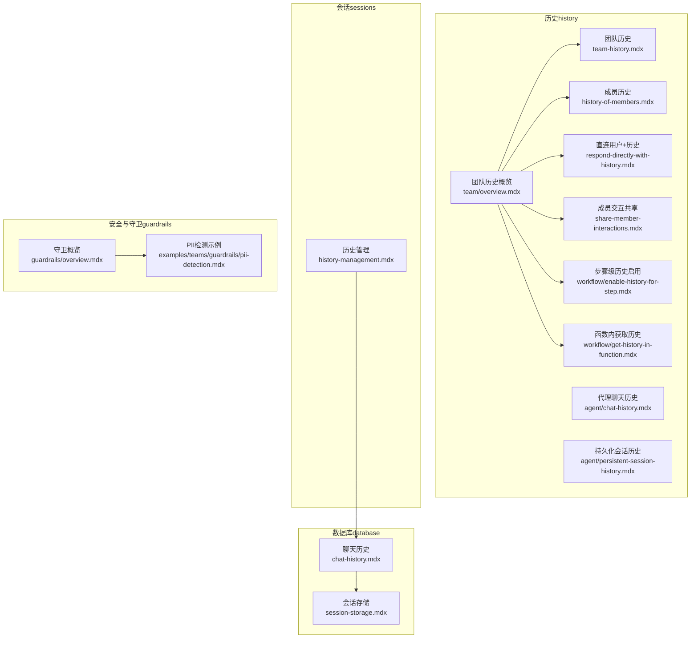
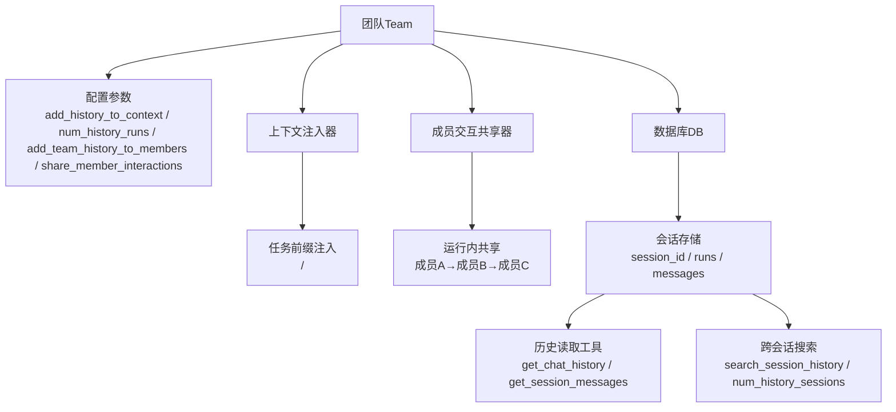
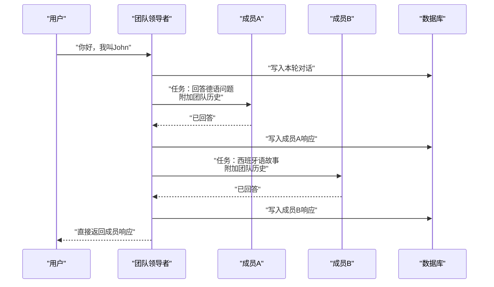
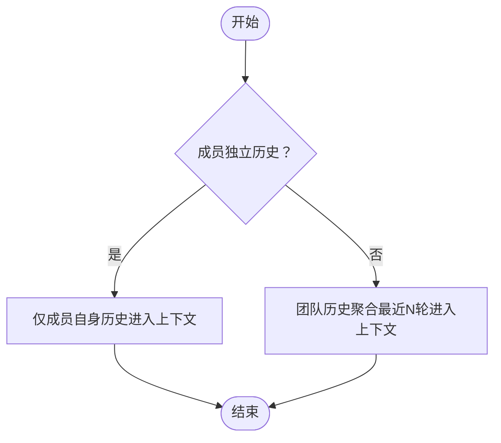
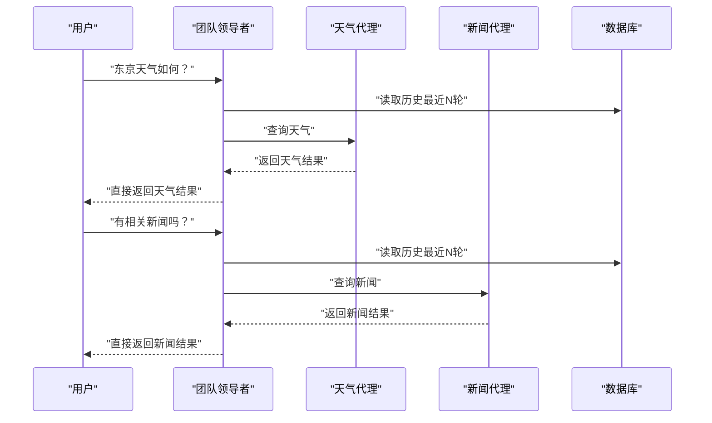
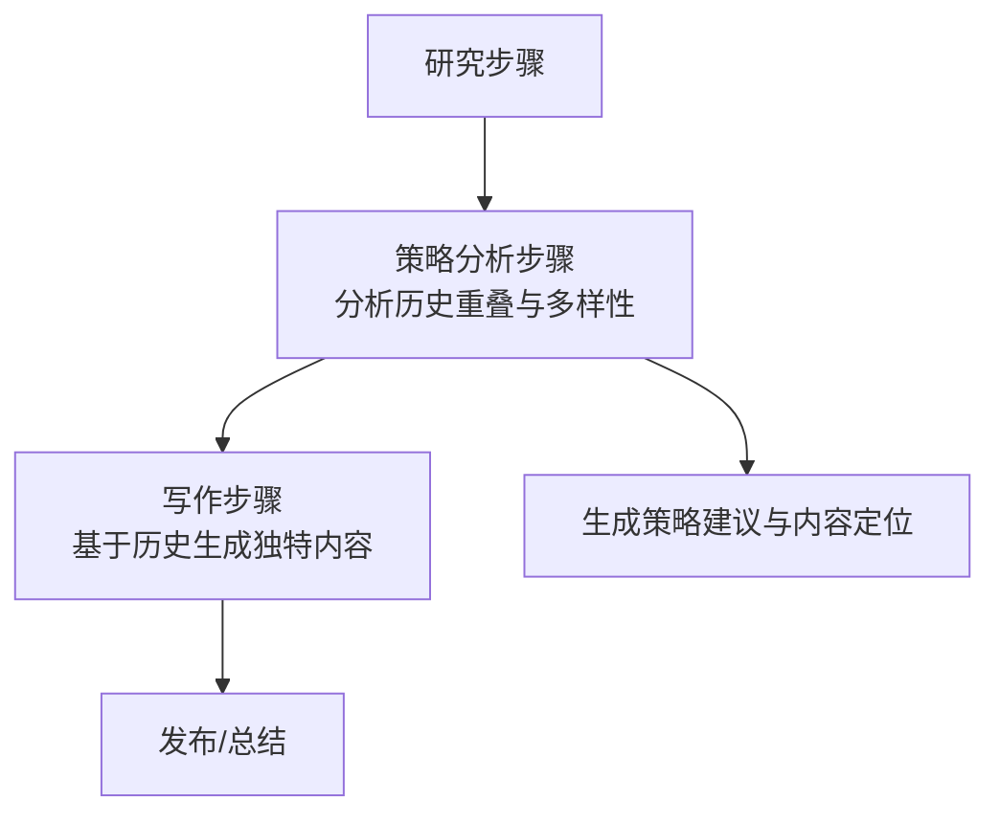
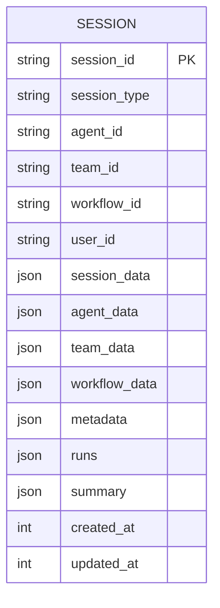
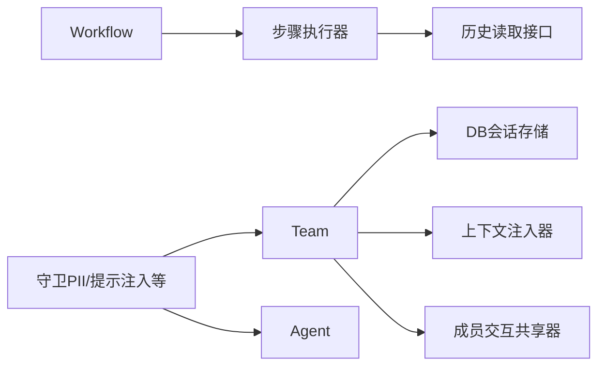

# 团队历史

<cite>
**本文引用的文件**
- [history/team/team-history.mdx](file://history/team/team-history.mdx)
- [history/team/history-of-members.mdx](file://history/team/history-of-members.mdx)
- [history/team/respond-directly-with-history.mdx](file://history/team/respond-directly-with-history.mdx)
- [history/team/share-member-interactions.mdx](file://history/team/share-member-interactions.mdx)
- [history/team/overview.mdx](file://history/team/overview.mdx)
- [history/agent/chat-history.mdx](file://history/agent/chat-history.mdx)
- [history/agent/persistent-session-history.mdx](file://history/agent/persistent-session-history.mdx)
- [history/workflow/enable-history-for-step.mdx](file://history/workflow/enable-history-for-step.mdx)
- [history/workflow/get-history-in-function.mdx](file://history/workflow/get-history-in-function.mdx)
- [sessions/history-management.mdx](file://sessions/history-management.mdx)
- [database/chat-history.mdx](file://database/chat-history.mdx)
- [database/session-storage.mdx](file://database/session-storage.mdx)
- [guardrails/overview.mdx](file://guardrails/overview.mdx)
- [examples/teams/guardrails/pii-detection.mdx](file://examples/teams/guardrails/pii-detection.mdx)
</cite>

## 目录
1. [简介](#简介)
2. [项目结构](#项目结构)
3. [核心组件](#核心组件)
4. [架构总览](#架构总览)
5. [详细组件分析](#详细组件分析)
6. [依赖关系分析](#依赖关系分析)
7. [性能考量](#性能考量)
8. [故障排查指南](#故障排查指南)
9. [结论](#结论)
10. [附录](#附录)

## 简介
本技术文档围绕“团队历史”主题，系统阐述团队协作中的历史记录与共享机制，覆盖以下关键目标：
- 团队历史的跟踪机制：如何收集、存储与在成员间共享交互历史
- 配置选项：历史数据的采集范围、存储介质与访问控制策略
- 成员历史管理：个人历史的独立存储与团队级聚合
- 历史共享机制：成员交互在团队内的传递与同步
- 团队直接响应历史：在“直连用户”的团队模式下如何利用历史
- 查询与分析：通过工具与接口获取历史，辅助管理者评估协作效果
- 隐私保护与数据治理：输入检查、敏感信息处理与企业级安全设计

## 项目结构
与“团队历史”相关的内容主要分布在以下路径：
- 历史（history）：团队、代理、工作流层面的历史用法与示例
- 会话（sessions）：历史管理与上下文注入模式
- 数据库（database）：会话存储、消息持久化与检索
- 安全与守卫（guardrails）：输入检查与隐私保护

**图表来源**
- [history/team/overview.mdx:1-207](file://history/team/overview.mdx#L1-L207)
- [history/team/team-history.mdx:1-119](file://history/team/team-history.mdx#L1-L119)
- [history/team/history-of-members.mdx:1-121](file://history/team/history-of-members.mdx#L1-L121)
- [history/team/respond-directly-with-history.mdx:1-119](file://history/team/respond-directly-with-history.mdx#L1-L119)
- [history/team/share-member-interactions.mdx:1-150](file://history/team/share-member-interactions.mdx#L1-L150)
- [history/workflow/enable-history-for-step.mdx:1-113](file://history/workflow/enable-history-for-step.mdx#L1-L113)
- [history/workflow/get-history-in-function.mdx:1-246](file://history/workflow/get-history-in-function.mdx#L1-L246)
- [sessions/history-management.mdx:1-108](file://sessions/history-management.mdx#L1-L108)
- [database/chat-history.mdx:1-159](file://database/chat-history.mdx#L1-L159)
- [database/session-storage.mdx:1-119](file://database/session-storage.mdx#L1-L119)
- [guardrails/overview.mdx:1-149](file://guardrails/overview.mdx#L1-L149)
- [examples/teams/guardrails/pii-detection.mdx:1-37](file://examples/teams/guardrails/pii-detection.mdx#L1-L37)

**章节来源**
- [history/team/overview.mdx:1-207](file://history/team/overview.mdx#L1-L207)
- [sessions/history-management.mdx:1-108](file://sessions/history-management.mdx#L1-L108)
- [database/chat-history.mdx:1-159](file://database/chat-history.mdx#L1-L159)
- [database/session-storage.mdx:1-119](file://database/session-storage.mdx#L1-L119)
- [guardrails/overview.mdx:1-149](file://guardrails/overview.mdx#L1-L149)

## 核心组件
- 团队（Team）
  - 历史注入：通过配置将最近N轮对话自动加入团队领导者的上下文
  - 成员共享：将团队级历史附加到发送给成员的任务中，支持按轮次控制
  - 运行内共享：在单次执行期间，将成员之间的交互详情共享给其他成员，避免重复工作
  - 直连用户：团队领导者可直接向用户返回成员响应，并携带历史上下文
- 代理（Agent）
  - 会话历史：启用后自动在每次请求中包含最近消息；支持按轮次或消息数限制
  - 按需读取：提供工具让模型在需要时主动查询历史
  - 程序化访问：在代码中直接获取历史、消息对与上次运行输出
- 工作流（Workflow）
  - 步骤级历史：仅对特定步骤启用历史，避免重复内容并提升创意质量
  - 函数内历史：在自定义步骤函数中获取历史列表或格式化上下文，进行策略分析与去重

**章节来源**
- [history/team/overview.mdx:10-170](file://history/team/overview.mdx#L10-L170)
- [history/agent/chat-history.mdx:1-67](file://history/agent/chat-history.mdx#L1-L67)
- [history/agent/persistent-session-history.mdx:1-68](file://history/agent/persistent-session-history.mdx#L1-L68)
- [history/workflow/enable-history-for-step.mdx:1-113](file://history/workflow/enable-history-for-step.mdx#L1-L113)
- [history/workflow/get-history-in-function.mdx:1-246](file://history/workflow/get-history-in-function.mdx#L1-L246)

## 架构总览
团队历史的实现由“配置层 + 存储层 + 上下文注入层 + 共享层”构成，形成从“数据采集—持久化—上下文注入—跨成员共享”的闭环。

**图表来源**
- [history/team/overview.mdx:100-170](file://history/team/overview.mdx#L100-L170)
- [database/chat-history.mdx:112-142](file://database/chat-history.mdx#L112-L142)
- [database/session-storage.mdx:30-51](file://database/session-storage.mdx#L30-L51)

## 详细组件分析

### 组件A：团队历史与成员共享
- 功能要点
  - 团队级历史注入：通过开关与轮次参数控制上下文大小
  - 成员共享历史：将团队历史片段附加到成员任务
  - 运行内交互共享：在当前执行中同步成员的“成员名-任务-响应”
- 使用场景
  - 多语言问答团队：成员需复用先前对话中的用户身份信息
  - 支持团队：避免重复拉取用户资料导致的重复调用
- 关键配置
  - add_team_history_to_members / num_team_history_runs
  - share_member_interactions / show_members_responses
- 示例参考
  - [团队历史示例:25-79](file://history/team/team-history.mdx#L25-L79)
  - [成员交互共享示例:39-110](file://history/team/share-member-interactions.mdx#L39-L110)

**图表来源**
- [history/team/team-history.mdx:66-78](file://history/team/team-history.mdx#L66-L78)
- [history/team/share-member-interactions.mdx:96-109](file://history/team/share-member-interactions.mdx#L96-L109)

**章节来源**
- [history/team/team-history.mdx:1-119](file://history/team/team-history.mdx#L1-L119)
- [history/team/share-member-interactions.mdx:1-150](file://history/team/share-member-interactions.mdx#L1-L150)
- [history/team/overview.mdx:109-150](file://history/team/overview.mdx#L109-L150)

### 组件B：成员独立历史与团队聚合
- 功能要点
  - 成员独立历史：每个成员维护自身历史，不与其他成员共享
  - 团队聚合历史：团队领导者可汇总最近N轮对话作为上下文
- 使用场景
  - 各自处理独立任务的多职能团队
  - 需要隔离上下文、降低单次请求长度的场景
- 关键配置
  - add_history_to_context（成员级别）
  - add_history_to_context / num_history_runs（团队级别）

**图表来源**
- [history/team/history-of-members.mdx:17-81](file://history/team/history-of-members.mdx#L17-L81)
- [history/team/overview.mdx:101-126](file://history/team/overview.mdx#L101-L126)

**章节来源**
- [history/team/history-of-members.mdx:1-121](file://history/team/history-of-members.mdx#L1-L121)
- [history/team/overview.mdx:101-126](file://history/team/overview.mdx#L101-L126)

### 组件C：直接响应团队与历史上下文
- 功能要点
  - 团队领导者路由请求并直接转发成员响应
  - 团队领导者具备历史上下文，便于连续对话与跨轮引用
- 使用场景
  - 需要快速直连用户的客服/咨询团队
  - 要求领导者能基于历史做出更一致的回复
- 关键配置
  - respond_directly / add_history_to_context

**图表来源**
- [history/team/respond-directly-with-history.mdx:53-79](file://history/team/respond-directly-with-history.mdx#L53-L79)

**章节来源**
- [history/team/respond-directly-with-history.mdx:1-119](file://history/team/respond-directly-with-history.mdx#L1-L119)

### 组件D：工作流中的历史控制与分析
- 功能要点
  - 步骤级历史：仅对关键步骤启用历史，避免重复内容
  - 函数内历史：在自定义步骤中分析历史重叠度与多样性，生成策略建议
- 使用场景
  - 内容创作流水线：研究→策略分析→写作，策略分析阶段避免重复
  - 知识检索与去重：识别相似话题，建议差异化角度
- 关键配置
  - add_workflow_history_to_steps / 步骤级 add_workflow_history
  - 步骤函数中使用 get_workflow_history / get_workflow_history_context

**图表来源**
- [history/workflow/enable-history-for-step.mdx:67-88](file://history/workflow/enable-history-for-step.mdx#L67-L88)
- [history/workflow/get-history-in-function.mdx:21-159](file://history/workflow/get-history-in-function.mdx#L21-L159)

**章节来源**
- [history/workflow/enable-history-for-step.mdx:1-113](file://history/workflow/enable-history-for-step.mdx#L1-L113)
- [history/workflow/get-history-in-function.mdx:1-246](file://history/workflow/get-history-in-function.mdx#L1-L246)

### 组件E：历史存储与检索
- 功能要点
  - 会话存储：以 session_id 为单位持久化消息、运行与元数据
  - 历史读取：提供工具按需读取完整历史或消息对
  - 跨会话搜索：限定最近N个会话，避免上下文过长
- 关键配置
  - session_table 自定义表名
  - search_session_history / num_history_sessions 控制跨会话范围
  - num_history_runs / num_history_messages 控制单会话历史规模

**图表来源**
- [database/session-storage.mdx:30-51](file://database/session-storage.mdx#L30-L51)

**章节来源**
- [database/chat-history.mdx:1-159](file://database/chat-history.mdx#L1-L159)
- [database/session-storage.mdx:1-119](file://database/session-storage.mdx#L1-L119)
- [sessions/history-management.mdx:1-108](file://sessions/history-management.mdx#L1-L108)

## 依赖关系分析
- 组件耦合
  - Team 依赖 DB 实现历史持久化与检索
  - Team 的历史注入与成员共享依赖于上下文构造器
  - Workflow 的步骤级历史依赖于步骤执行器与历史读取接口
- 外部依赖
  - 数据库驱动（SQLite/PostgreSQL/Redis等）用于会话存储
  - 守卫（Guardrails）用于输入检查与隐私保护

**图表来源**
- [history/team/overview.mdx:100-170](file://history/team/overview.mdx#L100-L170)
- [database/chat-history.mdx:112-142](file://database/chat-history.mdx#L112-L142)
- [guardrails/overview.mdx:1-149](file://guardrails/overview.mdx#L1-L149)

**章节来源**
- [history/team/overview.mdx:1-207](file://history/team/overview.mdx#L1-L207)
- [guardrails/overview.mdx:1-149](file://guardrails/overview.mdx#L1-L149)

## 性能考量
- 历史规模与上下文长度
  - 更多历史意味着更大上下文，增加延迟与成本
  - 建议从较小的 num_history_runs 开始，逐步调整
- 工具调用噪声
  - 对于工具密集型代理，可通过限制工具调用在历史中的占比来减少噪声
- 跨会话搜索
  - 保持 num_history_sessions 较小（如2-3），避免上下文窗口溢出
- 会话摘要
  - 长对话可结合会话摘要以降低token占用

**章节来源**
- [database/chat-history.mdx:65-94](file://database/chat-history.mdx#L65-L94)
- [sessions/history-management.mdx:69-76](file://sessions/history-management.mdx#L69-L76)

## 故障排查指南
- 历史未生效
  - 确认 Team/Agent/Workflow 已配置数据库
  - 确认 add_history_to_context 或相应开关已启用
- 历史过大导致上下文超限
  - 调整 num_history_runs / num_history_messages
  - 启用跨会话搜索时，限制 num_history_sessions
- 成员交互未共享
  - 确认 share_member_interactions 已启用
  - 注意该功能仅在当前运行内有效
- 隐私与合规
  - 使用守卫（如PII检测）在输入阶段拦截敏感信息
  - 结合企业级部署与本地化数据库，确保数据主权

**章节来源**
- [database/chat-history.mdx:43-45](file://database/chat-history.mdx#L43-L45)
- [history/team/overview.mdx:127-150](file://history/team/overview.mdx#L127-L150)
- [guardrails/overview.mdx:1-149](file://guardrails/overview.mdx#L1-L149)
- [examples/teams/guardrails/pii-detection.mdx:1-37](file://examples/teams/guardrails/pii-detection.mdx#L1-L37)

## 结论
团队历史管理通过“配置—存储—注入—共享”四层协同，实现了从个人到团队、从单次到跨会话的多层次历史能力。结合数据库与守卫机制，既能满足协作效率与一致性需求，又能保障隐私与合规。实践中应根据业务场景选择合适的注入粒度与共享范围，并持续优化历史规模以平衡性能与效果。

## 附录
- 快速上手清单
  - 为 Team/Agent/Workflow 配置数据库
  - 选择合适的历史注入模式（自动/按需/程序化）
  - 在团队成员间启用历史共享或交互共享
  - 使用守卫进行输入检查与敏感信息处理
- 参考示例
  - [团队历史示例:25-79](file://history/team/team-history.mdx#L25-L79)
  - [成员交互共享示例:39-110](file://history/team/share-member-interactions.mdx#L39-L110)
  - [直接响应+历史示例:53-79](file://history/team/respond-directly-with-history.mdx#L53-L79)
  - [步骤级历史示例:67-88](file://history/workflow/enable-history-for-step.mdx#L67-L88)
  - [函数内历史示例:21-159](file://history/workflow/get-history-in-function.mdx#L21-L159)