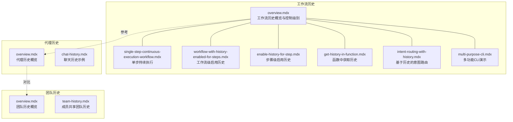
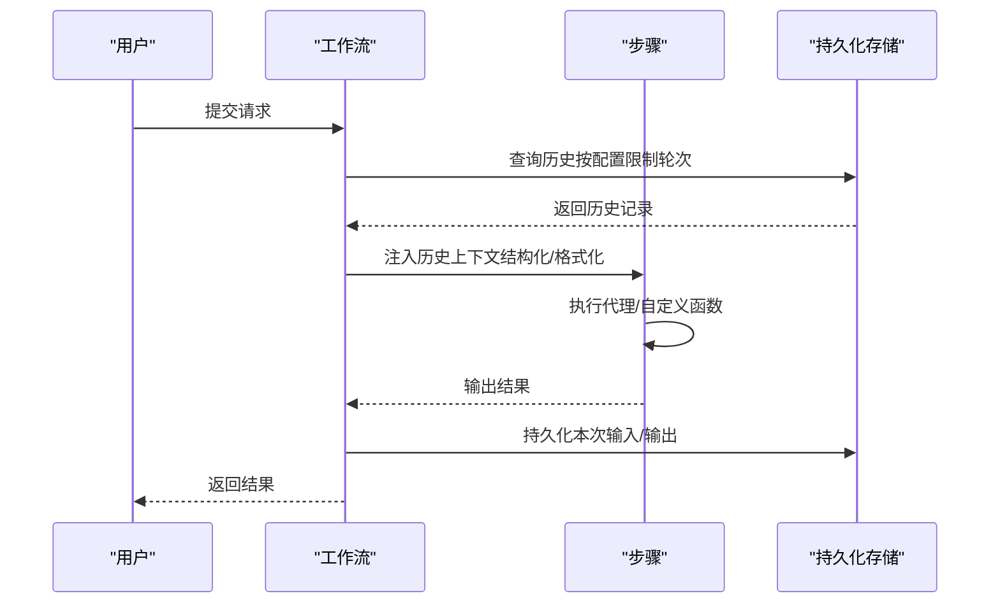
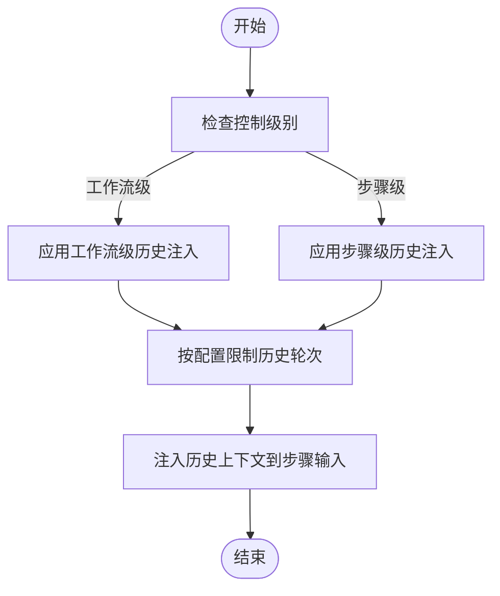
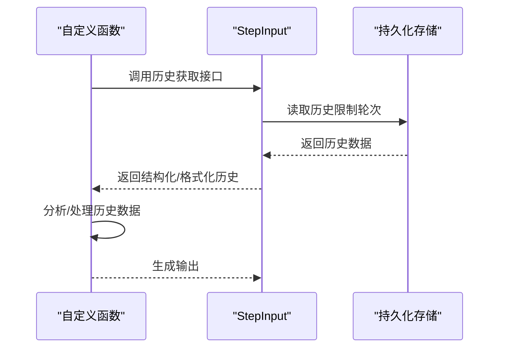
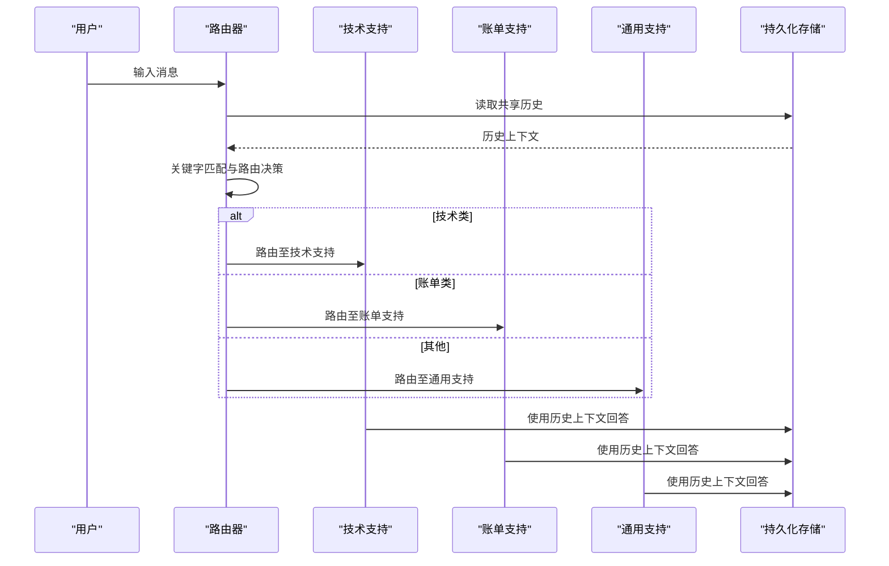
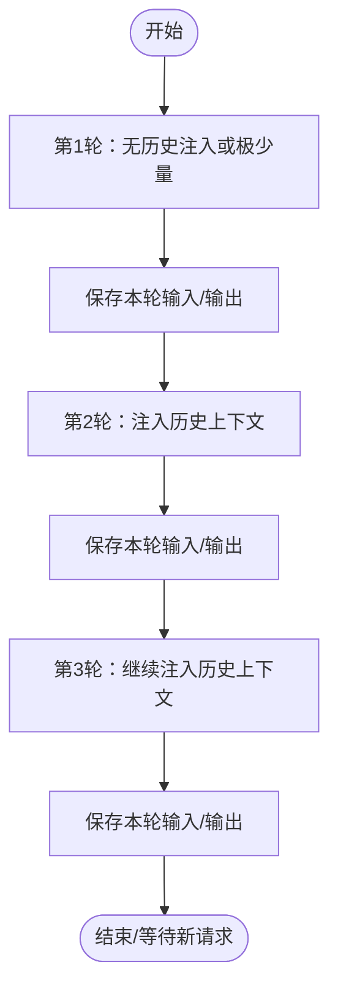

# 工作流历史

<cite>
**本文引用的文件**
- [history/workflow/overview.mdx](file://history/workflow/overview.mdx)
- [history/workflow/enable-history-for-step.mdx](file://history/workflow/enable-history-for-step.mdx)
- [history/workflow/get-history-in-function.mdx](file://history/workflow/get-history-in-function.mdx)
- [history/workflow/intent-routing-with-history.mdx](file://history/workflow/intent-routing-with-history.mdx)
- [history/workflow/single-step-continuous-execution-workflow.mdx](file://history/workflow/single-step-continuous-execution-workflow.mdx)
- [history/workflow/multi-purpose-cli.mdx](file://history/workflow/multi-purpose-cli.mdx)
- [history/agent/overview.mdx](file://history/agent/overview.mdx)
- [history/agent/chat-history.mdx](file://history/agent/chat-history.mdx)
- [history/team/overview.mdx](file://history/team/overview.mdx)
- [history/team/team-history.mdx](file://history/team/team-history.mdx)
</cite>

## 目录
1. [简介](#简介)
2. [项目结构](#项目结构)
3. [核心组件](#核心组件)
4. [架构总览](#架构总览)
5. [详细组件分析](#详细组件分析)
6. [依赖关系分析](#依赖关系分析)
7. [性能考量](#性能考量)
8. [故障排查指南](#故障排查指南)
9. [结论](#结论)
10. [附录](#附录)

## 简介
本技术文档围绕“工作流历史”展开，系统性阐述如何在多步工作流中记录、注入与使用历史数据，以实现连续对话、上下文延续与智能路由。内容覆盖：
- 步骤执行历史的记录与注入机制
- 如何为工作流步骤启用历史（工作流级与步骤级）
- 在自定义函数中获取与使用历史数据
- 基于历史的意图路由与跨代理共享上下文
- 单步持续执行工作流的历史管理策略
- 多功能CLI工具的历史功能使用指南
- 历史数据结构、查询接口与分析能力
- 复杂业务场景的应用模式与最佳实践

## 项目结构
本主题相关文档主要集中在 history/workflow 下，并与 agent、team 的历史文档形成互补，便于在不同抽象层级（工作流、团队、代理）间复用历史能力。

图表来源
- [history/workflow/overview.mdx:1-177](file://history/workflow/overview.mdx#L1-L177)
- [history/workflow/single-step-continuous-execution-workflow.mdx:1-65](file://history/workflow/single-step-continuous-execution-workflow.mdx#L1-L65)
- [history/workflow/enable-history-for-step.mdx:1-113](file://history/workflow/enable-history-for-step.mdx#L1-L113)
- [history/workflow/get-history-in-function.mdx:1-246](file://history/workflow/get-history-in-function.mdx#L1-L246)
- [history/workflow/intent-routing-with-history.mdx:1-186](file://history/workflow/intent-routing-with-history.mdx#L1-L186)
- [history/workflow/multi-purpose-cli.mdx:1-272](file://history/workflow/multi-purpose-cli.mdx#L1-L272)
- [history/agent/overview.mdx:1-126](file://history/agent/overview.mdx#L1-L126)
- [history/team/overview.mdx:1-207](file://history/team/overview.mdx#L1-L207)

章节来源
- [history/workflow/overview.mdx:1-177](file://history/workflow/overview.mdx#L1-L177)

## 核心组件
- 工作流历史注入器：在步骤输入中自动注入历史上下文，支持结构化元组与格式化字符串两种形式。
- 控制开关：
  - 工作流级：通过标志位统一为所有步骤启用或禁用历史。
  - 步骤级：针对特定步骤覆盖工作流默认设置。
- 历史长度控制：可限制回溯的历史轮次，避免上下文窗口膨胀。
- CLI 应用：提供交互式演示，支持多场景（客服、医疗、教学）的连续会话。

章节来源
- [history/workflow/overview.mdx:26-141](file://history/workflow/overview.mdx#L26-L141)
- [history/workflow/enable-history-for-step.mdx:67-88](file://history/workflow/enable-history-for-step.mdx#L67-L88)
- [history/workflow/get-history-in-function.mdx:21-29](file://history/workflow/get-history-in-function.mdx#L21-L29)

## 架构总览
工作流历史的核心流程如下：工作流启动后，根据配置决定是否为步骤注入历史；每次运行结束后，将本次输入/输出持久化到数据库；后续运行时，按需从数据库读取历史并注入到步骤输入中，供代理或自定义函数使用。

图表来源
- [history/workflow/overview.mdx:26-78](file://history/workflow/overview.mdx#L26-L78)
- [history/workflow/get-history-in-function.mdx:21-29](file://history/workflow/get-history-in-function.mdx#L21-L29)

## 详细组件分析

### 组件A：工作流历史注入与控制
- 工作流级启用：通过标志位为全部步骤注入历史，适合需要全局上下文一致性的场景。
- 步骤级启用：仅对关键步骤注入历史，降低非必要步骤的上下文开销。
- 预设优先级：步骤级设置优先于工作流级设置，便于精细化控制。
- 历史长度控制：默认不限制，建议设置固定轮次以控制上下文大小。

图表来源
- [history/workflow/overview.mdx:80-141](file://history/workflow/overview.mdx#L80-L141)

章节来源
- [history/workflow/overview.mdx:80-141](file://history/workflow/overview.mdx#L80-L141)

### 组件B：在自定义函数中获取历史
- 结构化历史：以元组列表形式返回历史，便于程序化分析与去重、相似度计算等。
- 格式化上下文：以字符串形式返回，直接拼接到提示词中供模型使用。
- 典型用法：关键词提取、主题重叠分析、多样性评估、内容定位建议等。

图表来源
- [history/workflow/get-history-in-function.mdx:21-29](file://history/workflow/get-history-in-function.mdx#L21-L29)

章节来源
- [history/workflow/get-history-in-function.mdx:21-159](file://history/workflow/get-history-in-function.mdx#L21-L159)

### 组件C：基于历史的意图路由
- 路由器：根据当前消息的意图关键字选择目标专家代理。
- 共享历史：所有分支代理均可访问完整历史，确保上下文一致性。
- 场景价值：技术问题、账单问题、通用支持等分类路由，结合历史提升解决效率。

图表来源
- [history/workflow/intent-routing-with-history.mdx:82-121](file://history/workflow/intent-routing-with-history.mdx#L82-L121)

章节来源
- [history/workflow/intent-routing-with-history.mdx:123-179](file://history/workflow/intent-routing-with-history.mdx#L123-L179)

### 组件D：单步持续执行工作流
- 场景：单一代理在多轮对话中保持上下文连续，避免重复提问与信息冗余。
- 实现：工作流级启用历史，代理在每次响应中引用历史，逐步深化理解与个性化支持。

图表来源
- [history/workflow/single-step-continuous-execution-workflow.mdx:34-42](file://history/workflow/single-step-continuous-execution-workflow.mdx#L34-L42)

章节来源
- [history/workflow/single-step-continuous-execution-workflow.mdx:1-65](file://history/workflow/single-step-continuous-execution-workflow.mdx#L1-L65)

### 组件E：多功能CLI工具
- 客户服务：多阶段流程（接入—技术—最终解决），全程保留历史，减少重复询问。
- 医疗咨询：分诊—医生问诊—护理协调，历史贯穿始终，保障连续性与安全性。
- 教学辅导：评估—授课—进度规划，历史帮助教师了解学习状态与调整策略。
- 运行方式：通过命令行选择场景或逐个演示，支持流式输出与详细步骤展示。

图表来源
- [history/workflow/multi-purpose-cli.mdx:66-132](file://history/workflow/multi-purpose-cli.mdx#L66-L132)
- [history/workflow/multi-purpose-cli.mdx:179-189](file://history/workflow/multi-purpose-cli.mdx#L179-L189)

章节来源
- [history/workflow/multi-purpose-cli.mdx:1-272](file://history/workflow/multi-purpose-cli.mdx#L1-L272)

### 组件F：与代理/团队历史的关系
- 代理历史：面向单代理的会话历史，支持将历史注入上下文、读取聊天历史、跨会话检索等。
- 团队历史：面向团队的会话历史，支持将团队历史注入成员、共享成员交互、跨成员上下文传递等。
- 工作流历史：面向整个工作流的执行历史，强调“步骤间上下文延续”，并与代理/团队历史形成互补。

章节来源
- [history/agent/overview.mdx:1-126](file://history/agent/overview.mdx#L1-L126)
- [history/team/overview.mdx:1-207](file://history/team/overview.mdx#L1-L207)

## 依赖关系分析
- 数据库依赖：工作流历史需要持久化存储以跨执行保存历史记录。
- 接口依赖：步骤输入提供历史获取接口（结构化与格式化），用于在代理或自定义函数中使用。
- 控制依赖：工作流级与步骤级配置相互覆盖，遵循“步骤级优先”的原则。

图表来源
- [history/workflow/overview.mdx:80-141](file://history/workflow/overview.mdx#L80-L141)
- [history/workflow/get-history-in-function.mdx:21-29](file://history/workflow/get-history-in-function.mdx#L21-L29)

章节来源
- [history/workflow/overview.mdx:80-141](file://history/workflow/overview.mdx#L80-L141)

## 性能考量
- 上下文窗口限制：历史轮次越多，上下文越大，推理成本越高。建议从较小轮次起步，逐步调优。
- 存储与查询：历史查询应限制轮次与时间范围，避免全量扫描导致延迟。
- 流式输出：CLI演示支持流式输出，有助于提升交互体验与资源占用感知。
- 代理/团队历史对比：当仅需工作流级上下文时，优先使用工作流历史以减少不必要的上下文注入。

章节来源
- [history/workflow/overview.mdx:123-141](file://history/workflow/overview.mdx#L123-L141)
- [history/agent/overview.mdx:69-71](file://history/agent/overview.mdx#L69-L71)

## 故障排查指南
- 未看到历史：确认已为工作流或步骤启用历史注入，并确保数据库已正确配置。
- 历史过多导致上下文溢出：适当降低历史轮次或消息数量，或采用结构化分析而非直接拼接。
- 自定义函数无法获取历史：检查步骤输入接口调用是否正确，以及历史轮次参数是否合理。
- 路由后上下文不一致：确保所有分支代理均启用共享历史，避免仅部分代理可见历史。
- CLI 无法运行：检查依赖安装、环境变量与数据库文件路径。

章节来源
- [history/workflow/get-history-in-function.mdx:21-29](file://history/workflow/get-history-in-function.mdx#L21-L29)
- [history/workflow/intent-routing-with-history.mdx:123-139](file://history/workflow/intent-routing-with-history.mdx#L123-L139)
- [history/workflow/multi-purpose-cli.mdx:197-270](file://history/workflow/multi-purpose-cli.mdx#L197-L270)

## 结论
工作流历史通过“历史注入—持久化—再注入”的闭环，实现了多步工作流的上下文延续与智能决策支持。配合结构化与格式化两种历史获取方式，既满足程序化分析，也便于直接提示词注入。在实际应用中，应结合业务场景选择合适的历史长度与注入粒度，并通过CLI演示快速验证效果。

## 附录
- 快速参考
  - 启用工作流级历史：在工作流构造时设置相应标志位。
  - 启用步骤级历史：在具体步骤上覆盖工作流设置。
  - 获取历史：在自定义函数中调用历史获取接口，选择结构化或格式化形式。
  - 意图路由：在路由器中结合历史进行路由决策，确保各分支代理共享上下文。
  - 单步持续执行：适用于教育、客服等需要连续对话的场景。
  - 多功能CLI：通过命令行选择场景，快速体验不同业务形态的历史应用。

章节来源
- [history/workflow/overview.mdx:80-177](file://history/workflow/overview.mdx#L80-L177)
- [history/workflow/enable-history-for-step.mdx:67-88](file://history/workflow/enable-history-for-step.mdx#L67-L88)
- [history/workflow/get-history-in-function.mdx:21-29](file://history/workflow/get-history-in-function.mdx#L21-L29)
- [history/workflow/intent-routing-with-history.mdx:123-139](file://history/workflow/intent-routing-with-history.mdx#L123-L139)
- [history/workflow/single-step-continuous-execution-workflow.mdx:34-42](file://history/workflow/single-step-continuous-execution-workflow.mdx#L34-L42)
- [history/workflow/multi-purpose-cli.mdx:197-270](file://history/workflow/multi-purpose-cli.mdx#L197-L270)