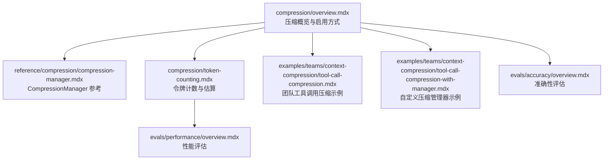
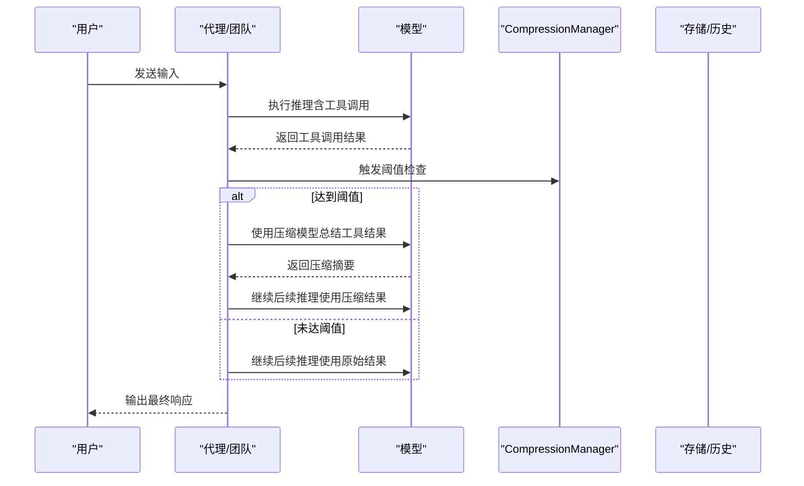
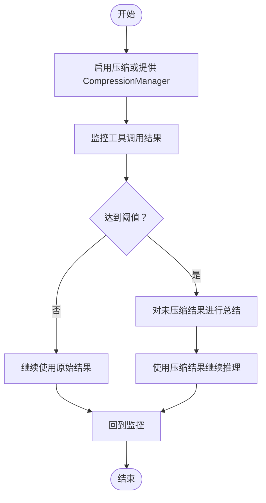
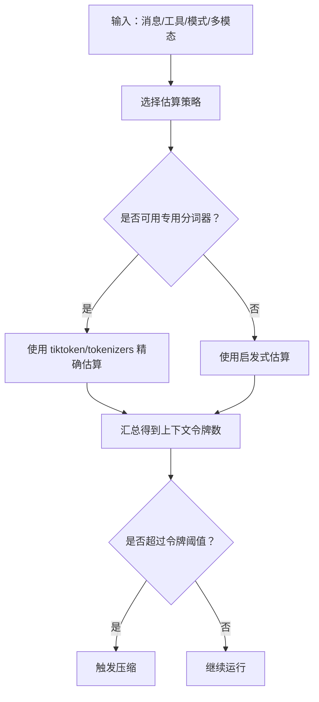
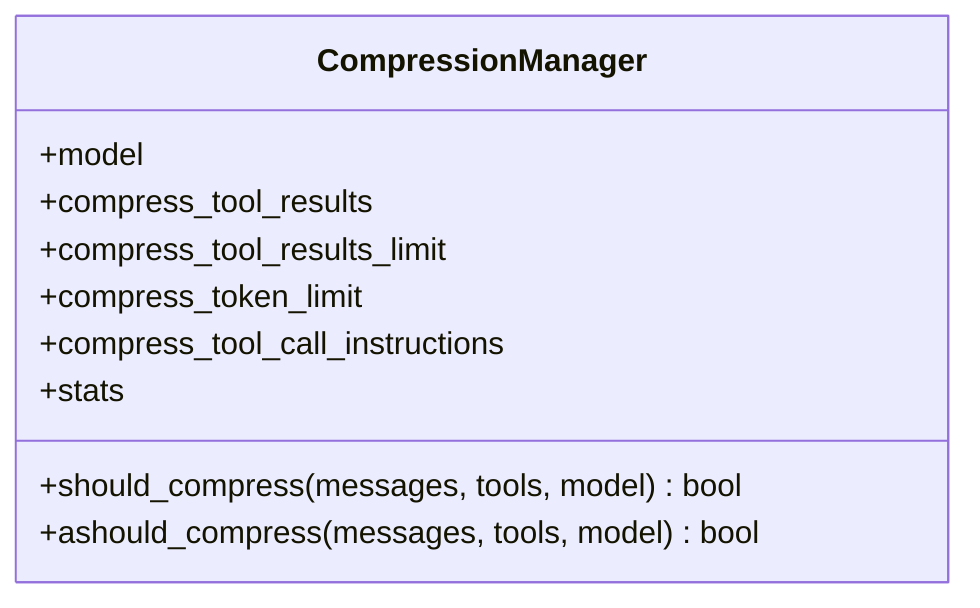
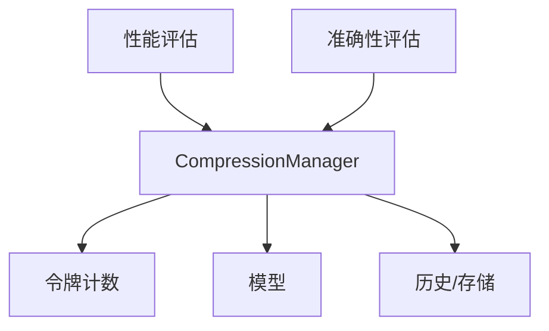

# 压缩系统

<cite>
**本文档引用的文件**
- [compression/overview.mdx](file://compression/overview.mdx)
- [compression/token-counting.mdx](file://compression/token-counting.mdx)
- [reference/compression/compression-manager.mdx](file://reference/compression/compression-manager.mdx)
- [examples/teams/context-compression/tool-call-compression.mdx](file://examples/teams/context-compression/tool-call-compression.mdx)
- [examples/teams/context-compression/tool-call-compression-with-manager.mdx](file://examples/teams/context-compression/tool-call-compression-with-manager.mdx)
- [evals/accuracy/overview.mdx](file://evals/accuracy/overview.mdx)
- [evals/performance/overview.mdx](file://evals/performance/overview.mdx)
</cite>

## 目录
1. [简介](#简介)
2. [项目结构](#项目结构)
3. [核心组件](#核心组件)
4. [架构总览](#架构总览)
5. [详细组件分析](#详细组件分析)
6. [依赖关系分析](#依赖关系分析)
7. [性能考量](#性能考量)
8. [故障排查指南](#故障排查指南)
9. [结论](#结论)
10. [附录](#附录)

## 简介
本技术文档围绕“压缩系统”展开，重点解释以下主题：
- 上下文压缩：在运行时管理代理上下文，避免超出上下文窗口或触发限流，从而维持响应质量。
- 令牌计数：估算上下文占用，支持基于计数的阈值触发压缩。
- 性能优化：通过自动压缩减少令牌消耗、延长上下文寿命，并在异步场景中并行处理压缩以降低延迟。

文档还涵盖：
- 不同模型提供商的令牌计算差异与准确性注意事项
- 上下文压缩策略（固定次数阈值、令牌阈值）
- 在长对话与复杂任务中的应用（上下文截断、关键信息保留、性能权衡）
- 压缩效果评估方法（准确性损失测量、性能提升分析）
- 实际配置示例与优化建议

## 项目结构
与压缩系统直接相关的文档主要分布在以下位置：
- 概览与使用说明：compression/overview.mdx
- 令牌计数与估算：compression/token-counting.mdx
- 压缩管理器参考：reference/compression/compression-manager.mdx
- 示例：examples/teams/context-compression 下的两个示例文件
- 评估体系：evals/accuracy/overview.mdx 与 evals/performance/overview.mdx

图表来源
- [compression/overview.mdx:1-267](file://compression/overview.mdx#L1-L267)
- [compression/token-counting.mdx:1-113](file://compression/token-counting.mdx#L1-L113)
- [reference/compression/compression-manager.mdx:1-35](file://reference/compression/compression-manager.mdx#L1-L35)
- [examples/teams/context-compression/tool-call-compression.mdx:1-162](file://examples/teams/context-compression/tool-call-compression.mdx#L1-L162)
- [examples/teams/context-compression/tool-call-compression-with-manager.mdx:1-139](file://examples/teams/context-compression/tool-call-compression-with-manager.mdx#L1-L139)
- [evals/performance/overview.mdx:1-452](file://evals/performance/overview.mdx#L1-L452)
- [evals/accuracy/overview.mdx:1-359](file://evals/accuracy/overview.mdx#L1-L359)

章节来源
- [compression/overview.mdx:1-267](file://compression/overview.mdx#L1-L267)
- [compression/token-counting.mdx:1-113](file://compression/token-counting.mdx#L1-L113)
- [reference/compression/compression-manager.mdx:1-35](file://reference/compression/compression-manager.mdx#L1-L35)

## 核心组件
- 上下文压缩（Context Compression）
  - 自动监控工具调用结果，达到阈值后触发压缩，保留关键事实与数据，移除冗余文本。
  - 支持同步与异步两种模式；异步模式下压缩与未压缩结果并行处理，降低整体延迟。
- 令牌计数（Token Counting）
  - 估算消息、工具定义、输出模式等对上下文的影响，用于计数型阈值触发压缩。
  - 提供可选依赖（如 tiktoken、tokenizers）以提高本地估算精度；同时明确估算误差与提供商差异。
- 压缩管理器（CompressionManager）
  - 负责配置压缩行为，包括阈值类型（按工具调用次数或按令牌数）、压缩提示词、统计信息等。
  - 提供同步与异步的触发判断接口，便于在运行循环中进行条件检查。

章节来源
- [compression/overview.mdx:52-74](file://compression/overview.mdx#L52-L74)
- [compression/token-counting.mdx:19-41](file://compression/token-counting.mdx#L19-L41)
- [reference/compression/compression-manager.mdx:8-35](file://reference/compression/compression-manager.mdx#L8-L35)

## 架构总览
压缩系统在运行时与代理/团队交互，遵循如下流程：
- 启用压缩（在代理或团队上设置开关或提供 CompressionManager）
- 运行循环中持续监控工具调用结果
- 达到阈值后，对未压缩的工具调用结果进行总结
- 使用压缩后的结果继续后续 LLM 推理，保持上下文窗口安全

图表来源
- [compression/overview.mdx:52-74](file://compression/overview.mdx#L52-L74)
- [reference/compression/compression-manager.mdx:21-35](file://reference/compression/compression-manager.mdx#L21-L35)

## 详细组件分析

### 组件一：上下文压缩工作流
- 启用方式
  - 在代理或团队上设置开关，或注入 CompressionManager
  - 默认阈值为 3 次未压缩工具调用
- 触发机制
  - 计数型阈值：固定次数
  - 令牌型阈值：根据上下文估算令牌数
- 压缩过程
  - 对每个未压缩工具调用结果进行总结，保留关键事实（数字、日期、实体、URL 等），去除冗余
  - 异步模式下，压缩与未压缩结果并发处理，提升吞吐

图表来源
- [compression/overview.mdx:52-74](file://compression/overview.mdx#L52-L74)
- [compression/overview.mdx:178-251](file://compression/overview.mdx#L178-L251)

章节来源
- [compression/overview.mdx:75-118](file://compression/overview.mdx#L75-L118)
- [compression/overview.mdx:120-177](file://compression/overview.mdx#L120-L177)
- [compression/overview.mdx:178-251](file://compression/overview.mdx#L178-L251)

### 组件二：令牌计数与估算
- 估算范围
  - 消息内容（系统、用户、助手）、工具定义、输出模式、多模态附件
- 估算精度与注意事项
  - 令牌计数为估算值；不同提供商与模型可能产生差异
  - 可安装 tiktoken、tokenizers 等依赖以提升本地估算精度
- 多模态估算
  - 图像：基于瓦片估算
  - 音频：按秒估算
  - 视频：按帧估算（在 FPS/尺寸未知时采用保守默认）
  - 文件：按类型与大小估算

图表来源
- [compression/token-counting.mdx:23-41](file://compression/token-counting.mdx#L23-L41)
- [compression/token-counting.mdx:42-53](file://compression/token-counting.mdx#L42-L53)
- [compression/token-counting.mdx:100-113](file://compression/token-counting.mdx#L100-L113)

章节来源
- [compression/token-counting.mdx:19-41](file://compression/token-counting.mdx#L19-L41)
- [compression/token-counting.mdx:42-53](file://compression/token-counting.mdx#L42-L53)
- [compression/token-counting.mdx:94-99](file://compression/token-counting.mdx#L94-L99)
- [compression/token-counting.mdx:100-113](file://compression/token-counting.mdx#L100-L113)

### 组件三：CompressionManager
- 关键属性
  - model：用于压缩的模型
  - compress_tool_results：是否启用工具结果压缩
  - compress_tool_results_limit：按工具调用次数的阈值
  - compress_token_limit：按令牌数的阈值
  - compress_tool_call_instructions：自定义压缩提示词
  - stats：压缩统计信息
- 方法
  - should_compress / ashould_compress：基于阈值判断是否触发压缩

图表来源
- [reference/compression/compression-manager.mdx:8-35](file://reference/compression/compression-manager.mdx#L8-L35)

章节来源
- [reference/compression/compression-manager.mdx:8-35](file://reference/compression/compression-manager.mdx#L8-L35)

### 组件四：示例与实践
- 团队级工具调用压缩（同步与异步）
  - 展示如何在团队中启用压缩，并对比同步与异步执行
- 使用自定义 CompressionManager
  - 通过自定义提示词与阈值控制压缩粒度，适用于竞争情报等特定场景

章节来源
- [examples/teams/context-compression/tool-call-compression.mdx:1-162](file://examples/teams/context-compression/tool-call-compression.mdx#L1-L162)
- [examples/teams/context-compression/tool-call-compression-with-manager.mdx:1-139](file://examples/teams/context-compression/tool-call-compression-with-manager.mdx#L1-L139)

## 依赖关系分析
- 压缩系统依赖于：
  - 令牌计数能力：用于判断是否达到压缩阈值
  - 模型能力：用于执行压缩与后续推理
  - 存储/历史：在长会话中保存与加载上下文
- 压缩系统与评估体系的关系：
  - 性能评估：衡量压缩带来的延迟与内存变化
  - 准确性评估：验证压缩是否导致关键信息丢失

图表来源
- [reference/compression/compression-manager.mdx:8-35](file://reference/compression/compression-manager.mdx#L8-L35)
- [compression/token-counting.mdx:19-41](file://compression/token-counting.mdx#L19-L41)
- [evals/performance/overview.mdx:1-452](file://evals/performance/overview.mdx#L1-L452)
- [evals/accuracy/overview.mdx:1-359](file://evals/accuracy/overview.mdx#L1-L359)

章节来源
- [compression/overview.mdx:1-267](file://compression/overview.mdx#L1-L267)
- [compression/token-counting.mdx:1-113](file://compression/token-counting.mdx#L1-L113)
- [evals/performance/overview.mdx:1-452](file://evals/performance/overview.mdx#L1-L452)
- [evals/accuracy/overview.mdx:1-359](file://evals/accuracy/overview.mdx#L1-L359)

## 性能考量
- 延迟与吞吐
  - 异步压缩可在等待工具调用结果的同时并行进行压缩，降低端到端延迟
- 令牌成本
  - 通过压缩显著减少上下文占用，从而降低令牌成本
- 内存与资源
  - 长会话与频繁记忆更新会增加上下文开销；压缩有助于缓解这一问题
- 估算误差
  - 令牌计数为估算值，不同提供商与模型存在差异；应谨慎将其用于成本计算

章节来源
- [compression/overview.mdx:71-74](file://compression/overview.mdx#L71-L74)
- [compression/token-counting.mdx:37-41](file://compression/token-counting.mdx#L37-L41)
- [compression/token-counting.mdx:109-113](file://compression/token-counting.mdx#L109-L113)
- [evals/performance/overview.mdx:1-452](file://evals/performance/overview.mdx#L1-L452)

## 故障排查指南
- 令牌计数不准确
  - 安装推荐依赖（tiktoken、tokenizers）以提升本地估算精度
  - 明确估算误差与提供商差异，避免将估算值直接用于精确计费
- 压缩触发过早或过晚
  - 调整阈值参数（按次数或按令牌数）
  - 结合令牌计数估算与实际运行情况微调
- 多模态输入估算偏差
  - 图像/音频/视频/文件的估算采用保守策略；在预算紧张时可适当放宽
- 准确性下降
  - 检查压缩提示词是否保留关键事实
  - 使用准确性评估工具验证压缩对任务的影响

章节来源
- [compression/token-counting.mdx:42-53](file://compression/token-counting.mdx#L42-L53)
- [compression/token-counting.mdx:37-41](file://compression/token-counting.mdx#L37-L41)
- [compression/token-counting.mdx:100-113](file://compression/token-counting.mdx#L100-L113)
- [examples/teams/context-compression/tool-call-compression-with-manager.mdx:26-54](file://examples/teams/context-compression/tool-call-compression-with-manager.mdx#L26-L54)

## 结论
压缩系统通过“阈值驱动的智能总结”在保证关键信息的前提下显著节省上下文空间，降低令牌成本，并在长对话与复杂任务中维持稳定性能。结合令牌计数估算与 CompressionManager 的灵活配置，开发者可以在准确性与效率之间找到最佳平衡点。配合性能与准确性评估，可系统性地验证与优化压缩策略。

## 附录

### 配置示例与优化建议
- 快速启用
  - 在代理或团队上设置开关，即可使用默认阈值（通常为 3 次未压缩工具调用）
- 自定义阈值
  - 计数型：compress_tool_results_limit
  - 令牌型：compress_token_limit
- 自定义压缩提示词
  - compress_tool_call_instructions：针对特定任务（如竞争情报）定制压缩要点
- 模型选择
  - 使用更快更便宜的模型进行压缩，主模型负责推理，以降低成本与延迟
- 评估与迭代
  - 使用性能评估观察延迟与内存变化
  - 使用准确性评估验证关键信息是否被正确保留

章节来源
- [compression/overview.mdx:75-118](file://compression/overview.mdx#L75-L118)
- [compression/overview.mdx:120-177](file://compression/overview.mdx#L120-L177)
- [compression/overview.mdx:178-251](file://compression/overview.mdx#L178-L251)
- [examples/teams/context-compression/tool-call-compression.mdx:77-126](file://examples/teams/context-compression/tool-call-compression.mdx#L77-L126)
- [examples/teams/context-compression/tool-call-compression-with-manager.mdx:56-60](file://examples/teams/context-compression/tool-call-compression-with-manager.mdx#L56-L60)
- [evals/performance/overview.mdx:1-452](file://evals/performance/overview.mdx#L1-L452)
- [evals/accuracy/overview.mdx:1-359](file://evals/accuracy/overview.mdx#L1-L359)