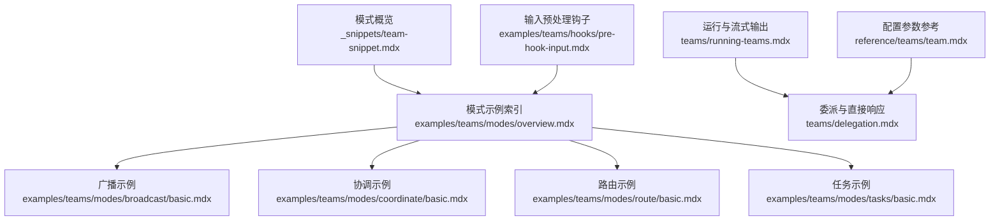
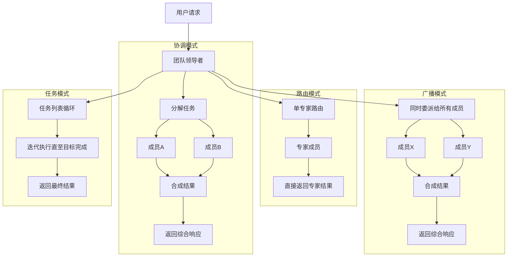
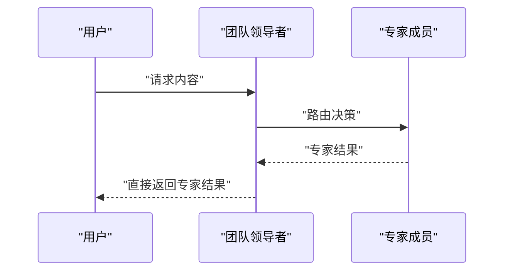
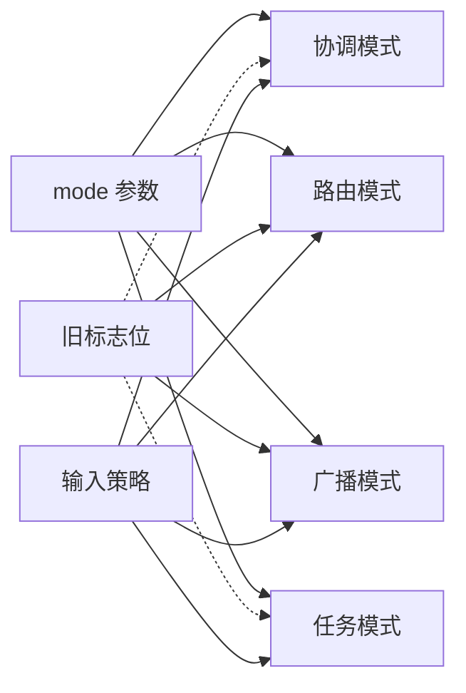

# 团队使用模式

<cite>
**本文引用的文件**
- [_snippets/team-snippet.mdx](file://_snippets/team-snippet.mdx)
- [examples/teams/modes/overview.mdx](file://examples/teams/modes/overview.mdx)
- [examples/teams/modes/broadcast/basic.mdx](file://examples/teams/modes/broadcast/basic.mdx)
- [examples/teams/modes/coordinate/basic.mdx](file://examples/teams/modes/coordinate/basic.mdx)
- [examples/teams/modes/route/basic.mdx](file://examples/teams/modes/route/basic.mdx)
- [examples/teams/modes/tasks/basic.mdx](file://examples/teams/modes/tasks/basic.mdx)
- [teams/running-teams.mdx](file://teams/running-teams.mdx)
- [teams/delegation.mdx](file://teams/delegation.mdx)
- [reference/teams/team.mdx](file://reference/teams/team.mdx)
- [examples/teams/hooks/pre-hook-input.mdx](file://examples/teams/hooks/pre-hook-input.mdx)
</cite>

## 目录
1. [简介](#简介)
2. [项目结构](#项目结构)
3. [核心组件](#核心组件)
4. [架构总览](#架构总览)
5. [详细组件分析](#详细组件分析)
6. [依赖关系分析](#依赖关系分析)
7. [性能考量](#性能考量)
8. [故障排查指南](#故障排查指南)
9. [结论](#结论)
10. [附录](#附录)

## 简介
本文件面向团队使用者，系统性梳理 Agno 团队系统的四种执行模式：协调（Coordinate）、路由（Route）、广播（Broadcast）与任务（Tasks）。文档覆盖每种模式的特性、适用场景、配置要点、性能对比与选择建议，并给出模式切换与组合使用的实践方法，以及在不同业务场景下的应用示例与扩展定制思路。

## 项目结构
围绕“团队使用模式”的知识主要分布在以下位置：
- 模式概览与表格说明：_snippets/team-snippet.mdx
- 模式示例索引：examples/teams/modes/overview.mdx
- 各模式示例：
  - 广播：examples/teams/modes/broadcast/basic.mdx
  - 协调：examples/teams/modes/coordinate/basic.mdx
  - 路由：examples/teams/modes/route/basic.mdx
  - 任务：examples/teams/modes/tasks/basic.mdx
- 运行与流式输出：teams/running-teams.mdx
- 委派与直接响应：teams/delegation.mdx
- 配置参数参考：reference/teams/team.mdx
- 输入预处理钩子：examples/teams/hooks/pre-hook-input.mdx

**图表来源**
- [_snippets/team-snippet.mdx](file://_snippets/team-snippet.mdx)
- [examples/teams/modes/overview.mdx](file://examples/teams/modes/overview.mdx)
- [examples/teams/modes/broadcast/basic.mdx](file://examples/teams/modes/broadcast/basic.mdx)
- [examples/teams/modes/coordinate/basic.mdx](file://examples/teams/modes/coordinate/basic.mdx)
- [examples/teams/modes/route/basic.mdx](file://examples/teams/modes/route/basic.mdx)
- [examples/teams/modes/tasks/basic.mdx](file://examples/teams/modes/tasks/basic.mdx)
- [teams/running-teams.mdx](file://teams/running-teams.mdx)
- [teams/delegation.mdx](file://teams/delegation.mdx)
- [reference/teams/team.mdx](file://reference/teams/team.mdx)
- [examples/teams/hooks/pre-hook-input.mdx](file://examples/teams/hooks/pre-hook-input.mdx)

**章节来源**
- [_snippets/team-snippet.mdx](file://_snippets/team-snippet.mdx)
- [examples/teams/modes/overview.mdx](file://examples/teams/modes/overview.mdx)

## 核心组件
- 执行模式枚举：TeamMode.coordinate / TeamMode.route / TeamMode.broadcast / TeamMode.tasks
- 关键运行参数：
  - respond_directly：是否绕过合成直接返回成员结果（等价于路由模式）
  - determine_input_for_members：是否由领导者为成员生成任务输入
  - delegate_to_all_members：是否自动向所有成员委派（等价于广播模式）
  - max_iterations：任务模式的最大循环次数
- 流式输出支持：stream / stream_events / stream_member_events

**章节来源**
- [_snippets/team-snippet.mdx](file://_snippets/team-snippet.mdx)
- [reference/teams/team.mdx](file://reference/teams/team.mdx)
- [teams/running-teams.mdx](file://teams/running-teams.mdx)

## 架构总览
下图展示了四种模式在团队执行中的角色分工与数据流向：

**图表来源**
- [_snippets/team-snippet.mdx](file://_snippets/team-snippet.mdx)
- [teams/delegation.mdx](file://teams/delegation.mdx)
- [teams/running-teams.mdx](file://teams/running-teams.mdx)

## 详细组件分析

### 基础团队（Team）与模式配置
- 模式定义与默认值：默认为协调模式；通过 mode 参数切换到其他模式。
- 直接响应与广播标志：
  - respond_directly=True 等价于路由模式，不进行合成。
  - delegate_to_all_members=True 等价于广播模式，自动委派给所有成员。
- 输入策略：
  - determine_input_for_members=True 时，由领导者为成员生成任务输入。
  - False 则将原始用户输入直接传递给成员。
- 任务模式：
  - max_iterations 控制循环上限，适合需要逐步推进的目标。

**章节来源**
- [_snippets/team-snippet.mdx](file://_snippets/team-snippet.mdx)
- [reference/teams/team.mdx](file://reference/teams/team.mdx)
- [teams/delegation.mdx](file://teams/delegation.mdx)

### 协调模式（Coordinate）
- 特点：领导者对复杂任务进行拆解，分配给不同成员，再对结果进行合成。
- 适用场景：
  - 多方面、多步骤的综合问题
  - 需要跨领域知识协同
- 配置要点：
  - 使用 mode=TeamMode.coordinate
  - 可结合工具与结构化输出提升合成质量
- 示例入口：
  - [协调示例索引](file://examples/teams/modes/coordinate/basic.mdx)

**章节来源**
- [_snippets/team-snippet.mdx](file://_snippets/team-snippet.mdx)
- [examples/teams/modes/coordinate/basic.mdx](file://examples/teams/modes/coordinate/basic.mdx)

### 路由模式（Route）
- 特点：根据请求特征自动路由到最合适的专家成员，直接返回其结果，延迟低。
- 适用场景：
  - 明确的语言、领域或格式需求
  - 不希望领导者参与合成的场景
- 配置要点：
  - mode=TeamMode.route 或 respond_directly=True
  - determine_input_for_members=False 可保持输入不变传递给成员
- 示例入口：
  - [路由示例索引](file://examples/teams/modes/route/basic.mdx)

**图表来源**
- [teams/delegation.mdx](file://teams/delegation.mdx)

**章节来源**
- [teams/delegation.mdx](file://teams/delegation.mdx)
- [examples/teams/modes/route/basic.mdx](file://examples/teams/modes/route/basic.mdx)

### 广播模式（Broadcast）
- 特点：将同一任务同时委派给所有成员，收集各自结果后进行合成。
- 适用场景：
  - 需要多方视角或多来源验证
  - 对抗偏差或增强鲁棒性的场景
- 配置要点：
  - mode=TeamMode.broadcast 或 delegate_to_all_members=True
  - 合成策略可结合成员权重或投票机制
- 示例入口：
  - [广播示例索引](file://examples/teams/modes/broadcast/basic.mdx)

**章节来源**
- [_snippets/team-snippet.mdx](file://_snippets/team-snippet.mdx)
- [examples/teams/modes/broadcast/basic.mdx](file://examples/teams/modes/broadcast/basic.mdx)

### 任务模式（Tasks）
- 特点：以任务清单驱动的循环执行，直到目标达成或达到最大迭代次数。
- 适用场景：
  - 清晰的阶段性目标
  - 需要持续反馈与调整的流程
- 配置要点：
  - mode=TeamMode.tasks
  - max_iterations 控制上限
  - 可与其他模式配合，如先路由到专家，再进入任务循环
- 示例入口：
  - [任务示例索引](file://examples/teams/modes/tasks/basic.mdx)

**章节来源**
- [_snippets/team-snippet.mdx](file://_snippets/team-snippet.mdx)
- [reference/teams/team.mdx](file://reference/teams/team.mdx)
- [examples/teams/modes/tasks/basic.mdx](file://examples/teams/modes/tasks/basic.mdx)

### 流式处理（Streaming）
- 支持：
  - stream=True 返回事件迭代器
  - stream_events=True 获取工具调用、推理步骤等内部事件
  - stream_member_events 获取成员级事件
- 注意：
  - 任务模式不支持流式输出，设置 stream=True 将回退为非流式执行
- 典型用途：
  - 实时反馈与可观测性
  - 用户体验优化（边生成边展示）

**章节来源**
- [teams/running-teams.mdx](file://teams/running-teams.mdx)

### 直接响应与委派控制
- 直接响应：
  - respond_directly=True 时，领导者不合成，直接返回成员结果
  - 与 delegate_to_all_members=True 互斥
- 自动委派：
  - delegate_to_all_members=True 时，领导者自动向所有成员委派
  - 与 respond_directly=True 互斥
- 输入策略：
  - determine_input_for_members=True 由领导者生成任务输入
  - False 时直接传递用户输入

**章节来源**
- [teams/delegation.mdx](file://teams/delegation.mdx)
- [reference/teams/team.mdx](file://reference/teams/team.mdx)

### 模式切换与组合使用
- 切换方式：
  - 通过 mode 参数在协调/路由/广播/任务之间切换
  - 兼容旧标志位：respond_directly、delegate_to_all_members、determine_input_for_members
- 组合策略：
  - 路由+任务：先路由到专家，再进入任务循环
  - 广播+合成：多成员并行产出后统一合成
  - 协调+工具：领导者拆解并结合工具能力提升产出质量
- 输入预处理钩子：
  - 在运行前对用户输入进行评估与改写，提升模式适配度

**章节来源**
- [teams/delegation.mdx](file://teams/delegation.mdx)
- [examples/teams/hooks/pre-hook-input.mdx](file://examples/teams/hooks/pre-hook-input.mdx)

## 依赖关系分析
- 模式与配置耦合：
  - mode 优先级高于旧标志位（respond_directly、delegate_to_all_members）
  - determine_input_for_members 与 mode 解耦，可独立控制输入策略
- 运行时依赖：
  - 流式输出依赖底层事件模型
  - 任务模式依赖迭代控制逻辑
- 示例与参考：
  - 各模式示例相互独立，便于按需学习
  - 参考文档提供稳定参数说明

**图表来源**
- [_snippets/team-snippet.mdx](file://_snippets/team-snippet.mdx)
- [teams/delegation.mdx](file://teams/delegation.mdx)
- [reference/teams/team.mdx](file://reference/teams/team.mdx)

**章节来源**
- [_snippets/team-snippet.mdx](file://_snippets/team-snippet.mdx)
- [teams/delegation.mdx](file://teams/delegation.mdx)
- [reference/teams/team.mdx](file://reference/teams/team.mdx)

## 性能考量
- 延迟与吞吐：
  - 路由模式通常延迟最低，适合强路由场景
  - 广播模式并行度高但合成成本增加
  - 协调模式在复杂任务上具备更好的整体效率
  - 任务模式适合长周期流程，需关注迭代开销
- 流式输出：
  - 除任务模式外，其他模式均支持流式输出，有助于降低首字节延迟
- 资源占用：
  - 广播模式会放大并发调用数量，需关注模型调用配额与成本
  - 任务模式的迭代次数应受控，避免资源浪费

[本节为通用性能讨论，无需具体文件分析]

## 故障排查指南
- 任务模式无法流式：
  - 现象：设置 stream=True 后回退为非流式
  - 处理：避免在任务模式中启用流式，或改用其他模式
- 直接响应与广播冲突：
  - 现象：同时开启 respond_directly=True 与 delegate_to_all_members=True 导致行为异常
  - 处理：二选一，或通过 mode 参数明确指定单一模式
- 输入未按预期传递：
  - 现象：成员收到的是合成后的任务而非原始输入
  - 处理：将 determine_input_for_members 设置为 False
- 模式切换无效：
  - 现象：旧标志位覆盖了 mode 的设置
  - 处理：优先使用 mode 参数，或清理冲突标志位

**章节来源**
- [teams/running-teams.mdx](file://teams/running-teams.mdx)
- [teams/delegation.mdx](file://teams/delegation.mdx)
- [reference/teams/team.mdx](file://reference/teams/team.mdx)

## 结论
- 选择建议：
  - 强路由、低延迟：路由模式
  - 多视角、强鲁棒性：广播模式
  - 复杂任务、跨域协作：协调模式
  - 阶段化目标、持续反馈：任务模式
- 最佳实践：
  - 明确模式边界，避免混用导致的歧义
  - 合理使用流式输出与事件流，提升可观测性
  - 通过输入预处理钩子提升模式适配度
  - 在生产环境控制迭代次数与并发规模

[本节为总结性内容，无需具体文件分析]

## 附录

### 模式速查表
- 协调（Coordinate）：默认模式，适合复杂任务拆分与合成
- 路由（Route）：单专家直通，延迟低，适合明确领域
- 广播（Broadcast）：全员并行，适合多源验证
- 任务（Tasks）：任务清单循环，适合阶段性目标

**章节来源**
- [_snippets/team-snippet.mdx](file://_snippets/team-snippet.mdx)

### 示例导航
- 模式示例索引：[示例索引](file://examples/teams/modes/overview.mdx)
- 各模式示例入口：
  - [广播示例](file://examples/teams/modes/broadcast/basic.mdx)
  - [协调示例](file://examples/teams/modes/coordinate/basic.mdx)
  - [路由示例](file://examples/teams/modes/route/basic.mdx)
  - [任务示例](file://examples/teams/modes/tasks/basic.mdx)

**章节来源**
- [examples/teams/modes/overview.mdx](file://examples/teams/modes/overview.mdx)