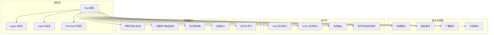
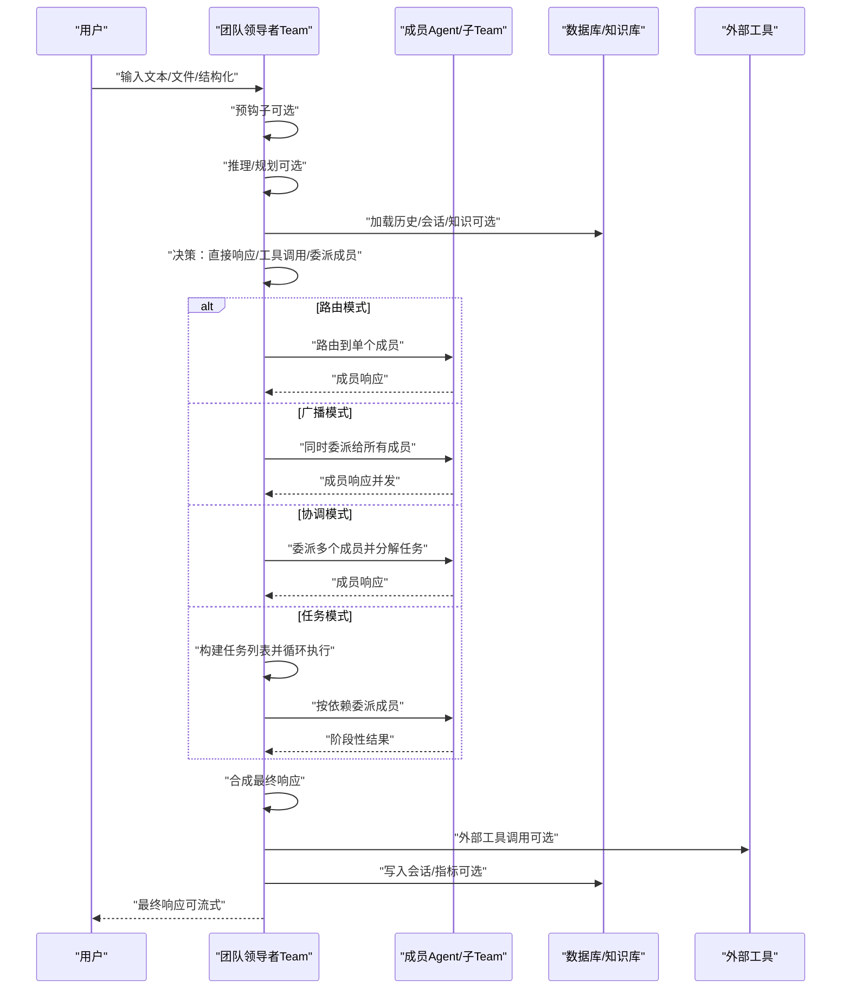
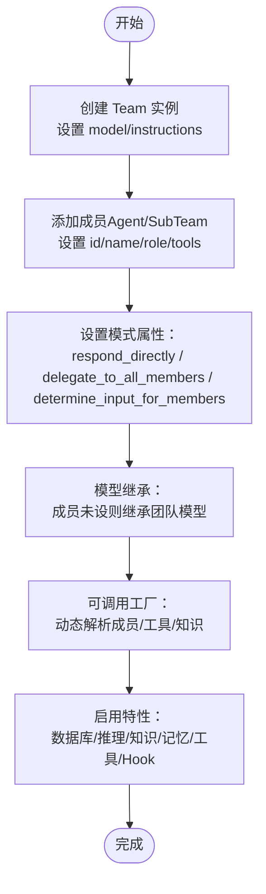
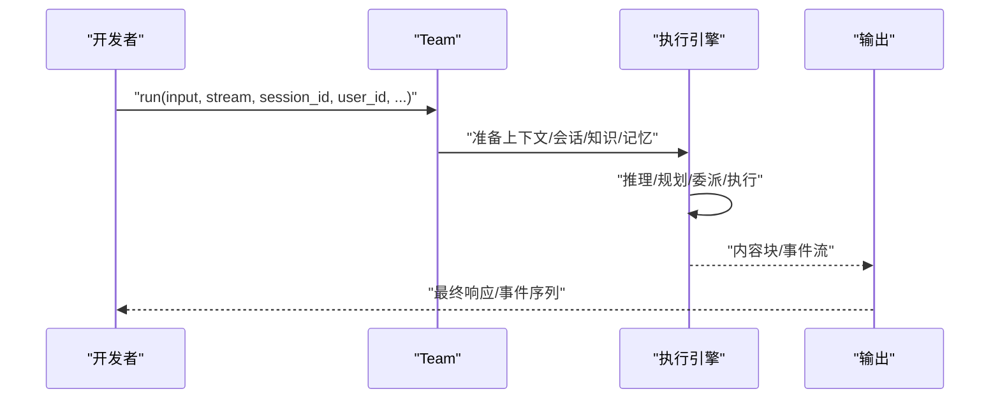
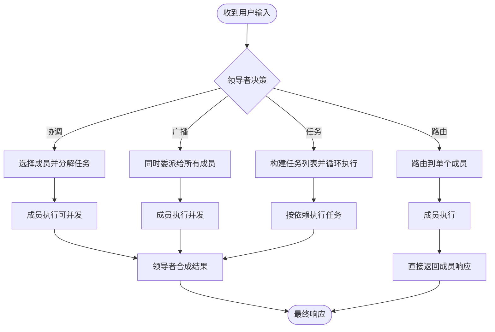
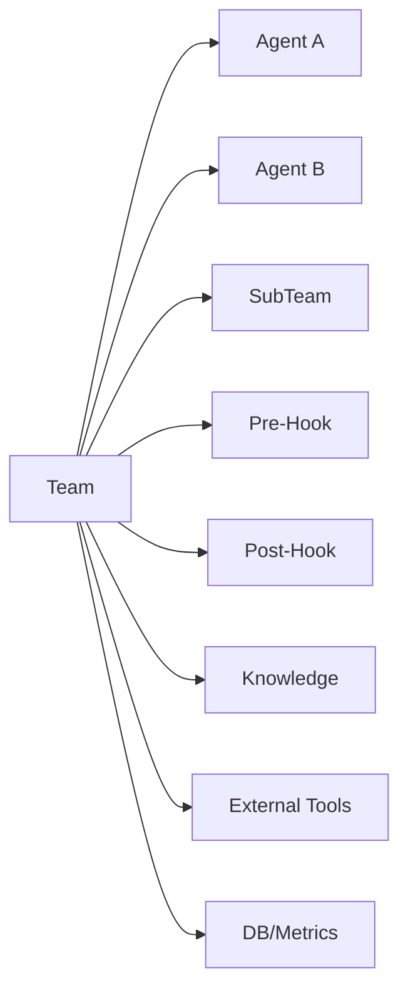

# 团队协作系统

<cite>
**本文引用的文件**
- [团队总览](file://teams/overview.mdx)
- [构建团队](file://teams/building-teams.mdx)
- [运行团队](file://teams/running-teams.mdx)
- [委托机制](file://teams/delegation.mdx)
- [调试团队](file://teams/debugging-teams.mdx)
- [团队参考：Team](file://reference/teams/team.mdx)
- [团队示例：广播协作](file://examples/teams/basics/delegate-to-all-members.mdx)
- [团队示例：任务模式（依赖）](file://examples/teams/modes/tasks/dependencies.mdx)
- [团队示例：路由模式（回退）](file://examples/teams/modes/route/with-fallback.mdx)
- [知识库示例：AI 支持团队](file://cookbook/teams/ai_support_team.mdx)
- [Hook 使用：输入验证（预钩子）](file://hooks/usage/team/input-validation-pre-hook.mdx)
- [Hook 使用：输出验证（后置钩子）](file://hooks/usage/team/output-validation-post-hook.mdx)
- [示例：Hook 输入验证](file://examples/teams/hooks/pre-hook-input.mdx)
- [示例：Hook 输出验证](file://examples/teams/hooks/post-hook-output.mdx)
- [示例：团队事件流](file://examples/teams/streaming/team-events.mdx)
- [示例：远程团队运行控制](file://examples/teams/run-control/remote-team.mdx)
- [示例：团队背景执行](file://examples/teams/other/background-execution.mdx)
- [示例：团队学习（始终学习）](file://examples/teams/learning/team-always-learn.mdx)
- [示例：团队内存管理器](file://examples/teams/memory/team-with-memory-manager.mdx)
- [迁移指南：v2 团队迁移](file://other/v2-migration.mdx)
</cite>

## 目录
1. [简介](#简介)
2. [项目结构](#项目结构)
3. [核心组件](#核心组件)
4. [架构总览](#架构总览)
5. [详细组件分析](#详细组件分析)
6. [依赖关系分析](#依赖关系分析)
7. [性能考量](#性能考量)
8. [故障排除指南](#故障排除指南)
9. [结论](#结论)
10. [附录](#附录)

## 简介
本技术文档面向团队协作系统，围绕“多代理协调、任务分配与协作机制”展开，系统性阐述团队的构建、运行管理、委托机制、调试与故障排除，并提供多种使用模式（基础团队、流式处理、直接响应、任务循环、路由与回退、知识库集成、Hook 验证、远程执行、背景运行、学习与记忆）的实际示例路径与场景说明，帮助开发者在复杂任务处理中高效落地。

## 项目结构
团队协作系统由以下关键模块构成：
- 团队定义与成员配置：支持嵌套团队、模型继承、可调用工厂动态装配成员/工具/知识。
- 执行策略与模式：协调（默认）、路由、广播、任务循环（tasks），并支持异步并发与流式输出。
- 委托与结果聚合：领导者根据角色与指令进行成员选择、任务分解与合成。
- 运行管理：支持会话绑定、文件/多媒体输入、结构化输出、取消与暂停恢复、事件流与指标。
- 调试与可观测性：调试模式、日志级别、交互式 CLI、AgentOS 可视化追踪。
- 高级能力：Hook 输入/输出验证、知识库检索、外部工具集成、学习与记忆、远程执行与背景运行。

**图表来源**
- [团队总览:1-43](file://teams/overview.mdx#L1-L43)
- [构建团队:1-223](file://teams/building-teams.mdx#L1-L223)
- [运行团队:1-286](file://teams/running-teams.mdx#L1-L286)
- [委托机制:1-300](file://teams/delegation.mdx#L1-L300)

**章节来源**
- [团队总览:1-43](file://teams/overview.mdx#L1-L43)
- [构建团队:1-223](file://teams/building-teams.mdx#L1-L223)
- [运行团队:1-286](file://teams/running-teams.mdx#L1-L286)
- [委托机制:1-300](file://teams/delegation.mdx#L1-L300)

## 核心组件
- Team（团队）
  - 成员：Agent 或子 Team；支持 id/name 标识与角色描述，用于稳定委托与上下文。
  - 模型继承：成员可继承团队模型，或各自指定独立模型。
  - 模式属性：respond_directly、delegate_to_all_members、determine_input_for_members、max_iterations 等替代旧版 mode 参数。
  - 特性：指令、数据库、推理、知识、记忆、工具、Hook、流式输出、事件流、指标与会话。
- Agent（代理）
  - 角色与工具：明确职责与能力边界，便于领导者路由与合成。
- 模式（Mode）
  - coordinate（默认）：分解任务、委派成员、合成结果。
  - route：路由到单个专家，可直通用户输入。
  - broadcast：同时委派给所有成员，适合并行视角收集。
  - tasks：任务列表循环，按依赖顺序执行，直至目标完成或达到最大迭代次数。
- 运行接口
  - run()/arun()：同步/异步执行；支持流式输出与事件流。
  - print_response()/aprint_response()：开发友好输出。
  - cancel_run()/acontinue_run()：运行取消与暂停恢复。
- Hook
  - pre_hooks：输入验证与转换。
  - post_hooks：输出质量与安全校验。
- 知识库与外部工具
  - 知识库检索（向量数据库）与外部工具（Slack、搜索引擎等）集成。
- 远程执行与背景运行
  - 远程团队运行、异步事件流、后台任务与取消。

**章节来源**
- [团队参考：Team:151-179](file://reference/teams/team.mdx#L151-L179)
- [构建团队:191-223](file://teams/building-teams.mdx#L191-L223)
- [运行团队:128-286](file://teams/running-teams.mdx#L128-L286)
- [委托机制:32-300](file://teams/delegation.mdx#L32-L300)
- [迁移指南：v2 团队迁移:289-301](file://other/v2-migration.mdx#L289-L301)

## 架构总览
下图展示了从请求进入团队到最终响应返回的关键流程，以及模式切换对执行路径的影响。

**图表来源**
- [运行团队:38-73](file://teams/running-teams.mdx#L38-L73)
- [委托机制:21-41](file://teams/delegation.mdx#L21-L41)
- [运行团队:155-173](file://teams/running-teams.mdx#L155-L173)

## 详细组件分析

### 组件一：团队构建与成员配置
- 最小团队示例：定义成员、角色、工具与指令，设置模型后即可运行。
- 模式选择：通过 TeamMode 或模式属性控制协调策略。
- 嵌套团队：顶层领导者委派给子团队领导者，形成多层级协调。
- 模型继承：成员未显式设置模型时继承团队模型。
- 可调用工厂：动态解析成员/工具/知识，支持缓存以提升性能。
- 特性清单：指令、模式、数据库、推理、知识、记忆、工具等。

**图表来源**
- [构建团队:9-150](file://teams/building-teams.mdx#L9-L150)
- [构建团队:152-190](file://teams/building-teams.mdx#L152-L190)

**章节来源**
- [构建团队:9-150](file://teams/building-teams.mdx#L9-L150)
- [构建团队:152-190](file://teams/building-teams.mdx#L152-L190)

### 组件二：运行管理与执行策略
- 基本执行：run()/arun()，支持流式输出与事件流。
- 任务模式：构建共享任务列表，按依赖顺序执行，循环直到目标完成或达到最大迭代次数。
- 会话与用户：绑定 user_id/session_id，支持历史与指标持久化。
- 文件与多媒体：支持图片/音频/视频/文件输入。
- 结构化输出：传入 Pydantic 模型，获得结构化响应。
- 取消与暂停：支持运行取消与暂停恢复（含人类确认）。
- 事件类型：包含内容、工具调用、推理、记忆、Hook 等事件。

**图表来源**
- [运行团队:75-179](file://teams/running-teams.mdx#L75-L179)
- [运行团队:235-279](file://teams/running-teams.mdx#L235-L279)

**章节来源**
- [运行团队:75-179](file://teams/running-teams.mdx#L75-L179)
- [运行团队:235-279](file://teams/running-teams.mdx#L235-L279)

### 组件三：委托机制与结果聚合
- 默认流程：接收输入→分析→选择成员→构造任务→并发执行→合成响应。
- 模式差异：
  - 协调：领导者全权控制，适合需要质量控制与上下文合成的场景。
  - 路由：自动路由到单个专家，可直通用户输入，降低延迟。
  - 广播：同时委派给所有成员，适合并行视角收集与对比。
  - 任务：自主循环，按依赖顺序执行，适合多步骤目标。
- 生产注意事项：不同模式的令牌开销、延迟与错误处理策略不同。

**图表来源**
- [委托机制:21-41](file://teams/delegation.mdx#L21-L41)
- [委托机制:45-233](file://teams/delegation.mdx#L45-L233)

**章节来源**
- [委托机制:21-233](file://teams/delegation.mdx#L21-L233)

### 组件四：使用模式与示例路径
- 基础团队：最小团队示例，展示成员与指令配置。
- 流式处理：开启 stream/stream_events 获取事件流，支持成员事件与内部事件。
- 直接响应：路由模式 + 直通输入，适合简单路由与低延迟场景。
- 任务循环：任务模式 + 依赖链，确保执行顺序与目标达成。
- 知识库与外部工具：AI 支持团队示例，结合知识库检索与 Slack 工具。
- Hook 验证：输入/输出验证，保障安全与质量。
- 远程执行与背景运行：异步事件流、后台任务与取消。

**章节来源**
- [团队示例：广播协作:1-104](file://examples/teams/basics/delegate-to-all-members.mdx#L1-L104)
- [团队示例：任务模式（依赖）:1-104](file://examples/teams/modes/tasks/dependencies.mdx#L1-L104)
- [团队示例：路由模式（回退）:1-109](file://examples/teams/modes/route/with-fallback.mdx#L1-L109)
- [知识库示例：AI 支持团队:1-207](file://cookbook/teams/ai_support_team.mdx#L1-L207)
- [Hook 使用：输入验证（预钩子）:1-175](file://hooks/usage/team/input-validation-pre-hook.mdx#L1-L175)
- [Hook 使用：输出验证（后置钩子）:1-159](file://hooks/usage/team/output-validation-post-hook.mdx#L1-L159)
- [示例：Hook 输入验证:257-313](file://examples/teams/hooks/pre-hook-input.mdx#L257-L313)
- [示例：Hook 输出验证:438-476](file://examples/teams/hooks/post-hook-output.mdx#L438-L476)
- [示例：团队事件流:122-142](file://examples/teams/streaming/team-events.mdx#L122-L142)
- [示例：远程团队运行控制:54-76](file://examples/teams/run-control/remote-team.mdx#L54-L76)
- [示例：团队背景执行:166-196](file://examples/teams/other/background-execution.mdx#L166-L196)

## 依赖关系分析
- 组件耦合
  - Team 对 Agent/SubTeam 的强依赖；模式属性影响委派与合成策略。
  - Hook 在 run/arun 生命周期前后介入，解耦输入/输出校验逻辑。
  - 知识库与外部工具作为可插拔扩展，增强检索与集成能力。
- 外部依赖
  - 模型服务（OpenAI/Claude 等）、向量数据库（PgVector/Chroma 等）、外部工具（Slack/DuckDuckGo/Exa 等）。
- 循环依赖
  - 无直接循环依赖；模式与 Hook 仅通过接口契约耦合。

**图表来源**
- [构建团队:191-223](file://teams/building-teams.mdx#L191-L223)
- [运行团队:128-139](file://teams/running-teams.mdx#L128-L139)

**章节来源**
- [构建团队:191-223](file://teams/building-teams.mdx#L191-L223)
- [运行团队:128-139](file://teams/running-teams.mdx#L128-L139)

## 性能考量
- 模式成本与延迟
  - 协调：高（分解+合成），适合高质量场景。
  - 路由：低（仅选择），适合成本敏感与低延迟。
  - 广播：中（仅合成），适合并行视角收集。
  - 任务：高（规划+迭代），适合多步骤目标。
- 并发与流式
  - 异步执行下，成员并发执行；流式输出减少端到端等待时间。
- 令牌与上下文
  - 协调与任务模式的令牌开销更高；可通过减少成员数量、精简成员响应、选择合适模式降低消耗。
- 事件流与指标
  - 通过事件流与指标监控令牌使用、执行时间与成员表现，辅助优化。

**章节来源**
- [委托机制:269-295](file://teams/delegation.mdx#L269-L295)
- [运行团队:75-127](file://teams/running-teams.mdx#L75-L127)

## 故障排除指南
- 调试模式
  - 三种启用方式：团队级、单次运行、全局环境变量；可设置更详细的日志级别。
- 常见问题
  - 错误成员选择：检查角色描述是否清晰且不重叠，为领导者补充明确指令。
  - 成员静默失败：启用 show_members_responses 查看各成员返回；检查工具调用与错误。
  - 无限委派循环：为领导者与成员增加明确停止条件与反馈。
  - 令牌用量过高：减少成员数量、保持成员响应简洁、考虑路由模式跳过合成。
- 交互式 CLI 与可视化追踪
  - 使用内置 CLI 进行多轮对话测试；连接 AgentOS 获取可视化追踪与会话回放。

**章节来源**
- [调试团队:9-168](file://teams/debugging-teams.mdx#L9-L168)

## 结论
团队协作系统通过灵活的模式与强大的运行管理，实现了从简单路由到复杂任务循环的多样化编排。借助 Hook、知识库、外部工具、远程执行与学习记忆等能力，团队可在真实生产环境中实现高质量、可观测、可扩展的多代理协作。建议在实践中优先明确角色与指令、合理选择模式、利用流式与事件流进行可观测性建设，并通过 Hook 保障输入输出的质量与安全。

## 附录
- 模式对照表（替代旧版 mode）
  - 协调（默认）：respond_directly=False、delegate_to_all_members=False、determine_input_for_members=True。
  - 路由：respond_directly=True、determine_input_for_members=False。
  - 广播：delegate_to_all_members=True（与 respond_directly 冲突时广播优先）。
  - 任务：mode=TeamMode.tasks，配合 max_iterations 控制循环上限。
- 关键参考
  - Team 接口与参数、事件类型、运行输出结构等详见团队参考文档。

**章节来源**
- [迁移指南：v2 团队迁移:289-301](file://other/v2-migration.mdx#L289-L301)
- [团队参考：Team:17-20](file://reference/teams/team.mdx#L17-L20)
- [运行团队:235-279](file://teams/running-teams.mdx#L235-L279)