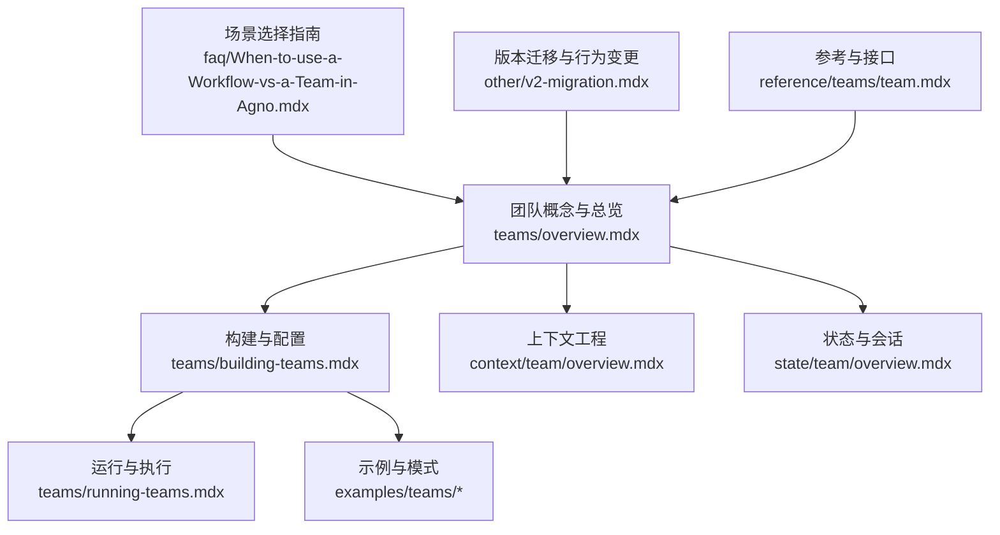
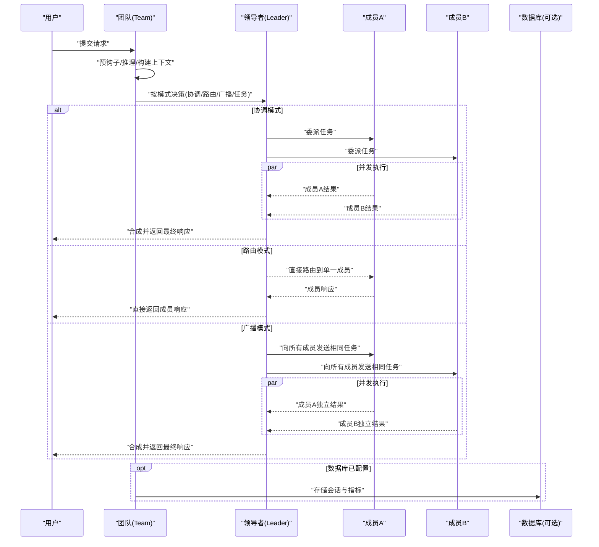
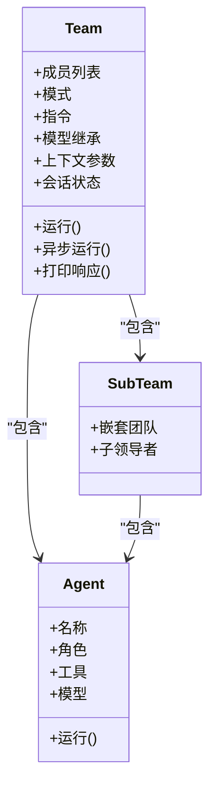
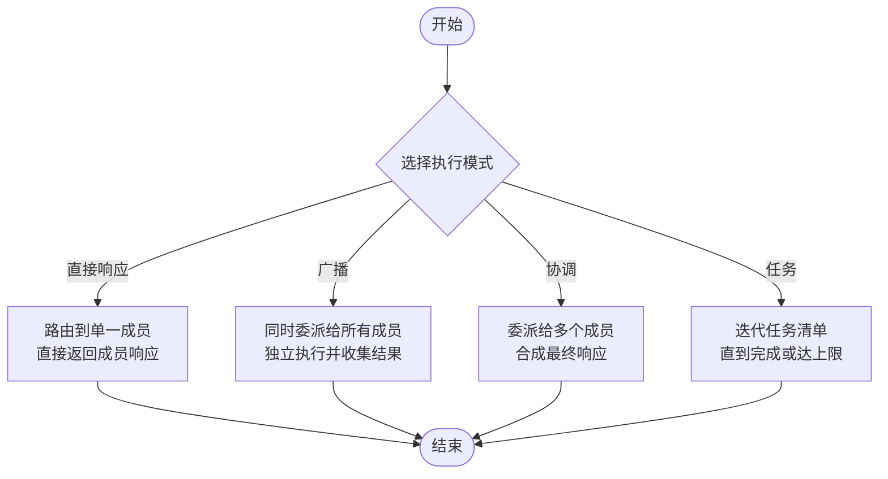
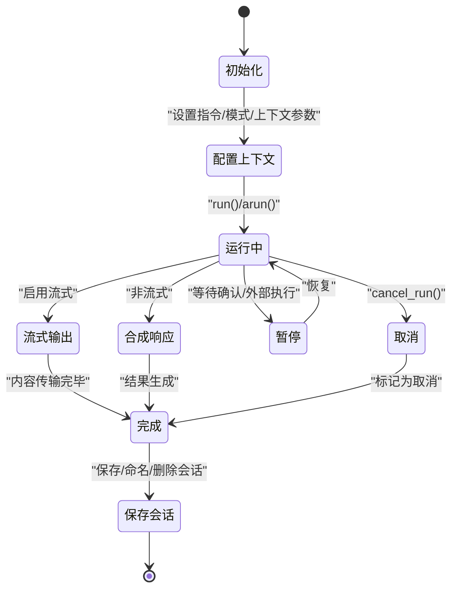
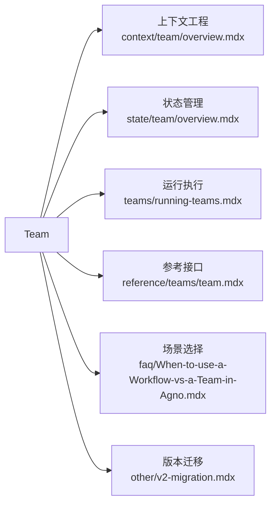

# 团队基础概念

<cite>
**本文引用的文件**
- [teams/overview.mdx](file://teams/overview.mdx)
- [teams/building-teams.mdx](file://teams/building-teams.mdx)
- [teams/running-teams.mdx](file://teams/running-teams.mdx)
- [context/team/overview.mdx](file://context/team/overview.mdx)
- [state/team/overview.mdx](file://state/team/overview.mdx)
- [examples/teams/basics/basic-coordination.mdx](file://examples/teams/basics/basic-coordination.mdx)
- [examples/teams/basics/respond-directly-router-team.mdx](file://examples/teams/basics/respond-directly-router-team.mdx)
- [examples/teams/modes/broadcast/basic.mdx](file://examples/teams/modes/broadcast/basic.mdx)
- [examples/teams/modes/overview.mdx](file://examples/teams/modes/overview.mdx)
- [examples/teams/basics/overview.mdx](file://examples/teams/basics/overview.mdx)
- [faq/When-to-use-a-Workflow-vs-a-Team-in-Agno.mdx](file://faq/When-to-use-a-Workflow-vs-a-Team-in-Agno.mdx)
- [other/v2-migration.mdx](file://other/v2-migration.mdx)
- [reference/teams/team.mdx](file://reference/teams/team.mdx)
</cite>

## 目录
1. [引言](#引言)
2. [项目结构](#项目结构)
3. [核心组件](#核心组件)
4. [架构总览](#架构总览)
5. [详细组件分析](#详细组件分析)
6. [依赖分析](#依赖分析)
7. [性能考虑](#性能考虑)
8. [故障排查指南](#故障排查指南)
9. [结论](#结论)
10. [附录](#附录)

## 引言
本文件系统性阐述“团队”的基础概念与实践方法，面向需要构建多智能体协作系统的工程师与产品人员。内容涵盖团队的定义、组成结构、成员关系与协作机制；对比团队与单个代理的差异与适用场景；介绍三种典型使用模式（直接响应、广播、协调）；给出初始化与配置示例；讲解生命周期管理与状态维护；并通过真实示例路径帮助快速上手。

## 项目结构
围绕“团队”主题，知识库中相关文档主要分布在以下位置：
- 概念与总览：teams/overview.mdx
- 构建与配置：teams/building-teams.mdx
- 运行与执行：teams/running-teams.mdx
- 上下文工程：context/team/overview.mdx
- 状态与会话：state/team/overview.mdx
- 示例与模式：examples/teams/*（含 basics、modes、state 等子目录）
- 场景选择：faq/When-to-use-a-Workflow-vs-a-Team-in-Agno.mdx
- 版本迁移与行为变更：other/v2-migration.mdx
- 参考与接口：reference/teams/team.mdx

图表来源
- [teams/overview.mdx](file://teams/overview.mdx)
- [teams/building-teams.mdx](file://teams/building-teams.mdx)
- [teams/running-teams.mdx](file://teams/running-teams.mdx)
- [context/team/overview.mdx](file://context/team/overview.mdx)
- [state/team/overview.mdx](file://state/team/overview.mdx)
- [examples/teams/basics/overview.mdx](file://examples/teams/basics/overview.mdx)
- [faq/When-to-use-a-Workflow-vs-a-Team-in-Agno.mdx](file://faq/When-to-use-a-Workflow-vs-a-Team-in-Agno.mdx)
- [other/v2-migration.mdx](file://other/v2-migration.mdx)
- [reference/teams/team.mdx](file://reference/teams/team.mdx)

章节来源
- [teams/overview.mdx](file://teams/overview.mdx)
- [teams/building-teams.mdx](file://teams/building-teams.mdx)
- [teams/running-teams.mdx](file://teams/running-teams.mdx)
- [context/team/overview.mdx](file://context/team/overview.mdx)
- [state/team/overview.mdx](file://state/team/overview.mdx)
- [examples/teams/basics/overview.mdx](file://examples/teams/basics/overview.mdx)
- [faq/When-to-use-a-Workflow-vs-a-Team-in-Agno.mdx](file://faq/When-to-use-a-Workflow-vs-a-Team-in-Agno.mdx)
- [other/v2-migration.mdx](file://other/v2-migration.mdx)
- [reference/teams/team.mdx](file://reference/teams/team.mdx)

## 核心组件
- 团队（Team）：由一个或多个成员（Agent 或子团队）组成的协作单元，由“团队领导者”负责任务分解与结果合成。
- 成员（Member）：每个成员具备名称与角色，用于指导领导者进行路由与分工。
- 执行模式（Mode）：控制领导者如何与成员协作，包括默认协调、路由到单一成员、广播给所有成员、以及任务循环模式。
- 上下文（Context）：系统消息、用户消息、历史、附加输入等构成的上下文，决定模型如何决策。
- 状态（State）：共享会话状态可在团队成员间传播，支持持久化与跨轮次更新。
- 生命周期（Lifecycle）：从初始化、运行、流式输出、暂停/恢复、取消到会话保存与删除的完整流程。

章节来源
- [teams/overview.mdx](file://teams/overview.mdx)
- [teams/building-teams.mdx](file://teams/building-teams.mdx)
- [teams/running-teams.mdx](file://teams/running-teams.mdx)
- [context/team/overview.mdx](file://context/team/overview.mdx)
- [state/team/overview.mdx](file://state/team/overview.mdx)

## 架构总览
下图展示了团队在一次运行中的关键交互：领导者根据上下文与模式决策是否委托、并发执行成员任务、收集并合成最终响应，并可持久化会话与指标。

图表来源
- [teams/running-teams.mdx](file://teams/running-teams.mdx)
- [context/team/overview.mdx](file://context/team/overview.mdx)
- [state/team/overview.mdx](file://state/team/overview.mdx)

## 详细组件分析

### 组件A：团队的组成与协作
- 组成结构
  - 成员列表：每个成员需具备名称与角色，便于领导者进行路由与分工。
  - 嵌套团队：顶层领导者可委派给子团队，子团队再委派给其成员，形成分层协作。
  - 模型继承：若成员未显式设置模型，将继承自团队。
- 协作机制
  - 默认协调：领导者综合成员结果后合成响应。
  - 路由模式：直接将请求路由至单一成员并返回其响应。
  - 广播模式：同时向所有成员发送相同任务，收集独立结果后合成。
  - 任务模式：领导者以任务清单驱动迭代执行，直至目标完成或达到最大迭代次数。
- 上下文工程
  - 系统消息包含描述、指令、成员信息、工具、期望输出、附加信息等。
  - 支持历史、记忆、知识检索、会话摘要、会话状态注入等上下文扩展。
- 状态管理
  - 共享会话状态在团队成员间同步，支持自动更新与持久化。
  - 支持“成员交互共享”，使新委派接收者能看到先前成员的交互记录。

图表来源
- [teams/building-teams.mdx](file://teams/building-teams.mdx)
- [context/team/overview.mdx](file://context/team/overview.mdx)
- [state/team/overview.mdx](file://state/team/overview.mdx)

章节来源
- [teams/building-teams.mdx](file://teams/building-teams.mdx)
- [context/team/overview.mdx](file://context/team/overview.mdx)
- [state/team/overview.mdx](file://state/team/overview.mdx)

### 组件B：执行模式与使用场景
- 直接响应（路由）：适用于单一专业领域路由，领导者不二次合成，直接返回成员响应。
- 广播：适用于需要多视角独立评估或并行收集信息的场景。
- 协调：默认模式，适合需要综合分析与合成的复杂任务。
- 任务：适用于需要持续迭代的任务清单管理与推进。

图表来源
- [examples/teams/basics/respond-directly-router-team.mdx](file://examples/teams/basics/respond-directly-router-team.mdx)
- [examples/teams/modes/broadcast/basic.mdx](file://examples/teams/modes/broadcast/basic.mdx)
- [examples/teams/modes/overview.mdx](file://examples/teams/modes/overview.mdx)

章节来源
- [examples/teams/basics/respond-directly-router-team.mdx](file://examples/teams/basics/respond-directly-router-team.mdx)
- [examples/teams/modes/broadcast/basic.mdx](file://examples/teams/modes/broadcast/basic.mdx)
- [examples/teams/modes/overview.mdx](file://examples/teams/modes/overview.mdx)

### 组件C：生命周期与状态维护
- 初始化与配置
  - 最小示例：指定模型、成员与指令即可运行。
  - 嵌套团队：支持子团队作为成员参与更高层的委派。
  - 模型继承：成员未设置模型时继承团队模型。
- 运行与输出
  - 同步/异步运行，支持流式输出与事件流。
  - 输出包含最终内容、消息历史、指标与成员响应。
- 会话与状态
  - 通过 session_state 在团队内共享数据，支持自动更新与持久化。
  - 支持在运行时切换会话ID加载已有状态，或覆盖数据库中的状态。
- 会话管理
  - 提供保存、异步保存、删除、命名、查询状态等接口。
- 暂停/恢复与取消
  - 支持人类确认/外部执行暂停，完成后继续。
  - 支持运行取消。

图表来源
- [teams/running-teams.mdx](file://teams/running-teams.mdx)
- [state/team/overview.mdx](file://state/team/overview.mdx)
- [reference/teams/team.mdx](file://reference/teams/team.mdx)

章节来源
- [teams/running-teams.mdx](file://teams/running-teams.mdx)
- [state/team/overview.mdx](file://state/team/overview.mdx)
- [reference/teams/team.mdx](file://reference/teams/team.mdx)

### 组件D：上下文工程与最佳实践
- 系统消息构建
  - 描述、指令、成员信息、工具、期望输出、附加信息等组合。
  - 支持标签包裹指令、添加时间/地点/名称、会话摘要、记忆、知识、会话状态等。
- 用户消息与附加输入
  - 用户输入作为用户消息；可注入知识、依赖、示例等。
- 历史与工具调用过滤
  - 支持将历史与最近N次工具调用注入上下文，控制上下文长度与成本。
- 缓存策略
  - 将静态内容置于系统消息前部，利用模型侧提示缓存降低token消耗。

章节来源
- [context/team/overview.mdx](file://context/team/overview.mdx)

### 组件E：团队与单个代理的选择
- 使用团队的场景
  - 多专业领域协作、单个代理上下文受限、需要模块化与可维护性。
- 使用单个代理的场景
  - 任务单一、追求最小token成本、尚未发现扩展需求。
- 与工作流的关系
  - 工作流强调可编排的多步骤与分支；团队强调协作与多视角综合。

章节来源
- [faq/When-to-use-a-Workflow-vs-a-Team-in-Agno.mdx](file://faq/When-to-use-a-Workflow-vs-a-Team-in-Agno.mdx)

## 依赖分析
- 内聚性
  - 团队内部围绕“领导者-成员”协作展开，职责清晰。
- 耦合度
  - 与上下文工程、状态管理、会话持久化存在强耦合；通过统一的上下文参数与状态接口降低耦合。
- 外部依赖
  - 数据库（可选）、模型提供商（可选）、工具集（可选）。
- 行为变更
  - v2迁移中，mode 参数被拆分为更细粒度的行为属性（如 respond_directly、delegate_to_all_members、determine_input_for_members），提升灵活性。

图表来源
- [teams/running-teams.mdx](file://teams/running-teams.mdx)
- [context/team/overview.mdx](file://context/team/overview.mdx)
- [state/team/overview.mdx](file://state/team/overview.mdx)
- [reference/teams/team.mdx](file://reference/teams/team.mdx)
- [faq/When-to-use-a-Workflow-vs-a-Team-in-Agno.mdx](file://faq/When-to-use-a-Workflow-vs-a-Team-in-Agno.mdx)
- [other/v2-migration.mdx](file://other/v2-migration.mdx)

章节来源
- [teams/running-teams.mdx](file://teams/running-teams.mdx)
- [context/team/overview.mdx](file://context/team/overview.mdx)
- [state/team/overview.mdx](file://state/team/overview.mdx)
- [reference/teams/team.mdx](file://reference/teams/team.mdx)
- [faq/When-to-use-a-Workflow-vs-a-Team-in-Agno.mdx](file://faq/When-to-use-a-Workflow-vs-a-Team-in-Agno.mdx)
- [other/v2-migration.mdx](file://other/v2-migration.mdx)

## 性能考虑
- 并发执行：异步运行下，成员可并发执行，显著缩短端到端时延。
- 流式输出：启用流式可提前感知中间结果，改善用户体验。
- 上下文裁剪：通过历史与工具调用过滤、提示缓存等手段控制上下文长度，降低token成本。
- 任务模式：合理设置最大迭代次数，避免无限循环导致资源浪费。

## 故障排查指南
- 运行暂停
  - 当需要人工确认或外部执行时，运行可能暂停，返回待处理要求；解决后继续。
- 取消运行
  - 使用取消接口中断长时间运行的任务。
- 会话状态异常
  - 检查会话ID、状态合并/覆盖策略，确保跨轮次一致性。
- 模式冲突
  - v2中 respond_directly 与 delegate_to_all_members 不应同时启用；遵循迁移指南调整配置。

章节来源
- [teams/running-teams.mdx](file://teams/running-teams.mdx)
- [other/v2-migration.mdx](file://other/v2-migration.mdx)

## 结论
团队通过“领导者-成员”协作模式，将复杂任务分解为可管理的子任务，并在多视角评估、并行执行与状态共享的基础上实现高质量输出。结合上下文工程与状态管理，团队在可维护性、可扩展性与成本控制之间取得平衡。对于需要多专业协同与综合分析的场景，优先选择团队；对于简单确定性任务，单个代理更具性价比。

## 附录

### 基础使用模式与示例路径
- 直接响应（路由）模式
  - 示例路径：[respond-directly-router-team](file://examples/teams/basics/respond-directly-router-team.mdx)
- 广播模式
  - 示例路径：[broadcast/basic](file://examples/teams/modes/broadcast/basic.mdx)
- 协调模式（默认）
  - 示例路径：[basic-coordination](file://examples/teams/basics/basic-coordination.mdx)
- 任务模式
  - 示例路径：[modes/overview](file://examples/teams/modes/overview.mdx)

### 初始化与配置示例路径
- 最小团队示例
  - 路径：[teams/building-teams.mdx](file://teams/building-teams.mdx)
- 嵌套团队与模型继承
  - 路径：[teams/building-teams.mdx](file://teams/building-teams.mdx)
- 上下文参数与系统消息
  - 路径：[context/team/overview.mdx](file://context/team/overview.mdx)
- 状态共享与持久化
  - 路径：[state/team/overview.mdx](file://state/team/overview.mdx)

### 生命周期与状态维护接口
- 会话操作与状态读写
  - 路径：[reference/teams/team.mdx](file://reference/teams/team.mdx)