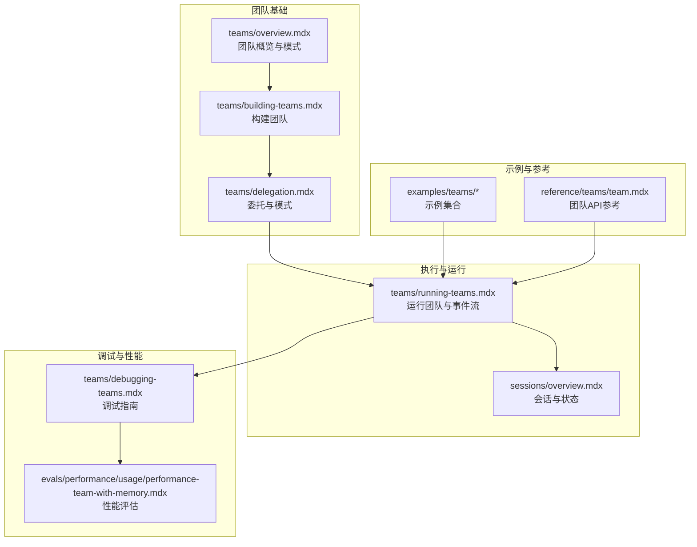
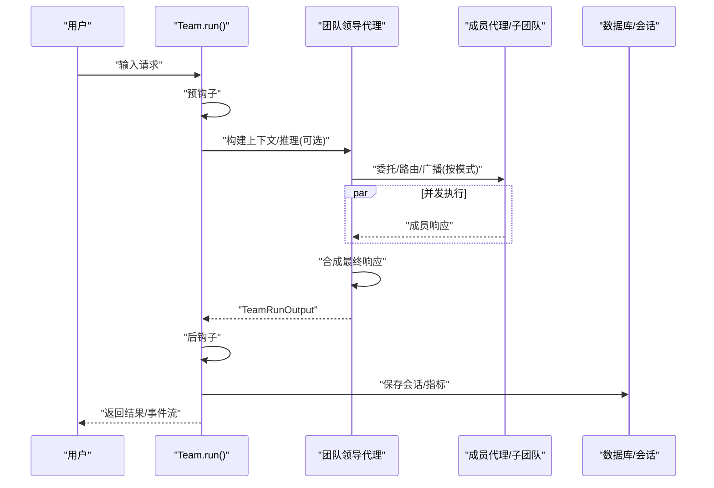
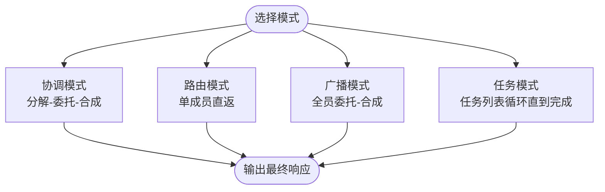
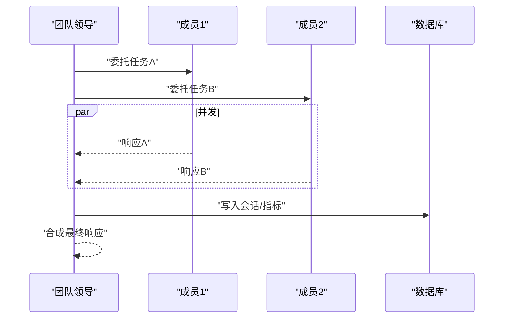
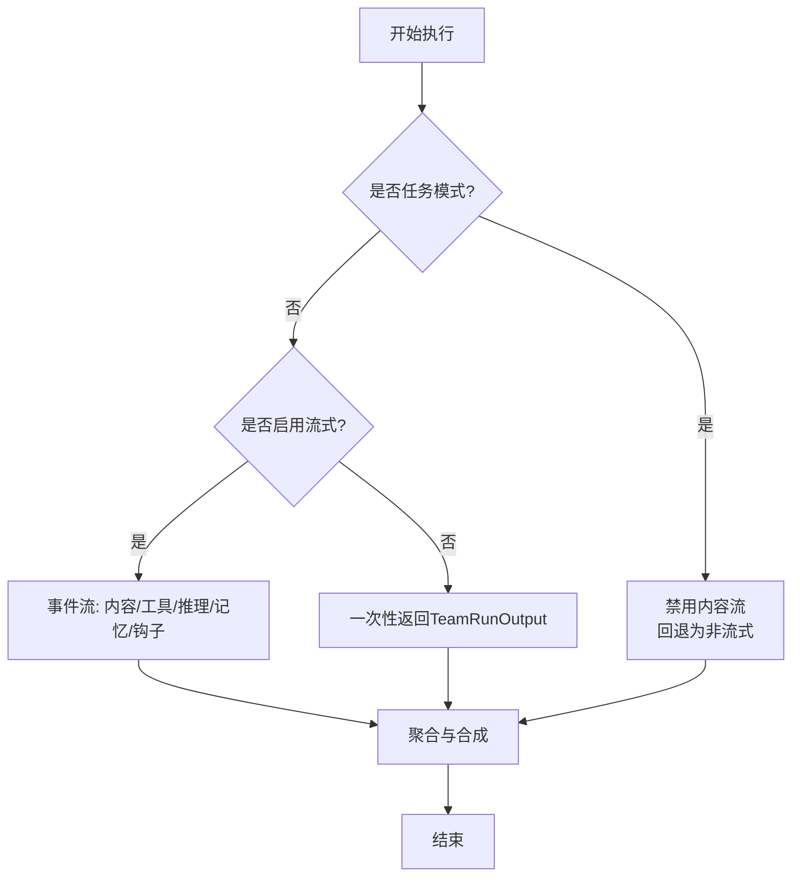
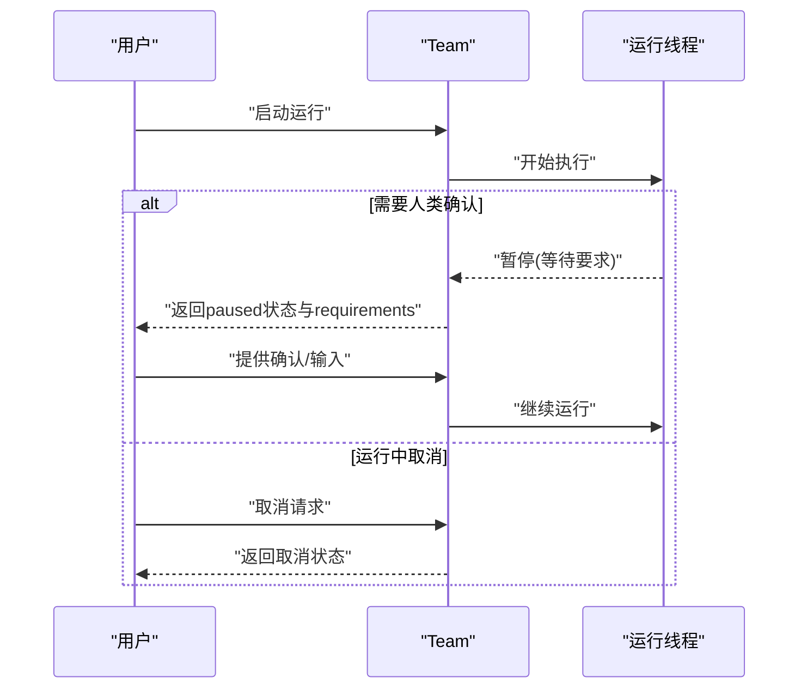
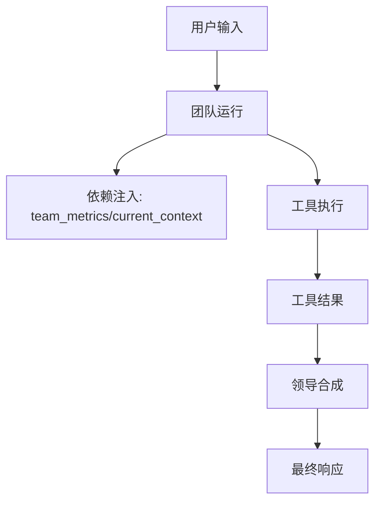
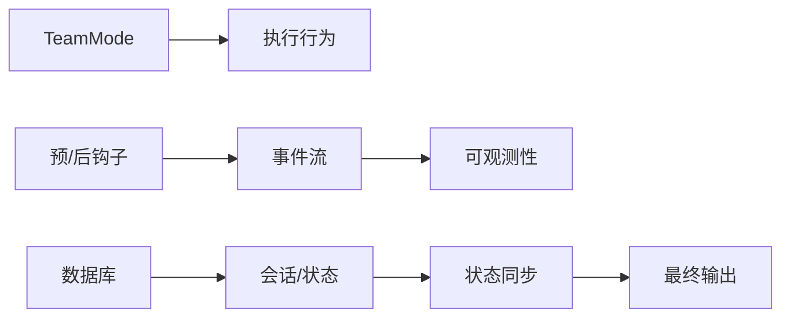

# 团队执行管理

<cite>
**本文引用的文件**
- [teams/overview.mdx](file://teams/overview.mdx)
- [teams/building-teams.mdx](file://teams/building-teams.mdx)
- [teams/delegation.mdx](file://teams/delegation.mdx)
- [teams/running-teams.mdx](file://teams/running-teams.mdx)
- [teams/debugging-teams.mdx](file://teams/debugging-teams.mdx)
- [sessions/overview.mdx](file://sessions/overview.mdx)
- [reference/teams/team.mdx](file://reference/teams/team.mdx)
- [_snippets/team-execution-style.mdx](file://_snippets/team-execution-style.mdx)
- [_snippets/team-snippet.mdx](file://_snippets/team-snippet.mdx)
- [examples/teams/basics/task-mode.mdx](file://examples/teams/basics/task-mode.mdx)
- [examples/teams/modes/tasks/dependencies.mdx](file://examples/teams/modes/tasks/dependencies.mdx)
- [examples/teams/modes/broadcast/basic.mdx](file://examples/teams/modes/broadcast/basic.mdx)
- [examples/teams/hooks/pre-hook-input.mdx](file://examples/teams/hooks/pre-hook-input.mdx)
- [examples/teams/run-control/cancel-run.mdx](file://examples/teams/run-control/cancel-run.mdx)
- [examples/teams/dependencies/dependencies-in-tools.mdx](file://examples/teams/dependencies/dependencies-in-tools.mdx)
- [dependencies/team/access-dependencies-in-tool.mdx](file://dependencies/team/access-dependencies-in-tool.mdx)
- [other/v2-migration.mdx](file://other/v2-migration.mdx)
- [evals/performance/usage/performance-team-with-memory.mdx](file://evals/performance/usage/performance-team-with-memory.mdx)
- [examples/evals/performance/team-response-with-memory-simple.mdx](file://examples/evals/performance/team-response-with-memory-simple.mdx)
- [examples/evals/performance/team-response-with-memory-multi-user.mdx](file://examples/evals/performance/team-response-with-memory-multi-user.mdx)
</cite>

## 目录
1. [简介](#简介)
2. [项目结构](#项目结构)
3. [核心组件](#核心组件)
4. [架构总览](#架构总览)
5. [详细组件分析](#详细组件分析)
6. [依赖关系分析](#依赖关系分析)
7. [性能考量](#性能考量)
8. [故障排除指南](#故障排除指南)
9. [结论](#结论)
10. [附录：执行示例](#附录执行示例)

## 简介
本文件面向团队执行管理，系统性阐述团队的执行策略与运行机制，覆盖任务分派、状态同步与结果聚合；详解团队执行的三种模式（流式处理、直接响应、批量处理）与任务驱动模式；并提供监控与控制方法（执行状态跟踪、进度报告、异常处理）、最佳实践与性能优化建议、调试技巧与故障排除方法，以及多场景执行示例。

## 项目结构
围绕“团队”主题，知识库提供了从“构建团队”到“运行团队”再到“调试与性能评估”的完整路径，并辅以会话与状态、依赖注入、取消控制等支撑能力。

图表来源
- [teams/overview.mdx:1-135](file://teams/overview.mdx#L1-L135)
- [teams/building-teams.mdx:1-223](file://teams/building-teams.mdx#L1-L223)
- [teams/delegation.mdx:1-300](file://teams/delegation.mdx#L1-L300)
- [teams/running-teams.mdx:1-286](file://teams/running-teams.mdx#L1-L286)
- [sessions/overview.mdx:1-87](file://sessions/overview.mdx#L1-L87)
- [teams/debugging-teams.mdx:1-93](file://teams/debugging-teams.mdx#L1-L93)
- [evals/performance/usage/performance-team-with-memory.mdx:1-125](file://evals/performance/usage/performance-team-with-memory.mdx#L1-L125)

章节来源
- [teams/overview.mdx:1-135](file://teams/overview.mdx#L1-L135)
- [teams/building-teams.mdx:1-223](file://teams/building-teams.mdx#L1-L223)
- [teams/delegation.mdx:1-300](file://teams/delegation.mdx#L1-L300)
- [teams/running-teams.mdx:1-286](file://teams/running-teams.mdx#L1-L286)
- [sessions/overview.mdx:1-87](file://sessions/overview.mdx#L1-L87)
- [teams/debugging-teams.mdx:1-93](file://teams/debugging-teams.mdx#L1-L93)
- [evals/performance/usage/performance-team-with-memory.mdx:1-125](file://evals/performance/usage/performance-team-with-memory.mdx#L1-L125)

## 核心组件
- 团队（Team）：由成员（Agent/子Team）组成，由“领导代理”根据模式进行协调与合成。
- 执行模式（Mode）：Coordinate（协调）、Route（路由）、Broadcast（广播）、Tasks（任务）。
- 会话与状态（Session/State）：持久化历史、状态与指标，支持并发与多用户隔离。
- 运行输出（TeamRunOutput）：包含最终内容、消息、指标、成员响应等。
- 取消与暂停（Cancellation/Human-in-the-loop）：支持运行取消与暂停后继续。
- 性能与调试：内存增长追踪、调试模式、事件流、错误定位。

章节来源
- [teams/overview.mdx:79-100](file://teams/overview.mdx#L79-L100)
- [teams/running-teams.mdx:128-139](file://teams/running-teams.mdx#L128-L139)
- [sessions/overview.mdx:12-28](file://sessions/overview.mdx#L12-L28)
- [teams/debugging-teams.mdx:9-49](file://teams/debugging-teams.mdx#L9-L49)

## 架构总览
团队执行的关键流程：预钩子 → 领导推理（可选） → 构建上下文 → 模型决策（直接响应/工具/委托） → 成员执行（并发） → 合成 → 后钩子 → 会话与指标存储。

图表来源
- [teams/running-teams.mdx:38-51](file://teams/running-teams.mdx#L38-L51)
- [teams/delegation.mdx:21-29](file://teams/delegation.mdx#L21-L29)

章节来源
- [teams/running-teams.mdx:38-51](file://teams/running-teams.mdx#L38-L51)
- [teams/delegation.mdx:21-29](file://teams/delegation.mdx#L21-L29)

## 详细组件分析

### 组件A：团队模式与执行风格
- 模式定义与行为差异：协调、路由、广播、任务循环。
- 执行风格映射：每种模式对应不同的委托与合成策略。
- 兼容性与迁移：v2中对旧标志位的映射与替代。

图表来源
- [_snippets/team-execution-style.mdx:1-7](file://_snippets/team-execution-style.mdx#L1-L7)
- [_snippets/team-snippet.mdx:1-6](file://_snippets/team-snippet.mdx#L1-L6)
- [teams/delegation.mdx:32-41](file://teams/delegation.mdx#L32-L41)

章节来源
- [_snippets/team-execution-style.mdx:1-7](file://_snippets/team-execution-style.mdx#L1-L7)
- [_snippets/team-snippet.mdx:1-6](file://_snippets/team-snippet.mdx#L1-L6)
- [teams/delegation.mdx:32-41](file://teams/delegation.mdx#L32-L41)
- [other/v2-migration.mdx:289-301](file://other/v2-migration.mdx#L289-L301)

### 组件B：任务分派与状态同步
- 委托策略：基于角色与指令选择成员；可显式设置成员ID以稳定标识。
- 并发执行：异步模式下成员并发执行，事件到达顺序可能不固定。
- 会话与状态：通过数据库持久化会话、历史与指标，支持多用户隔离与后续续聊。

图表来源
- [teams/delegation.mdx:45-75](file://teams/delegation.mdx#L45-L75)
- [teams/running-teams.mdx:113-127](file://teams/running-teams.mdx#L113-L127)
- [sessions/overview.mdx:12-28](file://sessions/overview.mdx#L12-L28)

章节来源
- [teams/delegation.mdx:45-75](file://teams/delegation.mdx#L45-L75)
- [teams/running-teams.mdx:113-127](file://teams/running-teams.mdx#L113-L127)
- [sessions/overview.mdx:12-28](file://sessions/overview.mdx#L12-L28)

### 组件C：结果聚合与事件流
- 聚合策略：根据模式决定是否合成、直返或广播汇总。
- 事件流：支持仅内容流与全事件流（工具调用、推理、记忆、钩子等），便于可观测性与调试。
- 任务模式限制：任务模式不支持内容流，若开启则回退为非流式。

图表来源
- [teams/running-teams.mdx:75-111](file://teams/running-teams.mdx#L75-L111)
- [teams/running-teams.mdx:235-279](file://teams/running-teams.mdx#L235-L279)

章节来源
- [teams/running-teams.mdx:75-111](file://teams/running-teams.mdx#L75-L111)
- [teams/running-teams.mdx:235-279](file://teams/running-teams.mdx#L235-L279)

### 组件D：运行控制与异常处理
- 取消控制：支持在运行中取消，返回取消状态并可获取部分内容。
- 暂停与继续：人类介入（审批/输入）后可恢复；需解析active_requirements并调用继续接口。
- 错误处理：不同模式对成员失败的容忍度不同，协调模式可利用其他成员结果继续。

图表来源
- [teams/running-teams.mdx:57-59](file://teams/running-teams.mdx#L57-L59)
- [examples/teams/run-control/cancel-run.mdx:71-192](file://examples/teams/run-control/cancel-run.mdx#L71-L192)

章节来源
- [teams/running-teams.mdx:57-59](file://teams/running-teams.mdx#L57-L59)
- [examples/teams/run-control/cancel-run.mdx:71-192](file://examples/teams/run-control/cancel-run.mdx#L71-L192)

### 组件E：依赖注入与上下文访问
- 工具依赖：通过dependencies参数向工具注入团队指标、当前上下文等数据。
- 运行时访问：工具可在运行时读取传入的依赖，实现跨模块协作与分析。

图表来源
- [dependencies/team/access-dependencies-in-tool.mdx:115-128](file://dependencies/team/access-dependencies-in-tool.mdx#L115-L128)
- [examples/teams/dependencies/dependencies-in-tools.mdx:61-88](file://examples/teams/dependencies/dependencies-in-tools.mdx#L61-L88)

章节来源
- [dependencies/team/access-dependencies-in-tool.mdx:115-128](file://dependencies/team/access-dependencies-in-tool.mdx#L115-L128)
- [examples/teams/dependencies/dependencies-in-tools.mdx:61-88](file://examples/teams/dependencies/dependencies-in-tools.mdx#L61-L88)

## 依赖关系分析
- 模式与行为耦合：模式优先于旧标志位，避免歧义。
- 事件与钩子：事件流贯穿执行生命周期，便于观测与调试。
- 数据库与会话：会话持久化是状态同步与历史追溯的基础。

图表来源
- [teams/delegation.mdx:41-42](file://teams/delegation.mdx#L41-L42)
- [teams/running-teams.mdx:235-279](file://teams/running-teams.mdx#L235-L279)
- [sessions/overview.mdx:12-28](file://sessions/overview.mdx#L12-L28)

章节来源
- [teams/delegation.mdx:41-42](file://teams/delegation.mdx#L41-L42)
- [teams/running-teams.mdx:235-279](file://teams/running-teams.mdx#L235-L279)
- [sessions/overview.mdx:12-28](file://sessions/overview.mdx#L12-L28)

## 性能考量
- 模式成本：协调与任务模式的规划与合成开销较高；路由模式成本最低；广播模式在合成上增加中等开销。
- 并发与延迟：路由模式延迟最低；广播+异步可并行执行成员任务；任务模式受迭代次数上限影响。
- 内存与追踪：可使用性能评估工具追踪内存增长与分配热点，辅助优化。

章节来源
- [teams/delegation.mdx:269-286](file://teams/delegation.mdx#L269-L286)
- [evals/performance/usage/performance-team-with-memory.mdx:1-125](file://evals/performance/usage/performance-team-with-memory.mdx#L1-L125)
- [examples/evals/performance/team-response-with-memory-simple.mdx:91-127](file://examples/evals/performance/team-response-with-memory-simple.mdx#L91-L127)
- [examples/evals/performance/team-response-with-memory-multi-user.mdx:135-172](file://examples/evals/performance/team-response-with-memory-multi-user.mdx#L135-L172)

## 故障排除指南
- 调试模式：启用全局或单次运行的调试模式，查看消息、工具调用、委托模式与指标。
- 常见问题：领导委派错误、成员静默失败、无限委派循环；检查角色明确性、显示成员响应、限制迭代次数。
- 输入预校验：可通过预钩子对输入进行验证，确保请求适合团队协作场景。

章节来源
- [teams/debugging-teams.mdx:9-93](file://teams/debugging-teams.mdx#L9-L93)
- [examples/teams/hooks/pre-hook-input.mdx:41-73](file://examples/teams/hooks/pre-hook-input.mdx#L41-L73)

## 结论
通过明确的模式选择、规范的任务分派与状态同步、完善的事件流与可观测性，团队执行可在复杂场景中保持高可靠性与可维护性。结合会话持久化、运行控制与性能评估，可进一步提升系统的稳定性与效率。

## 附录：执行示例

### 示例一：任务模式（Task Mode）
- 场景：需要将目标拆解为有依赖的任务列表，循环执行直至完成。
- 关键点：设置mode=TeamMode.tasks，配置max_iterations，成员负责具体任务执行与反馈。

章节来源
- [examples/teams/basics/task-mode.mdx:32-77](file://examples/teams/basics/task-mode.mdx#L32-L77)
- [examples/teams/modes/tasks/dependencies.mdx:62-103](file://examples/teams/modes/tasks/dependencies.mdx#L62-L103)

### 示例二：广播模式（Broadcast）
- 场景：同一任务同时交给多个成员并行执行，最后由领导综合。
- 关键点：设置mode=TeamMode.broadcast，异步执行可获得并发收益。

章节来源
- [examples/teams/modes/broadcast/basic.mdx:80-102](file://examples/teams/modes/broadcast/basic.mdx#L80-L102)

### 示例三：直接响应（Route）
- 场景：自动路由到最合适的成员，直接返回其响应，降低合成开销。
- 关键点：设置mode=TeamMode.route，必要时关闭领导对成员输入的二次加工。

章节来源
- [teams/delegation.mdx:76-117](file://teams/delegation.mdx#L76-L117)

### 示例四：取消与暂停
- 场景：长时运行任务需要中途取消或等待人工确认。
- 关键点：使用取消接口；暂停后解析requirements并继续。

章节来源
- [examples/teams/run-control/cancel-run.mdx:71-192](file://examples/teams/run-control/cancel-run.mdx#L71-L192)
- [teams/running-teams.mdx:57-59](file://teams/running-teams.mdx#L57-L59)

### 示例五：依赖注入与上下文访问
- 场景：工具需要访问团队指标与当前上下文，以生成更精准的分析。
- 关键点：通过dependencies传入数据，工具在运行时读取。

章节来源
- [dependencies/team/access-dependencies-in-tool.mdx:115-128](file://dependencies/team/access-dependencies-in-tool.mdx#L115-L128)
- [examples/teams/dependencies/dependencies-in-tools.mdx:61-88](file://examples/teams/dependencies/dependencies-in-tools.mdx#L61-L88)