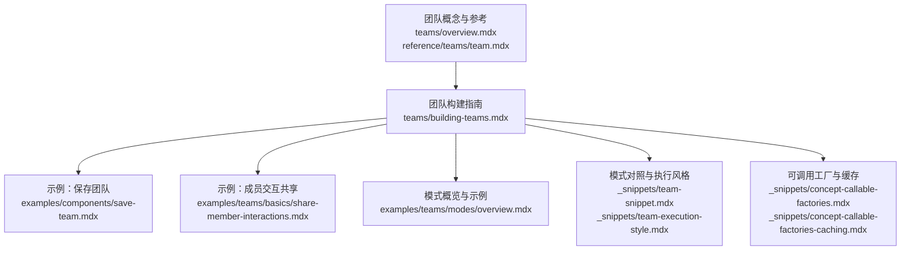
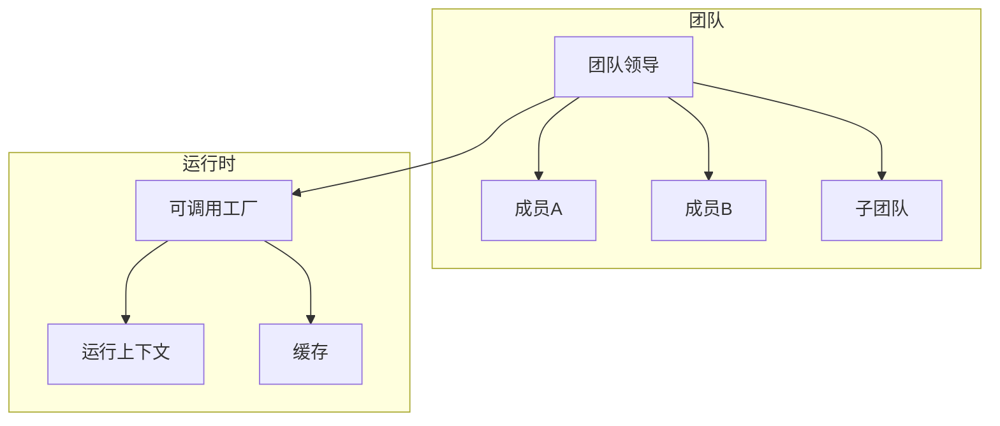
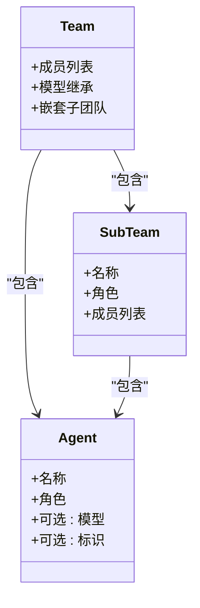
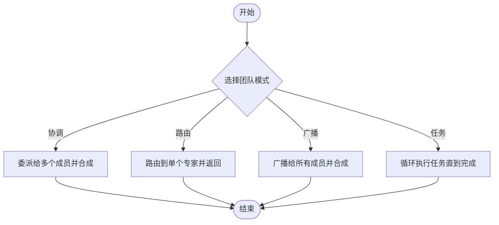
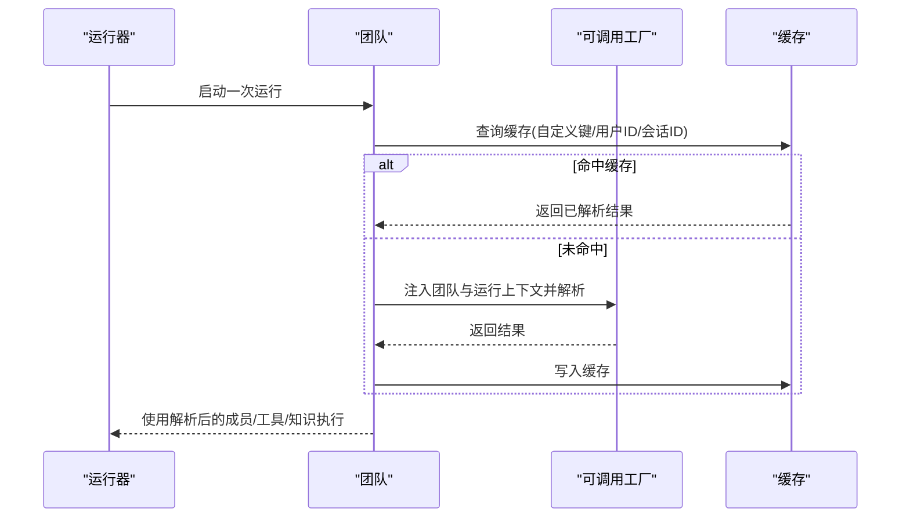
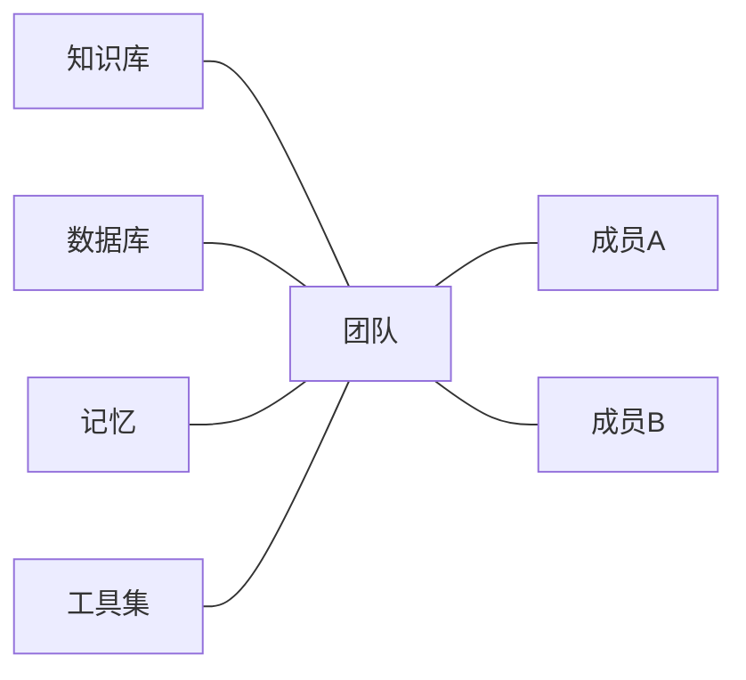
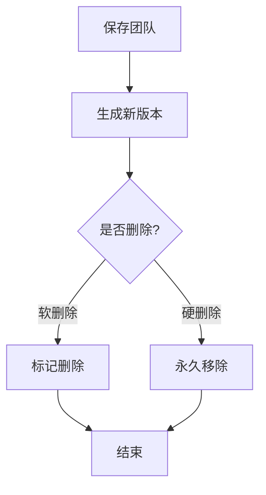
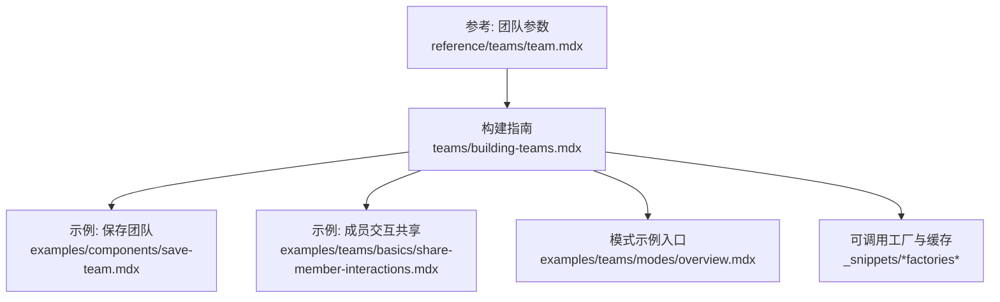

# 团队构建

<cite>
**本文引用的文件**
- [teams/building-teams.mdx](file://teams/building-teams.mdx)
- [teams/overview.mdx](file://teams/overview.mdx)
- [_snippets/team-snippet.mdx](file://_snippets/team-snippet.mdx)
- [_snippets/team-execution-style.mdx](file://_snippets/team-execution-style.mdx)
- [_snippets/concept-callable-factories.mdx](file://_snippets/concept-callable-factories.mdx)
- [_snippets/concept-callable-factories-caching.mdx](file://_snippets/concept-callable-factories-caching.mdx)
- [reference/teams/team.mdx](file://reference/teams/team.mdx)
- [examples/components/save-team.mdx](file://examples/components/save-team.mdx)
- [examples/teams/basics/share-member-interactions.mdx](file://examples/teams/basics/share-member-interactions.mdx)
- [examples/teams/modes/overview.mdx](file://examples/teams/modes/overview.mdx)
</cite>

## 目录
1. [简介](#简介)
2. [项目结构](#项目结构)
3. [核心组件](#核心组件)
4. [架构总览](#架构总览)
5. [详细组件分析](#详细组件分析)
6. [依赖关系分析](#依赖关系分析)
7. [性能考量](#性能考量)
8. [故障排查指南](#故障排查指南)
9. [结论](#结论)
10. [附录](#附录)

## 简介
本技术文档围绕“团队构建”主题，系统阐述如何在 Agno 框架中定义团队成员、分配角色、设计结构，并通过模式选择（广播、协调、路由、任务循环）实现高效协作。文档同时覆盖团队级共享资源（知识库、工具、记忆）的配置方式，以及可调用工厂与缓存策略，帮助从简单到复杂逐步搭建团队系统。

## 项目结构
本仓库以“文档+示例”的方式组织团队相关内容：
- 概念与参考：位于 teams/ 与 reference/teams/ 下，提供团队参数、模式说明与参考清单
- 实战示例：位于 examples/teams/ 与 examples/components/ 下，涵盖保存团队、成员交互共享、模式示例等
- 片段与速查：位于 _snippets/ 下，提供模式对照表、可调用工厂行为与缓存设置等

**图表来源**
- [teams/overview.mdx:1-74](file://teams/overview.mdx#L1-L74)
- [reference/teams/team.mdx:1-127](file://reference/teams/team.mdx#L1-L127)
- [teams/building-teams.mdx:1-223](file://teams/building-teams.mdx#L1-L223)
- [examples/components/save-team.mdx:34-82](file://examples/components/save-team.mdx#L34-L82)
- [examples/teams/basics/share-member-interactions.mdx:86-104](file://examples/teams/basics/share-member-interactions.mdx#L86-L104)
- [examples/teams/modes/overview.mdx:1-11](file://examples/teams/modes/overview.mdx#L1-L11)
- [_snippets/team-snippet.mdx:1-7](file://_snippets/team-snippet.mdx#L1-L7)
- [_snippets/team-execution-style.mdx:1-7](file://_snippets/team-execution-style.mdx#L1-L7)
- [_snippets/concept-callable-factories.mdx:1-8](file://_snippets/concept-callable-factories.mdx#L1-L8)
- [_snippets/concept-callable-factories-caching.mdx:1-16](file://_snippets/concept-callable-factories-caching.mdx#L1-L16)

**章节来源**
- [teams/overview.mdx:1-74](file://teams/overview.mdx#L1-L74)
- [reference/teams/team.mdx:1-127](file://reference/teams/team.mdx#L1-L127)
- [teams/building-teams.mdx:1-223](file://teams/building-teams.mdx#L1-L223)

## 核心组件
- 团队成员与角色
  - 成员应具备名称与角色，便于领导层进行委托与合成
  - 支持为成员设置唯一标识，提升跟踪与委托准确性
- 嵌套团队
  - 团队可包含子团队，形成多层级领导链路，顶层领导向子团队委派任务
- 模型继承
  - 子成员未显式指定模型时，自动继承父团队的模型
- 可调用工厂
  - 支持在运行时按会话或用户上下文动态解析成员、工具与知识
  - 工厂签名可注入团队实例与运行上下文，返回值类型根据用途而定
- 缓存设置
  - 可启用按自定义键、用户 ID 或会话 ID 的缓存，支持清理缓存以强制重新解析

**章节来源**
- [teams/building-teams.mdx:72-151](file://teams/building-teams.mdx#L72-L151)
- [teams/building-teams.mdx:152-191](file://teams/building-teams.mdx#L152-L191)
- [_snippets/concept-callable-factories.mdx:1-8](file://_snippets/concept-callable-factories.mdx#L1-L8)
- [_snippets/concept-callable-factories-caching.mdx:1-16](file://_snippets/concept-callable-factories-caching.mdx#L1-L16)

## 架构总览
下图展示了团队的高层协作关系：团队领导基于成员角色与能力进行委托；在不同模式下，领导可能直接返回成员响应、广播给所有成员，或在成员间协调合成；可调用工厂在运行时注入上下文并解析动态资源；缓存策略控制工厂结果的复用。

**图表来源**
- [teams/building-teams.mdx:40-71](file://teams/building-teams.mdx#L40-L71)
- [teams/building-teams.mdx:152-191](file://teams/building-teams.mdx#L152-L191)
- [_snippets/concept-callable-factories.mdx:1-8](file://_snippets/concept-callable-factories.mdx#L1-L8)
- [_snippets/concept-callable-factories-caching.mdx:1-16](file://_snippets/concept-callable-factories-caching.mdx#L1-L16)

## 详细组件分析

### 组件一：团队成员与嵌套结构
- 成员定义
  - 建议为每个成员设置名称与角色；如需精确识别，建议设置唯一标识
  - 当成员同时具备标识与名称时，委托流程优先使用标识作为成员识别依据
- 嵌套团队
  - 支持在团队中嵌入子团队，由顶层领导向子团队委派，子团队内部再进行成员级委托
- 模型继承
  - 若成员未显式指定模型，则继承父团队模型；显式模型将覆盖继承值

**图表来源**
- [teams/building-teams.mdx:72-151](file://teams/building-teams.mdx#L72-L151)

**章节来源**
- [teams/building-teams.mdx:72-151](file://teams/building-teams.mdx#L72-L151)

### 组件二：团队模式与执行风格
- 模式对照
  - 协调（默认）：分解工作、委派给成员、合成结果
  - 路由：将请求路由至单一专家，直接返回该成员响应
  - 广播：向所有成员委派同一任务后进行合成
  - 任务（Tasks）：在任务列表上循环执行直至目标完成，可通过迭代次数上限控制
- 执行风格速查
  - 对应的执行风格与适用场景可在速查片段中快速查阅

**图表来源**
- [_snippets/team-snippet.mdx:1-7](file://_snippets/team-snippet.mdx#L1-L7)
- [_snippets/team-execution-style.mdx:1-7](file://_snippets/team-execution-style.mdx#L1-L7)

**章节来源**
- [_snippets/team-snippet.mdx:1-7](file://_snippets/team-snippet.mdx#L1-L7)
- [_snippets/team-execution-style.mdx:1-7](file://_snippets/team-execution-style.mdx#L1-L7)
- [teams/building-teams.mdx:40-71](file://teams/building-teams.mdx#L40-L71)

### 组件三：可调用工厂与缓存
- 可调用工厂
  - 允许在运行时按会话或用户上下文动态解析成员、工具与知识
  - 工厂签名可注入团队实例与运行上下文；返回类型因用途而异
  - 支持异步工厂，需使用异步运行接口
- 缓存设置
  - 可启用缓存，按自定义键、用户 ID、会话 ID 顺序生效
  - 提供清理缓存的方法，以便在需要时强制重新解析

**图表来源**
- [_snippets/concept-callable-factories.mdx:1-8](file://_snippets/concept-callable-factories.mdx#L1-L8)
- [_snippets/concept-callable-factories-caching.mdx:1-16](file://_snippets/concept-callable-factories-caching.mdx#L1-L16)

**章节来源**
- [_snippets/concept-callable-factories.mdx:1-8](file://_snippets/concept-callable-factories.mdx#L1-L8)
- [_snippets/concept-callable-factories-caching.mdx:1-16](file://_snippets/concept-callable-factories-caching.mdx#L1-L16)
- [teams/building-teams.mdx:152-191](file://teams/building-teams.mdx#L152-L191)

### 组件四：团队级共享资源与知识共享
- 共享资源
  - 团队可配置数据库、知识库、记忆与工具，用于跨成员共享状态与能力
- 成员交互共享
  - 示例展示了如何在多次运行中共享成员间的交互历史，从而实现上下文延续与一致性

**图表来源**
- [teams/building-teams.mdx:191-206](file://teams/building-teams.mdx#L191-L206)
- [examples/teams/basics/share-member-interactions.mdx:86-104](file://examples/teams/basics/share-member-interactions.mdx#L86-L104)

**章节来源**
- [teams/building-teams.mdx:191-206](file://teams/building-teams.mdx#L191-L206)
- [examples/teams/basics/share-member-interactions.mdx:86-104](file://examples/teams/basics/share-member-interactions.mdx#L86-L104)

### 组件五：团队持久化与版本管理
- 保存与删除
  - 团队支持保存到数据库，生成新版本；默认软删除；也可执行硬删除
- 应用场景
  - 适合在生产环境中对团队配置进行版本化管理与回滚

**图表来源**
- [examples/components/save-team.mdx:34-82](file://examples/components/save-team.mdx#L34-L82)

**章节来源**
- [examples/components/save-team.mdx:34-82](file://examples/components/save-team.mdx#L34-L82)

### 组件六：模式示例导航
- 模式示例集合
  - 提供广播、协调、路由、任务四种模式的示例入口，便于按需查阅与实践

**章节来源**
- [examples/teams/modes/overview.mdx:1-11](file://examples/teams/modes/overview.mdx#L1-L11)

## 依赖关系分析
- 组件内聚与耦合
  - 团队领导与成员之间为弱耦合的委托关系；嵌套团队进一步降低成员职责边界
- 外部依赖
  - 可调用工厂依赖运行上下文；缓存策略依赖用户/会话维度；知识库与数据库为外部共享资源
- 参数契约
  - 团队参数清单明确了成员、模型、模式、历史与缓存等关键字段的作用域与默认值

**图表来源**
- [reference/teams/team.mdx:1-127](file://reference/teams/team.mdx#L1-L127)
- [teams/building-teams.mdx:1-223](file://teams/building-teams.mdx#L1-L223)
- [examples/components/save-team.mdx:34-82](file://examples/components/save-team.mdx#L34-L82)
- [examples/teams/basics/share-member-interactions.mdx:86-104](file://examples/teams/basics/share-member-interactions.mdx#L86-L104)
- [examples/teams/modes/overview.mdx:1-11](file://examples/teams/modes/overview.mdx#L1-L11)
- [_snippets/concept-callable-factories.mdx:1-8](file://_snippets/concept-callable-factories.mdx#L1-L8)
- [_snippets/concept-callable-factories-caching.mdx:1-16](file://_snippets/concept-callable-factories-caching.mdx#L1-L16)

**章节来源**
- [reference/teams/team.mdx:1-127](file://reference/teams/team.mdx#L1-L127)
- [teams/building-teams.mdx:1-223](file://teams/building-teams.mdx#L1-L223)

## 性能考量
- 模式选择对性能的影响
  - 路由模式减少成员数量参与，适合高时效性场景
  - 广播模式提升一致性但增加计算与通信开销
  - 协调模式在复杂任务中平衡成本与效果
  - 任务模式通过迭代上限控制整体耗时
- 工厂与缓存
  - 合理使用缓存可显著降低重复解析成本；在上下文频繁变化时，及时清理缓存避免陈旧结果
- 数据与知识共享
  - 将共享资源置于团队级可减少成员重复初始化与数据传输

[本节为通用指导，不直接分析具体文件]

## 故障排查指南
- 委派与响应异常
  - 检查成员角色描述是否清晰，确保领导层能正确识别最佳委派人
  - 如开启“直接响应”，需确认与“全部委派”模式的互斥限制
- 模式配置问题
  - 确认模式与任务循环上限设置是否符合预期
- 工厂与缓存
  - 若出现动态配置未更新，尝试清理对应类型的缓存并重试
- 历史与会话
  - 在需要跨运行共享交互时，确保会话 ID 一致且共享历史开关已启用

**章节来源**
- [teams/building-teams.mdx:191-206](file://teams/building-teams.mdx#L191-L206)
- [_snippets/concept-callable-factories-caching.mdx:10-16](file://_snippets/concept-callable-factories-caching.mdx#L10-L16)

## 结论
通过明确的成员定义、清晰的角色分工、灵活的模式选择与可调用工厂机制，Agno 团队能够以模块化方式实现复杂协作。结合团队级共享资源与缓存策略，可在保证一致性的同时优化性能与可维护性。建议从最小可行团队起步，逐步引入嵌套团队、动态工厂与高级模式，以满足不断演进的业务需求。

[本节为总结性内容，不直接分析具体文件]

## 附录
- 快速对照
  - 团队模式对照与执行风格：见“模式对照与执行风格”
  - 团队参数清单：见“团队参数参考”
  - 示例入口：保存团队、成员交互共享、模式示例

**章节来源**
- [_snippets/team-snippet.mdx:1-7](file://_snippets/team-snippet.mdx#L1-L7)
- [_snippets/team-execution-style.mdx:1-7](file://_snippets/team-execution-style.mdx#L1-L7)
- [reference/teams/team.mdx:1-127](file://reference/teams/team.mdx#L1-L127)
- [examples/components/save-team.mdx:34-82](file://examples/components/save-team.mdx#L34-L82)
- [examples/teams/basics/share-member-interactions.mdx:86-104](file://examples/teams/basics/share-member-interactions.mdx#L86-L104)
- [examples/teams/modes/overview.mdx:1-11](file://examples/teams/modes/overview.mdx#L1-L11)