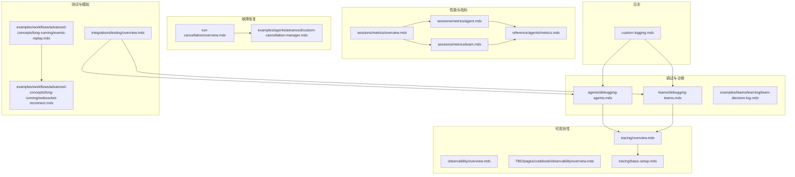
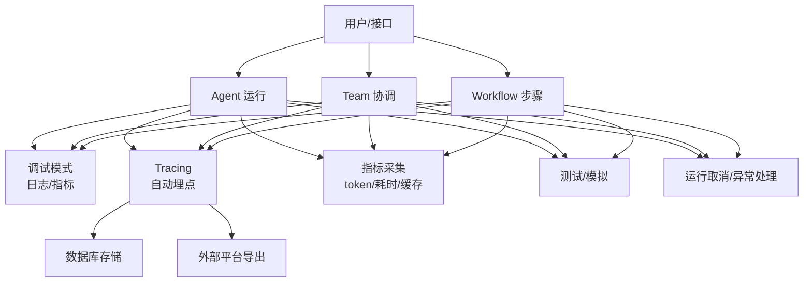
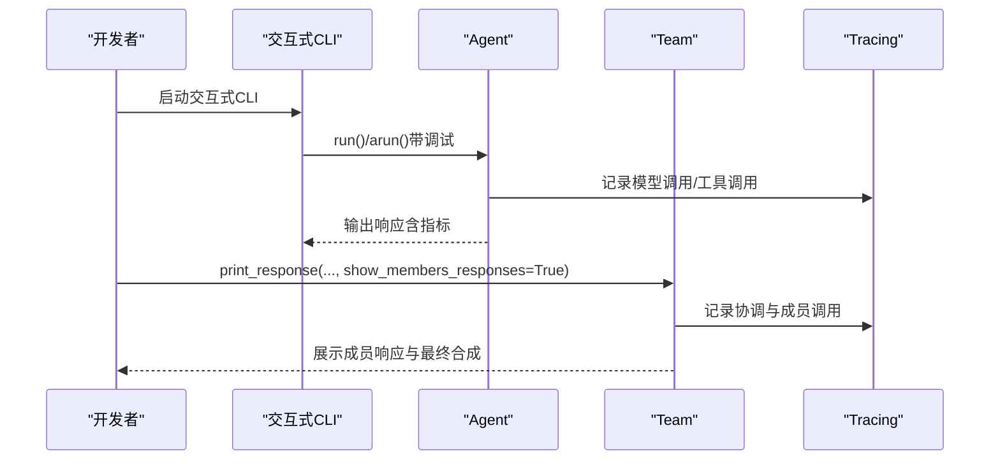
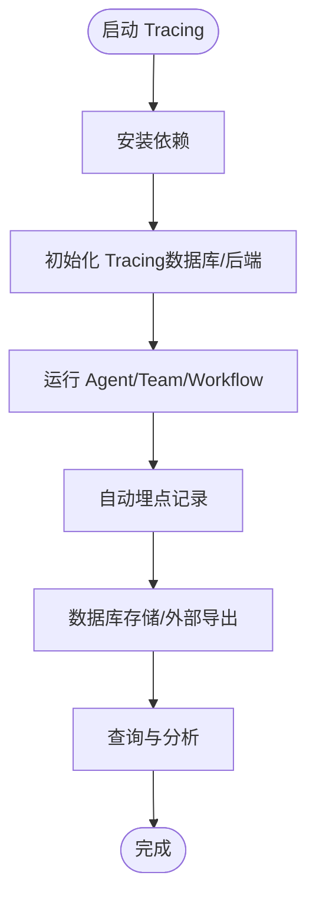
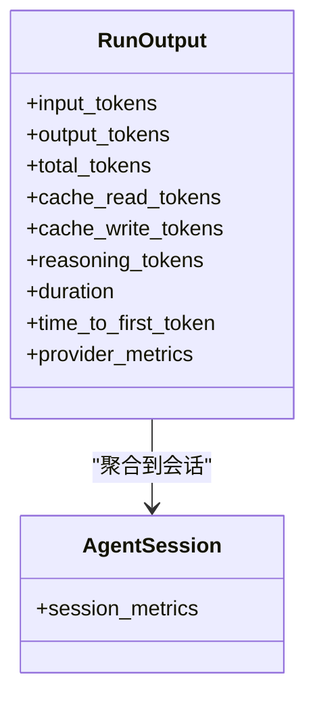
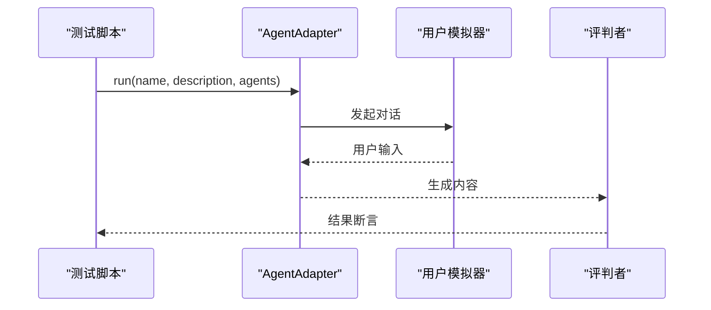
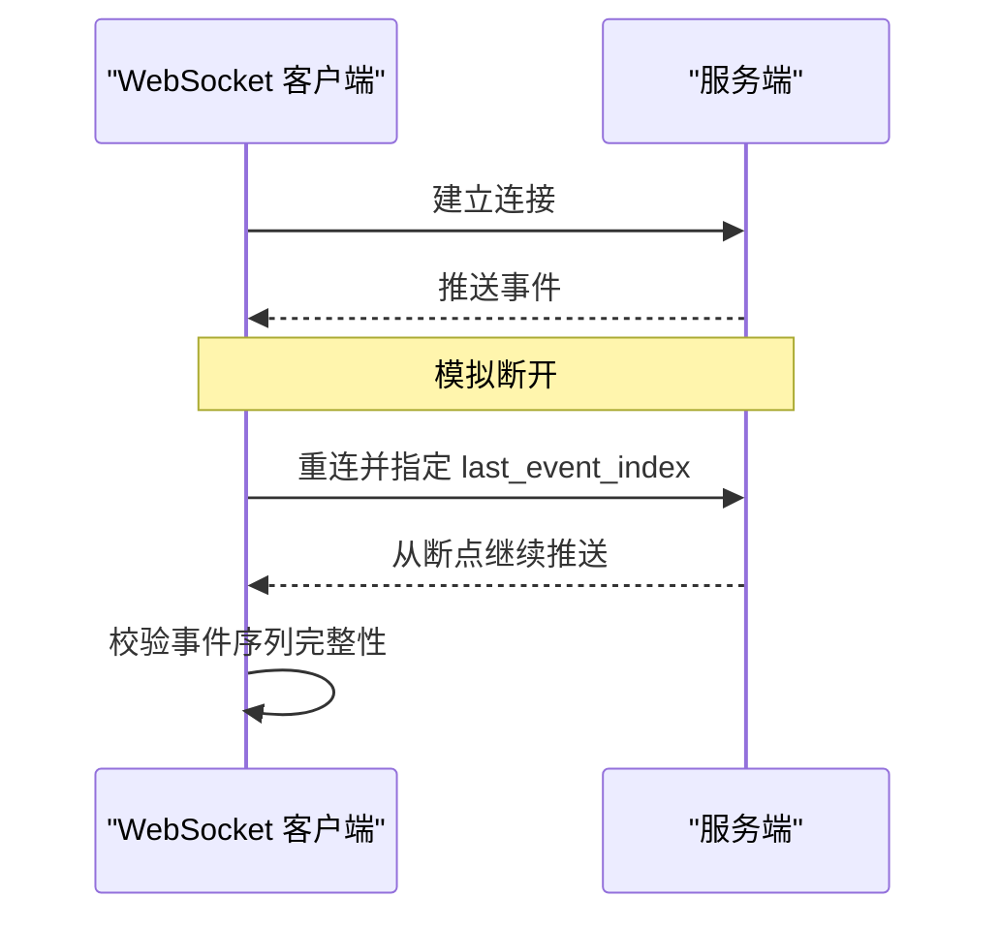
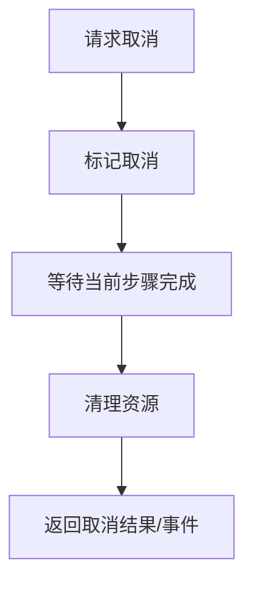
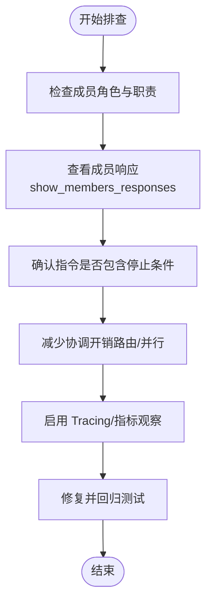

# 团队调试

<cite>
**本文引用的文件**
- [teams/debugging-teams.mdx](file://teams/debugging-teams.mdx)
- [agents/debugging-agents.mdx](file://agents/debugging-agents.mdx)
- [tracing/overview.mdx](file://tracing/overview.mdx)
- [observability/overview.mdx](file://observability/overview.mdx)
- [TBD/pages/cookbook/observability/overview.mdx](file://TBD/pages/cookbook/observability/overview.mdx)
- [tracing/basic-setup.mdx](file://tracing/basic-setup.mdx)
- [sessions/metrics/overview.mdx](file://sessions/metrics/overview.mdx)
- [sessions/metrics/agent.mdx](file://sessions/metrics/agent.mdx)
- [sessions/metrics/team.mdx](file://sessions/metrics/team.mdx)
- [reference/agents/metrics.mdx](file://reference/agents/metrics.mdx)
- [integrations/testing/overview.mdx](file://integrations/testing/overview.mdx)
- [examples/workflows/advanced-concepts/long-running/events-replay.mdx](file://examples/workflows/advanced-concepts/long-running/events-replay.mdx)
- [examples/workflows/advanced-concepts/long-running/websocket-reconnect.mdx](file://examples/workflows/advanced-concepts/long-running/websocket-reconnect.mdx)
- [run-cancellation/overview.mdx](file://run-cancellation/overview.mdx)
- [examples/agents/advanced/custom-cancellation-manager.mdx](file://examples/agents/advanced/custom-cancellation-manager.mdx)
- [examples/evals/reliability/overview.mdx](file://examples/evals/reliability/overview.mdx)
- [examples/evals/reliability/db-logging.mdx](file://examples/evals/reliability/db-logging.mdx)
- [custom-logging.mdx](file://custom-logging.mdx)
- [examples/tools/exceptions/overview.mdx](file://examples/tools/exceptions/overview.mdx)
- [examples/agent-os/client-a2a/error-handling.mdx](file://examples/agent-os/client-a2a/error-handling.mdx)
- [workflows/hitl/error-handling.mdx](file://workflows/hitl/error-handling.mdx)
- [examples/teams/modes/route/with-fallback.mdx](file://examples/teams/modes/route/with-fallback.mdx)
- [other/v2-migration.mdx](file://other/v2-migration.mdx)
- [examples/teams/learning/team-decision-log.mdx](file://examples/teams/learning/team-decision-log.mdx)
</cite>

## 目录
1. [简介](#简介)
2. [项目结构](#项目结构)
3. [核心组件](#核心组件)
4. [架构总览](#架构总览)
5. [详细组件分析](#详细组件分析)
6. [依赖关系分析](#依赖关系分析)
7. [性能考量](#性能考量)
8. [故障排查指南](#故障排查指南)
9. [结论](#结论)
10. [附录](#附录)

## 简介
本文件面向团队协作与多智能体系统（Agent/Team/Workflow）的调试与运维，聚焦以下目标：
- 快速定位“成员失败”“通信中断”“资源冲突”等常见问题
- 建立基于日志、指标与追踪的可观测性体系
- 制定测试策略、模拟环境与故障恢复流程
- 提供可复用的自动化工具与脚本路径，加速排障闭环

## 项目结构
围绕“团队调试”的知识与实践，仓库中与之直接相关的内容主要分布在如下区域：
- 调试与诊断：agents/teams 的调试模式、交互式 CLI、决策日志
- 可观测性：Tracing 概念与基础配置、OpenTelemetry 集成、数据库查询函数
- 性能与指标：会话与运行指标概览、Agent/Team 指标字段说明
- 测试与模拟：Scenario 场景测试框架、长时运行事件回放与重连
- 故障恢复：运行取消、自定义取消管理器、异常与错误处理
- 日志：自定义日志配置、命名日志器、文件输出



图表来源
- [agents/debugging-agents.mdx](file://agents/debugging-agents.mdx)
- [teams/debugging-teams.mdx](file://teams/debugging-teams.mdx)
- [tracing/overview.mdx](file://tracing/overview.mdx)
- [observability/overview.mdx](file://observability/overview.mdx)
- [TBD/pages/cookbook/observability/overview.mdx](file://TBD/pages/cookbook/observability/overview.mdx)
- [tracing/basic-setup.mdx](file://tracing/basic-setup.mdx)
- [sessions/metrics/overview.mdx](file://sessions/metrics/overview.mdx)
- [sessions/metrics/agent.mdx](file://sessions/metrics/agent.mdx)
- [sessions/metrics/team.mdx](file://sessions/metrics/team.mdx)
- [reference/agents/metrics.mdx](file://reference/agents/metrics.mdx)
- [integrations/testing/overview.mdx](file://integrations/testing/overview.mdx)
- [examples/workflows/advanced-concepts/long-running/events-replay.mdx](file://examples/workflows/advanced-concepts/long-running/events-replay.mdx)
- [examples/workflows/advanced-concepts/long-running/websocket-reconnect.mdx](file://examples/workflows/advanced-concepts/long-running/websocket-reconnect.mdx)
- [run-cancellation/overview.mdx](file://run-cancellation/overview.mdx)
- [examples/agents/advanced/custom-cancellation-manager.mdx](file://examples/agents/advanced/custom-cancellation-manager.mdx)
- [custom-logging.mdx](file://custom-logging.mdx)

章节来源
- [agents/debugging-agents.mdx](file://agents/debugging-agents.mdx)
- [teams/debugging-teams.mdx](file://teams/debugging-teams.mdx)
- [tracing/overview.mdx](file://tracing/overview.mdx)
- [observability/overview.mdx](file://observability/overview.mdx)
- [TBD/pages/cookbook/observability/overview.mdx](file://TBD/pages/cookbook/observability/overview.mdx)
- [tracing/basic-setup.mdx](file://tracing/basic-setup.mdx)
- [sessions/metrics/overview.mdx](file://sessions/metrics/overview.mdx)
- [sessions/metrics/agent.mdx](file://sessions/metrics/agent.mdx)
- [sessions/metrics/team.mdx](file://sessions/metrics/team.mdx)
- [reference/agents/metrics.mdx](file://reference/agents/metrics.mdx)
- [integrations/testing/overview.mdx](file://integrations/testing/overview.mdx)
- [examples/workflows/advanced-concepts/long-running/events-replay.mdx](file://examples/workflows/advanced-concepts/long-running/events-replay.mdx)
- [examples/workflows/advanced-concepts/long-running/websocket-reconnect.mdx](file://examples/workflows/advanced-concepts/long-running/websocket-reconnect.mdx)
- [run-cancellation/overview.mdx](file://run-cancellation/overview.mdx)
- [examples/agents/advanced/custom-cancellation-manager.mdx](file://examples/agents/advanced/custom-cancellation-manager.mdx)
- [custom-logging.mdx](file://custom-logging.mdx)

## 核心组件
- 调试模式与交互式 CLI
  - Agent/Team 支持全局或单次运行开启调试模式，并可设置更详细的日志级别；支持交互式 CLI 进行多轮对话测试。
- Tracing 与可观测性
  - 基于 OpenTelemetry 的自动埋点，覆盖 Agent/Team/Workflow 的运行、模型调用、工具执行等关键操作；支持数据库存储与外部平台导出。
- 指标与度量
  - 提供消息级、运行级、会话级指标，包含 token 使用、耗时、首 token 时间、缓存命中等，便于成本与性能分析。
- 测试与模拟
  - 使用 Scenario 框架进行场景化测试；长时运行支持事件回放与 WebSocket 重连，保障稳定性。
- 故障恢复
  - 运行取消机制与自定义取消管理器，支持非流式与流式的优雅终止；配合错误处理与异常重试策略。
- 日志
  - 自定义日志器、文件输出、命名日志器（agno/agno-team/agno-workflow），统一团队日志风格。

章节来源
- [agents/debugging-agents.mdx](file://agents/debugging-agents.mdx)
- [teams/debugging-teams.mdx](file://teams/debugging-teams.mdx)
- [tracing/overview.mdx](file://tracing/overview.mdx)
- [observability/overview.mdx](file://observability/overview.mdx)
- [TBD/pages/cookbook/observability/overview.mdx](file://TBD/pages/cookbook/observability/overview.mdx)
- [sessions/metrics/overview.mdx](file://sessions/metrics/overview.mdx)
- [sessions/metrics/agent.mdx](file://sessions/metrics/agent.mdx)
- [sessions/metrics/team.mdx](file://sessions/metrics/team.mdx)
- [reference/agents/metrics.mdx](file://reference/agents/metrics.mdx)
- [integrations/testing/overview.mdx](file://integrations/testing/overview.mdx)
- [examples/workflows/advanced-concepts/long-running/events-replay.mdx](file://examples/workflows/advanced-concepts/long-running/events-replay.mdx)
- [examples/workflows/advanced-concepts/long-running/websocket-reconnect.mdx](file://examples/workflows/advanced-concepts/long-running/websocket-reconnect.mdx)
- [run-cancellation/overview.mdx](file://run-cancellation/overview.mdx)
- [examples/agents/advanced/custom-cancellation-manager.mdx](file://examples/agents/advanced/custom-cancellation-manager.mdx)
- [custom-logging.mdx](file://custom-logging.mdx)

## 架构总览
下图展示从“请求到结果”的端到端链路，以及可观测性在其中的位置：调试模式用于开发期快速定位；Tracing 在生产期提供可视化与审计；指标用于成本与性能量化；测试与模拟保障质量；取消与错误处理确保稳定与可控。



图表来源
- [agents/debugging-agents.mdx](file://agents/debugging-agents.mdx)
- [teams/debugging-teams.mdx](file://teams/debugging-teams.mdx)
- [tracing/overview.mdx](file://tracing/overview.mdx)
- [observability/overview.mdx](file://observability/overview.mdx)
- [TBD/pages/cookbook/observability/overview.mdx](file://TBD/pages/cookbook/observability/overview.mdx)
- [sessions/metrics/overview.mdx](file://sessions/metrics/overview.mdx)
- [sessions/metrics/agent.mdx](file://sessions/metrics/agent.mdx)
- [sessions/metrics/team.mdx](file://sessions/metrics/team.mdx)
- [integrations/testing/overview.mdx](file://integrations/testing/overview.mdx)
- [run-cancellation/overview.mdx](file://run-cancellation/overview.mdx)

## 详细组件分析

### 组件一：调试模式与交互式 CLI
- Agent/Team 支持三种启用调试的方式：实例级、单次运行级、全局环境变量；可提升日志详细度以辅助定位。
- 交互式 CLI 适合多轮对话测试，便于在本地快速验证行为。
- 团队调试需关注“成员响应”“合成步骤”“令牌用量”“并发/串行执行”等维度。



图表来源
- [agents/debugging-agents.mdx](file://agents/debugging-agents.mdx)
- [teams/debugging-teams.mdx](file://teams/debugging-teams.mdx)
- [tracing/overview.mdx](file://tracing/overview.mdx)

章节来源
- [agents/debugging-agents.mdx](file://agents/debugging-agents.mdx)
- [teams/debugging-teams.mdx](file://teams/debugging-teams.mdx)

### 组件二：Tracing 与可观测性
- Tracing 基于 OpenTelemetry，自动捕获 Agent/Team/Workflow 的运行、模型调用、工具执行等关键操作，支持数据库存储与外部平台导出。
- 基础配置包含安装依赖、初始化、运行与查询 Trace 的步骤。
- 生产建议：使用批处理写入、选择合适的后端（如 Langfuse、Arize Phoenix、Langtrace 等）。



图表来源
- [tracing/overview.mdx](file://tracing/overview.mdx)
- [observability/overview.mdx](file://observability/overview.mdx)
- [TBD/pages/cookbook/observability/overview.mdx](file://TBD/pages/cookbook/observability/overview.mdx)
- [tracing/basic-setup.mdx](file://tracing/basic-setup.mdx)

章节来源
- [tracing/overview.mdx](file://tracing/overview.mdx)
- [observability/overview.mdx](file://observability/overview.mdx)
- [TBD/pages/cookbook/observability/overview.mdx](file://TBD/pages/cookbook/observability/overview.mdx)
- [tracing/basic-setup.mdx](file://tracing/basic-setup.mdx)

### 组件三：指标与度量
- 指标分为消息级、运行级、会话级，涵盖输入/输出/缓存/推理 token、耗时、首 token 时间等。
- Agent/Team 的指标可用于成本控制与性能优化；会话级指标便于趋势分析。



图表来源
- [sessions/metrics/overview.mdx](file://sessions/metrics/overview.mdx)
- [sessions/metrics/agent.mdx](file://sessions/metrics/agent.mdx)
- [sessions/metrics/team.mdx](file://sessions/metrics/team.mdx)
- [reference/agents/metrics.mdx](file://reference/agents/metrics.mdx)

章节来源
- [sessions/metrics/overview.mdx](file://sessions/metrics/overview.mdx)
- [sessions/metrics/agent.mdx](file://sessions/metrics/agent.mdx)
- [sessions/metrics/team.mdx](file://sessions/metrics/team.mdx)
- [reference/agents/metrics.mdx](file://reference/agents/metrics.mdx)

### 组件四：测试与模拟（Scenario）
- 使用 Scenario 框架构建用户模拟器与评判者，对 Agent/Team 行为进行场景化测试。
- 适用于回归与验收测试，确保功能正确性与用户体验一致性。



图表来源
- [integrations/testing/overview.mdx](file://integrations/testing/overview.mdx)

章节来源
- [integrations/testing/overview.mdx](file://integrations/testing/overview.mdx)

### 组件五：长时运行与事件回放/重连
- 针对长时间运行的工作流，提供事件回放校验与 WebSocket 断线重连能力，保证事件完整性与连接稳定性。



图表来源
- [examples/workflows/advanced-concepts/long-running/events-replay.mdx](file://examples/workflows/advanced-concepts/long-running/events-replay.mdx)
- [examples/workflows/advanced-concepts/long-running/websocket-reconnect.mdx](file://examples/workflows/advanced-concepts/long-running/websocket-reconnect.mdx)

章节来源
- [examples/workflows/advanced-concepts/long-running/events-replay.mdx](file://examples/workflows/advanced-concepts/long-running/events-replay.mdx)
- [examples/workflows/advanced-concepts/long-running/websocket-reconnect.mdx](file://examples/workflows/advanced-concepts/long-running/websocket-reconnect.mdx)

### 组件六：运行取消与自定义取消管理器
- 提供统一的取消入口，支持非流式返回取消状态、流式发出取消事件。
- 自定义取消管理器可持久化取消状态，跨进程共享，满足复杂部署场景。



图表来源
- [run-cancellation/overview.mdx](file://run-cancellation/overview.mdx)
- [examples/agents/advanced/custom-cancellation-manager.mdx](file://examples/agents/advanced/custom-cancellation-manager.mdx)

章节来源
- [run-cancellation/overview.mdx](file://run-cancellation/overview.mdx)
- [examples/agents/advanced/custom-cancellation-manager.mdx](file://examples/agents/advanced/custom-cancellation-manager.mdx)

### 组件七：日志与命名日志器
- 支持自定义日志器、文件输出、按组件命名的日志器（agno/agno-team/agno-workflow），便于在不同环境与组件间区分日志。
- 可结合调试模式与 Tracing，形成“开发期细粒度日志 + 生产期结构化追踪”的双轨可观测。

章节来源
- [custom-logging.mdx](file://custom-logging.mdx)

### 组件八：可靠性评估与错误处理
- 可靠性评估示例展示了如何将评估结果落库，便于长期跟踪与报告。
- 工作流与远程 A2A 客户端均提供错误暂停/重试/超时处理模式，避免无限循环与资源浪费。

章节来源
- [examples/evals/reliability/overview.mdx](file://examples/evals/reliability/overview.mdx)
- [examples/evals/reliability/db-logging.mdx](file://examples/evals/reliability/db-logging.mdx)
- [workflows/hitl/error-handling.mdx](file://workflows/hitl/error-handling.mdx)
- [examples/agent-os/client-a2a/error-handling.mdx](file://examples/agent-os/client-a2a/error-handling.mdx)

## 依赖关系分析
- 组件耦合
  - 调试模式与 Tracing 并行存在：前者侧重开发期快速定位，后者侧重生产期可视化与审计。
  - 指标与 Tracing 共同服务于成本与性能治理，但侧重点不同：指标更偏向数值统计，Tracing 更偏向流程还原。
  - 测试与模拟为质量保障前置手段，减少生产期问题。
  - 取消与错误处理是系统韧性的重要组成部分，贯穿 Agent/Team/Workflow 生命周期。
- 外部依赖
  - OpenTelemetry 生态（Arize Phoenix、Langfuse、Langtrace、Logfire、Weave 等）作为可观测性后端。
  - Scenario 测试框架用于场景化验证。

```mermaid
graph LR
Debug["调试模式"] -- "互补" --> Trace["Tracing"]
Metrics["指标"] -- "互补" --> Trace
Test["测试/模拟"] -- "前置保障" --> Debug
Test -- "前置保障" --> Trace
Cxl["取消/错误处理"] -- "系统韧性" --> Debug
Cxl -- "系统韧性" --> Trace
Obs["OpenTelemetry 后端"] <- --> Trace
```

图表来源
- [observability/overview.mdx](file://observability/overview.mdx)
- [TBD/pages/cookbook/observability/overview.mdx](file://TBD/pages/cookbook/observability/overview.mdx)
- [integrations/testing/overview.mdx](file://integrations/testing/overview.mdx)
- [run-cancellation/overview.mdx](file://run-cancellation/overview.mdx)

章节来源
- [observability/overview.mdx](file://observability/overview.mdx)
- [TBD/pages/cookbook/observability/overview.mdx](file://TBD/pages/cookbook/observability/overview.mdx)
- [integrations/testing/overview.mdx](file://integrations/testing/overview.mdx)
- [run-cancellation/overview.mdx](file://run-cancellation/overview.mdx)

## 性能考量
- Token 与成本
  - 多成员团队的协调可能带来 10 倍以上的 token 消耗，应通过角色明确、成员数量控制、路由模式等方式降低协调开销。
- 执行模式
  - “路由模式”（respond_directly + 不合成）可跳过合成步骤，减少 token 与延迟。
- 指标驱动
  - 关注首 token 时间、总耗时、缓存命中率，结合 Tracing 定位瓶颈。
- 批处理与写入策略
  - 生产建议采用批处理写入，平衡实时性与性能。

章节来源
- [teams/debugging-teams.mdx](file://teams/debugging-teams.mdx)
- [sessions/metrics/agent.mdx](file://sessions/metrics/agent.mdx)
- [sessions/metrics/team.mdx](file://sessions/metrics/team.mdx)
- [tracing/basic-setup.mdx](file://tracing/basic-setup.mdx)

## 故障排查指南

### 常见问题与定位清单
- 成员未响应或静默失败
  - 开启 show_members_responses 查看各成员输出；检查工具调用与错误。
- 领导者错误委派
  - 明确成员角色与职责，避免重叠；为领导者增加明确的停止条件。
- 无限委派循环
  - 为领导者设定最大委派次数与停止条件；确保成员返回完整结果。
- 高 token 使用
  - 降低成员数量、精简成员输出、采用路由模式；通过指标与 Tracing 分析协调开销。
- 通信中断与超时
  - 增加超时时间、实现重试与指数退避；工作流支持断线重连与事件回放。
- 资源冲突
  - 使用取消机制终止长任务；结合日志与指标定位资源占用峰值。



图表来源
- [teams/debugging-teams.mdx](file://teams/debugging-teams.mdx)
- [examples/teams/modes/route/with-fallback.mdx](file://examples/teams/modes/route/with-fallback.mdx)

章节来源
- [teams/debugging-teams.mdx](file://teams/debugging-teams.mdx)
- [examples/teams/modes/route/with-fallback.mdx](file://examples/teams/modes/route/with-fallback.mdx)

### 错误处理与异常重试
- 工作流错误暂停：在步骤失败时暂停，允许人工决定重试或跳过。
- 远程 A2A 通信：针对连接不可达与超时提供明确的错误提示与建议。
- 工具异常：通过重试与后置钩子拦截错误，防止“幻觉循环”。

章节来源
- [workflows/hitl/error-handling.mdx](file://workflows/hitl/error-handling.mdx)
- [examples/agent-os/client-a2a/error-handling.mdx](file://examples/agent-os/client-a2a/error-handling.mdx)
- [examples/tools/exceptions/overview.mdx](file://examples/tools/exceptions/overview.mdx)

### 决策日志与学习机器
- 团队可利用学习机器的决策日志，记录与回溯关键决策过程，辅助复盘与改进。

章节来源
- [examples/teams/learning/team-decision-log.mdx](file://examples/teams/learning/team-decision-log.mdx)

### 版本迁移与行为变更
- v2 中 Team 的 mode 参数已弃用，改由 respond_directly、delegate_to_all_members、determine_input_for_members 等属性控制行为，迁移时需对应调整。

章节来源
- [other/v2-migration.mdx](file://other/v2-migration.mdx)

## 结论
通过“调试模式 + Tracing + 指标 + 测试/模拟 + 取消/错误处理 + 日志”的组合拳，团队可在开发期快速定位问题，在生产期保持可观测与可恢复，同时以测试与回放/重连保障长时运行的稳定性。建议将上述能力纳入 CI/CD 与 SLO 指标，持续迭代优化。

## 附录

### 最佳实践清单
- 开发期
  - 启用调试模式与更详细日志；使用交互式 CLI 进行多轮对话验证。
- 测试期
  - 使用 Scenario 构建场景化测试；对关键路径进行回归与验收。
- 生产期
  - 开启 Tracing 并选择合适后端；建立指标看板；配置批处理写入；完善取消与错误处理策略。
- 文档与复盘
  - 使用决策日志与回放/重连能力进行事件回溯；定期复盘并更新规则与停止条件。

### 自动化工具与脚本示例（路径）
- Tracing 基础配置与查询
  - [tracing/overview.mdx](file://tracing/overview.mdx)
  - [tracing/basic-setup.mdx](file://tracing/basic-setup.mdx)
- 指标访问与打印
  - [sessions/metrics/agent.mdx](file://sessions/metrics/agent.mdx)
  - [sessions/metrics/team.mdx](file://sessions/metrics/team.mdx)
  - [reference/agents/metrics.mdx](file://reference/agents/metrics.mdx)
- 测试与模拟
  - [integrations/testing/overview.mdx](file://integrations/testing/overview.mdx)
- 长时运行与事件回放/重连
  - [examples/workflows/advanced-concepts/long-running/events-replay.mdx](file://examples/workflows/advanced-concepts/long-running/events-replay.mdx)
  - [examples/workflows/advanced-concepts/long-running/websocket-reconnect.mdx](file://examples/workflows/advanced-concepts/long-running/websocket-reconnect.mdx)
- 运行取消与自定义取消管理器
  - [run-cancellation/overview.mdx](file://run-cancellation/overview.mdx)
  - [examples/agents/advanced/custom-cancellation-manager.mdx](file://examples/agents/advanced/custom-cancellation-manager.mdx)
- 可靠性评估与落库
  - [examples/evals/reliability/overview.mdx](file://examples/evals/reliability/overview.mdx)
  - [examples/evals/reliability/db-logging.mdx](file://examples/evals/reliability/db-logging.mdx)
- 日志配置
  - [custom-logging.mdx](file://custom-logging.mdx)