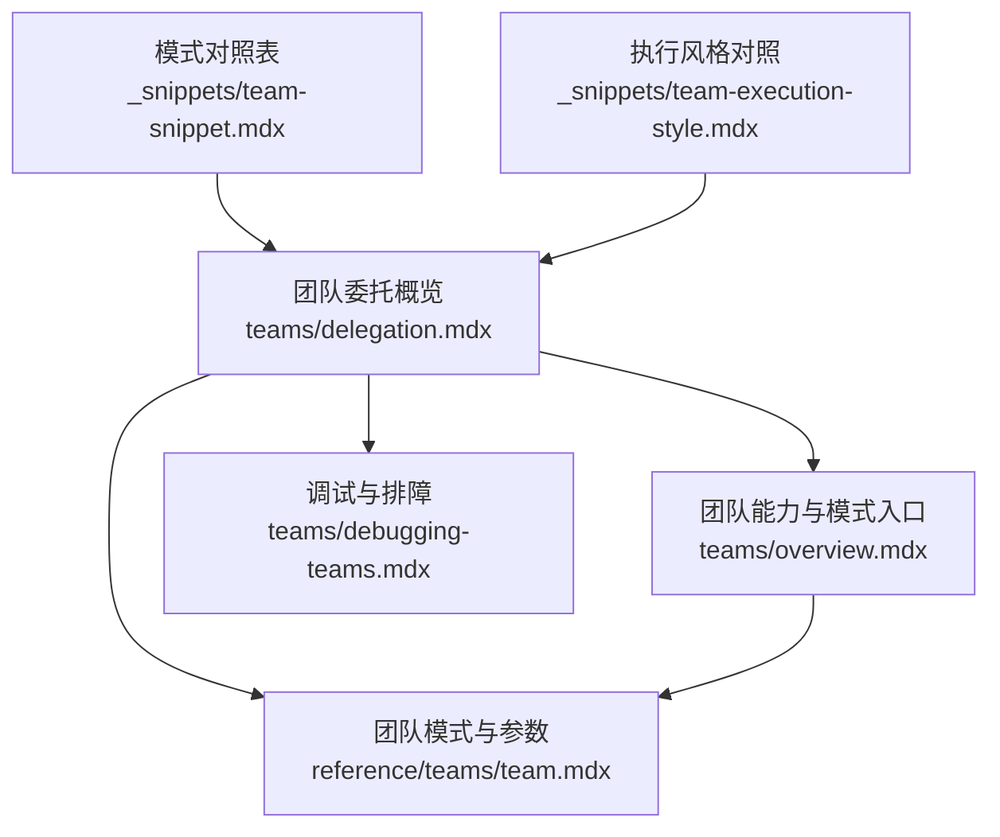
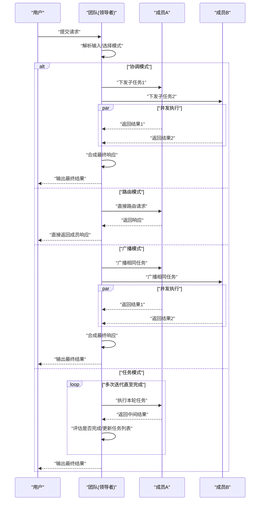
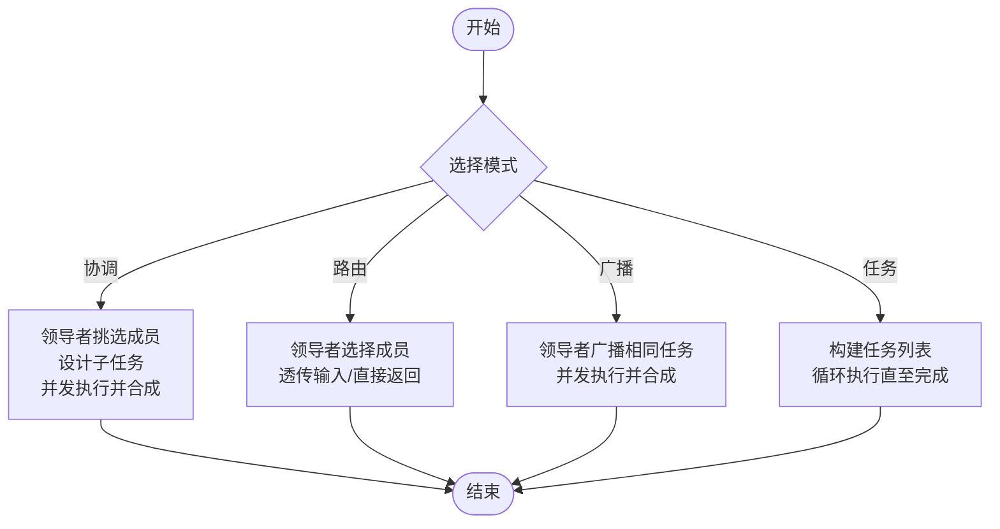
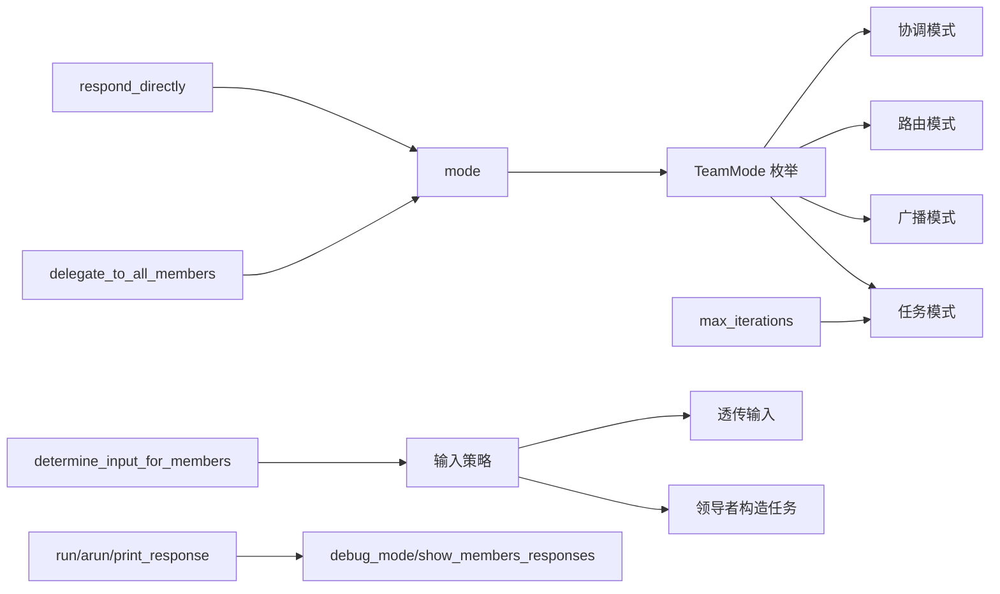

# 委托机制

<cite>
**本文引用的文件**
- [teams/delegation.mdx](file://teams/delegation.mdx)
- [teams/overview.mdx](file://teams/overview.mdx)
- [reference/teams/team.mdx](file://reference/teams/team.mdx)
- [teams/debugging-teams.mdx](file://teams/debugging-teams.mdx)
- [_snippets/team-snippet.mdx](file://_snippets/team-snippet.mdx)
- [_snippets/team-execution-style.mdx](file://_snippets/team-execution-style.mdx)
</cite>

## 目录
1. [引言](#引言)
2. [项目结构](#项目结构)
3. [核心组件](#核心组件)
4. [架构总览](#架构总览)
5. [详细组件分析](#详细组件分析)
6. [依赖关系分析](#依赖关系分析)
7. [性能考量](#性能考量)
8. [故障排查指南](#故障排查指南)
9. [结论](#结论)
10. [附录](#附录)

## 引言
本文件系统性阐述团队委托机制：从任务分派、责任分工到结果合成的完整流程；覆盖直接委托、批量委托、条件委托（通过模式切换）等不同执行风格；给出配置方法（模式、输入策略、迭代上限）、实现细节（消息传递、状态同步、冲突处理）以及调试与监控建议。目标是帮助读者在复杂任务中高效、稳定地实现多智能体协作。

## 项目结构
围绕“委托”的知识分布在以下位置：
- 团队委托概览与模式说明：teams/delegation.mdx
- 团队能力与模式入口：teams/overview.mdx
- 参数与运行接口参考：reference/teams/team.mdx
- 调试与常见问题定位：teams/debugging-teams.mdx
- 模式对照与执行风格摘要：_snippets/team-snippet.mdx、_snippets/team-execution-style.mdx

**图表来源**
- [teams/delegation.mdx:1-300](file://teams/delegation.mdx#L1-L300)
- [teams/overview.mdx:1-135](file://teams/overview.mdx#L1-L135)
- [reference/teams/team.mdx:1-485](file://reference/teams/team.mdx#L1-L485)
- [teams/debugging-teams.mdx:1-93](file://teams/debugging-teams.mdx#L1-L93)
- [_snippets/team-snippet.mdx:1-6](file://_snippets/team-snippet.mdx#L1-L6)
- [_snippets/team-execution-style.mdx:1-6](file://_snippets/team-execution-style.mdx#L1-L6)

**章节来源**
- [teams/delegation.mdx:1-300](file://teams/delegation.mdx#L1-L300)
- [teams/overview.mdx:1-135](file://teams/overview.mdx#L1-L135)
- [reference/teams/team.mdx:1-485](file://reference/teams/team.mdx#L1-L485)
- [teams/debugging-teams.mdx:1-93](file://teams/debugging-teams.mdx#L1-L93)
- [_snippets/team-snippet.mdx:1-6](file://_snippets/team-snippet.mdx#L1-L6)
- [_snippets/team-execution-style.mdx:1-6](file://_snippets/team-execution-style.mdx#L1-L6)

## 核心组件
- 领导者（Leader）
  - 接收用户输入，决定响应方式：直接返回、使用工具或委托给成员。
  - 在协调模式下负责任务分解、向成员下发任务、并发执行与最终合成。
- 成员（Members）
  - 执行具体子任务，返回结果；支持并发执行以提升吞吐。
- 模式（Mode）
  - 明确协作拓扑：协调（Coordinate）、路由（Route）、广播（Broadcast）、任务循环（Tasks）。
  - 通过 TeamMode 枚举显式配置，替代历史标志位（如 respond_directly、delegate_to_all_members）。
- 输入策略
  - determine_input_for_members 控制是否由领导者构造任务再下发，或直接透传原始输入。
- 迭代控制
  - Tasks 模式下通过 max_iterations 限制循环次数，避免无限迭代。

**章节来源**
- [teams/delegation.mdx:7-31](file://teams/delegation.mdx#L7-L31)
- [teams/overview.mdx:79-98](file://teams/overview.mdx#L79-L98)
- [reference/teams/team.mdx:16-20](file://reference/teams/team.mdx#L16-L20)

## 架构总览
委托机制的高层交互如下：用户请求进入团队后，领导者根据模式与输入策略进行决策，随后并发调度成员执行，并在需要时进行结果合成。

**图表来源**
- [teams/delegation.mdx:21-26](file://teams/delegation.mdx#L21-L26)
- [teams/delegation.mdx:45-75](file://teams/delegation.mdx#L45-L75)
- [teams/delegation.mdx:76-117](file://teams/delegation.mdx#L76-L117)
- [teams/delegation.mdx:160-206](file://teams/delegation.mdx#L160-L206)
- [teams/delegation.mdx:211-234](file://teams/delegation.mdx#L211-L234)

## 详细组件分析

### 模式与适用场景
- 协调（Coordinate，默认）
  - 特点：领导者挑选成员、设计任务、合成结果。
  - 适用：需要任务拆解、质量把关、上下文增强的综合场景。
- 路由（Route）
  - 特点：领导者选择单一成员并直接返回其响应；可关闭任务构造以透传输入。
  - 适用：专业化路由、低延迟、不希望领导者二次加工。
- 广播（Broadcast）
  - 特点：同时向所有成员下发同一任务，适合并行获取多视角。
  - 适用：并行研究、多源交叉验证。
- 任务（Tasks）
  - 特点：领导者将目标分解为任务列表，循环执行直到完成或达到最大迭代。
  - 适用：多步骤目标、有依赖关系的复杂流程。

**图表来源**
- [teams/delegation.mdx:34-41](file://teams/delegation.mdx#L34-L41)
- [teams/delegation.mdx:45-75](file://teams/delegation.mdx#L45-L75)
- [teams/delegation.mdx:76-117](file://teams/delegation.mdx#L76-L117)
- [teams/delegation.mdx:160-206](file://teams/delegation.mdx#L160-L206)
- [teams/delegation.mdx:211-234](file://teams/delegation.mdx#L211-L234)

**章节来源**
- [teams/delegation.mdx:34-41](file://teams/delegation.mdx#L34-L41)
- [teams/delegation.mdx:45-75](file://teams/delegation.mdx#L45-L75)
- [teams/delegation.mdx:76-117](file://teams/delegation.mdx#L76-L117)
- [teams/delegation.mdx:160-206](file://teams/delegation.mdx#L160-L206)
- [teams/delegation.mdx:211-234](file://teams/delegation.mdx#L211-L234)
- [_snippets/team-snippet.mdx:1-6](file://_snippets/team-snippet.mdx#L1-L6)
- [_snippets/team-execution-style.mdx:1-6](file://_snippets/team-execution-style.mdx#L1-L6)

### 配置方法：规则、优先级与超时
- 模式配置
  - 使用 TeamMode 显式指定协调、路由、广播或任务模式；mode 会覆盖历史标志位。
- 输入策略
  - determine_input_for_members=False 可透传用户输入给成员，结合结构化输入（如 Pydantic 模型）提升一致性。
- 迭代上限
  - Tasks 模式下通过 max_iterations 控制循环次数，防止无限迭代。
- 兼容性与回退
  - respond_directly=True 等价于路由模式；delegate_to_all_members=True 等价于广播模式；但 mode 设置优先。

**章节来源**
- [teams/overview.mdx:83-98](file://teams/overview.mdx#L83-L98)
- [teams/delegation.mdx:118-158](file://teams/delegation.mdx#L118-L158)
- [teams/delegation.mdx:235-265](file://teams/delegation.mdx#L235-L265)
- [reference/teams/team.mdx:16-20](file://reference/teams/team.mdx#L16-L20)

### 实现细节：消息传递、状态同步与冲突解决
- 消息传递
  - 协调模式下，领导者基于输入与角色选择成员并构造任务；路由/广播模式下可透传原始输入。
  - 支持将历史消息、依赖、会话状态注入上下文，便于成员理解背景。
- 状态同步
  - 会话状态可通过 session_state 与数据库持久化；可启用动态更新与缓存。
  - 支持将团队历史与成员交互共享至成员，确保上下文一致。
- 冲突解决
  - 多成员并发返回时，领导者进行合成；若部分成员失败，协调模式可利用可用结果继续推进。
  - 任务模式下跟踪失败/阻塞任务，允许重试或重新分配。

**章节来源**
- [teams/delegation.mdx:21-26](file://teams/delegation.mdx#L21-L26)
- [teams/delegation.mdx:287-294](file://teams/delegation.mdx#L287-L294)
- [reference/teams/team.mdx:23-28](file://reference/teams/team.mdx#L23-L28)
- [reference/teams/team.mdx:55-56](file://reference/teams/team.mdx#L55-L56)

### 使用示例：复杂任务中的有效分派
- 协调模式示例：将复杂主题分解为新闻与金融两个子任务，分别由专业成员执行并由领导者合成报告。
- 路由模式示例：根据语言自动路由到对应语言成员，保持低延迟与无二次加工。
- 广播模式示例：同时向多个研究者下发同一主题，聚合多源视角形成综合报告。
- 任务模式示例：将目标分解为若干任务，循环执行直至完成，适用于多步骤流程。

**章节来源**
- [teams/delegation.mdx:49-69](file://teams/delegation.mdx#L49-L69)
- [teams/delegation.mdx:92-111](file://teams/delegation.mdx#L92-L111)
- [teams/delegation.mdx:176-200](file://teams/delegation.mdx#L176-L200)
- [teams/delegation.mdx:215-233](file://teams/delegation.mdx#L215-L233)

## 依赖关系分析
- 模式与参数耦合
  - mode 作为统一入口，覆盖 respond_directly、delegate_to_all_members 的历史行为。
  - determine_input_for_members 与 mode 组合，决定输入是否透传。
- 运行接口与调试
  - run/arun/print_response/aprint_response 提供同步/异步/打印等运行方式。
  - debug_mode/show_members_responses 等参数用于观测与排障。

**图表来源**
- [teams/overview.mdx:83-98](file://teams/overview.mdx#L83-L98)
- [reference/teams/team.mdx:16-20](file://reference/teams/team.mdx#L16-L20)
- [teams/debugging-teams.mdx:9-29](file://teams/debugging-teams.mdx#L9-L29)

**章节来源**
- [teams/overview.mdx:83-98](file://teams/overview.mdx#L83-L98)
- [reference/teams/team.mdx:16-20](file://reference/teams/team.mdx#L16-L20)
- [teams/debugging-teams.mdx:9-29](file://teams/debugging-teams.mdx#L9-L29)

## 性能考量
- 令牌成本
  - 协调与任务模式：因分解与合成存在较高开销；路由模式成本最低；广播模式在合成阶段增加中等开销。
- 延迟特性
  - 协调模式：顺序执行（思考→成员执行→合成），整体延迟较高。
  - 路由模式：仅领导者选择与成员执行，延迟最低。
  - 广播模式（异步）：成员并发执行，但合成仍带来额外延迟。
  - 任务模式：迭代式执行，受 max_iterations 影响。
- 错误处理
  - 协调：可利用其他成员结果继续推进。
  - 路由：失败直接返回。
  - 广播：合成可用结果并标注缺失数据。
  - 任务：跟踪失败/阻塞任务，支持重试或重新分配。

**章节来源**
- [teams/delegation.mdx:269-294](file://teams/delegation.mdx#L269-L294)

## 故障排查指南
- 启用调试
  - 在团队级别或单次运行开启 debug_mode；也可通过环境变量全局启用。
  - 使用 show_members_responses 观察各成员返回，定位静默失败。
- 常见问题
  - 成员未响应：检查成员工具调用与错误日志。
  - 选择不当：确保成员角色明确且互斥，必要时补充团队指令。
  - 无限委托循环：确认任务模式下的完成条件与 max_iterations 设置。
- 监控要点
  - 关注令牌用量、执行序列与合成阶段的耗时，识别瓶颈。

**章节来源**
- [teams/debugging-teams.mdx:9-93](file://teams/debugging-teams.mdx#L9-L93)

## 结论
委托机制通过“模式+输入策略+迭代控制”实现灵活的任务分派与结果合成。协调模式适合复杂任务的高质量合成；路由模式强调低延迟与专业化；广播模式提供多视角并行；任务模式支持多步骤目标的自治闭环。配合调试与监控，可在复杂任务中实现高效、稳定与可观测的多智能体协作。

## 附录
- 参考资料
  - 团队委托与模式：teams/delegation.mdx
  - 团队能力与模式入口：teams/overview.mdx
  - 参数与运行接口：reference/teams/team.mdx
  - 调试与排障：teams/debugging-teams.mdx
  - 模式对照与执行风格：_snippets/team-snippet.mdx、_snippets/team-execution-style.mdx