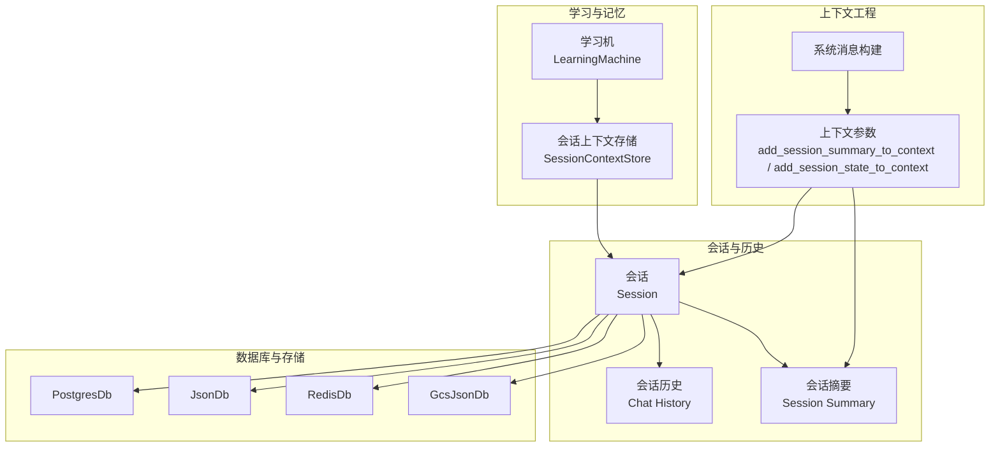
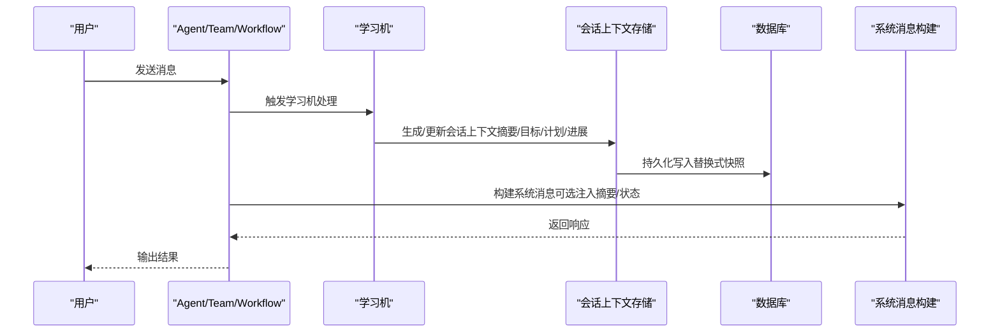
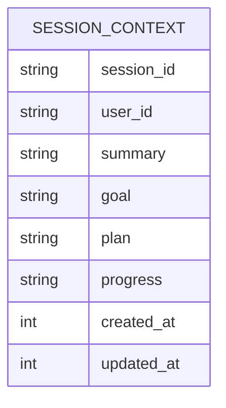
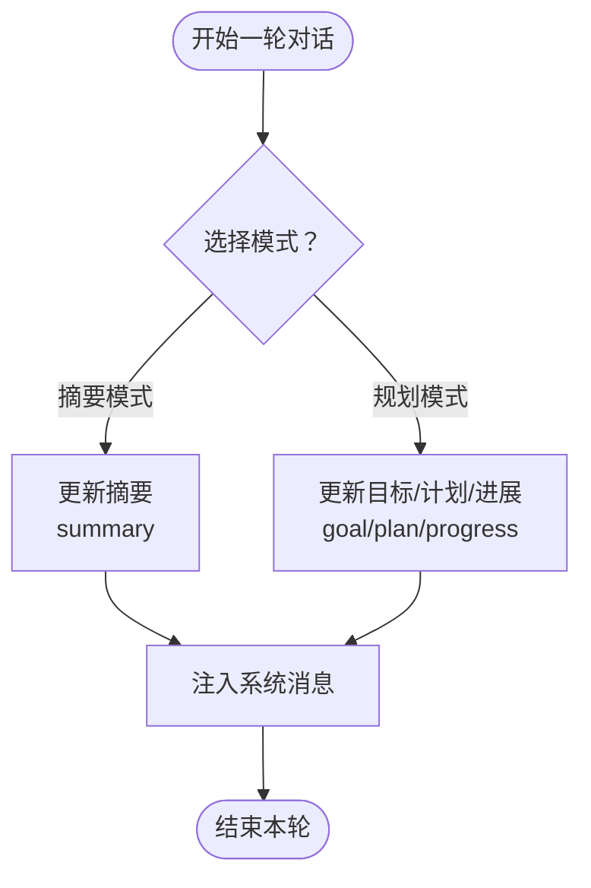
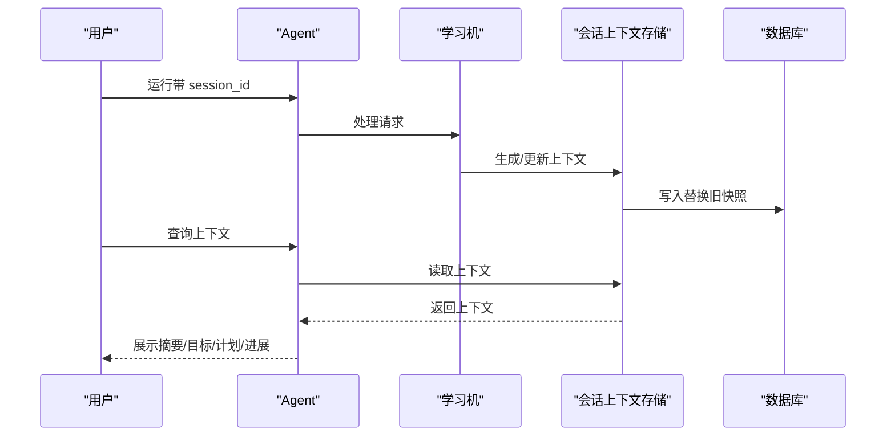
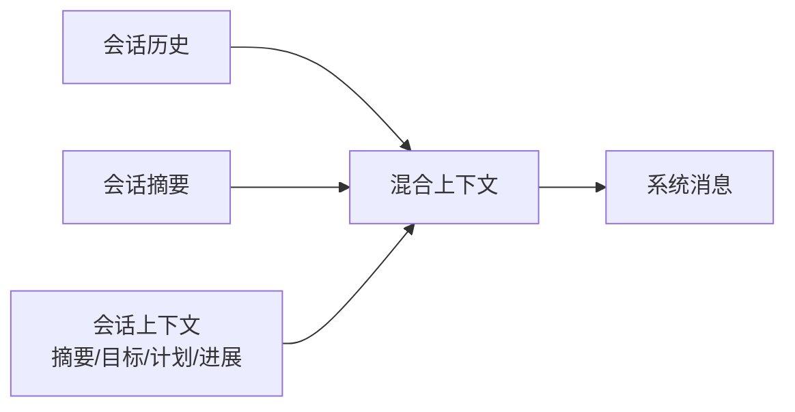
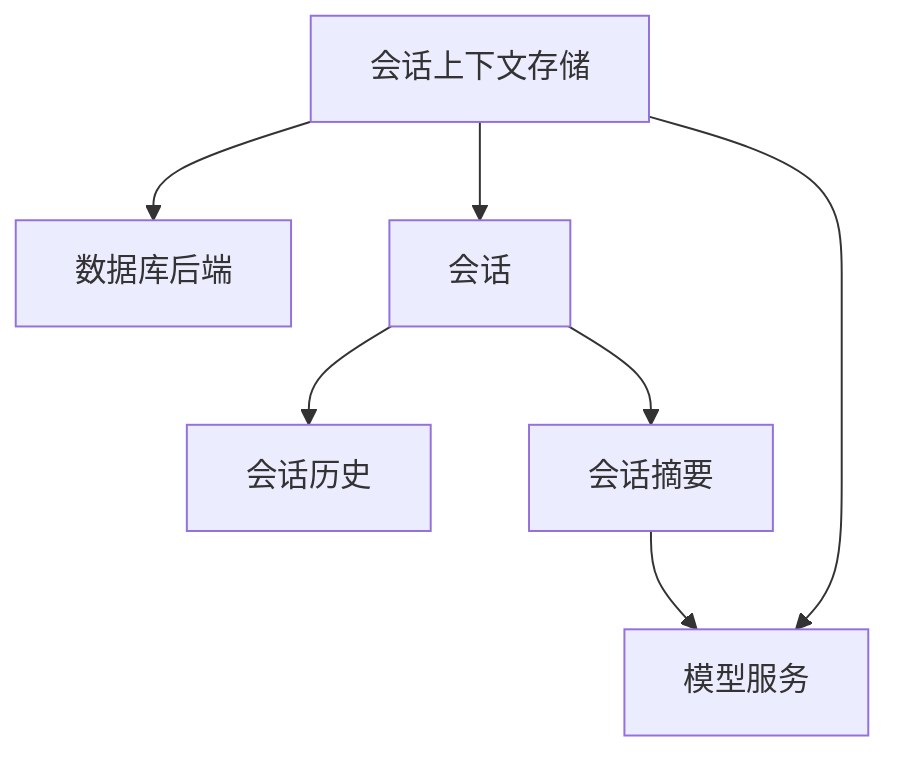

# 会话上下文存储

<cite>
**本文引用的文件**
- [会话上下文.md](file://learning/stores/session-context.mdx)
- [学习模式与默认行为.md](file://learning/learning-modes.mdx)
- [会话总览.md](file://sessions/overview.mdx)
- [会话存储.md](file://database/session-storage.mdx)
- [上下文工程.md](file://context/agent/overview.mdx)
- [会话摘要.md](file://sessions/session-summaries.mdx)
- [学习总览.md](file://cookbook/learning/overview.mdx)
- [Postgres 数据库参考.md](file://reference/storage/postgres.mdx)
- [JSON 文件数据库参考.md](file://reference/storage/json.mdx)
- [Redis 数据库参考.md](file://reference/storage/redis.mdx)
- [GCS JSON 数据库参考.md](file://reference/storage/gcs.mdx)
- [会话上下文：摘要模式.md](file://examples/learning/session-context/summary-mode.mdx)
- [会话上下文：规划模式.md](file://examples/learning/session-context/planning-mode.mdx)
- [会话管理示例.md](file://examples/agent-os/client/session-management.mdx)
- [AgentOS 安全与隐私.md](file://TBD/pages/get-started/agent-engineering.mdx)
</cite>

## 目录
1. [引言](#引言)
2. [项目结构](#项目结构)
3. [核心组件](#核心组件)
4. [架构总览](#架构总览)
5. [详细组件分析](#详细组件分析)
6. [依赖关系分析](#依赖关系分析)
7. [性能考量](#性能考量)
8. [故障排查指南](#故障排查指南)
9. [结论](#结论)
10. [附录](#附录)

## 引言
本技术文档围绕“会话上下文存储”展开，系统阐述其设计理念、实现原理与使用方式，重点覆盖以下方面：
- 会话上下文的目标与范围：记录当前对话状态、目标、计划与进展，区别于其他持续累积型存储。
- 两种工作模式：摘要模式（Summary Mode）与规划模式（Planning Mode），分别适用于不同任务场景。
- 数据模型与存储格式：字段定义、注入到系统提示的方式以及与其他上下文模块的协同。
- 生命周期管理：创建、更新、查询与清理的流程与最佳实践。
- 配置与扩展：如何通过学习机配置启用、如何结合其他存储与上下文模块，以及策略扩展方法。
- 性能优化与数据隐私安全：降低上下文开销、控制持久化范围、保障数据主权与访问控制。

## 项目结构
与会话上下文存储直接相关的文档分布在如下主题区域：
- 学习与记忆：会话上下文作为“学习机”的一个存储模块，负责短期会话状态。
- 会话与历史：会话是多轮交互的线程化容器，会话上下文与会话历史、会话摘要共同构成上下文工程的一部分。
- 数据库与存储：会话与上下文均依赖数据库持久化，支持多种后端（PostgreSQL、JSON 文件、Redis、GCS 等）。
- 上下文工程：系统消息构建时可选择性注入会话摘要与会话状态，以控制令牌消耗与上下文质量。

图表来源
- [学习总览.md](file://cookbook/learning/overview.mdx)
- [会话存储.md](file://database/session-storage.mdx)
- [上下文工程.md](file://context/agent/overview.mdx)

章节来源
- [会话上下文.md](file://learning/stores/session-context.mdx)
- [会话存储.md](file://database/session-storage.mdx)
- [上下文工程.md](file://context/agent/overview.mdx)

## 核心组件
- 会话上下文存储（SessionContextStore）
  - 职责：维护每个会话的“当前状态”，包括摘要、目标、计划与进展；每次更新替换旧快照。
  - 默认模式：Always（每轮自动提取）。
  - 支持模式：Always。
- 会话（Session）
  - 职责：承载多轮交互（runs）、历史、状态与指标；通过 session_id 绑定。
  - 依赖数据库持久化，支持自定义表名与多用户隔离。
- 会话摘要（Session Summary）
  - 职责：对长对话进行自动压缩，减少令牌成本并维持连续性；可注入到系统消息中。
- 数据库与存储后端
  - 支持 PostgreSQL、JSON 文件、Redis、GCS 等，满足不同部署与性能需求。

章节来源
- [会话上下文.md](file://learning/stores/session-context.mdx)
- [会话存储.md](file://database/session-storage.mdx)
- [会话摘要.md](file://sessions/session-summaries.mdx)
- [Postgres 数据库参考.md](file://reference/storage/postgres.mdx)
- [JSON 文件数据库参考.md](file://reference/storage/json.mdx)
- [Redis 数据库参考.md](file://reference/storage/redis.mdx)
- [GCS JSON 数据库参考.md](file://reference/storage/gcs.mdx)

## 架构总览
会话上下文在系统中的位置与交互如下：

图表来源
- [会话上下文.md](file://learning/stores/session-context.mdx)
- [会话存储.md](file://database/session-storage.mdx)
- [上下文工程.md](file://context/agent/overview.mdx)

## 详细组件分析

### 会话上下文数据模型与注入
- 字段定义
  - session_id：会话唯一标识
  - user_id：所属用户
  - summary：已讨论内容的摘要
  - goal：目标（规划模式）
  - plan：步骤清单（规划模式）
  - progress：已完成步骤（规划模式）
  - created_at / updated_at：创建与更新时间
- 注入方式
  - 会话上下文以特定标签形式注入到系统消息，便于模型感知当前状态与目标。

图表来源
- [会话上下文.md](file://learning/stores/session-context.mdx)

章节来源
- [会话上下文.md](file://learning/stores/session-context.mdx)

### 两种工作模式：摘要模式与规划模式
- 摘要模式（Summary Mode）
  - 适用：无需跟踪目标与步骤的任务，关注“正在讨论什么、已达成什么、还有哪些问题”。
  - 行为：仅维护 summary 字段，随每轮对话滚动更新。
- 规划模式（Planning Mode）
  - 适用：任务导向型会话，需要明确目标、分解步骤并追踪完成度。
  - 行为：同时维护 goal、plan、progress 字段，逐步推进任务闭环。

图表来源
- [会话上下文：摘要模式.md](file://examples/learning/session-context/summary-mode.mdx)
- [会话上下文：规划模式.md](file://examples/learning/session-context/planning-mode.mdx)

章节来源
- [会话上下文：摘要模式.md](file://examples/learning/session-context/summary-mode.mdx)
- [会话上下文：规划模式.md](file://examples/learning/session-context/planning-mode.mdx)

### 生命周期管理：创建、更新、查询与清理
- 创建
  - 通过调用 Agent/Team/Workflow 的运行接口并传入 session_id 即可创建会话；若启用数据库，会话元数据与上下文将被持久化。
- 更新
  - 每次对话后，学习机会根据当前模式更新会话上下文（替换式快照），随后写入数据库。
- 查询
  - 可通过学习机提供的会话上下文存储接口按 session_id 获取当前上下文；也可打印调试输出查看。
- 清理
  - 会话可通过客户端或 API 删除；会话摘要与历史同样支持删除与重置。

图表来源
- [会话上下文.md](file://learning/stores/session-context.mdx)
- [会话存储.md](file://database/session-storage.mdx)
- [会话管理示例.md](file://examples/agent-os/client/session-management.mdx)

章节来源
- [会话上下文.md](file://learning/stores/session-context.mdx)
- [会话存储.md](file://database/session-storage.mdx)
- [会话管理示例.md](file://examples/agent-os/client/session-management.mdx)

### 与会话摘要、会话历史的协同
- 会话摘要（Session Summary）
  - 自动压缩长对话，显著降低令牌成本；可在系统消息中注入摘要，替代完整历史。
- 会话历史（Chat History）
  - 可按需加载最近若干轮对话，配合摘要形成“高层摘要 + 最近细节”的混合上下文。
- 会话状态（Session State）
  - 与会话上下文互补，用于保存临时状态或中间结果。

图表来源
- [会话摘要.md](file://sessions/session-summaries.mdx)
- [上下文工程.md](file://context/agent/overview.mdx)

章节来源
- [会话摘要.md](file://sessions/session-summaries.mdx)
- [上下文工程.md](file://context/agent/overview.mdx)

### 配置与最佳实践
- 启用方式
  - 在学习机中开启 session_context；可选择启用规划模式以跟踪目标与进展。
- 模式选择
  - 默认 Always；对于需要任务闭环的场景优先选择规划模式。
- 与用户档案等其他存储协同
  - 将长期用户知识与短期会话状态结合，形成“长期记忆 + 短期上下文”的组合。
- 数据库选择
  - 生产环境推荐 PostgreSQL；开发/测试可用 JSON 文件或内存数据库；分布式场景可选 Redis 或 GCS JSON。

章节来源
- [会话上下文.md](file://learning/stores/session-context.mdx)
- [学习模式与默认行为.md](file://learning/learning-modes.mdx)
- [学习总览.md](file://cookbook/learning/overview.mdx)
- [Postgres 数据库参考.md](file://reference/storage/postgres.mdx)
- [JSON 文件数据库参考.md](file://reference/storage/json.mdx)
- [Redis 数据库参考.md](file://reference/storage/redis.mdx)
- [GCS JSON 数据库参考.md](file://reference/storage/gcs.mdx)

### 扩展与策略实现指南
- 自定义存储后端
  - 通过实现统一的数据库接口，可接入新的存储后端（如对象存储、时序库等）。
- 上下文注入策略
  - 控制是否注入摘要与状态，以及注入的历史轮数，平衡上下文质量与令牌成本。
- 会话生命周期策略
  - 对长时间无活动的会话进行归档或清理；对关键会话设置保留策略。

章节来源
- [会话存储.md](file://database/session-storage.mdx)
- [上下文工程.md](file://context/agent/overview.mdx)

## 依赖关系分析
- 组件耦合
  - 会话上下文存储依赖数据库后端进行持久化；与会话历史、会话摘要存在数据与逻辑上的协作关系。
- 外部依赖
  - 数据库驱动与连接池；模型提供商的令牌缓存能力；会话摘要生成器（可选轻量模型）。
- 风险点
  - 历史轮数过多导致上下文膨胀；摘要生成成本过高；会话上下文未及时清理造成存储压力。

图表来源
- [会话存储.md](file://database/session-storage.mdx)
- [会话摘要.md](file://sessions/session-summaries.mdx)

章节来源
- [会话存储.md](file://database/session-storage.mdx)
- [会话摘要.md](file://sessions/session-summaries.mdx)

## 性能考量
- 令牌成本控制
  - 使用会话摘要替代完整历史；限制注入的历史轮数；必要时采用更便宜的摘要模型。
- 存储与查询优化
  - 选择合适的数据库后端（PostgreSQL 适合生产，JSON/Redis 适合开发与小规模）；合理设计索引与分区。
- 并发与一致性
  - 在高并发场景下确保上下文写入的原子性与一致性；必要时引入队列或幂等写入策略。

## 故障排查指南
- 会话上下文为空
  - 检查是否正确传入 session_id；确认数据库已启用且连接正常；验证学习机是否启用会话上下文。
- 摘要未生效
  - 确认已启用会话摘要生成；检查是否将摘要注入到系统消息（参数开关）。
- 令牌超限
  - 减少注入的历史轮数；提高摘要频率；缩短摘要长度。
- 数据库异常
  - 检查连接字符串、权限与网络；核对表结构与版本；必要时迁移或重建表。

章节来源
- [会话上下文.md](file://learning/stores/session-context.mdx)
- [会话摘要.md](file://sessions/session-summaries.mdx)
- [会话存储.md](file://database/session-storage.mdx)

## 结论
会话上下文存储通过“摘要模式”与“规划模式”两种工作方式，在保证上下文连续性的同时兼顾性能与成本。结合会话摘要与会话历史，可形成高效、可控的上下文工程体系；通过合理的数据库选择与清理策略，可在生产环境中实现稳定、可扩展的会话状态管理。

## 附录
- 关键术语
  - 会话（Session）：一次或多轮交互的线程化容器，由 session_id 标识。
  - 会话上下文（Session Context）：当前会话的状态快照，包含摘要、目标、计划与进展。
  - 会话摘要（Session Summary）：对长对话的压缩总结，用于降低令牌成本。
  - 学习机（LearningMachine）：统一的学习与记忆协调器，包含多个存储模块（用户档案、会话上下文、实体记忆、学习知识等）。
- 推荐阅读
  - 会话总览与会话管理：了解会话的概念、生命周期与管理方式。
  - 上下文工程：掌握系统消息构建与上下文注入策略。
  - 数据库与存储：选择合适的数据库后端并进行配置。

章节来源
- [会话总览.md](file://sessions/overview.mdx)
- [上下文工程.md](file://context/agent/overview.mdx)
- [会话摘要.md](file://sessions/session-summaries.mdx)
- [Postgres 数据库参考.md](file://reference/storage/postgres.mdx)
- [JSON 文件数据库参考.md](file://reference/storage/json.mdx)
- [Redis 数据库参考.md](file://reference/storage/redis.mdx)
- [GCS JSON 数据库参考.md](file://reference/storage/gcs.mdx)