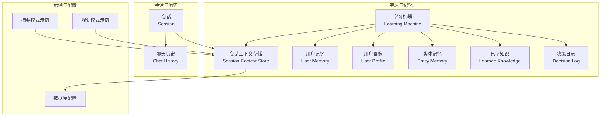
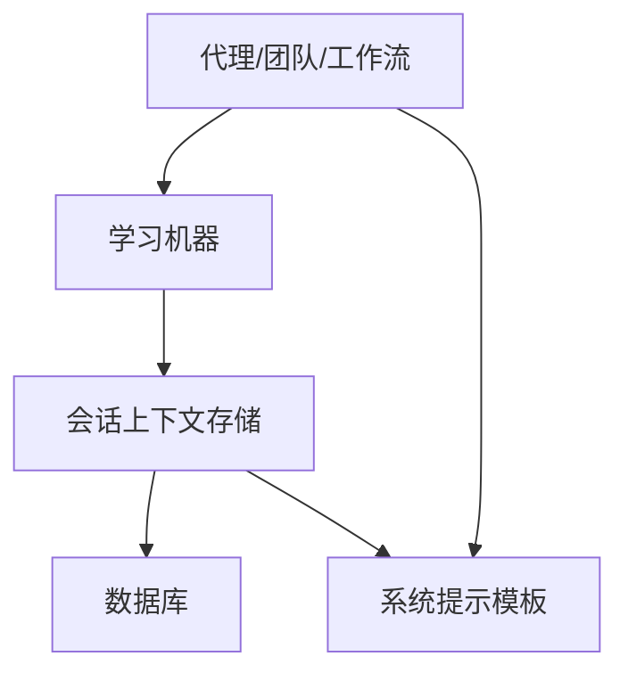
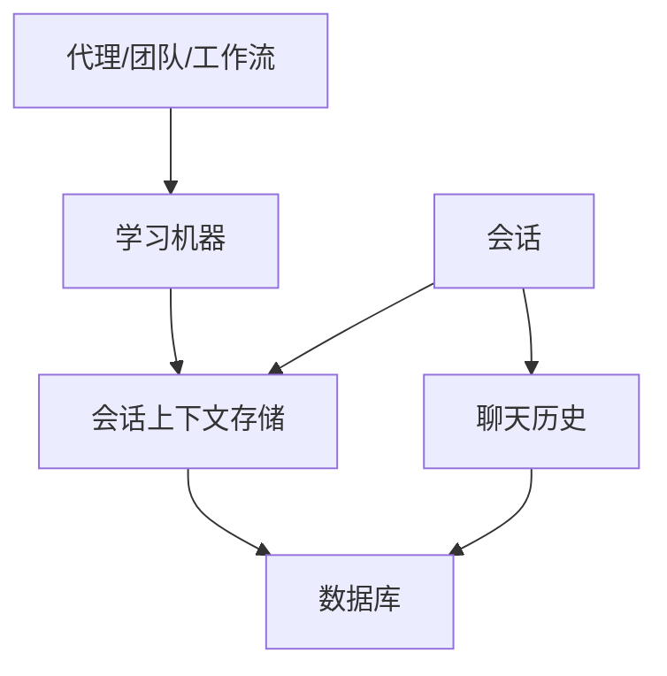

# 会话上下文概述

<cite>
**本文引用的文件**
- [会话上下文](file://learning/stores/session-context.mdx)
- [规划模式示例](file://examples/learning/session-context/planning-mode.mdx)
- [摘要模式示例](file://examples/learning/session-context/summary-mode.mdx)
- [会话总览](file://sessions/overview.mdx)
- [会话管理](file://sessions/session-management.mdx)
- [聊天历史总览](file://history/overview.mdx)
- [记忆总览](file://memory/overview.mdx)
- [学习存储总览](file://learning/stores/intro.mdx)
- [学习总览](file://cookbook/learning/overview.mdx)
</cite>

## 目录
1. [引言](#引言)
2. [项目结构](#项目结构)
3. [核心组件](#核心组件)
4. [架构总览](#架构总览)
5. [详细组件分析](#详细组件分析)
6. [依赖关系分析](#依赖关系分析)
7. [性能考量](#性能考量)
8. [故障排查指南](#故障排查指南)
9. [结论](#结论)
10. [附录](#附录)

## 引言
本篇“会话上下文概述”聚焦于智能代理系统中“会话上下文存储”的核心概念、设计动机与实践方法。会话上下文存储用于捕获一次会话内的即时状态：已讨论的内容、当前目标、执行计划以及完成进度。它不同于“用户记忆”“实体记忆”等长期存储，也不等同于“聊天历史”。它强调“当前会话”的快照式状态，并在每次更新时替换旧值；同时，它会自动注入到系统提示中，帮助模型在多轮对话、长会话恢复、复杂任务推进与交接场景中保持连贯性与可追踪性。

## 项目结构
围绕会话上下文，知识库提供了从基础概念、数据模型、配置开关到典型用法与最佳实践的完整路径：
- 学习与记忆体系：会话上下文属于“学习存储”的一部分，与用户画像、用户记忆、实体记忆、团队经验、决策日志共同构成学习机器的五大存储域。
- 会话与历史：会话是多轮交互的线程化容器；聊天历史负责消息级连续性；会话上下文负责“目标—计划—进度—摘要”的高层连续性。
- 示例与配置：通过摘要模式与规划模式两个示例，展示如何启用与使用会话上下文，以及如何将其与数据库持久化结合。

图示来源
- [学习存储总览:10-18](file://learning/stores/intro.mdx#L10-L18)
- [会话总览:12-28](file://sessions/overview.mdx#L12-L28)
- [聊天历史总览:10-19](file://history/overview.mdx#L10-L19)
- [会话上下文:1-16](file://learning/stores/session-context.mdx#L1-L16)

章节来源
- [学习存储总览:1-19](file://learning/stores/intro.mdx#L1-L19)
- [会话总览:1-87](file://sessions/overview.mdx#L1-L87)
- [聊天历史总览:1-49](file://history/overview.mdx#L1-L49)

## 核心组件
- 会话上下文存储（Session Context Store）
  - 职责：记录当前会话的“摘要、目标、计划、进度”，并在每次更新时替换旧值。
  - 生命周期：随会话存在，会话结束即失效；下一次会话开始时重新建立。
  - 注入机制：自动注入到系统提示中，供模型在推理时使用。
- 会话（Session）
  - 定义：由唯一 session_id 标识的多轮对话线程，包含多次运行（run）与状态。
  - 持久化：需要数据库支持；可按用户隔离，支持命名与缓存优化。
- 聊天历史（Chat History）
  - 定义：消息级的历史记录，用于维持对话连续性。
  - 区别：会话上下文关注“高层意图与进展”，历史关注“具体消息流”。

章节来源
- [会话上下文:8-16](file://learning/stores/session-context.mdx#L8-L16)
- [会话总览:12-28](file://sessions/overview.mdx#L12-L28)
- [聊天历史总览:10-19](file://history/overview.mdx#L10-L19)

## 架构总览
会话上下文在智能代理系统中的位置如下：

图示来源
- [会话上下文:119-137](file://learning/stores/session-context.mdx#L119-L137)
- [学习存储总览:10-18](file://learning/stores/intro.mdx#L10-L18)

## 详细组件分析

### 会话上下文数据模型与字段
- 字段概览
  - session_id：会话标识符
  - user_id：所属用户
  - summary：已讨论内容的摘要
  - goal：用户目标（规划模式）
  - plan：达成目标的步骤（规划模式）
  - progress：已完成步骤（规划模式）
  - created_at / updated_at：创建与更新时间戳
- 作用说明
  - 摘要：在消息被截断或会话恢复时，帮助模型快速回到上下文。
  - 目标/计划/进度：在复杂多步任务中，确保任务导向的可追踪性与可回溯性。

章节来源
- [会话上下文:92-104](file://learning/stores/session-context.mdx#L92-L104)

### 基本用法与配置
- 启用方式
  - 在学习机器中开启会话上下文：可直接传入布尔值或配置对象以启用摘要模式或规划模式。
  - 规划模式：额外跟踪 goal、plan、progress。
  - 摘要模式：仅维护摘要。
- 访问与调试
  - 通过学习机访问会话上下文存储，读取或打印指定 session_id 的上下文。
- 数据库持久化
  - 会话上下文依赖数据库进行持久化；示例展示了如何与 Postgres/SQLite 等数据库配合使用。

章节来源
- [会话上下文:17-45](file://learning/stores/session-context.mdx#L17-L45)
- [会话上下文:47-90](file://learning/stores/session-context.mdx#L47-L90)
- [会话上下文:105-117](file://learning/stores/session-context.mdx#L105-L117)

### 典型使用场景与最佳实践
- 场景
  - 消息历史被截断：长对话丢失早期上下文时，用摘要恢复。
  - 会话恢复：用户中断后再次接入，快速召回状态。
  - 复杂多步任务：在部署、开发、策划等流程中持续追踪进度。
  - 交接：另一名代理或人类接手时，能理解当前状态。
- 最佳实践
  - 将会话上下文与用户级存储（如用户画像、用户记忆）组合使用，形成“长期知识 + 短期状态”的协同。
  - 对于任务导向型应用，优先启用规划模式以获得目标、计划与进度的可视化追踪。
  - 在多用户并发场景中，结合 user_id 与 session_id 实现会话隔离与命名。

章节来源
- [会话上下文:139-164](file://learning/stores/session-context.mdx#L139-L164)
- [学习总览:32-42](file://cookbook/learning/overview.mdx#L32-L42)

### 与系统提示注入的关系与实现
- 注入方式
  - 会话上下文会被格式化并注入到系统提示中，作为模型推理的高层背景。
- 示例结构
  - 包含摘要、目标、计划与已完成进度的 XML 风格标签块，便于模型解析与引用。
- 效果
  - 在多轮对话、长会话恢复、复杂任务推进与交接时，显著提升模型对“当前状态”的理解与一致性。

章节来源
- [会话上下文:119-137](file://learning/stores/session-context.mdx#L119-L137)

### 摘要模式与规划模式对比
- 摘要模式
  - 维护会话的“运行摘要”，随每轮对话更新，适合需要持续上下文但不强调任务步骤的应用。
- 规划模式
  - 在摘要基础上增加目标、计划与进度，适合需要明确阶段性成果与可追踪性的任务型应用。
- 示例
  - 提供了摘要模式与规划模式的独立示例脚本，演示如何启用与观察上下文变化。

章节来源
- [摘要模式示例:1-115](file://examples/learning/session-context/summary-mode.mdx#L1-L115)
- [规划模式示例:1-117](file://examples/learning/session-context/planning-mode.mdx#L1-L117)

### 与聊天历史、用户记忆、实体记忆的区别
- 会话上下文
  - 关注“当前会话”的高层状态（摘要/目标/计划/进度），生命周期短，随会话更新而替换。
- 聊天历史
  - 关注“消息级连续性”，记录具体的对话内容，适合短期上下文延续。
- 用户记忆
  - 关注“用户层面的事实与偏好”，跨会话持久化，适合个性化与长期关系维护。
- 实体记忆
  - 关注“外部实体的事实与关系”，可配置范围，适合知识图谱与事实检索。

章节来源
- [会话上下文:8-16](file://learning/stores/session-context.mdx#L8-L16)
- [聊天历史总览:10-19](file://history/overview.mdx#L10-L19)
- [记忆总览:14-16](file://memory/overview.mdx#L14-L16)
- [学习存储总览:10-18](file://learning/stores/intro.mdx#L10-L18)

## 依赖关系分析
会话上下文与会话、历史、学习机器、数据库之间的依赖关系如下：

图示来源
- [会话总览:12-28](file://sessions/overview.mdx#L12-L28)
- [聊天历史总览:10-19](file://history/overview.mdx#L10-L19)
- [会话上下文:1-16](file://learning/stores/session-context.mdx#L1-L16)

章节来源
- [会话总览:1-87](file://sessions/overview.mdx#L1-L87)
- [聊天历史总览:1-49](file://history/overview.mdx#L1-L49)
- [会话上下文:1-16](file://learning/stores/session-context.mdx#L1-L16)

## 性能考量
- 会话缓存
  - 可通过会话缓存减少数据库往返，提升多轮连续对话的响应速度；适用于延迟敏感或资源密集型数据库场景。
- 适用场景
  - 支持大量连续轮次的会话（如客服、协作助理等）。
- 注意事项
  - 缓存主要用于开发与测试；生产环境需谨慎评估内存占用与一致性风险。

章节来源
- [会话管理:140-189](file://sessions/session-management.mdx#L140-L189)

## 故障排查指南
- 未看到会话上下文生效
  - 确认已启用学习机器中的会话上下文，并正确传入 session_id 与 user_id。
  - 检查数据库是否配置正确，会话上下文需要持久化支持。
- 上下文未注入系统提示
  - 确认学习机器配置为启用会话上下文；查看系统提示模板是否包含会话上下文注入逻辑。
- 会话恢复后上下文缺失
  - 确保使用相同的 session_id 与 user_id 进行后续调用；检查数据库连接与表结构。
- 与聊天历史混淆
  - 明确区分“消息级历史”与“高层上下文”：历史用于消息连续性，上下文用于高层状态与任务追踪。

章节来源
- [会话上下文:17-45](file://learning/stores/session-context.mdx#L17-L45)
- [会话管理:140-189](file://sessions/session-management.mdx#L140-L189)
- [聊天历史总览:10-19](file://history/overview.mdx#L10-L19)

## 结论
会话上下文存储为智能代理系统提供了“高层状态”的持续性与可追踪性，特别适用于长会话恢复、复杂任务推进与交接场景。通过与数据库持久化、系统提示注入、会话管理等能力协同，会话上下文能够显著提升模型在多轮对话中的连贯性与可靠性。建议在任务导向型应用中优先采用规划模式，在需要快速上下文召回的场景中采用摘要模式，并与用户记忆、实体记忆等长期存储形成互补。

## 附录
- 快速参考
  - 启用会话上下文：在学习机器中传入布尔值或配置对象。
  - 访问上下文：通过学习机的会话上下文存储读取或打印。
  - 数据库：确保数据库已配置，以便持久化会话上下文。
  - 组合使用：与用户画像、用户记忆等长期存储搭配，实现“长期知识 + 短期状态”的协同。

章节来源
- [会话上下文:17-45](file://learning/stores/session-context.mdx#L17-L45)
- [会话上下文:105-117](file://learning/stores/session-context.mdx#L105-L117)
- [学习存储总览:10-18](file://learning/stores/intro.mdx#L10-L18)