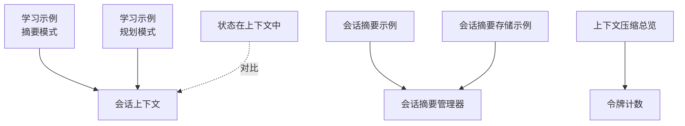
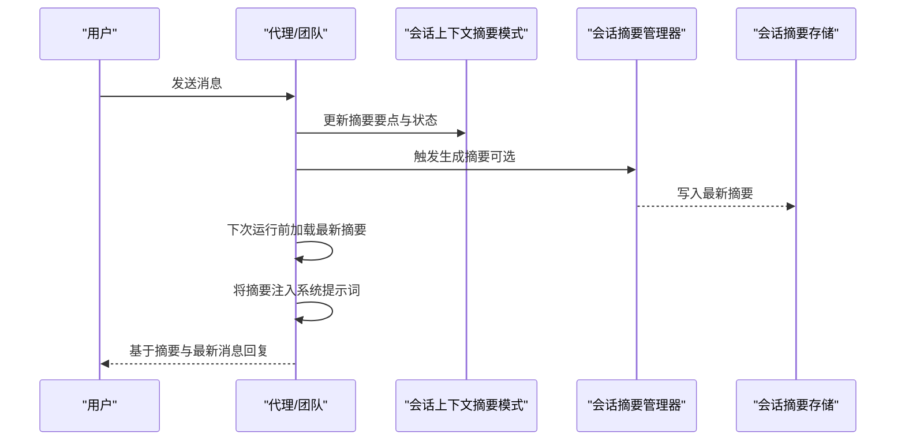
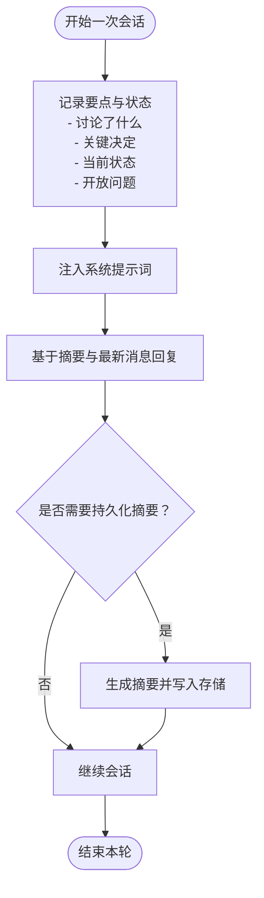
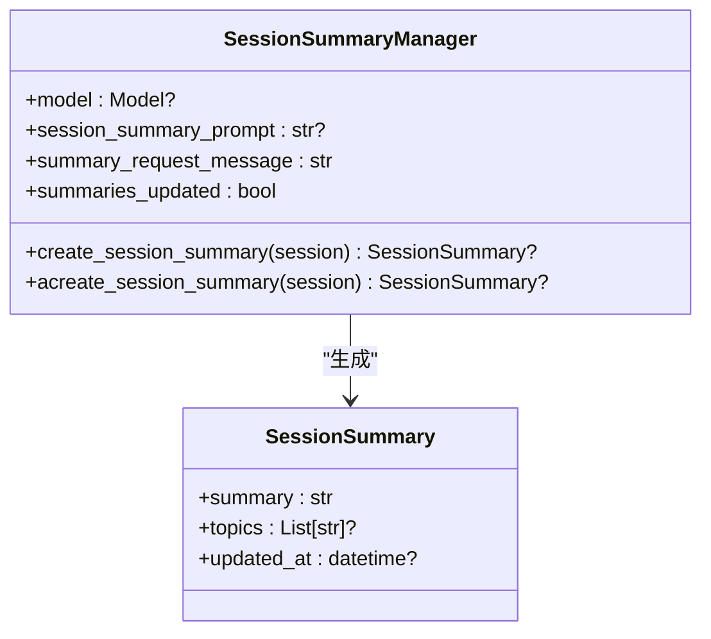
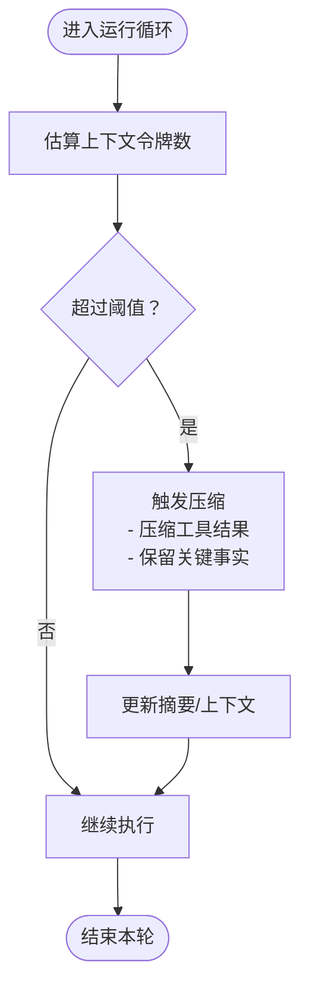
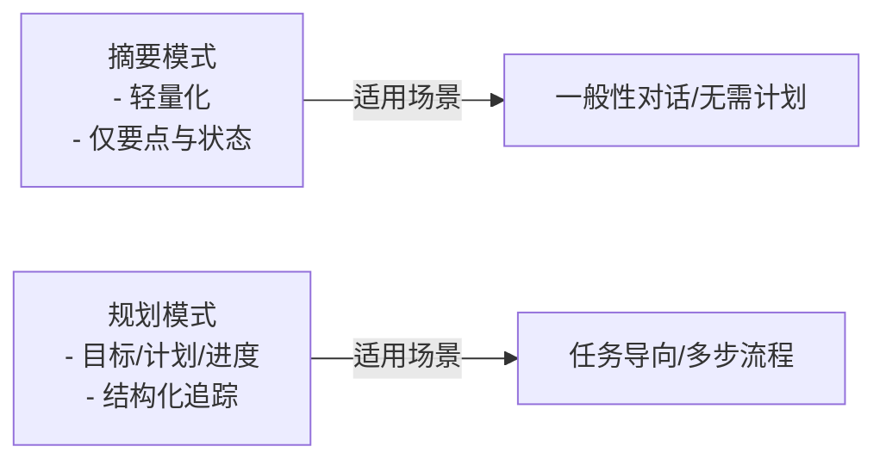
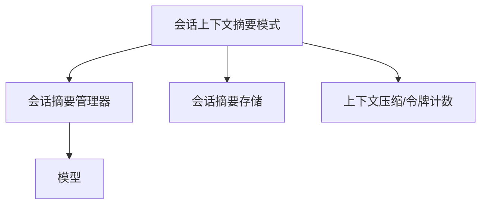

# 摘要模式

<cite>
**本文引用的文件**
- [会话上下文：摘要模式](file://examples/learning/basics/a-session-context-summary.mdx)
- [会话上下文：规划模式](file://examples/learning/basics/b-session-context-planning.mdx)
- [会话上下文](file://learning/stores/session-context.mdx)
- [会话摘要](file://examples/agents/state-and-session/session-summary.mdx)
- [会话摘要（存储）](file://examples/storage/session-summary.mdx)
- [会话摘要管理器](file://reference/session/summary_manager.mdx)
- [会话摘要使用说明](file://sessions/session-summaries.mdx)
- [上下文压缩总览](file://compression/overview.mdx)
- [令牌计数](file://compression/token-counting.mdx)
- [状态在上下文中](file://state/agent/session-state-in-context.mdx)
</cite>

## 目录
1. [简介](#简介)
2. [项目结构](#项目结构)
3. [核心组件](#核心组件)
4. [架构总览](#架构总览)
5. [详细组件分析](#详细组件分析)
6. [依赖关系分析](#依赖关系分析)
7. [性能考量](#性能考量)
8. [故障排查指南](#故障排查指南)
9. [结论](#结论)
10. [附录](#附录)

## 简介
本篇文档聚焦“会话上下文摘要模式”，系统阐述其设计理念、数据结构与字段定义、默认行为与配置方式、使用示例、与规划模式的对比与选择标准，以及在摘要模式下的内容压缩与精炼策略，并给出性能优化建议与最佳实践。摘要模式强调以“要点与状态”的轻量级摘要维持会话连续性，避免冗长的历史记录与复杂的计划追踪开销，适用于一般性对话与无需结构化目标推进的场景。

## 项目结构
围绕摘要模式的相关资料分布在以下位置：
- 示例与用法：学习示例中的“摘要模式”“规划模式”、会话摘要示例、会话摘要存储示例
- 参考与规范：会话摘要管理器参考、会话摘要使用说明
- 压缩与令牌：上下文压缩总览、令牌计数
- 其他：状态在上下文中（用于对比会话状态与会话摘要）

**图表来源**
- [会话上下文：摘要模式:1-102](file://examples/learning/basics/a-session-context-summary.mdx#L1-L102)
- [会话上下文：规划模式:1-107](file://examples/learning/basics/b-session-context-planning.mdx#L1-L107)
- [会话上下文:1-164](file://learning/stores/session-context.mdx#L1-L164)
- [会话摘要:1-70](file://examples/agents/state-and-session/session-summary.mdx#L1-L70)
- [会话摘要（存储）:1-69](file://examples/storage/session-summary.mdx#L1-L69)
- [会话摘要管理器:1-48](file://reference/session/summary_manager.mdx#L1-L48)
- [上下文压缩总览:1-216](file://compression/overview.mdx#L1-L216)
- [令牌计数:1-113](file://compression/token-counting.mdx#L1-L113)
- [状态在上下文中:1-71](file://state/agent/session-state-in-context.mdx#L1-L71)

**章节来源**
- [会话上下文：摘要模式:1-102](file://examples/learning/basics/a-session-context-summary.mdx#L1-L102)
- [会话上下文：规划模式:1-107](file://examples/learning/basics/b-session-context-planning.mdx#L1-L107)
- [会话上下文:1-164](file://learning/stores/session-context.mdx#L1-L164)
- [会话摘要:1-70](file://examples/agents/state-and-session/session-summary.mdx#L1-L70)
- [会话摘要（存储）:1-69](file://examples/storage/session-summary.mdx#L1-L69)
- [会话摘要管理器:1-48](file://reference/session/summary_manager.mdx#L1-L48)
- [上下文压缩总览:1-216](file://compression/overview.mdx#L1-L216)
- [令牌计数:1-113](file://compression/token-counting.mdx#L1-L113)
- [状态在上下文中:1-71](file://state/agent/session-state-in-context.mdx#L1-L71)

## 核心组件
- 会话上下文（摘要模式）
  - 默认行为：仅记录“讨论了什么、做了哪些关键决定、当前状态、开放问题”等要点，不引入目标与计划结构
  - 数据模型字段：session_id、user_id、summary、created_at、updated_at；在规划模式下还包含goal、plan、progress
  - 注入方式：自动注入到系统提示词中，作为当前会话状态的上下文
- 会话摘要管理器
  - 职责：基于模型生成会话摘要，支持同步/异步生成；可选自定义提示词与请求消息
  - 输出对象：包含summary、topics、updated_at
  - 配置项：model、session_summary_prompt、summary_request_message、summaries_updated
- 上下文压缩与令牌计数
  - 通过令牌计数估算上下文大小，支持按“调用次数阈值”或“令牌阈值”两种触发压缩
  - 在工具结果过大时显著降低token消耗并保持关键事实

**章节来源**
- [会话上下文:92-141](file://learning/stores/session-context.mdx#L92-L141)
- [会话摘要管理器:1-48](file://reference/session/summary_manager.mdx#L1-L48)
- [上下文压缩总览:178-216](file://compression/overview.mdx#L178-L216)
- [令牌计数:94-113](file://compression/token-counting.mdx#L94-L113)

## 架构总览
摘要模式的整体工作流如下：
- 用户发起对话，系统根据会话上下文（摘要模式）维护“要点与状态”
- 当需要持久化会话摘要时，由会话摘要管理器生成摘要并写入存储
- 在后续运行前，系统自动加载最新摘要并注入到系统提示词中，确保上下文连贯
- 若存在工具调用导致上下文膨胀，可通过上下文压缩与令牌计数进行控制

**图表来源**
- [会话上下文:119-137](file://learning/stores/session-context.mdx#L119-L137)
- [会话摘要管理器:19-38](file://reference/session/summary_manager.mdx#L19-L38)
- [会话摘要使用说明:109-147](file://sessions/session-summaries.mdx#L109-L147)

## 详细组件分析

### 组件一：会话上下文（摘要模式）
- 设计理念
  - 轻量化：仅保留“讨论要点、关键决策、当前状态、开放问题”，避免复杂计划结构
  - 连续性：通过摘要维持长对话、断点重连、多步任务的上下文一致性
- 数据模型与字段
  - 必填字段：session_id、user_id、summary、created_at、updated_at
  - 规划模式扩展字段：goal、plan、progress
- 注入机制
  - 自动注入到系统提示词中，便于模型在回复时考虑当前会话状态
- 使用场景
  - 长对话历史被截断、会话恢复、复杂多步任务、交接给他人或另一代理

**图表来源**
- [会话上下文:92-137](file://learning/stores/session-context.mdx#L92-L137)

**章节来源**
- [会话上下文:47-90](file://learning/stores/session-context.mdx#L47-L90)
- [会话上下文:92-141](file://learning/stores/session-context.mdx#L92-L141)
- [会话上下文:119-137](file://learning/stores/session-context.mdx#L119-L137)

### 组件二：会话摘要管理器
- 职责与能力
  - 同步/异步生成会话摘要
  - 支持自定义摘要提示词与摘要请求消息
  - 返回包含summary、topics、updated_at的对象
- 配置与默认
  - model：摘要生成所用模型
  - session_summary_prompt：自定义摘要提示词（未提供则使用默认）
  - summary_request_message：请求摘要的用户消息，默认为固定文本
  - summaries_updated：标记最近一次运行是否生成了摘要
- 使用方式
  - 通过enable_session_summaries或session_summary_manager启用
  - 可结合add_session_summary_to_context将摘要注入上下文

**图表来源**
- [会话摘要管理器:1-48](file://reference/session/summary_manager.mdx#L1-L48)

**章节来源**
- [会话摘要管理器:1-48](file://reference/session/summary_manager.mdx#L1-L48)
- [会话摘要（存储）:40-47](file://examples/storage/session-summary.mdx#L40-L47)
- [会话摘要使用说明:109-147](file://sessions/session-summaries.mdx#L109-L147)

### 组件三：上下文压缩与令牌计数
- 目标
  - 在工具调用结果巨大时，通过压缩减少token占用，避免超出上下文窗口
- 触发方式
  - 调用次数阈值：compress_tool_results_limit（默认阈值见压缩总览）
  - 令牌阈值：compress_token_limit（基于令牌计数估算）
- 令牌计数
  - 包含消息、工具定义、输出schema、多模态附件等，提供更贴近真实请求大小的估算
  - 推荐安装tiktoken与tokenizers以获得更准确估计

**图表来源**
- [上下文压缩总览:178-216](file://compression/overview.mdx#L178-L216)
- [令牌计数:94-113](file://compression/token-counting.mdx#L94-L113)

**章节来源**
- [上下文压缩总览:178-216](file://compression/overview.mdx#L178-L216)
- [令牌计数:94-113](file://compression/token-counting.mdx#L94-L113)

### 组件四：摘要模式与规划模式对比
- 摘要模式（默认）
  - 适合一般性对话与无需结构化目标推进的场景
  - 字段简洁：summary、created_at、updated_at等
- 规划模式
  - 适合任务导向型会话，需跟踪目标、步骤与进度
  - 字段扩展：goal、plan、progress
- 选择标准
  - 若仅需维持对话连续性且不涉及复杂目标推进，优先摘要模式
  - 若需要明确的目标与步骤追踪，采用规划模式

**图表来源**
- [会话上下文：摘要模式:32-40](file://examples/learning/basics/a-session-context-summary.mdx#L32-L40)
- [会话上下文：规划模式:33-45](file://examples/learning/basics/b-session-context-planning.mdx#L33-L45)
- [会话上下文:64-90](file://learning/stores/session-context.mdx#L64-L90)

**章节来源**
- [会话上下文：摘要模式:32-40](file://examples/learning/basics/a-session-context-summary.mdx#L32-L40)
- [会话上下文：规划模式:33-45](file://examples/learning/basics/b-session-context-planning.mdx#L33-L45)
- [会话上下文:64-90](file://learning/stores/session-context.mdx#L64-L90)

### 组件五：摘要字段的内容组织与格式
- summary字段
  - 内容组织：聚焦“讨论要点、关键决定、当前状态、开放问题”
  - 格式：自然语言摘要，便于直接注入系统提示词
- 其他字段
  - session_id、user_id：标识会话与用户
  - created_at、updated_at：时间戳，便于审计与排序
  - 规划模式扩展：goal、plan、progress，分别描述目标、步骤与完成情况

**章节来源**
- [会话上下文:92-141](file://learning/stores/session-context.mdx#L92-L141)

### 组件六：默认行为与配置方法
- 默认行为
  - 启用会话摘要后，默认将摘要注入上下文（add_session_summary_to_context默认开启）
  - 会话摘要管理器可直接使用默认提示词，也可自定义
- 配置方式
  - enable_session_summaries=True 或传入session_summary_manager
  - 可设置session_summary_prompt与summary_request_message
  - 可通过add_session_summary_to_context控制是否注入摘要

**章节来源**
- [会话摘要使用说明:109-147](file://sessions/session-summaries.mdx#L109-L147)
- [会话摘要管理器:10-16](file://reference/session/summary_manager.mdx#L10-L16)
- [会话摘要（存储）:24-32](file://examples/storage/session-summary.mdx#L24-L32)

### 组件七：使用示例（日常对话与简单任务）
- 日常对话
  - 使用摘要模式维持连贯性，无需复杂计划
  - 示例路径：[会话上下文：摘要模式:1-102](file://examples/learning/basics/a-session-context-summary.mdx#L1-L102)
- 简单任务
  - 通过摘要维持任务上下文，避免每次重复背景信息
  - 示例路径：[会话摘要:1-70](file://examples/agents/state-and-session/session-summary.mdx#L1-L70)
- 存储与注入
  - 通过PostgresDb等存储后，可在运行前自动加载最新摘要并注入上下文
  - 示例路径：[会话摘要（存储）:1-69](file://examples/storage/session-summary.mdx#L1-L69)

**章节来源**
- [会话上下文：摘要模式:46-87](file://examples/learning/basics/a-session-context-summary.mdx#L46-L87)
- [会话摘要:22-41](file://examples/agents/state-and-session/session-summary.mdx#L22-L41)
- [会话摘要（存储）:24-47](file://examples/storage/session-summary.mdx#L24-L47)

### 组件八：内容压缩与精炼策略
- 压缩策略
  - 在工具调用结果过大时触发，优先保留关键事实与结论
  - 结合令牌计数估算上下文大小，避免超出模型上下文窗口
- 精炼策略
  - 仅保留与当前任务相关的核心信息
  - 将冗长的中间结果压缩为摘要，减少token占用

**章节来源**
- [上下文压缩总览:34-51](file://compression/overview.mdx#L34-L51)
- [令牌计数:94-113](file://compression/token-counting.mdx#L94-L113)

## 依赖关系分析
- 会话上下文（摘要模式）依赖于会话摘要管理器生成的摘要
- 会话摘要管理器依赖模型进行摘要生成
- 上下文压缩与令牌计数为会话上下文提供容量保障
- 会话摘要存储负责持久化摘要，供后续运行加载

**图表来源**
- [会话上下文:119-137](file://learning/stores/session-context.mdx#L119-L137)
- [会话摘要管理器:1-48](file://reference/session/summary_manager.mdx#L1-L48)
- [上下文压缩总览:178-216](file://compression/overview.mdx#L178-L216)

**章节来源**
- [会话上下文:119-137](file://learning/stores/session-context.mdx#L119-L137)
- [会话摘要管理器:1-48](file://reference/session/summary_manager.mdx#L1-L48)
- [上下文压缩总览:178-216](file://compression/overview.mdx#L178-L216)

## 性能考量
- 令牌计数准确性
  - 令牌计数为估算值，不同provider与模型可能有差异
  - 推荐安装tiktoken与tokenizers以提升本地估算精度
- 压缩触发阈值
  - 根据任务复杂度选择“调用次数阈值”或“令牌阈值”
  - 令牌阈值更适合工具结果波动较大的场景
- 摘要注入成本
  - 摘要注入系统提示词会增加token消耗，应控制摘要长度
  - 可通过自定义提示词引导模型生成更精炼的摘要

**章节来源**
- [令牌计数:37-52](file://compression/token-counting.mdx#L37-L52)
- [令牌计数:94-113](file://compression/token-counting.mdx#L94-L113)
- [上下文压缩总览:178-216](file://compression/overview.mdx#L178-L216)
- [会话摘要管理器:10-16](file://reference/session/summary_manager.mdx#L10-L16)

## 故障排查指南
- 摘要未注入上下文
  - 检查add_session_summary_to_context是否启用
  - 确认会话摘要已成功生成并写入存储
- 摘要为空或过旧
  - 确认会话摘要管理器已正确初始化与调用
  - 检查存储表结构与session_id是否匹配
- 上下文超限
  - 启用令牌阈值压缩，调整compress_token_limit
  - 精简系统提示词与工具定义
- 令牌计数不准确
  - 安装推荐依赖（tiktoken、tokenizers）
  - 对于特定provider，考虑使用精确计数接口

**章节来源**
- [会话摘要使用说明:109-147](file://sessions/session-summaries.mdx#L109-L147)
- [上下文压缩总览:178-216](file://compression/overview.mdx#L178-L216)
- [令牌计数:42-52](file://compression/token-counting.mdx#L42-L52)

## 结论
摘要模式通过“要点与状态”的轻量级摘要，在不引入复杂计划结构的前提下，有效维持会话连续性，适用于一般性对话与简单任务。配合会话摘要管理器与上下文压缩/令牌计数机制，可在保证上下文质量的同时控制token消耗与成本。对于需要明确目标与步骤追踪的任务，可选择规划模式；对于追求简洁与高效的场景，摘要模式是更优选择。

## 附录
- 相关示例与参考
  - [会话上下文：摘要模式:1-102](file://examples/learning/basics/a-session-context-summary.mdx#L1-L102)
  - [会话上下文：规划模式:1-107](file://examples/learning/basics/b-session-context-planning.mdx#L1-L107)
  - [会话上下文:1-164](file://learning/stores/session-context.mdx#L1-L164)
  - [会话摘要:1-70](file://examples/agents/state-and-session/session-summary.mdx#L1-L70)
  - [会话摘要（存储）:1-69](file://examples/storage/session-summary.mdx#L1-L69)
  - [会话摘要管理器:1-48](file://reference/session/summary_manager.mdx#L1-L48)
  - [会话摘要使用说明:109-147](file://sessions/session-summaries.mdx#L109-L147)
  - [上下文压缩总览:1-216](file://compression/overview.mdx#L1-L216)
  - [令牌计数:1-113](file://compression/token-counting.mdx#L1-L113)
  - [状态在上下文中:1-71](file://state/agent/session-state-in-context.mdx#L1-L71)