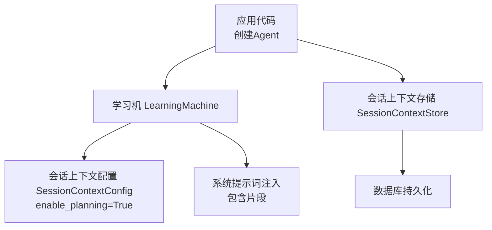
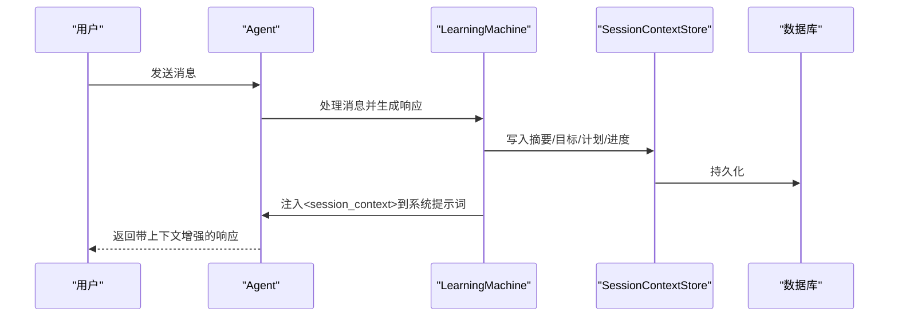
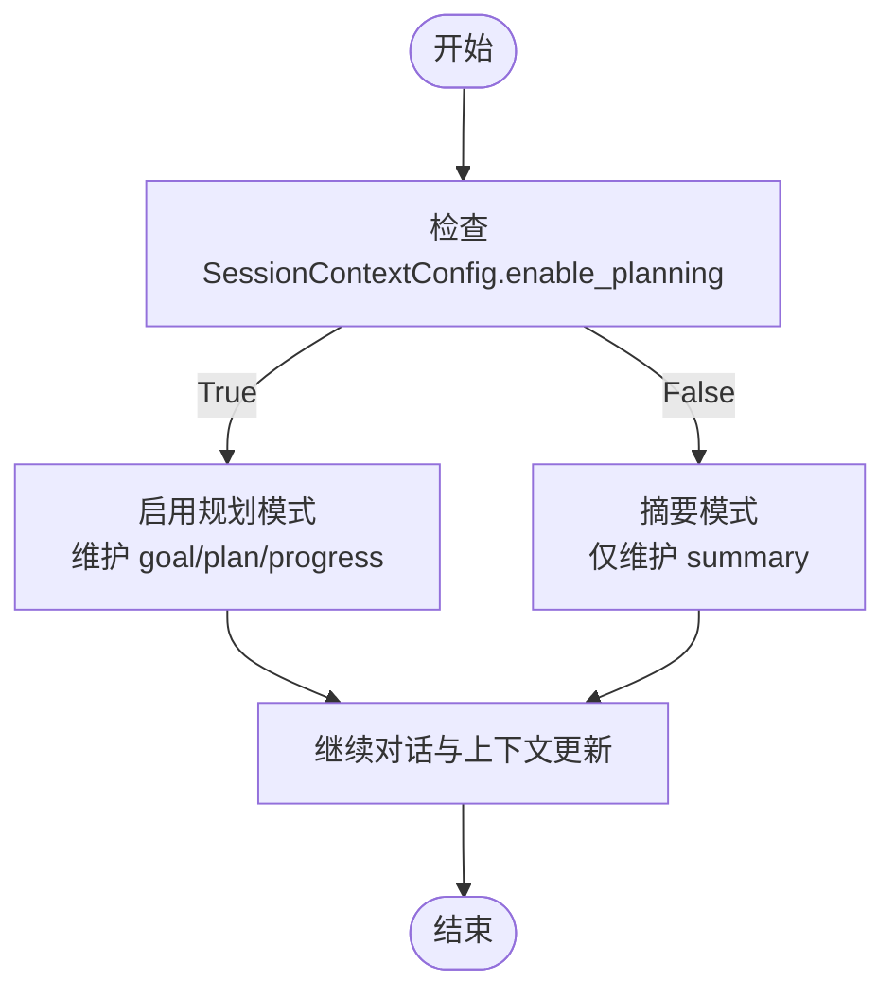
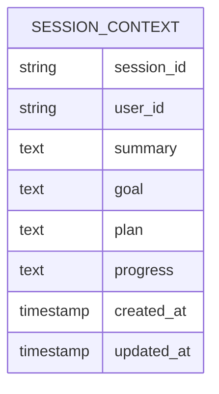
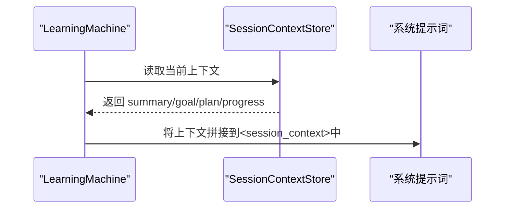
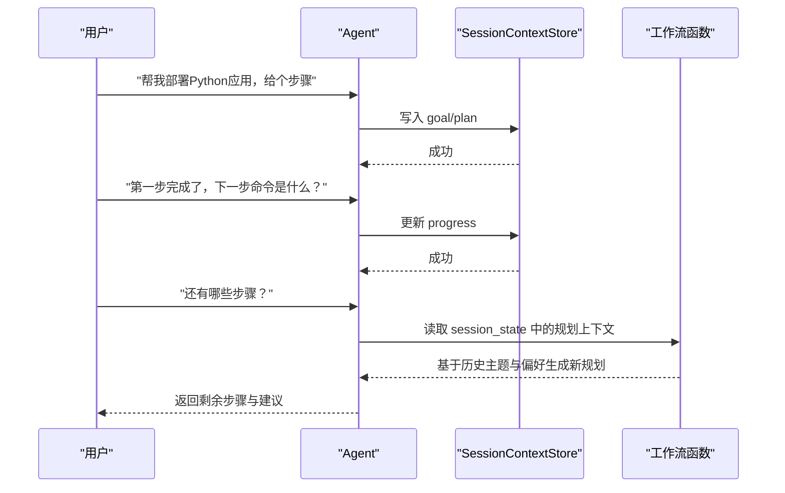
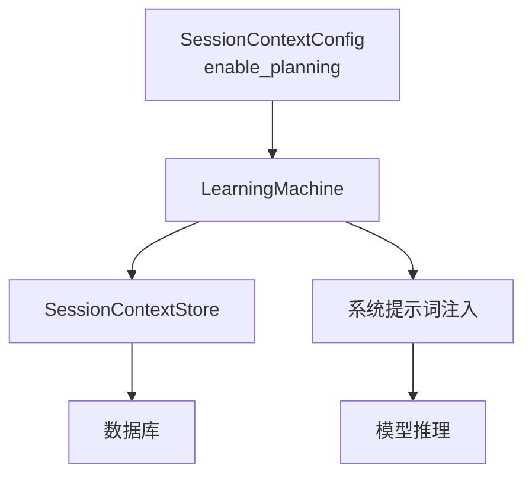

# 规划模式

<cite>
**本文引用的文件**
- [规划模式：深度解析](file://examples/learning/session-context/planning-mode.mdx)
- [会话上下文：规划模式](file://examples/learning/basics/b-session-context-planning.mdx)
- [会话上下文存储](file://learning/stores/session-context.mdx)
- [个人助理模式](file://examples/learning/patterns/personal-assistant.mdx)
- [工作流：自定义函数更新会话状态](file://examples/agent-os/workflow/workflow-with-custom-function-updating-session-state.mdx)
</cite>

## 目录
1. [简介](#简介)
2. [项目结构](#项目结构)
3. [核心组件](#核心组件)
4. [架构总览](#架构总览)
5. [详细组件分析](#详细组件分析)
6. [依赖关系分析](#依赖关系分析)
7. [性能考量](#性能考量)
8. [故障排查指南](#故障排查指南)
9. [结论](#结论)
10. [附录](#附录)

## 简介
本技术文档围绕会话上下文的“规划模式”展开，系统阐述其工作原理、实现机制与最佳实践。规划模式在常规会话摘要的基础上，新增目标（goal）、计划（plan）与进度（progress）三类结构化信息，用于追踪用户目标、制定执行计划并监控任务进度。文档将从数据模型、配置选项、使用示例、与摘要模式的差异、状态管理与更新策略、以及调试与监控方法等方面进行深入说明。

## 项目结构
规划模式位于学习与记忆模块中，通过会话上下文存储器对当前会话的状态进行维护。典型调用路径如下：
- 应用层创建智能体时，配置学习机与会话上下文配置，开启规划模式
- 智能体在每次对话后，将摘要、目标、计划与进度写入会话上下文存储
- 系统提示词注入时，将当前会话上下文作为上下文注入到模型输入中

图表来源
- [会话上下文：规划模式:33-45](file://examples/learning/basics/b-session-context-planning.mdx#L33-L45)
- [会话上下文存储:119-137](file://learning/stores/session-context.mdx#L119-L137)

章节来源
- [会话上下文：规划模式:1-107](file://examples/learning/basics/b-session-context-planning.mdx#L1-L107)
- [会话上下文存储:1-164](file://learning/stores/session-context.mdx#L1-L164)

## 核心组件
- 会话上下文配置（SessionContextConfig）
  - 关键参数：enable_planning（布尔值），用于启用规划模式
  - 默认行为：未显式开启时为摘要模式
- 会话上下文存储（SessionContextStore）
  - 负责读取、写入与打印会话上下文
  - 提供 get 与 print 方法，便于调试与监控
- 数据模型（目标、计划、进度）
  - 目标（goal）：用户希望达成的任务或结果
  - 计划（plan）：为达成目标而制定的步骤列表
  - 进度（progress）：已完成的步骤标记
  - 其他字段：summary（摘要）、session_id、user_id、created_at、updated_at

章节来源
- [会话上下文存储:92-117](file://learning/stores/session-context.mdx#L92-L117)
- [会话上下文：规划模式:39-45](file://examples/learning/basics/b-session-context-planning.mdx#L39-L45)

## 架构总览
规划模式的核心流程是“对话 → 更新上下文 → 注入提示词 → 生成响应”。下图展示了端到端的交互序列：

图表来源
- [会话上下文存储:119-137](file://learning/stores/session-context.mdx#L119-L137)
- [会话上下文：规划模式:60-66](file://examples/learning/basics/b-session-context-planning.mdx#L60-L66)

## 详细组件分析

### 组件A：会话上下文配置与启用
- 配置入口：在学习机中传入 SessionContextConfig，并将 enable_planning 设为 True
- 行为差异：开启后，系统会在摘要之外，额外维护 goal、plan、progress 字段
- 使用建议：适用于需要结构化追踪目标与进度的复杂任务型对话

图表来源
- [会话上下文：规划模式:39-45](file://examples/learning/basics/b-session-context-planning.mdx#L39-L45)
- [会话上下文存储:64-90](file://learning/stores/session-context.mdx#L64-L90)

章节来源
- [会话上下文：规划模式:33-45](file://examples/learning/basics/b-session-context-planning.mdx#L33-L45)
- [会话上下文存储:64-90](file://learning/stores/session-context.mdx#L64-L90)

### 组件B：数据模型与字段语义
- 字段定义
  - session_id：会话唯一标识
  - user_id：所属用户
  - summary：已讨论内容的摘要
  - goal：用户目标（规划模式）
  - plan：达成目标的步骤清单（规划模式）
  - progress：已完成步骤标记（规划模式）
  - created_at / updated_at：创建与最后更新时间
- 字段用途
  - goal/plan/progress 用于结构化追踪任务进展
  - summary 用于快速理解会话主题与状态
  - 时间戳用于审计与排序

图表来源
- [会话上下文存储:92-104](file://learning/stores/session-context.mdx#L92-L104)

章节来源
- [会话上下文存储:92-104](file://learning/stores/session-context.mdx#L92-L104)

### 组件C：上下文注入与提示词扩展
- 注入方式：系统提示词中包含 <session_context> 片段，内含摘要、目标、计划与进度
- 作用：确保模型在生成响应时具备完整的任务背景与进度信息
- 注意：该注入为一次性拼接，不涉及历史消息的重复注入

图表来源
- [会话上下文存储:119-137](file://learning/stores/session-context.mdx#L119-L137)

章节来源
- [会话上下文存储:119-137](file://learning/stores/session-context.mdx#L119-L137)

### 组件D：使用示例与多步流程跟踪
- 示例一：基础部署任务
  - 步骤1：声明目标（如部署Python Web应用）
  - 步骤2：完成第一步并记录进度
  - 步骤3：继续推进并查询剩余步骤
- 示例二：复杂工作流中的会话状态联动
  - 工作流自定义函数可读取 run_context.session_state 中的内容规划字段，结合历史主题与偏好，生成更智能的规划提示

图表来源
- [规划模式：深度解析:52-102](file://examples/learning/session-context/planning-mode.mdx#L52-L102)
- [工作流：自定义函数更新会话状态:88-112](file://examples/agent-os/workflow/workflow-with-custom-function-updating-session-state.mdx#L88-L112)

章节来源
- [规划模式：深度解析:1-117](file://examples/learning/session-context/planning-mode.mdx#L1-L117)
- [工作流：自定义函数更新会话状态:88-112](file://examples/agent-os/workflow/workflow-with-custom-function-updating-session-state.mdx#L88-L112)

### 组件E：与摘要模式的区别与适用场景
- 摘要模式
  - 仅维护 summary 字段，适合轻量级对话状态跟踪
  - 性能开销更低，适合短对话或不需要结构化进度的任务
- 规划模式
  - 维护 summary、goal、plan、progress，适合复杂多步骤任务
  - 更强的上下文表达能力，利于长对话、断点续聊与跨阶段交接

章节来源
- [会话上下文存储:47-90](file://learning/stores/session-context.mdx#L47-L90)

### 组件F：数据更新策略与状态管理
- 更新策略
  - 每次对话更新都会替换性地写入新的摘要、目标、计划与进度
  - 存储器提供 print 方法用于调试输出，get 方法用于程序化访问
- 状态管理
  - 会话生命周期内持续维护；会话结束后由业务逻辑决定是否保留
  - 可与其他存储（如用户画像、实体记忆）组合使用，形成“长期知识 + 短期状态”的协同

章节来源
- [会话上下文存储:8-16](file://learning/stores/session-context.mdx#L8-L16)
- [会话上下文存储:105-117](file://learning/stores/session-context.mdx#L105-L117)
- [会话上下文存储:148-164](file://learning/stores/session-context.mdx#L148-L164)

## 依赖关系分析
规划模式的依赖关系主要体现在配置、存储与提示词注入三个层面：

图表来源
- [会话上下文：规划模式:39-45](file://examples/learning/basics/b-session-context-planning.mdx#L39-L45)
- [会话上下文存储:119-137](file://learning/stores/session-context.mdx#L119-L137)

章节来源
- [会话上下文：规划模式:33-45](file://examples/learning/basics/b-session-context-planning.mdx#L33-L45)
- [会话上下文存储:119-137](file://learning/stores/session-context.mdx#L119-L137)

## 性能考量
- 开销对比：规划模式相较摘要模式多维护 goal、plan、progress 字段，带来轻微的计算与存储开销
- 适用场景权衡：对于短对话或无需结构化进度的任务，优先选择摘要模式以降低开销
- 批量更新：在高并发场景下，建议合并上下文更新操作，减少数据库往返次数

## 故障排查指南
- 无法看到规划字段
  - 检查 SessionContextConfig 是否正确启用规划模式
  - 确认会话上下文存储器的 print 输出是否包含 goal/plan/progress
- 上下文未注入到提示词
  - 检查系统提示词模板中是否包含 <session_context> 片段
  - 确认 LearningMachine 的上下文注入逻辑是否生效
- 进度未更新
  - 确认对话后是否调用了上下文写入接口
  - 检查数据库连接与事务提交情况

章节来源
- [会话上下文存储:119-137](file://learning/stores/session-context.mdx#L119-L137)
- [会话上下文：规划模式:60-92](file://examples/learning/basics/b-session-context-planning.mdx#L60-L92)

## 结论
规划模式通过结构化的“目标—计划—进度”三元组，显著增强了复杂任务型对话的上下文表达能力。它在保持会话摘要优势的同时，提供了更强的可追踪性与可解释性，适用于需要长期任务推进与跨阶段交接的应用场景。结合其他存储（如用户画像、实体记忆）可进一步提升个性化与智能化水平。

## 附录
- 实践建议
  - 在复杂工作流中，可将会话状态与工作流状态联动，形成“内容规划”等复合上下文
  - 对于多用户或多会话场景，建议按用户维度组合使用用户画像与会话上下文
- 参考示例
  - 个人助理模式：同时启用用户画像、会话上下文与实体记忆，实现更全面的个性化服务

章节来源
- [个人助理模式:39-64](file://examples/learning/patterns/personal-assistant.mdx#L39-L64)
- [工作流：自定义函数更新会话状态:88-112](file://examples/agent-os/workflow/workflow-with-custom-function-updating-session-state.mdx#L88-L112)