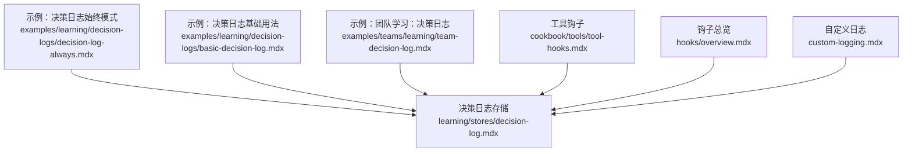
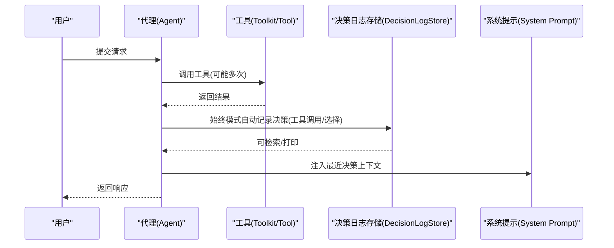
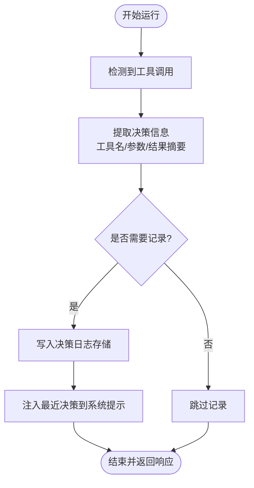
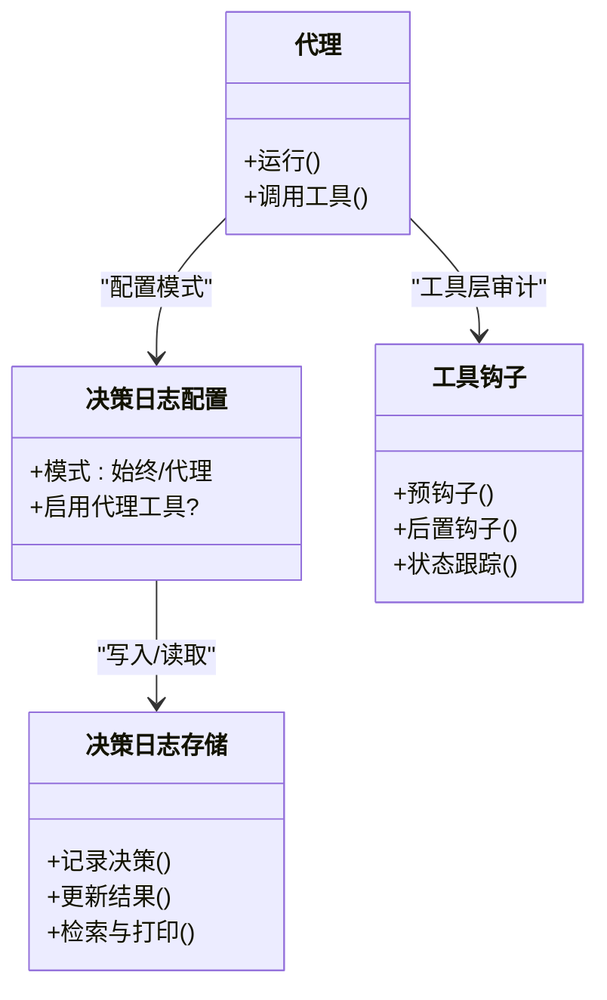
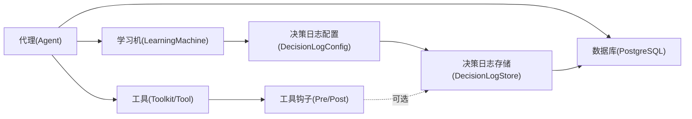

# 决策日志始终模式

<cite>
**本文引用的文件**
- [决策日志：始终模式（自动记录）](file://examples/learning/decision-logs/decision-log-always.mdx)
- [决策日志基础用法](file://examples/learning/decision-logs/basic-decision-log.mdx)
- [团队学习：决策日志](file://examples/teams/learning/team-decision-log.mdx)
- [决策日志存储](file://learning/stores/decision-log.mdx)
- [工具钩子](file://cookbook/tools/tool-hooks.mdx)
- [钩子总览](file://hooks/overview.mdx)
- [自定义日志](file://custom-logging.mdx)
</cite>

## 目录
1. [简介](#简介)
2. [项目结构](#项目结构)
3. [核心组件](#核心组件)
4. [架构总览](#架构总览)
5. [详细组件分析](#详细组件分析)
6. [依赖关系分析](#依赖关系分析)
7. [性能考量](#性能考量)
8. [故障排查指南](#故障排查指南)
9. [结论](#结论)
10. [附录](#附录)

## 简介
本技术文档聚焦“决策日志始终模式”，系统阐述其工作机制、自动决策记录能力、适用场景与权衡、配置方式、性能影响、触发条件与过滤机制，并提供实现示例、配置指南、优化建议与噪声控制策略。同时给出与代理工具集成的最佳实践，帮助读者在保证可观测性的同时，避免不必要的噪声。

## 项目结构
围绕决策日志始终模式的关键文档与示例分布如下：
- 学习与决策日志：提供两种模式（始终/代理）的使用说明与数据模型
- 示例：演示始终模式自动记录工具调用、代理手动记录、团队决策日志
- 工具钩子：展示如何通过预/后置钩子对工具调用进行审计与记录
- 钩子总览：说明运行生命周期中的触发时机与典型用例
- 自定义日志：提供统一日志配置与命名日志器的参考

**图表来源**
- [决策日志：始终模式（自动记录）:1-86](file://examples/learning/decision-logs/decision-log-always.mdx#L1-L86)
- [决策日志基础用法:1-90](file://examples/learning/decision-logs/basic-decision-log.mdx#L1-L90)
- [团队学习：决策日志:1-133](file://examples/teams/learning/team-decision-log.mdx#L1-L133)
- [决策日志存储:1-173](file://learning/stores/decision-log.mdx#L1-L173)
- [工具钩子:1-211](file://cookbook/tools/tool-hooks.mdx#L1-L211)
- [钩子总览:1-217](file://hooks/overview.mdx#L1-L217)
- [自定义日志:95-138](file://custom-logging.mdx#L95-L138)

**章节来源**
- [决策日志：始终模式（自动记录）:1-86](file://examples/learning/decision-logs/decision-log-always.mdx#L1-L86)
- [决策日志基础用法:1-90](file://examples/learning/decision-logs/basic-decision-log.mdx#L1-L90)
- [团队学习：决策日志:1-133](file://examples/teams/learning/team-decision-log.mdx#L1-L133)
- [决策日志存储:1-173](file://learning/stores/decision-log.mdx#L1-L173)
- [工具钩子:1-211](file://cookbook/tools/tool-hooks.mdx#L1-L211)
- [钩子总览:1-217](file://hooks/overview.mdx#L1-L217)
- [自定义日志:95-138](file://custom-logging.mdx#L95-L138)

## 核心组件
- 决策日志存储（DecisionLogStore）
  - 记录决策、理由、上下文、替代方案、置信度、结果与质量等字段
  - 支持按类型、时间窗口检索与打印输出
- 决策日志配置（DecisionLogConfig）与学习模式（LearningMode）
  - 始终模式（ALWAYS）：自动从工具调用提取并记录决策
  - 代理模式（AGENTIC）：由代理显式使用工具记录决策
- 工具钩子（Pre/Post hooks）
  - 在工具执行前后注入逻辑，用于审计、缓存、限流、错误处理等
- 钩子（Pre/Post hooks）
  - 在代理/团队运行生命周期中触发，支持同步/异步与后台执行

**章节来源**
- [决策日志存储:89-173](file://learning/stores/decision-log.mdx#L89-L173)
- [决策日志：始终模式（自动记录）:38-54](file://examples/learning/decision-logs/decision-log-always.mdx#L38-L54)
- [决策日志基础用法:39-58](file://examples/learning/decision-logs/basic-decision-log.mdx#L39-L58)
- [工具钩子:26-121](file://cookbook/tools/tool-hooks.mdx#L26-L121)
- [钩子总览:25-167](file://hooks/overview.mdx#L25-L167)

## 架构总览
始终模式的核心流程：代理在运行过程中调用工具，系统根据配置自动提取决策信息并写入决策日志存储；随后可将近期决策注入系统提示，形成闭环反馈。

**图表来源**
- [决策日志存储:67-87](file://learning/stores/decision-log.mdx#L67-L87)
- [决策日志：始终模式（自动记录）:38-71](file://examples/learning/decision-logs/decision-log-always.mdx#L38-L71)

## 详细组件分析

### 始终模式工作机制
- 触发条件
  - 代理运行中发生工具调用时，系统自动提取决策（如选择了哪个工具）
  - 默认模式下，无需代理显式调用记录工具
- 过滤与噪声控制
  - 文档明确指出“会记录每个工具调用，可能产生噪声”
  - 建议结合工具钩子或后置钩子进行二次过滤（例如仅记录特定工具、满足阈值的结果）
- 数据模型
  - 字段覆盖决策、理由、类型、上下文、替代方案、置信度、结果与质量、时间戳等
- 上下文注入
  - 将近期决策注入系统提示，辅助后续推理与一致性

**图表来源**
- [决策日志存储:87-153](file://learning/stores/decision-log.mdx#L87-L153)
- [决策日志：始终模式（自动记录）:38-71](file://examples/learning/decision-logs/decision-log-always.mdx#L38-L71)

**章节来源**
- [决策日志存储:67-153](file://learning/stores/decision-log.mdx#L67-L153)
- [决策日志：始终模式（自动记录）:38-71](file://examples/learning/decision-logs/decision-log-always.mdx#L38-L71)

### 代理模式与工具钩子的互补
- 代理模式（AGENTIC）
  - 由代理显式使用记录工具，适合精细化控制记录粒度
- 工具钩子（Pre/Post）
  - 在工具层面对调用进行审计、缓存、限流与错误处理
  - 可与始终模式配合：先自动记录，再通过钩子进行二次加工或过滤

**图表来源**
- [决策日志存储:17-87](file://learning/stores/decision-log.mdx#L17-L87)
- [工具钩子:88-159](file://cookbook/tools/tool-hooks.mdx#L88-L159)

**章节来源**
- [决策日志基础用法:39-58](file://examples/learning/decision-logs/basic-decision-log.mdx#L39-L58)
- [工具钩子:88-159](file://cookbook/tools/tool-hooks.mdx#L88-L159)

### 团队场景下的决策日志
- 团队成员在讨论与决策过程中，可使用代理工具记录架构、安全、合规等重要决策
- 支持按会话或成员维度检索与打印，便于审计与复盘

**章节来源**
- [团队学习：决策日志:34-118](file://examples/teams/learning/team-decision-log.mdx#L34-L118)

## 依赖关系分析
- 模块耦合
  - 代理与决策日志存储之间为弱耦合：始终模式通过配置驱动自动记录
  - 工具钩子与代理/工具为松耦合：可独立启用以实现审计与过滤
- 外部依赖
  - 数据库（如PostgreSQL）用于持久化决策日志
  - AgentOS支持后台钩子执行（对非关键任务提升吞吐）

**图表来源**
- [决策日志：始终模式（自动记录）:31-54](file://examples/learning/decision-logs/decision-log-always.mdx#L31-L54)
- [决策日志存储:14-15](file://learning/stores/decision-log.mdx#L14-L15)

**章节来源**
- [决策日志：始终模式（自动记录）:31-54](file://examples/learning/decision-logs/decision-log-always.mdx#L31-L54)
- [决策日志存储:14-15](file://learning/stores/decision-log.mdx#L14-L15)

## 性能考量
- 始终模式的开销
  - 自动记录每个工具调用，可能带来额外的I/O与序列化成本
  - 建议在生产环境结合过滤策略与批量写入优化
- 后台执行与异步
  - 使用后台钩子（需AgentOS）减少对响应延迟的影响
  - 对非关键任务（日志、通知、异步存储）采用后台模式
- 日志级别与输出
  - 通过自定义日志器与命名日志器，将不同层级（代理/团队/工作流）的日志分流，降低噪声并提升可观测性

**章节来源**
- [钩子总览:175-211](file://hooks/overview.mdx#L175-L211)
- [自定义日志:95-138](file://custom-logging.mdx#L95-L138)

## 故障排查指南
- 噪声过多
  - 症状：日志量过大、查询缓慢
  - 措施：切换至代理模式或引入工具钩子进行过滤；仅记录高置信度或关键工具调用
- 结果未回填
  - 症状：已记录决策但未更新结果与质量
  - 措施：使用记录结果工具或直接调用存储接口更新outcome与outcome_quality
- 上下文未生效
  - 症状：系统提示未包含最近决策
  - 措施：确认注入逻辑与模板片段正确；检查检索范围（agent_id/session_id）与时间窗口

**章节来源**
- [决策日志存储:104-137](file://learning/stores/decision-log.mdx#L104-L137)

## 结论
始终模式通过“自动记录工具调用”显著提升了可观测性与可审计性，适合需要全面追踪代理行为的场景。但其带来的噪声与性能开销需通过工具钩子、后台执行、日志分级与上下文注入策略加以平衡。在团队协作与合规要求较高的场景，建议结合代理模式与工具钩子，构建“自动+人工”的双重保障体系。

## 附录

### 何时使用始终模式
- 需要完整审计代理的所有工具调用
- 快速验证代理在复杂对话中的决策路径
- 构建反馈循环：记录结果与质量，持续优化指令与工具

**章节来源**
- [决策日志存储:167-173](file://learning/stores/decision-log.mdx#L167-L173)

### 配置方法与示例路径
- 始终模式（自动记录）
  - 示例路径：[决策日志：始终模式（自动记录）:38-71](file://examples/learning/decision-logs/decision-log-always.mdx#L38-L71)
- 代理模式（手动记录）
  - 示例路径：[决策日志基础用法:39-75](file://examples/learning/decision-logs/basic-decision-log.mdx#L39-L75)
- 团队场景
  - 示例路径：[团队学习：决策日志:54-118](file://examples/teams/learning/team-decision-log.mdx#L54-L118)

**章节来源**
- [决策日志：始终模式（自动记录）:38-71](file://examples/learning/decision-logs/decision-log-always.mdx#L38-L71)
- [决策日志基础用法:39-75](file://examples/learning/decision-logs/basic-decision-log.mdx#L39-L75)
- [团队学习：决策日志:54-118](file://examples/teams/learning/team-decision-log.mdx#L54-L118)

### 性能优化与噪声控制策略
- 过滤策略
  - 工具钩子：仅记录特定工具或满足阈值的结果
  - 代理模式：由代理判断是否值得记录
- 批量与异步
  - 后台钩子：将非关键日志与通知异步化
  - 分批写入：合并多条记录，降低I/O频率
- 日志管理
  - 自定义日志器：按模块分层输出，便于定位与降噪

**章节来源**
- [工具钩子:183-193](file://cookbook/tools/tool-hooks.mdx#L183-L193)
- [钩子总览:175-211](file://hooks/overview.mdx#L175-L211)
- [自定义日志:95-138](file://custom-logging.mdx#L95-L138)

### 决策日志与代理工具集成最佳实践
- 先自动、后精细：始终模式作为默认开关，配合工具钩子做二次过滤
- 明确决策类型：使用标准类型（工具选择、响应风格、澄清、升级、方法）提升检索效率
- 结果回填：及时更新outcome与outcome_quality，形成闭环反馈
- 上下文注入：将近期决策注入系统提示，增强一致性与可解释性

**章节来源**
- [决策日志存储:155-153](file://learning/stores/decision-log.mdx#L155-L153)