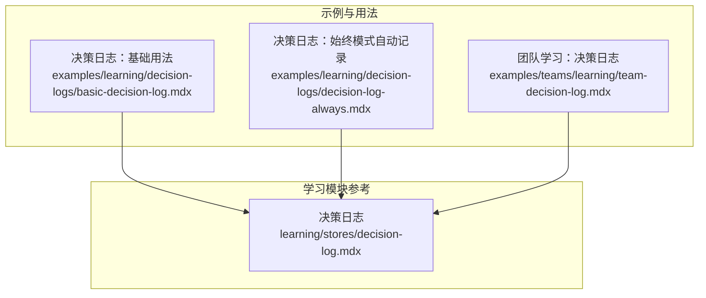
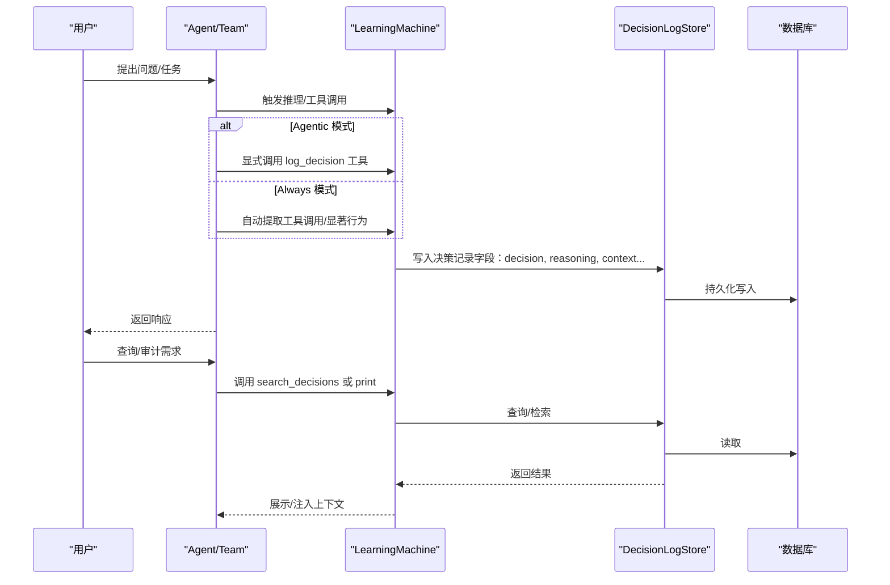
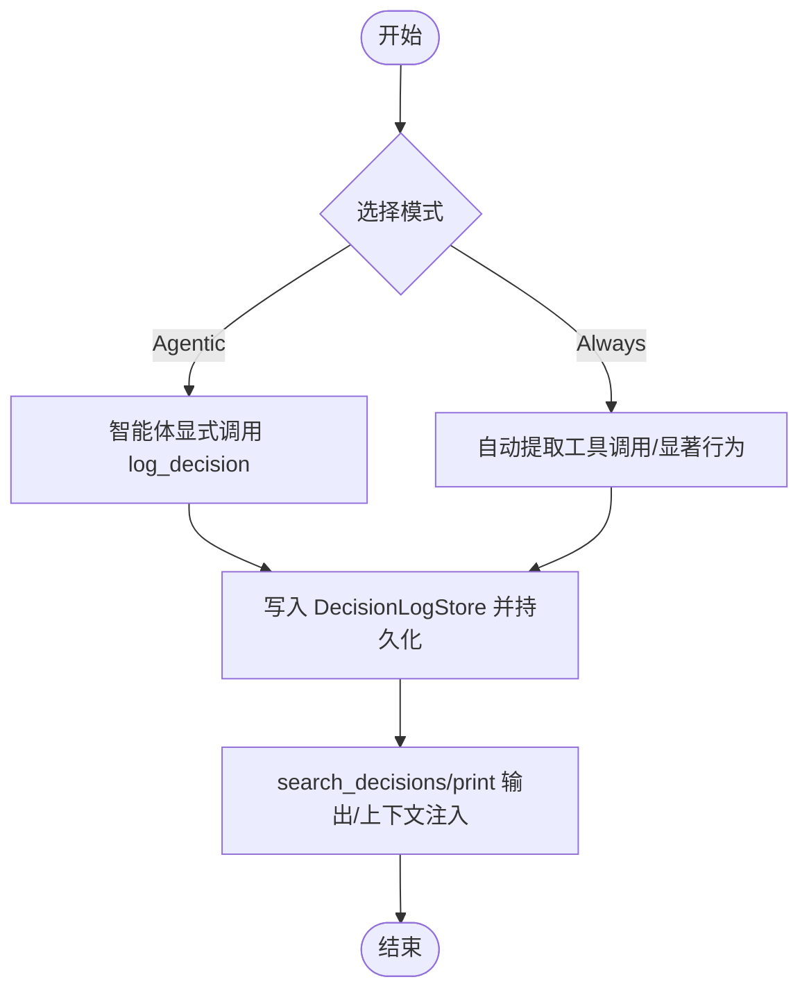
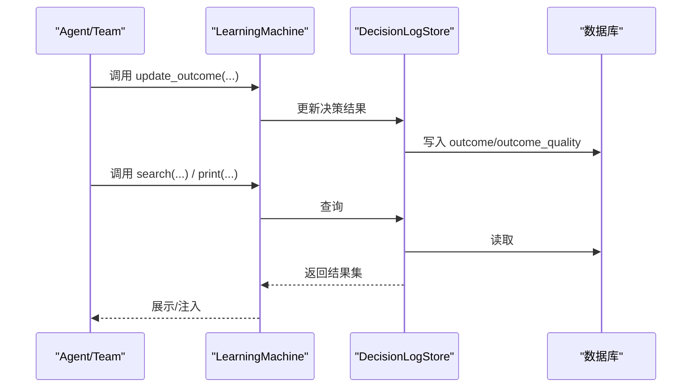
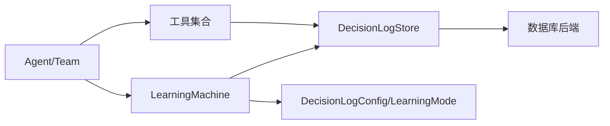

# 决策日志存储

<cite>
**本文引用的文件**
- [决策日志：基础用法](file://examples/learning/decision-logs/basic-decision-log.mdx)
- [决策日志：始终模式（自动记录）](file://examples/learning/decision-logs/decision-log-always.mdx)
- [团队学习：决策日志](file://examples/teams/learning/team-decision-log.mdx)
- [决策日志](file://learning/stores/decision-log.mdx)
</cite>

## 目录
1. [引言](#引言)
2. [项目结构](#项目结构)
3. [核心组件](#核心组件)
4. [架构总览](#架构总览)
5. [详细组件分析](#详细组件分析)
6. [依赖关系分析](#依赖关系分析)
7. [性能考量](#性能考量)
8. [故障排查指南](#故障排查指南)
9. [结论](#结论)
10. [附录](#附录)

## 引言
本技术文档围绕“决策日志存储”展开，系统阐述其设计理念、实现原理与使用方式，重点覆盖两类工作模式：基础模式（Agentic 模式）与始终模式（Always 模式），并给出数据模型、审计机制、生命周期管理、配置最佳实践、性能优化建议、审计策略实现与扩展方法，以及数据隐私与安全注意事项。目标是帮助读者在不同场景下正确选择与部署决策日志能力，构建可审计、可回溯、可持续改进的智能体系统。

## 项目结构
决策日志相关内容主要分布在以下三类文档中：
- 学习与示例：用于演示如何在 Agent 与 Team 中启用与使用决策日志，涵盖 Agentic 与 Always 两种模式。
- 学习模块参考：定义决策日志的数据模型、可用工具、上下文注入与检索接口等。

**图表来源**
- [决策日志：基础用法:1-90](file://examples/learning/decision-logs/basic-decision-log.mdx#L1-L90)
- [决策日志：始终模式（自动记录）:1-86](file://examples/learning/decision-logs/decision-log-always.mdx#L1-L86)
- [团队学习：决策日志:1-133](file://examples/teams/learning/team-decision-log.mdx#L1-L133)
- [决策日志:1-173](file://learning/stores/decision-log.mdx#L1-L173)

**章节来源**
- [决策日志：基础用法:1-90](file://examples/learning/decision-logs/basic-decision-log.mdx#L1-L90)
- [决策日志：始终模式（自动记录）:1-86](file://examples/learning/decision-logs/decision-log-always.mdx#L1-L86)
- [团队学习：决策日志:1-133](file://examples/teams/learning/team-decision-log.mdx#L1-L133)
- [决策日志:1-173](file://learning/stores/decision-log.mdx#L1-L173)

## 核心组件
- 决策日志存储（DecisionLogStore）
  - 职责：持久化记录智能体的决策，包含决策内容、理由、上下文、替代方案、置信度、结果与质量、时间戳等字段；支持按条件检索与打印输出。
  - 访问入口：通过学习机（LearningMachine）暴露的决策日志存储实例访问。
- 学习机（LearningMachine）
  - 职责：承载决策日志配置与工具，决定日志模式（Agentic/Always），并提供工具供智能体显式记录或检索决策。
- 日志模式（DecisionLogConfig + LearningMode）
  - Agentic 模式：智能体显式调用工具记录重要决策。
  - Always 模式：自动从工具调用等显著行为中提取决策并记录。
- 数据模型（字段）
  - id、decision、reasoning、decision_type、context、alternatives、confidence、outcome、outcome_quality、created_at。
- 上下文注入
  - 将近期决策注入系统提示词，辅助后续推理与一致性。

**章节来源**
- [决策日志:8-173](file://learning/stores/decision-log.mdx#L8-L173)

## 架构总览
下图展示 Agent/Team 在运行过程中如何与学习机协作，触发决策记录，并持久化到数据库中：

**图表来源**
- [决策日志：基础用法:37-76](file://examples/learning/decision-logs/basic-decision-log.mdx#L37-L76)
- [决策日志：始终模式（自动记录）:36-72](file://examples/learning/decision-logs/decision-log-always.mdx#L36-L72)
- [团队学习：决策日志:52-119](file://examples/teams/learning/team-decision-log.mdx#L52-L119)
- [决策日志:47-137](file://learning/stores/decision-log.mdx#L47-L137)

## 详细组件分析

### 组件一：工作模式与控制流
- Agentic 模式（基础模式）
  - 特点：智能体显式调用工具记录重要决策，适合需要精细控制记录粒度的场景。
  - 示例路径：[示例：Agentic 模式:37-76](file://examples/learning/decision-logs/basic-decision-log.mdx#L37-L76)
- Always 模式（始终模式）
  - 特点：自动从工具调用等显著行为中抽取决策并记录，适合需要全面审计的场景。
  - 示例路径：[示例：Always 模式:36-72](file://examples/learning/decision-logs/decision-log-always.mdx#L36-L72)
- 模式切换与权衡
  - Tradeoff：Always 模式会记录每个工具调用，可能产生噪声；Agentic 模式由智能体判断记录时机，更可控但需明确指令。

**图表来源**
- [决策日志：基础用法:37-76](file://examples/learning/decision-logs/basic-decision-log.mdx#L37-L76)
- [决策日志：始终模式（自动记录）:36-72](file://examples/learning/decision-logs/decision-log-always.mdx#L36-L72)
- [决策日志:47-87](file://learning/stores/decision-log.mdx#L47-L87)

**章节来源**
- [决策日志：基础用法:37-76](file://examples/learning/decision-logs/basic-decision-log.mdx#L37-L76)
- [决策日志：始终模式（自动记录）:36-72](file://examples/learning/decision-logs/decision-log-always.mdx#L36-L72)
- [决策日志:47-87](file://learning/stores/decision-log.mdx#L47-L87)

### 组件二：数据模型与字段语义
- 字段清单与用途
  - id：唯一标识
  - decision：所做决策
  - reasoning：决策理由
  - decision_type：决策类型（如 tool_selection、response_style、clarification 等）
  - context：决策背景/情境
  - alternatives：考虑的其他选项
  - confidence：置信度（0.0~1.0）
  - outcome：实际结果
  - outcome_quality：结果质量（good/bad/neutral）
  - created_at：决策时间
- 使用建议
  - 通过工具或直接调用存储接口补充 outcome 与 outcome_quality，形成闭环反馈。

**章节来源**
- [决策日志:89-118](file://learning/stores/decision-log.mdx#L89-L118)

### 组件三：审计与检索接口
- 常见操作
  - 更新结果：update_outcome(decision_id, outcome, outcome_quality)
  - 检索与打印：search(agent_id, decision_type, days, limit)、print(...)
- 典型流程
  - 记录决策 → 追加 outcome → 按类型/时间检索 → 打印或注入上下文

**图表来源**
- [决策日志:104-137](file://learning/stores/decision-log.mdx#L104-L137)

**章节来源**
- [决策日志:104-137](file://learning/stores/decision-log.mdx#L104-L137)

### 组件四：上下文注入与学习闭环
- 上下文注入
  - 将近期决策注入系统提示词，增强一致性与可追溯性。
- 反馈循环
  - outcome 与 outcome_quality 的记录有助于识别成功/失败模式，指导后续指令优化。

**章节来源**
- [决策日志:139-173](file://learning/stores/decision-log.mdx#L139-L173)

### 组件五：团队场景下的决策日志
- 团队成员分别做出决策并记录，便于跨成员审计与复盘。
- 示例展示了多轮会话中的决策记录与打印。

**章节来源**
- [团队学习：决策日志:52-119](file://examples/teams/learning/team-decision-log.mdx#L52-L119)

## 依赖关系分析
- 组件耦合
  - Agent/Team 依赖 LearningMachine 获取决策日志存储实例。
  - DecisionLogStore 依赖数据库后端进行持久化。
  - 模式配置（DecisionLogConfig + LearningMode）决定记录策略。
- 外部集成点
  - 数据库：PostgreSQL/SQLite 等（示例中使用 PostgresDb）。
  - 工具：DuckDuckGoTools 等（用于 Always 模式的自动记录）。
- 可能的循环依赖
  - 文档层面未发现循环依赖迹象；模式与存储解耦良好。

**图表来源**
- [决策日志：基础用法:37-58](file://examples/learning/decision-logs/basic-decision-log.mdx#L37-L58)
- [决策日志：始终模式（自动记录）:36-54](file://examples/learning/decision-logs/decision-log-always.mdx#L36-L54)
- [决策日志:17-87](file://learning/stores/decision-log.mdx#L17-L87)

**章节来源**
- [决策日志：基础用法:37-58](file://examples/learning/decision-logs/basic-decision-log.mdx#L37-L58)
- [决策日志：始终模式（自动记录）:36-54](file://examples/learning/decision-logs/decision-log-always.mdx#L36-L54)
- [决策日志:17-87](file://learning/stores/decision-log.mdx#L17-L87)

## 性能考量
- Always 模式噪声控制
  - 高频工具调用可能导致日志膨胀，建议结合业务场景评估是否开启 Always 模式，或在高并发场景下限制记录范围。
- 检索与分页
  - 使用 days/limit 参数控制检索窗口，避免一次性加载过多历史。
- 存储成本
  - 长期保存决策日志会增加存储与查询开销，建议定期归档或清理策略。
- 上下文注入长度
  - 注入的决策数量与长度应受控，避免超出模型上下文上限。

[本节为通用性能建议，不直接分析具体文件，故无“章节来源”]

## 故障排查指南
- 无法查看决策日志
  - 确认已启用学习机与决策日志配置，检查 agent_id/session_id 是否正确传入。
  - 参考：[示例：查看日志:71-76](file://examples/learning/decision-logs/basic-decision-log.mdx#L71-L76)
- 决策未被记录
  - Agentic 模式需确保智能体显式调用 log_decision；Always 模式需确认工具调用被正确识别。
  - 参考：[示例：Agentic 模式:37-58](file://examples/learning/decision-logs/basic-decision-log.mdx#L37-L58)、[示例：Always 模式:36-54](file://examples/learning/decision-logs/decision-log-always.mdx#L36-L54)
- 结果未更新
  - 确认使用 update_outcome 或 record_outcome 工具，并提供正确的 decision_id。
  - 参考：[接口说明:104-118](file://learning/stores/decision-log.mdx#L104-L118)
- 审计与检索异常
  - 检查参数（agent_id、decision_type、days、limit）是否合理；必要时缩小时间窗口或过滤条件。
  - 参考：[检索接口:120-137](file://learning/stores/decision-log.mdx#L120-L137)

**章节来源**
- [决策日志：基础用法:71-76](file://examples/learning/decision-logs/basic-decision-log.mdx#L71-L76)
- [决策日志：始终模式（自动记录）:36-54](file://examples/learning/decision-logs/decision-log-always.mdx#L36-L54)
- [决策日志:104-137](file://learning/stores/decision-log.mdx#L104-L137)

## 结论
决策日志存储为智能体提供了可审计、可回溯、可学习的基础设施。通过 Agentic 与 Always 两种模式，用户可在“可控性”与“完整性”之间取得平衡。配合数据模型、检索与上下文注入机制，可构建完善的审计与反馈闭环。建议在生产环境中结合业务需求选择合适模式，并制定数据保留与清理策略，以兼顾可观测性与性能。

[本节为总结性内容，不直接分析具体文件，故无“章节来源”]

## 附录

### A. 配置最佳实践
- 模式选择
  - 需要精细控制与低噪声：Agentic 模式。
  - 需要全面审计与自动化：Always 模式。
- 工具与指令
  - 在 Agentic 模式下明确指令，引导智能体识别“重要决策”。
  - 在 Always 模式下确保工具调用具备可解释性，便于生成高质量决策描述。
- 数据库与持久化
  - 优先使用事务安全的数据库后端，保证写入一致性。
- 上下文注入
  - 控制注入条数与长度，避免上下文溢出。

**章节来源**
- [决策日志:10-15](file://learning/stores/decision-log.mdx#L10-L15)
- [决策日志：基础用法:37-58](file://examples/learning/decision-logs/basic-decision-log.mdx#L37-L58)
- [决策日志：始终模式（自动记录）:36-54](file://examples/learning/decision-logs/decision-log-always.mdx#L36-L54)

### B. 生命周期管理
- 创建：初始化 Agent/Team 时启用 LearningMachine 与 DecisionLogConfig。
- 更新：通过 update_outcome 或 record_outcome 补充结果与质量。
- 查询：使用 search 与 print 进行检索与审计。
- 清理：制定定期归档/删除策略，避免历史无限增长。

**章节来源**
- [决策日志:104-137](file://learning/stores/decision-log.mdx#L104-L137)

### C. 审计策略与扩展
- 审计策略
  - 定期抽样检查 decision_type 分布，识别高频决策类别。
  - 对 outcome_quality 进行统计，定位失败模式并优化指令。
- 扩展方法
  - 新增自定义 decision_type 与字段，丰富分类维度。
  - 集成外部审计平台，统一导出决策日志。

**章节来源**
- [决策日志:155-173](file://learning/stores/decision-log.mdx#L155-L173)

### D. 数据隐私与安全
- 最小化原则：仅记录必要的决策信息，避免敏感数据进入日志。
- 访问控制：限制对决策日志存储的访问权限，遵循最小授权。
- 数据脱敏：对 session_id、agent_id 等标识进行脱敏处理后再入库或导出。
- 合规要求：遵守所在地区法律法规，提供数据删除与迁移能力。

[本节为通用安全建议，不直接分析具体文件，故无“章节来源”]