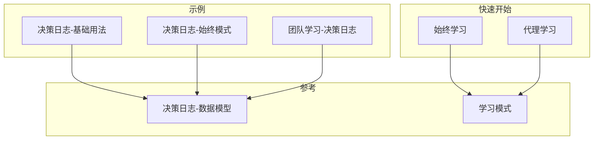
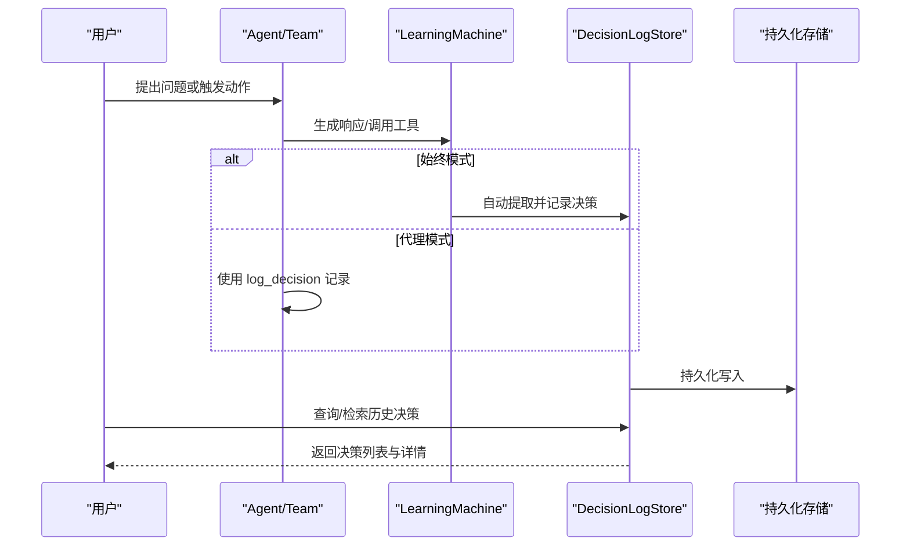
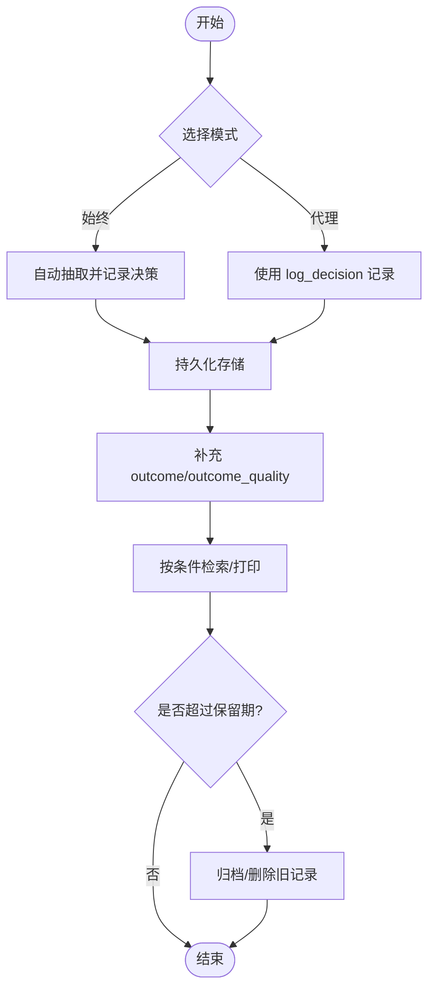
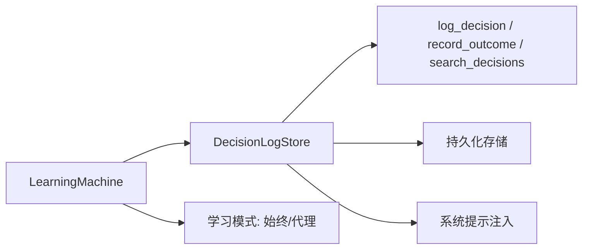

# 决策日志数据模型

<cite>
**本文档引用的文件**
- [决策日志-基础用法](file://examples/learning/decision-logs/basic-decision-log.mdx)
- [决策日志-始终模式](file://examples/learning/decision-logs/decision-log-always.mdx)
- [团队学习-决策日志](file://examples/teams/learning/team-decision-log.mdx)
- [决策日志-数据模型](file://learning/stores/decision-log.mdx)
- [学习模式](file://learning/learning-modes.mdx)
- [学习模式-快速开始-始终学习](file://examples/learning/quickstart/always-learn.mdx)
- [学习模式-快速开始-代理学习](file://examples/learning/quickstart/agentic-learn.mdx)
</cite>

## 目录
1. [简介](#简介)
2. [项目结构](#项目结构)
3. [核心组件](#核心组件)
4. [架构总览](#架构总览)
5. [详细组件分析](#详细组件分析)
6. [依赖关系分析](#依赖关系分析)
7. [性能考虑](#性能考虑)
8. [故障排除指南](#故障排除指南)
9. [结论](#结论)
10. [附录](#附录)

## 简介
本文件系统性地阐述决策日志数据模型，覆盖字段定义、数据类型、生命周期管理（创建、更新、查询、清理）、决策类型分类体系、扩展与自定义字段指南，以及数据验证与完整性约束建议。目标是帮助读者在实际工程中正确设计、实现与维护决策日志系统，支撑审计、调试、学习与反馈闭环。

## 项目结构
围绕决策日志主题，仓库提供了多类示例与参考文档：
- 示例：基础用法、始终模式自动记录、团队场景下的决策日志
- 参考：决策日志数据模型与字段说明、学习模式与工具集
- 快速开始：学习模式的两种典型用法

**图表来源**
- [决策日志-基础用法:1-90](file://examples/learning/decision-logs/basic-decision-log.mdx#L1-L90)
- [决策日志-始终模式:1-86](file://examples/learning/decision-logs/decision-log-always.mdx#L1-L86)
- [团队学习-决策日志:1-133](file://examples/teams/learning/team-decision-log.mdx#L1-L133)
- [决策日志-数据模型:1-173](file://learning/stores/decision-log.mdx#L1-L173)
- [学习模式:1-147](file://learning/learning-modes.mdx#L1-L147)
- [学习模式-快速开始-始终学习:1-75](file://examples/learning/quickstart/always-learn.mdx#L1-L75)
- [学习模式-快速开始-代理学习:1-83](file://examples/learning/quickstart/agentic-learn.mdx#L1-L83)

**章节来源**
- [决策日志-基础用法:1-90](file://examples/learning/decision-logs/basic-decision-log.mdx#L1-L90)
- [决策日志-始终模式:1-86](file://examples/learning/decision-logs/decision-log-always.mdx#L1-L86)
- [团队学习-决策日志:1-133](file://examples/teams/learning/team-decision-log.mdx#L1-L133)
- [决策日志-数据模型:1-173](file://learning/stores/decision-log.mdx#L1-L173)
- [学习模式:1-147](file://learning/learning-modes.mdx#L1-L147)
- [学习模式-快速开始-始终学习:1-75](file://examples/learning/quickstart/always-learn.mdx#L1-L75)
- [学习模式-快速开始-代理学习:1-83](file://examples/learning/quickstart/agentic-learn.mdx#L1-L83)

## 核心组件
- 决策日志存储（DecisionLogStore）：负责记录、检索与展示决策，支持按会话、时间窗口与类型过滤。
- 学习机（LearningMachine）：统一承载各类“学习”能力，包含决策日志配置与工具。
- 决策日志配置（DecisionLogConfig）：控制是否启用、模式（始终/代理）等。
- 决策类型（decision_type）：对决策进行分类，便于检索与统计。
- 工具集：log_decision、record_outcome、search_decisions 等。

**章节来源**
- [决策日志-数据模型:47-87](file://learning/stores/decision-log.mdx#L47-L87)
- [学习模式:65-73](file://learning/learning-modes.mdx#L65-L73)

## 架构总览
下图展示了从对话到决策日志的端到端流程，包括自动抽取与人工记录两条路径。

**图表来源**
- [决策日志-数据模型:67-87](file://learning/stores/decision-log.mdx#L67-L87)
- [决策日志-基础用法:37-76](file://examples/learning/decision-logs/basic-decision-log.mdx#L37-L76)
- [决策日志-始终模式:36-72](file://examples/learning/decision-logs/decision-log-always.mdx#L36-L72)

## 详细组件分析

### 数据模型与字段定义
以下字段均来自参考文档的“数据模型”部分，用于描述一次完整的决策记录。字段名与含义如下：

- id
  - 类型：字符串（唯一标识符）
  - 作用：每条决策记录的唯一 ID，便于检索与关联
  - 重要性：作为主键或外键引用的基础
- decision
  - 类型：字符串
  - 作用：明确记录“做了什么决定”
  - 重要性：决策内容的直接体现
- reasoning
  - 类型：字符串
  - 作用：记录“为什么做这个决定”，包含推理依据
  - 重要性：审计与复盘的关键证据
- decision_type
  - 类型：枚举（常见值：tool_selection、response_style、clarification、escalation、approach）
  - 作用：对决策进行分类，便于检索与统计
  - 重要性：支持按类型聚合分析
- context
  - 类型：字符串
  - 作用：描述“在什么情境下做的决定”
  - 重要性：帮助理解决策背景
- alternatives
  - 类型：字符串（可包含多个备选方案）
  - 作用：记录“还考虑了哪些其他选项”
  - 重要性：体现决策过程的完整性
- confidence
  - 类型：数值（范围 0.0 到 1.0）
  - 作用：量化“对决策的信心程度”
  - 重要性：辅助质量评估与回放
- outcome
  - 类型：字符串
  - 作用：记录“决策发生后的实际结果”
  - 重要性：构建反馈闭环
- outcome_quality
  - 类型：枚举（如 good/bad/neutral）
  - 作用：对结果进行定性评价
  - 重要性：便于趋势分析与改进
- created_at
  - 类型：时间戳
  - 作用：记录“决策产生的时间”
  - 重要性：支持按时间序列分析与清理策略

字段在数据模型表格中以“字段-描述”的形式给出，便于对照实现。

**章节来源**
- [决策日志-数据模型:89-103](file://learning/stores/decision-log.mdx#L89-L103)

### 决策类型分类体系与使用场景
参考文档提供了常见决策类型的使用建议，便于在不同业务场景中选择合适的分类：

- tool_selection：选择调用哪个工具
- response_style：决定如何格式化或表达回复
- clarification：选择请求更多信息
- escalation：决定转交人类处理
- approach：在多种解决方案之间做选择

这些分类有助于：
- 结构化检索与统计
- 定制化提示词注入（近期决策注入到系统提示）
- 质量评估与改进

**章节来源**
- [决策日志-数据模型:155-166](file://learning/stores/decision-log.mdx#L155-L166)

### 生命周期管理
- 创建
  - 始终模式：在每次交互后自动抽取并记录决策
  - 代理模式：通过 log_decision 工具显式记录
- 更新
  - 使用 record_outcome 或直接调用存储层的更新接口，补充实际结果与质量
- 查询
  - 支持按 agent_id、session_id、decision_type、时间窗口（days）与限制数量（limit）检索
  - 提供打印输出用于调试
- 清理
  - 可基于 created_at 与保留策略定期归档/删除旧决策，避免无限增长

**图表来源**
- [决策日志-数据模型:104-137](file://learning/stores/decision-log.mdx#L104-L137)
- [学习模式:10-14](file://learning/learning-modes.mdx#L10-L14)

**章节来源**
- [决策日志-数据模型:104-137](file://learning/stores/decision-log.mdx#L104-L137)
- [学习模式:10-14](file://learning/learning-modes.mdx#L10-L14)

### 扩展与自定义字段指南
- 新增字段
  - 在存储层增加字段映射与序列化逻辑
  - 在查询接口中支持新字段的过滤与排序
  - 在工具链（log_decision、record_outcome）中扩展输入参数
- 字段命名规范
  - 保持与现有字段一致的语义与命名风格
  - 对于枚举值（如 outcome_quality），建议集中定义常量
- 向后兼容
  - 为新增字段提供默认值
  - 在迁移脚本中为历史数据填充默认值或空值
- 验证与约束
  - 对数值型字段（如 confidence）进行范围校验
  - 对枚举字段进行白名单校验
  - 对必填字段（如 decision、reasoning）进行非空校验

**章节来源**
- [决策日志-数据模型:89-103](file://learning/stores/decision-log.mdx#L89-L103)

### 数据验证规则与完整性约束
- 必填项
  - decision、reasoning、context、alternatives（视实现而定）
- 取值范围
  - confidence ∈ [0.0, 1.0]
- 枚举值
  - decision_type、outcome_quality 等需在允许集合内
- 时间约束
  - created_at 为递增或与会话时间线一致
- 关系完整性
  - id 唯一；与 session_id、agent_id 的外键一致性
  - outcome 与 outcome_quality 成对出现或遵循默认规则

**章节来源**
- [决策日志-数据模型:89-103](file://learning/stores/decision-log.mdx#L89-L103)

### 示例与最佳实践
- 基础用法
  - 代理模式：通过 log_decision 显式记录，适合需要严格控制记录粒度的场景
- 始终模式
  - 自动记录工具调用等显著决策，适合高透明度审计
- 团队场景
  - 多智能体共同决策时，结合 session_id 进行分组与追踪

**章节来源**
- [决策日志-基础用法:37-76](file://examples/learning/decision-logs/basic-decision-log.mdx#L37-L76)
- [决策日志-始终模式:36-72](file://examples/learning/decision-logs/decision-log-always.mdx#L36-L72)
- [团队学习-决策日志:54-118](file://examples/teams/learning/team-decision-log.mdx#L54-L118)

## 依赖关系分析
- 学习模式与工具集
  - 决策日志工具集：log_decision、record_outcome、search_decisions
  - 模式选择：始终/代理，影响记录的触发方式
- 与存储的关系
  - 决策日志存储负责持久化与检索
  - 与数据库连接（如 Postgres、SQLite）解耦，便于替换
- 与上下文注入
  - 近期决策会被注入到系统提示，增强上下文感知

**图表来源**
- [学习模式:65-73](file://learning/learning-modes.mdx#L65-L73)
- [决策日志-数据模型:139-153](file://learning/stores/decision-log.mdx#L139-L153)

**章节来源**
- [学习模式:65-73](file://learning/learning-modes.mdx#L65-L73)
- [决策日志-数据模型:139-153](file://learning/stores/decision-log.mdx#L139-L153)

## 性能考虑
- 自动记录的开销
  - 始终模式会在每次交互后进行抽取，可能带来额外的 LLM 调用与存储压力
- 查询优化
  - 为 agent_id、session_id、decision_type、created_at 建立索引
  - 限制查询窗口（days）与返回条数（limit）
- 存储容量
  - 基于时间的清理策略，避免无限增长
  - 对历史数据进行压缩或归档

[本节为通用指导，无需特定文件来源]

## 故障排除指南
- 记录未生效
  - 检查学习模式配置（始终/代理）
  - 确认工具是否可用（log_decision、record_outcome）
- 查询无结果
  - 核对过滤条件（agent_id、session_id、days、limit）
  - 检查 created_at 是否正确
- 结果质量不准确
  - 补充 record_outcome 与 outcome_quality
  - 对 confidence 进行范围校验

**章节来源**
- [学习模式:65-73](file://learning/learning-modes.mdx#L65-L73)
- [决策日志-数据模型:104-137](file://learning/stores/decision-log.mdx#L104-L137)

## 结论
决策日志数据模型通过结构化的字段与清晰的生命周期管理，为审计、调试、学习与反馈闭环提供了坚实基础。结合学习模式与工具集，可以在不同场景下灵活选择记录策略，并通过扩展机制满足定制化需求。建议在工程实践中重视数据验证与完整性约束，配合查询优化与清理策略，确保系统的长期可维护性与高性能。

[本节为总结性内容，无需特定文件来源]

## 附录
- 字段一览表（来自数据模型）
  - id、decision、reasoning、decision_type、context、alternatives、confidence、outcome、outcome_quality、created_at
- 决策类型建议
  - tool_selection、response_style、clarification、escalation、approach
- 工具集
  - log_decision、record_outcome、search_decisions

**章节来源**
- [决策日志-数据模型:89-166](file://learning/stores/decision-log.mdx#L89-L166)