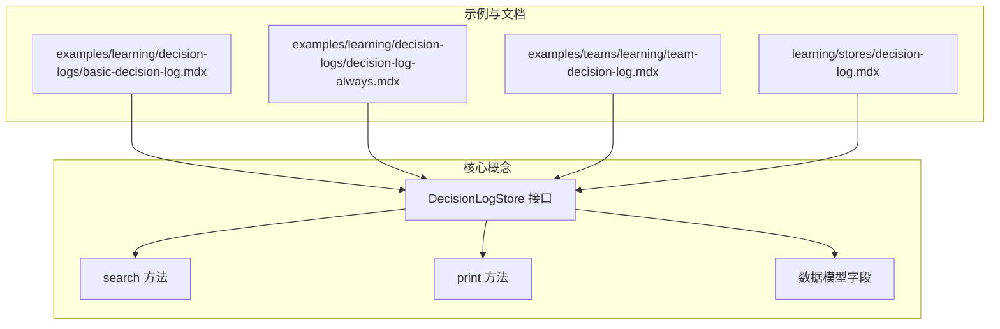
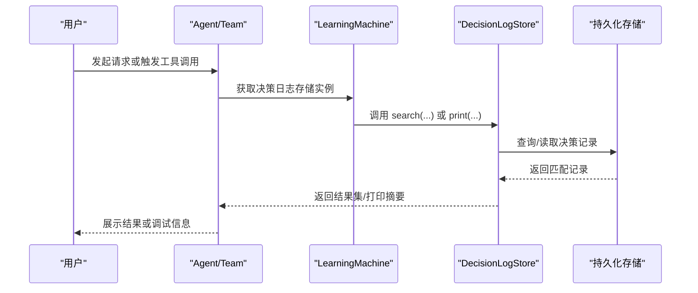
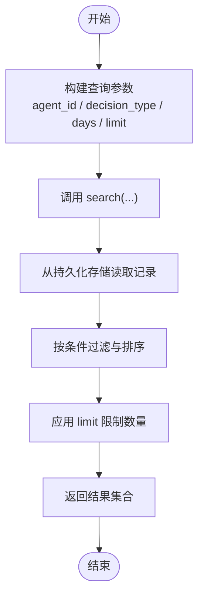
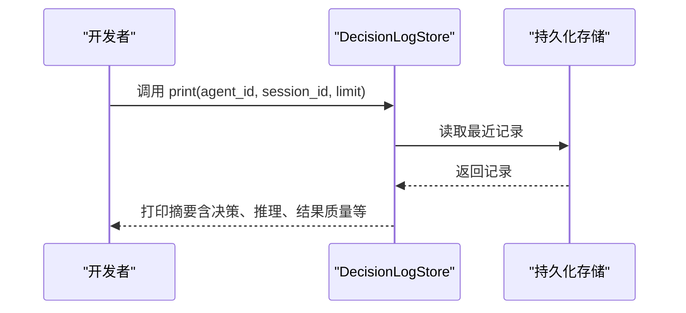
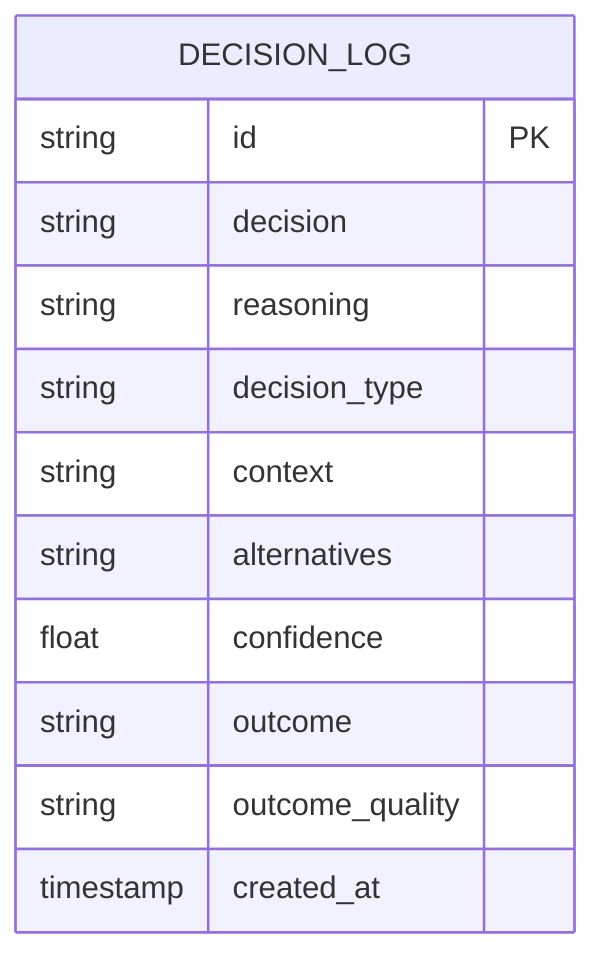

# 决策日志访问与搜索

<cite>
**本文引用的文件**
- [basic-decision-log.mdx](file://examples/learning/decision-logs/basic-decision-log.mdx)
- [decision-log-always.mdx](file://examples/learning/decision-logs/decision-log-always.mdx)
- [team-decision-log.mdx](file://examples/teams/learning/team-decision-log.mdx)
- [decision-log.mdx](file://learning/stores/decision-log.mdx)
</cite>

## 目录
1. [简介](#简介)
2. [项目结构](#项目结构)
3. [核心组件](#核心组件)
4. [架构总览](#架构总览)
5. [详细组件分析](#详细组件分析)
6. [依赖关系分析](#依赖关系分析)
7. [性能考虑](#性能考虑)
8. [故障排查指南](#故障排查指南)
9. [结论](#结论)
10. [附录](#附录)

## 简介
本技术文档聚焦于“决策日志”的访问与搜索能力，系统性阐述如何通过 search 方法进行查询与检索，以及通过 print 方法进行输出展示；并详细说明搜索条件（如按决策类型、时间范围、代理ID等）的设置方式；文档还覆盖搜索结果的处理与分析（排序、分页、导出）、打印格式与可视化思路、实现示例、性能优化建议、批量操作与数据分析方法，以及审计与报告生成的实践指南。

## 项目结构
围绕决策日志的访问与搜索，本仓库提供了多处示例与参考文档，主要分布在以下位置：
- 学习模块：基础用法与自动记录模式的示例
- 团队学习模块：团队场景下的决策日志示例
- 学习存储：决策日志的数据模型、工具与上下文注入说明

图表来源
- [basic-decision-log.mdx:1-90](file://examples/learning/decision-logs/basic-decision-log.mdx#L1-L90)
- [decision-log-always.mdx:1-86](file://examples/learning/decision-logs/decision-log-always.mdx#L1-L86)
- [team-decision-log.mdx:1-133](file://examples/teams/learning/team-decision-log.mdx#L1-L133)
- [decision-log.mdx:1-173](file://learning/stores/decision-log.mdx#L1-L173)

章节来源
- [basic-decision-log.mdx:1-90](file://examples/learning/decision-logs/basic-decision-log.mdx#L1-L90)
- [decision-log-always.mdx:1-86](file://examples/learning/decision-logs/decision-log-always.mdx#L1-L86)
- [team-decision-log.mdx:1-133](file://examples/teams/learning/team-decision-log.mdx#L1-L133)
- [decision-log.mdx:1-173](file://learning/stores/decision-log.mdx#L1-L173)

## 核心组件
- DecisionLogStore：用于记录与检索决策日志的核心存储接口，支持两种模式：
  - Agentic 模式：由代理显式调用工具记录决策
  - Always 模式：自动从工具调用等显著行为中提取并记录决策
- search 方法：用于按条件检索决策日志，返回可迭代的结果集合
- print 方法：用于调试输出，按指定条件打印最近的决策摘要
- 数据模型字段：包含决策标识、决策内容、推理过程、决策类型、上下文、备选方案、置信度、结果、结果质量、创建时间等

章节来源
- [decision-log.mdx:17-137](file://learning/stores/decision-log.mdx#L17-L137)
- [basic-decision-log.mdx:38-76](file://examples/learning/decision-logs/basic-decision-log.mdx#L38-L76)
- [decision-log-always.mdx:38-72](file://examples/learning/decision-logs/decision-log-always.mdx#L38-L72)
- [team-decision-log.mdx:88-119](file://examples/teams/learning/team-decision-log.mdx#L88-L119)

## 架构总览
下图展示了代理在不同模式下如何与决策日志存储交互，并通过 search 与 print 进行访问与调试：

图表来源
- [decision-log.mdx:120-137](file://learning/stores/decision-log.mdx#L120-L137)
- [basic-decision-log.mdx:73-76](file://examples/learning/decision-logs/basic-decision-log.mdx#L73-L76)
- [decision-log-always.mdx:69-72](file://examples/learning/decision-logs/decision-log-always.mdx#L69-L72)
- [team-decision-log.mdx:98-119](file://examples/teams/learning/team-decision-log.mdx#L98-L119)

## 详细组件分析

### search 方法：查询与过滤
- 支持的过滤条件（示例参数）
  - agent_id：按代理ID过滤
  - decision_type：按决策类型过滤（如 tool_selection、response_style、clarification 等）
  - days：按时间范围过滤（例如最近 N 天）
  - limit：限制返回数量（用于分页）
- 返回值
  - 返回一个可遍历的决策记录集合，便于后续处理与分析
- 使用场景
  - 审计：按代理ID与时间范围回溯历史决策
  - 调试：定位特定类型的决策（如工具选择）以分析推理链
  - 分析：统计某类决策的分布与结果质量

图表来源
- [decision-log.mdx:124-130](file://learning/stores/decision-log.mdx#L124-L130)

章节来源
- [decision-log.mdx:120-137](file://learning/stores/decision-log.mdx#L120-L137)

### print 方法：输出格式与调试
- 功能
  - 输出最近的决策摘要，便于快速查看与调试
- 常用参数
  - agent_id：限定代理
  - session_id：限定会话
  - limit：控制输出条数
- 输出特点
  - 以简洁格式呈现关键字段（如决策、推理、结果质量等），帮助快速理解上下文与结果

图表来源
- [decision-log.mdx:135-137](file://learning/stores/decision-log.mdx#L135-L137)
- [basic-decision-log.mdx:73-76](file://examples/learning/decision-logs/basic-decision-log.mdx#L73-L76)
- [decision-log-always.mdx:69-72](file://examples/learning/decision-logs/decision-log-always.mdx#L69-L72)
- [team-decision-log.mdx:99-119](file://examples/teams/learning/team-decision-log.mdx#L99-L119)

章节来源
- [decision-log.mdx:135-137](file://learning/stores/decision-log.mdx#L135-L137)
- [basic-decision-log.mdx:71-76](file://examples/learning/decision-logs/basic-decision-log.mdx#L71-L76)
- [decision-log-always.mdx:67-72](file://examples/learning/decision-logs/decision-log-always.mdx#L67-L72)
- [team-decision-log.mdx:98-119](file://examples/teams/learning/team-decision-log.mdx#L98-L119)

### 数据模型与字段
- 字段概览（用于过滤、排序与展示）
  - id：唯一标识
  - decision：所做决策
  - reasoning：决策理由
  - decision_type：决策类型（如 tool_selection、response_style、clarification 等）
  - context：决策上下文
  - alternatives：备选方案
  - confidence：置信度（0.0~1.0）
  - outcome：实际结果
  - outcome_quality：结果质量（good/bad/neutral）
  - created_at：创建时间
- 应用价值
  - 作为 search 的过滤与排序依据
  - 作为 print 的展示字段来源
  - 作为上下文注入到系统提示词中，辅助后续推理

图表来源
- [decision-log.mdx:89-103](file://learning/stores/decision-log.mdx#L89-L103)

章节来源
- [decision-log.mdx:89-103](file://learning/stores/decision-log.mdx#L89-L103)

### 搜索条件设置与最佳实践
- 按代理ID过滤：用于跨会话、跨任务的审计与对比
- 按决策类型过滤：聚焦特定决策维度（如工具选择、响应风格、澄清等）
- 按时间范围过滤：结合 days 参数限定近期决策，便于快速定位问题
- 组合过滤：将上述条件组合，形成更精确的查询
- 结果处理
  - 排序：通常按 created_at 倒序排列
  - 分页：通过 limit 控制单次返回量；若需翻页，可在客户端维护游标或基于时间窗口滑动
  - 导出：将结果序列化为 CSV/JSON，便于离线分析与报表生成

章节来源
- [decision-log.mdx:124-130](file://learning/stores/decision-log.mdx#L124-L130)

### 批量操作与数据分析
- 批量导出
  - 使用 search 获取全量或分批结果，再统一写入文件或数据库
- 统计分析
  - 计算各类决策类型占比、平均置信度、结果质量分布
  - 按代理ID/会话ID聚合，识别异常模式
- 可视化
  - 将统计结果绘制成柱状图、饼图或趋势图，辅助汇报与复盘

章节来源
- [decision-log.mdx:167-173](file://learning/stores/decision-log.mdx#L167-L173)

### 审计与报告生成实践
- 审计清单
  - 明确审计范围（代理ID、时间区间、决策类型）
  - 对比决策与结果，评估合理性与一致性
- 报告模板
  - 概述：时间段内决策总数、类型分布、结果质量
  - 详情：按代理/会话列出关键决策与推理
  - 建议：针对低质量或高风险决策提出改进建议

章节来源
- [decision-log.mdx:167-173](file://learning/stores/decision-log.mdx#L167-L173)

## 依赖关系分析
- 组件耦合
  - Agent/Team 通过 LearningMachine 获取 DecisionLogStore 实例
  - DecisionLogStore 依赖持久化存储完成数据读写
- 关键依赖链
  - Agent → LearningMachine → DecisionLogStore → 持久化存储
- 外部集成点
  - 数据库连接（示例中使用 PostgresDb）
  - 工具调用（Always 模式下自动记录工具调用）

图表来源
- [basic-decision-log.mdx:32-58](file://examples/learning/decision-logs/basic-decision-log.mdx#L32-L58)
- [decision-log-always.mdx:31-54](file://examples/learning/decision-logs/decision-log-always.mdx#L31-L54)
- [team-decision-log.mdx:32-74](file://examples/teams/learning/team-decision-log.mdx#L32-L74)

章节来源
- [basic-decision-log.mdx:32-58](file://examples/learning/decision-logs/basic-decision-log.mdx#L32-L58)
- [decision-log-always.mdx:31-54](file://examples/learning/decision-logs/decision-log-always.mdx#L31-L54)
- [team-decision-log.mdx:32-74](file://examples/teams/learning/team-decision-log.mdx#L32-L74)

## 性能考虑
- 查询优化
  - 为 created_at、agent_id、decision_type 建立索引，提升过滤与排序效率
  - 合理使用 days 与 limit，避免一次性加载过多数据
- 分页策略
  - 基于时间窗口滑动分页，减少大 offset 场景下的扫描成本
- 导出与分析
  - 对大数据量导出采用流式写入，避免内存峰值
  - 在分析阶段使用列式存储或专用 OLAP 引擎

## 故障排查指南
- 无法获取决策日志
  - 检查 LearningMachine 是否正确配置 DecisionLogConfig
  - 确认数据库连接正常
- 查询无结果
  - 核对过滤条件是否过于严格（如 agent_id、days、decision_type）
  - 验证 created_at 字段是否正确写入
- 输出为空
  - 确认 print 的参数（agent_id/session_id/limit）是否合理
  - 检查是否有足够数据满足条件

章节来源
- [decision-log.mdx:17-87](file://learning/stores/decision-log.mdx#L17-L87)

## 结论
决策日志是实现可观测性、审计与持续改进的关键基础设施。通过明确的过滤条件、规范的输出格式与完善的分析流程，可以高效地定位问题、总结经验并指导后续优化。建议在生产环境中结合索引、分页与导出策略，确保查询与分析的性能与稳定性。

## 附录
- 示例路径
  - 基础用法示例：[basic-decision-log.mdx:1-90](file://examples/learning/decision-logs/basic-decision-log.mdx#L1-L90)
  - 自动记录示例：[decision-log-always.mdx:1-86](file://examples/learning/decision-logs/decision-log-always.mdx#L1-L86)
  - 团队决策示例：[team-decision-log.mdx:1-133](file://examples/teams/learning/team-decision-log.mdx#L1-L133)
- 文档参考
  - 决策日志文档：[decision-log.mdx:1-173](file://learning/stores/decision-log.mdx#L1-L173)