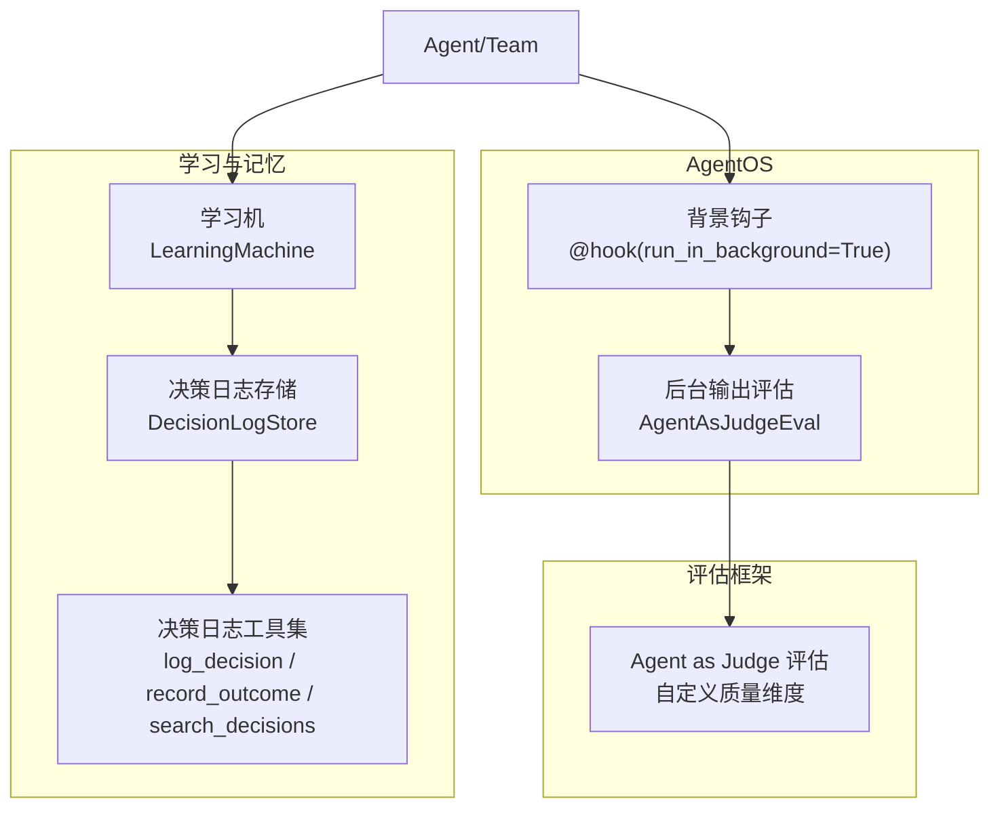
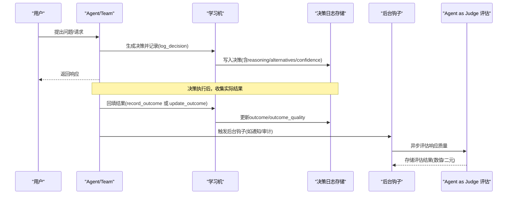
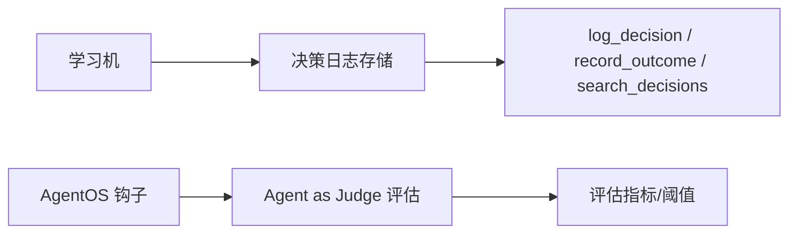

# 决策结果记录

<cite>
**本文引用的文件**
- [决策日志：基础用法](file://examples/learning/decision-logs/basic-decision-log.mdx)
- [决策日志：总是模式（自动记录）](file://examples/learning/decision-logs/decision-log-always.mdx)
- [团队学习：决策日志](file://examples/teams/learning/team-decision-log.mdx)
- [决策日志](file://learning/stores/decision-log.mdx)
- [学习模式](file://learning/learning-modes.mdx)
- [AgentOS 背景输出评估](file://agent-os/usage/background-output-evaluation.mdx)
- [背景钩子（按钩子）](file://agent-os/usage/background-hooks-decorator.mdx)
- [Agent as Judge 评估：概述](file://evals/agent-as-judge/overview.mdx)
- [Agent as Judge 评估：基本用法](file://examples/evals/agent-as-judge/agent-as-judge-basic.mdx)
- [Agent as Judge 评估：团队用法](file://examples/evals/agent-as-judge/agent-as-judge-team.mdx)
- [Agent as Judge 评估：批量用法](file://examples/evals/agent-as-judge/agent-as-judge-batch.mdx)
- [Agent as Judge 评估：后置钩子](file://examples/evals/agent-as-judge/agent-as-judge-post-hook.mdx)
</cite>

## 目录
1. [简介](#简介)
2. [项目结构](#项目结构)
3. [核心组件](#核心组件)
4. [架构总览](#架构总览)
5. [详细组件分析](#详细组件分析)
6. [依赖关系分析](#依赖关系分析)
7. [性能考量](#性能考量)
8. [故障排查指南](#故障排查指南)
9. [结论](#结论)
10. [附录](#附录)

## 简介
本技术文档聚焦“决策结果记录”能力，系统阐述如何在智能体与团队系统中记录决策的实际结果与效果评估，包括：
- 使用 update_outcome 方法与 record_outcome 工具更新已记录决策的结果与质量等级
- 结果记录的数据模型与字段规范
- 质量等级定义（好、坏、中性）
- 记录时机与触发条件（同步/异步、自动/手动）
- 建立有效的反馈循环与持续改进机制
- 实现示例路径与最佳实践
- 结果分析与模式识别方法
- 决策结果跟踪与监控策略

## 项目结构
围绕决策结果记录，相关知识与示例分布在以下位置：
- 学习与记忆体系中的“决策日志”存储与工具
- AgentOS 的背景钩子与输出评估机制
- Agent as Judge 评估框架用于质量评分与阈值控制
- 示例工程展示不同模式下的决策记录与结果回填

图表来源
- [决策日志:1-173](file://learning/stores/decision-log.mdx#L1-L173)
- [学习模式:1-147](file://learning/learning-modes.mdx#L1-L147)
- [AgentOS 背景输出评估:114-158](file://agent-os/usage/background-output-evaluation.mdx#L114-L158)
- [背景钩子（按钩子）:1-144](file://agent-os/usage/background-hooks-decorator.mdx#L1-L144)
- [Agent as Judge 评估：概述:1-100](file://evals/agent-as-judge/overview.mdx#L1-L100)

章节来源
- [决策日志:1-173](file://learning/stores/decision-log.mdx#L1-L173)
- [学习模式:1-147](file://learning/learning-modes.mdx#L1-L147)
- [AgentOS 背景输出评估:114-158](file://agent-os/usage/background-output-evaluation.mdx#L114-L158)
- [背景钩子（按钩子）:1-144](file://agent-os/usage/background-hooks-decorator.mdx#L1-L144)
- [Agent as Judge 评估：概述:1-100](file://evals/agent-as-judge/overview.mdx#L1-L100)

## 核心组件
- 决策日志存储（DecisionLogStore）
  - 记录决策内容、理由、上下文、替代方案、置信度、结果与质量等级等
  - 支持通过工具或直接调用接口进行结果回填
- 学习机（LearningMachine）
  - 统一协调多个学习存储，其中包含决策日志配置与模式
- 决策日志工具集
  - log_decision：记录新决策
  - record_outcome：回填结果与质量等级
  - search_decisions：检索历史决策
- AgentOS 钩子与后台评估
  - 后台钩子不阻塞响应，适合非关键性评估与通知
  - Agent as Judge 评估可作为后置钩子或独立运行，提供数值/二元评分
- 评估框架（Agent as Judge）
  - 自定义质量标准、评分策略（数值/二元）、阈值与失败回调

章节来源
- [决策日志:63-118](file://learning/stores/decision-log.mdx#L63-L118)
- [学习模式:65-73](file://learning/learning-modes.mdx#L65-L73)
- [AgentOS 背景输出评估:114-158](file://agent-os/usage/background-output-evaluation.mdx#L114-L158)
- [Agent as Judge 评估：概述:1-100](file://evals/agent-as-judge/overview.mdx#L1-L100)

## 架构总览
下图展示了从“决策生成”到“结果回填与评估”的闭环流程，以及与后台评估、钩子系统的集成。

图表来源
- [决策日志:104-118](file://learning/stores/decision-log.mdx#L104-L118)
- [AgentOS 背景输出评估:114-158](file://agent-os/usage/background-output-evaluation.mdx#L114-L158)
- [Agent as Judge 评估：概述:1-100](file://evals/agent-as-judge/overview.mdx#L1-L100)

## 详细组件分析

### 数据模型与字段规范
- 字段清单与含义
  - id：唯一标识
  - decision：所做决策
  - reasoning：决策理由
  - decision_type：决策类型（如 tool_selection、response_style、clarification、escalation、approach）
  - context：决策上下文
  - alternatives：考虑的替代方案
  - confidence：置信度（0.0–1.0）
  - outcome：实际发生的结果
  - outcome_quality：结果质量等级（好、坏、中性）
  - created_at：创建时间
- 上下文注入
  - 最近决策会注入到系统提示词中，辅助后续推理与一致性

章节来源
- [决策日志:89-102](file://learning/stores/decision-log.mdx#L89-L102)
- [决策日志:139-153](file://learning/stores/decision-log.mdx#L139-L153)

### 结果记录工具与方法
- record_outcome 工具
  - 在对话过程中由代理显式调用，回填 outcome 与 outcome_quality
- update_outcome 接口
  - 直接通过决策日志存储更新已有决策的结果信息
- 模式选择
  - Agentic 模式：代理自行决定何时记录
  - Always 模式：自动记录工具调用等显著决策

章节来源
- [决策日志:104-118](file://learning/stores/decision-log.mdx#L104-L118)
- [学习模式:65-73](file://learning/learning-modes.mdx#L65-L73)

### 质量等级定义与评估
- 质量等级
  - 好、坏、中性
- 评估维度参考
  - 可结合 Agent as Judge 评估框架，定义具体质量标准与评分策略
  - 数值型评分可用于量化质量趋势；二元评分用于快速判定是否达标
- 阈值与失败处理
  - 可设置阈值与 on_fail 回调，用于告警或触发重试/修正流程

章节来源
- [Agent as Judge 评估：概述:1-100](file://evals/agent-as-judge/overview.mdx#L1-L100)
- [Agent as Judge 评估：基本用法:40-79](file://examples/evals/agent-as-judge/agent-as-judge-basic.mdx#L40-L79)
- [Agent as Judge 评估：团队用法:47-91](file://examples/evals/agent-as-judge/agent-as-judge-team.mdx#L47-L91)
- [Agent as Judge 评估：批量用法:1-29](file://examples/evals/agent-as-judge/agent-as-judge-batch.mdx#L1-L29)
- [Agent as Judge 评估：后置钩子:46-81](file://examples/evals/agent-as-judge/agent-as-judge-post-hook.mdx#L46-L81)

### 记录时机与触发条件
- 同步钩子
  - 适用于必须在返回前完成的关键评估（如输出验证），确保阻断低质量响应
- 异步钩子
  - 适用于非关键性任务（如通知、审计、质量统计），不阻塞用户响应
- 自动记录
  - Always 模式下，工具调用等显著行为自动写入决策日志
- 手动记录
  - Agentic 模式下，代理根据重要性选择性记录

章节来源
- [背景钩子（按钩子）:125-142](file://agent-os/usage/background-hooks-decorator.mdx#L125-L142)
- [AgentOS 背景输出评估:114-158](file://agent-os/usage/background-output-evaluation.mdx#L114-L158)
- [决策日志:67-87](file://learning/stores/decision-log.mdx#L67-L87)

### 建立反馈循环与持续改进
- 反馈闭环
  - 记录决策 → 执行 → 收集结果 → 回填质量等级 → 分析模式 → 迭代指令/策略
- 模式识别
  - 基于决策类型、质量等级分布与上下文特征，识别高成功率策略与常见陷阱
- 指令优化
  - 将成功模式沉淀为系统提示词的一部分，提升后续表现

章节来源
- [决策日志:167-173](file://learning/stores/decision-log.mdx#L167-L173)

### 实现示例与最佳实践
- 示例路径
  - [决策日志：基础用法:1-90](file://examples/learning/decision-logs/basic-decision-log.mdx#L1-L90)
  - [决策日志：总是模式（自动记录）:1-86](file://examples/learning/decision-logs/decision-log-always.mdx#L1-L86)
  - [团队学习：决策日志:1-133](file://examples/teams/learning/team-decision-log.mdx#L1-L133)
- 最佳实践
  - 明确决策类型与质量等级定义，保持一致性
  - 在关键路径使用同步钩子保障质量门槛
  - 对非关键性任务采用异步钩子，避免影响响应时延
  - 定期检索与分析决策日志，提炼可复用模式

章节来源
- [决策日志：基础用法:1-90](file://examples/learning/decision-logs/basic-decision-log.mdx#L1-L90)
- [决策日志：总是模式（自动记录）:1-86](file://examples/learning/decision-logs/decision-log-always.mdx#L1-L86)
- [团队学习：决策日志:1-133](file://examples/teams/learning/team-decision-log.mdx#L1-L133)

### 结果分析与模式识别
- 检索与打印
  - 支持按 agent_id、决策类型、时间窗口等条件检索与打印
- 分析维度
  - 聚合质量等级分布、决策类型占比、置信度与结果一致性
- 模式提炼
  - 识别高成功率的工具选择、响应风格与澄清策略

章节来源
- [决策日志:120-137](file://learning/stores/decision-log.mdx#L120-L137)

### 决策结果跟踪与监控策略
- 后台评估
  - 使用 Agent as Judge 评估框架对输出进行异步质量评估，并持久化结果
- 告警与扩展
  - 失败回调可用于发送告警、触发重试或降级策略
- 生产扩展
  - 数据库存储用于仪表盘与报表；可观测性平台对接；A/B 测试对比模型版本；构建训练数据集

章节来源
- [AgentOS 背景输出评估:125-139](file://agent-os/usage/background-output-evaluation.mdx#L125-L139)
- [Agent as Judge 评估：概述:1-100](file://evals/agent-as-judge/overview.mdx#L1-L100)

## 依赖关系分析
- 决策日志存储依赖学习机配置与工具集
- AgentOS 钩子与后台评估相互解耦，可按需启用
- 评估框架与钩子系统共同构成质量保障层

图表来源
- [学习模式:65-73](file://learning/learning-modes.mdx#L65-L73)
- [AgentOS 背景输出评估:114-158](file://agent-os/usage/background-output-evaluation.mdx#L114-L158)
- [Agent as Judge 评估：概述:1-100](file://evals/agent-as-judge/overview.mdx#L1-L100)

章节来源
- [学习模式:65-73](file://learning/learning-modes.mdx#L65-L73)
- [AgentOS 背景输出评估:114-158](file://agent-os/usage/background-output-evaluation.mdx#L114-L158)
- [Agent as Judge 评估：概述:1-100](file://evals/agent-as-judge/overview.mdx#L1-L100)

## 性能考量
- Always 模式可能产生较多决策记录，注意权衡噪声与收益
- 后台钩子与异步评估可降低主链路延迟，但需关注资源占用与队列积压
- 评估阈值与失败回调应合理设置，避免过度干预或漏检

## 故障排查指南
- 记录未生效
  - 检查学习机模式配置（Agentic/Always）
  - 确认工具启用状态与权限
- 结果未回填
  - 确认决策 ID 正确且存在
  - 检查 update_outcome 调用参数与存储连接
- 评估异常
  - 查看评估数据库连接与持久化状态
  - 检查阈值与回调逻辑

章节来源
- [学习模式:101-122](file://learning/learning-modes.mdx#L101-L122)
- [决策日志:104-118](file://learning/stores/decision-log.mdx#L104-L118)
- [AgentOS 背景输出评估:125-139](file://agent-os/usage/background-output-evaluation.mdx#L125-L139)

## 结论
通过统一的决策日志存储与工具集、结合 AgentOS 的钩子与后台评估机制，可以构建从“决策生成—执行—结果回填—评估—反馈改进”的完整闭环。明确的质量等级定义、合理的记录时机与触发条件、以及持续的模式识别与分析，将显著提升智能体与团队系统的稳定性与性能。

## 附录
- 示例工程入口
  - [决策日志：基础用法:78-89](file://examples/learning/decision-logs/basic-decision-log.mdx#L78-L89)
  - [决策日志：总是模式（自动记录）:74-85](file://examples/learning/decision-logs/decision-log-always.mdx#L74-L85)
  - [团队学习：决策日志:121-132](file://examples/teams/learning/team-decision-log.mdx#L121-L132)
- 评估示例入口
  - [Agent as Judge 评估：基本用法:71-79](file://examples/evals/agent-as-judge/agent-as-judge-basic.mdx#L71-L79)
  - [Agent as Judge 评估：团队用法:61-70](file://examples/evals/agent-as-judge/agent-as-judge-team.mdx#L61-L70)
  - [Agent as Judge 评估：批量用法:1-29](file://examples/evals/agent-as-judge/agent-as-judge-batch.mdx#L1-L29)
  - [Agent as Judge 评估：后置钩子:73-81](file://examples/evals/agent-as-judge/agent-as-judge-post-hook.mdx#L73-L81)