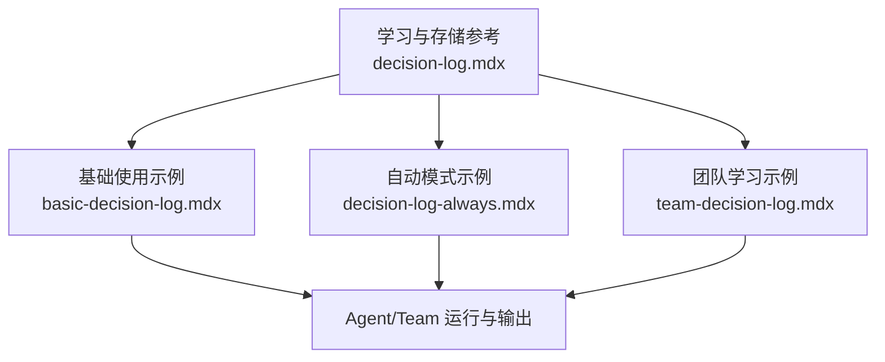
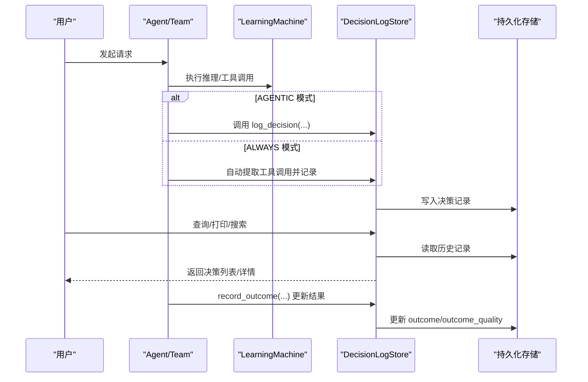
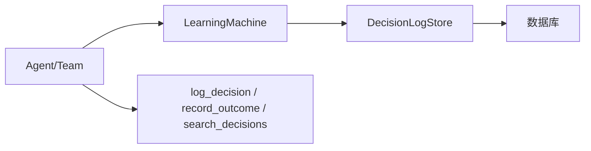

# 基础决策日志

<cite>
**本文引用的文件**
- [基础使用：决策日志](file://learning/stores/decision-log.mdx)
- [示例：基础决策日志](file://examples/learning/decision-logs/basic-decision-log.mdx)
- [示例：自动决策日志（ALWAYS 模式）](file://examples/learning/decision-logs/decision-log-always.mdx)
- [示例：团队学习与决策日志](file://examples/teams/learning/team-decision-log.mdx)
</cite>

## 目录
1. [简介](#简介)
2. [项目结构](#项目结构)
3. [核心组件](#核心组件)
4. [架构总览](#架构总览)
5. [组件详解](#组件详解)
6. [依赖关系分析](#依赖关系分析)
7. [性能考量](#性能考量)
8. [故障排查指南](#故障排查指南)
9. [结论](#结论)
10. [附录](#附录)

## 简介
本篇文档围绕“基础决策日志”展开，系统阐述其工作原理、配置方法与使用模式，覆盖以下主题：
- 如何启用与使用决策日志存储
- 决策记录的创建、存储与查询机制
- 决策日志的数据结构（字段、推理内容、替代方案、结果记录）
- 配置选项与参数设置
- 实现示例与最佳实践
- 搜索与过滤能力
- 在代理与团队中的集成方式

## 项目结构
决策日志相关内容主要分布在以下位置：
- 学习与存储参考：learning/stores/decision-log.mdx
- 示例：基础使用与 ALWAYS 模式：examples/learning/decision-logs/*
- 团队学习与决策日志：examples/teams/learning/team-decision-log.mdx

**图表来源**
- [基础使用：决策日志:1-172](file://learning/stores/decision-log.mdx#L1-L172)
- [示例：基础决策日志:1-90](file://examples/learning/decision-logs/basic-decision-log.mdx#L1-L90)
- [示例：自动决策日志（ALWAYS 模式）:1-86](file://examples/learning/decision-logs/decision-log-always.mdx#L1-L86)
- [示例：团队学习与决策日志:1-133](file://examples/teams/learning/team-decision-log.mdx#L1-L133)

**章节来源**
- [基础使用：决策日志:1-172](file://learning/stores/decision-log.mdx#L1-L172)
- [示例：基础决策日志:1-90](file://examples/learning/decision-logs/basic-decision-log.mdx#L1-L90)
- [示例：自动决策日志（ALWAYS 模式）:1-86](file://examples/learning/decision-logs/decision-log-always.mdx#L1-L86)
- [示例：团队学习与决策日志:1-133](file://examples/teams/learning/team-decision-log.mdx#L1-L133)

## 核心组件
- 决策日志存储（DecisionLogStore）
  - 记录代理做出的决策，包含推理、上下文、替代方案与结果
  - 支持两种模式：AGENTIC（显式记录）、ALWAYS（自动记录）
  - 提供打印、搜索、更新结果等能力
- 学习机（LearningMachine）
  - 将决策日志配置注入到代理或团队的学习流程中
- 工具集（log_decision、record_outcome、search_decisions）
  - AGENTIC 模式下由代理使用这些工具进行显式记录与检索

**章节来源**
- [基础使用：决策日志:8-172](file://learning/stores/decision-log.mdx#L8-L172)

## 架构总览
决策日志贯穿“配置—运行—记录—查询—反馈”的闭环：

**图表来源**
- [基础使用：决策日志:17-137](file://learning/stores/decision-log.mdx#L17-L137)
- [示例：基础决策日志:37-76](file://examples/learning/decision-logs/basic-decision-log.mdx#L37-L76)
- [示例：自动决策日志（ALWAYS 模式）:36-72](file://examples/learning/decision-logs/decision-log-always.mdx#L36-L72)
- [示例：团队学习与决策日志:54-118](file://examples/teams/learning/team-decision-log.mdx#L54-L118)

## 组件详解

### 数据模型与字段
- 字段概览
  - id：唯一标识
  - decision：做出了什么决定
  - reasoning：为什么这样决定
  - decision_type：决策类型（如 tool_selection、response_style、clarification 等）
  - context：触发决策的上下文
  - alternatives：考虑过的其他选项
  - confidence：置信度（0.0~1.0）
  - outcome：实际发生的结果
  - outcome_quality：结果质量（如 good/bad/neutral）
  - created_at：决策时间
- 使用场景
  - 审计：查看代理为何做出某决定
  - 调试：结合 reasoning 与 alternatives 分析异常
  - 学习：通过 outcome/outcome_quality 形成反馈循环
  - 上下文注入：近期决策被注入系统提示，增强一致性

**章节来源**
- [基础使用：决策日志:89-172](file://learning/stores/decision-log.mdx#L89-L172)

### 配置与模式
- 默认与支持模式
  - 默认模式：ALWAYS（自动记录）
  - 支持模式：ALWAYS、AGENTIC
- AGENTIC 模式要点
  - 代理具备显式记录工具：log_decision、record_outcome、search_decisions
  - 由代理自行判断何时值得记录
- ALWAYS 模式要点
  - 自动从工具调用等显著行为中抽取决策
  - 可能产生噪声，需权衡

**章节来源**
- [基础使用：决策日志:10-88](file://learning/stores/decision-log.mdx#L10-L88)

### 基本使用模式
- 创建代理并启用学习机与决策日志
  - 选择模式（AGENTIC 或 ALWAYS）
  - 配置数据库连接以持久化
- 运行对话
  - AGENTIC：显式调用 log_decision 记录重要决策
  - ALWAYS：工具调用自动记录
- 查看与检索
  - 使用 print 输出最近决策
  - 使用 search 按条件过滤（如 agent_id、days、decision_type 等）

**章节来源**
- [基础使用：决策日志:17-137](file://learning/stores/decision-log.mdx#L17-L137)
- [示例：基础决策日志:37-76](file://examples/learning/decision-logs/basic-decision-log.mdx#L37-L76)
- [示例：自动决策日志（ALWAYS 模式）:36-72](file://examples/learning/decision-logs/decision-log-always.mdx#L36-L72)

### 决策类型与建议
常见决策类型包括：
- tool_selection：选择调用哪个工具
- response_style：决定如何组织语言风格
- clarification：是否需要进一步澄清
- escalation：是否需要转交人类
- approach：在多个策略间做取舍

**章节来源**
- [基础使用：决策日志:155-166](file://learning/stores/decision-log.mdx#L155-L166)

### 搜索与过滤
- 支持按 agent_id、days、limit、decision_type 等条件检索
- 检索结果可用于审计、统计与反馈优化

**章节来源**
- [基础使用：决策日志:120-137](file://learning/stores/decision-log.mdx#L120-L137)

### 在代理与团队中的集成
- 代理（Agent）
  - 通过 LearningMachine 注入决策日志配置
  - AGENTIC 模式下可直接使用 log_decision、record_outcome、search_decisions
- 团队（Team）
  - 团队级别的学习机同样支持决策日志
  - 可按会话维度（session_id）查看与对比不同阶段的决策

**章节来源**
- [示例：基础决策日志:37-76](file://examples/learning/decision-logs/basic-decision-log.mdx#L37-L76)
- [示例：团队学习与决策日志:54-118](file://examples/teams/learning/team-decision-log.mdx#L54-L118)

### 实现示例与最佳实践
- 示例一：基础使用（AGENTIC）
  - 步骤：创建数据库连接 → 创建代理（AGENTIC 模式）→ 设置指令 → 运行对话 → 打印决策
  - 关键点：明确何时记录（由代理自行判断），强调 reasoning 与 alternatives
- 示例二：自动模式（ALWAYS）
  - 步骤：创建数据库连接 → 创建代理（ALWAYS 模式）→ 注册工具 → 运行对话 → 打印自动记录
  - 关键点：工具调用即记录；注意可能的噪音
- 示例三：团队学习与决策日志
  - 步骤：定义成员角色 → 创建团队（AGENTIC 模式）→ 多轮会话决策 → 按会话查看
  - 关键点：跨成员的决策可对比，便于审计与复盘

**章节来源**
- [示例：基础决策日志:1-90](file://examples/learning/decision-logs/basic-decision-log.mdx#L1-L90)
- [示例：自动决策日志（ALWAYS 模式）:1-86](file://examples/learning/decision-logs/decision-log-always.mdx#L1-L86)
- [示例：团队学习与决策日志:1-133](file://examples/teams/learning/team-decision-log.mdx#L1-L133)

## 依赖关系分析
- 组件耦合
  - LearningMachine 与 DecisionLogStore 强耦合：前者负责装配后者的能力
  - AGENTIC 模式下，代理与工具（log_decision、record_outcome、search_decisions）弱耦合，便于扩展
- 外部依赖
  - 数据库：用于持久化决策记录（示例中使用 PostgresDb）
- 潜在风险
  - ALWAYS 模式可能产生大量记录，需配合 limit 与过滤策略
  - AGENTIC 模式对代理指令与工具可用性有依赖

**图表来源**
- [基础使用：决策日志:17-137](file://learning/stores/decision-log.mdx#L17-L137)
- [示例：基础决策日志:37-76](file://examples/learning/decision-logs/basic-decision-log.mdx#L37-L76)
- [示例：自动决策日志（ALWAYS 模式）:36-72](file://examples/learning/decision-logs/decision-log-always.mdx#L36-L72)
- [示例：团队学习与决策日志:54-118](file://examples/teams/learning/team-decision-log.mdx#L54-L118)

**章节来源**
- [基础使用：决策日志:17-137](file://learning/stores/decision-log.mdx#L17-L137)

## 性能考量
- ALWAYS 模式可能频繁写入，建议：
  - 合理设置 limit 与 days 过滤
  - 对高频工具调用进行采样或聚合
- AGENTIC 模式建议：
  - 明确“何时值得记录”的规则，避免冗余
  - 结合 outcome 的周期性评估，减少无效记录
- 存储层优化：
  - 使用合适的数据库（示例采用 PostgresDb），确保索引与查询条件匹配

[本节为通用指导，不直接分析具体文件]

## 故障排查指南
- 无法看到任何决策记录
  - 检查是否正确启用 LearningMachine 与 DecisionLogConfig
  - 确认数据库连接正常且表已初始化
- AGENTIC 模式未记录
  - 确认代理具备 log_decision、record_outcome、search_decisions 工具
  - 检查指令是否引导代理在合适时机调用
- ALWAYS 模式记录过多
  - 调整过滤条件（如 days、decision_type）
  - 考虑切换至 AGENTIC 模式以提升可控性
- 结果未更新
  - 确认使用 record_outcome 或 store.update_outcome 更新 outcome 与 outcome_quality

**章节来源**
- [基础使用：决策日志:104-137](file://learning/stores/decision-log.mdx#L104-L137)

## 结论
- 决策日志是构建可审计、可调试、可持续改进的智能体系统的关键基础设施
- 通过 AGENTIC 与 ALWAYS 两种模式，可在可控性与自动化之间取得平衡
- 建议在生产环境中结合过滤、采样与上下文注入，形成闭环的反馈学习体系

[本节为总结性内容，不直接分析具体文件]

## 附录

### 快速上手清单
- 选择模式：AGENTIC 或 ALWAYS
- 配置数据库：确保连接可用
- 运行对话：观察是否按预期记录
- 检索与审计：使用 print/search 获取所需信息
- 反馈闭环：record_outcome 更新结果质量

**章节来源**
- [基础使用：决策日志:17-137](file://learning/stores/decision-log.mdx#L17-L137)