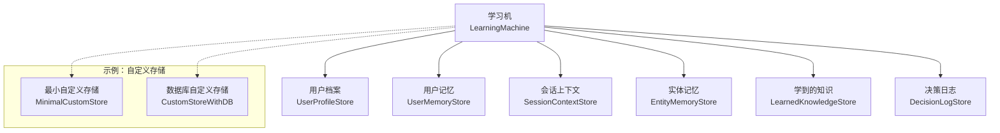
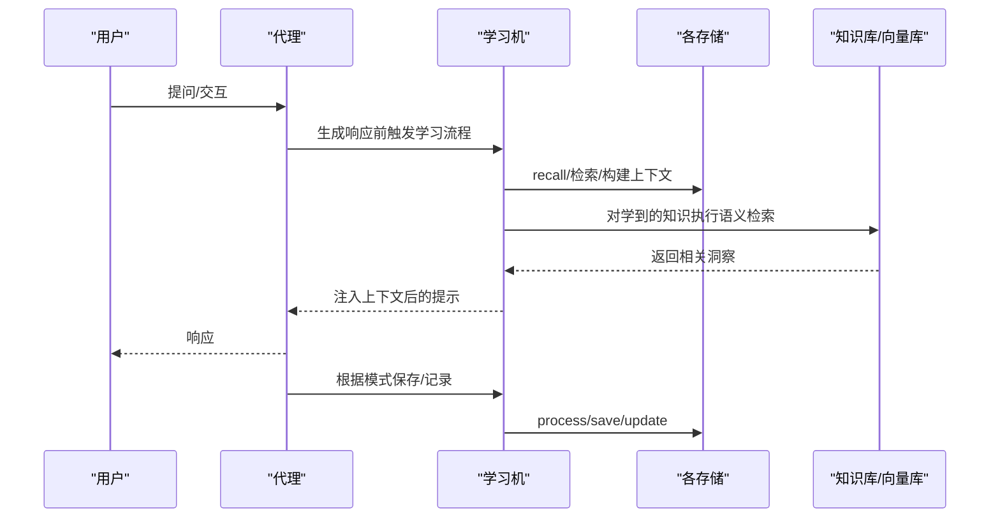
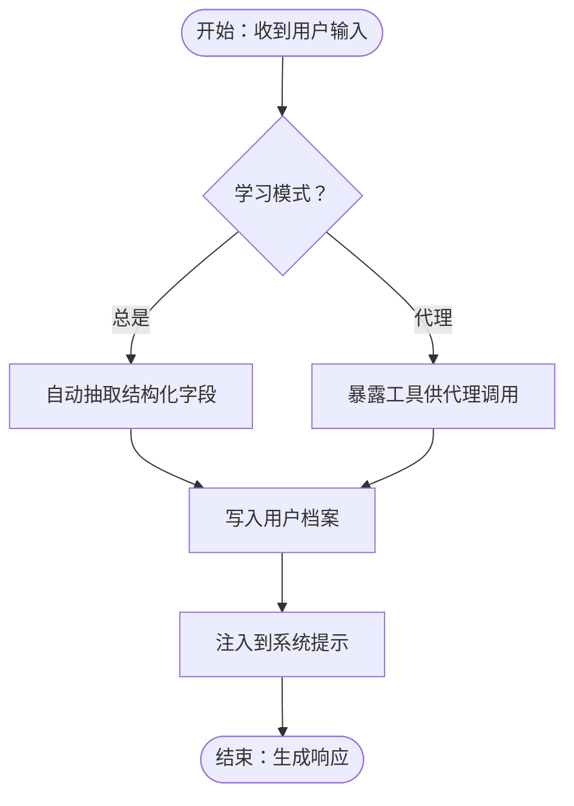
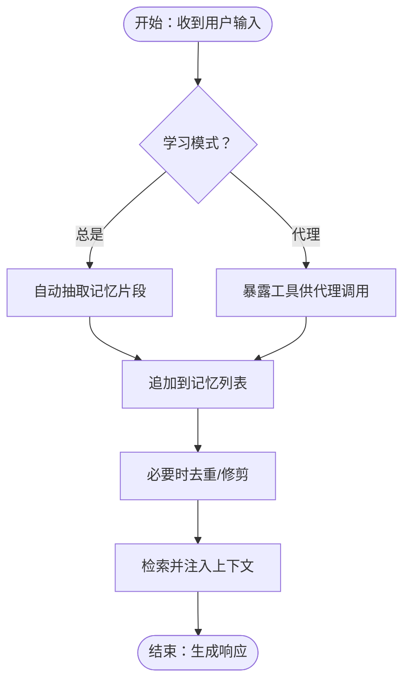
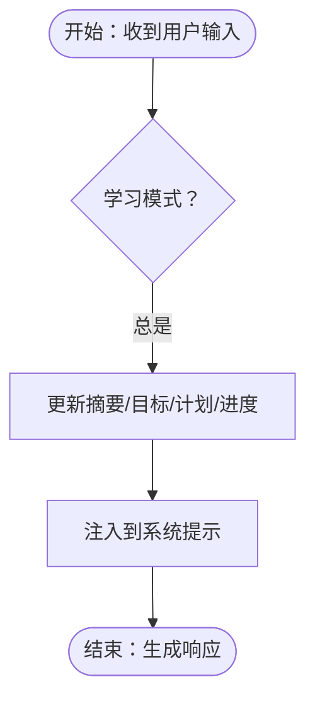
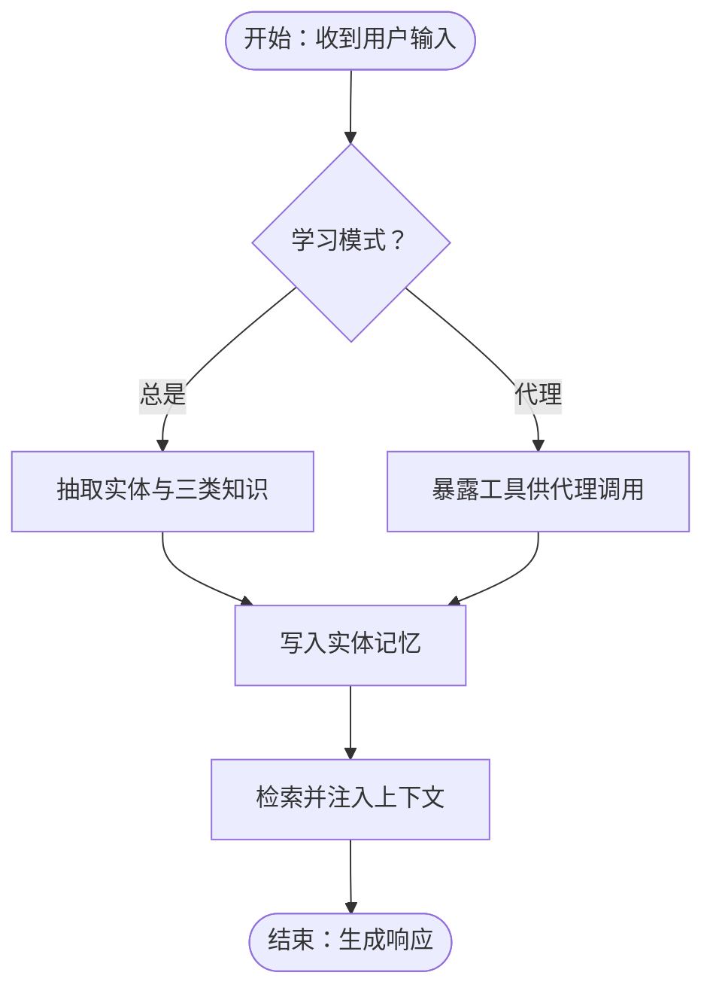
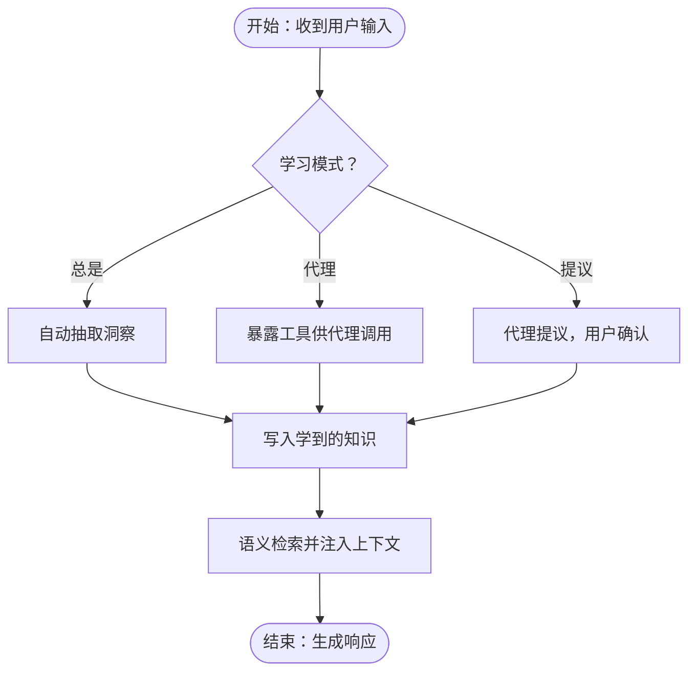
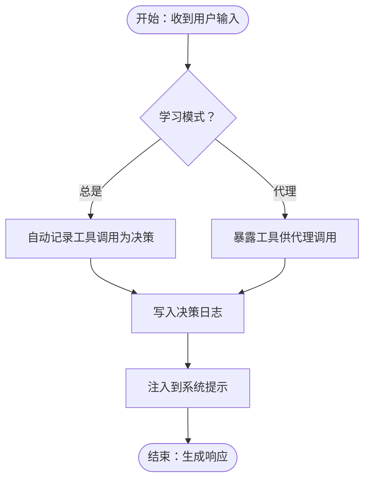
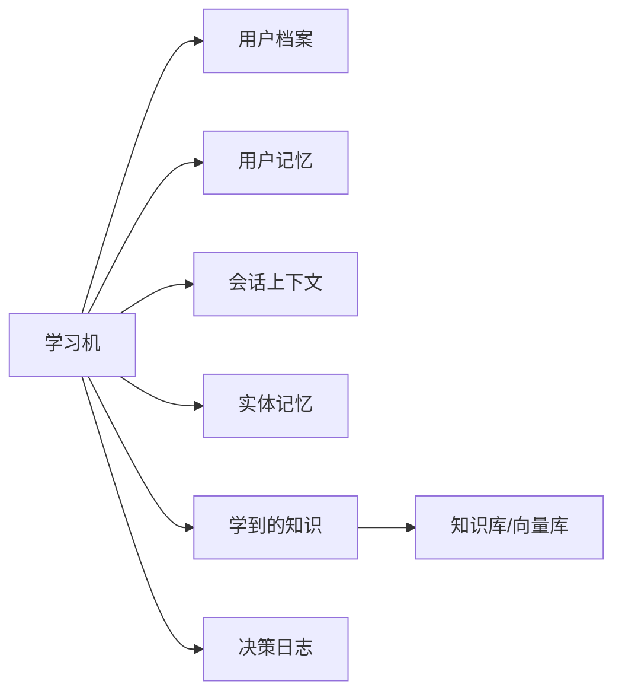

# 学习存储

<cite>
**本文引用的文件**
- [学习存储总览](file://learning/stores/intro.mdx)
- [用户档案](file://learning/stores/user-profile.mdx)
- [用户记忆](file://learning/stores/user-memory.mdx)
- [会话上下文](file://learning/stores/session-context.mdx)
- [实体记忆](file://learning/stores/entity-memory.mdx)
- [学到的知识](file://learning/stores/learned-knowledge.mdx)
- [决策日志](file://learning/stores/decision-log.mdx)
- [学习模式](file://learning/learning-modes.mdx)
- [自定义存储：最小示例](file://examples/learning/custom-stores/minimal-custom-store.mdx)
- [自定义存储：数据库示例](file://examples/learning/custom-stores/custom-store-with-db.mdx)
</cite>

## 目录
1. [简介](#简介)
2. [项目结构](#项目结构)
3. [核心组件](#核心组件)
4. [架构总览](#架构总览)
5. [详细组件分析](#详细组件分析)
6. [依赖分析](#依赖分析)
7. [性能考量](#性能考量)
8. [故障排查指南](#故障排查指南)
9. [结论](#结论)
10. [附录](#附录)

## 简介
本文件面向学习存储系统，系统性阐述六种学习存储类型的设计理念与实现要点：用户档案、用户记忆、会话上下文、实体记忆、学到的知识、决策日志。内容覆盖数据结构、存储格式、访问方式、生命周期管理（创建/更新/删除/清理）、存储间关系与数据流转、最佳实践与性能优化、自定义存储扩展方法以及数据隐私与安全注意事项。

## 项目结构
学习存储位于“learning/stores”目录下，每种存储类型有独立文档，另有“学习模式”文档统一说明控制策略；“examples/learning/custom-stores”提供了自定义存储的最小与数据库示例。

图表来源
- [学习存储总览:1-70](file://learning/stores/intro.mdx#L1-L70)
- [用户档案:1-168](file://learning/stores/user-profile.mdx#L1-L168)
- [用户记忆:1-162](file://learning/stores/user-memory.mdx#L1-L162)
- [会话上下文:1-164](file://learning/stores/session-context.mdx#L1-L164)
- [实体记忆:1-184](file://learning/stores/entity-memory.mdx#L1-L184)
- [学到的知识:1-214](file://learning/stores/learned-knowledge.mdx#L1-L214)
- [决策日志:1-173](file://learning/stores/decision-log.mdx#L1-L173)
- [自定义存储：最小示例:1-253](file://examples/learning/custom-stores/minimal-custom-store.mdx#L1-L253)
- [自定义存储：数据库示例:1-423](file://examples/learning/custom-stores/custom-store-with-db.mdx#L1-L423)

章节来源
- [学习存储总览:1-70](file://learning/stores/intro.mdx#L1-L70)

## 核心组件
- 用户档案（UserProfile）：结构化字段（姓名、昵称、自定义域），按用户维度持久化，适合自动抽取或由代理显式更新。
- 用户记忆（UserMemory）：非结构化观察与事实，随时间累积，支持检索与人工/自动整理。
- 会话上下文（SessionContext）：当前会话的状态快照（摘要/目标/计划/进度），随会话生命周期更新。
- 实体记忆（EntityMemory）：外部实体（公司、人、项目等）的事实、事件与关系，可按命名空间隔离。
- 学到的知识（LearnedKnowledge）：跨用户的可复用洞察，依赖向量知识库进行语义检索与注入。
- 决策日志（DecisionLog）：代理决策及其推理、替代方案、结果等审计信息，支持自动记录或显式工具记录。

章节来源
- [用户档案:1-168](file://learning/stores/user-profile.mdx#L1-L168)
- [用户记忆:1-162](file://learning/stores/user-memory.mdx#L1-L162)
- [会话上下文:1-164](file://learning/stores/session-context.mdx#L1-L164)
- [实体记忆:1-184](file://learning/stores/entity-memory.mdx#L1-L184)
- [学到的知识:1-214](file://learning/stores/learned-knowledge.mdx#L1-L214)
- [决策日志:1-173](file://learning/stores/decision-log.mdx#L1-L173)

## 架构总览
学习机协调多个存储，每个存储针对特定知识类型优化，并通过统一的上下文注入机制参与提示词构建。不同存储支持不同的学习模式（自动、代理驱动、提议确认），并可组合使用以形成端到端的学习闭环。

图表来源
- [学到的知识:1-214](file://learning/stores/learned-knowledge.mdx#L1-L214)
- [学习模式:1-147](file://learning/learning-modes.mdx#L1-L147)

## 详细组件分析

### 用户档案（UserProfile）
- 数据模型要点
  - 结构化字段：名称、首选名、自定义域（如公司、角色、时区等）
  - 审计上下文：agent_id、team_id
  - 时间戳：创建与更新
- 访问方式
  - 通过学习机实例获取存储对象，按用户ID查询与打印调试
- 上下文注入
  - 自动注入到系统提示中，无需手动拼接
- 生命周期
  - 按用户维度长期保存，更新采用就地替换策略
- 最佳实践
  - 使用自定义数据类扩展结构化域，利用元数据描述字段含义
  - 默认采用“总是”模式以确保一致性

图表来源
- [用户档案:1-168](file://learning/stores/user-profile.mdx#L1-L168)
- [学习模式:1-147](file://learning/learning-modes.mdx#L1-L147)

章节来源
- [用户档案:1-168](file://learning/stores/user-profile.mdx#L1-L168)
- [学习模式:1-147](file://learning/learning-modes.mdx#L1-L147)

### 用户记忆（UserMemory）
- 数据模型要点
  - 列表型记忆条目（含内容与可选元数据）
  - 审计上下文：agent_id、team_id
  - 时间戳：创建与更新
- 访问方式
  - 获取全部记忆列表，支持打印调试
- 上下文注入
  - 通过检索与相似度匹配注入相关记忆片段
- 生命周期
  - 长期保存，支持去重与按年龄修剪
- 最佳实践
  - 将偏好、行为、上下文等非结构化信息放入此处
  - 使用整理器定期维护，避免噪声增长

图表来源
- [用户记忆:1-162](file://learning/stores/user-memory.mdx#L1-L162)
- [学习模式:1-147](file://learning/learning-modes.mdx#L1-L147)

章节来源
- [用户记忆:1-162](file://learning/stores/user-memory.mdx#L1-L162)
- [学习模式:1-147](file://learning/learning-modes.mdx#L1-L147)

### 会话上下文（SessionContext）
- 数据模型要点
  - 会话级快照：摘要、目标、计划、进度
  - 审计上下文：user_id、agent_id、team_id
  - 时间戳：创建与更新
- 访问方式
  - 按会话ID查询，支持打印调试
- 上下文注入
  - 注入到系统提示，便于长对话与任务追踪
- 生命周期
  - 会话生命周期内持续更新，每次更新替换旧值
- 最佳实践
  - 在复杂多步任务中启用规划模式，跟踪目标与进度

图表来源
- [会话上下文:1-164](file://learning/stores/session-context.mdx#L1-L164)
- [学习模式:1-147](file://learning/learning-modes.mdx#L1-L147)

章节来源
- [会话上下文:1-164](file://learning/stores/session-context.mdx#L1-L164)
- [学习模式:1-147](file://learning/learning-modes.mdx#L1-L147)

### 实体记忆（EntityMemory）
- 数据模型要点
  - 实体标识、类型、属性、描述
  - 三类知识：事实（不变）、事件（有时效）、关系（连接）
  - 支持命名空间（全局/用户/自定义）
- 访问方式
  - 搜索实体、打印调试
- 上下文注入
  - 注入相关实体的属性、事实、事件与关系
- 生命周期
  - 长期保存，按命名空间隔离
- 最佳实践
  - 将外部实体（公司、人、项目）纳入知识图谱，提升跨话题一致性

图表来源
- [实体记忆:1-184](file://learning/stores/entity-memory.mdx#L1-L184)
- [学习模式:1-147](file://learning/learning-modes.mdx#L1-L147)

章节来源
- [实体记忆:1-184](file://learning/stores/entity-memory.mdx#L1-L184)
- [学习模式:1-147](file://learning/learning-modes.mdx#L1-L147)

### 学到的知识（LearnedKnowledge）
- 数据模型要点
  - 标题、洞察、适用情境、标签、命名空间、所有者、时间戳
- 访问方式
  - 语义检索、打印调试
- 上下文注入
  - 通过向量检索注入相关洞察
- 生命周期
  - 长期保存，按命名空间共享
- 最佳实践
  - 仅保存非显而易见、可复用、领域内有效且具价值的洞察
  - 可结合“提议”模式在保存前征询用户确认

图表来源
- [学到的知识:1-214](file://learning/stores/learned-knowledge.mdx#L1-L214)
- [学习模式:1-147](file://learning/learning-modes.mdx#L1-L147)

章节来源
- [学到的知识:1-214](file://learning/stores/learned-knowledge.mdx#L1-L214)
- [学习模式:1-147](file://learning/learning-modes.mdx#L1-L147)

### 决策日志（DecisionLog）
- 数据模型要点
  - 决策ID、决策内容、推理、类型、情境、替代方案、置信度、结果与质量、时间戳
- 访问方式
  - 搜索、打印调试、更新结果
- 上下文注入
  - 注入近期决策，辅助反思与一致性
- 生命周期
  - 长期保存，支持自动或代理记录
- 最佳实践
  - 将重大选择、工具选择、响应风格等纳入审计范围；事后补充结果与质量评估

图表来源
- [决策日志:1-173](file://learning/stores/decision-log.mdx#L1-L173)
- [学习模式:1-147](file://learning/learning-modes.mdx#L1-L147)

章节来源
- [决策日志:1-173](file://learning/stores/decision-log.mdx#L1-L173)
- [学习模式:1-147](file://learning/learning-modes.mdx#L1-L147)

## 依赖分析
- 学习机作为编排器，协调各存储的召回、处理与上下文注入。
- “学到的知识”依赖知识库与向量数据库以实现语义检索。
- 各存储支持不同学习模式，模式选择影响是否自动抽取、是否暴露工具、是否需要用户确认。
- 命名空间用于控制可见性与共享范围（全局/用户/自定义）。

图表来源
- [学到的知识:1-214](file://learning/stores/learned-knowledge.mdx#L1-L214)
- [学习模式:1-147](file://learning/learning-modes.mdx#L1-L147)

章节来源
- [学到的知识:1-214](file://learning/stores/learned-knowledge.mdx#L1-L214)
- [学习模式:1-147](file://learning/learning-modes.mdx#L1-L147)

## 性能考量
- 抽取成本
  - “总是”模式会在每次交互后触发额外大模型调用，带来延迟与成本上升；适用于关键结构化信息（如用户档案、会话上下文）。
- 检索成本
  - “学到的知识”依赖向量检索，需权衡混合检索策略与索引规模。
- 存储与查询
  - 选择合适的持久化后端（内存/JSON/关系型/文档型/键值）以满足吞吐与一致性需求。
- 清理与维护
  - 定期对用户记忆进行去重与按龄修剪，降低检索开销与噪声。
- 并发与一致性
  - 多用户/多会话并发场景下，注意命名空间隔离与锁策略。

## 故障排查指南
- 上下文未注入
  - 检查对应存储的recall/build_context实现是否正确返回XML格式文本。
- 学习未生效
  - 确认学习模式配置是否符合预期；代理工具是否被正确暴露。
- 检索不准确
  - 对“学到的知识”，检查嵌入器与向量库配置、分页与过滤参数。
- 权限与命名空间
  - 核对实体记忆与学到的知识的命名空间设置，确保可见性符合预期。
- 数据隐私
  - 对涉及个人敏感信息的存储，启用最小权限与加密传输/存储；限制导出范围与保留期限。

## 结论
学习存储体系通过多类型、多模式的协同，实现了从结构化用户画像到跨用户可迁移洞察的全栈知识管理。合理选择模式、命名空间与后端，配合定期清理与审计，可在保证性能的同时最大化学习收益。

## 附录

### 存储配置与最佳实践速查
- 用户档案：默认“总是”，适合姓名、角色等关键字段；可扩展自定义结构化域。
- 用户记忆：默认“总是”，支持去重与按龄修剪；适合偏好与行为观察。
- 会话上下文：默认“总是”，复杂任务建议启用规划模式。
- 实体记忆：默认“总是”，按命名空间隔离；建议明确关系类型与事件时效。
- 学到的知识：建议“代理”或“提议”模式；仅保存高价值、可复用洞察。
- 决策日志：默认“总是”或“代理”，建议事后补充结果与质量评估。

章节来源
- [学习模式:1-147](file://learning/learning-modes.mdx#L1-L147)
- [用户档案:1-168](file://learning/stores/user-profile.mdx#L1-L168)
- [用户记忆:1-162](file://learning/stores/user-memory.mdx#L1-L162)
- [会话上下文:1-164](file://learning/stores/session-context.mdx#L1-L164)
- [实体记忆:1-184](file://learning/stores/entity-memory.mdx#L1-L184)
- [学到的知识:1-214](file://learning/stores/learned-knowledge.mdx#L1-L214)
- [决策日志:1-173](file://learning/stores/decision-log.mdx#L1-L173)

### 自定义存储实现指南
- 协议与职责
  - 实现学习存储协议的关键方法：识别学习类型、定义数据模式、召回、异步召回、处理、异步处理、构建上下文、获取工具、异步工具、更新标记等。
- 示例参考
  - 最小示例：演示协议实现、上下文传递、注入到学习机。
  - 数据库示例：展示命名空间、数据库持久化、工具暴露、异步操作与错误处理。
- 扩展建议
  - 明确学习类型标识与数据模式；在处理阶段进行智能抽取；提供必要的工具以支持代理驱动；在构建上下文时遵循统一的XML格式以便注入。

章节来源
- [自定义存储：最小示例:1-253](file://examples/learning/custom-stores/minimal-custom-store.mdx#L1-L253)
- [自定义存储：数据库示例:1-423](file://examples/learning/custom-stores/custom-store-with-db.mdx#L1-L423)