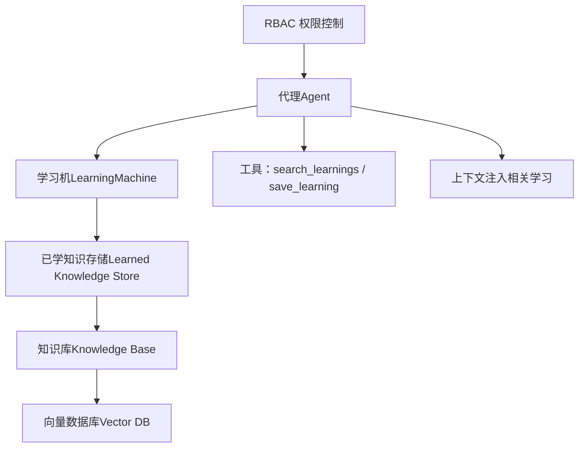
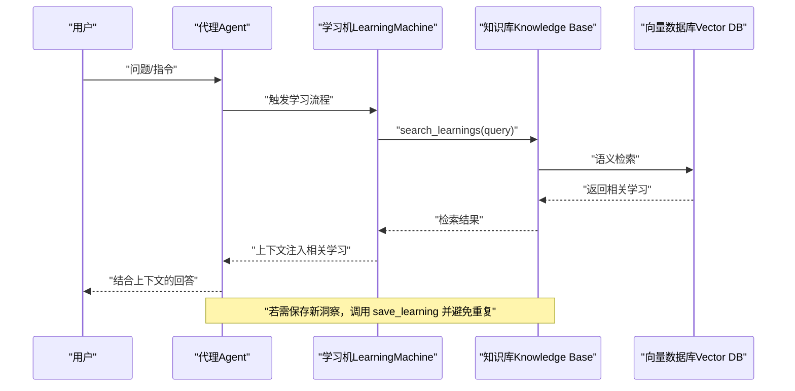
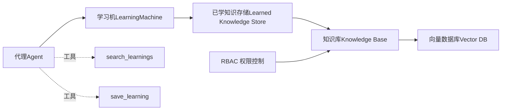

# 代理模式（Agentic Mode）

<cite>
**本文引用的文件**
- [learned-knowledge.mdx](file://learning/stores/learned-knowledge.mdx)
- [agentic-mode.mdx](file://examples/learning/learned-knowledge/agentic-mode.mdx)
- [learned-knowledge.mdx（示例：基础）](file://examples/learning/basics/learned-knowledge.mdx)
- [propose-mode.mdx](file://examples/learning/learned-knowledge/propose-mode.mdx)
- [学习模式.mdx](file://learning/learning-modes.mdx)
- [知识总览.mdx](file://knowledge/overview.mdx)
- [RBAC 权限控制.mdx](file://agent-os/security/rbac.mdx)
</cite>

## 目录
1. [简介](#简介)
2. [项目结构](#项目结构)
3. [核心组件](#核心组件)
4. [架构总览](#架构总览)
5. [组件详解](#组件详解)
6. [依赖关系分析](#依赖关系分析)
7. [性能考量](#性能考量)
8. [故障排查指南](#故障排查指南)
9. [结论](#结论)
10. [附录](#附录)

## 简介
本篇文档系统性阐述“代理模式（Agentic Mode）”下的知识存储与检索机制，重点解释代理如何通过显式工具（search_learnings、save_learning）在回答问题前自动搜索相关知识并避免重复保存；同时覆盖知识搜索策略、上下文注入方式、命名空间管理以及权限控制（RBAC）的最佳实践与配置示例。

## 项目结构
围绕代理模式的知识存储，相关文档分布在以下位置：
- 学习与知识存储：learned-knowledge.mdx、learning-modes.mdx、examples 下的 agentic-mode、learned-knowledge 基础示例、propose-mode 示例
- 知识检索与注入：knowledge/overview.mdx
- 权限控制：agent-os/security/rbac.mdx

图表来源
- [learned-knowledge.mdx:66-84](file://learning/stores/learned-knowledge.mdx#L66-L84)
- [学习模式.mdx:42-74](file://learning/learning-modes.mdx#L42-L74)
- [知识总览.mdx:29-40](file://knowledge/overview.mdx#L29-L40)
- [RBAC 权限控制.mdx:21-46](file://agent-os/security/rbac.mdx#L21-L46)

章节来源
- [learned-knowledge.mdx:66-84](file://learning/stores/learned-knowledge.mdx#L66-L84)
- [学习模式.mdx:42-74](file://learning/learning-modes.mdx#L42-L74)
- [知识总览.mdx:29-40](file://knowledge/overview.mdx#L29-L40)
- [RBAC 权限控制.mdx:21-46](file://agent-os/security/rbac.mdx#L21-L46)

## 核心组件
- 代理（Agent）
  - 在 Agentic 模式下接收显式工具：search_learnings、save_learning
  - 在回答问题前进行知识检索，并在保存前避免重复
- 学习机（LearningMachine）
  - 组织不同存储（用户画像、会话上下文、实体记忆、已学知识等）及其模式（Always/Agentic/Propose）
- 已学知识存储（Learned Knowledge Store）
  - 面向跨用户复用的洞察、模式与最佳实践
  - 支持命名空间（全局/用户/自定义）隔离与共享
- 知识库（Knowledge Base）+ 向量数据库（Vector DB）
  - 提供语义搜索能力，支撑上下文注入
- 上下文注入（Context Injection）
  - 将检索到的相关学习以结构化片段注入到系统提示词或对话历史中
- 权限控制（RBAC）
  - 通过 JWT scopes 控制对知识内容的读写删权限

章节来源
- [learned-knowledge.mdx:66-84](file://learning/stores/learned-knowledge.mdx#L66-L84)
- [学习模式.mdx:10-14](file://learning/learning-modes.mdx#L10-L14)
- [RBAC 权限控制.mdx:63-133](file://agent-os/security/rbac.mdx#L63-L133)

## 架构总览
代理在每次交互中遵循如下流程：
- 接收用户输入
- 调用 search_learnings 检索相关学习
- 将检索结果作为上下文注入到响应生成中
- 若发现有价值的新洞察，则调用 save_learning 保存
- 避免重复保存（基于检索结果与已有内容对比）

图表来源
- [learned-knowledge.mdx:66-84](file://learning/stores/learned-knowledge.mdx#L66-L84)
- [知识总览.mdx:29-40](file://knowledge/overview.mdx#L29-L40)

章节来源
- [learned-knowledge.mdx:66-84](file://learning/stores/learned-knowledge.mdx#L66-L84)
- [知识总览.mdx:29-40](file://knowledge/overview.mdx#L29-L40)

## 组件详解

### 代理如何接收显式知识管理工具
- 在 Agentic 模式下，代理被赋予两个核心工具：
  - search_learnings：用于检索相关过往知识
  - save_learning：用于保存新的可复用洞察
- 代理在回答问题前先检索，再决定是否保存，从而避免重复保存

章节来源
- [learned-knowledge.mdx:82-84](file://learning/stores/learned-knowledge.mdx#L82-L84)
- [学习模式.mdx:65-74](file://learning/learning-modes.mdx#L65-L74)

### 可用工具：search_learnings 与 save_learning
- search_learnings
  - 功能：根据查询语义检索相关学习
  - 使用场景：回答前检索、上下文注入、避免重复保存
- save_learning
  - 功能：将新的可复用洞察保存到知识库
  - 使用建议：仅在确认价值后保存，避免低价值信息污染

章节来源
- [learned-knowledge.mdx:82-84](file://learning/stores/learned-knowledge.mdx#L82-L84)
- [学习模式.mdx:65-74](file://learning/learning-modes.mdx#L65-L74)

### 回答前自动搜索与去重机制
- 流程要点
  - 代理在生成最终回答前，先调用 search_learnings 获取相关学习
  - 将检索结果注入上下文，提升回答质量
  - 若新洞察与已有内容高度相似，则不触发保存
- 优势
  - 减少冗余保存
  - 提升跨用户知识复用效率

章节来源
- [learned-knowledge.mdx:82-84](file://learning/stores/learned-knowledge.mdx#L82-L84)

### 知识搜索策略与上下文注入
- 搜索策略
  - 采用语义检索（嵌入 + 向量数据库），支持混合检索（hybrid）
  - 查询时可结合用户/会话上下文，提高召回质量
- 上下文注入
  - 将检索到的相关学习以结构化片段注入到系统提示词或消息历史中
  - 保证模型在回答时能“基于事实”地引用已有经验

章节来源
- [learned-knowledge.mdx:167-180](file://learning/stores/learned-knowledge.mdx#L167-L180)
- [知识总览.mdx:29-40](file://knowledge/overview.mdx#L29-L40)

### 命名空间管理与权限控制
- 命名空间
  - 全局（默认）：所有用户共享
  - 用户（user）：按用户私有
  - 自定义（如 team、domain）：团队或领域专用
- 权限控制（RBAC）
  - 通过 JWT scopes 控制对知识内容的读写删操作
  - 常用范围：knowledge:read、knowledge:write、knowledge:delete
  - 可按资源粒度授权（如 knowledge:*:read 或 knowledge:{id}:write）

章节来源
- [learned-knowledge.mdx:182-196](file://learning/stores/learned-knowledge.mdx#L182-L196)
- [RBAC 权限控制.mdx:126-133](file://agent-os/security/rbac.mdx#L126-L133)

### 配置示例与最佳实践
- 基础配置（Agentic 模式）
  - 为已学知识存储启用 Agentic 模式，并传入知识库实例
  - 为代理设置明确的指令，强调“先检索再保存”
- 最佳实践
  - 明确“何为可复用洞察”的判断标准（避免保存常见知识、临时信息、原始数据）
  - 结合命名空间策略，确保知识共享与隐私平衡
  - 在高风险/合规场景下考虑 Propose 模式（人工确认后再保存）

章节来源
- [learned-knowledge.mdx:66-84](file://learning/stores/learned-knowledge.mdx#L66-L84)
- [学习模式.mdx:101-122](file://learning/learning-modes.mdx#L101-L122)
- [learned-knowledge.mdx（示例：基础）:48-60](file://examples/learning/basics/learned-knowledge.mdx#L48-L60)

## 依赖关系分析
- 组件耦合
  - 代理依赖学习机；学习机依赖知识库；知识库依赖向量数据库
  - 工具链（search_learnings/save_learning）贯穿检索与保存环节
- 外部依赖
  - 向量数据库（PgVector、ChromaDB 等）
  - 嵌入模型（OpenAI Embeddings 等）
- 权限边界
  - RBAC 通过 JWT scopes 对知识内容访问进行强制约束

图表来源
- [learned-knowledge.mdx:66-84](file://learning/stores/learned-knowledge.mdx#L66-L84)
- [学习模式.mdx:65-74](file://learning/learning-modes.mdx#L65-L74)
- [知识总览.mdx:29-40](file://knowledge/overview.mdx#L29-L40)
- [RBAC 权限控制.mdx:126-133](file://agent-os/security/rbac.mdx#L126-L133)

章节来源
- [learned-knowledge.mdx:66-84](file://learning/stores/learned-knowledge.mdx#L66-L84)
- [学习模式.mdx:65-74](file://learning/learning-modes.mdx#L65-L74)
- [知识总览.mdx:29-40](file://knowledge/overview.mdx#L29-L40)
- [RBAC 权限控制.mdx:126-133](file://agent-os/security/rbac.mdx#L126-L133)

## 性能考量
- 检索成本
  - 语义检索依赖向量数据库，注意索引规模与查询复杂度
- 保存成本
  - Agentic 模式避免每轮都保存，减少不必要的 LLM 调用与写入
- 上下文长度
  - 注入的相关学习应适度裁剪，避免超出上下文窗口
- 建议
  - 使用混合检索（hybrid）提升召回质量
  - 对低价值保存进行阈值过滤，降低噪声

## 故障排查指南
- 无法检索到相关学习
  - 检查知识库是否正确初始化与加载内容
  - 确认向量数据库连接与嵌入模型配置
- 重复保存问题
  - 确保在保存前执行检索并与现有内容比对
  - 使用命名空间隔离，避免跨用户误判
- 权限不足
  - 检查 JWT scopes 是否包含 knowledge:read/write/delete
  - 确认资源级授权（如 knowledge:*:read 或具体 id 的 write）

章节来源
- [RBAC 权限控制.mdx:367-373](file://agent-os/security/rbac.mdx#L367-L373)

## 结论
代理模式通过显式工具与智能检索，在回答前自动搜索并注入相关学习，显著提升了知识复用效率与回答质量。配合命名空间与 RBAC 权限控制，既能保障知识共享，又能满足隐私与合规要求。建议在实践中明确“可复用洞察”的判断标准，并结合混合检索与上下文裁剪优化性能。

## 附录
- 示例参考
  - Agentic 模式完整示例：[agentic-mode.mdx](file://examples/learning/learned-knowledge/agentic-mode.mdx)
  - 基础已学知识示例：[learned-knowledge.mdx（示例：基础）](file://examples/learning/basics/learned-knowledge.mdx)
  - Propose 模式示例（人工确认）：[propose-mode.mdx](file://examples/learning/learned-knowledge/propose-mode.mdx)
- 概念参考
  - 学习模式总览：[学习模式.mdx](file://learning/learning-modes.mdx)
  - 知识检索与注入：[知识总览.mdx](file://knowledge/overview.mdx)