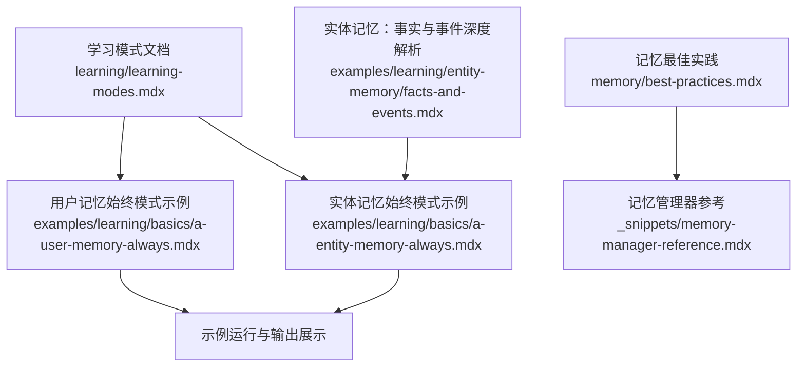
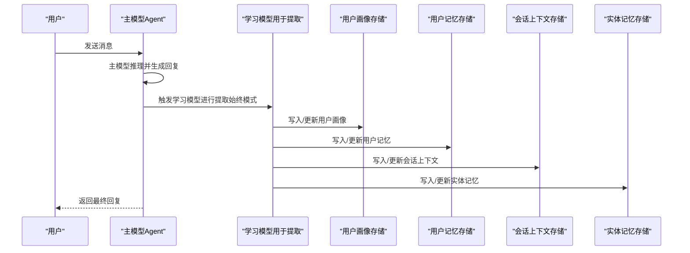
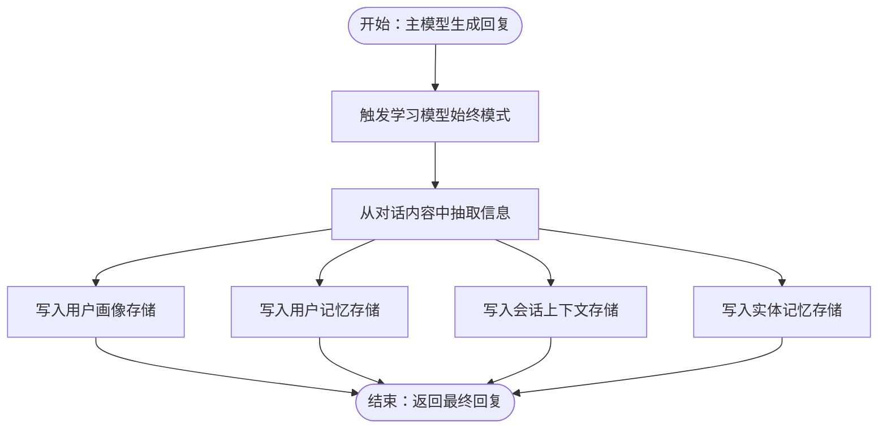
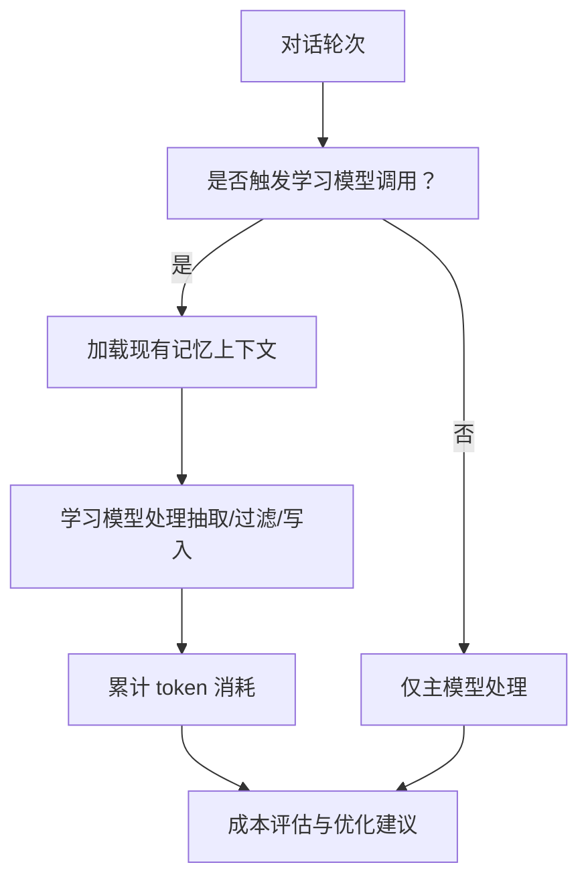
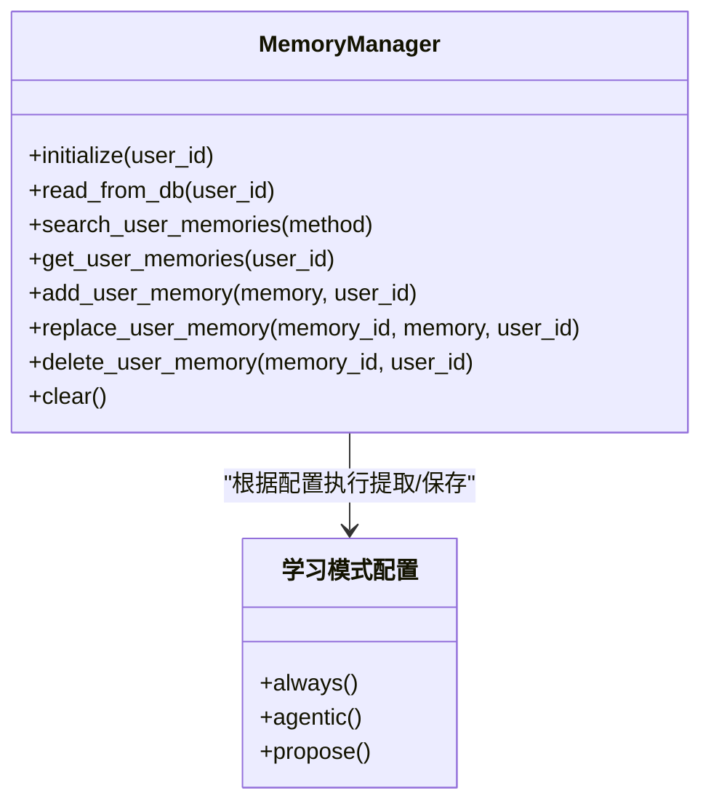
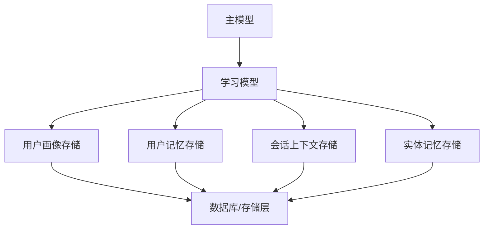

# 始终模式（Always Mode）

<cite>
**本文引用的文件**
- [学习模式](file://learning/learning-modes.mdx)
- [用户记忆：始终模式示例](file://examples/learning/basics/a-user-memory-always.mdx)
- [实体记忆：事实与事件（深度解析）](file://examples/learning/entity-memory/facts-and-events.mdx)
- [实体记忆：始终模式示例](file://examples/learning/basics/a-entity-memory-always.mdx)
- [记忆最佳实践](file://memory/best-practices.mdx)
- [记忆管理器参考](file://_snippets/memory-manager-reference.mdx)
</cite>

## 目录
1. [简介](#简介)
2. [项目结构](#项目结构)
3. [核心组件](#核心组件)
4. [架构总览](#架构总览)
5. [详细组件分析](#详细组件分析)
6. [依赖关系分析](#依赖关系分析)
7. [性能考量](#性能考量)
8. [故障排查指南](#故障排查指南)
9. [结论](#结论)
10. [附录](#附录)

## 简介
始终模式（Always Mode）是学习存储的一种工作模式，其核心特征是在每次对话响应完成后自动触发学习内容的提取与保存，无需显式的工具调用或人工确认。该模式适用于需要持续、被动积累知识的场景，如用户画像、会话上下文、实体记忆等。

在始终模式下，系统会在主模型完成一次对话后，再进行一次“嵌套”的学习模型调用，用于从对话内容中抽取并写入相应的知识存储。这种设计确保了信息的连续性与一致性，但也带来了额外的 LLM 调用开销与潜在的成本上升风险。

本技术文档将深入解释始终模式的工作机制与实现原理，覆盖以下关键主题：
- 每次响应后的自动提取流程
- 始终模式下的额外 LLM 调用开销与性能影响
- 自动保存有价值洞察与经验的策略
- 配置示例与适用场景
- 学习内容筛选策略与质量控制机制
- 成本效益分析与性能优化建议

## 项目结构
围绕始终模式的相关文档与示例主要分布在以下位置：
- 学习模式与默认行为说明：learning/learning-modes.mdx
- 用户记忆与实体记忆的始终模式示例：examples/learning/basics/a-user-memory-always.mdx、examples/learning/basics/a-entity-memory-always.mdx
- 实体记忆的“事实与事件”深度解析：examples/learning/entity-memory/facts-and-events.mdx
- 记忆最佳实践与成本估算：memory/best-practices.mdx
- 记忆管理器方法参考：_snippets/memory-manager-reference.mdx

**图表来源**
- [学习模式:1-147](file://learning/learning-modes.mdx#L1-L147)
- [用户记忆：始终模式示例:33-96](file://examples/learning/basics/a-user-memory-always.mdx#L33-L96)
- [实体记忆：事实与事件（深度解析）:1-30](file://examples/learning/entity-memory/facts-and-events.mdx#L1-L30)
- [实体记忆：始终模式示例:31-71](file://examples/learning/basics/a-entity-memory-always.mdx#L31-L71)
- [记忆最佳实践:25-158](file://memory/best-practices.mdx#L25-L158)
- [_snippets/memory-manager-reference.mdx:1-57](file://_snippets/memory-manager-reference.mdx#L1-L57)

**章节来源**
- [学习模式:1-147](file://learning/learning-modes.mdx#L1-L147)
- [用户记忆：始终模式示例:33-96](file://examples/learning/basics/a-user-memory-always.mdx#L33-L96)
- [实体记忆：事实与事件（深度解析）:1-30](file://examples/learning/entity-memory/facts-and-events.mdx#L1-L30)
- [实体记忆：始终模式示例:31-71](file://examples/learning/basics/a-entity-memory-always.mdx#L31-L71)
- [记忆最佳实践:25-158](file://memory/best-practices.mdx#L25-L158)
- [_snippets/memory-manager-reference.mdx:1-57](file://_snippets/memory-manager-reference.mdx#L1-L57)

## 核心组件
- 学习机器（Learning Machine）
  - 在始终模式下，学习机器会在每次响应结束后自动执行提取与保存逻辑，无需外部干预。
  - 默认情况下，用户画像、用户记忆、会话上下文、实体记忆等存储通常采用始终模式，以保证连续性与一致性。
- 存储配置（Store Configurations）
  - 用户画像、用户记忆、会话上下文、实体记忆：默认始终模式
  - 已学习知识、决策日志：默认可采用其他模式（如代理模式或提议模式），以满足审计与合规需求
- 提取与保存流程
  - 主模型生成回复后，触发学习模型对对话内容进行结构化抽取，并写入对应存储
  - 抽取过程可能加载已有上下文，以提升准确性与一致性

**章节来源**
- [学习模式:16-41](file://learning/learning-modes.mdx#L16-L41)
- [学习模式:124-133](file://learning/learning-modes.mdx#L124-L133)

## 架构总览
始终模式的典型交互流程如下：

**图表来源**
- [学习模式:16-41](file://learning/learning-modes.mdx#L16-L41)
- [用户记忆：始终模式示例:33-74](file://examples/learning/basics/a-user-memory-always.mdx#L33-L74)
- [实体记忆：始终模式示例:31-71](file://examples/learning/basics/a-entity-memory-always.mdx#L31-L71)

## 详细组件分析

### 组件一：始终模式的自动提取流程
- 触发时机
  - 每次主模型完成一次响应后，系统自动调用学习模型进行提取
- 提取范围
  - 用户画像：名称、偏好等结构化信息
  - 用户记忆：未归类到画像中的非结构化观察
  - 会话上下文：当前会话的状态与要点
  - 实体记忆：对话中出现的人、公司、事件等事实与事件
- 执行方式
  - 学习模型加载必要的上下文，执行抽取与写入操作
  - 整个过程对用户透明，无需显式工具调用

**图表来源**
- [学习模式:16-41](file://learning/learning-modes.mdx#L16-L41)
- [用户记忆：始终模式示例:33-74](file://examples/learning/basics/a-user-memory-always.mdx#L33-L74)
- [实体记忆：始终模式示例:31-71](file://examples/learning/basics/a-entity-memory-always.mdx#L31-L71)

**章节来源**
- [学习模式:16-41](file://learning/learning-modes.mdx#L16-L41)
- [用户记忆：始终模式示例:33-74](file://examples/learning/basics/a-user-memory-always.mdx#L33-L74)
- [实体记忆：始终模式示例:31-71](file://examples/learning/basics/a-entity-memory-always.mdx#L31-L71)

### 组件二：额外 LLM 调用开销与性能影响
- 开销来源
  - 每次响应后都会触发一次学习模型调用，用于抽取与保存
  - 学习模型调用可能加载大量上下文，进一步增加 token 消耗
- 性能影响
  - 随着记忆规模增长，单次学习模型调用的上下文加载成本显著上升
  - 大规模记忆可能导致单次更新消耗数千 token，整体成本呈指数级增长
- 成本估算示例
  - 10 条消息且 7 次更新：基础对话约 5000 token；若每次更新均加载全部记忆，总成本约为 40000 token，成本增加约 8 倍

**图表来源**
- [记忆最佳实践:25-52](file://memory/best-practices.mdx#L25-L52)

**章节来源**
- [记忆最佳实践:25-52](file://memory/best-practices.mdx#L25-L52)

### 组件三：自动保存有价值的洞察与经验
- 价值判断
  - 通过学习模型对对话内容进行语义层面的筛选与归类，优先保存高价值、可复用的信息
- 一致性保障
  - 由于始终模式在后台自动执行，避免了遗漏隐含信息的风险
- 可追溯性
  - 对于需要审计与合规的场景，可结合其他模式（如代理模式或提议模式）对特定存储进行补充控制

**章节来源**
- [学习模式:16-41](file://learning/learning-modes.mdx#L16-L41)
- [学习模式:124-133](file://learning/learning-modes.mdx#L124-L133)

### 组件四：配置示例与适用场景
- 配置示例
  - 用户画像始终模式：在学习机器中将用户画像配置为始终模式
  - 用户记忆始终模式：在学习机器中将用户记忆配置为始终模式
  - 实体记忆始终模式：在学习机器中将实体记忆配置为始终模式
- 适用场景
  - 用户画像：持续记录姓名、偏好等
  - 用户记忆：被动积累非结构化观察
  - 会话上下文：持续跟踪会话状态
  - 实体记忆：从日常对话中提取事实与事件

**章节来源**
- [学习模式:101-122](file://learning/learning-modes.mdx#L101-L122)
- [学习模式:124-133](file://learning/learning-modes.mdx#L124-L133)
- [用户记忆：始终模式示例:33-74](file://examples/learning/basics/a-user-memory-always.mdx#L33-L74)
- [实体记忆：始终模式示例:31-71](file://examples/learning/basics/a-entity-memory-always.mdx#L31-L71)

### 组件五：学习内容筛选策略与质量控制
- 筛选策略
  - 使用学习模型对对话内容进行语义分析，识别高价值信息
  - 结合检索方法（如最近 N 条、最早 N 条、语义相似度）进行召回与排序
- 质量控制
  - 控制工具调用次数，防止过度学习导致成本飙升
  - 定期清理过期或低价值的记忆，保持存储健康
  - 设置用户 ID 隔离，避免跨用户数据混淆

**图表来源**
- [_snippets/memory-manager-reference.mdx:1-57](file://_snippets/memory-manager-reference.mdx#L1-L57)
- [学习模式:10-15](file://learning/learning-modes.mdx#L10-L15)

**章节来源**
- [_snippets/memory-manager-reference.mdx:1-57](file://_snippets/memory-manager-reference.mdx#L1-L57)
- [记忆最佳实践:112-142](file://memory/best-practices.mdx#L112-L142)

## 依赖关系分析
- 组件耦合
  - 主模型与学习模型之间存在顺序依赖：主模型先生成回复，学习模型随后进行提取
  - 学习模型与各存储之间存在写入依赖：抽取结果写入对应的存储
- 外部依赖
  - 数据库与存储层负责持久化与检索
  - 模型服务负责推理与嵌套调用
- 潜在循环依赖
  - 始终模式下，学习模型对存储的读取与写入应避免形成循环调用
- 接口契约
  - 学习模型需遵循统一的输入格式与输出规范，确保抽取的一致性

**图表来源**
- [学习模式:16-41](file://learning/learning-modes.mdx#L16-L41)
- [用户记忆：始终模式示例:33-74](file://examples/learning/basics/a-user-memory-always.mdx#L33-L74)
- [实体记忆：始终模式示例:31-71](file://examples/learning/basics/a-entity-memory-always.mdx#L31-L71)

**章节来源**
- [学习模式:16-41](file://learning/learning-modes.mdx#L16-L41)
- [用户记忆：始终模式示例:33-74](file://examples/learning/basics/a-user-memory-always.mdx#L33-L74)
- [实体记忆：始终模式示例:31-71](file://examples/learning/basics/a-entity-memory-always.mdx#L31-L71)

## 性能考量
- 成本控制
  - 通过减少不必要的学习模型调用频率，降低 token 消耗
  - 对大规模记忆进行定期清理，避免上下文膨胀
- 性能优化
  - 将学习处理集中在会话末尾批量执行，而非每条消息后立即触发
  - 合理设置工具调用上限，防止学习过程失控
- 资源管理
  - 为不同存储选择合适的模式组合，平衡自动化与成本
  - 使用检索策略（如最近/最早/语义相似）提高召回效率

**章节来源**
- [记忆最佳实践:54-142](file://memory/best-practices.mdx#L54-L142)

## 故障排查指南
- 常见问题
  - 忘记设置 user_id 导致所有用户的记忆混在一起
  - 存储规模过大导致学习模型调用成本过高
  - 缺少定期清理导致存储膨胀与查询缓慢
- 解决方案
  - 明确区分 user_id，确保数据隔离
  - 定期清理过期记忆，控制上下文大小
  - 限制工具调用次数，避免学习过程失控
  - 在合适场景使用“代理模式”或“提议模式”，增强可控性

**章节来源**
- [记忆最佳实践:144-158](file://memory/best-practices.mdx#L144-L158)
- [记忆最佳实践:112-142](file://memory/best-practices.mdx#L112-L142)

## 结论
始终模式通过在每次响应后自动触发学习模型，实现了对用户画像、用户记忆、会话上下文与实体记忆的持续积累。该模式在提升知识连续性与一致性方面具有显著优势，但同时也带来额外的 LLM 调用开销与成本压力。通过合理的配置策略、筛选与质量控制机制，以及定期的存储优化，可以在保证效果的同时有效控制成本与性能风险。

## 附录
- 相关示例与文档
  - 用户记忆始终模式示例：examples/learning/basics/a-user-memory-always.mdx
  - 实体记忆始终模式示例：examples/learning/basics/a-entity-memory-always.mdx
  - 实体记忆：事实与事件（深度解析）：examples/learning/entity-memory/facts-and-events.mdx
  - 学习模式说明：learning/learning-modes.mdx
  - 记忆最佳实践：memory/best-practices.mdx
  - 记忆管理器参考：_snippets/memory-manager-reference.mdx