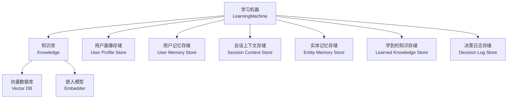
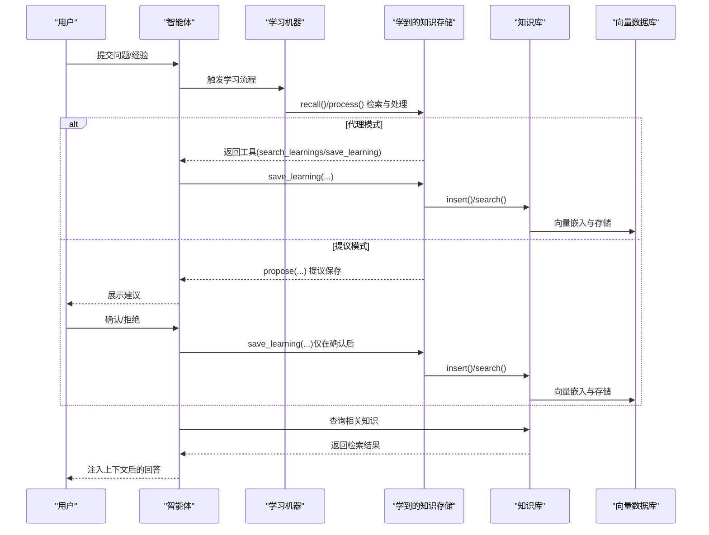
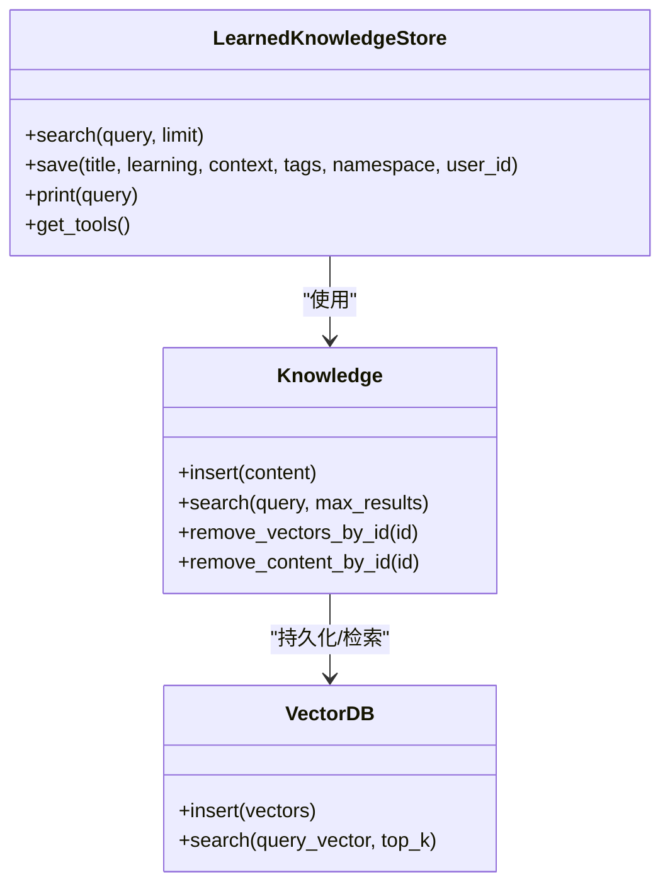
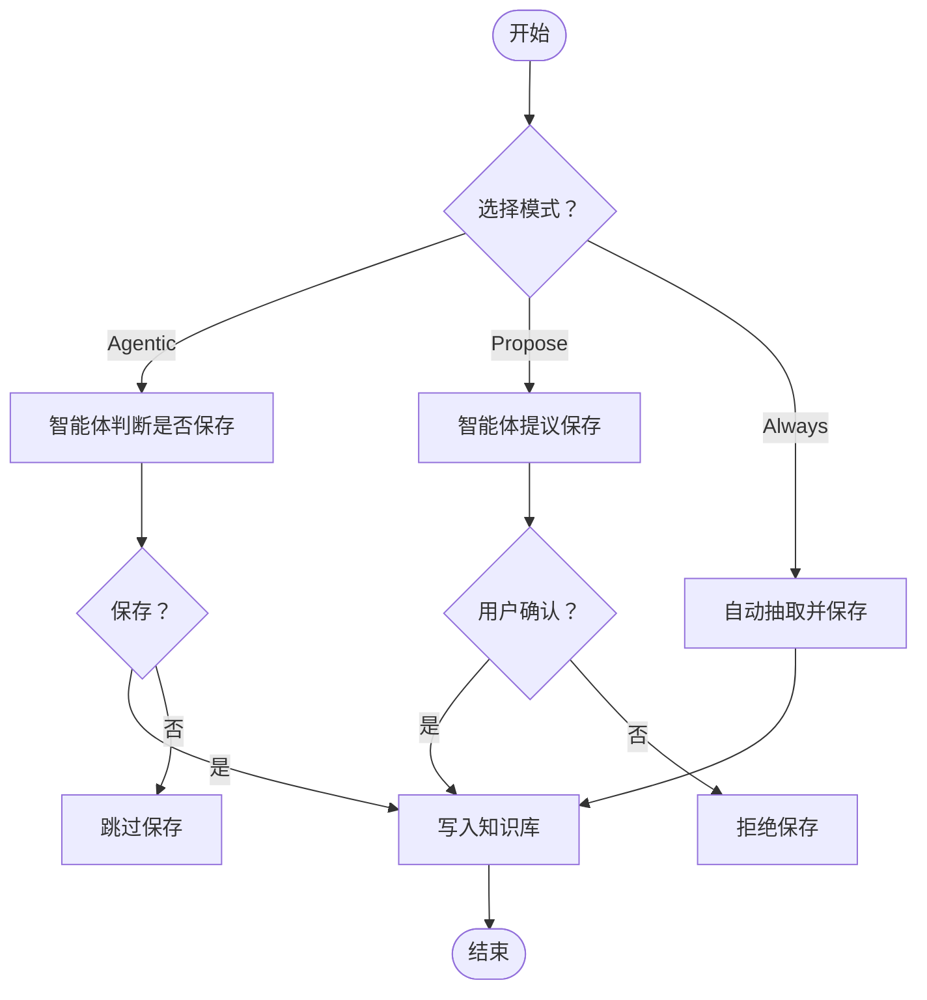
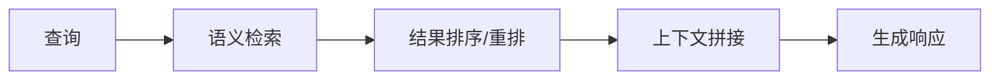
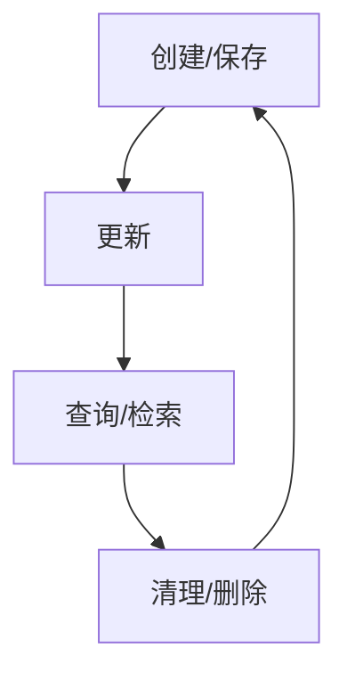
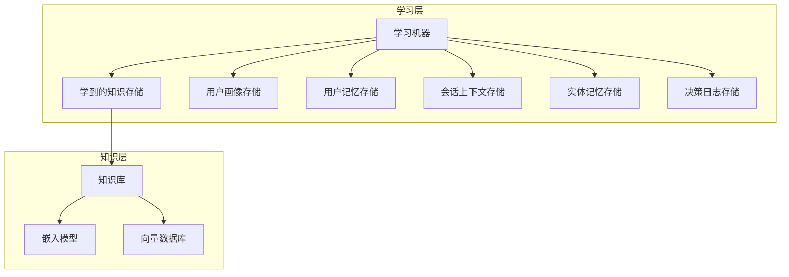

# 学到的知识存储

<cite>
**本文引用的文件**
- [学习模式](file://learning/learning-modes.mdx)
- [学习总览](file://learning/overview.mdx)
- [学习存储总览](file://learning/stores/intro.mdx)
- [学到的知识存储](file://learning/stores/learned-knowledge.mdx)
- [学到的知识：代理模式示例](file://examples/learning/learned-knowledge/agentic-mode.mdx)
- [学到的知识：提议模式示例](file://examples/learning/learned-knowledge/propose-mode.mdx)
- [自定义存储：最小示例](file://examples/learning/custom-stores/minimal-custom-store.mdx)
- [向量搜索](file://knowledge/concepts/search-and-retrieval/vector-search.mdx)
- [向量数据库](file://knowledge/concepts/vector-db.mdx)
- [知识概念总览](file://knowledge/concepts/overview.mdx)
- [知识快速开始](file://knowledge/quickstart.mdx)
</cite>

## 目录
1. [引言](#引言)
2. [项目结构](#项目结构)
3. [核心组件](#核心组件)
4. [架构总览](#架构总览)
5. [详细组件分析](#详细组件分析)
6. [依赖关系分析](#依赖关系分析)
7. [性能考量](#性能考量)
8. [故障排查指南](#故障排查指南)
9. [结论](#结论)
10. [附录](#附录)

## 引言
本技术文档围绕“学到的知识存储”展开，系统阐述其设计理念、实现原理与使用方式，重点覆盖以下主题：
- 跨用户转移的洞察存储机制：通过命名空间控制知识共享范围（全局、用户私有、自定义域），支持在团队或组织内复用可迁移的见解。
- 两种工作模式：代理模式（Agentic Mode）与提议模式（Propose Mode），分别强调“由智能体自主决策保存”和“由用户确认后保存”的质量控制路径。
- 数据结构与知识表示：字段设计、命名空间语义、标签体系与上下文注入策略。
- 知识传播与生命周期管理：创建、更新、查询与清理的完整流程与最佳实践。
- 配置与性能优化：如何选择嵌入模型、向量数据库与检索策略以平衡准确性与成本。
- 安全与隐私：命名空间隔离、访问控制与最小化数据暴露。

## 项目结构
“学到的知识存储”是“学习机器（Learning Machine）”的一部分，后者协调多个学习存储（用户画像、用户记忆、会话上下文、实体记忆、学到的知识、决策日志）。其中“学到的知识”面向跨用户的可迁移洞察，通常结合知识库与向量数据库实现语义检索与上下文注入。

图示来源
- [学习总览:1-39](file://learning/overview.mdx#L1-L39)
- [学习存储总览:1-70](file://learning/stores/intro.mdx#L1-L70)
- [学到的知识存储:1-214](file://learning/stores/learned-knowledge.mdx#L1-L214)

章节来源
- [学习总览:1-39](file://learning/overview.mdx#L1-L39)
- [学习存储总览:1-70](file://learning/stores/intro.mdx#L1-L70)

## 核心组件
- 学习机器（LearningMachine）：统一编排多个学习存储，按存储类型与模式执行“回忆（recall）—处理（process）—构建上下文（build_context）—工具获取（get_tools）”协议。
- 知识库（Knowledge）：提供内容插入、检索与删除能力，通常与向量数据库配合实现语义搜索。
- 向量数据库（Vector DB）：持久化嵌入向量，支持向量相似度检索与混合检索（向量+关键词）。
- 嵌入模型（Embedder）：将文本转换为向量，决定语义匹配的质量。
- 学到的知识存储（Learned Knowledge Store）：捕获跨用户可迁移的洞察，支持三种模式：Always、Agentic、Propose；支持命名空间控制共享范围。

章节来源
- [学习总览:1-39](file://learning/overview.mdx#L1-L39)
- [学到的知识存储:1-214](file://learning/stores/learned-knowledge.mdx#L1-L214)
- [向量搜索:1-109](file://knowledge/concepts/search-and-retrieval/vector-search.mdx#L1-L109)
- [向量数据库:1-117](file://knowledge/concepts/vector-db.mdx#L1-L117)

## 架构总览
下图展示“学到的知识存储”的端到端工作流：从对话中提取洞察，经知识库入库，再在后续交互中通过语义检索注入上下文，最终影响响应生成。

图示来源
- [学习模式:1-147](file://learning/learning-modes.mdx#L1-L147)
- [学到的知识存储:1-214](file://learning/stores/learned-knowledge.mdx#L1-L214)
- [学到的知识：代理模式示例:1-126](file://examples/learning/learned-knowledge/agentic-mode.mdx#L1-L126)
- [学到的知识：提议模式示例:1-134](file://examples/learning/learned-knowledge/propose-mode.mdx#L1-L134)

## 详细组件分析

### 组件一：学到的知识存储（Learned Knowledge Store）
- 设计理念
  - 将“可迁移的洞察”作为独立知识资产进行管理，支持跨用户、跨会话复用。
  - 通过命名空间（全局/用户/自定义）控制可见性与所有权，满足合规与隐私需求。
- 数据模型
  - 字段：标题、洞察正文、适用情境、标签、命名空间、所属用户、创建时间等。
  - 上下文注入：在系统提示词中自动注入相关学习片段，提升回答质量。
- 工具集
  - 搜索工具：search_learnings
  - 保存工具：save_learning
  - 使用建议：先搜索避免重复，再保存，确保知识库质量。
- 命名空间策略
  - 全局：对所有用户开放（默认）。
  - 用户：仅当前用户可见。
  - 自定义：团队/领域专用（如工程、销售）。

图示来源
- [学到的知识存储:126-180](file://learning/stores/learned-knowledge.mdx#L126-L180)
- [向量数据库:1-117](file://knowledge/concepts/vector-db.mdx#L1-L117)

章节来源
- [学到的知识存储:1-214](file://learning/stores/learned-knowledge.mdx#L1-L214)

### 组件二：两种工作模式（Agentic Mode 与 Propose Mode）
- 代理模式（Agentic Mode）
  - 智能体拥有工具：search_learnings、save_learning，自主判断何时保存与检索。
  - 适合需要“智能体主导”的场景，减少人工干预。
- 提议模式（Propose Mode）
  - 智能体提出建议，用户确认后才保存，强调质量控制与合规。
  - 适合高价值、高风险或受监管领域的知识沉淀。
- Always 模式
  - 每次回复后自动抽取并保存，适合高频、低门槛的学习场景，但需权衡额外调用成本与噪声。

图示来源
- [学习模式:1-147](file://learning/learning-modes.mdx#L1-L147)
- [学到的知识存储:66-124](file://learning/stores/learned-knowledge.mdx#L66-L124)

章节来源
- [学习模式:1-147](file://learning/learning-modes.mdx#L1-L147)
- [学到的知识存储:66-124](file://learning/stores/learned-knowledge.mdx#L66-L124)

### 组件三：知识表示与传播机制
- 表示形式
  - 结构化字段承载核心语义，便于检索与过滤。
  - 上下文注入：在系统提示词中拼接“相关学习”，提升回答一致性与专业度。
- 传播策略
  - 命名空间：通过命名空间实现“可见性控制”，默认全局共享，也可限定为用户或团队。
  - 标签与分类：辅助检索与治理。
  - 清理与去重：结合搜索避免重复保存；支持基于内容 ID 的批量删除。

图示来源
- [学到的知识存储:167-180](file://learning/stores/learned-knowledge.mdx#L167-L180)
- [向量搜索:1-109](file://knowledge/concepts/search-and-retrieval/vector-search.mdx#L1-L109)

章节来源
- [学到的知识存储:126-180](file://learning/stores/learned-knowledge.mdx#L126-L180)
- [向量搜索:1-109](file://knowledge/concepts/search-and-retrieval/vector-search.mdx#L1-L109)

### 组件四：生命周期管理（创建—更新—查询—清理）
- 创建
  - 代理模式：智能体在合适时机调用保存工具。
  - 提议模式：智能体提议，用户确认后保存。
  - Always 模式：每次回复后自动保存。
- 更新
  - 通过保存工具覆盖或补充信息；命名空间与用户 ID 决定归属。
- 查询
  - 使用 search_learnings 或知识库 search 接口，支持向量与混合检索。
- 清理
  - 支持按向量 ID、名称或元数据删除；支持按内容 ID 删除该内容产生的全部向量。

图示来源
- [学到的知识存储:126-180](file://learning/stores/learned-knowledge.mdx#L126-L180)
- [知识概念总览:1-200](file://knowledge/concepts/overview.mdx#L1-L200)
- [知识快速开始:1-200](file://knowledge/quickstart.mdx#L1-L200)

章节来源
- [学到的知识存储:126-180](file://learning/stores/learned-knowledge.mdx#L126-L180)
- [知识快速开始:1-200](file://knowledge/quickstart.mdx#L1-L200)

### 组件五：配置与扩展（嵌入模型、向量数据库、自定义存储）
- 嵌入模型与向量数据库
  - 选择合适的嵌入模型（如 OpenAI、Sentence Transformer、Jina 等）与向量数据库（PgVector、Qdrant、Milvus 等），根据性能与成本取舍。
  - 混合检索（向量+关键词）可提升精确度与召回率。
- 自定义存储
  - 实现 LearningStore 协议（学习类型标识、模式、回忆/处理/构建上下文/工具接口），可接入数据库或外部系统。
  - 示例展示了最小自定义存储的实现要点与集成方式。

章节来源
- [向量数据库:1-117](file://knowledge/concepts/vector-db.mdx#L1-L117)
- [向量搜索:1-109](file://knowledge/concepts/search-and-retrieval/vector-search.mdx#L1-L109)
- [自定义存储：最小示例:1-120](file://examples/learning/custom-stores/minimal-custom-store.mdx#L1-L120)

## 依赖关系分析
- 学习机器依赖于各学习存储的统一协议，确保“回忆—处理—上下文构建—工具获取”的一致性。
- 知识库依赖向量数据库与嵌入模型，形成“内容入库—向量嵌入—相似检索—结果返回”的闭环。
- 命名空间与工具链共同决定“谁能看到、如何保存”。

图示来源
- [学习总览:1-39](file://learning/overview.mdx#L1-L39)
- [学到的知识存储:1-214](file://learning/stores/learned-knowledge.mdx#L1-L214)
- [向量数据库:1-117](file://knowledge/concepts/vector-db.mdx#L1-L117)

章节来源
- [学习总览:1-39](file://learning/overview.mdx#L1-L39)
- [学到的知识存储:1-214](file://learning/stores/learned-knowledge.mdx#L1-L214)

## 性能考量
- 检索性能
  - 向量维度与索引策略直接影响检索速度与精度；优先选择与业务规模匹配的向量数据库。
  - 混合检索在兼顾语义理解的同时保留关键词命中能力，适合复杂查询。
- 成本控制
  - 嵌入调用次数与向量写入频率是主要成本项；Always 模式会增加 LLM 调用与嵌入开销，应谨慎启用。
  - 对低价值内容采用提议模式或延迟保存，减少无效写入。
- 并发与异步
  - 生产环境建议使用支持异步的向量数据库与知识库接口，提升吞吐与稳定性。

## 故障排查指南
- 无法检索到相关学习
  - 检查嵌入模型与向量数据库是否一致，确认内容已成功入库。
  - 调整检索策略（向量/混合），并检查标签与命名空间设置。
- 重复保存或未去重
  - 在保存前调用搜索工具进行去重；必要时清理历史向量或内容。
- 权限与可见性问题
  - 核对命名空间与用户 ID 设置，确保目标用户具备读取权限。
- 自定义存储集成异常
  - 确保实现 LearningStore 协议的关键方法（学习类型标识、schema、recall、tools 等）正确无误，并在学习机器中正确注册。

章节来源
- [学到的知识存储:126-180](file://learning/stores/learned-knowledge.mdx#L126-L180)
- [自定义存储：最小示例:1-120](file://examples/learning/custom-stores/minimal-custom-store.mdx#L1-L120)

## 结论
学到的知识存储通过“命名空间+工具链+语义检索”的组合，实现了跨用户、可迁移的洞察管理。代理模式强调效率，提议模式强调质量，Always 模式适合高频场景但需注意成本与噪声。结合合适的嵌入模型与向量数据库，配合严格的命名空间与清理策略，可在保证性能与成本可控的前提下，最大化知识的复用价值。

## 附录
- 快速上手
  - 启用学习机器与学到的知识存储，配置知识库与向量数据库，即可在智能体中使用 search_learnings 与 save_learning 工具。
- 示例参考
  - 代理模式与提议模式的完整示例，演示了从发现到保存再到应用的全流程。

章节来源
- [学到的知识存储:36-124](file://learning/stores/learned-knowledge.mdx#L36-L124)
- [学到的知识：代理模式示例:1-126](file://examples/learning/learned-knowledge/agentic-mode.mdx#L1-L126)
- [学到的知识：提议模式示例:1-134](file://examples/learning/learned-knowledge/propose-mode.mdx#L1-L134)