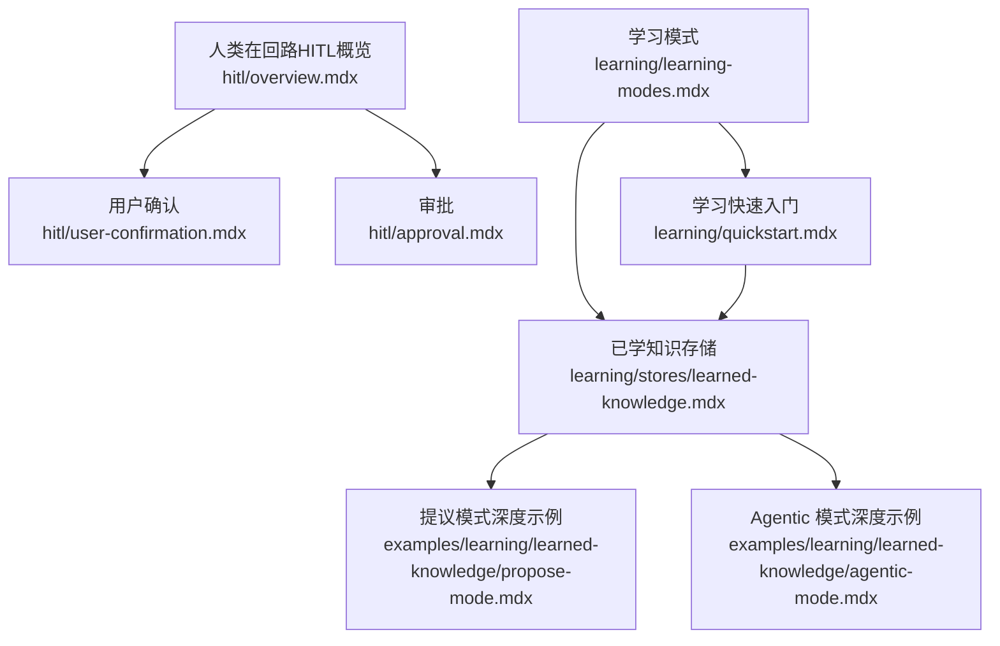
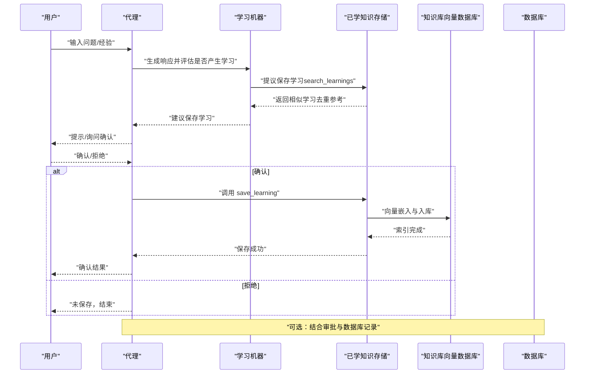
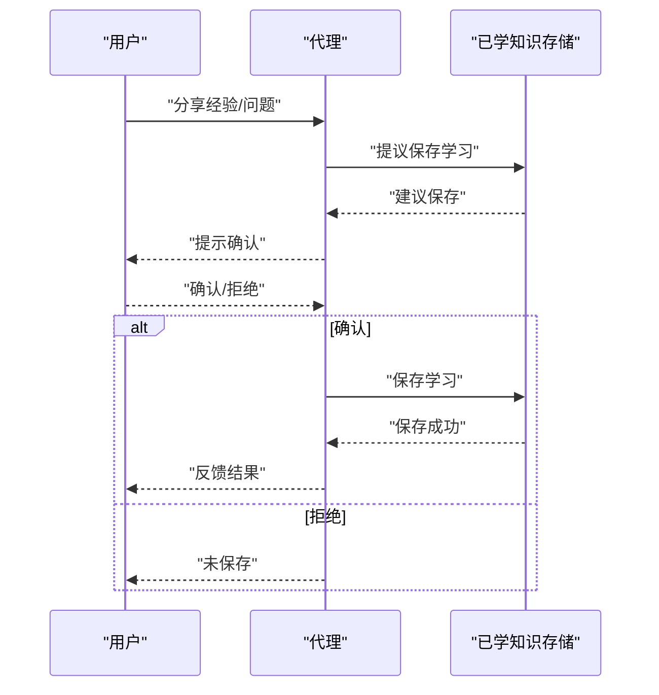
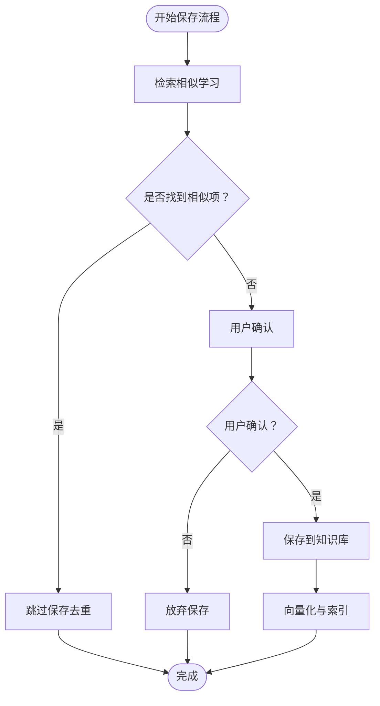
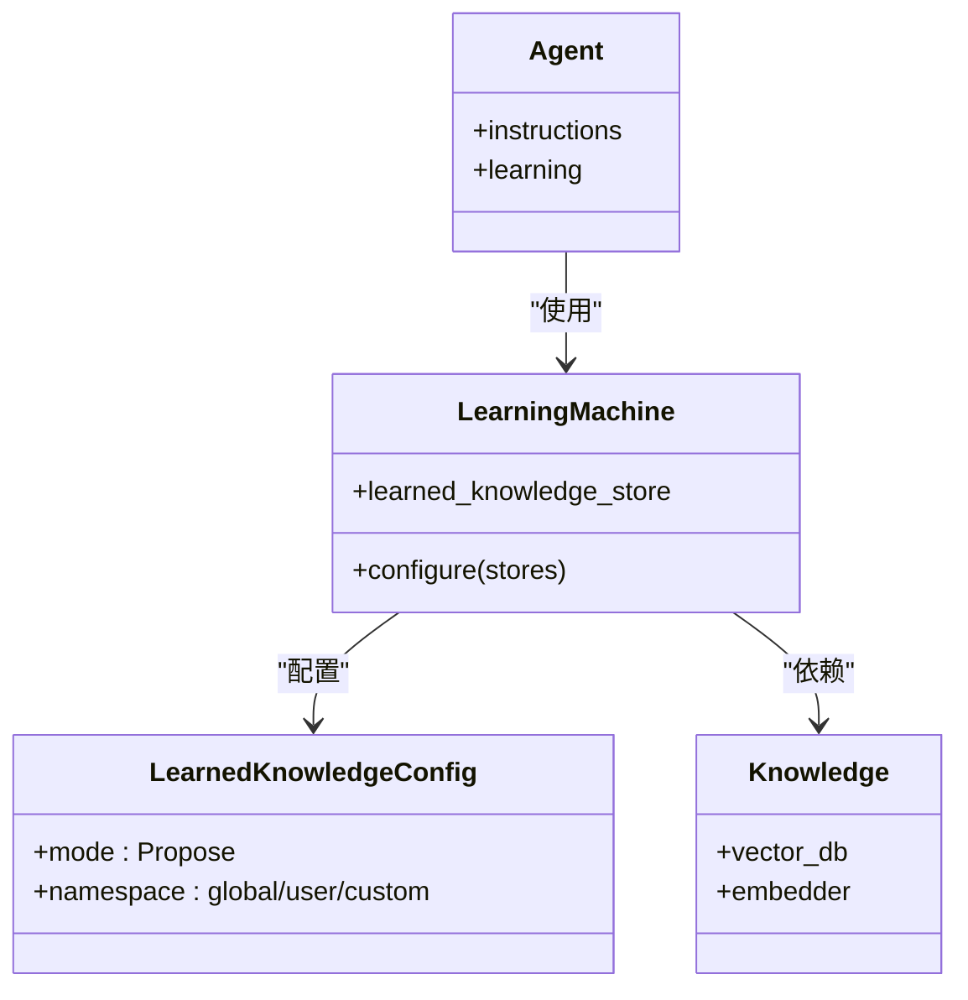
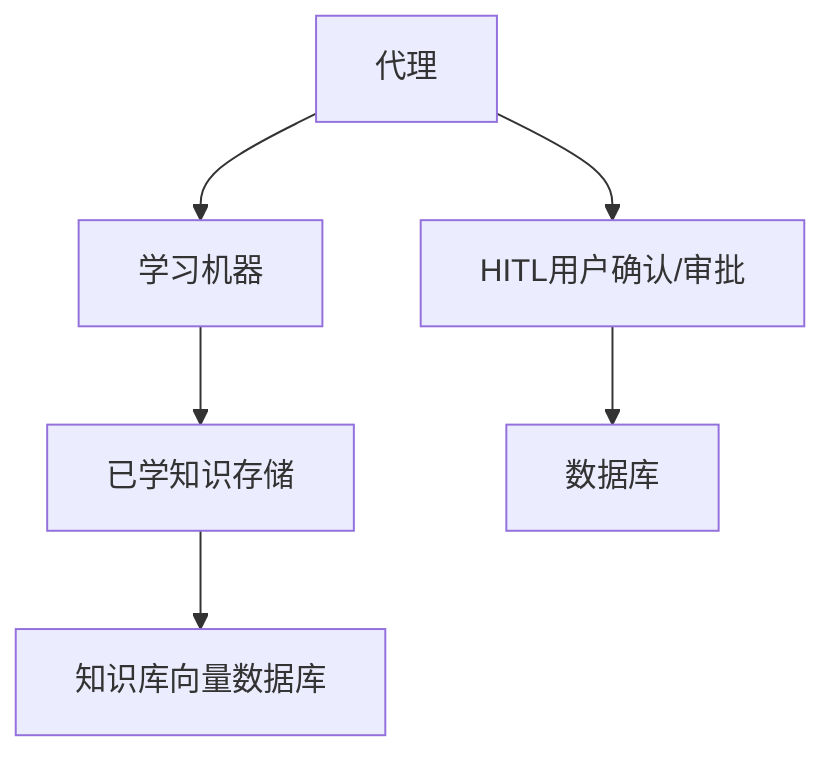

# 提议模式（Propose Mode）

<cite>
**本文档引用的文件**
- [学习模式](file://learning/learning-modes.mdx)
- [提议模式深度示例](file://examples/learning/learned-knowledge/propose-mode.mdx)
- [学习存储：已学知识](file://learning/stores/learned-knowledge.mdx)
- [人类在回路（HITL）概览](file://hitl/overview.mdx)
- [用户确认](file://hitl/user-confirmation.mdx)
- [审批](file://hitl/approval.mdx)
- [Agentic 模式深度示例](file://examples/learning/learned-knowledge/agentic-mode.mdx)
- [学习快速入门](file://learning/quickstart.mdx)
- [学习存储总览](file://learning/stores/intro.mdx)
</cite>

## 目录
1. [简介](#简介)
2. [项目结构](#项目结构)
3. [核心组件](#核心组件)
4. [架构概览](#架构概览)
5. [详细组件分析](#详细组件分析)
6. [依赖关系分析](#依赖关系分析)
7. [性能考量](#性能考量)
8. [故障排除指南](#故障排除指南)
9. [结论](#结论)
10. [附录](#附录)

## 简介
本技术文档围绕“提议模式（Propose Mode）”展开，系统阐述其设计理念、实现原理与工程实践。提议模式的核心在于：代理在保存前向用户提议学习内容，由用户确认后才执行保存操作。该模式通过“人类质量控制”在高价值知识的采集上实现更高的准确性与合规性，适用于高风险、监管敏感或需要审计的场景。

- 设计理念
  - 自动化学习与人工审核的平衡：代理自动识别有价值的学习点，但不直接写入，而是提出供用户审阅。
  - 质量优先：通过用户确认降低低价值或错误知识进入知识库的概率。
  - 可追溯性：配合审计与审批机制，形成可追踪的决策链路。

- 实现要点
  - 学习模式配置：针对“已学知识”存储启用提议模式。
  - 人机交互：代理在合适时机触发提议，等待用户确认后再调用保存工具。
  - 审核与持久化：结合审批与数据库记录，确保流程可控且可恢复。

**章节来源**
- [学习模式:75-99](file://learning/learning-modes.mdx#L75-L99)
- [学习存储：已学知识:86-106](file://learning/stores/learned-knowledge.mdx#L86-L106)

## 项目结构
与提议模式相关的文档主要分布在以下区域：
- 学习与知识管理：学习模式、已学知识存储、学习快速入门等
- 人类在回路（HITL）：用户确认、审批、外部执行等
- 示例：提议模式与 Agentic 模式的对比示例

**图表来源**
- [学习模式:1-147](file://learning/learning-modes.mdx#L1-L147)
- [学习存储：已学知识:1-214](file://learning/stores/learned-knowledge.mdx#L1-L214)
- [提议模式深度示例:1-134](file://examples/learning/learned-knowledge/propose-mode.mdx#L1-L134)
- [Agentic 模式深度示例:1-126](file://examples/learning/learned-knowledge/agentic-mode.mdx#L1-L126)
- [人类在回路（HITL）概览:1-174](file://hitl/overview.mdx#L1-L174)
- [用户确认:1-258](file://hitl/user-confirmation.mdx#L1-L258)
- [审批:1-103](file://hitl/approval.mdx#L1-L103)
- [学习快速入门:1-129](file://learning/quickstart.mdx#L1-L129)

**章节来源**
- [学习模式:1-147](file://learning/learning-modes.mdx#L1-L147)
- [学习存储：已学知识:1-214](file://learning/stores/learned-knowledge.mdx#L1-L214)
- [提议模式深度示例:1-134](file://examples/learning/learned-knowledge/propose-mode.mdx#L1-L134)
- [Agentic 模式深度示例:1-126](file://examples/learning/learned-knowledge/agentic-mode.mdx#L1-L126)
- [人类在回路（HITL）概览:1-174](file://hitl/overview.mdx#L1-L174)
- [用户确认:1-258](file://hitl/user-confirmation.mdx#L1-L258)
- [审批:1-103](file://hitl/approval.mdx#L1-L103)
- [学习快速入门:1-129](file://learning/quickstart.mdx#L1-L129)

## 核心组件
- 学习机器（Learning Machine）
  - 统一协调多个学习存储，支持为不同存储配置独立的学习模式。
  - 在提议模式下，代理不会自动保存，而是提出学习建议，等待用户确认。

- 已学知识存储（Learned Knowledge Store）
  - 面向跨用户的可复用洞察、模式与最佳实践。
  - 支持 Always、Agentic、Propose 三种模式；默认 Agentic。
  - 提供搜索与保存工具，用于避免重复与提升检索质量。

- 人类在回路（HITL）机制
  - 用户确认：代理在调用工具前暂停，等待用户批准或拒绝。
  - 审批：阻塞式或非阻塞式（审计）审批，配合数据库持久化记录。

- 示例与配置
  - 提议模式示例展示了代理提议、用户确认、保存与拒绝的完整流程。
  - Agentic 模式示例展示代理自主决定保存与检索。

**章节来源**
- [学习模式:75-99](file://learning/learning-modes.mdx#L75-L99)
- [学习存储：已学知识:86-106](file://learning/stores/learned-knowledge.mdx#L86-L106)
- [人类在回路（HITL）概览:25-82](file://hitl/overview.mdx#L25-L82)
- [用户确认:15-59](file://hitl/user-confirmation.mdx#L15-L59)
- [审批:7-68](file://hitl/approval.mdx#L7-L68)
- [提议模式深度示例:75-116](file://examples/learning/learned-knowledge/propose-mode.mdx#L75-L116)
- [Agentic 模式深度示例:69-108](file://examples/learning/learned-knowledge/agentic-mode.mdx#L69-L108)

## 架构概览
提议模式的运行时架构围绕“代理—提议—确认—保存”的闭环展开，同时与 HITL 机制和知识库检索能力耦合。

**图表来源**
- [提议模式深度示例:75-116](file://examples/learning/learned-knowledge/propose-mode.mdx#L75-L116)
- [学习存储：已学知识:84-85](file://learning/stores/learned-knowledge.mdx#L84-L85)
- [用户确认:15-59](file://hitl/user-confirmation.mdx#L15-L59)
- [审批:50-72](file://hitl/approval.mdx#L50-L72)

**章节来源**
- [提议模式深度示例:75-116](file://examples/learning/learned-knowledge/propose-mode.mdx#L75-L116)
- [学习存储：已学知识:84-85](file://learning/stores/learned-knowledge.mdx#L84-L85)
- [用户确认:15-59](file://hitl/user-confirmation.mdx#L15-L59)
- [审批:50-72](file://hitl/approval.mdx#L50-L72)

## 详细组件分析

### 组件A：提议模式下的用户确认流程与交互机制
- 流程设计
  - 代理在对话中识别有价值的洞察，生成“学习建议”。
  - 代理暂停并提示用户确认，等待明确回复（同意/拒绝）。
  - 用户确认后，代理调用保存工具；拒绝则不保存。

- 交互细节
  - 文本流式输出：示例演示了流式响应与分段提示，提升交互体验。
  - 多轮会话：示例包含同一用户在不同会话中的提议与确认，体现上下文延续。

- 与 HITL 的关系
  - 用户确认与工具调用的暂停机制一致，属于 HITL 的一种具体应用。
  - 可与审批机制结合，对关键学习进行阻塞式或审计式审批。

**图表来源**
- [提议模式深度示例:75-116](file://examples/learning/learned-knowledge/propose-mode.mdx#L75-L116)
- [用户确认:15-59](file://hitl/user-confirmation.mdx#L15-L59)

**章节来源**
- [提议模式深度示例:75-116](file://examples/learning/learned-knowledge/propose-mode.mdx#L75-L116)
- [用户确认:15-59](file://hitl/user-confirmation.mdx#L15-L59)

### 组件B：提议模式下的知识质量控制与去重机制
- 质量控制
  - 代理在提议前先进行检索，避免重复与低价值内容入库。
  - 用户确认作为第二道质量关卡，确保知识具备通用性与实用性。

- 去重机制
  - 保存前调用检索接口，比较相似度阈值，若命中则不保存。
  - 结合命名空间（全局/用户/自定义）控制可见范围，减少冗余。

- 数据模型与字段
  - 标题、洞察、适用情境、标签、命名空间、用户标识、创建时间等。
  - 字段设计便于检索、分类与审计。

**图表来源**
- [学习存储：已学知识:84-85](file://learning/stores/learned-knowledge.mdx#L84-L85)
- [学习存储：已学知识:126-137](file://learning/stores/learned-knowledge.mdx#L126-L137)

**章节来源**
- [学习存储：已学知识:84-85](file://learning/stores/learned-knowledge.mdx#L84-L85)
- [学习存储：已学知识:126-137](file://learning/stores/learned-knowledge.mdx#L126-L137)

### 组件C：提议模式下的配置示例与使用场景
- 配置示例
  - 启用提议模式：为“已学知识”存储设置提议模式。
  - 指令注入：指导代理在发现有价值洞察时提出保存，并等待确认。
  - 知识库：配置向量数据库与嵌入器，支撑语义检索与检索增强。

- 使用场景
  - 高价值知识：如架构决策、运维经验、安全最佳实践等。
  - 合规环境：金融、医疗等领域对知识入库有严格审核要求。
  - 审计需求：需要可追溯的保存决策链路。

**图表来源**
- [学习模式:79-95](file://learning/learning-modes.mdx#L79-L95)
- [学习存储：已学知识:26-34](file://learning/stores/learned-knowledge.mdx#L26-L34)
- [提议模式深度示例:46-60](file://examples/learning/learned-knowledge/propose-mode.mdx#L46-L60)

**章节来源**
- [学习模式:79-95](file://learning/learning-modes.mdx#L79-L95)
- [学习存储：已学知识:26-34](file://learning/stores/learned-knowledge.mdx#L26-L34)
- [提议模式深度示例:46-60](file://examples/learning/learned-knowledge/propose-mode.mdx#L46-L60)

### 组件D：与 Agentic 模式的对比与组合
- 对比
  - Agentic：代理自主决定保存与检索，适合快速积累与灵活应用。
  - Propose：强调人工审核，适合高质量与合规性要求高的场景。

- 组合策略
  - 不同存储采用不同模式：例如用户画像与记忆使用 Always，已学知识使用 Agentic 或 Propose。
  - 通过学习机器统一配置，实现“按需选择”。

**章节来源**
- [学习模式:101-122](file://learning/learning-modes.mdx#L101-L122)
- [Agentic 模式深度示例:69-108](file://examples/learning/learned-knowledge/agentic-mode.mdx#L69-L108)

## 依赖关系分析
- 组件耦合
  - 代理依赖学习机器；学习机器依赖已学知识存储与知识库。
  - 提议模式与 HITL 机制强耦合，用户确认与审批贯穿保存流程。
  - 数据库用于持久化审批状态与会话历史，支撑可恢复与审计。

- 外部依赖
  - 向量数据库（如 PgVector）提供语义检索与索引能力。
  - 嵌入器（如 OpenAI Embeddings）负责文本向量化。

**图表来源**
- [学习存储：已学知识:26-34](file://learning/stores/learned-knowledge.mdx#L26-L34)
- [人类在回路（HITL）概览:25-82](file://hitl/overview.mdx#L25-L82)
- [审批:50-72](file://hitl/approval.mdx#L50-L72)

**章节来源**
- [学习存储：已学知识:26-34](file://learning/stores/learned-knowledge.mdx#L26-L34)
- [人类在回路（HITL）概览:25-82](file://hitl/overview.mdx#L25-L82)
- [审批:50-72](file://hitl/approval.mdx#L50-L72)

## 性能考量
- 检索成本
  - 保存前检索与相似度计算会增加延迟，建议合理设置阈值与检索范围。
- 流式交互
  - 使用流式输出提升用户感知速度，避免长时间等待。
- 批处理与缓存
  - 对高频检索结果进行缓存，减少重复计算。
- 并发与队列
  - 在高并发场景下，将保存请求排队并异步处理，保证一致性与性能平衡。

[本节为通用性能建议，无需特定文件引用]

## 故障排除指南
- 代理未触发提议
  - 检查学习模式配置是否正确启用提议模式。
  - 确认代理指令是否引导其在发现洞察时提出保存。

- 用户确认未生效
  - 确认 HITL 流程已在代码中处理 active_requirements。
  - 若使用审批，检查数据库审批记录状态与解析逻辑。

- 保存失败或重复
  - 检查检索阈值与相似度设置，避免误判。
  - 确认命名空间与过滤条件，防止重复入库。

**章节来源**
- [用户确认:29-82](file://hitl/user-confirmation.mdx#L29-L82)
- [审批:50-72](file://hitl/approval.mdx#L50-L72)
- [学习存储：已学知识:84-85](file://learning/stores/learned-knowledge.mdx#L84-L85)

## 结论
提议模式通过“代理提议 + 用户确认”的闭环，在自动化学习与人工审核之间取得平衡，特别适用于高价值与合规敏感的知识采集。结合 HITL 与审批机制，可实现可追溯、可恢复的质量控制体系。建议在实际落地中：
- 明确存储与模式组合策略
- 设计清晰的用户交互与反馈路径
- 强化检索与去重策略
- 建立审计与恢复流程

[本节为总结性内容，无需特定文件引用]

## 附录
- 快速开始与配置
  - 启用学习机器与配置存储模式
  - 设置知识库与嵌入器
  - 编写示例脚本验证提议与确认流程

- 相关示例
  - 提议模式深度示例
  - Agentic 模式深度示例
  - HITL 用户确认与审批示例

**章节来源**
- [学习快速入门:45-93](file://learning/quickstart.mdx#L45-L93)
- [提议模式深度示例:119-133](file://examples/learning/learned-knowledge/propose-mode.mdx#L119-L133)
- [Agentic 模式深度示例:111-125](file://examples/learning/learned-knowledge/agentic-mode.mdx#L111-L125)
- [人类在回路（HITL）概览:129-173](file://hitl/overview.mdx#L129-L173)