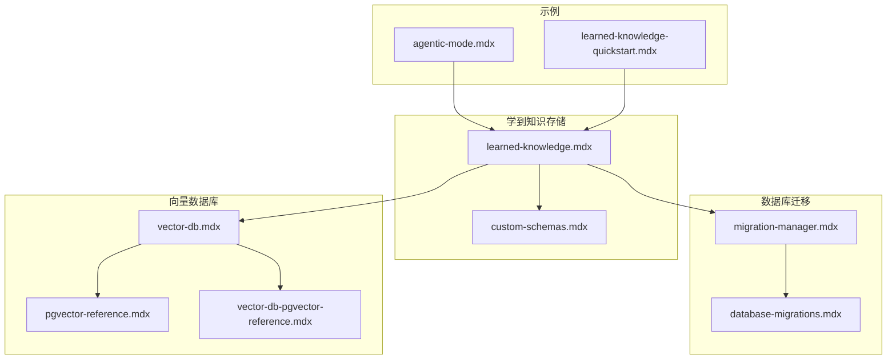
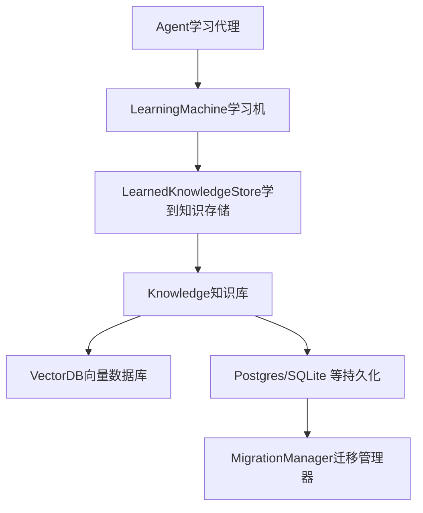
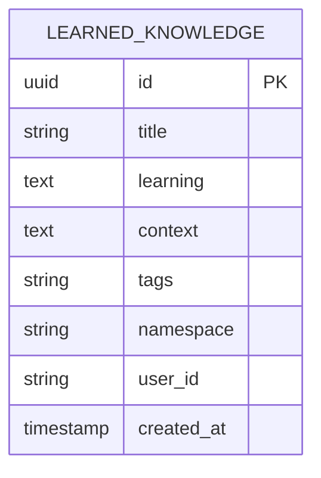
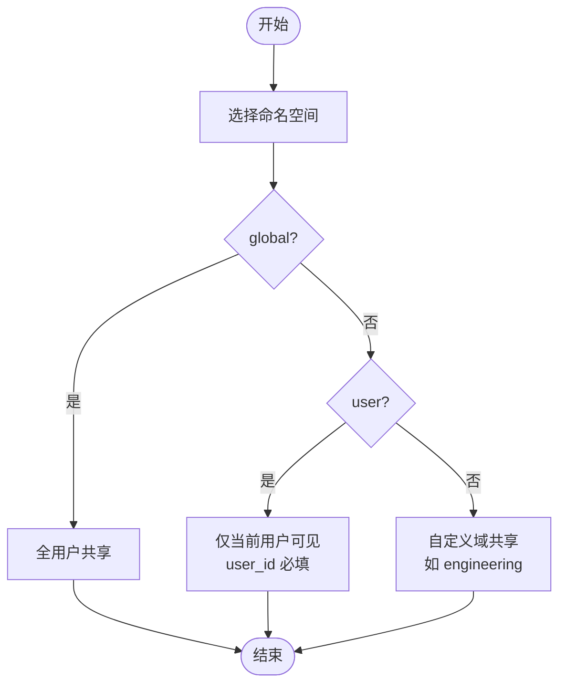
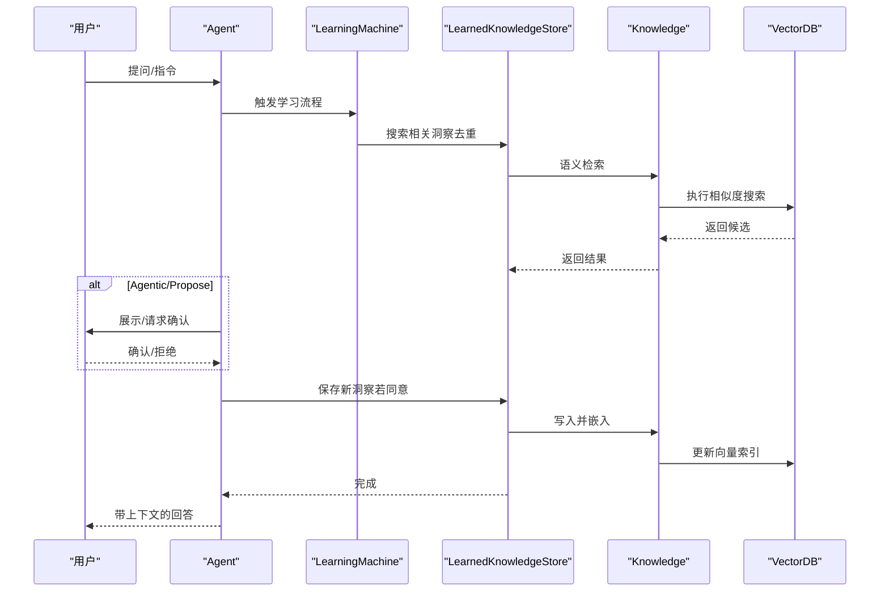
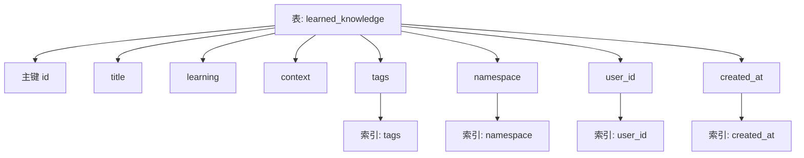
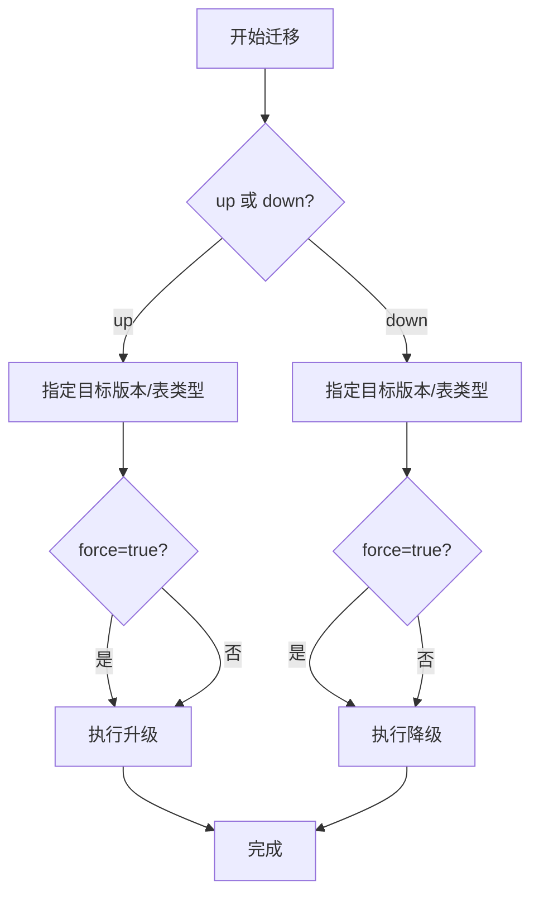
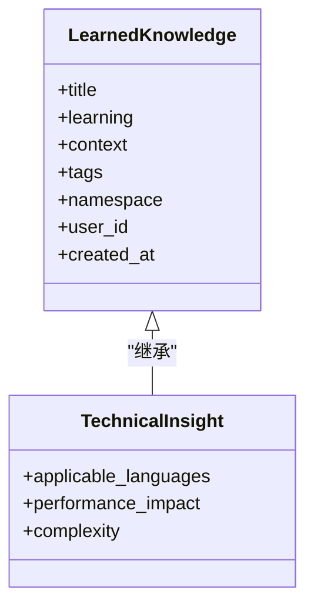
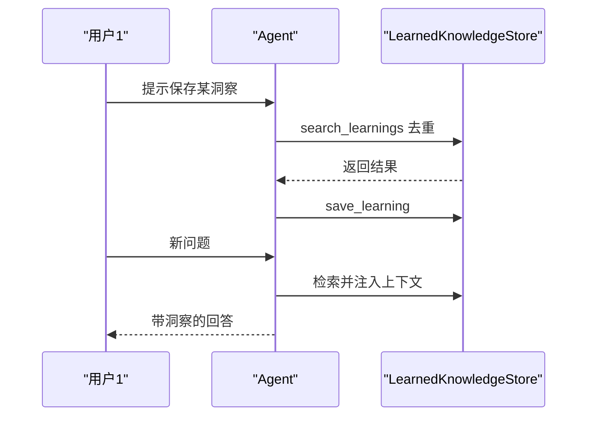
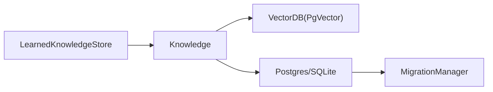

# 数据模型与架构

<cite>
**本文引用的文件**   
- [learned-knowledge.mdx](file://learning/stores/learned-knowledge.mdx)
- [custom-schemas.mdx](file://learning/custom-schemas.mdx)
- [migration-manager.mdx](file://reference/storage/migrations.mdx)
- [database-migrations.mdx](file://other/database-migrations.mdx)
- [pgvector-reference.mdx](file://TBD/pages/reference/vector-db/pgvector.mdx)
- [vector-db-pgvector-reference.mdx](file://TBD/snippets/vector-db-pgvector-reference.mdx)
- [vector-db.mdx](file://knowledge/concepts/vector-db.mdx)
- [agentic-mode.mdx](file://examples/learning/learned-knowledge/agentic-mode.mdx)
- [learned-knowledge-quickstart.mdx](file://examples/learning/quickstart/learned-knowledge.mdx)
</cite>

## 目录
1. [简介](#简介)
2. [项目结构](#项目结构)
3. [核心组件](#核心组件)
4. [架构总览](#架构总览)
5. [详细组件分析](#详细组件分析)
6. [依赖关系分析](#依赖关系分析)
7. [性能考量](#性能考量)
8. [故障排查指南](#故障排查指南)
9. [结论](#结论)
10. [附录](#附录)

## 简介
本文件聚焦“学到知识”（Learned Knowledge）的数据模型与架构，系统阐述其数据结构设计、字段定义、命名空间机制、生命周期管理、数据库表结构与索引设计、版本控制与迁移策略，以及数据隐私与安全考虑。内容基于仓库中关于学习知识存储、自定义模式扩展、数据库迁移与向量数据库选型的官方文档与示例。

## 项目结构
围绕学到知识的核心文档与示例分布如下：
- 学到知识存储：数据模型、命名空间、模式选择、检索注入与使用示例
- 自定义模式扩展：在默认模式基础上增加领域特定字段
- 数据库迁移：MigrationManager 的升级/降级能力与支持的表类型
- 向量数据库：PgVector 等向量数据库的参考与选型建议
- 示例：Agentic 模式下的保存与应用流程

**图表来源**
- [learned-knowledge.mdx:1-214](file://learning/stores/learned-knowledge.mdx#L1-L214)
- [custom-schemas.mdx:1-218](file://learning/custom-schemas.mdx#L1-L218)
- [migration-manager.mdx:1-172](file://reference/storage/migrations.mdx#L1-L172)
- [database-migrations.mdx:35-155](file://other/database-migrations.mdx#L35-L155)
- [pgvector-reference.mdx:1-6](file://TBD/pages/reference/vector-db/pgvector.mdx#L1-L6)
- [vector-db-pgvector-reference.mdx](file://TBD/snippets/vector-db-pgvector-reference.mdx)
- [vector-db.mdx:91-117](file://knowledge/concepts/vector-db.mdx#L91-L117)
- [agentic-mode.mdx:83-125](file://examples/learning/learned-knowledge/agentic-mode.mdx#L83-L125)
- [learned-knowledge-quickstart.mdx:1-91](file://examples/learning/quickstart/learned-knowledge.mdx#L1-L91)

**章节来源**
- [learned-knowledge.mdx:1-214](file://learning/stores/learned-knowledge.mdx#L1-L214)
- [custom-schemas.mdx:1-218](file://learning/custom-schemas.mdx#L1-L218)
- [migration-manager.mdx:1-172](file://reference/storage/migrations.mdx#L1-L172)
- [database-migrations.mdx:35-155](file://other/database-migrations.mdx#L35-L155)
- [vector-db.mdx:91-117](file://knowledge/concepts/vector-db.mdx#L91-L117)

## 核心组件
- 数据模型与字段
  - title：短小可检索的标题
  - learning：实际洞察内容
  - context：适用的时间/场景
  - tags：组织分类标签
  - namespace：共享范围（全局/用户/自定义）
  - user_id：当 namespace 为 user 时的归属用户标识
  - created_at：捕获时间戳
- 命名空间机制
  - 全局（默认）：对所有用户共享
  - 用户（user）：按用户私有
  - 自定义（如 engineering）：团队或域内共享
- 模式与生命周期
  - Agentic：代理具备工具进行检索与保存，先检索再保存以避免重复
  - Propose：代理提出洞察供确认后保存
  - Always：每次响应后自动提取并保存（额外 LLM 调用成本）
- 检索与上下文注入
  - 通过知识库与向量数据库进行语义检索，将相关洞察注入到回答上下文中

**章节来源**
- [learned-knowledge.mdx:126-181](file://learning/stores/learned-knowledge.mdx#L126-L181)
- [learned-knowledge.mdx:182-196](file://learning/stores/learned-knowledge.mdx#L182-L196)
- [learned-knowledge.mdx:66-84](file://learning/stores/learned-knowledge.mdx#L66-L84)
- [learned-knowledge.mdx:86-124](file://learning/stores/learned-knowledge.mdx#L86-L124)

## 架构总览
学到知识的架构围绕“代理-知识库-向量数据库-持久化存储”的链路展开。代理在不同模式下触发学习抽取与保存；知识库负责内容的嵌入与检索；向量数据库支撑高效相似度搜索；持久化存储承载结构化元数据与版本控制。

**图表来源**
- [learned-knowledge.mdx:18-34](file://learning/stores/learned-knowledge.mdx#L18-L34)
- [learned-knowledge.mdx:43-64](file://learning/stores/learned-knowledge.mdx#L43-L64)
- [migration-manager.mdx:37-121](file://reference/storage/migrations.mdx#L37-L121)

## 详细组件分析

### 数据模型与字段定义
- 字段职责
  - title：便于快速检索与展示
  - learning：核心洞察文本
  - context：帮助理解适用条件
  - tags：用于分类与过滤
  - namespace：决定可见性与共享范围
  - user_id：当 namespace 为 user 时，作为所有权标识
  - created_at：审计与排序依据
- 约束与取值
  - namespace 支持 global、user、自定义字符串
  - user_id 在 namespace=user 时必填
  - created_at 由系统生成，遵循统一时区与时序规则

**图表来源**
- [learned-knowledge.mdx:128-136](file://learning/stores/learned-knowledge.mdx#L128-L136)

**章节来源**
- [learned-knowledge.mdx:126-137](file://learning/stores/learned-knowledge.mdx#L126-L137)

### 命名空间机制与共享策略
- 全局（global，默认）：所有用户可见
- 用户（user）：仅当前用户可见，user_id 必填
- 自定义（如 engineering）：团队或业务域内共享
- 配置方式：通过 LearnedKnowledgeConfig(namespace=...) 设置

**图表来源**
- [learned-knowledge.mdx:182-196](file://learning/stores/learned-knowledge.mdx#L182-L196)

**章节来源**
- [learned-knowledge.mdx:182-196](file://learning/stores/learned-knowledge.mdx#L182-L196)

### 生命周期管理（创建、更新、查询、清理）
- 创建
  - Agentic：调用 search_learnings 检索 → 决策是否保存 → 调用 save_learning
  - Propose：代理提出洞察 → 用户确认 → 保存
  - Always：每次响应后自动抽取并保存（注意 LLM 成本）
- 更新
  - 通过检索去重避免重复保存；必要时可覆盖或合并
- 查询
  - 使用 search_learnings 或直接调用 store.search(query, limit)
  - 将结果注入到上下文，辅助回答
- 清理
  - 可结合会话/用户维度定期归档或删除过期洞察
  - 通过命名空间隔离，减少误删风险

**图表来源**
- [learned-knowledge.mdx:66-84](file://learning/stores/learned-knowledge.mdx#L66-L84)
- [learned-knowledge.mdx:86-124](file://learning/stores/learned-knowledge.mdx#L86-L124)
- [learned-knowledge.mdx:154-165](file://learning/stores/learned-knowledge.mdx#L154-L165)

**章节来源**
- [learned-knowledge.mdx:66-124](file://learning/stores/learned-knowledge.mdx#L66-L124)
- [learned-knowledge.mdx:154-165](file://learning/stores/learned-knowledge.mdx#L154-L165)

### 数据库表结构与索引设计
- 表名建议
  - 推荐使用独立表名（如 learned_knowledge），避免与其它知识库冲突
- 结构要点
  - 主键：id（UUID/自增整数）
  - 标准字段：title、learning、context、tags、namespace、user_id、created_at
  - 索引建议
    - 对 namespace 进行分区/索引以加速共享范围过滤
    - 对 user_id 建立索引以支持用户私有数据快速查询
    - 对 tags 建立多值索引或 JSONB 索引（视数据库而定）
    - 对 created_at 建立时间索引以支持排序与归档
- 向量索引
  - 使用向量数据库（如 PgVector）维护 embedding 向量，支持高效相似度检索

**图表来源**
- [learned-knowledge.mdx:26-33](file://learning/stores/learned-knowledge.mdx#L26-L33)
- [learned-knowledge.mdx:128-136](file://learning/stores/learned-knowledge.mdx#L128-L136)
- [vector-db.mdx:91-117](file://knowledge/concepts/vector-db.mdx#L91-L117)

**章节来源**
- [learned-knowledge.mdx:26-33](file://learning/stores/learned-knowledge.mdx#L26-L33)
- [learned-knowledge.mdx:128-136](file://learning/stores/learned-knowledge.mdx#L128-L136)
- [vector-db.mdx:91-117](file://knowledge/concepts/vector-db.mdx#L91-L117)

### 版本控制与迁移策略
- 迁移管理器（MigrationManager）
  - 支持 up/down 升级/降级，目标版本与表类型可指定
  - 支持 force 强制迁移
  - 支持的表类型：memory、session、metrics、eval、knowledge、culture
- 数据库支持
  - PostgreSQL、SQLite、MySQL、SingleStore
- 迁移脚本位置
  - libs/agno/migrations（仓库内脚本目录）

**图表来源**
- [migration-manager.mdx:37-121](file://reference/storage/migrations.mdx#L37-L121)
- [database-migrations.mdx:35-155](file://other/database-migrations.mdx#L35-L155)

**章节来源**
- [migration-manager.mdx:1-172](file://reference/storage/migrations.mdx#L1-L172)
- [database-migrations.mdx:35-155](file://other/database-migrations.mdx#L35-L155)

### 数据隐私与安全考虑
- 私有化部署
  - 控制面直连本地 AgentOS，不传输外部服务，确保数据主权
- 访问控制
  - 通过命名空间（user）实现用户级隔离
  - 结合数据库权限与连接配置限制访问
- 敏感信息处理
  - 在保存前进行内容审核与脱敏
  - 严格控制 user_id 与命名空间的写入权限
- 最佳实践
  - 使用独立表名与命名空间隔离
  - 定期审计 created_at 与 user_id，追踪来源
  - 对向量索引与元数据分别备份与加密

**章节来源**
- [learned-knowledge.mdx:182-196](file://learning/stores/learned-knowledge.mdx#L182-L196)
- [learned-knowledge.mdx:154-165](file://learning/stores/learned-knowledge.mdx#L154-L165)

### 自定义模式扩展（领域增强）
- 在 LearnedKnowledge 基础上扩展字段，如适用语言、性能影响、复杂度等
- 通过 dataclass 继承与 metadata 描述，指导 LLM 抽取
- 示例：TechnicalInsight 扩展

**图表来源**
- [custom-schemas.mdx:156-174](file://learning/custom-schemas.mdx#L156-L174)

**章节来源**
- [custom-schemas.mdx:156-174](file://learning/custom-schemas.mdx#L156-L174)

### 示例流程（Agentic 模式）
- 保存学习：代理提示保存，调用 search_learnings 去重后保存
- 应用学习：后续问题结合检索到的相关洞察生成回答
- 示例路径：examples/learning/learned-knowledge/agentic-mode.mdx

**图表来源**
- [agentic-mode.mdx:83-109](file://examples/learning/learned-knowledge/agentic-mode.mdx#L83-L109)

**章节来源**
- [agentic-mode.mdx:83-109](file://examples/learning/learned-knowledge/agentic-mode.mdx#L83-L109)

## 依赖关系分析
- 学到知识存储依赖知识库与向量数据库
- 知识库依赖向量数据库（如 PgVector）进行嵌入与检索
- 迁移管理器负责数据库表结构演进与版本控制
- 示例与文档共同验证端到端流程

**图表来源**
- [learned-knowledge.mdx:18-34](file://learning/stores/learned-knowledge.mdx#L18-L34)
- [migration-manager.mdx:145-170](file://reference/storage/migrations.mdx#L145-L170)

**章节来源**
- [learned-knowledge.mdx:18-34](file://learning/stores/learned-knowledge.mdx#L18-L34)
- [migration-manager.mdx:145-170](file://reference/storage/migrations.mdx#L145-L170)

## 性能考量
- 向量检索性能
  - 选择合适的向量数据库（如生产环境优先 PgVector）
  - 合理设置索引与分片策略
- LLM 调用成本
  - Always 模式每次响应都会触发抽取，需权衡成本与收益
- 并发与一致性
  - 使用异步接口（如 ainsert/asearch）提升吞吐
  - 通过命名空间与事务保证一致性

**章节来源**
- [vector-db.mdx:91-117](file://knowledge/concepts/vector-db.mdx#L91-L117)
- [learned-knowledge.mdx:108-124](file://learning/stores/learned-knowledge.mdx#L108-L124)

## 故障排查指南
- 迁移失败
  - schema 不匹配：使用 force 参数强制迁移
  - 列不存在：确保先执行迁移再使用新版代码
  - INSERT 失败：确认已执行最新迁移并重启实例
- 知识库不可见或检索不到
  - 检查向量表是否正确嵌入
  - 确认知识库名称与向量表名未冲突
- 权限与隐私
  - 核对 user_id 与命名空间写入权限
  - 使用独立表名避免跨库冲突

**章节来源**
- [database-migrations.mdx:125-146](file://other/database-migrations.mdx#L125-L146)
- [learned-knowledge.mdx:104-128](file://learning/stores/learned-knowledge.mdx#L104-L128)

## 结论
学到知识的数据模型以简洁字段与灵活命名空间为核心，结合知识库与向量数据库实现高效的语义检索与共享。通过 MigrationManager 实现稳定的版本演进，配合自定义模式扩展满足领域需求。在生产环境中，应重视命名空间隔离、索引设计与异步接口，以平衡性能与成本，并通过严格的隐私与安全策略保障数据治理。

## 附录
- 示例入口
  - [learned-knowledge-quickstart.mdx:1-91](file://examples/learning/quickstart/learned-knowledge.mdx#L1-L91)
  - [agentic-mode.mdx:83-125](file://examples/learning/learned-knowledge/agentic-mode.mdx#L83-L125)
- 向量数据库参考
  - [pgvector-reference.mdx:1-6](file://TBD/pages/reference/vector-db/pgvector.mdx#L1-L6)
  - [vector-db-pgvector-reference.mdx](file://TBD/snippets/vector-db-pgvector-reference.mdx)
  - [vector-db.mdx:91-117](file://knowledge/concepts/vector-db.mdx#L91-L117)