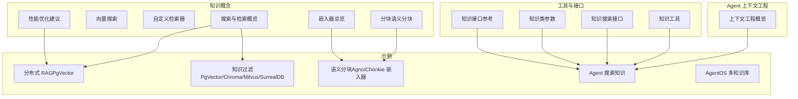
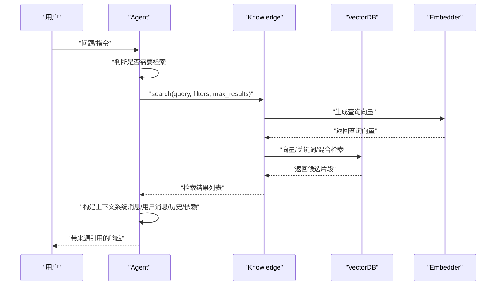
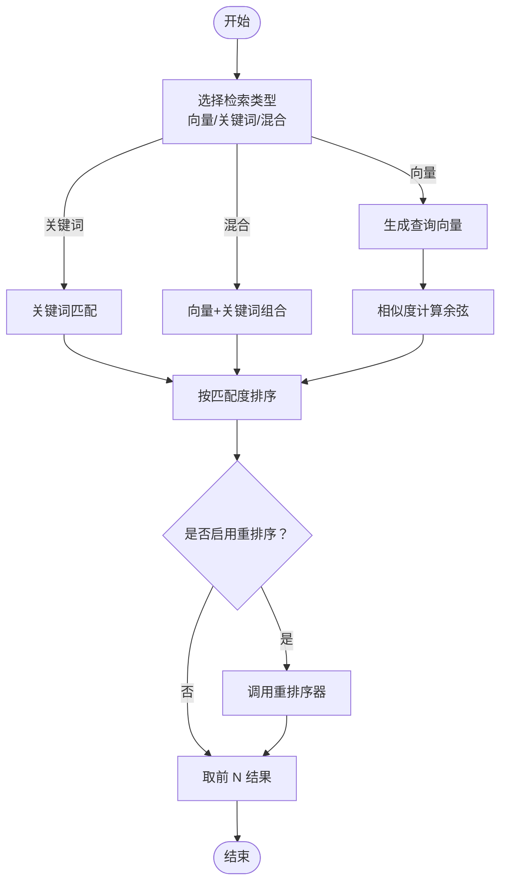
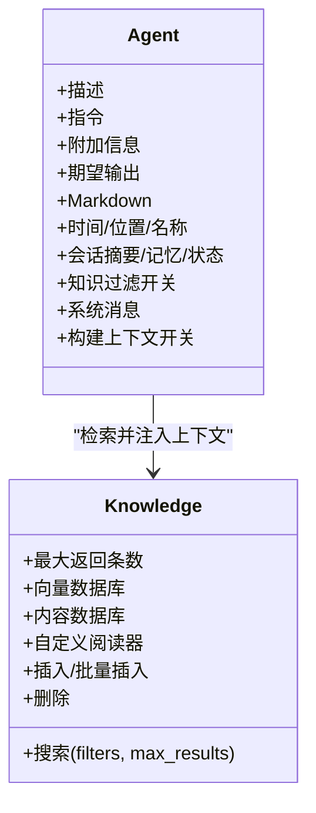
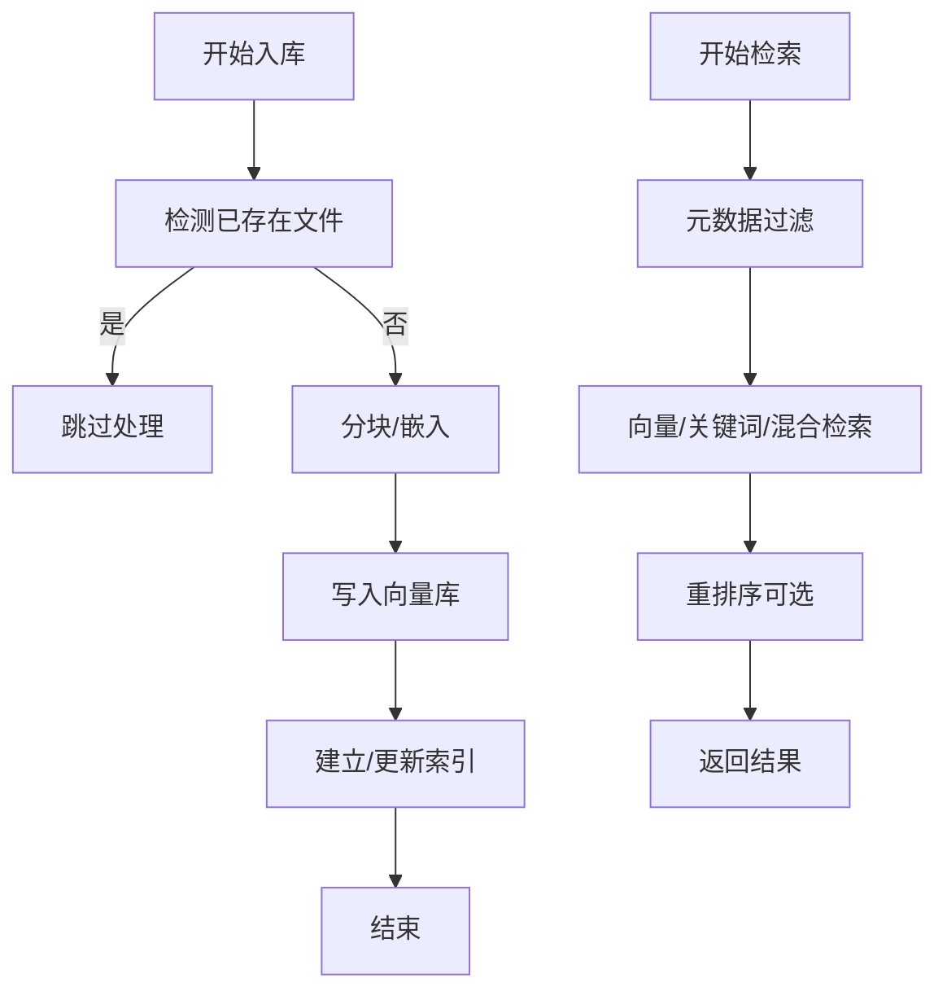
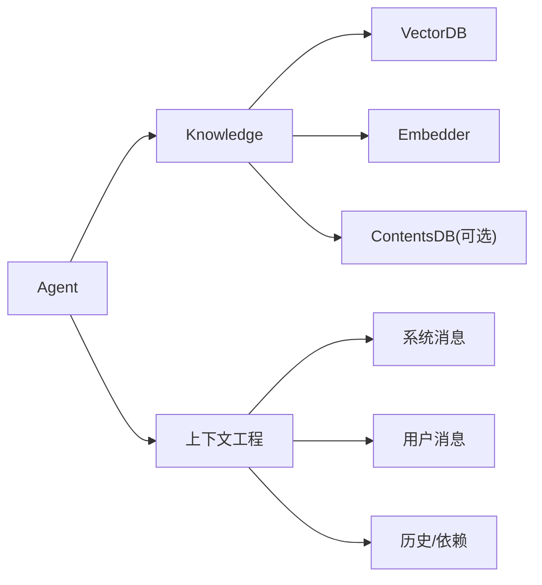

# 知识注入与检索

<cite>
**本文引用的文件**
- [知识概念：搜索与检索概览](file://knowledge/concepts/search-and-retrieval/overview.mdx)
- [知识概念：向量搜索](file://knowledge/concepts/search-and-retrieval/vector-search.mdx)
- [知识概念：自定义检索器](file://knowledge/concepts/search-and-retrieval/custom-retriever.mdx)
- [知识概念：分块（语义分块）](file://knowledge/concepts/chunking/semantic-chunking.mdx)
- [知识概念：嵌入器总览](file://knowledge/concepts/embedder/overview.mdx)
- [知识参考：Knowledge 类参数](file://_snippets/knowledge-reference.mdx)
- [知识：知识库概览](file://knowledge/overview.mdx)
- [知识：性能优化建议](file://knowledge/concepts/performance-tips.mdx)
- [Agent 上下文工程：概览](file://context/agent/overview.mdx)
- [示例：传统 RAG 与智能体 RAG](file://knowledge/agents/rag-sentence-transformer.mdx)
- [示例：分布式 RAG（PgVector）](file://examples/teams/distributed-rag/distributed-rag-pgvector.mdx)
- [示例：知识过滤（PgVector）](file://examples/knowledge/filters/vector-dbs/filtering-pgvector.mdx)
- [示例：知识过滤（ChromaDB）](file://examples/knowledge/filters/vector-dbs/filtering-chroma-db.mdx)
- [示例：知识过滤（Milvus）](file://examples/knowledge/filters/vector-dbs/filtering-milvus.mdx)
- [示例：知识过滤（SurrealDB）](file://examples/knowledge/filters/vector-dbs/filtering-surrealdb.mdx)
- [示例：语义分块（Agno 嵌入器）](file://examples/knowledge/chunking/semantic-chunking-agno-embedder.mdx)
- [示例：语义分块（Chonkie 嵌入器）](file://examples/knowledge/chunking/semantic-chunking-chonkie-embedder.mdx)
- [示例：Agent 搜索知识](file://examples/basics/agent-search-over-knowledge.mdx)
- [示例：AgentOS 多知识库](file://examples/agent-os/knowledge/agentos-knowledge.mdx)
- [工具：知识工具](file://tools/reasoning_tools/knowledge-tools.mdx)
- [参考：知识接口](file://reference/knowledge/knowledge.mdx)
- [参考：知识搜索接口](file://reference-api/schema/knowledge/search-knowledge.mdx)
</cite>

## 目录
1. [简介](#简介)
2. [项目结构](#项目结构)
3. [核心组件](#核心组件)
4. [架构总览](#架构总览)
5. [详细组件分析](#详细组件分析)
6. [依赖关系分析](#依赖关系分析)
7. [性能考量](#性能考量)
8. [故障排查指南](#故障排查指南)
9. [结论](#结论)
10. [附录](#附录)

## 简介
本文件围绕“学到的知识”如何通过语义搜索注入到代理上下文，以及知识检索的算法与策略展开，重点覆盖：
- 如何将学到的知识以语义方式注入到代理上下文
- 检索算法与策略（向量相似度、关键词匹配、混合检索、重排序）
- 上下文注入的格式与结构（相关学习内容的组织方式）
- 配置选项与性能优化方法
- 对代理响应质量与准确性的提升效果
- 缓存策略与实时更新机制

## 项目结构
该仓库提供了从“知识入库—语义检索—上下文注入—响应生成”的完整链路文档与示例，涉及：
- 知识概念：搜索与检索、分块、嵌入器、性能优化
- 示例：不同向量数据库的过滤与检索、分布式 RAG、语义分块等
- Agent 上下文工程：系统消息、用户消息、历史、依赖注入等
- 工具与接口：知识工具、知识搜索接口等

**图表来源**
- [知识概念：搜索与检索概览](file://knowledge/concepts/search-and-retrieval/overview.mdx)
- [知识概念：向量搜索](file://knowledge/concepts/search-and-retrieval/vector-search.mdx)
- [知识概念：自定义检索器](file://knowledge/concepts/search-and-retrieval/custom-retriever.mdx)
- [知识概念：分块（语义分块）](file://knowledge/concepts/chunking/semantic-chunking.mdx)
- [知识概念：嵌入器总览](file://knowledge/concepts/embedder/overview.mdx)
- [知识：性能优化建议](file://knowledge/concepts/performance-tips.mdx)
- [Agent 上下文工程：概览](file://context/agent/overview.mdx)
- [示例：分布式 RAG（PgVector）](file://examples/teams/distributed-rag/distributed-rag-pgvector.mdx)
- [示例：知识过滤（PgVector/Chroma/Milvus/SurrealDB）](file://examples/knowledge/filters/vector-dbs/filtering-pgvector.mdx)
- [示例：语义分块（Agno/Chonkie 嵌入器）](file://examples/knowledge/chunking/semantic-chunking-agno-embedder.mdx)
- [示例：Agent 搜索知识](file://examples/basics/agent-search-over-knowledge.mdx)
- [示例：AgentOS 多知识库](file://examples/agent-os/knowledge/agentos-knowledge.mdx)
- [工具：知识工具](file://tools/reasoning_tools/knowledge-tools.mdx)
- [参考：知识接口](file://reference/knowledge/knowledge.mdx)
- [参考：知识搜索接口](file://reference-api/schema/knowledge/search-knowledge.mdx)

**章节来源**
- [知识概念：搜索与检索概览](file://knowledge/concepts/search-and-retrieval/overview.mdx)
- [Agent 上下文工程：概览](file://context/agent/overview.mdx)

## 核心组件
- 知识库（Knowledge）：统一管理知识的增删查改、检索与过滤，支持多种向量数据库与嵌入器。
- 向量数据库（VectorDB）：存储向量与元数据，支持向量相似度、关键词与混合检索。
- 嵌入器（Embedder）：将文本转换为向量，支撑语义检索。
- 分块策略（Chunking）：将长文档切分为适合检索的片段，语义分块可按语义边界切分。
- 检索器（Retriever）：内置或自定义检索逻辑，支持查询扩展、多源合并、直接数据库访问等。
- Agent 上下文工程：控制系统消息、用户消息、历史、依赖注入等，决定检索结果如何注入上下文。

**章节来源**
- [知识参考：Knowledge 类参数](file://_snippets/knowledge-reference.mdx)
- [知识概念：嵌入器总览](file://knowledge/concepts/embedder/overview.mdx)
- [知识概念：分块（语义分块）](file://knowledge/concepts/chunking/semantic-chunking.mdx)
- [Agent 上下文工程：概览](file://context/agent/overview.mdx)

## 架构总览
下图展示了“学到的知识”从入库到注入上下文的整体流程：

**图表来源**
- [知识概念：搜索与检索概览](file://knowledge/concepts/search-and-retrieval/overview.mdx)
- [知识概念：向量搜索](file://knowledge/concepts/search-and-retrieval/vector-search.mdx)
- [Agent 上下文工程：概览](file://context/agent/overview.mdx)

## 详细组件分析

### 组件一：检索算法与策略
- 向量搜索：基于余弦相似度，寻找与查询向量最接近的向量，适合语义理解。
- 关键词搜索：基于全文索引或关键词匹配，适合精确术语检索。
- 混合检索：结合向量相似度与关键词匹配，通常在生产环境优先选择。
- 重排序（Reranker）：对候选结果进行二次排序，进一步提升排序质量。
- 自定义检索器：支持查询扩展、多源合并、直接数据库访问等高级策略。

**图表来源**
- [知识概念：搜索与检索概览](file://knowledge/concepts/search-and-retrieval/overview.mdx)
- [知识概念：向量搜索](file://knowledge/concepts/search-and-retrieval/vector-search.mdx)
- [知识概念：自定义检索器](file://knowledge/concepts/search-and-retrieval/custom-retriever.mdx)

**章节来源**
- [知识概念：搜索与检索概览](file://knowledge/concepts/search-and-retrieval/overview.mdx)
- [知识概念：向量搜索](file://knowledge/concepts/search-and-retrieval/vector-search.mdx)
- [知识概念：自定义检索器](file://knowledge/concepts/search-and-retrieval/custom-retriever.mdx)

### 组件二：上下文注入的格式与结构
- 系统消息：包含描述、指令、附加信息、期望输出等，可选择性包裹指令标签、添加时间、位置、会话摘要、记忆、会话状态等。
- 用户消息：包含原始输入与附加上下文（如依赖注入），可选将知识引用加入用户消息。
- 历史与工具调用：可限制最近若干次工具调用进入上下文，控制上下文长度。
- 知识引用：检索结果可作为“引用”注入到系统或用户消息中，便于模型在生成时引用来源。

**图表来源**
- [Agent 上下文工程：概览](file://context/agent/overview.mdx)
- [知识参考：Knowledge 类参数](file://_snippets/knowledge-reference.mdx)

**章节来源**
- [Agent 上下文工程：概览](file://context/agent/overview.mdx)
- [知识参考：Knowledge 类参数](file://_snippets/knowledge-reference.mdx)

### 组件三：知识注入对响应质量与准确性的影响
- 减少幻觉：通过引用来源，降低模型凭空编造的概率。
- 提升准确性：检索到的上下文更贴合用户意图，减少无关信息干扰。
- 支持多轮对话：结合会话历史与记忆，形成连贯的上下文。
- 可解释性：明确标注来源，增强可信度与可追溯性。

**章节来源**
- [知识：知识库概览](file://knowledge/overview.mdx)
- [Agent 上下文工程：概览](file://context/agent/overview.mdx)

### 组件四：缓存策略与实时更新机制
- 模型侧提示缓存：将静态内容置于系统消息开头，复用缓存以降低 token 消耗。
- 内容去重与跳过：在批量入库时使用“已存在则跳过”，避免重复处理。
- 过滤先行：先用元数据过滤缩小搜索范围，再执行检索。
- 异步批处理：并发加载多个来源，缩短整体入库时间。
- 实时更新：通过知识工具或 Agent 的检索能力，动态补充最新信息。

**图表来源**
- [知识：性能优化建议](file://knowledge/concepts/performance-tips.mdx)
- [知识概念：搜索与检索概览](file://knowledge/concepts/search-and-retrieval/overview.mdx)

**章节来源**
- [知识：性能优化建议](file://knowledge/concepts/performance-tips.mdx)
- [知识概念：搜索与检索概览](file://knowledge/concepts/search-and-retrieval/overview.mdx)

## 依赖关系分析
- Knowledge 依赖 VectorDB 与 Embedder 完成检索与嵌入；可选内容数据库用于存储元数据与内容。
- Agent 通过 Knowledge 的 search 接口获取结果，并将其注入上下文。
- 自定义检索器可绕过 Knowledge 抽象，直接对接向量数据库或外部服务。
- 上下文工程参数影响最终注入的内容结构与大小。

**图表来源**
- [Agent 上下文工程：概览](file://context/agent/overview.mdx)
- [知识参考：Knowledge 类参数](file://_snippets/knowledge-reference.mdx)

**章节来源**
- [Agent 上下文工程：概览](file://context/agent/overview.mdx)
- [知识参考：Knowledge 类参数](file://_snippets/knowledge-reference.mdx)

## 性能考量
- 数据库选择：开发阶段可用零配置向量库，生产阶段推荐具备 SQL 能力与扩展性的数据库。
- 入库优化：跳过已存在文件、异步批处理、按需包含/排除文件类型。
- 检索优化：先过滤再检索、适当增加返回条数、必要时启用重排序。
- 嵌入器维度：在性能与精度之间权衡，必要时降低维度。
- 监控与调试：记录检索耗时、检查失败内容状态，定位瓶颈。

**章节来源**
- [知识：性能优化建议](file://knowledge/concepts/performance-tips.mdx)

## 故障排查指南
- 检索结果不相关：调整分块策略（固定/递归/语义）、增大返回条数、增加元数据过滤。
- 入库缓慢：开启“跳过已存在”，使用异步批处理，减少大文件一次性处理。
- 内存占用高：减小批处理规模、降低分块大小、清理旧内容。
- 源码路径参考：
  - 检索与过滤示例：[知识过滤（PgVector）](file://examples/knowledge/filters/vector-dbs/filtering-pgvector.mdx)、[知识过滤（ChromaDB）](file://examples/knowledge/filters/vector-dbs/filtering-chroma-db.mdx)、[知识过滤（Milvus）](file://examples/knowledge/filters/vector-dbs/filtering-milvus.mdx)、[知识过滤（SurrealDB）](file://examples/knowledge/filters/vector-dbs/filtering-surrealdb.mdx)
  - 语义分块示例：[语义分块（Agno 嵌入器）](file://examples/knowledge/chunking/semantic-chunking-agno-embedder.mdx)、[语义分块（Chonkie 嵌入器）](file://examples/knowledge/chunking/semantic-chunking-chonkie-embedder.mdx)
  - 智能体检索示例：[Agent 搜索知识](file://examples/basics/agent-search-over-knowledge.mdx)、[分布式 RAG（PgVector）](file://examples/teams/distributed-rag/distributed-rag-pgvector.mdx)

**章节来源**
- [知识：性能优化建议](file://knowledge/concepts/performance-tips.mdx)
- [示例：知识过滤（PgVector）](file://examples/knowledge/filters/vector-dbs/filtering-pgvector.mdx)
- [示例：知识过滤（ChromaDB）](file://examples/knowledge/filters/vector-dbs/filtering-chroma-db.mdx)
- [示例：知识过滤（Milvus）](file://examples/knowledge/filters/vector-dbs/filtering-milvus.mdx)
- [示例：知识过滤（SurrealDB）](file://examples/knowledge/filters/vector-dbs/filtering-surrealdb.mdx)
- [示例：语义分块（Agno 嵌入器）](file://examples/knowledge/chunking/semantic-chunking-agno-embedder.mdx)
- [示例：语义分块（Chonkie 嵌入器）](file://examples/knowledge/chunking/semantic-chunking-chonkie-embedder.mdx)
- [示例：Agent 搜索知识](file://examples/basics/agent-search-over-knowledge.mdx)
- [示例：分布式 RAG（PgVector）](file://examples/teams/distributed-rag/distributed-rag-pgvector.mdx)

## 结论
通过语义检索将“学到的知识”注入代理上下文，能够显著提升响应的准确性与可解释性。结合合适的分块策略、嵌入器与检索策略（向量/关键词/混合/重排序），并在上下文工程中合理组织系统消息与用户消息，可以实现高效、可控且可扩展的知识注入与检索体系。同时，借助缓存、异步批处理与过滤先行等优化手段，可在保证质量的前提下提升性能与稳定性。

## 附录
- 知识工具：提供思考、检索、分析等工具，辅助 Agent 更好地利用知识库。
- 知识搜索接口：提供标准的搜索端点，便于集成到客户端或工作流中。
- 智能体 RAG 与传统 RAG：智能体 RAG 允许 Agent 自主决策何时检索、如何重组查询与合并结果，更适合复杂任务。

**章节来源**
- [工具：知识工具](file://tools/reasoning_tools/knowledge-tools.mdx)
- [参考：知识搜索接口](file://reference-api/schema/knowledge/search-knowledge.mdx)
- [知识概念：搜索与检索概览](file://knowledge/concepts/search-and-retrieval/overview.mdx)
- [示例：传统 RAG 与智能体 RAG](file://knowledge/agents/rag-sentence-transformer.mdx)