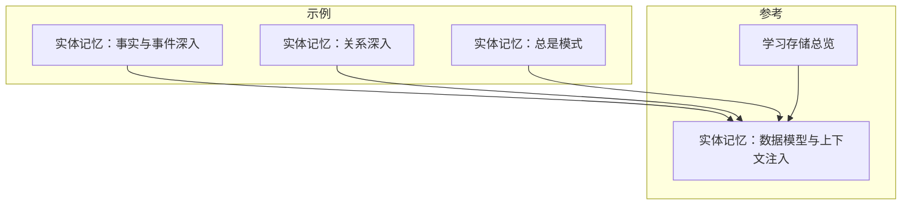
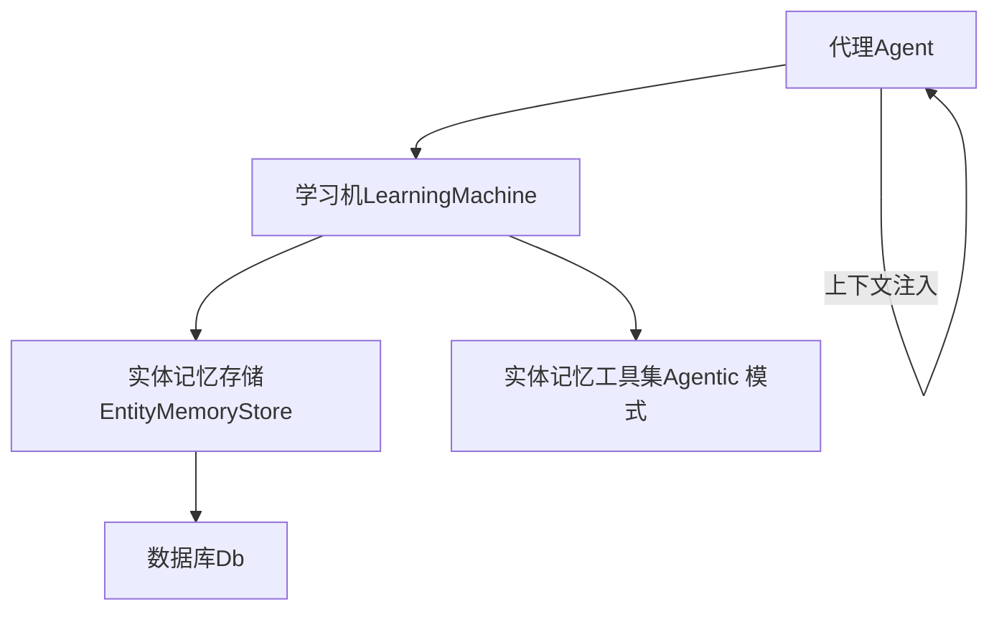
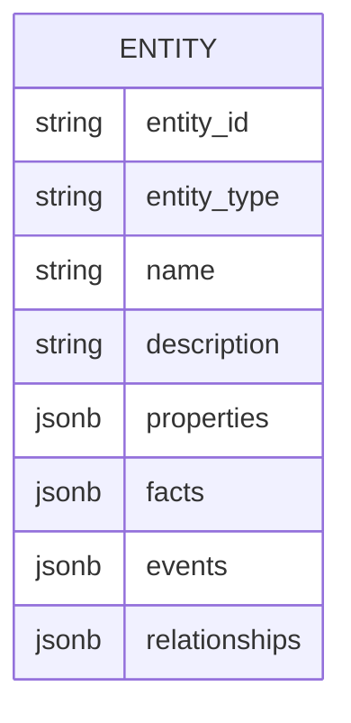
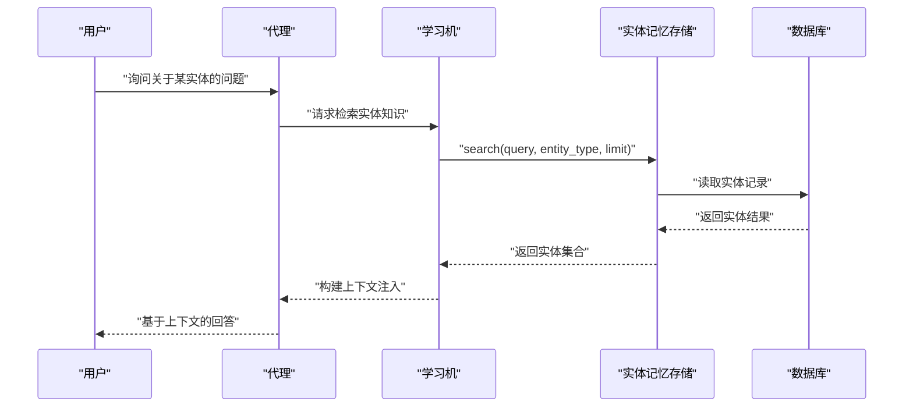
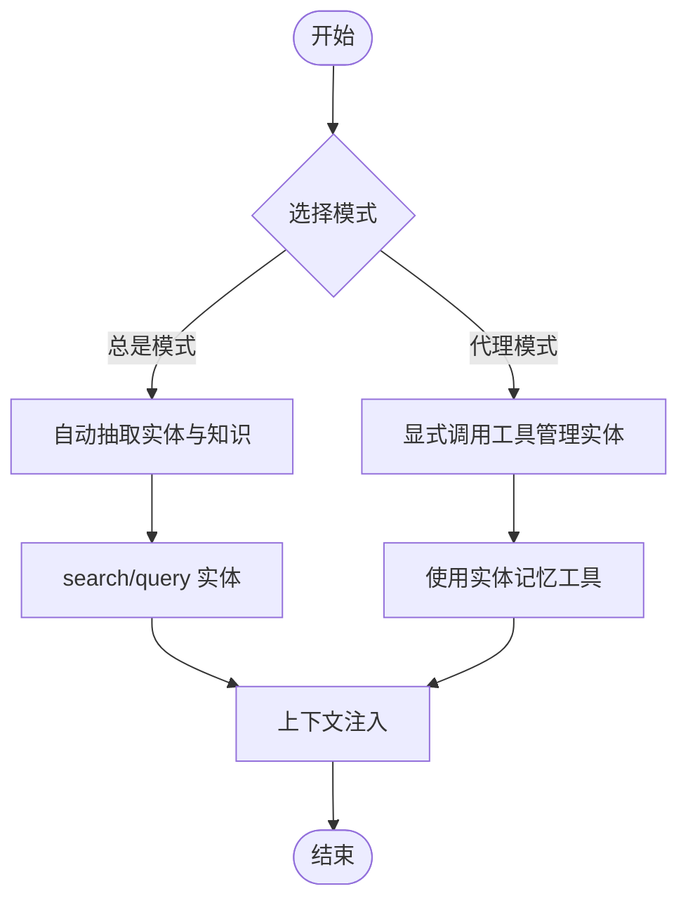
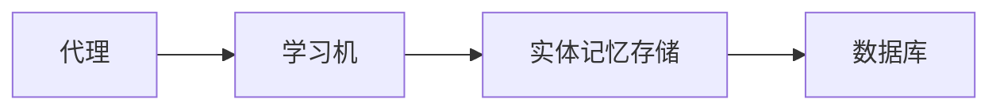

# 事实和事件

<cite>
**本文引用的文件**
- [实体记忆：事实与事件（深入）](file://examples/learning/entity-memory/facts-and-events.mdx)
- [实体记忆：关系（深入）](file://examples/learning/entity-memory/entity-relationships.mdx)
- [实体记忆：总是模式](file://examples/learning/basics/a-entity-memory-always.mdx)
- [实体记忆：数据模型与上下文注入](file://learning/stores/entity-memory.mdx)
- [学习存储总览](file://learning/stores/intro.mdx)
</cite>

## 目录
1. [引言](#引言)
2. [项目结构](#项目结构)
3. [核心组件](#核心组件)
4. [架构总览](#架构总览)
5. [详细组件分析](#详细组件分析)
6. [依赖分析](#依赖分析)
7. [性能考量](#性能考量)
8. [故障排查指南](#故障排查指南)
9. [结论](#结论)
10. [附录](#附录)

## 引言
本篇文档围绕“实体记忆”中的“事实（Facts）”与“事件（Events）”概念展开，系统阐述其定义、区别、应用场景、数据结构、存储方式、查询机制，以及它们在上下文注入与代理决策中的作用。我们将结合仓库中的示例与参考文档，给出可操作的最佳实践与常见使用模式，并通过图示帮助读者建立从输入到检索再到决策的完整理解。

## 项目结构
与“实体记忆中的事实与事件”直接相关的内容主要分布在以下位置：
- 示例：实体记忆的“事实与事件”“关系”“总是模式”三个示例文档，演示了如何在对话中自动或显式地提取与管理实体知识。
- 参考：实体记忆的数据模型、上下文注入格式、命名空间与模式选择等说明。
- 学习存储总览：将实体记忆归类为多类学习存储之一，便于理解其在整个知识体系中的定位。

**图表来源**
- [实体记忆：事实与事件（深入）:1-120](file://examples/learning/entity-memory/facts-and-events.mdx#L1-L120)
- [实体记忆：关系（深入）:1-120](file://examples/learning/entity-memory/entity-relationships.mdx#L1-L120)
- [实体记忆：总是模式:1-103](file://examples/learning/basics/a-entity-memory-always.mdx#L1-L103)
- [实体记忆：数据模型与上下文注入:1-184](file://learning/stores/entity-memory.mdx#L1-L184)
- [学习存储总览:1-19](file://learning/stores/intro.mdx#L1-L19)

**章节来源**
- [实体记忆：事实与事件（深入）:1-120](file://examples/learning/entity-memory/facts-and-events.mdx#L1-L120)
- [实体记忆：关系（深入）:1-120](file://examples/learning/entity-memory/entity-relationships.mdx#L1-L120)
- [实体记忆：总是模式:1-103](file://examples/learning/basics/a-entity-memory-always.mdx#L1-L103)
- [实体记忆：数据模型与上下文注入:1-184](file://learning/stores/entity-memory.mdx#L1-L184)
- [学习存储总览:1-19](file://learning/stores/intro.mdx#L1-L19)

## 核心组件
- 实体记忆存储（Entity Memory Store）
  - 职责：持久化外部实体（公司、人、项目等）的结构化知识；支持事实、事件、关系三类知识；提供搜索与调试输出能力。
  - 模式：
    - 总是模式（Always）：自动从对话中抽取实体信息，无需显式工具调用。
    - 代理模式（Agentic）：向代理暴露工具，允许显式创建/更新实体与事实、添加事件与关系。
  - 命名空间：支持 global（全局共享）、user（按用户私有）、自定义分组，控制访问范围。
- 上下文注入
  - 将与当前会话相关的实体知识注入到系统提示词末尾，供模型在回答时参考，提升准确性与一致性。
- 数据模型
  - 字段概览：实体标识、类型、名称、描述、属性、事实列表、事件列表、关系列表。
- 查询与调试
  - 提供 search 与 print 等方法，便于检索与核对实体内容。

**章节来源**
- [实体记忆：数据模型与上下文注入:10-184](file://learning/stores/entity-memory.mdx#L10-L184)

## 架构总览
实体记忆在代理系统中的位置与交互如下：

**图表来源**
- [实体记忆：数据模型与上下文注入:10-184](file://learning/stores/entity-memory.mdx#L10-L184)
- [实体记忆：事实与事件（深入）:1-120](file://examples/learning/entity-memory/facts-and-events.mdx#L1-L120)
- [实体记忆：关系（深入）:1-120](file://examples/learning/entity-memory/entity-relationships.mdx#L1-L120)
- [实体记忆：总是模式:1-103](file://examples/learning/basics/a-entity-memory-always.mdx#L1-L103)

## 详细组件分析

### 事实（Facts）与事件（Events）的概念与区别
- 事实（Facts）
  - 定义：时间永恒的真相，如技术栈、总部位置、员工数量、行业领域、定价模型等。
  - 特点：稳定、可复用、跨时间一致。
- 事件（Events）
  - 定义：带时间边界的发生性事实，如产品发布、融资轮次、故障事件、关键会议等。
  - 特点：具有时间戳或时间段，随时间演进，需要持续更新。
- 应用场景
  - 使用事实：回答“他们用什么技术栈？”“总部在哪里？”“有多少员工？”
  - 使用事件：回答“最近发生了什么？”“上个季度的进展如何？”“最近的融资情况？”

**章节来源**
- [实体记忆：数据模型与上下文注入:46-177](file://learning/stores/entity-memory.mdx#L46-L177)

### 数据模型与存储方式
- 数据模型字段
  - 实体标识、实体类型（公司/人/项目）、显示名称、简要描述、属性（键值元数据）、事实列表、事件列表、关系列表。
- 存储与访问
  - 通过学习机获取实体记忆存储实例，使用 search 与 print 方法进行检索与调试。
  - 支持不同数据库后端（如 Postgres、Redis、SQLite、Mongo 等），具体取决于应用配置。

**图表来源**
- [实体记忆：数据模型与上下文注入:99-111](file://learning/stores/entity-memory.mdx#L99-L111)

**章节来源**
- [实体记忆：数据模型与上下文注入:99-128](file://learning/stores/entity-memory.mdx#L99-L128)

### 查询机制与上下文注入
- 查询
  - 通过 search 接口按关键词、实体类型、限制条数进行检索，返回实体对象集合。
- 上下文注入
  - 将匹配到的实体知识以统一格式注入到系统提示词末尾，包含实体名称、类型、属性、事实、事件与关系，供模型在生成响应时优先参考。

**图表来源**
- [实体记忆：数据模型与上下文注入:112-150](file://learning/stores/entity-memory.mdx#L112-L150)

**章节来源**
- [实体记忆：数据模型与上下文注入:112-150](file://learning/stores/entity-memory.mdx#L112-L150)

### 模式与工具：总是模式 vs 代理模式
- 总是模式（Always）
  - 自动从对话中抽取实体信息，无需显式工具调用；适合希望“无感”积累知识的场景。
- 代理模式（Agentic）
  - 向代理暴露工具集，包括搜索实体、创建实体、更新实体、新增/更新事实、新增事件、添加关系等；适合需要精细控制与显式管理的场景。

**图表来源**
- [实体记忆：数据模型与上下文注入:60-98](file://learning/stores/entity-memory.mdx#L60-L98)

**章节来源**
- [实体记忆：数据模型与上下文注入:60-98](file://learning/stores/entity-memory.mdx#L60-L98)

### 关系（Relationships）与知识图谱
- 关系用于连接实体，形成知识图谱，如“某人任职于某公司”“某公司被收购”“某项目依赖某服务”等。
- 在代理模式下，可通过关系工具为实体建立连接，丰富上下文与推理依据。

**章节来源**
- [实体记忆：关系（深入）:1-120](file://examples/learning/entity-memory/entity-relationships.mdx#L1-L120)
- [实体记忆：数据模型与上下文注入:178-184](file://learning/stores/entity-memory.mdx#L178-L184)

### 具体使用示例（路径指引）
- 添加与更新事实与事件
  - 在代理模式下，通过工具新增/更新事实与事件，随后查询实体以确认更新结果。
  - 示例路径：[实体记忆：事实与事件（深入）:52-106](file://examples/learning/entity-memory/facts-and-events.mdx#L52-L106)
- 自动抽取（总是模式）
  - 在总是模式下，自然对话即可触发实体抽取与更新，后续查询实体以查看累积的知识。
  - 示例路径：[实体记忆：总是模式:51-88](file://examples/learning/basics/a-entity-memory-always.mdx#L51-L88)
- 显式管理关系
  - 在代理模式下，通过关系工具为组织结构或公司关系建模，随后查询以验证。
  - 示例路径：[实体记忆：关系（深入）:52-105](file://examples/learning/entity-memory/entity-relationships.mdx#L52-L105)

**章节来源**
- [实体记忆：事实与事件（深入）:52-106](file://examples/learning/entity-memory/facts-and-events.mdx#L52-L106)
- [实体记忆：总是模式:51-88](file://examples/learning/basics/a-entity-memory-always.mdx#L51-L88)
- [实体记忆：关系（深入）:52-105](file://examples/learning/entity-memory/entity-relationships.mdx#L52-L105)

## 依赖分析
- 组件耦合
  - 代理依赖学习机；学习机协调实体记忆存储；实体记忆存储依赖数据库后端。
- 外部依赖
  - 数据库适配器（Postgres、Redis、SQLite、Mongo 等）由应用配置决定。
- 潜在循环依赖
  - 文档未显示循环依赖迹象；模块间为单向依赖（代理 → 学习机 → 实体记忆存储 → 数据库）。

**图表来源**
- [实体记忆：数据模型与上下文注入:10-184](file://learning/stores/entity-memory.mdx#L10-L184)

**章节来源**
- [实体记忆：数据模型与上下文注入:10-184](file://learning/stores/entity-memory.mdx#L10-L184)

## 性能考量
- 总是模式的额外开销
  - 每次交互可能触发一次额外的 LLM 调用来抽取实体，带来一定的延迟与成本增加。
- 查询与上下文大小
  - 上下文注入会将实体知识附加到系统提示词末尾，需关注上下文长度限制与生成耗时。
- 命名空间与访问控制
  - 合理设置命名空间（全局/用户/自定义）可减少无关实体注入，降低上下文冗余。
- 存储后端选择
  - 针对高并发与低延迟需求，可考虑 Redis 等高性能后端；对长期持久化与复杂查询，可选择 Postgres/Mongo 等。

[本节为通用建议，不直接分析具体文件]

## 故障排查指南
- 实体未被抽取
  - 检查是否处于总是模式；确认对话中是否包含明确的实体提及；必要时切换至代理模式并显式调用工具。
- 实体知识未注入上下文
  - 确认 search 返回结果非空；检查上下文注入逻辑是否启用；核对实体类型与关键词匹配。
- 更新未生效
  - 在代理模式下确认已正确调用“新增/更新事实/事件”工具；在总是模式下确认对话语境足够明确。
- 查询结果过多或过少
  - 调整查询关键词、实体类型过滤与 limit 参数；优化命名空间以缩小搜索范围。

**章节来源**
- [实体记忆：数据模型与上下文注入:112-150](file://learning/stores/entity-memory.mdx#L112-L150)
- [实体记忆：事实与事件（深入）:79-106](file://examples/learning/entity-memory/facts-and-events.mdx#L79-L106)
- [实体记忆：总是模式:73-88](file://examples/learning/basics/a-entity-memory-always.mdx#L73-L88)

## 结论
事实与事件构成了实体记忆的两大支柱：前者提供稳定的背景知识，后者承载动态的时间序列信息。通过合理选择模式（总是/代理）、命名空间与存储后端，并配合有效的查询与上下文注入策略，实体记忆能够在代理系统中显著提升决策质量与上下文一致性。建议在实际应用中结合业务场景，优先采用总是模式进行无感积累，在需要精细控制时切换至代理模式进行显式管理。

[本节为总结性内容，不直接分析具体文件]

## 附录
- 最佳实践
  - 明确区分事实与事件，避免混用；对事件保留时间戳或时间段。
  - 使用代理模式时，优先显式创建/更新实体，再进行查询核验。
  - 控制上下文规模，优先注入与当前任务最相关的实体知识。
  - 合理划分命名空间，确保隐私与权限边界清晰。
- 常见使用模式
  - 销售助手：记录客户公司事实（技术栈、规模）与近期事件（融资、合作）。
  - 研究分析师：维护目标公司与人物的关系图谱，结合事件追踪进展。
  - 运维助理：记录基础设施事件（故障、升级），沉淀技术栈与部署事实。

[本节为通用建议，不直接分析具体文件]