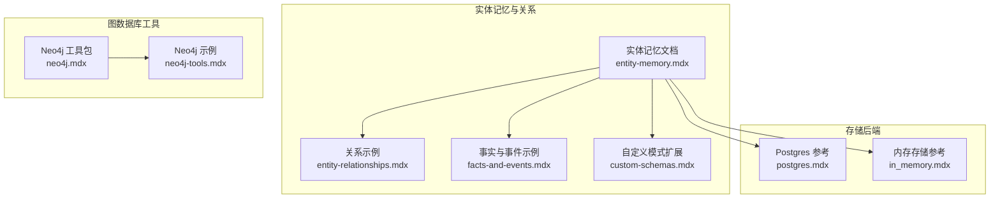
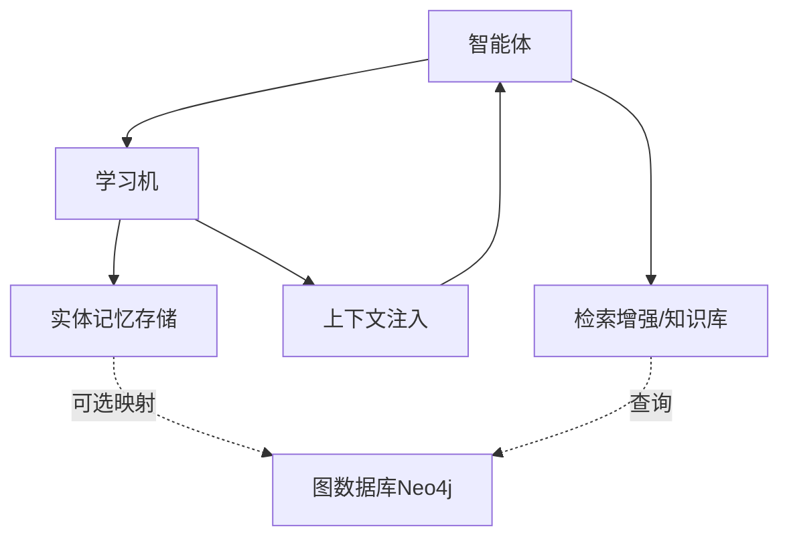
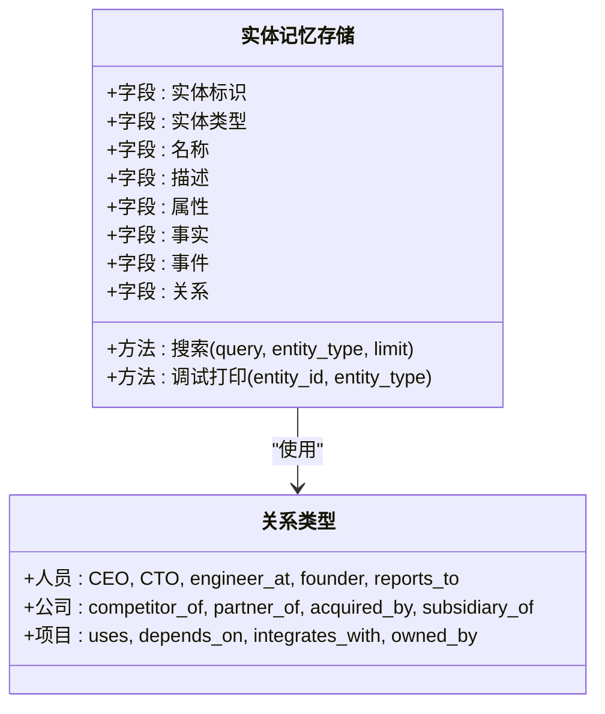
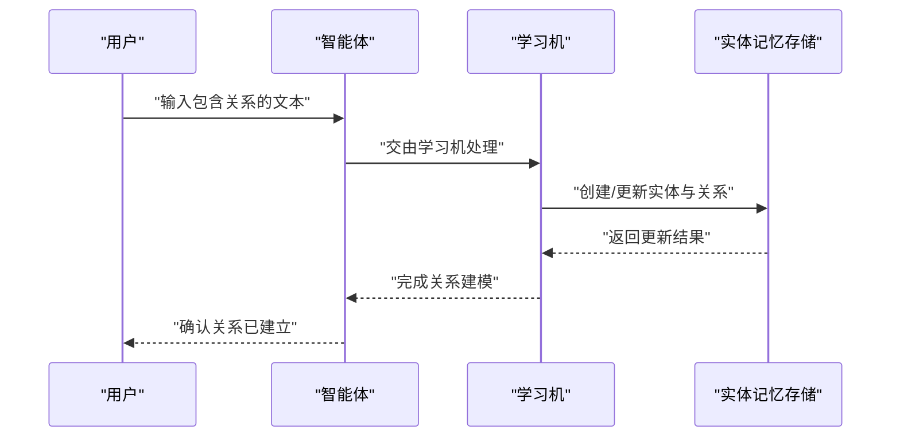
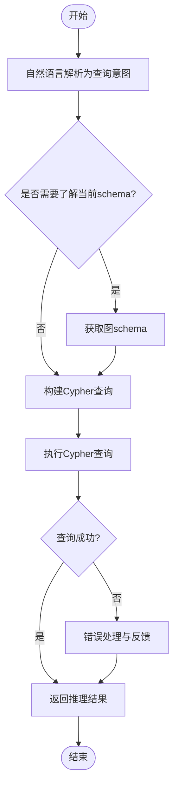
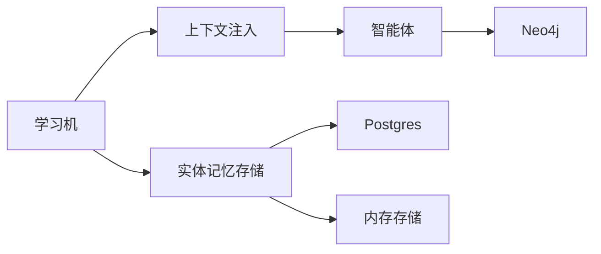

# 实体关系

<cite>
**本文引用的文件**
- [entity-memory.mdx](file://learning/stores/entity-memory.mdx)
- [entity-relationships.mdx](file://examples/learning/entity-memory/entity-relationships.mdx)
- [facts-and-events.mdx](file://examples/learning/entity-memory/facts-and-events.mdx)
- [custom-schemas.mdx](file://learning/custom-schemas.mdx)
- [neo4j.mdx](file://tools/toolkits/database/neo4j.mdx)
- [neo4j-tools.mdx](file://examples/tools/neo4j-tools.mdx)
- [postgres.mdx](file://reference/storage/postgres.mdx)
- [in_memory.mdx](file://reference/storage/in_memory.mdx)
- [entity-memory-overview.mdx](file://examples/learning/entity-memory/overview.mdx)
</cite>

## 目录
1. [引言](#引言)
2. [项目结构](#项目结构)
3. [核心组件](#核心组件)
4. [架构总览](#架构总览)
5. [详细组件分析](#详细组件分析)
6. [依赖分析](#依赖分析)
7. [性能考虑](#性能考虑)
8. [故障排查指南](#故障排查指南)
9. [结论](#结论)
10. [附录](#附录)

## 引言
本技术文档围绕“实体关系建模”展开，系统阐述如何在智能体系统中构建与维护实体之间的连接关系，覆盖人员关系（如 CEO、CTO、工程师等）、公司关系（如竞争对手、合作伙伴、收购关系）与项目关系（如使用、依赖、集成等）。文档从关系类型定义、关系建立与维护机制、关系查询与推理能力、关系在实体记忆中的作用，到关系图谱的概念与可视化方法，以及关系数据的存储结构与查询优化策略进行完整说明，并提供可操作的实现指南与扩展方法。

## 项目结构
本仓库提供了实体关系建模的多处参考材料与示例：
- 学习与记忆：实体记忆（Entity Memory）文档与示例，涵盖事实、事件与关系三类知识，支持 Always 与 Agentic 两种学习模式。
- 图数据库工具：Neo4j 工具包与示例，展示如何通过自然语言生成 Cypher 查询，实现多跳推理与图谱管理。
- 存储后端：PostgreSQL 与内存数据库的存储参考，支撑实体关系的持久化与检索。

**图表来源**
- [entity-memory.mdx](file://learning/stores/entity-memory.mdx)
- [entity-relationships.mdx](file://examples/learning/entity-memory/entity-relationships.mdx)
- [facts-and-events.mdx](file://examples/learning/entity-memory/facts-and-events.mdx)
- [custom-schemas.mdx](file://learning/custom-schemas.mdx)
- [neo4j.mdx](file://tools/toolkits/database/neo4j.mdx)
- [neo4j-tools.mdx](file://examples/tools/neo4j-tools.mdx)
- [postgres.mdx](file://reference/storage/postgres.mdx)
- [in_memory.mdx](file://reference/storage/in_memory.mdx)

**章节来源**
- [entity-memory.mdx](file://learning/stores/entity-memory.mdx)
- [entity-relationships.mdx](file://examples/learning/entity-memory/entity-relationships.mdx)
- [facts-and-events.mdx](file://examples/learning/entity-memory/facts-and-events.mdx)
- [custom-schemas.mdx](file://learning/custom-schemas.mdx)
- [neo4j.mdx](file://tools/toolkits/database/neo4j.mdx)
- [neo4j-tools.mdx](file://examples/tools/neo4j-tools.mdx)
- [postgres.mdx](file://reference/storage/postgres.mdx)
- [in_memory.mdx](file://reference/storage/in_memory.mdx)

## 核心组件
- 实体记忆（Entity Memory）
  - 支持三种知识类型：事实（facts）、事件（events）、关系（relationships）。
  - 提供 Always 与 Agentic 两种学习模式，后者允许显式工具管理实体与关系。
  - 支持命名空间控制访问范围（全局、用户级、自定义分组）。
  - 关系类型建议：人员（CEO、CTO、engineer_at、founder、reports_to）、公司（competitor_of、partner_of、acquired_by、subsidiary_of）、项目（uses、depends_on、integrates_with、owned_by）。
- 关系示例与工作流
  - 通过示例演示组织关系（领导层、汇报关系）与公司关系（收购、合作）的建立与查询。
- 自定义模式扩展
  - 可基于现有实体模式扩展新的实体类型（如公司），以承载更丰富的属性与关系。
- 图数据库工具（Neo4j）
  - 提供列表标签、关系类型、获取模式、执行 Cypher 等能力，支持多跳推理与复杂关系查询。
- 存储后端
  - PostgreSQL 作为关系型持久化存储；内存存储用于轻量场景。

**章节来源**
- [entity-memory.mdx](file://learning/stores/entity-memory.mdx)
- [entity-relationships.mdx](file://examples/learning/entity-memory/entity-relationships.mdx)
- [custom-schemas.mdx](file://learning/custom-schemas.mdx)
- [neo4j.mdx](file://tools/toolkits/database/neo4j.mdx)
- [postgres.mdx](file://reference/storage/postgres.mdx)
- [in_memory.mdx](file://reference/storage/in_memory.mdx)

## 架构总览
下图展示了实体关系在系统中的位置与交互：智能体通过学习机提取/管理实体与关系，上下文注入时携带实体记忆；关系既可存在实体记忆内部，也可映射到外部图数据库（如 Neo4j）以进行复杂查询与推理。

**图表来源**
- [entity-memory.mdx](file://learning/stores/entity-memory.mdx)
- [entity-relationships.mdx](file://examples/learning/entity-memory/entity-relationships.mdx)
- [neo4j.mdx](file://tools/toolkits/database/neo4j.mdx)

## 详细组件分析

### 组件一：实体记忆与关系模型
- 数据模型要点
  - 字段：实体标识、实体类型（公司/人/项目）、名称、描述、属性、事实、事件、关系。
  - 访问方式：支持按关键词、类型、命名空间检索与调试输出。
- 关系类型与示例
  - 人员关系：CEO、CTO、engineer_at、founder、reports_to。
  - 公司关系：competitor_of、partner_of、acquired_by、subsidiary_of。
  - 项目关系：uses、depends_on、integrates_with、owned_by。
- 命名空间
  - 全局共享、用户私有、自定义分组，便于权限与范围控制。

**图表来源**
- [entity-memory.mdx](file://learning/stores/entity-memory.mdx)

**章节来源**
- [entity-memory.mdx](file://learning/stores/entity-memory.mdx)

### 组件二：关系建立与维护流程
- 流程概览
  - 输入：自然语言描述（组织结构、公司关系、项目关系）。
  - 处理：学习机解析并写入实体与关系；支持 Always 模式自动抽取与 Agentic 模式显式工具。
  - 输出：实体与关系更新，支持后续检索与上下文注入。

**图表来源**
- [entity-relationships.mdx](file://examples/learning/entity-memory/entity-relationships.mdx)
- [entity-memory.mdx](file://learning/stores/entity-memory.mdx)

**章节来源**
- [entity-relationships.mdx](file://examples/learning/entity-memory/entity-relationships.mdx)
- [entity-memory.mdx](file://learning/stores/entity-memory.mdx)

### 组件三：关系查询与推理
- 实体记忆内的查询
  - 支持关键词与类型过滤的搜索，结合上下文注入提升回答质量。
- 图数据库（Neo4j）推理
  - 通过自然语言转 Cypher 的方式，实现多跳关系推理与复杂路径查询。
  - 工具集提供 schema 获取、关系类型列举、Cypher 执行等能力。

**图表来源**
- [neo4j-tools.mdx](file://examples/tools/neo4j-tools.mdx)
- [neo4j.mdx](file://tools/toolkits/database/neo4j.mdx)

**章节来源**
- [neo4j-tools.mdx](file://examples/tools/neo4j-tools.mdx)
- [neo4j.mdx](file://tools/toolkits/database/neo4j.mdx)

### 组件四：关系图谱概念与可视化
- 概念
  - 将实体作为节点、关系作为边，形成知识图谱，支持多跳推理与洞察发现。
- 可视化
  - 可结合图数据库的 schema 与查询结果进行可视化展示，辅助理解复杂关系网络。
- 与实体记忆的关系
  - 实体记忆可作为“轻量图谱”或“本地知识图谱”，Neo4j 则提供更强的图计算与查询能力。

**章节来源**
- [entity-memory.mdx](file://learning/stores/entity-memory.mdx)
- [neo4j.mdx](file://tools/toolkits/database/neo4j.mdx)

### 组件五：关系数据的存储结构与查询优化
- 存储结构
  - 实体记忆：以实体为中心，内含事实、事件、关系字段，适合中小规模关系与快速检索。
  - 图数据库：节点与关系的扁平化存储，适合大规模关系与复杂查询。
- 查询优化建议
  - 在实体记忆侧：合理使用命名空间与类型过滤，减少扫描范围；对高频查询建立索引（如实体名称、类型、命名空间）。
  - 在图数据库侧：利用 schema 与索引，避免全图扫描；对常用查询路径建立索引或物化视图；限制查询深度与返回数量。

**章节来源**
- [entity-memory.mdx](file://learning/stores/entity-memory.mdx)
- [postgres.mdx](file://reference/storage/postgres.mdx)
- [in_memory.mdx](file://reference/storage/in_memory.mdx)

## 依赖分析
- 组件耦合
  - 实体记忆存储与学习机紧密耦合，学习机负责抽取与写入；上下文注入依赖实体记忆的检索结果。
  - 图数据库工具与智能体解耦，通过工具接口调用，便于替换与扩展。
- 外部依赖
  - 存储后端：PostgreSQL 提供关系型持久化；内存存储用于会话级轻量场景。
  - 图数据库：Neo4j 提供强大的图查询与推理能力。

**图表来源**
- [entity-memory.mdx](file://learning/stores/entity-memory.mdx)
- [postgres.mdx](file://reference/storage/postgres.mdx)
- [in_memory.mdx](file://reference/storage/in_memory.mdx)
- [neo4j.mdx](file://tools/toolkits/database/neo4j.mdx)

**章节来源**
- [entity-memory.mdx](file://learning/stores/entity-memory.mdx)
- [postgres.mdx](file://reference/storage/postgres.mdx)
- [in_memory.mdx](file://reference/storage/in_memory.mdx)
- [neo4j.mdx](file://tools/toolkits/database/neo4j.mdx)

## 性能考虑
- 实体记忆侧
  - 使用命名空间与类型过滤降低检索成本。
  - 对实体名称、类型、命名空间建立索引，提升查询效率。
- 图数据库侧
  - 合理规划 schema 与索引，避免全图扫描。
  - 控制查询深度与返回数量，必要时使用分页或采样。
  - 对热点查询进行缓存或物化视图优化。

## 故障排查指南
- 连接问题
  - Neo4j：检查服务端口与认证配置，确保驱动安装正确。
- 查询问题
  - schema 不一致导致的 Cypher 执行失败：先查询 schema 再执行查询。
  - 结果为空：确认实体是否存在、命名空间是否正确、查询条件是否过严。
- 实体记忆问题
  - 关系未生效：确认学习机处于 Agentic 模式且工具可用；检查上下文注入是否开启。
  - 命名空间冲突：调整命名空间设置，确保访问范围符合预期。

**章节来源**
- [neo4j.mdx](file://tools/toolkits/database/neo4j.mdx)
- [entity-memory.mdx](file://learning/stores/entity-memory.mdx)

## 结论
实体关系建模是构建智能体知识图谱的关键。通过实体记忆的三种知识类型与关系类型，结合学习机的自动/显式模式，可以在本地实现关系抽取与维护；借助图数据库（如 Neo4j）可实现复杂的多跳推理与可视化。合理的存储结构设计与查询优化策略，能够有效支撑大规模关系的高效管理与应用。

## 附录
- 快速上手
  - 使用实体记忆：参考实体记忆文档与关系示例，快速建立人员、公司与项目关系。
  - 使用图数据库：参考 Neo4j 工具包与示例，实现自然语言到 Cypher 的转换与执行。
- 扩展方法
  - 自定义实体模式：基于现有实体模式扩展新的实体类型与属性。
  - 存储后端选择：根据数据规模与查询需求选择 PostgreSQL 或内存存储。

**章节来源**
- [entity-memory.mdx](file://learning/stores/entity-memory.mdx)
- [entity-relationships.mdx](file://examples/learning/entity-memory/entity-relationships.mdx)
- [facts-and-events.mdx](file://examples/learning/entity-memory/facts-and-events.mdx)
- [custom-schemas.mdx](file://learning/custom-schemas.mdx)
- [neo4j.mdx](file://tools/toolkits/database/neo4j.mdx)
- [neo4j-tools.mdx](file://examples/tools/neo4j-tools.mdx)
- [entity-memory-overview.mdx](file://examples/learning/entity-memory/overview.mdx)