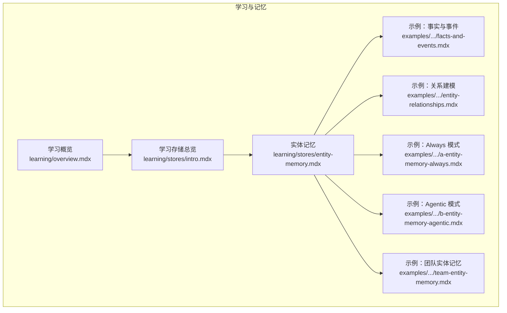
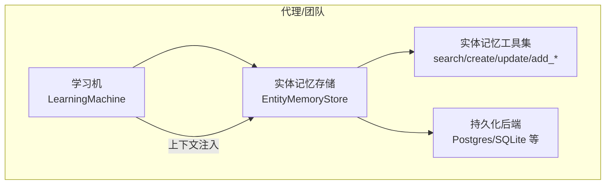
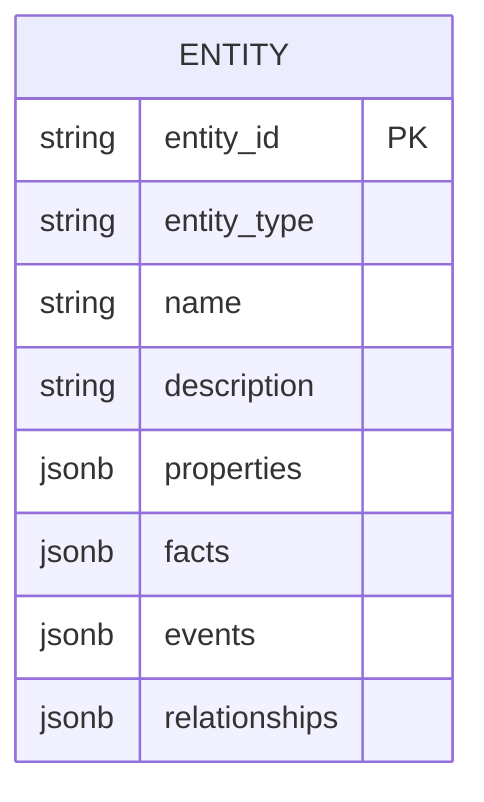
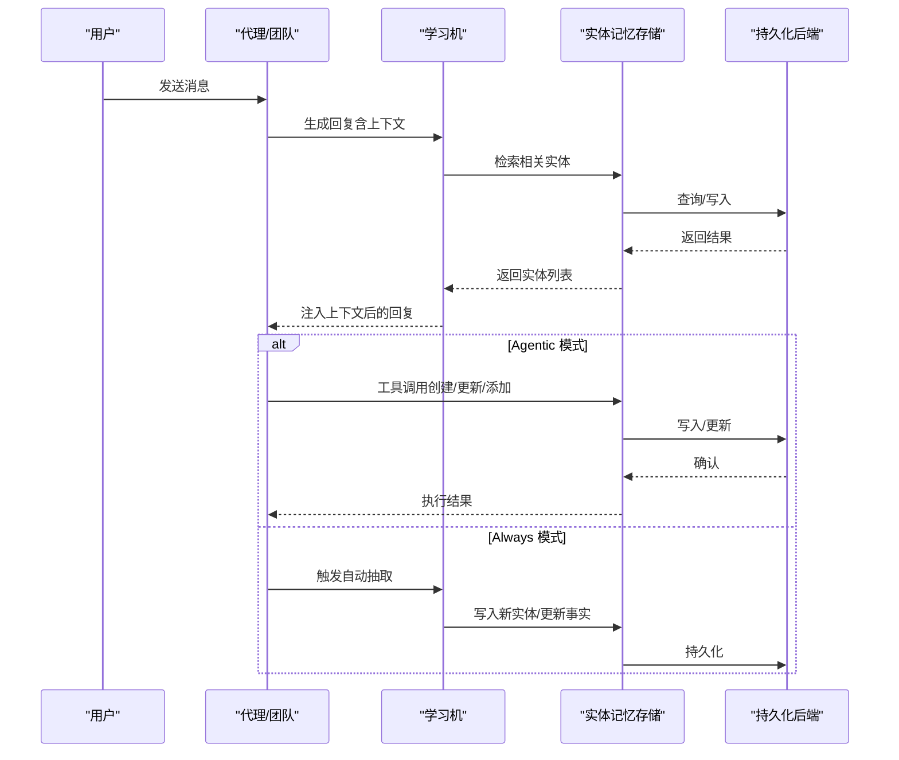
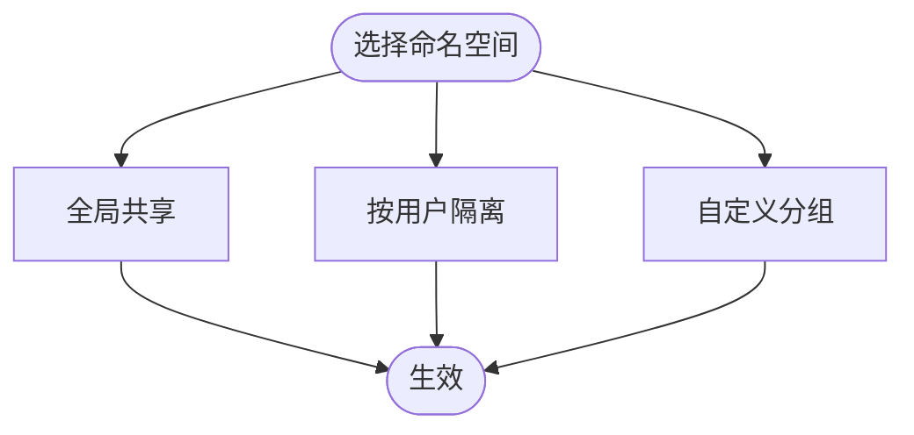
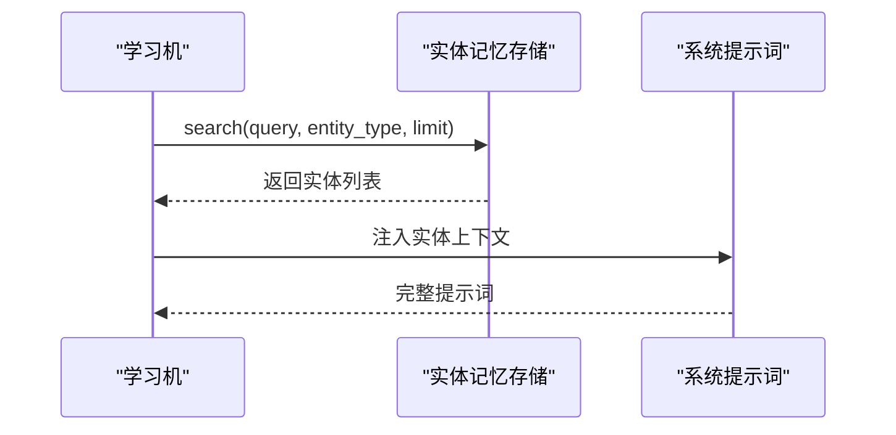
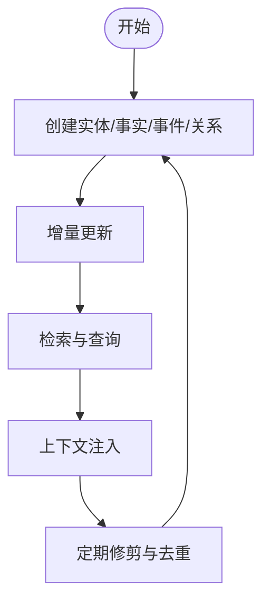
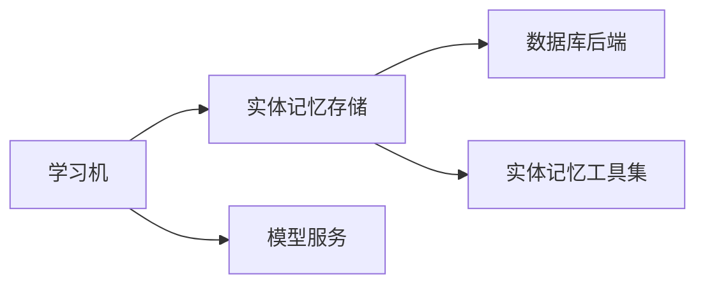

# 实体记忆存储

<cite>
**本文引用的文件**   
- [entity-memory.mdx](file://learning/stores/entity-memory.mdx)
- [facts-and-events.mdx](file://examples/learning/entity-memory/facts-and-events.mdx)
- [entity-relationships.mdx](file://examples/learning/entity-memory/entity-relationships.mdx)
- [a-entity-memory-always.mdx](file://examples/learning/basics/a-entity-memory-always.mdx)
- [b-entity-memory-agentic.mdx](file://examples/learning/basics/b-entity-memory-agentic.mdx)
- [team-entity-memory.mdx](file://examples/teams/learning/team-entity-memory.mdx)
- [learning-overview.mdx](file://learning/overview.mdx)
- [stores-intro.mdx](file://learning/stores/intro.mdx)
</cite>

## 目录
1. [引言](#引言)
2. [项目结构](#项目结构)
3. [核心组件](#核心组件)
4. [架构总览](#架构总览)
5. [组件详解](#组件详解)
6. [依赖关系分析](#依赖关系分析)
7. [性能考量](#性能考量)
8. [故障排查指南](#故障排查指南)
9. [结论](#结论)
10. [附录](#附录)

## 引言
本技术文档围绕“实体记忆存储”展开，系统阐述其设计理念、数据模型、知识类型（事实、事件、关系）、模式与命名空间控制、上下文注入、生命周期管理（创建、更新、查询、清理），并给出配置最佳实践、性能优化建议、关系建模实现指南与扩展方法，以及数据隐私与安全注意事项。读者可据此在代理或团队场景中构建可演进的外部实体知识图谱。

## 项目结构
实体记忆存储位于“学习与记忆”主题下，配套有基础用法、事实与事件、关系建模、团队使用等示例文档，便于从入门到进阶掌握。

**图表来源**
- [learning-overview.mdx:1-112](file://learning/overview.mdx#L1-L112)
- [stores-intro.mdx:1-19](file://learning/stores/intro.mdx#L1-L19)
- [entity-memory.mdx:1-184](file://learning/stores/entity-memory.mdx#L1-L184)
- [facts-and-events.mdx:1-121](file://examples/learning/entity-memory/facts-and-events.mdx#L1-L121)
- [entity-relationships.mdx:1-120](file://examples/learning/entity-memory/entity-relationships.mdx#L1-L120)
- [a-entity-memory-always.mdx:1-103](file://examples/learning/basics/a-entity-memory-always.mdx#L1-L103)
- [b-entity-memory-agentic.mdx:1-108](file://examples/learning/basics/b-entity-memory-agentic.mdx#L1-L108)
- [team-entity-memory.mdx:1-137](file://examples/teams/learning/team-entity-memory.mdx#L1-L137)

**章节来源**
- [learning-overview.mdx:1-112](file://learning/overview.mdx#L1-L112)
- [stores-intro.mdx:1-19](file://learning/stores/intro.mdx#L1-L19)

## 核心组件
- 存储后端与集成
  - 通过学习机（LearningMachine）启用实体记忆，支持多种数据库后端（如 Postgres、SQLite 等）作为持久化载体。
  - 示例中常见 PostgresDb 作为实体记忆的持久化后端。
- 配置与模式
  - 支持两种学习模式：Always（自动抽取）、Agentic（显式工具驱动）。
  - 命名空间（namespace）控制访问范围：全局共享、按用户隔离、自定义分组。
- 数据模型
  - 实体字段：实体标识、类型（公司/人/项目）、显示名、描述、属性、事实、事件、关系。
- 上下文注入
  - 将检索到的相关实体信息注入系统提示词，供推理时使用。
- 生命周期
  - 创建：对话中提及或显式工具创建。
  - 更新：随对话增量更新事实、事件与关系。
  - 查询：基于关键词、类型、限制条数进行检索。
  - 清理：通过 Curator 进行去重与按年龄修剪。

**章节来源**
- [entity-memory.mdx:10-184](file://learning/stores/entity-memory.mdx#L10-L184)
- [learning-overview.mdx:24-70](file://learning/overview.mdx#L24-L70)

## 架构总览
实体记忆在代理或团队中以“学习机”的形式存在，统一协调多个学习存储；实体记忆负责捕获外部实体的事实、事件与关系，并将其纳入上下文参与后续推理。

**图表来源**
- [entity-memory.mdx:112-150](file://learning/stores/entity-memory.mdx#L112-L150)
- [learning-overview.mdx:24-37](file://learning/overview.mdx#L24-L37)

## 组件详解

### 数据模型与知识类型
- 字段说明
  - 实体标识、类型、名称、描述、属性（键值元数据）、事实（恒久真相）、事件（有时限发生）、关系（实体间连接）。
- 知识类型划分
  - 事实：技术栈、总部位置、员工数量、行业领域、定价模型等。
  - 事件：产品发布、融资轮次、停机故障、合作伙伴宣布、关键会议等。
  - 关系：人与组织的职位关系、公司间的竞争/合作/收购/子母公司关系、项目间的依赖/集成关系等。

**图表来源**
- [entity-memory.mdx:99-110](file://learning/stores/entity-memory.mdx#L99-L110)

**章节来源**
- [entity-memory.mdx:46-110](file://learning/stores/entity-memory.mdx#L46-L110)

### 学习模式与工具集
- Always 模式
  - 在每次响应后自动抽取实体并保存，无需显式工具调用。
- Agentic 模式
  - 提供工具集：搜索实体、创建实体、更新实体、添加/更新事实、添加事件、添加关系等。
  - 由代理自主决定何时保存与检索。

**图表来源**
- [entity-memory.mdx:60-98](file://learning/stores/entity-memory.mdx#L60-L98)
- [b-entity-memory-agentic.mdx:36-51](file://examples/learning/basics/b-entity-memory-agentic.mdx#L36-L51)
- [a-entity-memory-always.mdx:33-45](file://examples/learning/basics/a-entity-memory-always.mdx#L33-L45)

**章节来源**
- [entity-memory.mdx:60-98](file://learning/stores/entity-memory.mdx#L60-L98)
- [b-entity-memory-agentic.mdx:36-51](file://examples/learning/basics/b-entity-memory-agentic.mdx#L36-L51)
- [a-entity-memory-always.mdx:33-45](file://examples/learning/basics/a-entity-memory-always.mdx#L33-L45)

### 命名空间与访问控制
- 全局（默认）：所有人共享。
- 用户（user）：按用户私有。
- 自定义：按组织/团队/项目等显式分组。
- 示例中展示了用户级与组织级命名空间的使用方式。

**图表来源**
- [entity-memory.mdx:152-166](file://learning/stores/entity-memory.mdx#L152-L166)
- [learning-overview.mdx:49-58](file://learning/overview.mdx#L49-L58)

**章节来源**
- [entity-memory.mdx:152-166](file://learning/stores/entity-memory.mdx#L152-L166)
- [learning-overview.mdx:49-58](file://learning/overview.mdx#L49-L58)

### 上下文注入与检索
- 检索接口：支持关键词、实体类型、限制条数等参数。
- 上下文注入：将实体的属性、事实、事件、关系结构化注入系统提示词，提升推理准确性。

**图表来源**
- [entity-memory.mdx:112-150](file://learning/stores/entity-memory.mdx#L112-L150)

**章节来源**
- [entity-memory.mdx:112-150](file://learning/stores/entity-memory.mdx#L112-L150)

### 生命周期管理
- 创建：对话中自然提及或显式工具创建。
- 更新：随后续对话增量更新事实、事件与关系。
- 查询：基于关键词与类型检索，支持打印调试输出。
- 清理：通过 Curator 进行去重与按年龄修剪，保持知识库健康。

**图表来源**
- [entity-memory.mdx:112-150](file://learning/stores/entity-memory.mdx#L112-L150)
- [learning-overview.mdx:59-70](file://learning/overview.mdx#L59-L70)

**章节来源**
- [entity-memory.mdx:112-150](file://learning/stores/entity-memory.mdx#L112-L150)
- [learning-overview.mdx:59-70](file://learning/overview.mdx#L59-L70)

### 示例与用法要点
- 事实与事件深度：演示如何区分事实与时序事件，并在 Agentic 模式下进行增补。
- 关系建模深度：演示如何建立组织/项目/人员之间的关系图谱。
- Always 与 Agentic 对比：展示自动抽取与显式工具两种路径。
- 团队场景：团队成员共同维护实体知识，跨会话持续演进。

**章节来源**
- [facts-and-events.mdx:1-121](file://examples/learning/entity-memory/facts-and-events.mdx#L1-L121)
- [entity-relationships.mdx:1-120](file://examples/learning/entity-memory/entity-relationships.mdx#L1-L120)
- [a-entity-memory-always.mdx:1-103](file://examples/learning/basics/a-entity-memory-always.mdx#L1-L103)
- [b-entity-memory-agentic.mdx:1-108](file://examples/learning/basics/b-entity-memory-agentic.mdx#L1-L108)
- [team-entity-memory.mdx:1-137](file://examples/teams/learning/team-entity-memory.mdx#L1-L137)

## 依赖关系分析
- 组件耦合
  - 学习机统一编排实体记忆存储；实体记忆存储依赖持久化后端。
  - 实体记忆工具集与检索接口是对外交互的契约。
- 外部依赖
  - 数据库后端（如 Postgres）用于长期持久化。
  - 模型服务（如 OpenAI Responses）用于抽取与推理。
- 可能的循环依赖
  - 文档与示例之间为单向依赖，无循环。

**图表来源**
- [entity-memory.mdx:112-150](file://learning/stores/entity-memory.mdx#L112-L150)
- [learning-overview.mdx:24-37](file://learning/overview.mdx#L24-L37)

**章节来源**
- [entity-memory.mdx:112-150](file://learning/stores/entity-memory.mdx#L112-L150)
- [learning-overview.mdx:24-37](file://learning/overview.mdx#L24-L37)

## 性能考量
- 抽取成本
  - Always 模式每次交互均触发抽取，带来额外 LLM 调用开销；可根据业务权衡。
- 检索效率
  - 合理设置查询关键词与实体类型，避免全量扫描；必要时对实体 ID 建立索引。
- 写入压力
  - 批量写入与事务提交可降低频繁小事务带来的开销；注意数据库连接池配置。
- 缓存策略
  - 对热点实体的上下文注入结果进行短期缓存，减少重复构造成本。
- 清理与压缩
  - 定期修剪过期实体与去重，避免存储膨胀与查询抖动。

[本节为通用指导，不直接分析具体文件]

## 故障排查指南
- 无法检索到实体
  - 检查命名空间是否正确（全局/用户/自定义）。
  - 确认实体类型与关键词匹配度。
- 上下文未注入
  - 确认学习机已启用实体记忆，并检查检索返回结果。
- 写入失败
  - 检查数据库连接与权限；确认实体 ID 唯一性与字段格式。
- 知识陈旧
  - 使用 Curator 的修剪与去重功能，定期清理无效或重复记录。

**章节来源**
- [entity-memory.mdx:112-150](file://learning/stores/entity-memory.mdx#L112-L150)
- [learning-overview.mdx:59-70](file://learning/overview.mdx#L59-L70)

## 结论
实体记忆存储通过“事实-事件-关系”的多维建模，结合 Always/Agentic 两种学习模式与命名空间控制，为代理与团队提供了可演进的外部实体知识图谱能力。配合上下文注入与周期性清理，可在保证隐私与性能的同时，持续提升推理质量与业务价值。

[本节为总结性内容，不直接分析具体文件]

## 附录

### 配置最佳实践
- 模式选择
  - 低延迟、强自动化需求：Always 模式。
  - 需要精细控制与审计：Agentic 模式。
- 命名空间
  - 默认全局共享适用于跨用户协作；用户级命名空间用于个人化；组织/项目级命名空间用于团队隔离。
- 数据模型
  - 属性（properties）用于存放结构化元数据；事实与事件分别建模，避免混用。
  - 关系采用语义明确的关系类型（如 reports_to、competitor_of、acquired_by 等）。

**章节来源**
- [entity-memory.mdx:10-184](file://learning/stores/entity-memory.mdx#L10-L184)
- [learning-overview.mdx:49-58](file://learning/overview.mdx#L49-L58)

### 关系建模实现指南与扩展
- 建模步骤
  - 明确实体类型与关系类型；设计属性字段；定义事实与事件边界。
  - 在 Agentic 模式下使用工具创建实体与关系，随后补充事实与事件。
- 扩展方法
  - 新增关系类型需与团队达成共识；必要时扩展实体类型（如系统/平台）。
  - 通过团队示例中的组织结构与项目关系，形成可复用的关系模板。

**章节来源**
- [entity-relationships.mdx:1-120](file://examples/learning/entity-memory/entity-relationships.mdx#L1-L120)
- [team-entity-memory.mdx:1-137](file://examples/teams/learning/team-entity-memory.mdx#L1-L137)

### 数据隐私与安全
- 访问控制
  - 使用命名空间实现最小权限原则；敏感组织/项目使用自定义分组。
- 数据最小化
  - 仅存储必要的事实与事件；避免冗余与敏感信息。
- 清理策略
  - 定期修剪过期实体；对历史数据进行脱敏处理后再导出分析。

**章节来源**
- [entity-memory.mdx:152-166](file://learning/stores/entity-memory.mdx#L152-L166)
- [learning-overview.mdx:59-70](file://learning/overview.mdx#L59-L70)