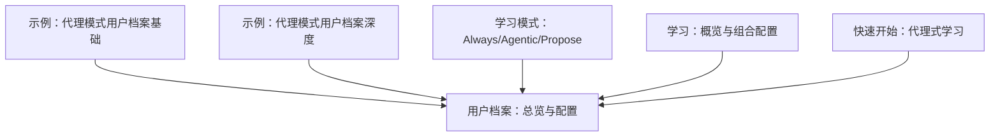
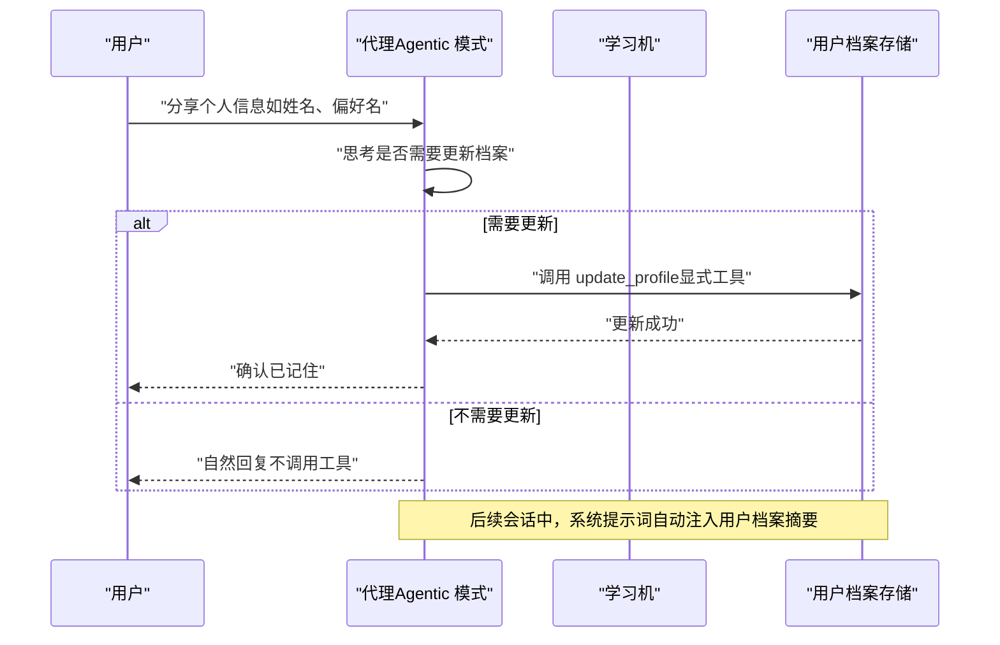
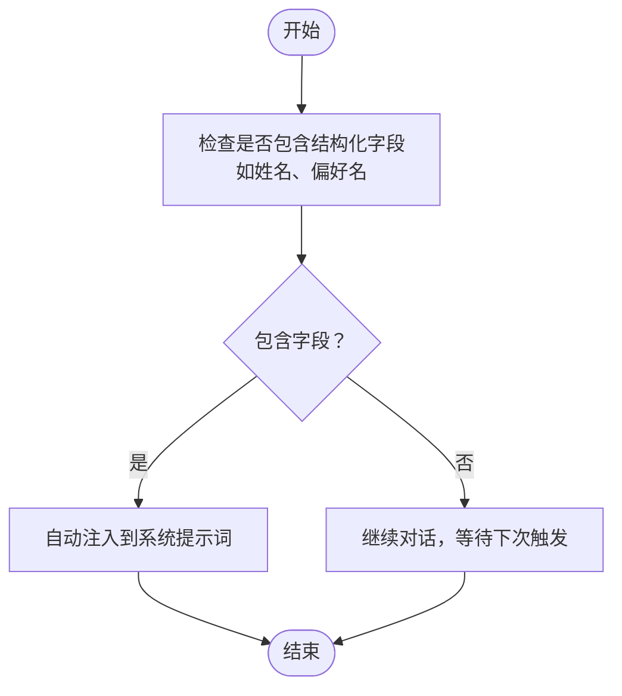
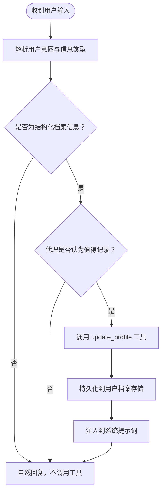
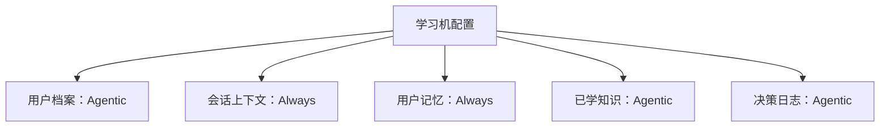
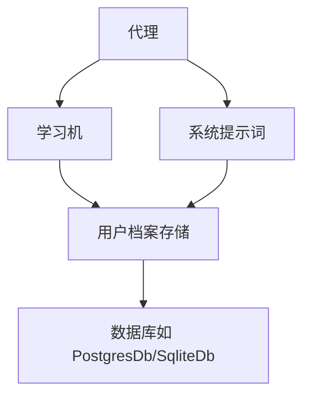

# 代理模式（Agentic Mode）

<cite>
**本文引用的文件**
- [代理模式：用户档案（基础示例）](file://examples/learning/basics/b-user-profile-agentic.mdx)
- [代理模式：用户档案（深度示例）](file://examples/learning/user-profile/agentic-mode.mdx)
- [用户档案：总览与配置](file://learning/stores/user-profile.mdx)
- [学习模式：Always/Agentic/Propose](file://learning/learning-modes.mdx)
- [学习：概览与组合配置](file://cookbook/learning/overview.mdx)
- [快速开始：代理式学习](file://examples/learning/quickstart/agentic-learn.mdx)
</cite>

## 目录
1. [简介](#简介)
2. [项目结构](#项目结构)
3. [核心组件](#核心组件)
4. [架构总览](#架构总览)
5. [详细组件分析](#详细组件分析)
6. [依赖关系分析](#依赖关系分析)
7. [性能考量](#性能考量)
8. [故障排除指南](#故障排除指南)
9. [结论](#结论)
10. [附录](#附录)

## 简介
本篇文档围绕“代理模式（Agentic Mode）”下的“用户档案存储”展开，系统阐述代理如何通过显式工具接收并决策是否更新用户档案；解释代理模式的配置方式、使用场景与最佳实践；说明代理在何种情况下应触发档案更新，以及如何避免遗漏隐式档案信息；并提供工具调用示例、实际应用场景、优势与潜在风险，以及调试与故障排除方法。

## 项目结构
与“代理模式下的用户档案存储”直接相关的内容主要分布在以下三类文档：
- 示例：展示代理模式下用户档案的工具调用与行为差异
- 学习与存储：说明用户档案的默认模式、可选模式、上下文注入与访问方式
- 模式与组合：定义不同学习模式及其适用场景，并给出组合配置示例

**图表来源**
- [代理模式：用户档案（基础示例）:1-91](file://examples/learning/basics/b-user-profile-agentic.mdx#L1-L91)
- [代理模式：用户档案（深度示例）:1-102](file://examples/learning/user-profile/agentic-mode.mdx#L1-L102)
- [用户档案：总览与配置:1-168](file://learning/stores/user-profile.mdx#L1-L168)
- [学习模式：Always/Agentic/Propose:1-146](file://learning/learning-modes.mdx#L1-L146)
- [学习：概览与组合配置:1-120](file://cookbook/learning/overview.mdx#L1-L120)
- [快速开始：代理式学习:1-40](file://examples/learning/quickstart/agentic-learn.mdx#L1-L40)

**章节来源**
- [用户档案：总览与配置:1-168](file://learning/stores/user-profile.mdx#L1-L168)
- [学习模式：Always/Agentic/Propose:1-146](file://learning/learning-modes.mdx#L1-L146)
- [学习：概览与组合配置:1-120](file://cookbook/learning/overview.mdx#L1-L120)
- [代理模式：用户档案（基础示例）:1-91](file://examples/learning/basics/b-user-profile-agentic.mdx#L1-L91)
- [代理模式：用户档案（深度示例）:1-102](file://examples/learning/user-profile/agentic-mode.mdx#L1-L102)
- [快速开始：代理式学习:1-40](file://examples/learning/quickstart/agentic-learn.mdx#L1-L40)

## 核心组件
- 用户档案存储（User Profile Store）
  - 负责持久化结构化用户信息（如姓名、偏好名等），支持 Always 与 Agentic 两种模式
  - 默认模式为 Always；Agentic 模式下由代理通过显式工具决定何时更新
- 学习机（Learning Machine）
  - 统一协调多个学习存储（用户档案、会话上下文、实体记忆、已学知识、决策日志等）
  - 可按存储粒度配置不同模式（Always/Agentic/Propose）
- 代理（Agent）
  - 在 Agentic 模式下获得 update_profile 工具，自主决定何时保存结构化信息
  - 上下文自动注入：系统提示词中会自动注入当前用户的档案摘要

**章节来源**
- [用户档案：总览与配置:8-16](file://learning/stores/user-profile.mdx#L8-L16)
- [学习模式：Always/Agentic/Propose:75-84](file://learning/learning-modes.mdx#L75-L84)
- [学习：概览与组合配置:32-43](file://cookbook/learning/overview.mdx#L32-L43)

## 架构总览
下图展示了代理在 Agentic 模式下与用户档案存储的交互流程：代理在对话过程中根据上下文判断是否调用 update_profile 工具；工具调用后，代理将结构化信息写入用户档案存储，并在后续会话中自动注入到系统提示词中。

**图表来源**
- [用户档案：总览与配置:142-154](file://learning/stores/user-profile.mdx#L142-L154)
- [学习模式：Always/Agentic/Propose:65-73](file://learning/learning-modes.mdx#L65-L73)
- [代理模式：用户档案（深度示例）:29-42](file://examples/learning/user-profile/agentic-mode.mdx#L29-L42)

## 详细组件分析

### 用户档案存储（User Profile Store）
- 结构化字段
  - 默认字段：name、preferred_name
  - 支持自定义扩展（通过数据类继承与 metadata 描述）
- 访问与调试
  - 可通过学习机获取档案对象或打印输出进行调试
- 上下文注入
  - 用户档案会在系统提示词中自动注入，无需手动拼接

**图表来源**
- [用户档案：总览与配置:84-154](file://learning/stores/user-profile.mdx#L84-L154)

**章节来源**
- [用户档案：总览与配置:84-154](file://learning/stores/user-profile.mdx#L84-L154)

### 代理模式（Agentic Mode）工作原理
- 工具与决策
  - 代理获得 update_profile 工具，可在合适时机调用以更新档案
  - 与 Always 模式的“自动提取”不同，Agentic 模式更透明，便于审计与控制
- 触发条件建议
  - 当用户明确提供或更新结构化信息时（如首次自我介绍、更正称谓、变更偏好）
  - 当对话中出现可稳定归档的偏好或身份信息时
- 风险与规避
  - 风险：代理可能遗漏隐式信息（例如未主动提及但对服务体验重要的偏好）
  - 规避：通过指令引导代理识别并记录关键信息；必要时结合 Always 模式用于被动积累

**图表来源**
- [学习模式：Always/Agentic/Propose:42-61](file://learning/learning-modes.mdx#L42-L61)
- [代理模式：用户档案（深度示例）:29-42](file://examples/learning/user-profile/agentic-mode.mdx#L29-L42)

**章节来源**
- [学习模式：Always/Agentic/Propose:42-61](file://learning/learning-modes.mdx#L42-L61)
- [代理模式：用户档案（深度示例）:29-42](file://examples/learning/user-profile/agentic-mode.mdx#L29-L42)

### 配置方法与组合策略
- 基础配置
  - 在学习机中启用用户档案，并设置模式为 Agentic
- 组合策略
  - 对于用户档案与会话上下文等需要一致性的领域采用 Always
  - 对于已学知识、决策日志等强调“质量控制”的领域采用 Agentic 或 Propose
- 示例路径
  - 基础示例：代理模式用户档案（基础）
  - 深度示例：代理模式用户档案（深度）
  - 快速开始：代理式学习

**图表来源**
- [学习：概览与组合配置:101-122](file://cookbook/learning/overview.mdx#L101-L122)
- [学习模式：Always/Agentic/Propose:101-133](file://learning/learning-modes.mdx#L101-L133)

**章节来源**
- [学习：概览与组合配置:44-73](file://cookbook/learning/overview.mdx#L44-L73)
- [学习模式：Always/Agentic/Propose:101-133](file://learning/learning-modes.mdx#L101-L133)

### 实际应用场景与工具调用示例
- 场景一：首次自我介绍后更新档案
  - 用户输入包含姓名与昵称
  - 代理调用 update_profile 更新 name 与 preferred_name
  - 后续会话中系统提示词自动注入该档案摘要
- 场景二：偏好更正（如从昵称更正为正式称呼）
  - 代理识别“偏好更正”意图，调用 update_profile 更新 preferred_name
- 场景三：多轮会话中的档案复用
  - 新会话开始时，系统提示词已包含用户档案摘要，代理据此个性化回复

参考示例路径：
- [代理模式：用户档案（基础示例）:50-77](file://examples/learning/basics/b-user-profile-agentic.mdx#L50-L77)
- [代理模式：用户档案（深度示例）:48-88](file://examples/learning/user-profile/agentic-mode.mdx#L48-L88)

**章节来源**
- [代理模式：用户档案（基础示例）:50-77](file://examples/learning/basics/b-user-profile-agentic.mdx#L50-L77)
- [代理模式：用户档案（深度示例）:48-88](file://examples/learning/user-profile/agentic-mode.mdx#L48-L88)

## 依赖关系分析
- 代理依赖学习机提供的用户档案存储能力
- 用户档案存储依赖数据库（如 PostgresDb、SqliteDb 等）进行持久化
- 上下文注入依赖系统提示词构建流程

**图表来源**
- [用户档案：总览与配置:142-154](file://learning/stores/user-profile.mdx#L142-L154)
- [学习：概览与组合配置:12-22](file://cookbook/learning/overview.mdx#L12-L22)

**章节来源**
- [用户档案：总览与配置:142-154](file://learning/stores/user-profile.mdx#L142-L154)
- [学习：概览与组合配置:12-22](file://cookbook/learning/overview.mdx#L12-L22)

## 性能考量
- Agentic 模式每次工具调用可能引入额外的推理与调用开销，但具备更高的可控性与可审计性
- 对于高频更新的场景，建议通过指令引导代理在合适的时机批量处理，减少不必要的工具调用
- Always 模式虽然自动化程度高，但会带来额外的 LLM 调用成本

**章节来源**
- [学习模式：Always/Agentic/Propose:10-14](file://learning/learning-modes.mdx#L10-L14)
- [学习模式：Always/Agentic/Propose:16-40](file://learning/learning-modes.mdx#L16-L40)

## 故障排除指南
- 症状：代理未调用 update_profile，导致档案未更新
  - 排查要点：确认学习机已启用用户档案且模式为 Agentic；检查代理指令是否引导其识别结构化信息
  - 参考示例：观察示例中“观看工具调用”的输出
- 症状：档案未被注入到系统提示词
  - 排查要点：确认用户档案存储中存在有效数据；检查上下文注入逻辑是否正常
- 症状：隐式信息未被记录
  - 排查要点：通过指令引导代理识别隐式偏好或身份信息；必要时结合 Always 模式进行被动积累

**章节来源**
- [代理模式：用户档案（基础示例）:50-77](file://examples/learning/basics/b-user-profile-agentic.mdx#L50-L77)
- [代理模式：用户档案（深度示例）:48-88](file://examples/learning/user-profile/agentic-mode.mdx#L48-L88)
- [用户档案：总览与配置:142-154](file://learning/stores/user-profile.mdx#L142-L154)

## 结论
代理模式（Agentic Mode）在用户档案存储方面提供了更高的透明度与可控性：代理通过显式工具决定何时更新档案，适合需要质量控制与可审计性的场景。为避免遗漏隐式信息，应在指令中引导代理识别关键结构化信息，并在必要时结合 Always 模式进行被动积累。通过合理配置学习机的不同模式，可以在不同存储之间取得平衡，从而提升整体用户体验与系统可靠性。

## 附录
- 相关示例与配置路径
  - [代理模式：用户档案（基础示例）:1-91](file://examples/learning/basics/b-user-profile-agentic.mdx#L1-L91)
  - [代理模式：用户档案（深度示例）:1-102](file://examples/learning/user-profile/agentic-mode.mdx#L1-L102)
  - [用户档案：总览与配置:1-168](file://learning/stores/user-profile.mdx#L1-L168)
  - [学习模式：Always/Agentic/Propose:1-146](file://learning/learning-modes.mdx#L1-L146)
  - [学习：概览与组合配置:1-120](file://cookbook/learning/overview.mdx#L1-L120)
  - [快速开始：代理式学习:1-40](file://examples/learning/quickstart/agentic-learn.mdx#L1-L40)