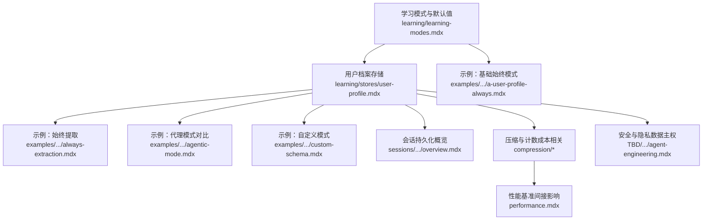
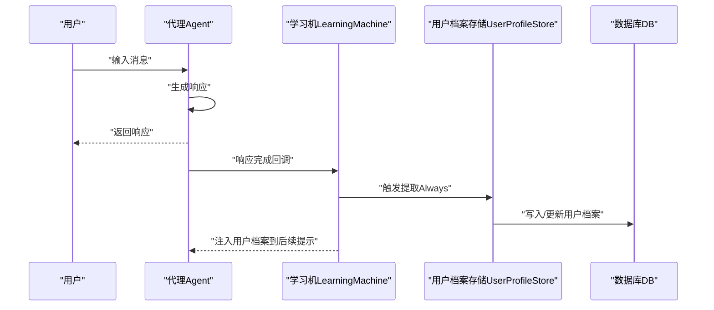
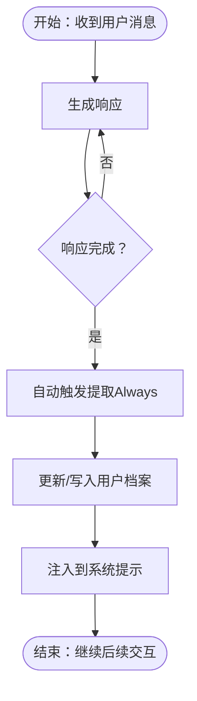
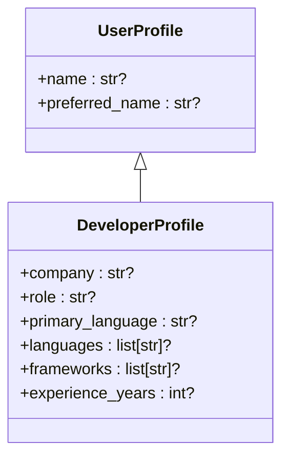
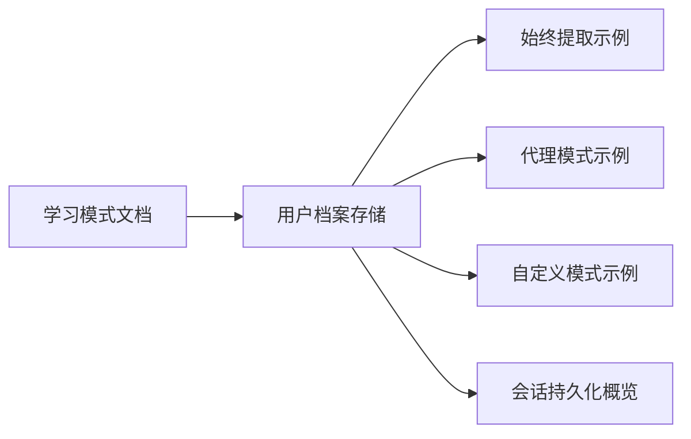

# 始终提取模式（Always Extraction）

<cite>
**本文引用的文件**
- [examples/learning/user-profile/always-extraction.mdx](file://examples/learning/user-profile/always-extraction.mdx)
- [examples/learning/basics/a-user-profile-always.mdx](file://examples/learning/basics/a-user-profile-always.mdx)
- [examples/learning/user-profile/agentic-mode.mdx](file://examples/learning/user-profile/agentic-mode.mdx)
- [examples/learning/user-profile/custom-schema.mdx](file://examples/learning/user-profile/custom-schema.mdx)
- [learning/learning-modes.mdx](file://learning/learning-modes.mdx)
- [learning/stores/user-profile.mdx](file://learning/stores/user-profile.mdx)
- [compression/overview.mdx](file://compression/overview.mdx)
- [compression/token-counting.mdx](file://compression/token-counting.mdx)
- [performance.mdx](file://performance.mdx)
- [sessions/persisting-sessions/overview.mdx](file://sessions/persisting-sessions/overview.mdx)
- [TBD/pages/get-started/agent-engineering.mdx](file://TBD/pages/get-started/agent-engineering.mdx)
</cite>

## 目录
1. [简介](#简介)
2. [项目结构与定位](#项目结构与定位)
3. [核心组件](#核心组件)
4. [架构总览](#架构总览)
5. [详细组件分析](#详细组件分析)
6. [依赖关系分析](#依赖关系分析)
7. [性能考量与成本控制](#性能考量与成本控制)
8. [故障排查指南](#故障排查指南)
9. [结论](#结论)
10. [附录：配置与最佳实践](#附录配置与最佳实践)

## 简介
始终提取模式（Always Extraction）是用户档案存储的一种自动化学习模式。其核心特征是在每次响应生成后，系统自动触发一次档案信息提取，无需显式工具调用或人工干预。该模式默认启用，适用于需要持续、无感地构建与维护用户画像的场景，如姓名、昵称、偏好、角色等结构化信息。

- 自动性：在响应完成后自动执行提取，对用户透明。
- 默认性：用户档案存储默认采用该模式。
- 适用性：适合需要稳定、连续学习的用户画像与会话上下文。

## 项目结构与定位
围绕“始终提取模式”的知识与示例主要分布在以下位置：
- 学习模式与默认行为：learning/learning-modes.mdx
- 用户档案存储与上下文注入：learning/stores/user-profile.mdx
- 示例：examples/learning/user-profile/*.mdx
- 性能与成本相关：compression/*、performance.mdx
- 会话持久化与存储范围：sessions/persisting-sessions/overview.mdx
- 安全与隐私：TBD/pages/get-started/agent-engineering.mdx

**图表来源**
- [learning/learning-modes.mdx:1-147](file://learning/learning-modes.mdx#L1-L147)
- [learning/stores/user-profile.mdx:1-168](file://learning/stores/user-profile.mdx#L1-L168)
- [examples/learning/user-profile/always-extraction.mdx:1-115](file://examples/learning/user-profile/always-extraction.mdx#L1-L115)
- [examples/learning/basics/a-user-profile-always.mdx:1-31](file://examples/learning/basics/a-user-profile-always.mdx#L1-L31)
- [examples/learning/user-profile/agentic-mode.mdx:1-103](file://examples/learning/user-profile/agentic-mode.mdx#L1-L103)
- [examples/learning/user-profile/custom-schema.mdx:1-134](file://examples/learning/user-profile/custom-schema.mdx#L1-L134)
- [sessions/persisting-sessions/overview.mdx:63-91](file://sessions/persisting-sessions/overview.mdx#L63-L91)
- [compression/overview.mdx:20-54](file://compression/overview.mdx#L20-L54)
- [compression/token-counting.mdx:1-112](file://compression/token-counting.mdx#L1-L112)
- [performance.mdx:1-67](file://performance.mdx#L1-L67)
- [TBD/pages/get-started/agent-engineering.mdx:105-115](file://TBD/pages/get-started/agent-engineering.mdx#L105-L115)

**章节来源**
- [learning/learning-modes.mdx:1-147](file://learning/learning-modes.mdx#L1-L147)
- [learning/stores/user-profile.mdx:1-168](file://learning/stores/user-profile.mdx#L1-L168)

## 核心组件
- 学习机（Learning Machine）
  - 负责协调各存储的提取与注入流程；在始终模式下，会在每次响应后自动触发提取。
- 用户档案存储（User Profile Store）
  - 持久化结构化用户信息（如姓名、昵称、自定义字段），并在系统提示中自动注入。
- 数据库（DB）
  - 作为持久化后端，保存消息、运行元数据、会话状态等。
- 示例与配置
  - 通过 UserProfileConfig(mode=LearningMode.ALWAYS) 启用始终模式；可结合自定义模式扩展字段。

关键要点
- 默认模式：用户档案存储默认采用始终模式，确保信息持续学习与更新。
- 上下文注入：已提取的用户档案会自动注入到系统提示中，无需手动拼接。
- 透明性：对用户与代理均不可见工具调用，体验更自然。

**章节来源**
- [learning/stores/user-profile.mdx:10-16](file://learning/stores/user-profile.mdx#L10-L16)
- [learning/stores/user-profile.mdx:144-152](file://learning/stores/user-profile.mdx#L144-L152)
- [learning/learning-modes.mdx:128-131](file://learning/learning-modes.mdx#L128-L131)

## 架构总览
始终提取模式的典型交互流程如下：

**图表来源**
- [examples/learning/user-profile/always-extraction.mdx:31-40](file://examples/learning/user-profile/always-extraction.mdx#L31-L40)
- [examples/learning/basics/a-user-profile-always.mdx:36-44](file://examples/learning/basics/a-user-profile-always.mdx#L36-L44)
- [learning/stores/user-profile.mdx:144-152](file://learning/stores/user-profile.mdx#L144-L152)

## 详细组件分析

### 组件一：始终提取模式的工作机制
- 触发时机：每次响应生成完成后自动触发。
- 无工具可见：不暴露任何工具调用，对用户透明。
- 提取范围：从对话内容中抽取结构化字段（如姓名、昵称、公司、角色等）。
- 注入策略：将提取结果注入到系统提示中，供后续交互使用。

**图表来源**
- [learning/learning-modes.mdx:16-38](file://learning/learning-modes.mdx#L16-L38)
- [learning/stores/user-profile.mdx:144-152](file://learning/stores/user-profile.mdx#L144-L152)

**章节来源**
- [learning/learning-modes.mdx:16-38](file://learning/learning-modes.mdx#L16-L38)
- [examples/learning/user-profile/always-extraction.mdx:31-40](file://examples/learning/user-profile/always-extraction.mdx#L31-L40)

### 组件二：配置方法与示例路径
- 基础启用：通过 LearningMachine 的 user_profile 参数启用，并设置 mode=LearningMode.ALWAYS。
- 自定义模式：通过 UserProfileConfig(schema=...) 扩展字段，例如开发者档案、客户档案等。
- 对比模式：可参考代理模式示例以理解两种模式差异。

示例路径（不含代码内容）
- 始终提取示例：[examples/learning/user-profile/always-extraction.mdx](file://examples/learning/user-profile/always-extraction.mdx)
- 基础始终模式示例：[examples/learning/basics/a-user-profile-always.mdx](file://examples/learning/basics/a-user-profile-always.mdx)
- 代理模式对比示例：[examples/learning/user-profile/agentic-mode.mdx](file://examples/learning/user-profile/agentic-mode.mdx)
- 自定义模式示例：[examples/learning/user-profile/custom-schema.mdx](file://examples/learning/user-profile/custom-schema.mdx)
- 学习模式与默认值：[learning/learning-modes.mdx](file://learning/learning-modes.mdx)
- 用户档案存储与上下文注入：[learning/stores/user-profile.mdx](file://learning/stores/user-profile.mdx)

**章节来源**
- [examples/learning/user-profile/always-extraction.mdx:31-40](file://examples/learning/user-profile/always-extraction.mdx#L31-L40)
- [examples/learning/basics/a-user-profile-always.mdx:36-44](file://examples/learning/basics/a-user-profile-always.mdx#L36-L44)
- [examples/learning/user-profile/agentic-mode.mdx:29-42](file://examples/learning/user-profile/agentic-mode.mdx#L29-L42)
- [examples/learning/user-profile/custom-schema.mdx:62-72](file://examples/learning/user-profile/custom-schema.mdx#L62-L72)
- [learning/learning-modes.mdx:128-131](file://learning/learning-modes.mdx#L128-L131)
- [learning/stores/user-profile.mdx:144-152](file://learning/stores/user-profile.mdx#L144-L152)

### 组件三：数据准确性与一致性保障
- 字段约束：自定义字段应使用可选类型并提供描述，有助于 LLM 更准确地抽取。
- 可选字段：避免必填字段导致提取失败。
- 描述明确：在 metadata 中提供清晰的字段语义，减少歧义。

**图表来源**
- [examples/learning/user-profile/custom-schema.mdx:32-54](file://examples/learning/user-profile/custom-schema.mdx#L32-L54)
- [learning/stores/user-profile.mdx:84-117](file://learning/stores/user-profile.mdx#L84-L117)

**章节来源**
- [examples/learning/user-profile/custom-schema.mdx:51-86](file://examples/learning/user-profile/custom-schema.mdx#L51-L86)
- [learning/stores/user-profile.mdx:84-117](file://learning/stores/user-profile.mdx#L84-L117)

## 依赖关系分析
- 学习模式与默认值
  - 用户档案默认采用始终模式，确保持续学习。
- 用户档案存储
  - 支持始终与代理两种模式；默认注入系统提示。
- 示例与对比
  - 通过示例展示始终模式与代理模式的行为差异。
- 会话与存储
  - 配置数据库后，会话消息、运行元数据、会话状态等会被持久化，便于跨会话召回。

**图表来源**
- [learning/learning-modes.mdx:128-131](file://learning/learning-modes.mdx#L128-L131)
- [learning/stores/user-profile.mdx:14-16](file://learning/stores/user-profile.mdx#L14-L16)
- [examples/learning/user-profile/always-extraction.mdx:1-18](file://examples/learning/user-profile/always-extraction.mdx#L1-L18)
- [examples/learning/user-profile/agentic-mode.mdx:1-16](file://examples/learning/user-profile/agentic-mode.mdx#L1-L16)
- [examples/learning/user-profile/custom-schema.mdx:1-16](file://examples/learning/user-profile/custom-schema.mdx#L1-L16)
- [sessions/persisting-sessions/overview.mdx:63-91](file://sessions/persisting-sessions/overview.mdx#L63-L91)

**章节来源**
- [learning/learning-modes.mdx:124-133](file://learning/learning-modes.mdx#L124-L133)
- [learning/stores/user-profile.mdx:14-16](file://learning/stores/user-profile.mdx#L14-L16)
- [sessions/persisting-sessions/overview.mdx:63-91](file://sessions/persisting-sessions/overview.mdx#L63-L91)

## 性能考量与成本控制
- 额外 LLM 调用成本
  - 始终模式在每次响应后都会触发一次提取，带来额外的 LLM 调用次数与费用。
- 延迟影响
  - 每次响应需等待一次提取完成再继续，可能增加端到端延迟。
- 成本控制策略
  - 使用上下文压缩（Context Compression）降低工具结果带来的 token 消耗，从而间接降低 LLM 调用成本。
  - 合理设置压缩阈值，避免频繁触发压缩造成额外开销。
  - 在高流量场景下评估实例数量与并发，结合异步与并行执行优化吞吐。
- 计数与估算
  - 利用 token 计数能力预估请求大小，辅助压缩与预算规划。
- 性能基准
  - 关注框架级性能指标（如实例化时间、内存占用），在保证准确性的前提下尽量降低开销。

**章节来源**
- [learning/learning-modes.mdx:12](file://learning/learning-modes.mdx#L12)
- [compression/overview.mdx:34-54](file://compression/overview.mdx#L34-L54)
- [compression/token-counting.mdx:94-112](file://compression/token-counting.mdx#L94-L112)
- [performance.mdx:13-28](file://performance.mdx#L13-L28)

## 故障排查指南
- 提取未生效
  - 确认是否启用了始终模式；检查 LearningMachine 的 user_profile 配置。
  - 确认数据库已正确配置，以便持久化与查询。
- 字段缺失或为空
  - 检查自定义模式字段是否为可选类型并提供清晰描述。
  - 确认对话中确实包含可被抽取的信息。
- 上下文未注入
  - 确认系统提示中存在用户档案注入逻辑；必要时查看调试输出。
- 会话与历史
  - 多用户/多会话场景下，确保 user_id 与 session_id 正确传递，避免数据错乱。

**章节来源**
- [examples/learning/user-profile/always-extraction.mdx:31-40](file://examples/learning/user-profile/always-extraction.mdx#L31-L40)
- [examples/learning/user-profile/custom-schema.mdx:51-86](file://examples/learning/user-profile/custom-schema.mdx#L51-L86)
- [sessions/persisting-sessions/overview.mdx:75-91](file://sessions/persisting-sessions/overview.mdx#L75-L91)

## 结论
始终提取模式通过在每次响应后自动触发档案提取，实现了对用户画像的持续、无感积累。它默认启用且广泛适用于用户档案、用户记忆、会话上下文与实体记忆等场景。尽管会带来额外的 LLM 调用成本与潜在延迟，但通过上下文压缩、合理配置与性能优化，可以在准确性与成本之间取得良好平衡。同时，企业级隐私设计确保数据主权与安全可控。

## 附录：配置与最佳实践
- 启用始终模式
  - 在 LearningMachine 中配置 user_profile=UserProfileConfig(mode=LearningMode.ALWAYS)。
- 自定义模式
  - 通过继承 UserProfile 并添加可选字段与描述，提升抽取准确性。
- 场景选择
  - 名称、偏好、角色等结构化信息优先使用始终模式；复杂知识或合规场景可考虑代理或提议模式。
- 数据准确性
  - 使用可选字段、提供清晰描述、限制枚举值范围，减少歧义。
- 隐私与安全
  - 私有部署与本地化存储，确保数据主权与最小化传输。

**章节来源**
- [learning/learning-modes.mdx:128-147](file://learning/learning-modes.mdx#L128-L147)
- [examples/learning/user-profile/custom-schema.mdx:51-86](file://examples/learning/user-profile/custom-schema.mdx#L51-L86)
- [TBD/pages/get-started/agent-engineering.mdx:105-115](file://TBD/pages/get-started/agent-engineering.mdx#L105-L115)