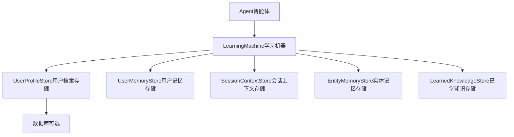
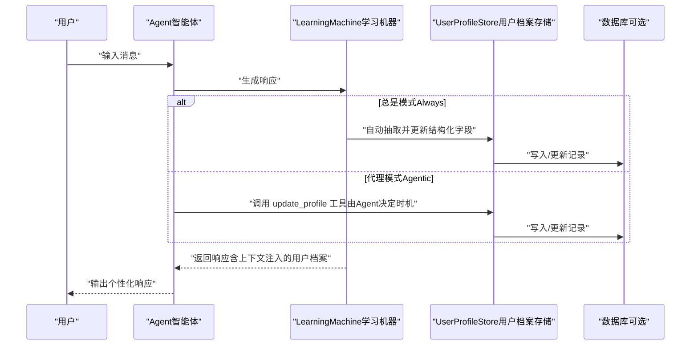
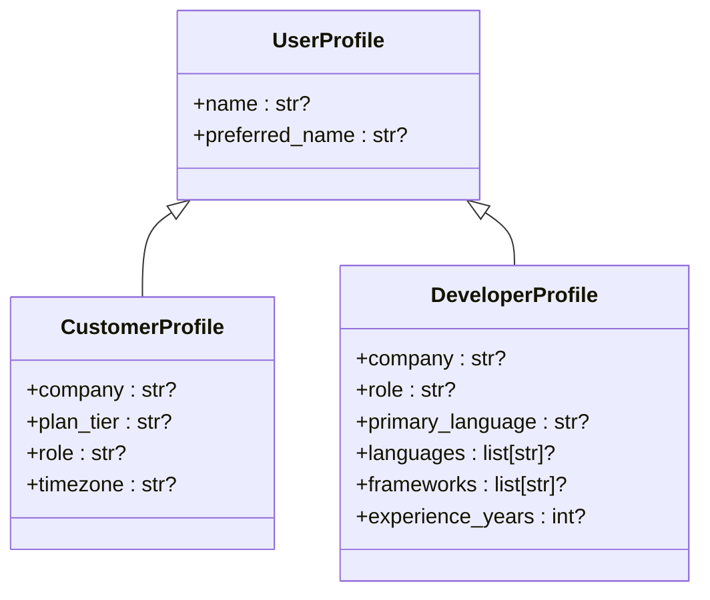
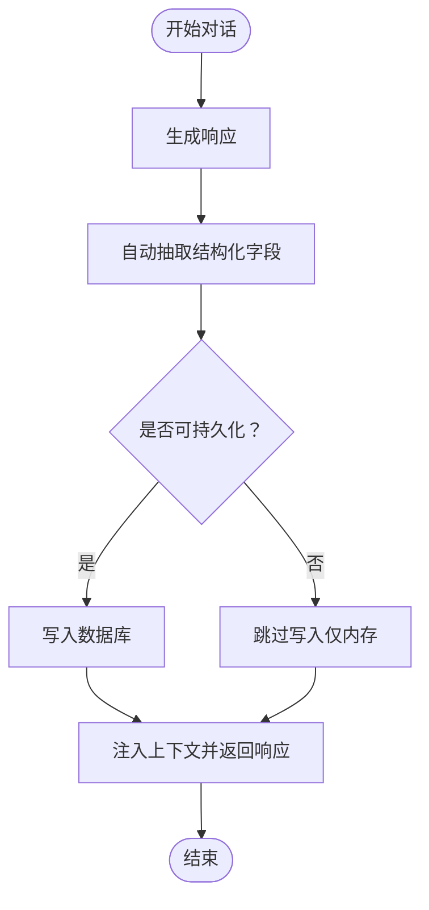
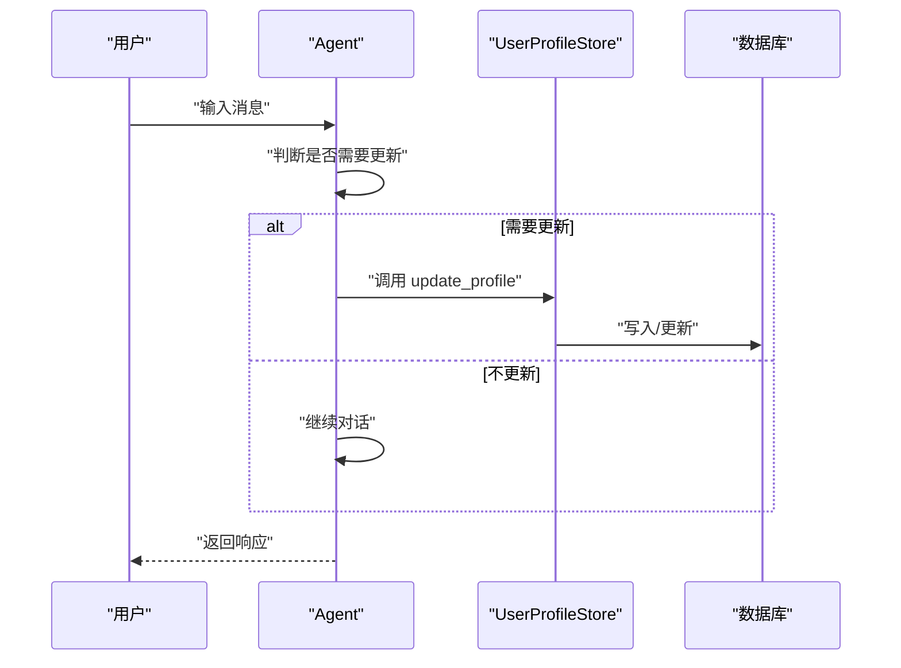
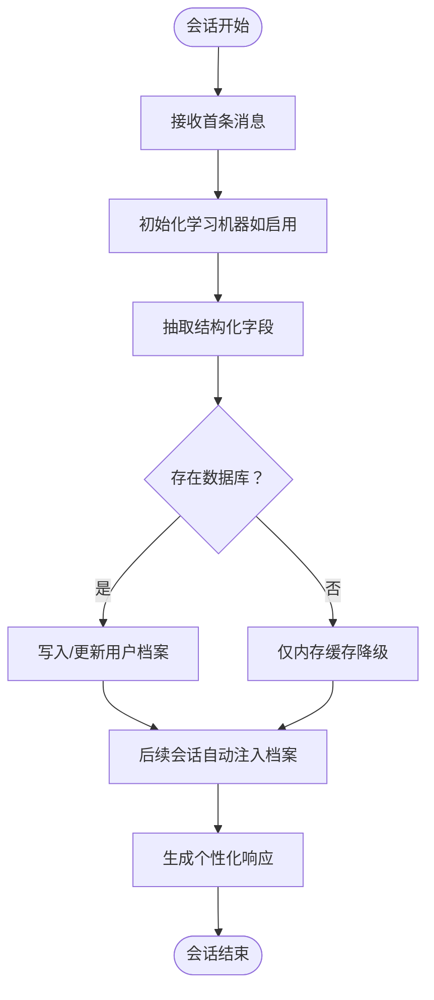
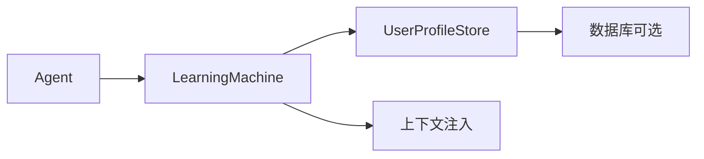

# 用户档案存储

<cite>
**本文引用的文件**
- [用户档案：总是模式](file://examples/learning/basics/a-user-profile-always.mdx)
- [用户档案：代理模式](file://examples/learning/basics/b-user-profile-agentic.mdx)
- [用户档案：自定义模式](file://examples/learning/user-profile/custom-schema.mdx)
- [学习存储：用户档案](file://learning/stores/user-profile.mdx)
- [学习：模式](file://learning/learning-modes.mdx)
- [学习：概览](file://cookbook/learning/overview.mdx)
- [自定义模式](file://learning/custom-schemas.mdx)
- [快速测试：无数据库优雅降级](file://examples/learning/quick-tests/no-db-graceful.mdx)
- [快速测试：学习开关简写](file://examples/learning/quick-tests/learning-true-shorthand.mdx)
</cite>

## 目录
1. [简介](#简介)
2. [项目结构](#项目结构)
3. [核心组件](#核心组件)
4. [架构总览](#架构总览)
5. [详细组件分析](#详细组件分析)
6. [依赖关系分析](#依赖关系分析)
7. [性能考量](#性能考量)
8. [故障排查指南](#故障排查指南)
9. [结论](#结论)
10. [附录](#附录)

## 简介
本技术文档围绕“用户档案存储”展开，系统阐述其设计理念、实现原理与使用方式。用户档案用于持久化结构化的人类用户信息（如姓名、偏好等），并支持三种工作模式：代理模式（Agentic）、总是提取模式（Always）与自定义模式（Custom Schema）。文档还覆盖数据结构、字段定义、验证规则、生命周期管理（创建、更新、查询、清理）、最佳实践、性能优化、扩展方法以及数据隐私与安全注意事项。

## 项目结构
用户档案能力由“学习机器（Learning Machine）”统一编排，通过配置控制不同存储的行为。示例与参考文档主要分布在以下位置：
- 示例：examples/learning/basics 与 examples/learning/user-profile
- 学习存储参考：learning/stores/user-profile.mdx
- 模式与组合：learning/learning-modes.mdx、cookbook/learning/overview.mdx
- 自定义模式与字段规范：learning/custom-schemas.mdx
- 运行时行为验证：examples/learning/quick-tests/*

图表来源
- [学习：概览:32-43](file://cookbook/learning/overview.mdx#L32-L43)
- [学习存储：用户档案:1-16](file://learning/stores/user-profile.mdx#L1-L16)

章节来源
- [学习：概览:32-43](file://cookbook/learning/overview.mdx#L32-L43)
- [学习存储：用户档案:1-16](file://learning/stores/user-profile.mdx#L1-L16)

## 核心组件
- 用户档案存储（UserProfileStore）
  - 职责：以结构化方式保存用户的关键事实（默认包含姓名与首选名；可通过自定义模式扩展）。
  - 作用域：按用户维度持久化，跨会话可复用。
  - 默认持久性：随新信息不断更新，长期有效。
- 学习机器（LearningMachine）
  - 统一协调多个学习存储，支持按存储粒度配置模式（Always/Agentic/Propose）。
- 数据库（Db）
  - 可选后端（如PostgreSQL、JSON、Firestore等），用于持久化存储。
- 工具与上下文注入
  - Always模式下自动抽取；Agentic模式下通过工具显式更新；系统会自动将当前用户档案注入到系统提示词中。

章节来源
- [学习存储：用户档案:8-16](file://learning/stores/user-profile.mdx#L8-L16)
- [学习：模式:10-14](file://learning/learning-modes.mdx#L10-L14)
- [学习：概览:32-43](file://cookbook/learning/overview.mdx#L32-L43)

## 架构总览
用户档案在不同模式下的交互流程如下：

图表来源
- [用户档案：总是模式:33-45](file://examples/learning/basics/a-user-profile-always.mdx#L33-L45)
- [用户档案：代理模式:33-44](file://examples/learning/basics/b-user-profile-agentic.mdx#L33-L44)
- [学习：模式:16-63](file://learning/learning-modes.mdx#L16-L63)

## 详细组件分析

### 数据模型与字段定义
- 默认字段
  - name：全名
  - preferred_name：偏好的称呼
- 自定义字段
  - 通过继承基础 UserProfile 并使用 dataclass 字段与 metadata 描述，可扩展公司、角色、时区、编程语言等业务相关字段。
  - 所有自定义字段应为可选类型，并提供清晰的 metadata 描述，以便大模型准确抽取。

图表来源
- [学习存储：用户档案:84-127](file://learning/stores/user-profile.mdx#L84-L127)
- [自定义模式:12-36](file://learning/custom-schemas.mdx#L12-L36)
- [用户档案：自定义模式:32-54](file://examples/learning/user-profile/custom-schema.mdx#L32-L54)

章节来源
- [学习存储：用户档案:84-127](file://learning/stores/user-profile.mdx#L84-L127)
- [自定义模式:51-86](file://learning/custom-schemas.mdx#L51-L86)
- [用户档案：自定义模式:32-54](file://examples/learning/user-profile/custom-schema.mdx#L32-L54)

### 三种工作模式详解

#### 总是提取模式（Always）
- 行为：每次对话结束后自动抽取结构化信息，无需可见工具调用。
- 适用场景：需要稳定捕获用户姓名、偏好等固定字段。
- 代价：每次交互增加一次额外的大模型调用。

图表来源
- [用户档案：总是模式:33-45](file://examples/learning/basics/a-user-profile-always.mdx#L33-L45)
- [学习：模式:16-38](file://learning/learning-modes.mdx#L16-L38)

章节来源
- [用户档案：总是模式:33-45](file://examples/learning/basics/a-user-profile-always.mdx#L33-L45)
- [学习：模式:16-38](file://learning/learning-modes.mdx#L16-L38)

#### 代理模式（Agentic）
- 行为：Agent获得 update_profile 工具，自主决定何时更新。
- 适用场景：希望Agent主动维护关键信息，或在特定上下文中强调更新。
- 风险：可能遗漏隐式信息，需在设计中平衡显式更新与自动抽取。

图表来源
- [用户档案：代理模式:33-44](file://examples/learning/basics/b-user-profile-agentic.mdx#L33-L44)
- [学习：模式:42-63](file://learning/learning-modes.mdx#L42-L63)

章节来源
- [用户档案：代理模式:33-44](file://examples/learning/basics/b-user-profile-agentic.mdx#L33-L44)
- [学习：模式:42-63](file://learning/learning-modes.mdx#L42-L63)

#### 自定义模式（Custom Schema）
- 行为：基于 dataclass 定义领域特定字段，结合 metadata 的描述指导抽取。
- 最佳实践：
  - 使用可选字段并提供默认值；
  - 在 metadata 中明确字段含义与约束范围；
  - 对枚举型值在描述中罗列选项，提升抽取稳定性。

章节来源
- [学习存储：用户档案:91-127](file://learning/stores/user-profile.mdx#L91-L127)
- [自定义模式:51-86](file://learning/custom-schemas.mdx#L51-L86)
- [用户档案：自定义模式:32-54](file://examples/learning/user-profile/custom-schema.mdx#L32-L54)

### 生命周期管理
- 创建：首次与用户交互时，若启用学习机器且具备数据库连接，则在抽取成功后创建对应用户的档案记录。
- 更新：Always 模式在每次响应后自动更新；Agentic 模式由 Agent 显式调用工具更新；自定义模式遵循相同策略但字段更丰富。
- 查询：可通过学习机器提供的存储接口按用户ID检索当前档案；也可在调试时打印查看。
- 清理：默认不自动清理；可在业务层按策略删除或归档旧用户档案。

图表来源
- [快速测试：学习开关简写:44-88](file://examples/learning/quick-tests/learning-true-shorthand.mdx#L44-L88)
- [快速测试：无数据库优雅降级:45-87](file://examples/learning/quick-tests/no-db-graceful.mdx#L45-L87)

章节来源
- [快速测试：学习开关简写:44-88](file://examples/learning/quick-tests/learning-true-shorthand.mdx#L44-L88)
- [快速测试：无数据库优雅降级:45-87](file://examples/learning/quick-tests/no-db-graceful.mdx#L45-L87)

### 数据验证与一致性规则
- 字段类型：默认字段为字符串；自定义字段推荐使用可选类型并提供默认值，避免必填导致抽取失败。
- 元数据描述：通过 metadata 提供清晰的字段定义与约束，提升抽取准确性。
- 枚举约束：对有限取值的字段，在描述中列出允许值，便于模型遵循。
- 上下文注入：系统自动将当前用户档案注入到系统提示词中，减少重复传递与错误。

章节来源
- [学习存储：用户档案:84-127](file://learning/stores/user-profile.mdx#L84-L127)
- [自定义模式:51-86](file://learning/custom-schemas.mdx#L51-L86)

### 配置与集成要点
- 启用学习机器：可通过布尔开关或显式配置开启用户档案存储。
- 模式选择：根据场景选择 Always/Agentic/Propose，并可在同一学习机器内为不同存储设置不同模式。
- 数据库选择：支持多种数据库后端；若未提供数据库，系统将以“降级模式”运行（仅内存）。

章节来源
- [学习：概览:44-73](file://cookbook/learning/overview.mdx#L44-L73)
- [学习：模式:101-134](file://learning/learning-modes.mdx#L101-L134)

## 依赖关系分析
- 组件耦合
  - Agent 依赖 LearningMachine；LearningMachine 统一调度各存储。
  - UserProfileStore 依赖数据库（可选）以实现持久化。
  - 上下文注入由 LearningMachine 负责，确保系统提示词包含最新用户档案。
- 外部依赖
  - 数据库实现（如 PostgreSQL、JSON、Firestore）作为可插拔后端。
  - 大模型服务用于抽取与生成响应。

图表来源
- [学习：概览:32-43](file://cookbook/learning/overview.mdx#L32-L43)
- [学习存储：用户档案:129-154](file://learning/stores/user-profile.mdx#L129-L154)

章节来源
- [学习：概览:32-43](file://cookbook/learning/overview.mdx#L32-L43)
- [学习存储：用户档案:129-154](file://learning/stores/user-profile.mdx#L129-L154)

## 性能考量
- Always 模式
  - 优点：信息捕获稳定、上下文一致。
  - 成本：每次交互多一次大模型调用，需评估成本与延迟。
- Agentic 模式
  - 优点：减少不必要的抽取调用，Agent 可按需更新。
  - 风险：可能遗漏隐式信息，需在工具设计与提示工程上加强引导。
- 数据库写入
  - 建议批量写入或异步落库，降低写放大带来的延迟。
  - 对于高并发场景，建议引入队列或批处理策略。
- 上下文注入
  - 控制注入字段数量与长度，避免提示词过长影响响应速度。

## 故障排查指南
- 无数据库时仍可运行
  - 若未提供数据库，系统将以“降级模式”运行，Agent 仍可正常响应，但用户档案不会持久化。
- 学习机器未创建
  - 当使用简写开关启用学习时，学习机器在首次运行后才会被创建；可通过检查学习机器实例确认。
- 抽取失败或字段缺失
  - 检查自定义字段的 metadata 描述是否清晰；必要时为枚举型字段列出允许值。
- 工具不可见或未触发
  - Agentic 模式下需确保 Agent 获得 update_profile 工具并正确调用。

章节来源
- [快速测试：无数据库优雅降级:45-87](file://examples/learning/quick-tests/no-db-graceful.mdx#L45-L87)
- [快速测试：学习开关简写:44-88](file://examples/learning/quick-tests/learning-true-shorthand.mdx#L44-L88)
- [学习：模式:65-73](file://learning/learning-modes.mdx#L65-L73)

## 结论
用户档案存储通过结构化字段与灵活的工作模式，为个性化与上下文增强提供了坚实基础。Always 模式保证稳定抽取，Agentic 模式赋予 Agent 主动权，自定义模式则满足领域化需求。配合良好的字段设计、上下文注入与数据库策略，可在准确性、性能与可维护性之间取得平衡。

## 附录

### 最佳实践清单
- 字段设计
  - 使用 dataclass 定义自定义字段，全部设为可选并提供默认值。
  - 在 metadata 中提供清晰、具体的字段描述与约束。
- 模式选择
  - 用户档案与会话上下文优先使用 Always 模式。
  - 已学知识与决策审计可采用 Agentic 或 Propose 模式。
- 数据库与性能
  - 为高吞吐场景准备异步/批量写入策略。
  - 控制上下文注入大小，避免提示词膨胀。
- 安全与隐私
  - 严格限制可访问用户档案的工具与接口。
  - 对敏感字段进行脱敏或最小化采集。
  - 通过鉴权与加密保障传输与存储安全。

### 扩展指南：自定义用户档案模式
- 步骤
  - 继承基础 UserProfile，添加业务相关字段。
  - 为每个字段提供 metadata 描述，必要时列出允许值。
  - 在 Agent 的学习配置中指定自定义 schema。
- 注意事项
  - 保持向后兼容，新增字段不应破坏现有逻辑。
  - 对复杂字段（如列表、嵌套对象）提供清晰的描述与示例。

章节来源
- [学习存储：用户档案:91-127](file://learning/stores/user-profile.mdx#L91-L127)
- [自定义模式:51-86](file://learning/custom-schemas.mdx#L51-L86)
- [用户档案：自定义模式:32-54](file://examples/learning/user-profile/custom-schema.mdx#L32-L54)