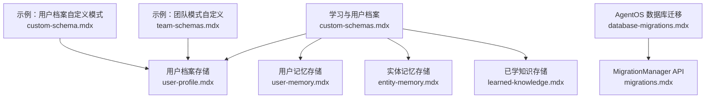
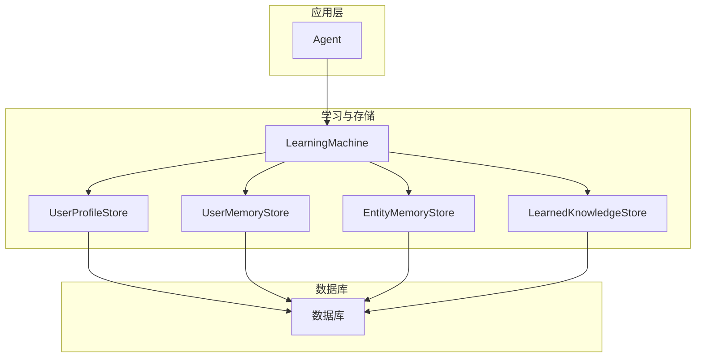
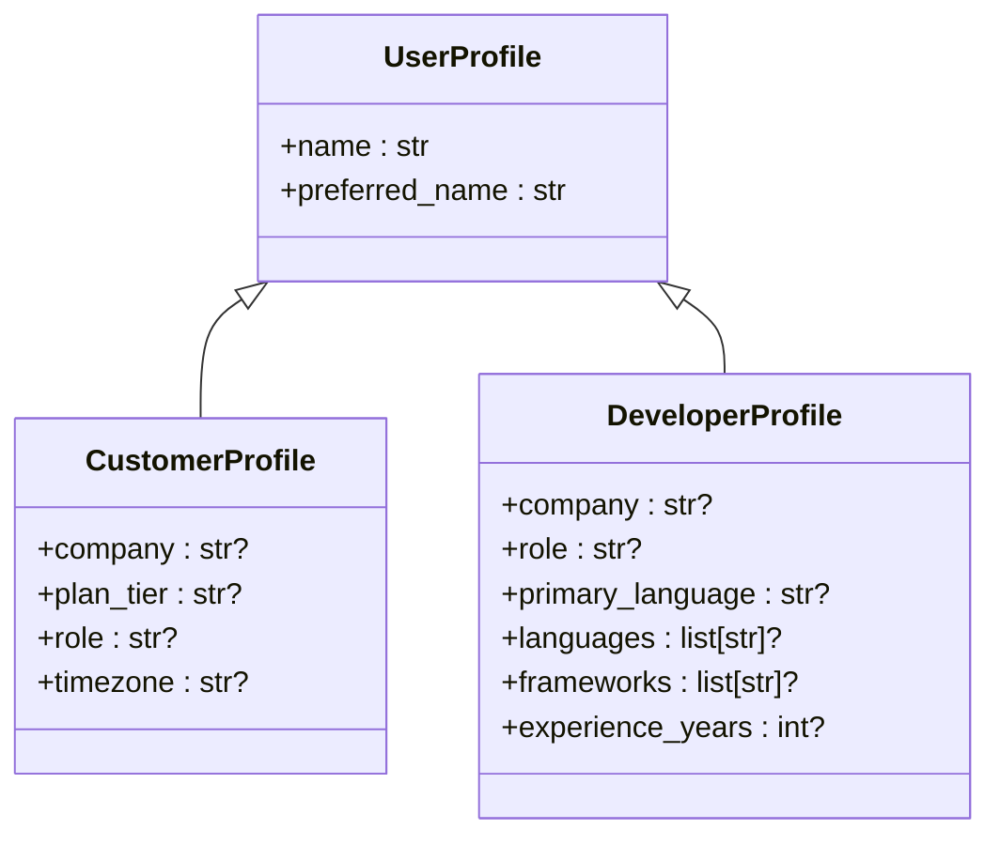
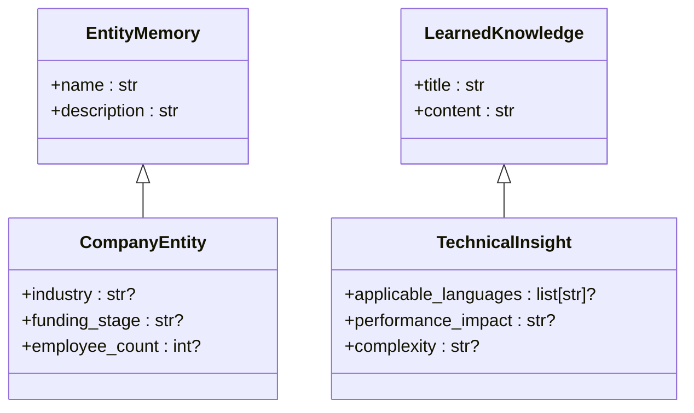
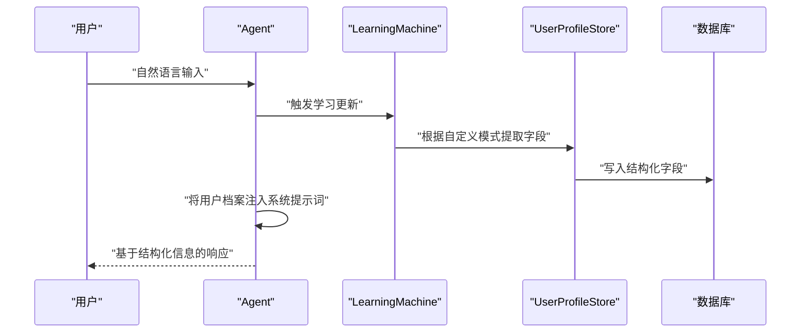
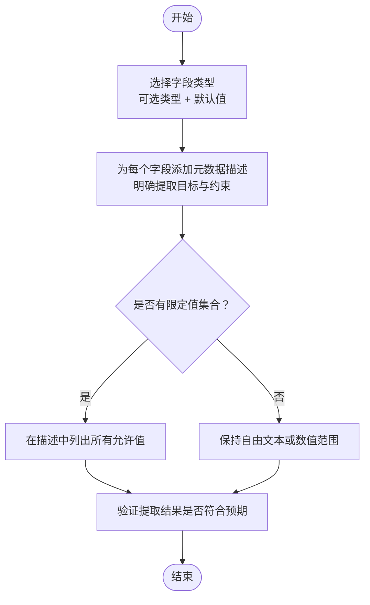
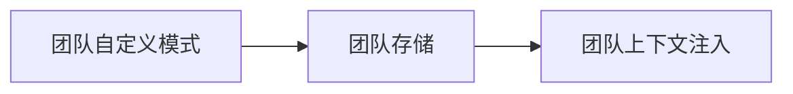
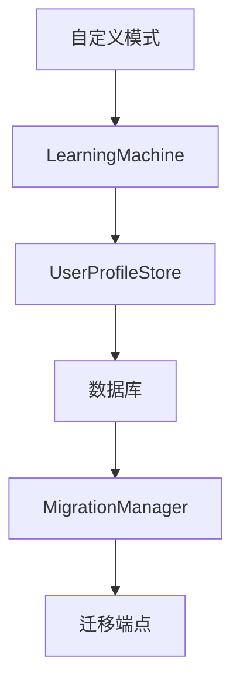

# 自定义模式（Custom Schema）

<cite>
**本文引用的文件**
- [custom-schemas.mdx](file://learning/custom-schemas.mdx)
- [custom-schema.mdx](file://examples/learning/user-profile/custom-schema.mdx)
- [user-profile.mdx](file://learning/stores/user-profile.mdx)
- [user-memory.mdx](file://learning/stores/user-memory.mdx)
- [entity-memory.mdx](file://learning/stores/entity-memory.mdx)
- [learned-knowledge.mdx](file://learning/stores/learned-knowledge.mdx)
- [database-migrations.mdx](file://agent-os/usage/database-migrations.mdx)
- [migrations.mdx](file://reference/storage/migrations.mdx)
- [team-schemas.mdx](file://examples/agent-os/schemas/team-schemas.mdx)
</cite>

## 目录
1. [简介](#简介)
2. [项目结构](#项目结构)
3. [核心组件](#核心组件)
4. [架构总览](#架构总览)
5. [详细组件分析](#详细组件分析)
6. [依赖分析](#依赖分析)
7. [性能考虑](#性能考虑)
8. [故障排查指南](#故障排查指南)
9. [结论](#结论)
10. [附录](#附录)

## 简介
本技术文档围绕“用户档案存储”的自定义模式展开，系统性阐述如何在现有基础用户档案模式之上扩展出满足特定业务域需求的自定义数据结构，并解释元数据描述对大模型（LLM）提取行为的影响机制。文档覆盖自定义数据类的创建方法、字段定义与元数据配置、继承关系与数据验证规则、最佳实践与命名约定、版本管理策略，以及测试与调试方法。

## 项目结构
与自定义模式相关的内容主要分布在以下位置：
- 学习与用户档案：学习自定义模式与使用指南、用户档案与记忆存储的说明、实体记忆与已学知识存储的扩展示例
- 示例：用户档案自定义模式的端到端示例、团队模式的自定义示例
- 数据库迁移：AgentOS 数据库迁移机制与版本控制

**图示来源**
- [custom-schemas.mdx:1-218](file://learning/custom-schemas.mdx#L1-L218)
- [user-profile.mdx:118-167](file://learning/stores/user-profile.mdx#L118-L167)
- [user-memory.mdx:97-161](file://learning/stores/user-memory.mdx#L97-L161)
- [entity-memory.mdx](file://learning/stores/entity-memory.mdx)
- [learned-knowledge.mdx](file://learning/stores/learned-knowledge.mdx)
- [custom-schema.mdx:1-134](file://examples/learning/user-profile/custom-schema.mdx#L1-L134)
- [team-schemas.mdx:142-160](file://examples/agent-os/schemas/team-schemas.mdx#L142-L160)
- [database-migrations.mdx:1-39](file://agent-os/usage/database-migrations.mdx#L1-L39)
- [migrations.mdx:1-147](file://reference/storage/migrations.mdx#L1-L147)

**章节来源**
- [custom-schemas.mdx:1-218](file://learning/custom-schemas.mdx#L1-L218)
- [custom-schema.mdx:1-134](file://examples/learning/user-profile/custom-schema.mdx#L1-L134)
- [user-profile.mdx:118-167](file://learning/stores/user-profile.mdx#L118-L167)
- [user-memory.mdx:97-161](file://learning/stores/user-memory.mdx#L97-L161)
- [entity-memory.mdx](file://learning/stores/entity-memory.mdx)
- [learned-knowledge.mdx](file://learning/stores/learned-knowledge.mdx)
- [database-migrations.mdx:1-39](file://agent-os/usage/database-migrations.mdx#L1-L39)
- [migrations.mdx:1-147](file://reference/storage/migrations.mdx#L1-L147)
- [team-schemas.mdx:142-160](file://examples/agent-os/schemas/team-schemas.mdx#L142-L160)

## 核心组件
- 自定义用户档案模式：通过继承基础用户档案类型，新增结构化字段，并使用元数据描述指导 LLM 提取
- 其他可扩展存储：实体记忆、已学知识等也可按相同方式扩展
- 存储访问与上下文注入：扩展后的字段会自动注入到系统提示词中，无需手动拼接
- 数据库迁移：通过 MigrationManager 或迁移端点进行版本升级/降级，确保表结构与模式一致

**章节来源**
- [custom-schemas.mdx:10-50](file://learning/custom-schemas.mdx#L10-L50)
- [user-profile.mdx:127-154](file://learning/stores/user-profile.mdx#L127-L154)
- [migrations.mdx:35-121](file://reference/storage/migrations.mdx#L35-L121)

## 架构总览
下图展示了自定义模式在系统中的位置与交互关系：Agent 使用学习机器协调多个存储；用户档案存储负责结构化字段；实体记忆与已学知识存储负责外部实体与跨用户洞察；数据库迁移保障模式演进过程中的表结构一致性。

**图示来源**
- [user-profile.mdx:118-167](file://learning/stores/user-profile.mdx#L118-L167)
- [user-memory.mdx:97-161](file://learning/stores/user-memory.mdx#L97-L161)
- [entity-memory.mdx](file://learning/stores/entity-memory.mdx)
- [learned-knowledge.mdx](file://learning/stores/learned-knowledge.mdx)
- [migrations.mdx:35-121](file://reference/storage/migrations.mdx#L35-L121)

## 详细组件分析

### 用户档案自定义模式
- 继承与扩展：自定义用户档案类型需继承基础用户档案类型，新增结构化字段
- 字段与元数据：每个字段应声明为可选类型并提供元数据描述，用于指导 LLM 提取
- 使用方式：在学习机器配置中指定自定义用户档案类型
- 上下文注入：扩展后的字段会自动注入到系统提示词中，便于模型在对话中使用

**图示来源**
- [custom-schemas.mdx:12-36](file://learning/custom-schemas.mdx#L12-L36)
- [custom-schema.mdx:32-54](file://examples/learning/user-profile/custom-schema.mdx#L32-L54)

**章节来源**
- [custom-schemas.mdx:10-50](file://learning/custom-schemas.mdx#L10-L50)
- [custom-schema.mdx:32-72](file://examples/learning/user-profile/custom-schema.mdx#L32-L72)
- [user-profile.mdx:127-154](file://learning/stores/user-profile.mdx#L127-L154)

### 实体记忆与已学知识的自定义模式
- 实体记忆：可扩展实体记忆类型以记录外部实体的关键属性（如行业、融资阶段、员工数量）
- 已学知识：可扩展已学知识类型以记录跨用户的洞察（如适用语言、性能影响、复杂度）

**图示来源**
- [custom-schemas.mdx:136-174](file://learning/custom-schemas.mdx#L136-L174)

**章节来源**
- [custom-schemas.mdx:134-174](file://learning/custom-schemas.mdx#L134-L174)

### 自定义模式的使用流程（序列图）
该流程展示从对话到结构化提取再到上下文注入的关键步骤。

**图示来源**
- [custom-schema.mdx:78-119](file://examples/learning/user-profile/custom-schema.mdx#L78-L119)
- [user-profile.mdx:142-154](file://learning/stores/user-profile.mdx#L142-L154)

**章节来源**
- [custom-schema.mdx:78-119](file://examples/learning/user-profile/custom-schema.mdx#L78-L119)
- [user-profile.mdx:142-154](file://learning/stores/user-profile.mdx#L142-L154)

### 自定义模式的字段定义与元数据配置（流程图）
该流程图总结了字段定义与元数据配置的关键决策点。

**图示来源**
- [custom-schemas.mdx:51-86](file://learning/custom-schemas.mdx#L51-L86)

**章节来源**
- [custom-schemas.mdx:51-86](file://learning/custom-schemas.mdx#L51-L86)

### 团队模式的自定义（概念性说明）
团队模式同样支持自定义模式，可通过类似的数据类扩展方式定义团队成员的结构化信息，并在团队协作场景中复用。

**图示来源**
- [team-schemas.mdx:142-160](file://examples/agent-os/schemas/team-schemas.mdx#L142-L160)

**章节来源**
- [team-schemas.mdx:142-160](file://examples/agent-os/schemas/team-schemas.mdx#L142-L160)

## 依赖分析
- 组件耦合：自定义模式依赖于学习机器与存储接口；存储依赖数据库驱动
- 外部依赖：数据库迁移工具（MigrationManager）与迁移端点
- 版本依赖：迁移版本与 AgentOS 版本对应，避免 schema 不一致导致的错误

**图示来源**
- [custom-schemas.mdx:10-50](file://learning/custom-schemas.mdx#L10-L50)
- [migrations.mdx:35-121](file://reference/storage/migrations.mdx#L35-L121)
- [database-migrations.mdx:16-39](file://agent-os/usage/database-migrations.mdx#L16-L39)

**章节来源**
- [custom-schemas.mdx:10-50](file://learning/custom-schemas.mdx#L10-L50)
- [migrations.mdx:35-121](file://reference/storage/migrations.mdx#L35-L121)
- [database-migrations.mdx:16-39](file://agent-os/usage/database-migrations.mdx#L16-L39)

## 性能考虑
- 字段数量与元数据长度：字段越多、描述越长，LLM 提取成本越高；建议仅保留必要字段
- 存储写入频率：频繁写入可能带来数据库压力；可结合批处理或缓存策略
- 上下文注入大小：用户档案注入到系统提示词中，过长会影响上下文窗口与响应延迟

## 故障排查指南
- 提取失败或字段缺失
  - 检查字段是否为可选类型且带有元数据描述
  - 确认描述中是否包含明确的取值范围或格式要求
- 数据库迁移问题
  - 使用迁移端点或 MigrationManager 将数据库表结构升级至最新版本
  - 如需回滚，指定目标版本并确认受影响的表类型
- 调试技巧
  - 使用存储打印功能查看当前用户档案内容
  - 在示例脚本中逐步运行，观察不同对话回合下的字段变化

**章节来源**
- [custom-schemas.mdx:51-86](file://learning/custom-schemas.mdx#L51-L86)
- [user-profile.mdx:127-154](file://learning/stores/user-profile.mdx#L127-L154)
- [database-migrations.mdx:16-39](file://agent-os/usage/database-migrations.mdx#L16-L39)
- [migrations.mdx:35-121](file://reference/storage/migrations.mdx#L35-L121)

## 结论
通过自定义模式，用户档案存储能够从自由文本扩展为结构化、可验证的知识载体。借助清晰的元数据描述与严格的字段约束，LLM 可稳定地提取关键信息并自动注入到系统提示词中，从而提升个性化与上下文质量。配合数据库迁移机制，可在不破坏现有数据的前提下平滑演进模式版本。

## 附录

### 最佳实践与命名约定
- 字段命名：采用小驼峰或下划线风格，保持一致性
- 元数据描述：简洁明确，包含取值范围或格式要求
- 字段类型：优先使用可选类型并设置默认值，避免必填字段导致提取失败
- 域示例：参考 SaaS 支持、开发者工具等域示例，按需组合字段

**章节来源**
- [custom-schemas.mdx:51-133](file://learning/custom-schemas.mdx#L51-L133)

### 版本管理策略
- 迁移端点：通过 HTTP 请求一键迁移所有或指定数据库的所有表
- MigrationManager：编程式迁移，支持指定目标版本与表类型
- 版本对应：目标版本应与 AgentOS 版本一致，避免 schema 不匹配

**章节来源**
- [database-migrations.mdx:16-39](file://agent-os/usage/database-migrations.mdx#L16-L39)
- [migrations.mdx:35-121](file://reference/storage/migrations.mdx#L35-L121)