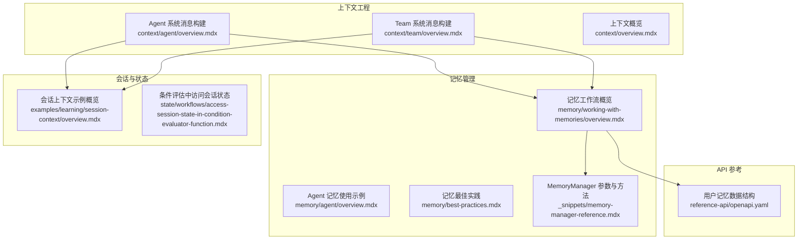
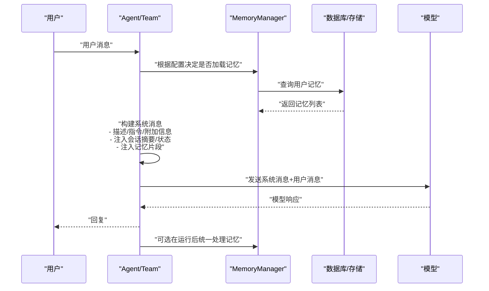
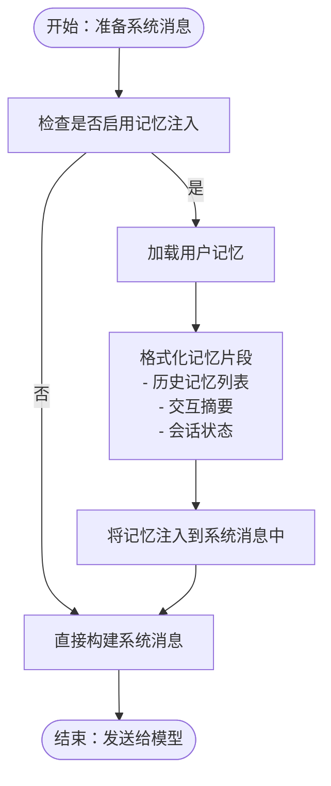
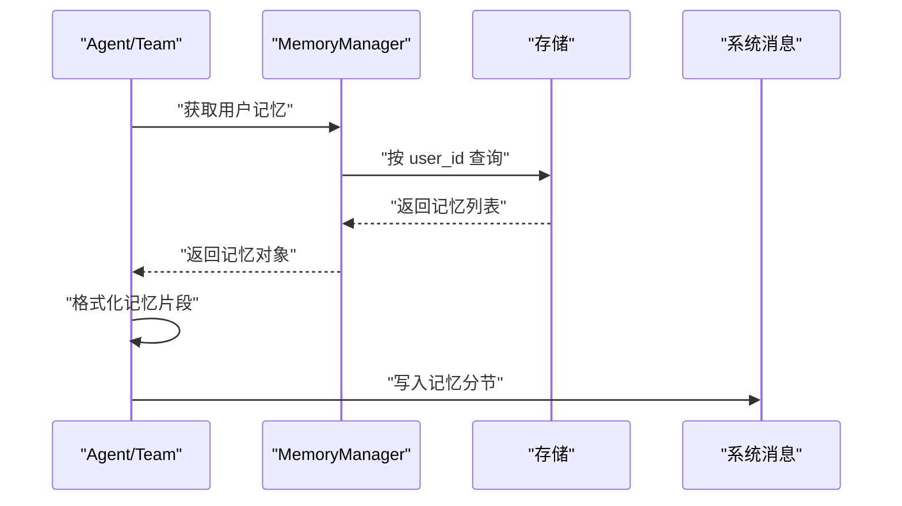
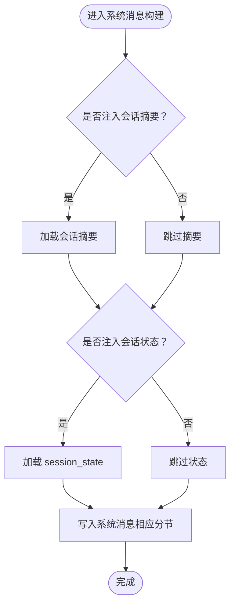
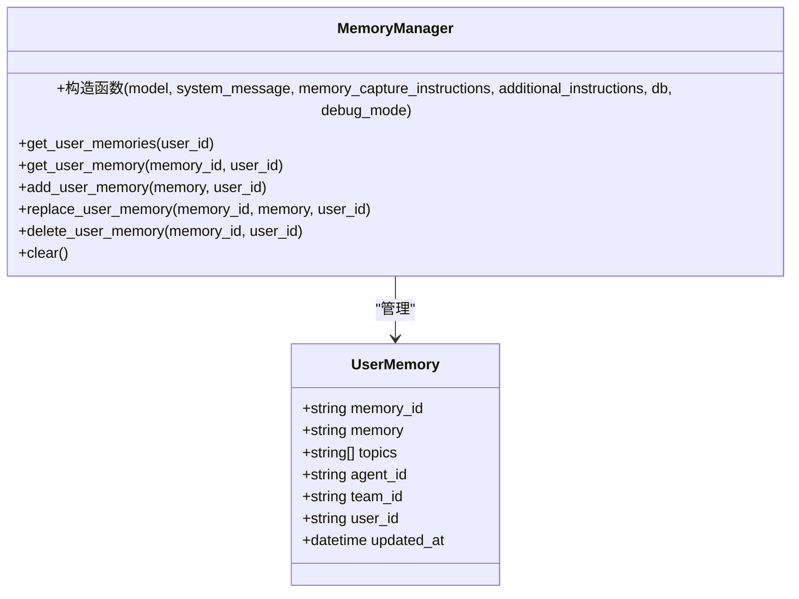
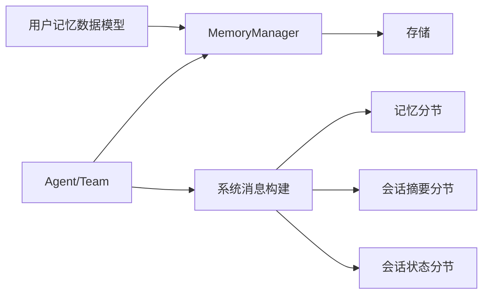

# 上下文注入机制

<cite>
**本文引用的文件**
- [context/agent/overview.mdx](file://context/agent/overview.mdx)
- [context/team/overview.mdx](file://context/team/overview.mdx)
- [context/overview.mdx](file://context/overview.mdx)
- [memory/working-with-memories/overview.mdx](file://memory/working-with-memories/overview.mdx)
- [memory/agent/overview.mdx](file://memory/agent/overview.mdx)
- [memory/best-practices.mdx](file://memory/best-practices.mdx)
- [examples/agents/context-management/overview.mdx](file://examples/agents/context-management/overview.mdx)
- [examples/learning/session-context/overview.mdx](file://examples/learning/session-context/overview.mdx)
- [state/workflows/access-session-state-in-condition-evaluator-function.mdx](file://state/workflows/access-session-state-in-condition-evaluator-function.mdx)
- [reference-api/openapi.yaml](file://reference-api/openapi.yaml)
- [_snippets/memory-manager-reference.mdx](file://_snippets/memory-manager-reference.mdx)
</cite>

## 目录
1. [引言](#引言)
2. [项目结构](#项目结构)
3. [核心组件](#核心组件)
4. [架构总览](#架构总览)
5. [详细组件分析](#详细组件分析)
6. [依赖关系分析](#依赖关系分析)
7. [性能考量](#性能考量)
8. [故障排查指南](#故障排查指南)
9. [结论](#结论)
10. [附录](#附录)

## 引言
本文件围绕“用户记忆的上下文注入机制”展开，系统性阐述记忆如何被提取、格式化并注入到系统提示（system message）中，以及注入的触发条件、时机、格式与结构、可配置项、对模型响应质量的影响与优化策略，并提供调试与监控方法。目标是帮助读者在对话场景中高效、可控地利用历史记忆提升个性化与一致性。

## 项目结构
该仓库以文档形式组织了上下文工程、记忆管理、会话状态、团队协作等主题。与上下文注入直接相关的内容主要分布在以下位置：
- 上下文工程（Agent/Team）：系统消息构建、附加信息注入、记忆注入开关与示例
- 记忆工作流：记忆管理器、自动/手动记忆更新、记忆优化与隐私控制
- 会话状态：会话摘要、会话状态注入、条件判断中对会话状态的读取
- API 参考：记忆数据结构与字段定义

**图示来源**
- [context/agent/overview.mdx](file://context/agent/overview.mdx)
- [context/team/overview.mdx](file://context/team/overview.mdx)
- [context/overview.mdx](file://context/overview.mdx)
- [memory/working-with-memories/overview.mdx](file://memory/working-with-memories/overview.mdx)
- [memory/agent/overview.mdx](file://memory/agent/overview.mdx)
- [memory/best-practices.mdx](file://memory/best-practices.mdx)
- [examples/learning/session-context/overview.mdx](file://examples/learning/session-context/overview.mdx)
- [state/workflows/access-session-state-in-condition-evaluator-function.mdx](file://state/workflows/access-session-state-in-condition-evaluator-function.mdx)
- [reference-api/openapi.yaml](file://reference-api/openapi.yaml)
- [_snippets/memory-manager-reference.mdx](file://_snippets/memory-manager-reference.mdx)

**章节来源**
- [context/agent/overview.mdx](file://context/agent/overview.mdx)
- [context/team/overview.mdx](file://context/team/overview.mdx)
- [context/overview.mdx](file://context/overview.mdx)

## 核心组件
- Agent/Team 的系统消息构建器：负责将描述、指令、附加信息、期望输出、时间/地点/名称、会话摘要、用户记忆、会话状态等拼装为最终系统提示。
- MemoryManager：负责记忆的创建、检索、更新、删除、优化与隐私控制；支持在运行后统一处理或通过工具由代理主动更新。
- 会话状态与摘要：在系统消息中注入会话摘要与会话状态，用于跨轮次保持上下文连贯。
- API 数据模型：定义用户记忆的数据结构（如 memory_id、memory、topics、agent_id、team_id、user_id、updated_at 等）。

关键参数（节选）：
- add_memories_to_context：是否将用户记忆注入到系统消息
- add_session_summary_to_context：是否注入会话摘要
- add_session_state_to_context：是否注入会话状态
- enable_agentic_memory：启用代理主动更新记忆的能力
- update_memory_on_run：在每次运行结束后统一处理记忆
- additional_context：附加到系统消息末尾的上下文

**章节来源**
- [context/agent/overview.mdx](file://context/agent/overview.mdx)
- [context/team/overview.mdx](file://context/team/overview.mdx)
- [memory/working-with-memories/overview.mdx](file://memory/working-with-memories/overview.mdx)
- [_snippets/memory-manager-reference.mdx](file://_snippets/memory-manager-reference.mdx)
- [reference-api/openapi.yaml](file://reference-api/openapi.yaml)

## 架构总览
下图展示了从用户输入到系统消息构建、记忆注入、模型推理与响应输出的整体流程，重点标注了记忆注入的关键节点与可配置项。

**图示来源**
- [context/agent/overview.mdx](file://context/agent/overview.mdx)
- [context/team/overview.mdx](file://context/team/overview.mdx)
- [memory/working-with-memories/overview.mdx](file://memory/working-with-memories/overview.mdx)
- [memory/best-practices.mdx](file://memory/best-practices.mdx)

## 详细组件分析

### 组件一：系统消息中的记忆注入
- 触发条件与时机
  - 在 Agent/Team 构建系统消息时，若开启 add_memories_to_context，则将用户的记忆注入到系统消息中。
  - 典型时机：每次请求前、在系统消息组装阶段完成记忆片段拼接。
- 注入格式与结构
  - 使用特定标记包裹记忆片段，例如在示例中出现的“memories_from_previous_interactions”、“summary_of_previous_interactions”等分节。
  - 系统消息中通常包含三类记忆相关段落：
    - 历史记忆列表：可随对话更新
    - 交互摘要：简要总结过往交互要点
    - 会话状态：当前会话的状态对象（如 session_state）
- 配置选项
  - add_memories_to_context：控制是否注入记忆
  - enable_agentic_memory：允许代理使用工具主动更新记忆
  - update_memory_on_run：在每次运行结束后统一处理记忆
  - additional_context：可在系统消息末尾追加额外上下文

**图示来源**
- [context/agent/overview.mdx](file://context/agent/overview.mdx)
- [context/team/overview.mdx](file://context/team/overview.mdx)

**章节来源**
- [context/agent/overview.mdx](file://context/agent/overview.mdx)
- [context/team/overview.mdx](file://context/team/overview.mdx)

### 组件二：记忆提取、格式化与注入流程
- 提取
  - 通过 MemoryManager 查询数据库中与当前 user_id 对应的记忆集合。
- 格式化
  - 将记忆转换为适合系统消息阅读的文本片段，包含若干条记忆条目与摘要说明。
- 注入
  - 将格式化后的记忆片段插入到系统消息的指定区域（如“memories_from_previous_interactions”分节），并在必要时给出优先级说明（例如“以本次对话为准”）。

**图示来源**
- [memory/working-with-memories/overview.mdx](file://memory/working-with-memories/overview.mdx)
- [memory/agent/overview.mdx](file://memory/agent/overview.mdx)

**章节来源**
- [memory/working-with-memories/overview.mdx](file://memory/working-with-memories/overview.mdx)
- [memory/agent/overview.mdx](file://memory/agent/overview.mdx)

### 组件三：会话摘要与会话状态的注入
- 会话摘要注入
  - 通过 add_session_summary_to_context 控制是否将会话摘要加入系统消息，用于快速回顾上下文。
- 会话状态注入
  - 通过 add_session_state_to_context 控制是否将 session_state 写入系统消息，便于模型理解当前状态。
- 示例与用法
  - 在团队系统消息中明确展示了“session_state”的注入位置与作用。
  - 条件评估函数中可读取 run_context.session_state，体现会话状态在运行期的可用性。

**图示来源**
- [context/agent/overview.mdx](file://context/agent/overview.mdx)
- [context/team/overview.mdx](file://context/team/overview.mdx)
- [state/workflows/access-session-state-in-condition-evaluator-function.mdx](file://state/workflows/access-session-state-in-condition-evaluator-function.mdx)

**章节来源**
- [context/agent/overview.mdx](file://context/agent/overview.mdx)
- [context/team/overview.mdx](file://context/team/overview.mdx)
- [state/workflows/access-session-state-in-condition-evaluator-function.mdx](file://state/workflows/access-session-state-in-condition-evaluator-function.mdx)

### 组件四：记忆管理器与数据模型
- MemoryManager 关键能力
  - 用户记忆的增删改查
  - 自定义模型与附加指令
  - 背景收集与上下文隔离（add_memories_to_context=False）
- 用户记忆数据模型
  - 字段：memory_id、memory、topics、agent_id、team_id、user_id、updated_at 等
  - 用途：持久化记忆、跨组件共享、审计与分析

**图示来源**
- [_snippets/memory-manager-reference.mdx](file://_snippets/memory-manager-reference.mdx)
- [reference-api/openapi.yaml](file://reference-api/openapi.yaml)

**章节来源**
- [_snippets/memory-manager-reference.mdx](file://_snippets/memory-manager-reference.mdx)
- [reference-api/openapi.yaml](file://reference-api/openapi.yaml)

## 依赖关系分析
- Agent/Team 依赖 MemoryManager 进行记忆的读取与写入；当启用自动记忆或代理主动记忆时，两者耦合度较高。
- 会话摘要与会话状态作为上下文的一部分，与 Agent/Team 的系统消息构建强关联。
- API 层面的用户记忆数据模型为前端与后端提供一致的数据契约，确保记忆在不同模块间传递的一致性。

**图示来源**
- [context/agent/overview.mdx](file://context/agent/overview.mdx)
- [context/team/overview.mdx](file://context/team/overview.mdx)
- [memory/working-with-memories/overview.mdx](file://memory/working-with-memories/overview.mdx)
- [reference-api/openapi.yaml](file://reference-api/openapi.yaml)

**章节来源**
- [context/agent/overview.mdx](file://context/agent/overview.mdx)
- [context/team/overview.mdx](file://context/team/overview.mdx)
- [memory/working-with-memories/overview.mdx](file://memory/working-with-memories/overview.mdx)
- [reference-api/openapi.yaml](file://reference-api/openapi.yaml)

## 性能考量
- 记忆规模增长导致上下文膨胀：随着用户记忆数量增加，注入到系统消息中的记忆片段会显著增加 token 消耗，进而提高成本与延迟。
- 优化策略
  - 启用记忆优化：定期合并与压缩记忆，减少冗余与重复。
  - 控制注入范围：通过 add_memories_to_context=False 收集记忆但不自动注入，仅在需要时显式检索。
  - 选择性注入：结合会话摘要与最近记忆，避免一次性注入全部历史。
  - 分层处理：在运行后统一处理记忆（update_memory_on_run=True），降低实时注入成本。

**章节来源**
- [memory/best-practices.mdx](file://memory/best-practices.mdx)
- [memory/working-with-memories/overview.mdx](file://memory/working-with-memories/overview.mdx)

## 故障排查指南
- 记忆未注入
  - 检查 add_memories_to_context 是否开启
  - 确认 user_id 正确且存储中有对应记忆
  - 查看系统消息构建日志（debug_mode）
- 记忆过多导致上下文超限
  - 开启记忆优化
  - 减少注入的记忆条目数量
  - 使用会话摘要替代部分历史细节
- 会话状态未生效
  - 检查 add_session_state_to_context 是否开启
  - 确认 run_context.session_state 的设置与读取逻辑
- 调试建议
  - 打开 debug_mode，观察系统消息的最终形态
  - 使用示例工程验证各参数组合的效果
  - 结合条件评估函数检查会话状态在运行期的可见性

**章节来源**
- [context/agent/overview.mdx](file://context/agent/overview.mdx)
- [context/team/overview.mdx](file://context/team/overview.mdx)
- [examples/agents/context-management/overview.mdx](file://examples/agents/context-management/overview.mdx)
- [examples/learning/session-context/overview.mdx](file://examples/learning/session-context/overview.mdx)
- [state/workflows/access-session-state-in-condition-evaluator-function.mdx](file://state/workflows/access-session-state-in-condition-evaluator-function.mdx)

## 结论
用户记忆的上下文注入是提升个性化与一致性的重要手段。通过合理配置 add_memories_to_context、enable_agentic_memory、update_memory_on_run 等参数，并结合会话摘要与会话状态的注入，可以在保证响应质量的同时控制上下文规模与成本。配合记忆优化与调试手段，可实现稳定高效的上下文注入机制。

## 附录
- 相关示例与参考
  - Agent/Team 上下文管理示例概览
  - 会话上下文示例概览
  - 条件评估中访问会话状态
- API 数据模型
  - 用户记忆数据结构（memory_id、memory、topics、agent_id、team_id、user_id、updated_at）

**章节来源**
- [examples/agents/context-management/overview.mdx](file://examples/agents/context-management/overview.mdx)
- [examples/learning/session-context/overview.mdx](file://examples/learning/session-context/overview.mdx)
- [state/workflows/access-session-state-in-condition-evaluator-function.mdx](file://state/workflows/access-session-state-in-condition-evaluator-function.mdx)
- [reference-api/openapi.yaml](file://reference-api/openapi.yaml)