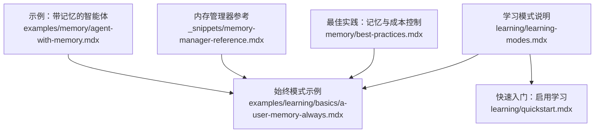
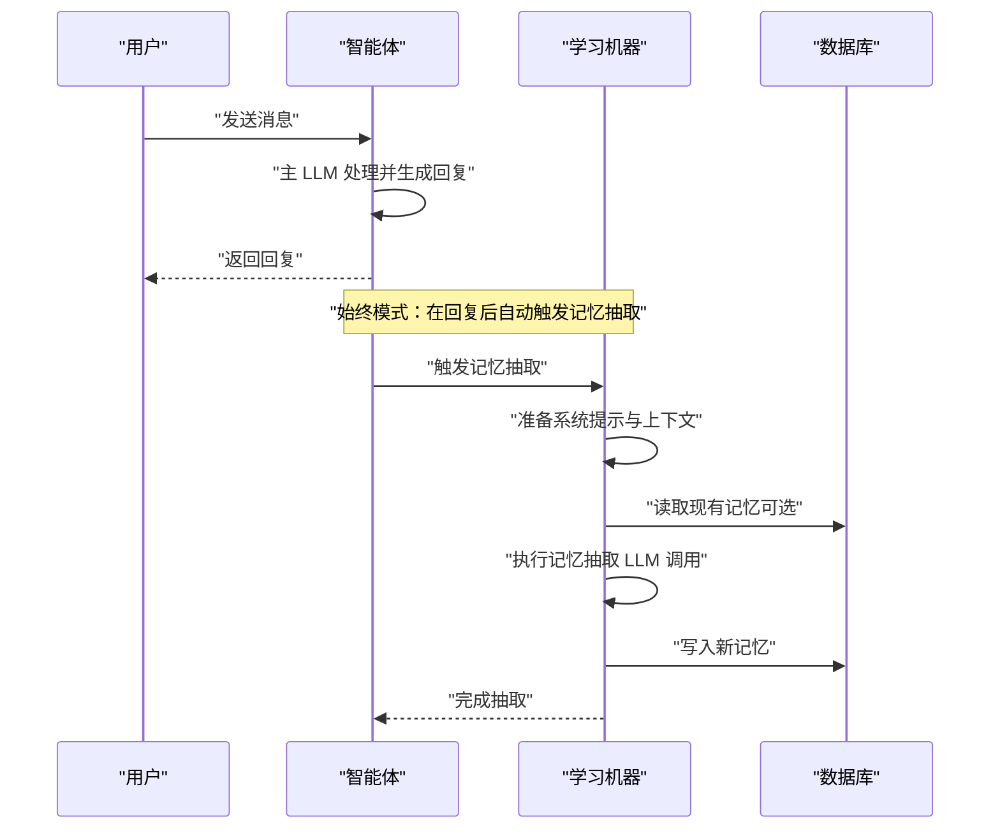
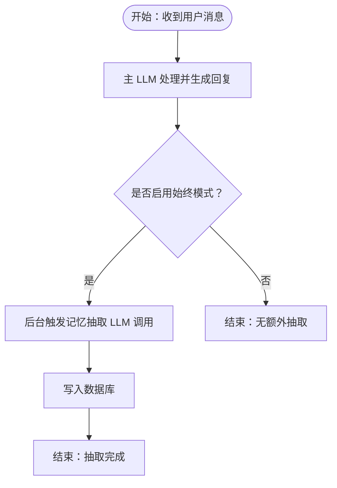
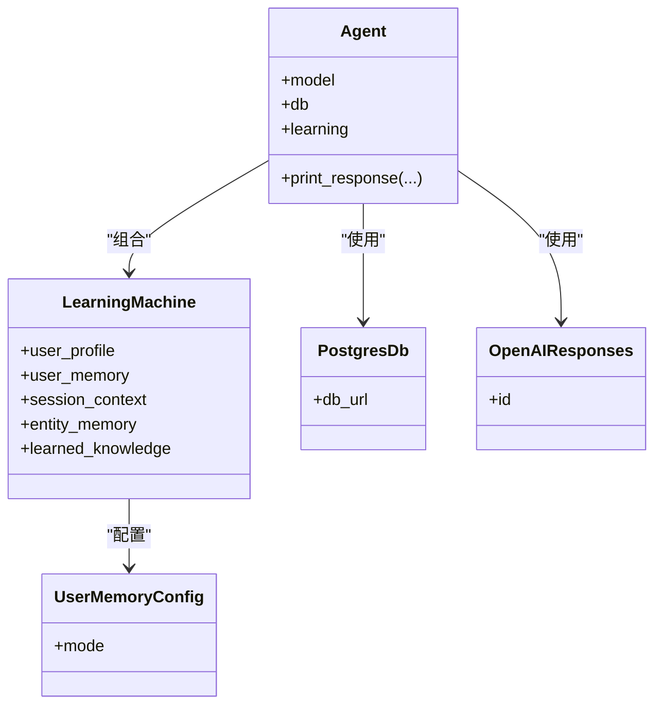
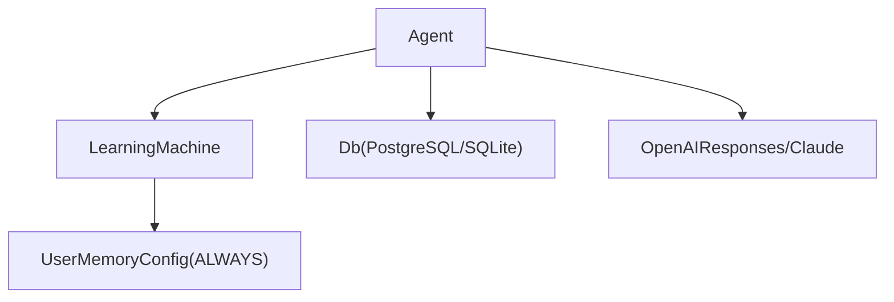

# 始终模式（Always Mode）

<cite>
**本文引用的文件**
- [学习模式说明](file://learning/learning-modes.mdx)
- [始终模式：用户记忆示例](file://examples/learning/basics/a-user-memory-always.mdx)
- [快速入门：启用学习](file://learning/quickstart.mdx)
- [最佳实践：记忆与成本控制](file://memory/best-practices.mdx)
- [内存管理器参考](file://_snippets/memory-manager-reference.mdx)
- [示例：带记忆的智能体](file://examples/memory/agent-with-memory.mdx)
- [示例：多用户多会话聊天](file://examples/memory/agent-with-memory.mdx)
</cite>

## 目录
1. [简介](#简介)
2. [项目结构](#项目结构)
3. [核心组件](#核心组件)
4. [架构总览](#架构总览)
5. [详细组件分析](#详细组件分析)
6. [依赖关系分析](#依赖关系分析)
7. [性能考量](#性能考量)
8. [故障排查指南](#故障排查指南)
9. [结论](#结论)
10. [附录](#附录)

## 简介
始终模式（Always Mode）是学习模式的一种，其核心特征是在每次响应完成后自动触发记忆提取，无需显式的工具调用或人工确认。该模式适用于需要“被动持续学习”的场景，如用户画像（UserProfile）、用户记忆（UserMemory）、会话上下文（SessionContext）、实体记忆（EntityMemory）等。在始终模式下，系统会在后台并行进行一次额外的 LLM 调用以完成记忆抽取，从而确保信息在交互过程中被无缝捕获。

本篇文档将深入解释始终模式的工作原理、触发时机与处理流程，提供配置方法与参数设置说明，并结合示例展示如何启用与配置始终模式，涵盖代理配置、数据库设置与学习机器人初始化。同时，我们将讨论始终模式的优势与权衡（尤其是额外 LLM 调用带来的开销），并给出性能优化建议与适用场景。

## 项目结构
围绕“始终模式”的相关文档与示例主要分布在以下位置：
- 学习模式与默认行为说明：learning/learning-modes.mdx
- 始终模式示例（用户记忆）：examples/learning/basics/a-user-memory-always.mdx
- 快速入门与基础配置：learning/quickstart.mdx
- 记忆与成本控制的最佳实践：memory/best-practices.mdx
- 内存管理器接口与方法参考：_snippets/memory-manager-reference.mdx
- 示例：带记忆的智能体与多用户多会话：examples/memory/agent-with-memory.mdx

**图表来源**
- [学习模式说明](file://learning/learning-modes.mdx)
- [始终模式：用户记忆示例](file://examples/learning/basics/a-user-memory-always.mdx)
- [快速入门：启用学习](file://learning/quickstart.mdx)
- [最佳实践：记忆与成本控制](file://memory/best-practices.mdx)
- [内存管理器参考](file://_snippets/memory-manager-reference.mdx)
- [示例：带记忆的智能体](file://examples/memory/agent-with-memory.mdx)

**章节来源**
- [学习模式说明](file://learning/learning-modes.mdx)
- [始终模式：用户记忆示例](file://examples/learning/basics/a-user-memory-always.mdx)
- [快速入门：启用学习](file://learning/quickstart.mdx)
- [最佳实践：记忆与成本控制](file://memory/best-practices.mdx)
- [内存管理器参考](file://_snippets/memory-manager-reference.mdx)
- [示例：带记忆的智能体](file://examples/memory/agent-with-memory.mdx)

## 核心组件
- 学习模式（LearningMode）
  - 始终模式（ALWAYS）：每次响应后自动执行记忆抽取，不暴露工具给代理。
  - 代理模式（AGENTIC）：代理通过工具决定何时保存。
  - 提议模式（PROPOSE）：代理提出学习内容，需经用户确认后保存。
- 学习机器（LearningMachine）
  - 用于统一配置各记忆存储的模式与参数。
- 用户记忆配置（UserMemoryConfig）
  - 通过 mode=LearningMode.ALWAYS 启用始终模式。
- 数据库（Db）
  - 支持 SQLite、PostgreSQL 等，生产环境推荐 PostgreSQL。
- 模型（Model）
  - 例如 OpenAIResponses、Claude 等，用于执行记忆抽取与检索。

**章节来源**
- [学习模式说明](file://learning/learning-modes.mdx)
- [始终模式：用户记忆示例](file://examples/learning/basics/a-user-memory-always.mdx)
- [快速入门：启用学习](file://learning/quickstart.mdx)

## 架构总览
始终模式的运行时架构可概括为：主 LLM 处理用户输入并生成回复；随后，学习机器在后台触发一次独立的记忆抽取 LLM 调用，将抽取结果写入对应存储（如用户记忆）。此过程对代理透明，不改变对话流，但会引入一次额外的 LLM 调用与相应成本。

**图表来源**
- [学习模式说明](file://learning/learning-modes.mdx)
- [始终模式：用户记忆示例](file://examples/learning/basics/a-user-memory-always.mdx)

## 详细组件分析

### 组件一：始终模式的触发时机与处理流程
- 触发时机
  - 在每次智能体生成回复之后自动触发记忆抽取。
- 处理流程
  - 准备系统提示与上下文（可能包含历史记忆）。
  - 执行一次独立的 LLM 调用以决定是否新增、更新或删除记忆。
  - 将结果持久化到数据库中。
- 对代理的影响
  - 代理无需感知或调用任何记忆工具，抽取过程对代理透明。

**图表来源**
- [学习模式说明](file://learning/learning-modes.mdx)
- [始终模式：用户记忆示例](file://examples/learning/basics/a-user-memory-always.mdx)

**章节来源**
- [学习模式说明](file://learning/learning-modes.mdx)
- [始终模式：用户记忆示例](file://examples/learning/basics/a-user-memory-always.mdx)

### 组件二：配置方法与参数设置
- 基础启用
  - 使用 learning=True 可快速启用默认的始终模式（用户画像与用户记忆）。
- 显式配置
  - 通过 LearningMachine 为不同存储分别指定模式，如 user_memory=UserMemoryConfig(mode=LearningMode.ALWAYS)。
- 数据库设置
  - 开发环境可用 SQLite；生产环境推荐 PostgreSQL。
- 模型设置
  - 选择合适的模型（如 OpenAIResponses、Claude）以支持记忆抽取与检索。

**图表来源**
- [始终模式：用户记忆示例](file://examples/learning/basics/a-user-memory-always.mdx)
- [快速入门：启用学习](file://learning/quickstart.mdx)

**章节来源**
- [始终模式：用户记忆示例](file://examples/learning/basics/a-user-memory-always.mdx)
- [快速入门：启用学习](file://learning/quickstart.mdx)

### 组件三：何时选择始终模式与适用场景
- 适用场景
  - 需要持续捕获用户姓名、偏好等结构化信息（用户画像）。
  - 需要自动积累非结构化的观察与记忆（用户记忆）。
  - 需要持续跟踪会话状态与目标（会话上下文）。
  - 需要从常规对话中持续抽取实体事实与事件（实体记忆）。
- 不适用场景
  - 对高价值知识采用合规/审计导向的保存流程，更适合代理模式或提议模式。
  - 对于成本敏感或对延迟敏感的实时场景，应谨慎评估额外 LLM 调用的成本与延迟。

**章节来源**
- [学习模式说明](file://learning/learning-modes.mdx)

### 组件四：优势与权衡（额外 LLM 调用开销）
- 优势
  - 无需显式工具调用，抽取过程对代理透明。
  - 信息在交互过程中被无缝捕获，减少遗漏。
- 权衡
  - 每次交互都会产生一次额外的 LLM 调用，增加 token 消耗与成本。
  - 随着记忆数量增长，上下文加载成本上升，单次记忆操作可能消耗大量 token。

**章节来源**
- [学习模式说明](file://learning/learning-modes.mdx)
- [最佳实践：记忆与成本控制](file://memory/best-practices.mdx)

### 组件五：完整代码示例路径（启用与配置始终模式）
- 始终模式：用户记忆
  - 示例路径：[始终模式：用户记忆示例](file://examples/learning/basics/a-user-memory-always.mdx)
  - 关键点：PostgresDb、UserMemoryConfig(mode=LearningMode.ALWAYS)、Agent 初始化与打印响应。
- 快速入门：启用学习
  - 示例路径：[快速入门：启用学习](file://learning/quickstart.mdx)
  - 关键点：learning=True、PostgreSQL 生产数据库配置。
- 带记忆的智能体与多用户多会话
  - 示例路径：[示例：带记忆的智能体](file://examples/memory/agent-with-memory.mdx)
  - 关键点：get_user_memories、更新与替换记忆的操作演示。

**章节来源**
- [始终模式：用户记忆示例](file://examples/learning/basics/a-user-memory-always.mdx)
- [快速入门：启用学习](file://learning/quickstart.mdx)
- [示例：带记忆的智能体](file://examples/memory/agent-with-memory.mdx)

## 依赖关系分析
- 组件耦合
  - Agent 依赖 LearningMachine 进行学习控制。
  - LearningMachine 依赖数据库（Db）进行持久化。
  - UserMemoryConfig 作为配置项影响记忆抽取策略。
- 外部依赖
  - 模型提供商（如 OpenAI、Anthropic）用于执行记忆抽取与检索。
- 潜在循环依赖
  - 文档示例未显示循环依赖迹象；若自定义扩展，需避免在记忆抽取回调中再次触发抽取。

**图表来源**
- [始终模式：用户记忆示例](file://examples/learning/basics/a-user-memory-always.mdx)
- [学习模式说明](file://learning/learning-modes.mdx)

**章节来源**
- [始终模式：用户记忆示例](file://examples/learning/basics/a-user-memory-always.mdx)
- [学习模式说明](file://learning/learning-modes.mdx)

## 性能考量
- 成本与延迟
  - 始终模式在每次交互中引入一次额外 LLM 调用，需关注 token 消耗与成本。
  - 随记忆规模增长，上下文加载成本上升，单次记忆操作可能消耗数千 token。
- 优化建议
  - 控制记忆数量：定期清理冗余记忆，监控用户记忆条目数。
  - 合理选择模式：对于高价值知识或合规场景，考虑代理模式或提议模式以减少不必要的抽取。
  - 使用更高效的数据库与索引：在 PostgreSQL 上优化查询与索引，降低读写延迟。
  - 评估上下文长度：必要时压缩历史消息或限制加载的记忆数量，避免过度上下文导致的性能问题。

**章节来源**
- [最佳实践：记忆与成本控制](file://memory/best-practices.mdx)

## 故障排查指南
- 常见问题
  - 记忆未被保存：检查是否启用了始终模式，确认数据库连接正常。
  - 记忆增长过快：监控用户记忆数量，设置阈值告警并定期清理。
  - 抽取成本过高：评估是否需要在所有交互中都进行记忆抽取，考虑降级到代理模式或提议模式。
- 排查步骤
  - 确认 Agent 初始化时已正确传入 LearningMachine 与数据库实例。
  - 使用内存管理器接口查看与检索记忆，验证写入与读取链路。
  - 在多用户或多会话场景中，确保明确传递 user_id 与 session_id。

**章节来源**
- [内存管理器参考](file://_snippets/memory-manager-reference.mdx)
- [示例：带记忆的智能体](file://examples/memory/agent-with-memory.mdx)
- [示例：多用户多会话聊天](file://examples/memory/agent-with-memory.mdx)

## 结论
始终模式通过在每次响应后自动触发记忆抽取，实现了对用户画像、用户记忆、会话上下文与实体记忆的持续学习，无需代理显式调用工具，提升了易用性与一致性。然而，额外的 LLM 调用会带来成本与延迟的增加，尤其在记忆规模较大时更为明显。因此，在选择始终模式时，应综合考虑业务需求、合规要求与成本控制，并结合优化策略（如定期清理、合理选择模式、优化数据库与上下文长度）来平衡效果与资源消耗。

## 附录
- 相关示例与参考
  - [始终模式：用户记忆示例](file://examples/learning/basics/a-user-memory-always.mdx)
  - [学习模式说明](file://learning/learning-modes.mdx)
  - [快速入门：启用学习](file://learning/quickstart.mdx)
  - [最佳实践：记忆与成本控制](file://memory/best-practices.mdx)
  - [内存管理器参考](file://_snippets/memory-manager-reference.mdx)
  - [示例：带记忆的智能体](file://examples/memory/agent-with-memory.mdx)
  - [示例：多用户多会话聊天](file://examples/memory/agent-with-memory.mdx)