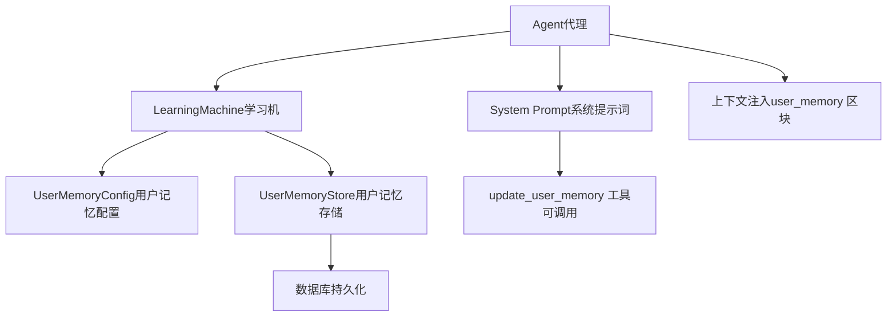
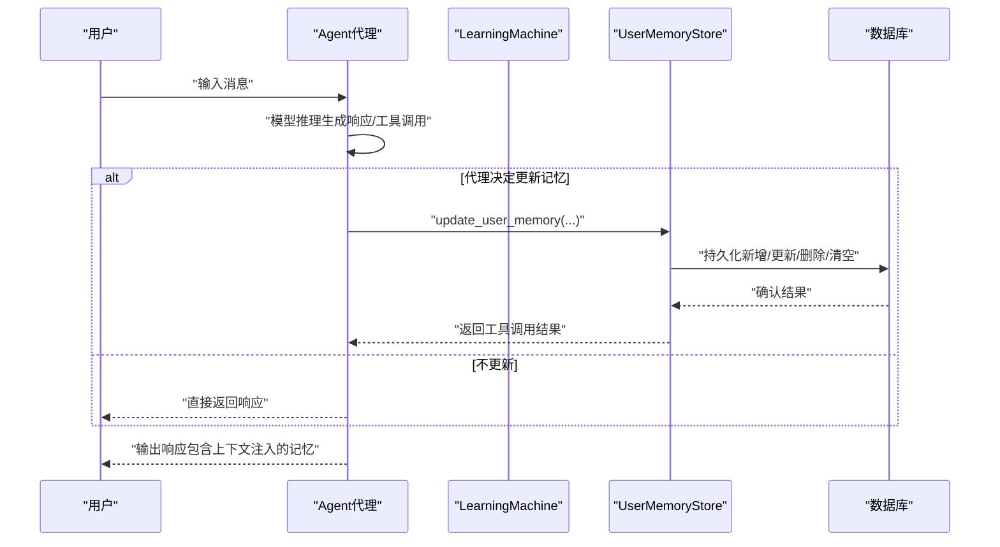
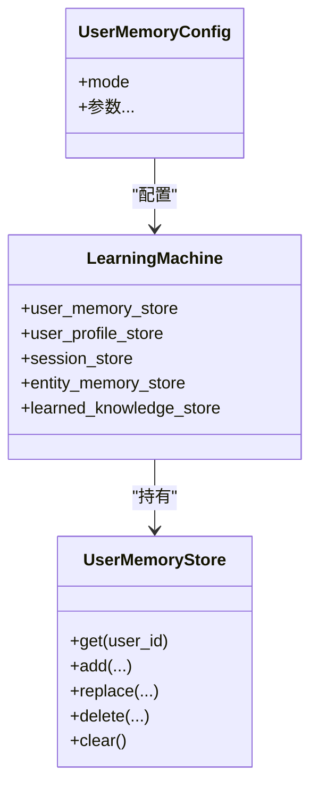
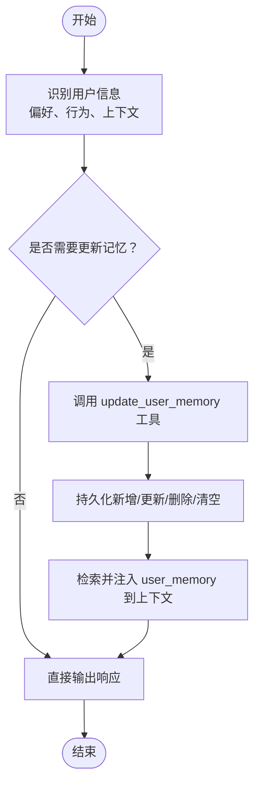
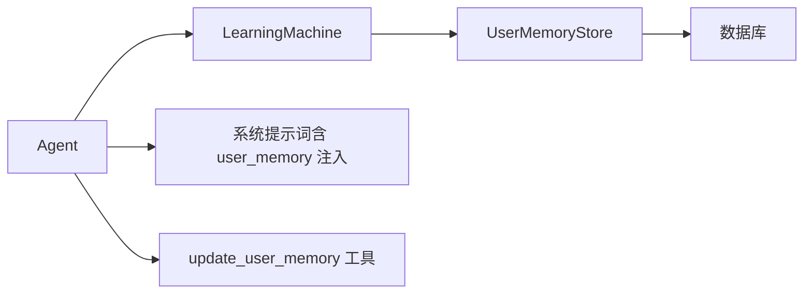

# 智能模式（Agentic Mode）

<cite>
**本文引用的文件**
- [user-memory.mdx](file://learning/stores/user-memory.mdx)
- [b-user-memory-agentic.mdx](file://examples/learning/basics/b-user-memory-agentic.mdx)
- [agentic-learn.mdx](file://examples/learning/quickstart/agentic-learn.mdx)
- [learning-modes.mdx](file://learning/learning-modes.mdx)
- [best-practices.mdx](file://memory/best-practices.mdx)
- [context-agent-overview.mdx](file://context/agent/overview.mdx)
- [context-team-overview.mdx](file://context/team/overview.mdx)
- [memory-manager-reference.mdx](file://_snippets/memory-manager-reference.mdx)
- [memory.mdx](file://reference/memory/memory.mdx)
- [agent.mdx](file://reference/agents/agent.mdx)
- [mem0-tools.mdx](file://examples/tools/mem0-tools.mdx)
- [mem0-integration.mdx](file://examples/integrations/memory/mem0-integration.mdx)
- [optimize-user-memories.mdx](file://reference-api/schema/memory/optimize-user-memories.mdx)
- [get-user-memory-statistics.mdx](file://reference-api/schema/memory/get-user-memory-statistics.mdx)
</cite>

## 目录
1. [简介](#简介)
2. [项目结构](#项目结构)
3. [核心组件](#核心组件)
4. [架构总览](#架构总览)
5. [详细组件分析](#详细组件分析)
6. [依赖关系分析](#依赖关系分析)
7. [性能考量](#性能考量)
8. [故障排查指南](#故障排查指南)
9. [结论](#结论)
10. [附录](#附录)

## 简介
本文件围绕“智能模式（Agentic Mode）”展开，系统阐述其设计理念、工作机制与最佳实践，重点覆盖以下主题：
- 代理主动管理记忆的工作流程与上下文注入
- 智能模式的配置方法与 UserMemoryConfig 的使用
- update_user_memory 工具的使用方式（新增、更新、删除、清空）
- 智能模式的优势与潜在风险（尤其可能错过隐式观察）
- 完整示例：如何在代理中启用智能模式、调用工具、管理记忆与进行手动干预
- 何时选择智能模式及最佳实践建议

## 项目结构
与智能模式直接相关的知识分布在如下位置：
- 学习与记忆概念与示例：learning/stores/user-memory.mdx、examples/learning/basics/b-user-memory-agentic.mdx、examples/learning/quickstart/agentic-learn.mdx
- 模式选择与工具映射：learning/learning-modes.mdx
- 配置与参数：context/agent/overview.mdx、context/team/overview.mdx、reference/agents/agent.mdx
- 记忆管理器与工具参考：_snippets/memory-manager-reference.mdx、reference/memory/memory.mdx
- 性能与风险：memory/best-practices.mdx
- 外部集成与扩展：examples/tools/mem0-tools.mdx、examples/integrations/memory/mem0-integration.mdx
- API 参考：reference-api/schema/memory/*

图表来源
- [user-memory.mdx:108-132](file://learning/stores/user-memory.mdx#L108-L132)
- [learning-modes.mdx:65-74](file://learning/learning-modes.mdx#L65-L74)
- [context-agent-overview.mdx:225-238](file://context/agent/overview.mdx#L225-L238)

章节来源
- [user-memory.mdx:1-162](file://learning/stores/user-memory.mdx#L1-L162)
- [learning-modes.mdx:40-124](file://learning/learning-modes.mdx#L40-L124)
- [context-agent-overview.mdx:225-238](file://context/agent/overview.mdx#L225-L238)
- [context-team-overview.mdx:380-392](file://context/team/overview.mdx#L380-L392)
- [memory-manager-reference.mdx:1-29](file://_snippets/memory-manager-reference.mdx#L1-L29)
- [memory.mdx:1-8](file://reference/memory/memory.mdx#L1-L8)
- [agent.mdx:25-28](file://reference/agents/agent.mdx#L25-L28)

## 核心组件
- UserMemoryConfig：用于配置用户记忆的模式（Always/Agentic），并绑定到 LearningMachine
- LearningMachine：承载各类记忆与学习存储（用户记忆、用户画像、会话上下文等）
- UserMemoryStore：用户记忆的读写与检索接口
- update_user_memory 工具：在智能模式下由代理调用，支持新增、更新、删除、清空
- 上下文注入：将 relevant memories 注入到系统提示词的 user_memory 区块
- 性能与风险控制：自动模式 vs 智能模式的成本差异、嵌套 LLM 调用开销、增长监控与修剪

章节来源
- [user-memory.mdx:10-16](file://learning/stores/user-memory.mdx#L10-L16)
- [user-memory.mdx:108-132](file://learning/stores/user-memory.mdx#L108-L132)
- [learning-modes.mdx:65-74](file://learning/learning-modes.mdx#L65-L74)
- [best-practices.mdx:21-52](file://memory/best-practices.mdx#L21-L52)

## 架构总览
智能模式的核心在于“代理驱动的记忆管理”。当启用智能模式时：
- 系统提示词中注入“可调用 update_user_memory 工具”的说明
- 代理在对话过程中根据上下文决定是否调用该工具
- 工具调用触发独立的记忆处理流程（可能包含嵌套 LLM 调用）
- 处理后的记忆被持久化，并在后续会话中被检索与注入

图表来源
- [context-agent-overview.mdx:225-238](file://context/agent/overview.mdx#L225-L238)
- [user-memory.mdx:108-132](file://learning/stores/user-memory.mdx#L108-L132)
- [best-practices.mdx:25-52](file://memory/best-practices.mdx#L25-L52)

## 详细组件分析

### 组件一：UserMemoryConfig 与 LearningMachine
- UserMemoryConfig 支持两种模式：
  - Always：每次交互后自动提取并保存记忆
  - Agentic：代理显式调用工具决定何时保存/更新/删除/清空
- LearningMachine 将 UserMemoryConfig 应用到 UserMemoryStore，统一管理用户记忆生命周期

图表来源
- [user-memory.mdx:47-86](file://learning/stores/user-memory.mdx#L47-L86)
- [learning-modes.mdx:101-124](file://learning/learning-modes.mdx#L101-L124)
- [memory-manager-reference.mdx:18-29](file://_snippets/memory-manager-reference.mdx#L18-L29)

章节来源
- [user-memory.mdx:47-86](file://learning/stores/user-memory.mdx#L47-L86)
- [learning-modes.mdx:101-124](file://learning/learning-modes.mdx#L101-L124)
- [memory-manager-reference.mdx:18-29](file://_snippets/memory-manager-reference.mdx#L18-L29)

### 组件二：update_user_memory 工具与工作流
- 工具能力：新增、更新、删除、清空
- 触发条件：代理在对话中识别到值得记录的用户信息时调用
- 上下文注入：相关记忆会被注入到系统提示词的 user_memory 区块，供后续推理使用

图表来源
- [context-agent-overview.mdx:225-238](file://context/agent/overview.mdx#L225-L238)
- [user-memory.mdx:108-132](file://learning/stores/user-memory.mdx#L108-L132)

章节来源
- [context-agent-overview.mdx:225-238](file://context/agent/overview.mdx#L225-L238)
- [context-team-overview.mdx:380-392](file://context/team/overview.mdx#L380-L392)
- [user-memory.mdx:108-132](file://learning/stores/user-memory.mdx#L108-L132)

### 组件三：智能模式 vs 自动模式（Always）
- 智能模式优势：代理可按需精确控制记忆的保存时机，适合高价值、低频但关键的洞察
- 智能模式风险：每次记忆操作可能触发嵌套 LLM 调用，随着记忆数量增长，token 消耗与成本显著上升
- 自动模式优势：每轮结束后统一处理，成本可控；适合大规模、高频的记忆积累
- 最佳实践：默认优先自动模式；仅在需要精细控制时启用智能模式

章节来源
- [best-practices.mdx:21-52](file://memory/best-practices.mdx#L21-L52)
- [best-practices.mdx:162-178](file://memory/best-practices.mdx#L162-L178)
- [learning-modes.mdx:124-146](file://learning/learning-modes.mdx#L124-L146)

### 组件四：配置与使用示例
- 在代理中启用智能模式（UserMemoryConfig.mode=Agentic）
- 示例路径（不展示具体代码内容）：
  - 用户记忆智能模式示例：[b-user-memory-agentic.mdx](file://examples/learning/basics/b-user-memory-agentic.mdx)
  - 快速入门：学习机智能模式示例：[agentic-learn.mdx](file://examples/learning/quickstart/agentic-learn.mdx)
- 关键参数与开关：
  - enable_agentic_memory：开启代理管理用户记忆的能力
  - update_memory_on_run：在每轮结束后自动处理记忆
  - 参考：[agent.mdx:25-28](file://reference/agents/agent.mdx#L25-L28)

章节来源
- [b-user-memory-agentic.mdx:35-46](file://examples/learning/basics/b-user-memory-agentic.mdx#L35-L46)
- [agentic-learn.mdx:32-40](file://examples/learning/quickstart/agentic-learn.mdx#L32-L40)
- [agent.mdx:25-28](file://reference/agents/agent.mdx#L25-L28)

### 组件五：外部集成与扩展
- Mem0 工具集成：可通过 Mem0Tools 启用特定功能（新增、搜索、禁用查看/删除全部）
- 集成示例：[mem0-tools.mdx](file://examples/tools/mem0-tools.mdx)、[mem0-integration.mdx](file://examples/integrations/memory/mem0-integration.mdx)

章节来源
- [mem0-tools.mdx:58-78](file://examples/tools/mem0-tools.mdx#L58-L78)
- [mem0-integration.mdx:51-73](file://examples/integrations/memory/mem0-integration.mdx#L51-L73)

## 依赖关系分析
- Agent 依赖 LearningMachine 提供的学习与记忆能力
- LearningMachine 依赖 UserMemoryStore 进行数据存取
- UserMemoryStore 依赖数据库进行持久化
- 上下文注入依赖系统提示词模板中的 user_memory 区块
- 工具调用依赖系统提示词中对 update_user_memory 的说明

图表来源
- [user-memory.mdx:108-132](file://learning/stores/user-memory.mdx#L108-L132)
- [context-agent-overview.mdx:225-238](file://context/agent/overview.mdx#L225-L238)

章节来源
- [user-memory.mdx:108-132](file://learning/stores/user-memory.mdx#L108-L132)
- [context-agent-overview.mdx:225-238](file://context/agent/overview.mdx#L225-L238)

## 性能考量
- 智能模式的“嵌套 LLM 调用”会显著增加 token 消耗与成本，尤其在记忆数量较大时
- 建议：
  - 默认采用自动模式（update_memory_on_run=True）
  - 仅在需要精细控制时启用智能模式（enable_agentic_memory=True）
  - 对长生命周期应用实施记忆修剪与去重策略
  - 监控用户记忆数量，超过阈值及时告警并清理

章节来源
- [best-practices.mdx:21-52](file://memory/best-practices.mdx#L21-L52)
- [best-practices.mdx:180-196](file://memory/best-practices.mdx#L180-L196)

## 故障排查指南
- 症状：启用智能模式后 token 消耗激增
  - 排查：确认是否存在频繁调用 update_user_memory；检查记忆数量是否异常增长
  - 处理：切换为自动模式；引入修剪与去重；限制单次记忆处理的上下文大小
- 症状：代理未保存应保存的记忆
  - 排查：确认系统提示词中是否正确注入了 update_user_memory 工具说明
  - 处理：检查 enable_agentic_memory 是否开启；确保代理具备调用工具的上下文
- 症状：多用户场景下记忆错乱
  - 排查：确认是否显式传入 user_id
  - 处理：强制传入 user_id，避免默认用户导致的数据串扰

章节来源
- [best-practices.mdx:160-161](file://memory/best-practices.mdx#L160-L161)
- [best-practices.mdx:162-178](file://memory/best-practices.mdx#L162-L178)
- [context-agent-overview.mdx:225-238](file://context/agent/overview.mdx#L225-L238)

## 结论
智能模式赋予代理对用户记忆的主动权，适合需要精细控制与高价值记忆保存的场景。但在生产环境中，必须警惕嵌套 LLM 调用带来的成本与性能风险。推荐默认采用自动模式，仅在必要时启用智能模式，并辅以修剪、去重与增长监控等治理手段。

## 附录

### A. 配置清单与要点
- 启用智能模式（UserMemoryConfig.mode=Agentic）
- 开启代理记忆管理（enable_agentic_memory=True）
- 明确传入 user_id
- 评估是否需要自动模式（update_memory_on_run=True）与智能模式的组合

章节来源
- [user-memory.mdx:64-86](file://learning/stores/user-memory.mdx#L64-L86)
- [context-agent-overview.mdx:225-238](file://context/agent/overview.mdx#L225-L238)
- [agent.mdx:25-28](file://reference/agents/agent.mdx#L25-L28)

### B. API 参考（记忆优化与统计）
- 优化用户记忆：POST /optimize-memories
- 获取用户记忆统计：GET /user_memory_stats

章节来源
- [optimize-user-memories.mdx:1-3](file://reference-api/schema/memory/optimize-user-memories.mdx#L1-L3)
- [get-user-memory-statistics.mdx:1-3](file://reference-api/schema/memory/get-user-memory-statistics.mdx#L1-L3)