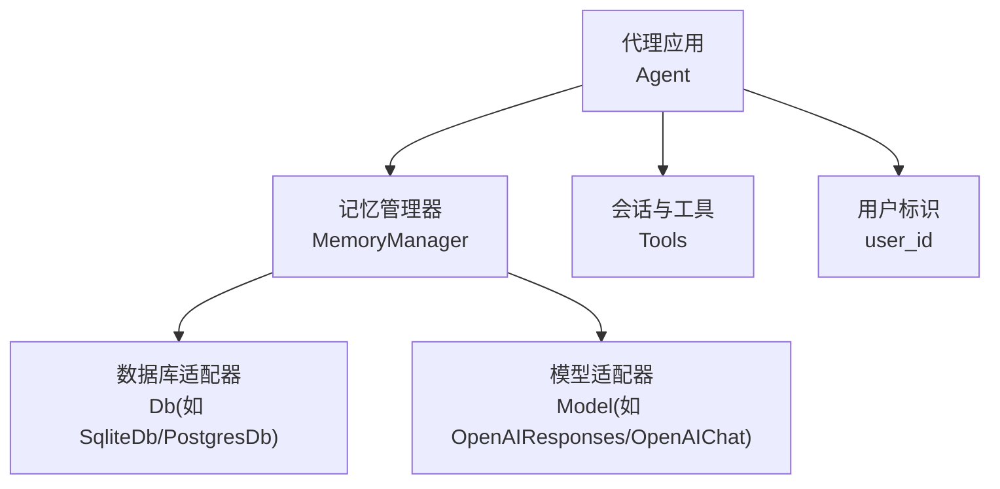
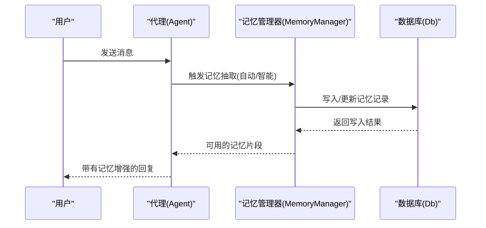
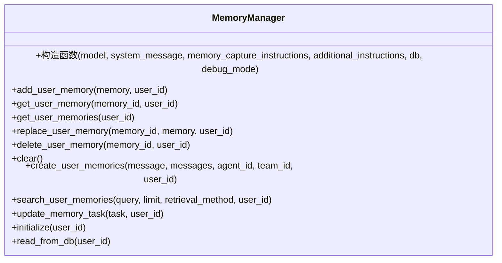
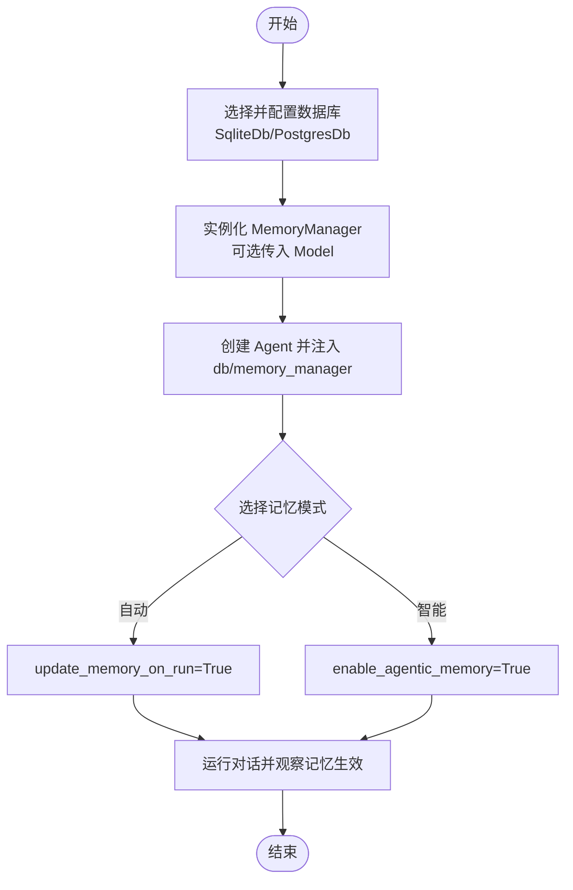
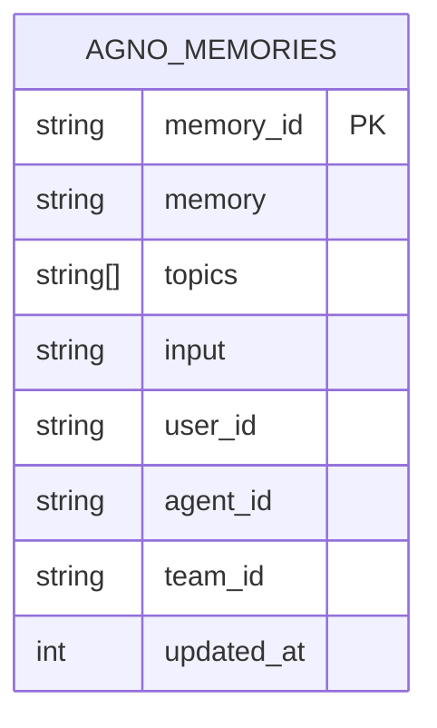
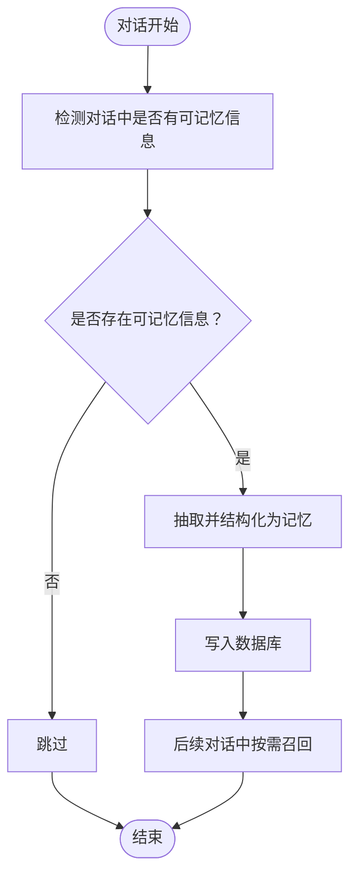
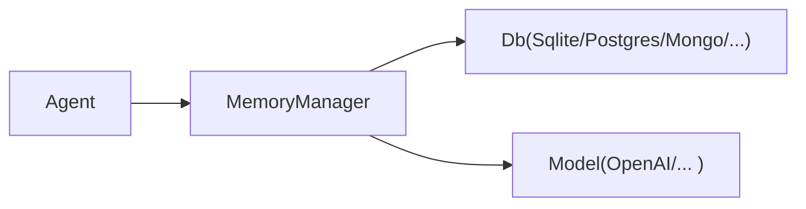

# 用户记忆基础使用

<cite>
**本文引用的文件**
- [memory-manager-reference.mdx](file://_snippets/memory-manager-reference.mdx)
- [memory-overview.mdx](file://memory/overview.mdx)
- [agent-with-memory.mdx](file://agents/usage/agent-with-memory.mdx)
- [memory-manager.mdx](file://examples/agents/memory-and-learning/memory-manager.mdx)
- [memory-creation.mdx](file://memory/working-with-memories/memory-creation.mdx)
- [memory-search.mdx](file://memory/working-with-memories/memory-search.mdx)
- [memory-sqlite-reference.mdx](file://TBD/snippets/memory-sqlite-reference.mdx)
- [memory-postgres-reference.mdx](file://TBD/snippets/memory-postgres-reference.mdx)
</cite>

## 目录
1. [简介](#简介)
2. [项目结构](#项目结构)
3. [核心组件](#核心组件)
4. [架构总览](#架构总览)
5. [详细组件分析](#详细组件分析)
6. [依赖关系分析](#依赖关系分析)
7. [性能考虑](#性能考虑)
8. [故障排查指南](#故障排查指南)
9. [结论](#结论)
10. [附录](#附录)

## 简介
本篇文档面向首次接触“用户记忆存储”的开发者与产品人员，系统讲解如何在代理（Agent）中启用并使用用户记忆功能。内容涵盖：
- 核心概念：什么是用户记忆、与会话历史的区别
- 初始化与基本配置：数据库连接、模型配置、代理启用方式
- 自动提取机制与检索策略：何时提取、如何检索
- 基本数据结构与表结构约定
- 完整示例路径：从最小可用到进阶用法
- 常见使用场景与最佳实践

## 项目结构
围绕“用户记忆存储”，本仓库提供了多层级的参考与示例：
- 概念与总览：memory/overview.mdx
- API 与类参考：_snippets/memory-manager-reference.mdx
- 代理集成示例：agents/usage/agent-with-memory.mdx、examples/agents/memory-and-learning/memory-manager.mdx
- 手动记忆操作：memory/working-with-memories/memory-creation.mdx、memory/working-with-memories/memory-search.mdx
- 数据库参数参考：TBD/snippets/memory-sqlite-reference.mdx、TBD/snippets/memory-postgres-reference.mdx

图示来源
- [memory-manager-reference.mdx:1-58](file://_snippets/memory-manager-reference.mdx#L1-L58)
- [memory-overview.mdx:18-36](file://memory/overview.mdx#L18-L36)
- [agent-with-memory.mdx:20-34](file://agents/usage/agent-with-memory.mdx#L20-L34)

章节来源
- [memory-overview.mdx:18-36](file://memory/overview.mdx#L18-L36)
- [memory-manager-reference.mdx:1-58](file://_snippets/memory-manager-reference.mdx#L1-L58)

## 核心组件
- 记忆管理器（MemoryManager）
  - 职责：创建、检索、更新、删除用户记忆；支持从文本或消息列表生成记忆；支持按 last_n/first_n/agentic 策略检索
  - 关键方法：add_user_memory、get_user_memories、search_user_memories、create_user_memories、replace_user_memory、delete_user_memory、clear、initialize、read_from_db
  - 构造参数：model、system_message、memory_capture_instructions、additional_instructions、db、debug_mode
- 代理（Agent）
  - 启用方式：update_memory_on_run 或 enable_agentic_memory
  - 集成点：通过 db 与 memory_manager 连接数据库与记忆管理器
- 数据库适配器（Db）
  - 支持 SQLite、Postgres、MongoDB 等；默认表名与字段约定见下节
- 模型适配器（Model）
  - 用于记忆的抽取与检索（如 OpenAIResponses/OpenAIChat）

章节来源
- [memory-manager-reference.mdx:1-58](file://_snippets/memory-manager-reference.mdx#L1-L58)
- [memory-overview.mdx:38-92](file://memory/overview.mdx#L38-L92)
- [agent-with-memory.mdx:20-34](file://agents/usage/agent-with-memory.mdx#L20-L34)

## 架构总览
用户记忆在代理中的工作流分为两条主线：
- 自动记忆（update_memory_on_run=True）：每次对话后自动抽取并存储，适合大多数场景
- 智能记忆（enable_agentic_memory=True）：由代理根据上下文决定是否存储/召回，适合复杂交互

图示来源
- [memory-overview.mdx:38-92](file://memory/overview.mdx#L38-L92)
- [memory-manager-reference.mdx:29-58](file://_snippets/memory-manager-reference.mdx#L29-L58)

## 详细组件分析

### 记忆管理器（MemoryManager）
- 责任边界
  - 维护用户级记忆的生命周期：新增、查询、替换、删除、清空
  - 将自然语言输入转化为结构化记忆，并支持基于语义的检索
- 关键接口
  - 用户记忆 CRUD：add_user_memory、get_user_memory、get_user_memories、replace_user_memory、delete_user_memory、clear
  - 记忆创建与检索：create_user_memories、search_user_memories
  - 工具类任务：update_memory_task（异步版本 aupdate_memory_task）
  - 初始化与读取：initialize、read_from_db
- 检索策略
  - last_n：最近 N 条
  - first_n：最早 N 条
  - agentic：基于模型进行语义相似度检索

图示来源
- [memory-manager-reference.mdx:1-58](file://_snippets/memory-manager-reference.mdx#L1-L58)

章节来源
- [memory-manager-reference.mdx:1-58](file://_snippets/memory-manager-reference.mdx#L1-L58)

### 代理与记忆的集成
- 最小可用示例
  - 创建数据库连接（SqliteDb/PostgresDb）
  - 实例化 MemoryManager（可选传入 model）
  - 在 Agent 中注入 db 与 memory_manager，并开启 enable_agentic_memory 或 update_memory_on_run
- 示例路径
  - 基础示例：agents/usage/agent-with-memory.mdx
  - 进阶示例：examples/agents/memory-and-learning/memory-manager.mdx

图示来源
- [agent-with-memory.mdx:20-34](file://agents/usage/agent-with-memory.mdx#L20-L34)
- [memory-manager.mdx:21-34](file://examples/agents/memory-and-learning/memory-manager.mdx#L21-L34)

章节来源
- [agent-with-memory.mdx:20-34](file://agents/usage/agent-with-memory.mdx#L20-L34)
- [memory-manager.mdx:21-34](file://examples/agents/memory-and-learning/memory-manager.mdx#L21-L34)

### 记忆数据模型与默认行为
- 默认表名
  - 默认存储表名为 agno_memories（或文档型数据库对应集合），若不存在会在首次写入时自动创建
- 字段约定（示例）
  - memory_id、memory、topics、input、user_id、agent_id、team_id、updated_at
- 表结构与字段定义
  - SQLite 参数参考：TBD/snippets/memory-sqlite-reference.mdx
  - Postgres 参数参考：TBD/snippets/memory-postgres-reference.mdx

图示来源
- [memory-overview.mdx:148-165](file://memory/overview.mdx#L148-L165)
- [memory-sqlite-reference.mdx:1-8](file://TBD/snippets/memory-sqlite-reference.mdx#L1-L8)
- [memory-postgres-reference.mdx:1-8](file://TBD/snippets/memory-postgres-reference.mdx#L1-L8)

章节来源
- [memory-overview.mdx:148-165](file://memory/overview.mdx#L148-L165)
- [memory-sqlite-reference.mdx:1-8](file://TBD/snippets/memory-sqlite-reference.mdx#L1-L8)
- [memory-postgres-reference.mdx:1-8](file://TBD/snippets/memory-postgres-reference.mdx#L1-L8)

### 自动提取机制与工作流程
- 自动记忆（update_memory_on_run=True）
  - 每次对话结束后自动抽取相关信息并写入数据库
  - 无需手动干预，适合通用对话与客服场景
- 智能记忆（enable_agentic_memory=True）
  - 代理内置工具决定何时创建/更新/删除记忆
  - 更灵活但需要代理具备合适的提示词与工具链

图示来源
- [memory-overview.mdx:38-92](file://memory/overview.mdx#L38-L92)

章节来源
- [memory-overview.mdx:38-92](file://memory/overview.mdx#L38-L92)

### 基本使用示例（路径指引）
- 在代理中启用用户记忆（自动/智能两种模式）
  - 示例路径：agents/usage/agent-with-memory.mdx
  - 示例路径：examples/agents/memory-and-learning/memory-manager.mdx
- 手动创建与检索记忆
  - 创建记忆：memory/working-with-memories/memory-creation.mdx
  - 检索记忆：memory/working-with-memories/memory-search.mdx

章节来源
- [agent-with-memory.mdx:20-34](file://agents/usage/agent-with-memory.mdx#L20-L34)
- [memory-manager.mdx:21-34](file://examples/agents/memory-and-learning/memory-manager.mdx#L21-L34)
- [memory-creation.mdx:9-58](file://memory/working-with-memories/memory-creation.mdx#L9-L58)
- [memory-search.mdx:13-58](file://memory/working-with-memories/memory-search.mdx#L13-L58)

## 依赖关系分析
- 组件耦合
  - Agent 依赖 MemoryManager 与 Db
  - MemoryManager 依赖 Db 与 Model
  - Model 用于记忆抽取与检索
- 外部依赖
  - 数据库驱动：SQLAlchemy 引擎或原生驱动
  - 大模型 SDK：OpenAIResponses/OpenAIChat 等

图示来源
- [memory-manager-reference.mdx:1-58](file://_snippets/memory-manager-reference.mdx#L1-L58)
- [memory-overview.mdx:94-98](file://memory/overview.mdx#L94-L98)

章节来源
- [memory-manager-reference.mdx:1-58](file://_snippets/memory-manager-reference.mdx#L1-L58)
- [memory-overview.mdx:94-98](file://memory/overview.mdx#L94-L98)

## 性能考虑
- 检索策略选择
  - last_n/first_n：O(n) 简单高效，适合快速上下文补充
  - agentic：依赖模型向量/语义相似度，效果更好但延迟更高
- 存储规模
  - 控制单条记忆长度与 topics 数量，避免冗余字段
  - 对高频检索场景建议对 user_id/updated_at 建立索引
- 模型成本
  - agentic 检索会触发额外模型调用，建议在必要时启用

## 故障排查指南
- 无法找到记忆
  - 确认是否正确传入 user_id
  - 确认数据库表是否存在且名称符合预期
- 记忆未被自动捕获
  - 若启用 enable_agentic_memory，则 update_memory_on_run 会被忽略
  - 检查模型配置与 memory_capture_instructions 是否合理
- 数据库连接问题
  - 检查 db_url/db_file/db_engine 参数
  - 确认数据库服务可达与权限正确

章节来源
- [memory-overview.mdx:90-92](file://memory/overview.mdx#L90-L92)
- [memory-sqlite-reference.mdx:1-8](file://TBD/snippets/memory-sqlite-reference.mdx#L1-L8)
- [memory-postgres-reference.mdx:1-8](file://TBD/snippets/memory-postgres-reference.mdx#L1-L8)

## 结论
用户记忆存储为代理提供了跨会话的个性化能力。通过合理的数据库与模型配置、明确的记忆模式选择以及规范的数据结构，可以在不增加过多开发负担的前提下，显著提升用户体验。建议优先采用自动记忆模式，复杂场景再引入智能记忆模式。

## 附录

### 常见使用场景与最佳实践
- 场景
  - 客户支持：记住用户偏好与历史问题，提高响应质量
  - 个人助理：记住日程、偏好与习惯，提供主动提醒
  - 教育/培训：记录学习进度与偏好，定制学习路径
- 最佳实践
  - 明确 user_id 的分配策略（如邮箱/工号/匿名标识符）
  - 使用 topics 字段辅助检索与过滤
  - 对敏感信息进行脱敏处理后再入库
  - 定期清理长期无用记忆，控制存储成本

### 快速上手清单
- 选择数据库并完成连接
- 实例化 MemoryManager（可选传入模型）
- 在 Agent 中注入 db 与 memory_manager
- 选择记忆模式：update_memory_on_run 或 enable_agentic_memory
- 编写首次对话，验证记忆是否被创建与召回

章节来源
- [memory-overview.mdx:18-36](file://memory/overview.mdx#L18-L36)
- [memory-manager-reference.mdx:1-58](file://_snippets/memory-manager-reference.mdx#L1-L58)