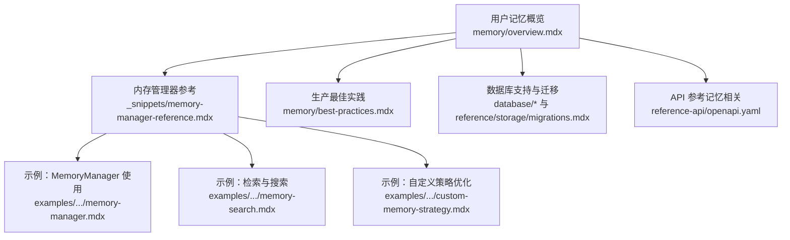
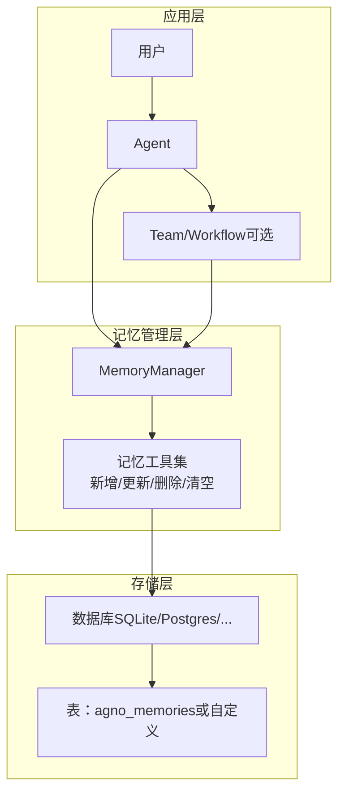
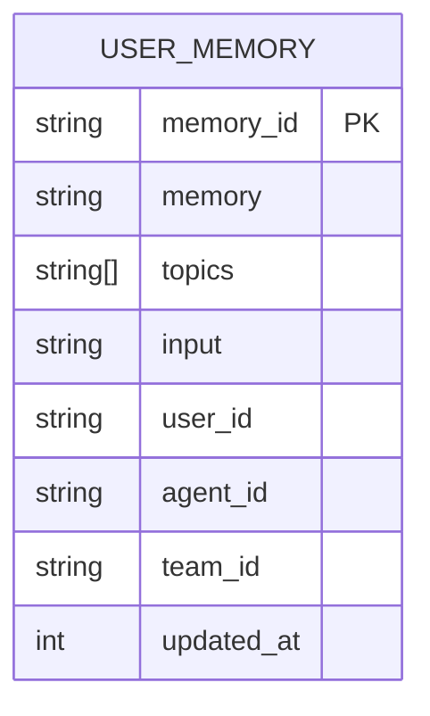
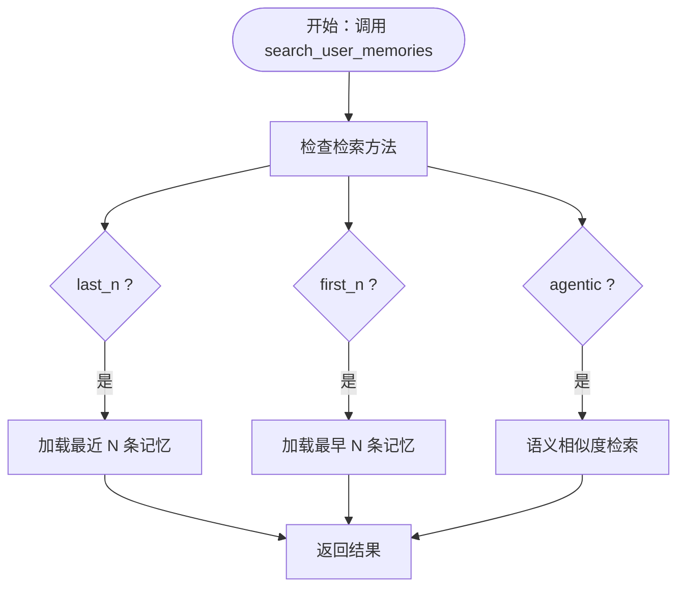
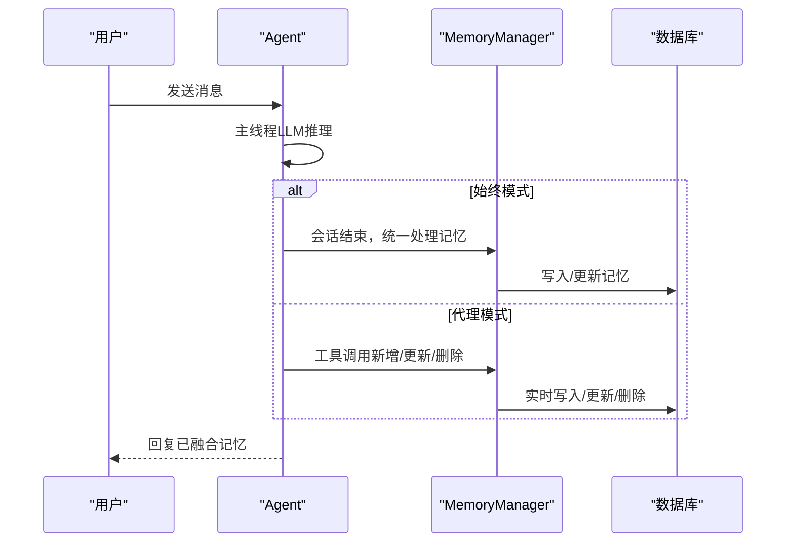
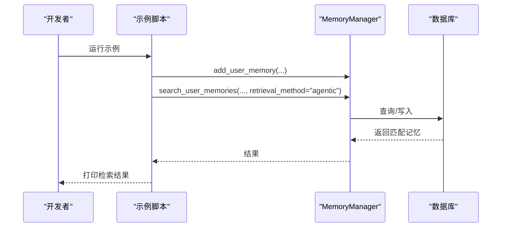
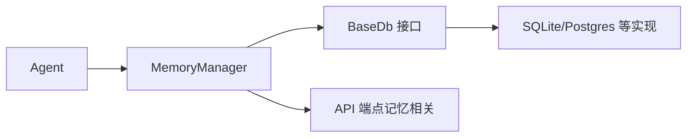

# 用户记忆存储

<cite>
**本文引用的文件**   
- [memory/overview.mdx](file://memory/overview.mdx)
- [memory/best-practices.mdx](file://memory/best-practices.mdx)
- [examples/agents/memory-and-learning/memory-manager.mdx](file://examples/agents/memory-and-learning/memory-manager.mdx)
- [examples/memory/memory-manager/memory-search.mdx](file://examples/memory/memory-manager/memory-search.mdx)
- [examples/integrations/surrealdb/memory-search-surreal.mdx](file://examples/integrations/surrealdb/memory-search-surreal.mdx)
- [_snippets/memory-manager-reference.mdx](file://_snippets/memory-manager-reference.mdx)
- [database/overview.mdx](file://database/overview.mdx)
- [database/sqlite.mdx](file://database/sqlite.mdx)
- [database/postgres.mdx](file://database/postgres.mdx)
- [reference/storage/migrations.mdx](file://reference/storage/migrations.mdx)
- [reference-api/openapi.yaml](file://reference-api/openapi.yaml)
- [examples/memory/optimize-memories/custom-memory-strategy.mdx](file://examples/memory/optimize-memories/custom-memory-strategy.mdx)
</cite>

## 目录
1. [简介](#简介)
2. [项目结构](#项目结构)
3. [核心组件](#核心组件)
4. [架构总览](#架构总览)
5. [详细组件分析](#详细组件分析)
6. [依赖关系分析](#依赖关系分析)
7. [性能考量](#性能考量)
8. [故障排查指南](#故障排查指南)
9. [结论](#结论)
10. [附录](#附录)

## 简介
本技术文档聚焦于“用户记忆存储”的设计理念与实现原理，系统阐述非结构化观察与事实的存储机制，覆盖三种工作模式：代理模式（agentic mode）、始终模式（always）、智能模式（agentic），并完整文档化数据结构、存储格式、检索机制、生命周期管理（创建、更新、查询、清理），以及最佳实践、性能优化、策略实现与扩展方法，同时纳入数据隐私与安全要点。

## 项目结构
围绕用户记忆存储的关键内容分布在以下区域：
- 概览与使用方式：memory/overview.mdx
- 生产最佳实践与成本控制：memory/best-practices.mdx
- 内存管理器接口与检索方法：_snippets/memory-manager-reference.mdx
- 示例：MemoryManager 使用、检索与策略优化
  - examples/agents/memory-and-learning/memory-manager.mdx
  - examples/memory/memory-manager/memory-search.mdx
  - examples/integrations/surrealdb/memory-search-surreal.mdx
  - examples/memory/optimize-memories/custom-memory-strategy.mdx
- 数据库支持与迁移：database/overview.mdx、database/sqlite.mdx、database/postgres.mdx、reference/storage/migrations.mdx
- API 参考：reference-api/openapi.yaml（含记忆相关端点）

**图表来源**
- [memory/overview.mdx:1-202](file://memory/overview.mdx#L1-L202)
- [_snippets/memory-manager-reference.mdx:1-57](file://_snippets/memory-manager-reference.mdx#L1-L57)
- [memory/best-practices.mdx:1-202](file://memory/best-practices.mdx#L1-L202)
- [database/overview.mdx:1-130](file://database/overview.mdx#L1-L130)
- [reference-api/openapi.yaml:3694-3740](file://reference-api/openapi.yaml#L3694-L3740)

**章节来源**
- [memory/overview.mdx:1-202](file://memory/overview.mdx#L1-L202)
- [database/overview.mdx:1-130](file://database/overview.mdx#L1-L130)

## 核心组件
- 用户记忆数据模型
  - 字段：memory_id、memory、topics、input、user_id、agent_id、team_id、updated_at
  - 默认表名：agno_memories；可自定义
- 内存管理器（MemoryManager）
  - 职责：创建、读取、更新、删除、清空；检索（last_n、first_n、agentic）
  - 关键方法：get_user_memories、get_user_memory、add_user_memory、replace_user_memory、delete_user_memory、clear、search_user_memories
- Agent 集成
  - 自动记忆（update_memory_on_run=True）：会话结束后统一处理记忆
  - 代理记忆（enable_agentic_memory=True）：对话中由工具驱动实时管理
  - 二者互斥，代理模式优先级更高
- 数据库与迁移
  - 支持 SQLite、PostgreSQL 等；默认自动建表；可迁移至不同表类型（memory、session、metrics、eval、knowledge、culture）

**章节来源**
- [memory/overview.mdx:148-166](file://memory/overview.mdx#L148-L166)
- [_snippets/memory-manager-reference.mdx:1-57](file://_snippets/memory-manager-reference.mdx#L1-L57)
- [memory/overview.mdx:94-125](file://memory/overview.mdx#L94-L125)
- [reference/storage/migrations.mdx:145-170](file://reference/storage/migrations.mdx#L145-L170)

## 架构总览
用户记忆在系统中的位置与交互如下：

**图表来源**
- [memory/overview.mdx:38-93](file://memory/overview.mdx#L38-L93)
- [_snippets/memory-manager-reference.mdx:16-57](file://_snippets/memory-manager-reference.mdx#L16-L57)
- [database/overview.mdx:105-108](file://database/overview.mdx#L105-L108)

## 详细组件分析

### 组件一：用户记忆数据模型与存储格式
- 字段设计
  - memory_id：唯一标识
  - memory：字符串形式的事实/观察
  - topics：主题列表，便于过滤与检索
  - input：触发该记忆的输入文本
  - user_id/agent_id/team_id：归属维度
  - updated_at：时间戳，用于排序与清理
- 存储位置
  - 默认表名：agno_memories
  - 支持自定义表名（通过数据库参数）
  - 首次写入时自动建表
- 表类型迁移
  - 支持 memory、session、metrics、eval、knowledge、culture 等

**图表来源**
- [memory/overview.mdx:148-166](file://memory/overview.mdx#L148-L166)
- [reference/storage/migrations.mdx:154-166](file://reference/storage/migrations.mdx#L154-L166)

**章节来源**
- [memory/overview.mdx:148-166](file://memory/overview.mdx#L148-L166)
- [reference/storage/migrations.mdx:145-170](file://reference/storage/migrations.mdx#L145-L170)

### 组件二：MemoryManager 类与检索机制
- 方法族
  - 用户记忆 CRUD：get_user_memories、get_user_memory、add_user_memory、replace_user_memory、delete_user_memory、clear
  - 初始化与读取：initialize、read_from_db
  - 检索策略：search_user_memories 支持 last_n、first_n、agentic
- 检索流程示意

**图表来源**
- [_snippets/memory-manager-reference.mdx:51-57](file://_snippets/memory-manager-reference.mdx#L51-L57)

**章节来源**
- [_snippets/memory-manager-reference.mdx:16-57](file://_snippets/memory-manager-reference.mdx#L16-L57)

### 组件三：Agent 集成与三种工作模式
- 模式对比
  - 始终模式（always）：update_memory_on_run=True，会话结束后统一提取与更新记忆
  - 代理模式（agentic）：enable_agentic_memory=True，Agent 在对话中使用工具实时管理记忆
  - 智能模式（agentic）：与代理模式同义，强调基于上下文的智能决策
- 互斥规则
  - 同时启用两者时，代理模式优先，自动模式被忽略

**图表来源**
- [memory/overview.mdx:38-93](file://memory/overview.mdx#L38-L93)
- [memory/best-practices.mdx:21-52](file://memory/best-practices.mdx#L21-L52)

**章节来源**
- [memory/overview.mdx:38-93](file://memory/overview.mdx#L38-L93)
- [memory/best-practices.mdx:21-52](file://memory/best-practices.mdx#L21-L52)

### 组件四：示例与实践
- MemoryManager 使用示例
  - 展示如何启用代理记忆与 MemoryManager，实现跨会话持久化
- 检索示例
  - last_n、first_n、agentic 三种检索方法的实际调用
- 策略优化示例
  - 自定义优化策略（如按更新时间排序并限制数量）

**图表来源**
- [examples/agents/memory-and-learning/memory-manager.mdx:13-53](file://examples/agents/memory-and-learning/memory-manager.mdx#L13-L53)
- [examples/memory/memory-manager/memory-search.mdx:30-80](file://examples/memory/memory-manager/memory-search.mdx#L30-L80)
- [examples/integrations/surrealdb/memory-search-surreal.mdx:34-88](file://examples/integrations/surrealdb/memory-search-surreal.mdx#L34-L88)
- [examples/memory/optimize-memories/custom-memory-strategy.mdx:47-80](file://examples/memory/optimize-memories/custom-memory-strategy.mdx#L47-L80)

**章节来源**
- [examples/agents/memory-and-learning/memory-manager.mdx:13-53](file://examples/agents/memory-and-learning/memory-manager.mdx#L13-L53)
- [examples/memory/memory-manager/memory-search.mdx:1-83](file://examples/memory/memory-manager/memory-search.mdx#L1-L83)
- [examples/integrations/surrealdb/memory-search-surreal.mdx:1-88](file://examples/integrations/surrealdb/memory-search-surreal.mdx#L1-L88)
- [examples/memory/optimize-memories/custom-memory-strategy.mdx:47-80](file://examples/memory/optimize-memories/custom-memory-strategy.mdx#L47-L80)

## 依赖关系分析
- 组件耦合
  - Agent 依赖 MemoryManager 以执行记忆工具
  - MemoryManager 依赖数据库抽象（BaseDb）进行持久化
  - 数据库支持多厂商（SQLite、Postgres 等），通过统一接口接入
- 外部依赖与集成点
  - 数据库迁移管理器支持多种表类型
  - API 文档暴露记忆查询等端点，便于外部系统集成

**图表来源**
- [_snippets/memory-manager-reference.mdx:16-27](file://_snippets/memory-manager-reference.mdx#L16-L27)
- [database/overview.mdx:105-108](file://database/overview.mdx#L105-L108)
- [reference/storage/migrations.mdx:145-170](file://reference/storage/migrations.mdx#L145-L170)
- [reference-api/openapi.yaml:3694-3740](file://reference-api/openapi.yaml#L3694-L3740)

**章节来源**
- [_snippets/memory-manager-reference.mdx:16-27](file://_snippets/memory-manager-reference.mdx#L16-L27)
- [database/overview.mdx:105-108](file://database/overview.mdx#L105-L108)
- [reference/storage/migrations.mdx:145-170](file://reference/storage/migrations.mdx#L145-L170)
- [reference-api/openapi.yaml:3694-3740](file://reference-api/openapi.yaml#L3694-L3740)

## 性能考量
- 成本与令牌消耗
  - 代理模式每次记忆操作都会触发嵌套 LLM 调用，并加载全部现有记忆，随着记忆增长成本呈指数上升
- 缓解策略
  - 优先采用自动模式（update_memory_on_run=True）
  - 对于必须的代理模式，使用廉价模型执行记忆操作，保留高性能模型用于对话
  - 通过指令约束减少不必要更新
  - 定期修剪（pruning）过期或低价值记忆
  - 设置工具调用上限，防止滥用
- 监控与预警
  - 定期统计用户记忆数量，超过阈值及时告警并清理

**章节来源**
- [memory/best-practices.mdx:21-52](file://memory/best-practices.mdx#L21-L52)
- [memory/best-practices.mdx:54-95](file://memory/best-practices.mdx#L54-L95)
- [memory/best-practices.mdx:112-143](file://memory/best-practices.mdx#L112-L143)
- [memory/best-practices.mdx:180-196](file://memory/best-practices.mdx#L180-L196)

## 故障排查指南
- 常见陷阱
  - 同时启用自动与代理模式：代理模式覆盖自动模式
  - 忘记设置 user_id：所有用户记忆混用，导致隐私与行为异常
- 排查步骤
  - 明确当前模式（自动/代理），确认是否符合预期
  - 校验 user_id 是否正确传入
  - 检查内存数量与增长趋势，必要时执行修剪
  - 评估模型成本与令牌用量，调整模型或策略
- 相关端点
  - 通过 API 获取指定记忆详情，辅助定位问题

**章节来源**
- [memory/overview.mdx:90-93](file://memory/overview.mdx#L90-L93)
- [memory/best-practices.mdx:144-178](file://memory/best-practices.mdx#L144-L178)
- [reference-api/openapi.yaml:3694-3740](file://reference-api/openapi.yaml#L3694-L3740)

## 结论
用户记忆存储通过明确的数据模型、灵活的检索策略与两种工作模式，实现了对非结构化观察与事实的高效管理。在生产环境中，应优先采用自动模式以降低成本与复杂度；仅在需要实时记忆决策时启用代理模式，并辅以廉价模型、指令约束、定期修剪与限额控制。借助统一的数据库抽象与迁移能力，可在 SQLite 开发与 Postgres 生产之间平滑演进。

## 附录
- 数据库与存储
  - SQLite：本地开发与测试
  - PostgreSQL：生产环境推荐
  - 其他支持：参见数据库概览与迁移指南
- API 参考
  - 记忆相关端点：按路径参数获取记忆详情，支持用户与数据库筛选
- 示例清单
  - MemoryManager 使用与跨会话持久化
  - 检索方法（last_n、first_n、agentic）
  - 自定义策略优化（按时间排序与数量限制）

**章节来源**
- [database/sqlite.mdx:1-29](file://database/sqlite.mdx#L1-L29)
- [database/postgres.mdx:1-47](file://database/postgres.mdx#L1-L47)
- [reference-api/openapi.yaml:3694-3740](file://reference-api/openapi.yaml#L3694-L3740)
- [examples/agents/memory-and-learning/memory-manager.mdx:13-53](file://examples/agents/memory-and-learning/memory-manager.mdx#L13-L53)
- [examples/memory/memory-manager/memory-search.mdx:1-83](file://examples/memory/memory-manager/memory-search.mdx#L1-L83)
- [examples/memory/optimize-memories/custom-memory-strategy.mdx:47-80](file://examples/memory/optimize-memories/custom-memory-strategy.mdx#L47-L80)