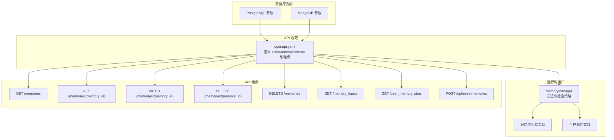
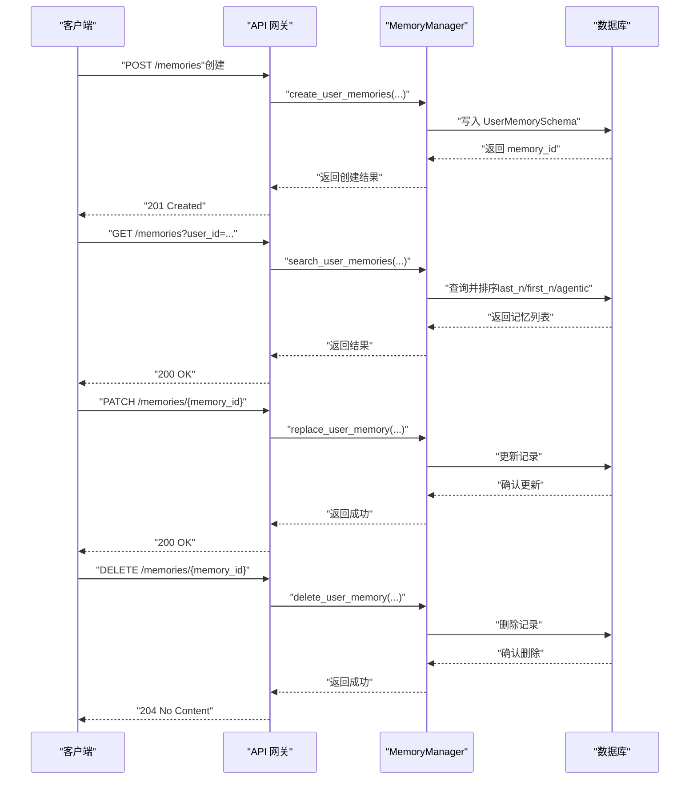
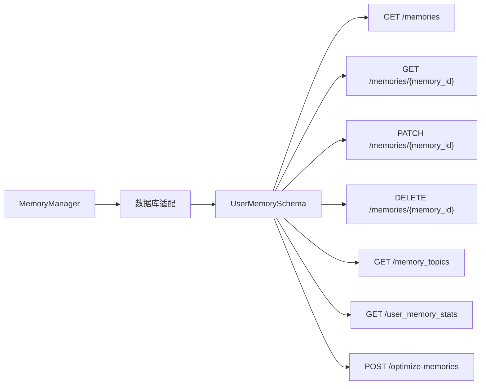

# 用户记忆数据模型

<cite>
**本文引用的文件**
- [reference-api/openapi.yaml](file://reference-api/openapi.yaml)
- [_snippets/memory-manager-reference.mdx](file://_snippets/memory-manager-reference.mdx)
- [memory/working-with-memories/overview.mdx](file://memory/working-with-memories/overview.mdx)
- [TBD/snippets/memory-mongo-reference.mdx](file://TBD/snippets/memory-mongo-reference.mdx)
- [TBD/snippets/memory-postgres-reference.mdx](file://TBD/snippets/memory-postgres-reference.mdx)
- [memory/best-practices.mdx](file://memory/best-practices.mdx)
- [reference-api/schema/memory/get-user-memory-statistics.mdx](file://reference-api/schema/memory/get-user-memory-statistics.mdx)
- [reference-api/schema/memory/optimize-user-memories.mdx](file://reference-api/schema/memory/optimize-user-memories.mdx)
- [reference-api/schema/memory/update-memory.mdx](file://reference-api/schema/memory/update-memory.mdx)
- [reference-api/schema/memory/list-memories.mdx](file://reference-api/schema/memory/list-memories.mdx)
- [reference-api/schema/memory/get-memory-by-id.mdx](file://reference-api/schema/memory/get-memory-by-id.mdx)
- [reference-api/schema/memory/get-memory-topics.mdx](file://reference-api/schema/memory/get-memory-topics.mdx)
- [reference-api/schema/memory/delete-memory.mdx](file://reference-api/schema/memory/delete-memory.mdx)
- [reference-api/schema/memory/delete-multiple-memories.mdx](file://reference-api/schema/memory/delete-multiple-memories.mdx)
</cite>

## 目录
1. [简介](#简介)
2. [项目结构](#项目结构)
3. [核心组件](#核心组件)
4. [架构总览](#架构总览)
5. [详细组件分析](#详细组件分析)
6. [依赖关系分析](#依赖关系分析)
7. [性能考量](#性能考量)
8. [故障排查指南](#故障排查指南)
9. [结论](#结论)
10. [附录](#附录)

## 简介
本技术文档围绕“用户记忆”数据模型进行系统化说明，覆盖数据结构与字段定义、内部记忆条目结构、验证规则与约束、数据访问与操作 API、扩展性与自定义选项，以及数据迁移与版本管理的注意事项。目标是帮助开发者在多数据库后端（如 SQLite、PostgreSQL、MongoDB 等）中一致地设计、存储、检索与维护用户记忆。

## 项目结构
与用户记忆数据模型直接相关的知识分布在以下位置：
- 数据模型与 API 规范：reference-api/openapi.yaml
- 记忆管理器方法与检索策略：_snippets/memory-manager-reference.mdx
- 记忆优化与最佳实践：memory/working-with-memories/overview.mdx、memory/best-practices.mdx
- 数据库适配参数：TBD/snippets/memory-mongo-reference.mdx、TBD/snippets/memory-postgres-reference.mdx
- API 端点清单：reference-api/schema/memory/*.mdx

图表来源
- [reference-api/openapi.yaml:13356-13403](file://reference-api/openapi.yaml#L13356-L13403)
- [_snippets/memory-manager-reference.mdx:16-58](file://_snippets/memory-manager-reference.mdx#L16-L58)
- [reference-api/schema/memory/list-memories.mdx:1-3](file://reference-api/schema/memory/list-memories.mdx#L1-L3)
- [reference-api/schema/memory/get-memory-by-id.mdx:1-3](file://reference-api/schema/memory/get-memory-by-id.mdx#L1-L3)
- [reference-api/schema/memory/update-memory.mdx:1-3](file://reference-api/schema/memory/update-memory.mdx#L1-L3)
- [reference-api/schema/memory/delete-memory.mdx:1-3](file://reference-api/schema/memory/delete-memory.mdx#L1-L3)
- [reference-api/schema/memory/delete-multiple-memories.mdx:1-3](file://reference-api/schema/memory/delete-multiple-memories.mdx#L1-L3)
- [reference-api/schema/memory/get-memory-topics.mdx:1-3](file://reference-api/schema/memory/get-memory-topics.mdx#L1-L3)
- [reference-api/schema/memory/get-user-memory-statistics.mdx:1-3](file://reference-api/schema/memory/get-user-memory-statistics.mdx#L1-L3)
- [reference-api/schema/memory/optimize-user-memories.mdx:1-3](file://reference-api/schema/memory/optimize-user-memories.mdx#L1-L3)

章节来源
- [reference-api/openapi.yaml:13356-13403](file://reference-api/openapi.yaml#L13356-L13403)
- [_snippets/memory-manager-reference.mdx:16-58](file://_snippets/memory-manager-reference.mdx#L16-L58)

## 核心组件
- 用户记忆数据模型（UserMemorySchema）
  - 字段定义与类型约束来自 OpenAPI 规范，确保跨语言/客户端的一致性
  - 关键字段：memory_id、memory、topics、agent_id、team_id、user_id、updated_at
  - 必填字段：memory_id、memory
- 记忆管理器（MemoryManager）
  - 提供增删改查、检索、任务驱动更新、初始化与从数据库读取等能力
  - 支持检索策略：last_n、first_n、agentic
- API 端点
  - 列表查询、按 ID 获取、更新、删除、批量删除、主题聚合、用户统计、优化

章节来源
- [reference-api/openapi.yaml:13356-13403](file://reference-api/openapi.yaml#L13356-L13403)
- [_snippets/memory-manager-reference.mdx:16-58](file://_snippets/memory-manager-reference.mdx#L16-L58)

## 架构总览
用户记忆在系统中的流转路径如下：
- 应用层通过 MemoryManager 创建/更新/删除记忆，并支持检索
- API 层暴露标准端点以供外部调用
- 存储层可选多种数据库后端（SQLite、PostgreSQL、MongoDB 等），通过统一的表/集合结构承载 UserMemorySchema

图表来源
- [reference-api/openapi.yaml:13356-13403](file://reference-api/openapi.yaml#L13356-L13403)
- [_snippets/memory-manager-reference.mdx:16-58](file://_snippets/memory-manager-reference.mdx#L16-L58)
- [reference-api/schema/memory/list-memories.mdx:1-3](file://reference-api/schema/memory/list-memories.mdx#L1-L3)
- [reference-api/schema/memory/get-memory-by-id.mdx:1-3](file://reference-api/schema/memory/get-memory-by-id.mdx#L1-L3)
- [reference-api/schema/memory/update-memory.mdx:1-3](file://reference-api/schema/memory/update-memory.mdx#L1-L3)
- [reference-api/schema/memory/delete-memory.mdx:1-3](file://reference-api/schema/memory/delete-memory.mdx#L1-L3)

## 详细组件分析

### 数据模型与字段定义
- 模型名称：UserMemorySchema
- 必填字段
  - memory_id：字符串，唯一标识一条记忆
  - memory：字符串，记忆内容文本
- 可选字段
  - topics：字符串数组或 null，用于对记忆进行分类/打标
  - agent_id：字符串或 null，关联执行记忆操作的智能体
  - team_id：字符串或 null，关联团队
  - user_id：字符串或 null，记忆所属用户
  - updated_at：日期时间字符串或 null，最后更新时间戳
- 验证规则与约束
  - 必填校验：memory_id、memory
  - 类型校验：updated_at 符合 date-time 格式
  - 可空性：topics、agent_id、team_id、user_id、updated_at 允许为空

章节来源
- [reference-api/openapi.yaml:13356-13403](file://reference-api/openapi.yaml#L13356-L13403)

### 内部记忆条目结构
- 记忆条目由上述字段组成，其中 topics 可作为关键词或标签使用；agent_id、team_id、user_id 用于多实体关联与权限/隔离控制；updated_at 用于排序、统计与过期清理。

章节来源
- [reference-api/openapi.yaml:13356-13403](file://reference-api/openapi.yaml#L13356-L13403)

### 数据访问与操作 API
- 列表查询
  - 方法与路径：GET /memories
  - 用途：按用户或其他维度列出记忆
- 按 ID 获取
  - 方法与路径：GET /memories/{memory_id}
  - 用途：获取单条记忆详情
- 更新记忆
  - 方法与路径：PATCH /memories/{memory_id}
  - 用途：替换或更新某条记忆
- 删除记忆
  - 方法与路径：DELETE /memories/{memory_id}
  - 用途：删除单条记忆
- 批量删除
  - 方法与路径：DELETE /memories
  - 用途：按条件批量删除
- 主题聚合
  - 方法与路径：GET /memory_topics
  - 用途：获取所有记忆的主题分布
- 用户统计
  - 方法与路径：GET /user_memory_stats
  - 用途：获取用户的记忆总数与最近更新时间
- 优化记忆
  - 方法与路径：POST /optimize-memories
  - 用途：对用户记忆进行合并/摘要等优化

章节来源
- [reference-api/schema/memory/list-memories.mdx:1-3](file://reference-api/schema/memory/list-memories.mdx#L1-L3)
- [reference-api/schema/memory/get-memory-by-id.mdx:1-3](file://reference-api/schema/memory/get-memory-by-id.mdx#L1-L3)
- [reference-api/schema/memory/update-memory.mdx:1-3](file://reference-api/schema/memory/update-memory.mdx#L1-L3)
- [reference-api/schema/memory/delete-memory.mdx:1-3](file://reference-api/schema/memory/delete-memory.mdx#L1-L3)
- [reference-api/schema/memory/delete-multiple-memories.mdx:1-3](file://reference-api/schema/memory/delete-multiple-memories.mdx#L1-L3)
- [reference-api/schema/memory/get-memory-topics.mdx:1-3](file://reference-api/schema/memory/get-memory-topics.mdx#L1-L3)
- [reference-api/schema/memory/get-user-memory-statistics.mdx:1-3](file://reference-api/schema/memory/get-user-memory-statistics.mdx#L1-L3)
- [reference-api/schema/memory/optimize-user-memories.mdx:1-3](file://reference-api/schema/memory/optimize-user-memories.mdx#L1-L3)

### 记忆管理器与检索策略
- 核心方法
  - get_user_memories、get_user_memory、add_user_memory、replace_user_memory、delete_user_memory、clear
  - create_user_memories、acreate_user_memories、search_user_memories、update_memory_task、aupdate_memory_task
  - initialize、read_from_db
- 检索策略
  - last_n：返回最近 N 条记忆
  - first_n：返回最早 N 条记忆
  - agentic：基于语义相似度的 AI 检索

章节来源
- [_snippets/memory-manager-reference.mdx:16-58](file://_snippets/memory-manager-reference.mdx#L16-L58)

### 记忆优化与工具
- 优化场景：用户记忆数量较多、高成本操作前、长期应用定期维护
- 优化方式：通过 MemoryManager 的优化策略（如 SUMMARIZE）将多条记忆合并为更精炼的记忆，同时保留关键信息
- 工具模式：使用 MemoryTools 显式控制记忆的创建、检索、更新与删除，便于推理与决策

章节来源
- [memory/working-with-memories/overview.mdx:67-88](file://memory/working-with-memories/overview.mdx#L67-L88)
- [memory/working-with-memories/overview.mdx:90-134](file://memory/working-with-memories/overview.mdx#L90-L134)

### 数据库适配与参数
- PostgreSQL
  - 表名 table_name（必填）、schema（默认 "ai"）、连接 URL 或 Engine
- MongoDB
  - 集合名 collection_name（默认 "memory"）、数据库名 db_name（默认 "agno"）、连接 URL 或客户端

章节来源
- [TBD/snippets/memory-postgres-reference.mdx:1-8](file://TBD/snippets/memory-postgres-reference.mdx#L1-L8)
- [TBD/snippets/memory-mongo-reference.mdx:1-8](file://TBD/snippets/memory-mongo-reference.mdx#L1-L8)

### 验证规则与约束
- 必填字段：memory_id、memory
- 类型约束：updated_at 为 date-time
- 可空性：topics、agent_id、team_id、user_id、updated_at 可为空
- API 错误响应结构：包含 detail、error_code 等字段，便于前端/客户端处理

章节来源
- [reference-api/openapi.yaml:13356-13403](file://reference-api/openapi.yaml#L13356-L13403)
- [reference-api/openapi.yaml:13468-13489](file://reference-api/openapi.yaml#L13468-L13489)

## 依赖关系分析
- 模型依赖
  - UserMemorySchema 被多个 API 端点复用（创建、查询、更新、删除、统计、优化）
- 运行时依赖
  - MemoryManager 依赖数据库适配（SQLite/PostgreSQL/MongoDB），并通过统一的表/集合结构承载 UserMemorySchema
- 检索策略依赖
  - agentic 检索依赖向量化/嵌入能力与向量数据库（具体实现由后端提供）

图表来源
- [reference-api/openapi.yaml:13356-13403](file://reference-api/openapi.yaml#L13356-L13403)
- [_snippets/memory-manager-reference.mdx:16-58](file://_snippets/memory-manager-reference.mdx#L16-L58)

章节来源
- [reference-api/openapi.yaml:13356-13403](file://reference-api/openapi.yaml#L13356-L13403)
- [_snippets/memory-manager-reference.mdx:16-58](file://_snippets/memory-manager-reference.mdx#L16-L58)

## 性能考量
- 记忆增长与上下文开销
  - 随着记忆数量增加，每次请求将上下文拼接的成本上升，需定期优化与清理
- 优化策略
  - 使用优化端点或 MemoryManager 的优化方法，降低 token 消耗
- 清理策略
  - 基于 updated_at 的过期清理（例如超过一定天数未更新的记忆）
- 最佳实践
  - 在多用户场景显式传入 user_id，避免不同用户记忆混杂
  - 控制工具调用次数，防止过度触发记忆操作
  - 监控记忆数量，设置阈值告警并自动清理

章节来源
- [memory/best-practices.mdx:112-130](file://memory/best-practices.mdx#L112-L130)
- [memory/best-practices.mdx:132-142](file://memory/best-practices.mdx#L132-L142)
- [memory/best-practices.mdx:180-196](file://memory/best-practices.mdx#L180-L196)

## 故障排查指南
- 常见问题
  - 忘记传入 user_id 导致记忆被写入默认用户空间
  - 同时启用自动与代理模式导致行为不符合预期
- 排查步骤
  - 确认必填字段是否完整（memory_id、memory）
  - 检查 updated_at 是否为合法的日期时间格式
  - 使用 /user_memory_stats 与 /memory_topics 核对统计与主题分布
  - 对异常增长的记忆进行清理与重试
- 相关端点
  - GET /user_memory_stats、GET /memory_topics、DELETE /memories、POST /optimize-memories

章节来源
- [memory/best-practices.mdx:144-178](file://memory/best-practices.mdx#L144-L178)
- [reference-api/schema/memory/get-user-memory-statistics.mdx:1-3](file://reference-api/schema/memory/get-user-memory-statistics.mdx#L1-L3)
- [reference-api/schema/memory/get-memory-topics.mdx:1-3](file://reference-api/schema/memory/get-memory-topics.mdx#L1-L3)
- [reference-api/schema/memory/delete-multiple-memories.mdx:1-3](file://reference-api/schema/memory/delete-multiple-memories.mdx#L1-L3)
- [reference-api/schema/memory/optimize-user-memories.mdx:1-3](file://reference-api/schema/memory/optimize-user-memories.mdx#L1-L3)

## 结论
用户记忆数据模型以 UserMemorySchema 为核心，配合 MemoryManager 与标准化 API 端点，实现了跨数据库后端的一致性与可扩展性。通过明确的字段定义、严格的验证规则、多样化的检索策略与优化工具，系统能够在保证隐私与性能的前提下，支撑多智能体、多用户场景下的长期记忆管理。

## 附录

### 字段定义与用途速查
- memory_id：记忆唯一标识
- memory：记忆内容文本
- topics：记忆主题/标签（可空）
- agent_id：执行记忆操作的智能体标识（可空）
- team_id：团队标识（可空）
- user_id：用户标识（可空）
- updated_at：最后更新时间（可空）

章节来源
- [reference-api/openapi.yaml:13356-13403](file://reference-api/openapi.yaml#L13356-L13403)

### API 端点一览
- GET /memories：列出记忆
- GET /memories/{memory_id}：按 ID 获取记忆
- PATCH /memories/{memory_id}：更新记忆
- DELETE /memories/{memory_id}：删除记忆
- DELETE /memories：批量删除记忆
- GET /memory_topics：获取主题聚合
- GET /user_memory_stats：获取用户统计
- POST /optimize-memories：优化用户记忆

章节来源
- [reference-api/schema/memory/list-memories.mdx:1-3](file://reference-api/schema/memory/list-memories.mdx#L1-L3)
- [reference-api/schema/memory/get-memory-by-id.mdx:1-3](file://reference-api/schema/memory/get-memory-by-id.mdx#L1-L3)
- [reference-api/schema/memory/update-memory.mdx:1-3](file://reference-api/schema/memory/update-memory.mdx#L1-L3)
- [reference-api/schema/memory/delete-memory.mdx:1-3](file://reference-api/schema/memory/delete-memory.mdx#L1-L3)
- [reference-api/schema/memory/delete-multiple-memories.mdx:1-3](file://reference-api/schema/memory/delete-multiple-memories.mdx#L1-L3)
- [reference-api/schema/memory/get-memory-topics.mdx:1-3](file://reference-api/schema/memory/get-memory-topics.mdx#L1-L3)
- [reference-api/schema/memory/get-user-memory-statistics.mdx:1-3](file://reference-api/schema/memory/get-user-memory-statistics.mdx#L1-L3)
- [reference-api/schema/memory/optimize-user-memories.mdx:1-3](file://reference-api/schema/memory/optimize-user-memories.mdx#L1-L3)