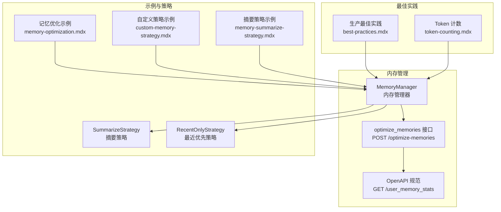
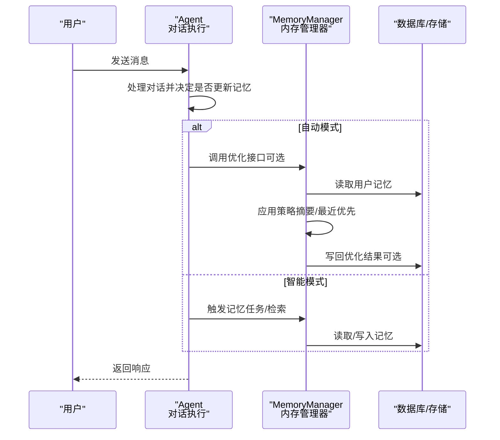
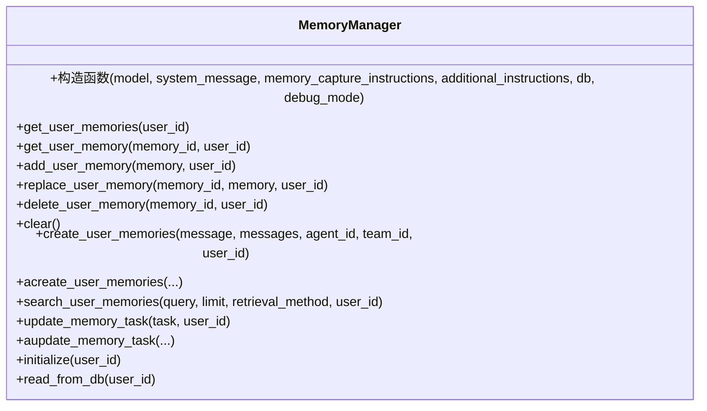
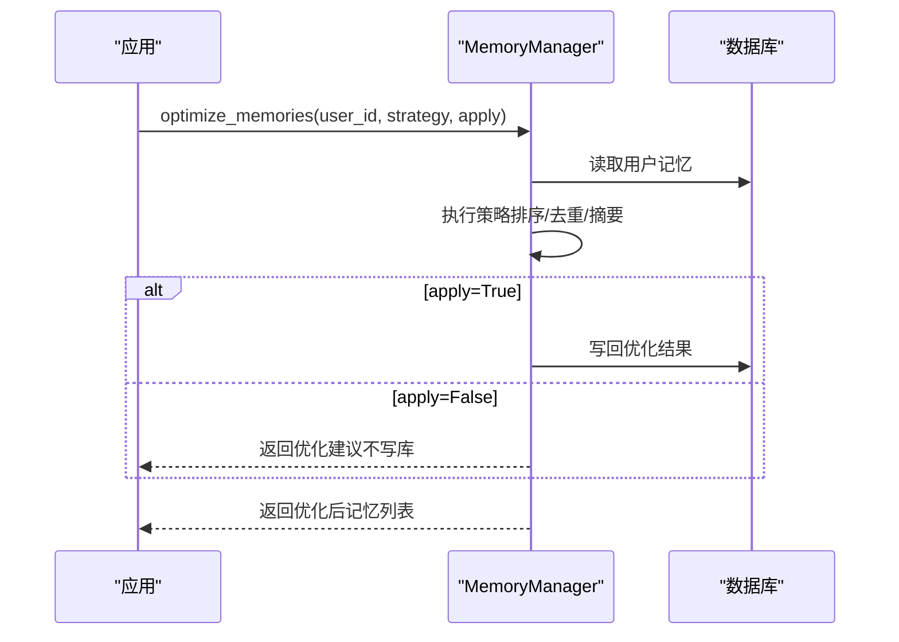
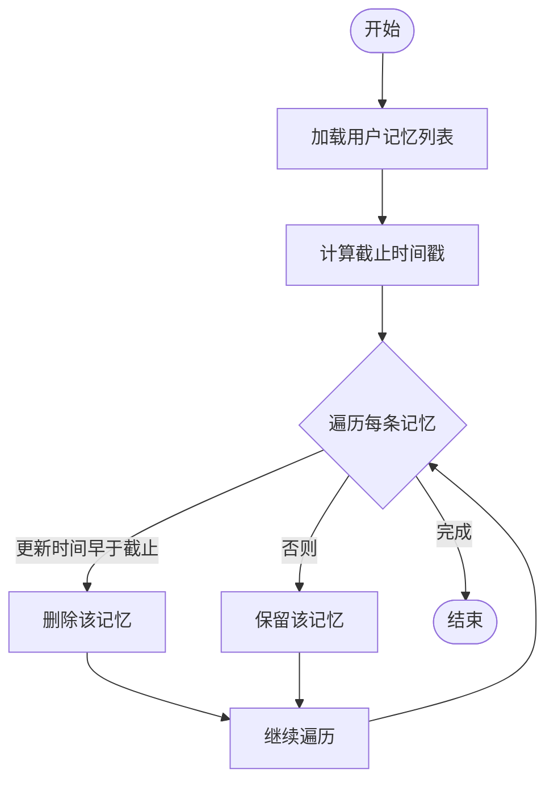
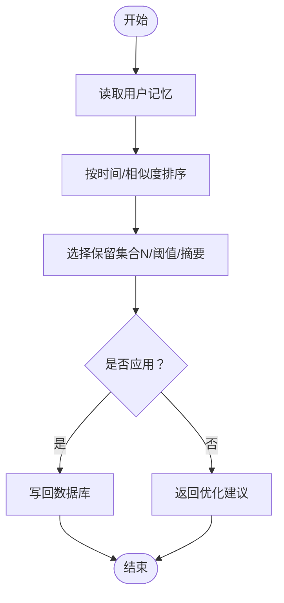
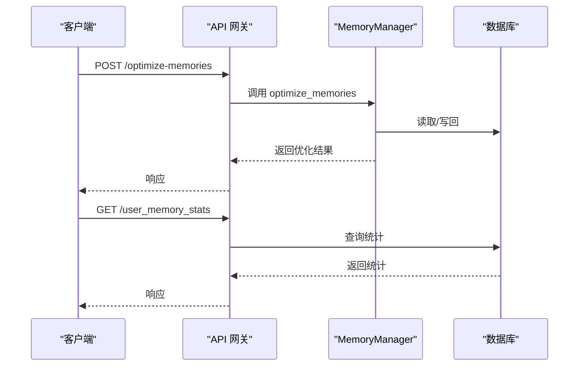
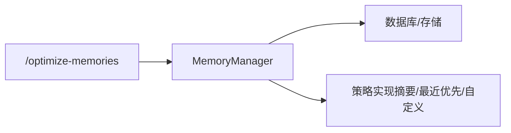

# 用户记忆维护

<cite>
**本文引用的文件**
- [memory-manager-reference.mdx](file://_snippets/memory-manager-reference.mdx)
- [memory-optimization.mdx](file://memory/working-with-memories/memory-optimization.mdx)
- [best-practices.mdx](file://memory/best-practices.mdx)
- [custom-memory-strategy.mdx](file://examples/memory/optimize-memories/custom-memory-strategy.mdx)
- [memory-summarize-strategy.mdx](file://examples/memory/optimize-memories/memory-summarize-strategy.mdx)
- [optimize-user-memories.mdx](file://reference-api/schema/memory/optimize-user-memories.mdx)
- [optimize-user-memories.mdx](file://TBD/pages/reference-api/schema/memory/optimize-user-memories.mdx)
- [openapi.yaml](file://reference-api/openapi.yaml)
- [token-counting.mdx](file://compression/token-counting.mdx)
</cite>

## 目录
1. [简介](#简介)
2. [项目结构](#项目结构)
3. [核心组件](#核心组件)
4. [架构总览](#架构总览)
5. [详细组件分析](#详细组件分析)
6. [依赖关系分析](#依赖关系分析)
7. [性能考量](#性能考量)
8. [故障排查指南](#故障排查指南)
9. [结论](#结论)
10. [附录](#附录)

## 简介
本技术文档围绕“用户记忆维护”的生命周期管理与维护策略展开，重点覆盖以下方面：
- 记忆的积累：自动与智能两种模式下的记忆生成与写入流程
- 记忆的清理与优化：基于时间阈值的清理（prune）与基于语义/统计的优化（deduplicate/summarize）
- Curator 工具的使用：通过 MemoryManager 的 optimize_memories 接口实现记忆优化
- 清理策略与参数：max_age_days 的等价思路与过期记忆处理
- 去重机制：基于相似度与最近优先的策略配置
- 最佳实践与性能优化：成本控制、token 管理、工具调用限制
- 日志与监控：如何观测与告警异常增长
- 业务适配：如何根据场景调整维护策略

## 项目结构
与“用户记忆维护”直接相关的内容主要分布在以下位置：
- 内存管理器参考与 API 定义：_snippets/memory-manager-reference.mdx、reference-api/schema/memory/optimize-user-memories.mdx、reference-api/openapi.yaml
- 记忆优化示例：memory/working-with-memories/memory-optimization.mdx、examples/memory/optimize-memories/custom-memory-strategy.mdx、examples/memory/optimize-memories/memory-summarize-strategy.mdx
- 生产最佳实践：memory/best-practices.mdx
- Token 计数与上下文规划：compression/token-counting.mdx

**图表来源**
- [_snippets/memory-manager-reference.mdx:1-58](file://_snippets/memory-manager-reference.mdx#L1-L58)
- [reference-api/schema/memory/optimize-user-memories.mdx:1-3](file://reference-api/schema/memory/optimize-user-memories.mdx#L1-L3)
- [reference-api/openapi.yaml:3694-3740](file://reference-api/openapi.yaml#L3694-L3740)
- [memory/working-with-memories/memory-optimization.mdx:1-137](file://memory/working-with-memories/memory-optimization.mdx#L1-L137)
- [examples/memory/optimize-memories/custom-memory-strategy.mdx:47-166](file://examples/memory/optimize-memories/custom-memory-strategy.mdx#L47-L166)
- [examples/memory/optimize-memories/memory-summarize-strategy.mdx:76-125](file://examples/memory/optimize-memories/memory-summarize-strategy.mdx#L76-L125)
- [memory/best-practices.mdx:1-202](file://memory/best-practices.mdx#L1-L202)
- [compression/token-counting.mdx:1-112](file://compression/token-counting.mdx#L1-L112)

**章节来源**
- [_snippets/memory-manager-reference.mdx:1-58](file://_snippets/memory-manager-reference.mdx#L1-L58)
- [reference-api/schema/memory/optimize-user-memories.mdx:1-3](file://reference-api/schema/memory/optimize-user-memories.mdx#L1-L3)
- [reference-api/openapi.yaml:3694-3740](file://reference-api/openapi.yaml#L3694-L3740)
- [memory/working-with-memories/memory-optimization.mdx:1-137](file://memory/working-with-memories/memory-optimization.mdx#L1-L137)
- [examples/memory/optimize-memories/custom-memory-strategy.mdx:47-166](file://examples/memory/optimize-memories/custom-memory-strategy.mdx#L47-L166)
- [examples/memory/optimize-memories/memory-summarize-strategy.mdx:76-125](file://examples/memory/optimize-memories/memory-summarize-strategy.mdx#L76-L125)
- [memory/best-practices.mdx:1-202](file://memory/best-practices.mdx#L1-L202)
- [compression/token-counting.mdx:1-112](file://compression/token-counting.mdx#L1-L112)

## 核心组件
- MemoryManager：负责用户记忆的增删改查、检索与任务式更新；支持通过 optimize_memories 实现批量优化
- 策略体系：SummarizeStrategy（摘要合并）、RecentOnlyStrategy（最近优先保留）
- Curator 工具：通过 optimize_memories 接口实现“修剪/去重/汇总”等维护动作
- API 与监控：/optimize-memories 提供优化入口；/user_memory_stats 提供统计查询

关键职责与接口要点：
- 用户记忆 CRUD：get_user_memories、get_user_memory、add_user_memory、replace_user_memory、delete_user_memory、clear
- 检索与任务：search_user_memories（last_n/first_n/agentic）、update_memory_task
- 优化入口：optimize_memories（strategy 类型或自定义策略，apply 控制是否落库）

**章节来源**
- [_snippets/memory-manager-reference.mdx:1-58](file://_snippets/memory-manager-reference.mdx#L1-L58)
- [reference-api/schema/memory/optimize-user-memories.mdx:1-3](file://reference-api/schema/memory/optimize-user-memories.mdx#L1-L3)
- [reference-api/openapi.yaml:3694-3740](file://reference-api/openapi.yaml#L3694-L3740)

## 架构总览
下图展示从对话到记忆维护的整体流程，以及 Curator（MemoryManager.optimize_memories）在其中的位置。

**图表来源**
- [_snippets/memory-manager-reference.mdx:1-58](file://_snippets/memory-manager-reference.mdx#L1-L58)
- [memory/working-with-memories/memory-optimization.mdx:1-137](file://memory/working-with-memories/memory-optimization.mdx#L1-L137)
- [examples/memory/optimize-memories/custom-memory-strategy.mdx:47-166](file://examples/memory/optimize-memories/custom-memory-strategy.mdx#L47-L166)

## 详细组件分析

### MemoryManager 组件
MemoryManager 是用户记忆生命周期的核心协调者，提供：
- 用户记忆的增删改查与检索
- 任务式记忆更新（update_memory_task）
- 优化入口（optimize_memories），支持内置策略或自定义策略

**图表来源**
- [_snippets/memory-manager-reference.mdx:1-58](file://_snippets/memory-manager-reference.mdx#L1-L58)

**章节来源**
- [_snippets/memory-manager-reference.mdx:1-58](file://_snippets/memory-manager-reference.mdx#L1-L58)

### Curator 工具：optimize_memories 的使用
Curator 在本系统中以 MemoryManager.optimize_memories 的形式体现，支持：
- 内置策略类型（如 SUMMARIZE）
- 自定义策略（实现 aoptimize 接口，按需排序/筛选/聚合）
- apply 参数控制是否将优化结果写回数据库

典型工作流：
- 读取用户记忆列表
- 选择策略（摘要/最近优先/自定义）
- 计算优化前后的 token 数量
- 可选地应用优化结果

**图表来源**
- [memory/working-with-memories/memory-optimization.mdx:78-83](file://memory/working-with-memories/memory-optimization.mdx#L78-L83)
- [examples/memory/optimize-memories/custom-memory-strategy.mdx:130-134](file://examples/memory/optimize-memories/custom-memory-strategy.mdx#L130-L134)
- [examples/memory/optimize-memories/memory-summarize-strategy.mdx:89-93](file://examples/memory/optimize-memories/memory-summarize-strategy.mdx#L89-L93)

**章节来源**
- [memory/working-with-memories/memory-optimization.mdx:1-137](file://memory/working-with-memories/memory-optimization.mdx#L1-L137)
- [examples/memory/optimize-memories/custom-memory-strategy.mdx:47-166](file://examples/memory/optimize-memories/custom-memory-strategy.mdx#L47-L166)
- [examples/memory/optimize-memories/memory-summarize-strategy.mdx:76-125](file://examples/memory/optimize-memories/memory-summarize-strategy.mdx#L76-L125)

### 记忆清理策略与参数
- max_age_days 的等价实现：通过时间戳比较进行“修剪”（prune）。示例中以 days 参数控制过期阈值，删除早于截止时间的记忆。
- 过期记忆处理：先读取全部记忆，再逐条判断更新时间戳是否早于截止时间，满足则删除。
- 建议周期性执行或在高成本操作前触发，避免上下文膨胀导致 token 消耗激增。

**图表来源**
- [memory/best-practices.mdx:119-129](file://memory/best-practices.mdx#L119-L129)

**章节来源**
- [memory/best-practices.mdx:112-130](file://memory/best-practices.mdx#L112-L130)

### 去重机制与配置
- 基于相似度的去重：通过检索方法（如 agentic）识别高度相似的记忆，仅保留一条或合并为摘要
- 基于时间的去重：最近优先策略（RecentOnlyStrategy）按 updated_at 或 created_at 排序，仅保留最新 N 条
- 自定义策略：实现 aoptimize 方法，按业务规则（如主题、时间窗口、token 预算）裁剪或聚合

**图表来源**
- [examples/memory/optimize-memories/custom-memory-strategy.mdx:47-58](file://examples/memory/optimize-memories/custom-memory-strategy.mdx#L47-L58)
- [examples/memory/optimize-memories/memory-summarize-strategy.mdx:89-93](file://examples/memory/optimize-memories/memory-summarize-strategy.mdx#L89-L93)

**章节来源**
- [examples/memory/optimize-memories/custom-memory-strategy.mdx:47-166](file://examples/memory/optimize-memories/custom-memory-strategy.mdx#L47-L166)
- [examples/memory/optimize-memories/memory-summarize-strategy.mdx:76-125](file://examples/memory/optimize-memories/memory-summarize-strategy.mdx#L76-L125)

### API 与监控
- 优化接口：POST /optimize-memories，用于触发记忆优化
- 统计接口：GET /user_memory_stats，用于查询用户记忆统计信息（如数量、大小等）
- 建议：结合 token 计数估算与上下文压缩，在运行时动态评估是否需要优化

**图表来源**
- [reference-api/schema/memory/optimize-user-memories.mdx:1-3](file://reference-api/schema/memory/optimize-user-memories.mdx#L1-L3)
- [reference-api/openapi.yaml:3694-3740](file://reference-api/openapi.yaml#L3694-L3740)

**章节来源**
- [reference-api/schema/memory/optimize-user-memories.mdx:1-3](file://reference-api/schema/memory/optimize-user-memories.mdx#L1-L3)
- [reference-api/openapi.yaml:3694-3740](file://reference-api/openapi.yaml#L3694-L3740)

## 依赖关系分析
- MemoryManager 依赖数据库层（BaseDb）进行持久化
- 策略实现可独立扩展，通过统一的 optimize 入口接入
- API 层提供对外访问，便于集成到服务端或 CLI 工具

**图表来源**
- [_snippets/memory-manager-reference.mdx:1-58](file://_snippets/memory-manager-reference.mdx#L1-L58)
- [memory/working-with-memories/memory-optimization.mdx:73-76](file://memory/working-with-memories/memory-optimization.mdx#L73-L76)

**章节来源**
- [_snippets/memory-manager-reference.mdx:1-58](file://_snippets/memory-manager-reference.mdx#L1-L58)
- [memory/working-with-memories/memory-optimization.mdx:73-76](file://memory/working-with-memories/memory-optimization.mdx#L73-L76)

## 性能考量
- 成本控制
  - 默认采用自动记忆（update_memory_on_run=True），减少嵌套 LLM 调用
  - 对于需要实时记忆更新的场景，使用低成本模型进行记忆操作，主对话仍可用高性能模型
- 上下文与 token 管理
  - 使用 token 计数估算，结合 compress_token_limit 在运行时触发压缩
  - 通过优化策略（摘要/最近优先）降低上下文长度
- 工具调用限制
  - 设置 tool_call_limit，防止过度记忆操作导致 token 激增
- 周期性清理
  - 定期执行 prune（按天数阈值），避免历史冗余占用资源

**章节来源**
- [memory/best-practices.mdx:54-94](file://memory/best-practices.mdx#L54-L94)
- [compression/token-counting.mdx:94-98](file://compression/token-counting.mdx#L94-L98)

## 故障排查指南
- 常见陷阱
  - 忘记传入 user_id 导致多用户共享记忆
  - 同时启用 update_memory_on_run 与 enable_agentic_memory，后者会覆盖前者行为
- 监控与告警
  - 定期检查用户记忆数量，超过阈值时触发告警并建议执行优化
  - 结合 token 计数估算，发现异常增长及时干预
- 修复建议
  - 明确传入 user_id
  - 选择单一记忆模式（自动或智能）
  - 在高成本操作前执行 prune 或 optimize

**章节来源**
- [memory/best-practices.mdx:144-196](file://memory/best-practices.mdx#L144-L196)

## 结论
用户记忆维护的关键在于“积累有度、清理有序、优化有效”。通过 MemoryManager 的 optimize_memories 接口，结合摘要与最近优先等策略，可在保证上下文质量的同时显著降低 token 消耗与成本。配合定期清理、工具调用限制与监控告警，可构建稳定高效的长期记忆系统。

## 附录
- 业务适配建议
  - 新用户：默认自动记忆 + 周期性摘要优化
  - 高频交互：开启智能记忆但使用低成本模型进行记忆操作
  - 长尾数据：定期按天数阈值清理，保留最近 N 条
  - 大规模部署：结合 token 计数与上下文压缩，动态触发优化